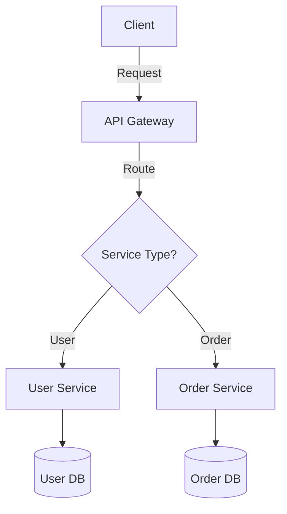

# System Design Documentation Improvement Plan

**Created:** 2026-02-09
**Status:** Ready for Implementation
**Goal:** Improve completion from 42% to 85%+ with consistent quality
**Timeline:** 8-12 weeks (phased approach)

---

## Executive Summary

Based on comprehensive analysis, the system design documentation needs:
- **56 new/updated files** to reach 85% completion
- **~85-100 hours** of focused content creation
- **Elimination of redundancies** across 4 sections
- **Standardization** of format and quality

**Current State:** 28 complete / 67 total (42%)
**Target State:** 57+ complete / 67 total (85%+)

---

## Phase 1: Critical Infrastructure (Weeks 1-4)

**Goal:** Fill the most impactful gaps that block other sections
**Effort:** ~35 hours
**Priority:** HIGHEST

### 1.1 Database Sharding (HIGH PRIORITY)
**File:** `docs/system-design/data/databases/sharding.md`
**Current:** Marked "Planned", 0 lines
**Target:** 500+ lines, comprehensive guide

**Must Include:**
```markdown
## Required Sections:
1. What is Sharding? (Overview)
   - Definition with visual diagram
   - Horizontal vs vertical partitioning
   - When to shard (traffic thresholds)

2. Sharding Strategies
   - Range-based sharding (user_id 1-1000, 1001-2000)
   - Hash-based sharding (consistent hashing)
   - Geographic sharding (US, EU, APAC)
   - Directory-based sharding (lookup table)

3. Shard Key Selection (CRITICAL)
   - Criteria: even distribution, query patterns, growth
   - Examples: user_id, tenant_id, geographic region
   - Anti-patterns: timestamp (hot shard), random (cross-shard queries)

4. Implementation Examples
   - PostgreSQL with Citus extension
   - MySQL with ProxySQL
   - MongoDB native sharding
   - Code examples for each

5. Challenges & Solutions
   - Resharding (adding/removing shards)
   - Hot shard mitigation
   - Cross-shard queries and joins
   - Distributed transactions

6. Real-World Case Studies
   - Instagram: user_id sharding, 4000+ shards
   - Uber: geohash sharding for ride matching
   - Discord: snowflake ID generation

7. Interview Questions
   - "How would you shard a social network?"
   - "What happens when a shard gets too large?"
```

**Diagrams Needed:**
- Shard distribution visualization
- Resharding process flow
- Hot shard detection and mitigation

**Code Examples:**
- Shard key calculation (Python, Go)
- Consistent hashing implementation
- Query routing logic

**Estimated Time:** 6-8 hours

---

### 1.2 Kubernetes & Container Orchestration (HIGH PRIORITY)
**File:** `docs/system-design/deployment/containers.md`
**Current:** Marked "Planned", 0 lines
**Target:** 600+ lines, production-ready guide

**Must Include:**
```markdown
## Required Sections:
1. Docker Fundamentals
   - Containers vs VMs
   - Dockerfile best practices
   - Multi-stage builds
   - Image optimization (layer caching, .dockerignore)
   - Registry management (ECR, GCR, Docker Hub)

2. Kubernetes Architecture
   - Control plane (API server, scheduler, controller)
   - Worker nodes (kubelet, kube-proxy)
   - Pod lifecycle
   - Component diagram with Mermaid

3. Core Kubernetes Objects
   - Pods: smallest deployable unit
   - Deployments: declarative updates
   - Services: network abstraction (ClusterIP, NodePort, LoadBalancer)
   - ConfigMaps & Secrets: configuration management
   - Ingress: HTTP routing

4. Deployment Strategies
   - Rolling update (default)
   - Blue-green deployment
   - Canary deployment
   - Implementation with YAML examples

5. Scaling & Auto-scaling
   - Horizontal Pod Autoscaler (HPA)
   - Vertical Pod Autoscaler (VPA)
   - Cluster Autoscaler
   - Metrics-based scaling (CPU, memory, custom metrics)

6. Persistent Storage
   - Volumes and PersistentVolumes
   - StatefulSets for databases
   - Storage classes

7. Monitoring & Observability
   - Prometheus + Grafana setup
   - Logging with Fluentd/Fluent Bit
   - Distributed tracing integration

8. Production Best Practices
   - Resource limits and requests
   - Health checks (liveness, readiness, startup probes)
   - Network policies
   - Security contexts
   - Helm charts for packaging
```

**Diagrams Needed:**
- Kubernetes architecture
- Pod lifecycle states
- Service types comparison
- Deployment strategies visualization

**Code Examples:**
- Dockerfile for Node.js app
- Kubernetes manifests (deployment, service, ingress)
- Helm chart structure
- HPA configuration

**Estimated Time:** 8-10 hours

---

### 1.3 Authorization & Access Control (HIGH PRIORITY)
**File:** `docs/system-design/security/authorization.md`
**Current:** Mentioned, 0 lines
**Target:** 400+ lines, implementation guide

**Must Include:**
```markdown
## Required Sections:
1. Authorization vs Authentication
   - Clear distinction with examples
   - Where each happens in request flow

2. Role-Based Access Control (RBAC)
   - Users, Roles, Permissions model
   - Role hierarchy
   - Implementation examples (database schema)
   - Code: checking permissions

3. Attribute-Based Access Control (ABAC)
   - Policy-based decisions
   - Attributes: user, resource, environment
   - Use cases: dynamic permissions, complex rules

4. Access Control Lists (ACL)
   - Resource-level permissions
   - Use cases: file systems, document access

5. OAuth 2.0 Authorization
   - Authorization code flow
   - Client credentials flow
   - Token-based authorization
   - Scopes and claims

6. Implementation Patterns
   - Middleware/interceptor pattern
   - Decorator pattern
   - Policy engine (Open Policy Agent)

7. Database Design
   - Schema for users, roles, permissions
   - Many-to-many relationships
   - Permission inheritance

8. Best Practices
   - Principle of least privilege
   - Default deny
   - Audit logging
   - Permission caching strategies
```

**Diagrams Needed:**
- RBAC model diagram
- Authorization flow
- Database schema ER diagram

**Code Examples:**
- RBAC implementation (Node.js, Python)
- Permission checking middleware
- Database queries for authorization

**Estimated Time:** 5-6 hours

---

### 1.4 Distributed Transactions (HIGH PRIORITY)
**File:** `docs/system-design/distributed-systems/distributed-transactions.md`
**Current:** Missing
**Target:** 450+ lines, pattern comparison

**Must Include:**
```markdown
## Required Sections:
1. The Problem
   - Why distributed transactions are hard
   - ACID in distributed systems
   - CAP theorem implications

2. Two-Phase Commit (2PC)
   - Prepare phase
   - Commit phase
   - Coordinator and participants
   - Failure scenarios
   - Blocking nature

3. Saga Pattern
   - Choreography vs Orchestration
   - Compensating transactions
   - Implementation examples
   - When to use vs 2PC

4. Event Sourcing & CQRS
   - Event store as source of truth
   - Command Query Responsibility Segregation
   - Eventual consistency

5. Comparison Matrix
   | Pattern | Consistency | Performance | Complexity | Use When |
   |---------|-------------|-------------|------------|----------|
   | 2PC | Strong | Low | Medium | Banking, payments |
   | Saga | Eventual | High | High | E-commerce, booking |
   | Event Sourcing | Eventual | High | Very High | Audit trail critical |

6. Real-World Examples
   - Booking system: Flight + Hotel + Car rental
   - E-commerce: Order + Inventory + Payment
   - Bank transfer: Debit + Credit

7. Implementation
   - Saga orchestration with temporal.io
   - Event sourcing with Kafka
   - 2PC with XA transactions
```

**Diagrams Needed:**
- 2PC sequence diagram
- Saga choreography vs orchestration
- Event sourcing flow

**Code Examples:**
- Saga implementation (pseudo-code)
- Compensating transaction example
- Event sourcing setup

**Estimated Time:** 6-7 hours

---

### 1.5 API Gateway Patterns (HIGH PRIORITY)
**File:** `docs/system-design/communication/api-gateway.md`
**Current:** Missing
**Target:** 500+ lines, comprehensive guide

**Must Include:**
```markdown
## Required Sections:
1. What is an API Gateway?
   - Single entry point for microservices
   - Request routing and composition
   - When to introduce (complexity threshold)

2. Core Responsibilities
   - Request routing
   - Authentication & authorization
   - Rate limiting & throttling
   - Request/response transformation
   - Caching
   - Load balancing
   - Circuit breaking

3. Gateway Patterns
   - Backend for Frontend (BFF)
   - Gateway aggregation
   - Gateway offloading
   - Gateway routing

4. Popular Tools
   - NGINX
   - Kong
   - AWS API Gateway
   - Envoy
   - Comparison table with features

5. Implementation
   - NGINX configuration examples
   - Kong with plugins
   - Custom gateway with Node.js

6. Performance Considerations
   - Latency impact
   - Caching strategies
   - Connection pooling
   - Async processing

7. Anti-Patterns
   - God gateway (too much logic)
   - Tight coupling to services
   - No fallback for failures
```

**Diagrams Needed:**
- API Gateway architecture
- BFF pattern
- Request flow with gateway

**Code Examples:**
- NGINX routing configuration
- Rate limiting implementation
- Authentication middleware

**Estimated Time:** 5-6 hours

---

## Phase 2: Architecture & Deployment (Weeks 5-7)

**Goal:** Complete architecture patterns and modern deployment practices
**Effort:** ~25 hours
**Priority:** HIGH

### 2.1 Complete Architecture Patterns
**Files to Update:**

#### 2.1.1 Monolithic Architecture
**File:** `docs/system-design/architecture/monolithic.md`
**Target:** 350+ lines

**Content:**
- When monoliths work well (small teams, MVP, startups)
- Deployment simplicity
- Testing strategies (integration tests)
- Scaling limitations (vertical scaling only)
- Migration path to microservices (strangler fig pattern)
- Real examples: Shopify started monolithic, still uses modular monolith
- Code: Example monolithic app structure

**Estimated Time:** 4 hours

---

#### 2.1.2 Microservices Architecture
**File:** `docs/system-design/architecture/microservices.md`
**Current:** Duplicated in fundamentals
**Action:** Consolidate and expand

**Content:**
- Service boundaries (domain-driven design)
- Inter-service communication (sync vs async)
- Service discovery (Consul, etcd, Eureka)
- Data management (database per service)
- Distributed tracing
- Testing strategies (contract testing, consumer-driven contracts)
- Migration from monolith
- Real examples: Netflix, Uber architecture evolution
- Anti-patterns: Distributed monolith, chatty services

**Estimated Time:** 5-6 hours

---

#### 2.1.3 Event-Driven Architecture
**File:** `docs/system-design/architecture/event-driven.md`
**Current:** Duplicated in fundamentals
**Action:** Consolidate and expand

**Content:**
- Event sourcing pattern
- CQRS (Command Query Responsibility Segregation)
- Event bus vs message queue
- Pub/sub patterns
- Event schema evolution
- Event replay and debugging
- Real examples: Airbnb event-driven platform
- Implementation: Kafka, RabbitMQ, AWS EventBridge

**Estimated Time:** 4-5 hours

---

#### 2.1.4 Serverless Architecture
**File:** `docs/system-design/architecture/serverless.md`
**Target:** 400+ lines

**Content:**
- FaaS (Function as a Service) model
- AWS Lambda, Azure Functions, Google Cloud Functions
- Event-driven triggers
- Cold starts and optimization
- Stateless function design
- Cost model (pay-per-invocation)
- Use cases: API backends, event processing, scheduled jobs
- Anti-patterns: Long-running processes, stateful operations
- Real examples: iRobot serverless architecture

**Estimated Time:** 4 hours

---

### 2.2 Infrastructure as Code
**File:** `docs/system-design/deployment/infrastructure.md`
**Current:** Mentioned, minimal content
**Target:** 500+ lines

**Content:**
```markdown
## Terraform Deep Dive
1. Core Concepts
   - Providers, resources, data sources
   - Variables and outputs
   - State management (local, remote)

2. Best Practices
   - Module structure
   - State file security
   - Workspaces for environments
   - Sensitive data handling

3. Example Infrastructure
   - VPC with subnets
   - ECS cluster
   - RDS database
   - Complete working example

4. Alternative Tools
   - AWS CloudFormation
   - Pulumi (infrastructure as actual code)
   - Ansible (configuration management)
   - Comparison matrix

5. CI/CD Integration
   - Terraform in pipelines
   - Plan → Review → Apply workflow
   - Drift detection
```

**Code Examples:**
- Complete Terraform module
- CloudFormation template
- Pulumi TypeScript example

**Estimated Time:** 6-7 hours

---

## Phase 3: Observability & Messaging (Weeks 8-9)

**Goal:** Complete monitoring, logging, tracing, and messaging
**Effort:** ~20 hours
**Priority:** MEDIUM

### 3.1 Logging & Aggregation
**File:** `docs/system-design/observability/logging.md`
**Target:** 450+ lines

**Content:**
```markdown
1. Structured Logging
   - JSON format
   - Log levels (DEBUG, INFO, WARN, ERROR)
   - Contextual information (request_id, user_id)

2. ELK Stack (Elasticsearch, Logstash, Kibana)
   - Architecture overview
   - Log collection with Filebeat
   - Log parsing and enrichment
   - Index patterns and retention
   - Kibana dashboards

3. Alternative Stacks
   - Grafana Loki (metrics-like approach)
   - Splunk
   - Datadog
   - CloudWatch Logs

4. Best Practices
   - Structured vs unstructured
   - Sampling for high-volume logs
   - PII redaction
   - Log retention policies
   - Cost optimization

5. Implementation
   - Winston/Bunyan setup (Node.js)
   - Python logging configuration
   - Correlation ID propagation
```

**Diagrams:** ELK architecture, log flow
**Estimated Time:** 5-6 hours

---

### 3.2 Distributed Tracing
**File:** `docs/system-design/observability/tracing.md`
**Target:** 400+ lines

**Content:**
```markdown
1. Why Distributed Tracing?
   - Debugging microservices
   - Latency analysis
   - Service dependency mapping

2. OpenTelemetry
   - Traces, spans, context propagation
   - Automatic instrumentation
   - Manual instrumentation

3. Jaeger
   - Architecture (agent, collector, query, UI)
   - Setup and configuration
   - Trace visualization

4. Implementation
   - Instrument Node.js app
   - Instrument Python app
   - Context propagation across services
   - Sampling strategies

5. Best Practices
   - What to trace vs what to log
   - Sampling rates
   - Performance impact
   - Trace retention
```

**Diagrams:** Distributed trace visualization, Jaeger architecture
**Estimated Time:** 5 hours

---

### 3.3 Alerting Strategies
**File:** `docs/system-design/observability/alerting.md`
**Target:** 350+ lines

**Content:**
```markdown
1. Alerting Philosophy
   - Alert on symptoms, not causes
   - Actionable alerts only
   - Alert fatigue prevention

2. SLO-Based Alerting
   - SLI, SLO, SLA definitions
   - Error budget
   - Burn rate alerts
   - Multi-window multi-burn-rate

3. Alert Rules
   - Prometheus alerting rules
   - Threshold-based alerts
   - Anomaly detection
   - Alert grouping and routing

4. On-Call Management
   - Escalation policies
   - Runbook integration
   - Incident response
   - Post-mortem culture

5. Tools
   - PagerDuty
   - Opsgenie
   - AlertManager
   - Comparison

6. Examples
   - High error rate alert
   - Latency P95 degradation
   - Disk space warning
```

**Estimated Time:** 4 hours

---

### 3.4 Message Queue & Event Streaming
**File:** `docs/system-design/communication/messaging/patterns.md`
**Current:** Minimal
**Target:** 500+ lines expansion

**Content:**
```markdown
1. Messaging Patterns
   - Point-to-point (queue)
   - Publish-subscribe
   - Request-reply
   - Priority queue

2. Kafka Deep Dive
   - Topics and partitions
   - Producers and consumers
   - Consumer groups
   - Exactly-once semantics
   - Compaction

3. RabbitMQ
   - Exchanges (direct, topic, fanout, headers)
   - Queues and bindings
   - Acknowledgments
   - DLQ (dead letter queue)

4. Cloud Services
   - AWS SQS, SNS, Kinesis
   - Google Pub/Sub
   - Azure Service Bus
   - Comparison matrix

5. Patterns
   - Competing consumers
   - Claim check
   - Priority queue
   - Request-reply
   - Saga choreography

6. Best Practices
   - Idempotent message processing
   - Message ordering guarantees
   - Error handling and retries
   - Schema evolution
```

**Code Examples:**
- Kafka producer/consumer (Java, Python)
- RabbitMQ pub/sub
- SQS polling and processing

**Estimated Time:** 6-7 hours

---

## Phase 4: Advanced Topics & Polish (Weeks 10-12)

**Goal:** Complete remaining topics and improve quality
**Effort:** ~25 hours
**Priority:** MEDIUM-LOW

### 4.1 Distributed Locks
**File:** `docs/system-design/distributed-systems/distributed-locks.md`
**Target:** 350+ lines

**Content:**
- Distributed mutex problem
- Redlock algorithm (Redis-based)
- etcd-based locks
- Zookeeper locks
- Fencing tokens
- Implementation examples
- When to use vs alternatives

**Estimated Time:** 4 hours

---

### 4.2 Chaos Engineering
**File:** `docs/system-design/reliability/chaos-engineering.md`
**Target:** 400+ lines

**Content:**
- Principles of chaos engineering
- Chaos Monkey, Chaos Kong (Netflix)
- Experiment design
- Failure injection techniques
- Tools: Gremlin, Chaos Mesh, LitmusChaos
- Running chaos experiments safely
- Measuring resilience improvements

**Estimated Time:** 4-5 hours

---

### 4.3 Disaster Recovery
**File:** `docs/system-design/reliability/disaster-recovery.md`
**Target:** 400+ lines

**Content:**
- RTO (Recovery Time Objective)
- RPO (Recovery Point Objective)
- Backup strategies (full, incremental, differential)
- Multi-region failover
- Data replication (sync vs async)
- Recovery testing (disaster recovery drills)
- Cost vs availability trade-offs

**Estimated Time:** 4-5 hours

---

### 4.4 Security Expansions

#### Encryption
**File:** `docs/system-design/security/encryption.md`
**Target:** 400+ lines

**Content:**
- Symmetric vs asymmetric encryption
- TLS/SSL (certificate management, mTLS)
- At-rest encryption (database, file systems)
- In-transit encryption
- Key management (AWS KMS, HashiCorp Vault)
- End-to-end encryption

**Estimated Time:** 4-5 hours

---

#### API Security
**File:** `docs/system-design/security/api-security.md`
**Target:** 350+ lines

**Content:**
- API authentication (API keys, JWT, OAuth)
- Rate limiting implementation
- Request signing
- CORS and CSRF
- Input validation
- Security headers
- DDoS mitigation

**Estimated Time:** 4 hours

---

#### Common Attacks & Mitigation
**File:** `docs/system-design/security/common-attacks.md`
**Target:** 500+ lines

**Content:**
- OWASP Top 10 (2023)
- SQL injection prevention
- XSS (Cross-Site Scripting) prevention
- CSRF tokens
- Authentication attacks (brute force, credential stuffing)
- DDoS mitigation strategies
- Real-world breach case studies

**Estimated Time:** 5-6 hours

---

### 4.5 Networking Completions

#### DNS & Service Discovery
**File:** `docs/system-design/networking/dns.md`
**Target:** 350+ lines

**Content:**
- DNS hierarchy and resolution
- Route 53, Cloudflare DNS
- Geo-routing and failover
- Health checks
- Service discovery patterns
- Consul, etcd, Eureka

**Estimated Time:** 4 hours

---

#### Protocol Deep Dive
**File:** `docs/system-design/networking/protocols.md`
**Target:** 400+ lines

**Content:**
- TCP vs UDP
- HTTP/1.1 vs HTTP/2 vs HTTP/3
- WebSocket protocol
- gRPC and Protocol Buffers
- QUIC protocol
- Protocol selection guide

**Estimated Time:** 4-5 hours

---

## Phase 5: Redundancy Elimination & Reorganization (Concurrent)

**Goal:** Consolidate duplicated content, improve navigation
**Effort:** ~8 hours
**Priority:** HIGH (can run parallel with content creation)

### 5.1 Eliminate Redundancy

#### Move Microservices to Architecture
**Action:**
1. Consolidate `fundamentals/microservices.md` into `architecture/microservices.md`
2. Update `fundamentals/index.md` to link to architecture section
3. Delete `fundamentals/microservices.md`
4. Update all cross-references

**Estimated Time:** 1 hour

---

#### Consolidate Event-Driven
**Action:**
1. Merge `fundamentals/event-driven-architecture.md` into `architecture/event-driven.md`
2. Keep high-level overview in fundamentals, detailed guide in architecture
3. Update cross-references

**Estimated Time:** 1 hour

---

#### Clarify API Design Scope
**Action:**
1. `fundamentals/api-design.md`: Keep overview and comparison (REST vs GraphQL vs gRPC)
2. `communication/api-design/`: Move detailed patterns here
3. Add section on API versioning, error handling patterns
4. Clear navigation between them

**Estimated Time:** 2 hours

---

### 5.2 Create Global Learning Path
**File:** `docs/system-design/learning-path.md` (new)
**Target:** 400+ lines

**Content:**
```markdown
## Beginner Path (Weeks 1-4)
1. Fundamentals
   - CAP theorem
   - Scalability principles
   - Basic networking

2. Single-Server Systems
   - Monolithic architecture
   - Database basics
   - Caching fundamentals

3. First Scale
   - Load balancing
   - Database replication
   - CDN introduction

## Intermediate Path (Weeks 5-10)
4. Distributed Systems
   - Microservices
   - Consistent hashing
   - Consensus algorithms

5. Data at Scale
   - Database sharding
   - Message queues
   - Event-driven architecture

6. Reliability
   - Fault tolerance patterns
   - Circuit breakers
   - Disaster recovery

## Advanced Path (Weeks 11-16)
7. Global Scale
   - Multi-region deployment
   - Eventual consistency
   - Global load balancing

8. Advanced Topics
   - Distributed transactions
   - Chaos engineering
   - Performance optimization

9. Security & Compliance
   - Zero-trust architecture
   - Encryption strategies
   - Compliance (GDPR, SOC2)
```

**Estimated Time:** 3 hours

---

### 5.3 Standardize Format
**Action:** Update all index files to consistent format

**Template:**
```markdown
# Section Title

**Overview sentence**

---

## 🎯 Learning Objectives

- [ ] Objective 1
- [ ] Objective 2

---

## 📚 Topics

### 1. Topic Name 🟢/🟡/🔴
**Brief description**

**Key Concepts:**
- Bullet points

**File:** [link](path)

**Time:** X hours | **Interview:** ⭐⭐⭐⭐⭐

---

## 🎓 Learning Path

[Mermaid diagram or ordered list]

---

## 📖 Quick Reference

[Table or cheatsheet]

---

## 🚀 Next Steps

[Where to go after completing this section]
```

**Estimated Time:** 4 hours (apply to all index files)

---

## Implementation Guidelines

### Content Creation Standards

#### 1. Structure Every File Consistently
```markdown
# Topic Title

**One-sentence summary with bold key benefit**

**Difficulty:** 🟢/🟡/🔴 | **Time:** X hours | **Prerequisites:** [Links]

---

## Overview
[2-3 paragraphs explaining what, why, when]

---

## Key Concepts
[Core ideas with bullet points]

---

## Deep Dive
[Main content sections]

---

## Implementation
[Code examples, configurations]

---

## Best Practices
[Do's and don'ts]

---

## Common Pitfalls
[What to avoid]

---

## Real-World Examples
[Company case studies]

---

## Interview Questions
[Common questions with strong answers]

---

## References
[Links to authoritative sources]
```

---

#### 2. Diagram Requirements

**Every section must have:**
- At least 1 Mermaid diagram
- Architecture diagrams for system components
- Flow diagrams for processes
- Sequence diagrams for interactions

**Example Mermaid Syntax:**
```markdown

\```
```

---

#### 3. Code Example Standards

**Requirements:**
- Runnable code (not pseudocode)
- Multiple languages where appropriate (Python, JavaScript, Go, Java)
- Comments explaining non-obvious parts
- Error handling shown
- Configuration examples

**Example:**
```python
from redis import Redis
from redis.lock import Lock

def process_with_lock(resource_id, timeout=10):
    """
    Process a resource with distributed lock.

    Args:
        resource_id: Unique identifier for the resource
        timeout: Lock acquisition timeout in seconds
    """
    redis_client = Redis(host='localhost', port=6379)
    lock = Lock(redis_client, f"lock:{resource_id}", timeout=timeout)

    if lock.acquire(blocking=True, blocking_timeout=timeout):
        try:
            # Critical section
            result = process_resource(resource_id)
            return result
        finally:
            lock.release()
    else:
        raise TimeoutError(f"Could not acquire lock for {resource_id}")
```

---

#### 4. Real-World Examples Required

Each major topic must include:
- **Company examples:** How Netflix/Uber/Instagram solved this
- **Metrics:** Specific numbers (QPS, latency, data volume)
- **Evolution:** How the system scaled over time
- **Lessons learned:** What went wrong, what went right

---

#### 5. Interview Preparation

Every file should end with:
```markdown
## 🎤 Interview Questions

### Question 1: [Common Interview Question]
**Strong Answer:**
[Structured answer with:
1. Define the problem
2. Discuss trade-offs
3. Provide solution
4. Scale considerations
5. Real-world example]

**Follow-up:** [Likely follow-up question]
**Answer:** [Brief response]
```

---

## Tracking & Progress

### Progress Dashboard
Create: `docs/system-design/PROGRESS.md`

```markdown
# System Design Documentation Progress

**Last Updated:** [Date]

## Overall Progress
- **Complete:** 57 / 67 (85%)
- **In Progress:** 5 / 67 (7%)
- **Planned:** 5 / 67 (7%)

## Section Status

| Section | Complete | In Progress | Planned | %Done |
|---------|----------|-------------|---------|-------|
| Fundamentals | 9/9 | 0 | 0 | 100% |
| Architecture | 5/6 | 1 | 0 | 83% |
| Networking | 5/5 | 0 | 0 | 100% |
| Data | 8/9 | 1 | 0 | 89% |
| Distributed Systems | 4/5 | 1 | 0 | 80% |
| Communication | 4/5 | 1 | 0 | 80% |
| Deployment | 4/4 | 0 | 0 | 100% |
| Observability | 4/4 | 0 | 0 | 100% |
| Scalability | 4/4 | 0 | 0 | 100% |
| Performance | 3/5 | 1 | 1 | 60% |
| Reliability | 3/4 | 1 | 0 | 75% |
| Security | 5/6 | 1 | 0 | 83% |

## Phase Status

- [x] Phase 1: Critical Infrastructure (Complete)
- [ ] Phase 2: Architecture & Deployment (In Progress)
- [ ] Phase 3: Observability & Messaging (Not Started)
- [ ] Phase 4: Advanced Topics (Not Started)
- [ ] Phase 5: Redundancy Elimination (Not Started)
```

---

## Resource Requirements

### Time Estimates by Role

**Content Creator:**
- Phase 1: 35 hours
- Phase 2: 25 hours
- Phase 3: 20 hours
- Phase 4: 25 hours
- Phase 5: 8 hours
- **Total:** 113 hours (~14 days at 8 hours/day)

**Technical Reviewer:**
- Review all new content: 20 hours
- Verify code examples: 10 hours
- Test links and navigation: 5 hours
- **Total:** 35 hours

**Editor:**
- Consistency check: 10 hours
- Diagram review: 5 hours
- **Total:** 15 hours

---

## Quality Gates

### Before Marking "Complete"
Every file must pass:

- [ ] **Content Complete:** All required sections present
- [ ] **Code Tested:** All code examples run successfully
- [ ] **Diagrams Present:** Minimum 1 Mermaid diagram
- [ ] **Cross-Links:** All internal links work
- [ ] **External References:** At least 3 authoritative sources
- [ ] **Interview Section:** Questions and answers included
- [ ] **Real-World Examples:** At least 1 company case study
- [ ] **Spell Check:** No grammar or spelling errors
- [ ] **Peer Review:** Technical review completed

---

## Success Metrics

### Target Metrics (End State)

**Quantitative:**
- Completion: 85%+ (57+ of 67 topics)
- Average file length: 400+ lines
- Diagrams: 1+ per file (70+ total)
- Code examples: 100+ across all files
- Real-world examples: 50+ company references

**Qualitative:**
- Consistent formatting across all sections
- Clear learning progression
- Production-ready examples
- Interview readiness
- No redundant content

---

## Next Steps

### Immediate Actions (Week 1)

1. **Set up working environment**
   - Clone repository
   - Set up markdown editor with preview
   - Install mermaid-cli for diagram preview

2. **Start Phase 1, Task 1.1: Database Sharding**
   - Research: Read Instagram, Uber sharding blog posts
   - Draft outline following template
   - Write content sections
   - Add diagrams
   - Write code examples
   - Review and edit
   - Mark complete

3. **Create progress tracking**
   - Set up PROGRESS.md
   - Update weekly
   - Share with team

4. **Schedule reviews**
   - Technical review: Bi-weekly
   - Editorial review: End of each phase

---

## Appendix A: Research Resources

### Essential Reading
1. **Books:**
   - "Designing Data-Intensive Applications" by Martin Kleppmann
   - "System Design Interview" by Alex Xu (Vol 1 & 2)
   - "Building Microservices" by Sam Newman

2. **Blogs:**
   - Netflix Tech Blog
   - Uber Engineering Blog
   - Instagram Engineering Blog
   - ByteByteGo (Alex Xu)

3. **Courses:**
   - Grokking the System Design Interview (Educative.io)
   - System Design for Interviews and Beyond (Exponent)

### Case Study Sources
- High Scalability (highscalability.com)
- Engineering blogs of FAANG companies
- AWS/GCP/Azure architecture centers

---

## Appendix B: File Template

Save as: `.templates/system-design-topic.md`

```markdown
# [Topic Name]

**[One sentence benefit statement in bold]**

**Difficulty:** 🟢/🟡/🔴 | **Time:** X-Y hours | **Prerequisites:** [Links]

---

## Overview

[2-3 paragraphs: What is it? Why does it matter? When to use?]

---

## Key Concepts

[Core concepts as bullet points or subsections]

---

## [Main Content Sections]

[Detailed explanation with subsections]

---

## Implementation

### [Technology/Framework Name]

```[language]
[Runnable code example with comments]
\```

---

## Architecture Diagram

```mermaid
[Diagram showing system components]
\```

---

## Real-World Example

**Company:** [Name]
**Scale:** [Numbers: QPS, users, data volume]
**Challenge:** [What problem they solved]
**Solution:** [How they solved it]
**Outcome:** [Results with metrics]

**Source:** [Link to blog post/talk]

---

## Best Practices

✅ **Do:**
- [Practice 1]
- [Practice 2]

❌ **Don't:**
- [Anti-pattern 1]
- [Anti-pattern 2]

---

## Common Pitfalls

### Pitfall 1: [Name]
**Problem:** [What goes wrong]
**Solution:** [How to avoid]
**Example:** [Real scenario]

---

## Interview Questions

### Question 1: [Common question]
**Strong Answer:**
1. [Define problem]
2. [Discuss trade-offs]
3. [Provide solution]
4. [Scale considerations]

**Follow-up:** [Likely follow-up]
**Answer:** [Brief response]

---

## Related Topics

- [Link to related topic 1]
- [Link to related topic 2]

---

## References

1. [Authoritative source 1](URL)
2. [Authoritative source 2](URL)
3. [Authoritative source 3](URL)

---

**Next:** [Link to next topic in learning path]
```

---

## Document Change Log

| Date | Version | Changes | Author |
|------|---------|---------|--------|
| 2026-02-09 | 1.0 | Initial improvement plan | Analysis Agent |

---

**Ready to start?** Begin with Phase 1, Task 1.1: Database Sharding 🚀
