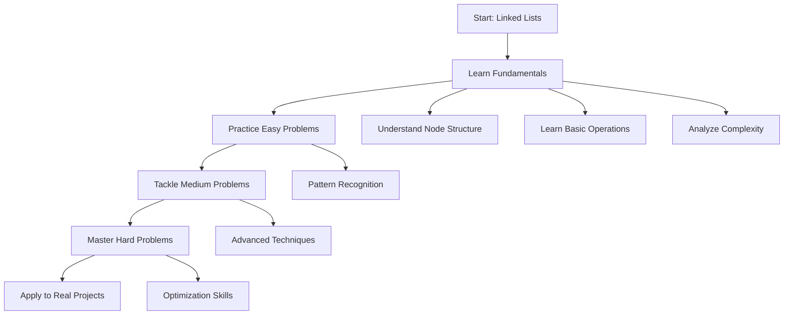

# Linked Lists

## 📚 Overview

A **Linked List** is a fundamental linear data structure where elements are stored in nodes, and each node contains data and a reference to the next node. Unlike arrays, linked lists don't store elements in contiguous memory locations, enabling dynamic memory allocation and efficient insertion/deletion operations.

## 🎯 What You'll Learn

This section covers everything you need to master linked lists:

### 📖 [Fundamentals & Operations](fundamentals.md)

- Types of linked lists (singly, doubly, circular)
- Node structures and implementations
- Basic operations (insertion, deletion, traversal)
- Time and space complexity analysis
- When to use linked lists vs arrays

### 🟢 [Easy Problems](easy-problems.md)

Perfect for beginners to build confidence:

- Reverse Linked List
- Merge Two Sorted Lists
- Remove Duplicates from Sorted List
- Linked List Cycle Detection
- Middle of Linked List

### 🟡 [Medium Problems](medium-problems.md)

Intermediate challenges to deepen understanding:

- Add Two Numbers
- Remove Nth Node from End
- Intersection of Two Linked Lists
- Palindrome Linked List
- Odd Even Linked List

### 🔴 [Hard Problems](hard-problems.md)

Advanced problems for mastery:

- Merge k Sorted Lists
- Reverse Nodes in k-Group
- Copy List with Random Pointer
- LRU Cache Implementation
- Design Linked List

## 🚀 Quick Start

If you're new to linked lists, start with the **[Fundamentals](fundamentals.md)** page to understand the core concepts, then progress through the problem sets based on your comfort level.

## 📊 At a Glance

| **Aspect** | **Linked List** | **Array** |
|------------|-----------------|-----------|
| **Memory** | Scattered | Contiguous |
| **Access** | O(n) | O(1) |
| **Insert/Delete** | O(1) at position | O(n) |
| **Memory Overhead** | Extra pointers | Minimal |
| **Use Case** | Dynamic size, frequent modifications | Random access, cache-friendly |

## 🎓 Learning Path

## 🏆 Success Metrics

Track your progress:

- [ ] Understand all linked list types
- [ ] Implement basic operations from scratch
- [ ] Solve 5+ easy problems independently
- [ ] Solve 3+ medium problems with hints
- [ ] Attempt 1+ hard problem
- [ ] Apply linked lists in a real project

## 💡 Pro Tips

!!! tip "Memory Management"
    Always be mindful of memory leaks in languages like C++. In Python and Java, garbage collection handles cleanup automatically.

!!! warning "Common Pitfalls"
    - Forgetting to handle null pointers
    - Losing references to nodes during operations
    - Off-by-one errors in traversal

!!! success "Best Practices"
    - Use dummy nodes to simplify edge cases
    - Draw diagrams when solving complex problems
    - Practice implementing operations without looking at solutions

---

Ready to dive in? Start with **[Fundamentals & Operations](fundamentals.md)** to build your foundation!
