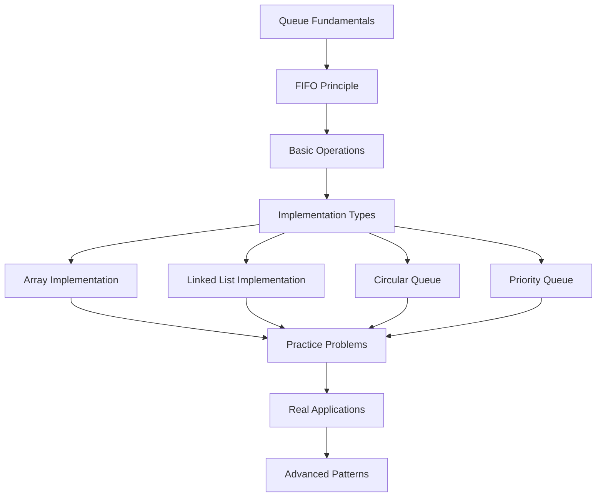

# Queues: Fundamentals & Theory

## 📚 What is a Queue?

A **Queue** is a linear data structure that follows the **First In, First Out (FIFO)** principle. Elements are added at one end (called the **rear** or **back**) and removed from the other end (called the **front**). Think of it like a line at a grocery store - the first person in line is the first person to be served.

## 🔄 FIFO Principle

**First In, First Out** means:

- The **first element** added to the queue is the **first one** to be removed
- Elements are added at the **rear** and removed from the **front**
- You cannot access elements in the middle without removing elements before them

```text
Enqueue (Add):           Dequeue (Remove):
                        
Rear  →  |   |   |   |  ← Front
         | C | B | A |
         +---+---+---+
         
         C added last   A removed first
```

## 🏗️ Core Operations

### Essential Operations

1. **Enqueue**: Add an element to the rear of the queue
   - Time Complexity: O(1) in optimal implementations
   - Space Complexity: O(1)

2. **Dequeue**: Remove and return the front element from the queue
   - Time Complexity: O(1) in optimal implementations
   - Space Complexity: O(1)

3. **Front/Peek**: View the front element without removing it
   - Time Complexity: O(1)
   - Space Complexity: O(1)

4. **isEmpty**: Check if the queue is empty
   - Time Complexity: O(1)
   - Space Complexity: O(1)

5. **Size**: Get the number of elements in the queue
   - Time Complexity: O(1) with proper implementation
   - Space Complexity: O(1)

### Implementation-Specific Details

For concrete implementations with code examples, see:

- **[Array-Based Queue](array-queue.md)**: Simple array implementation with front/rear pointers
- **[Linked List Queue](linked-list-queue.md)**: Dynamic node-based implementation
- **[Circular Queue](circular-queue.md)**: Space-efficient ring buffer approach
- **[Priority Queue](priority-queue.md)**: Element ordering by priority

## 🌟 Types of Queues

### 1. Simple Queue (Linear Queue)

- Basic FIFO implementation
- Elements added at rear, removed from front
- Fixed or dynamic size depending on implementation

### 2. Circular Queue (Ring Buffer)

- Optimizes space usage by reusing positions
- When rear reaches end, it wraps to beginning
- Prevents wasted space in array implementations

### 3. Priority Queue

- Elements have associated priorities
- Higher priority elements are served first
- Not strictly FIFO - priority overrides insertion order

### 4. Double-Ended Queue (Deque)

- Allows insertion and deletion at both ends
- More flexible than standard queue
- Can function as both queue and stack

### 5. Blocking Queue

- Thread-safe queue with blocking operations
- Useful in concurrent programming
- Blocks when empty (dequeue) or full (enqueue)

## ⚡ Time & Space Complexity

| Implementation | Enqueue | Dequeue | Front | Space |
|----------------|---------|---------|--------|-------|
| **Array (Simple)** | O(1) | O(n)* | O(1) | O(n) |
| **Array (Circular)** | O(1) | O(1) | O(1) | O(n) |
| **Linked List** | O(1) | O(1) | O(1) | O(n) |
| **Deque (Built-in)** | O(1) | O(1) | O(1) | O(n) |

*Simple array dequeue is O(n) due to shifting elements

## 🎯 When to Use Queues

### Perfect Scenarios

- **Task Scheduling**: CPU processes, print jobs
- **Breadth-First Search**: Level-order traversal
- **Buffer Management**: IO operations, streaming
- **Request Handling**: Web servers, API calls
- **Message Passing**: Inter-process communication

### Key Characteristics

- **Order matters**: Need to maintain insertion sequence
- **FIFO processing**: First come, first served
- **Producer-Consumer**: One end adds, other removes
- **Buffering**: Temporary storage between processes

## 🔍 Queue vs Other Data Structures

### Queue vs Stack

| Aspect | Queue | Stack |
|--------|-------|-------|
| **Principle** | FIFO (First In, First Out) | LIFO (Last In, First Out) |
| **Operations** | Enqueue/Dequeue | Push/Pop |
| **Access Points** | Two ends (front/rear) | One end (top) |
| **Use Cases** | Scheduling, BFS | Function calls, DFS |

### Queue vs Array

| Aspect | Queue | Array |
|--------|-------|-------|
| **Access** | Only front/rear | Random access by index |
| **Insertion** | Only at rear | Any position |
| **Deletion** | Only from front | Any position |
| **Order** | Maintains insertion order | Flexible ordering |

### Queue vs Linked List

| Aspect | Queue | Linked List |
|--------|-------|-------|
| **Purpose** | FIFO data access | General linear storage |
| **Operations** | Restricted (enqueue/dequeue) | Flexible (insert/delete anywhere) |
| **Interface** | Queue ADT | Linear ADT |
| **Implementation** | Can use linked list internally | Direct node-based structure |

## 🚀 Real-World Applications

### System Programming

- **Process Scheduling**: Operating system task management
- **Buffer Management**: Keyboard input, file I/O
- **Print Queue**: Document printing order
- **CPU Scheduling**: Round-robin algorithm

### Network Programming

- **Packet Processing**: Network router queues
- **Request Queues**: Web server request handling
- **Message Queues**: Distributed system communication
- **Rate Limiting**: API throttling mechanisms

### Algorithm Design

- **Breadth-First Search**: Graph/tree traversal
- **Level-Order Traversal**: Binary tree processing
- **Shortest Path**: BFS-based pathfinding
- **Topological Sorting**: Dependency resolution

### Data Processing

- **Stream Processing**: Real-time data analysis
- **Batch Processing**: Job queue management
- **Cache Systems**: FIFO cache replacement
- **Event Processing**: Event-driven architectures

## 💡 Design Considerations

### Capacity Management

- **Fixed Size**: Prevent memory overflow
- **Dynamic Growth**: Handle varying loads
- **Overflow Handling**: What happens when full?
- **Underflow Handling**: What happens when empty?

### Performance Optimization

- **Memory Layout**: Contiguous vs. fragmented
- **Cache Efficiency**: Locality of reference
- **Thread Safety**: Concurrent access patterns
- **Memory Management**: Allocation strategies

### Error Handling

- **Empty Queue Operations**: Graceful failure modes
- **Full Queue Operations**: Overflow strategies
- **Invalid Operations**: Boundary condition checks
- **Exception vs. Return Codes**: Error reporting methods

## 🎓 Learning Path



## 🏆 Key Takeaways

!!! success "Remember"
    - Queues follow **FIFO** principle strictly
    - Choose implementation based on **use case requirements**
    - **Circular queues** optimize space in array implementations
    - **Priority queues** break FIFO for importance-based processing
    - Common in **system programming** and **algorithm design**

!!! tip "Best Practices"
    - Always check for empty/full conditions
    - Use appropriate implementation for your needs
    - Consider thread safety in concurrent environments
    - Think about error handling strategies upfront

!!! warning "Common Mistakes"
    - Confusing queue with stack operations
    - Not handling edge cases (empty/full)
    - Inefficient implementations (O(n) dequeue)
    - Ignoring memory management in custom implementations

---

**Next Steps**: Choose an implementation approach from the links above, or start with **[Array-Based Queue](array-queue.md)** for a straightforward introduction!
