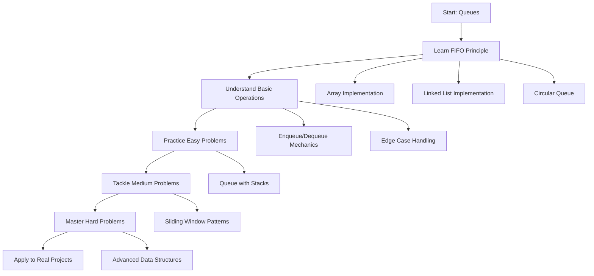

# Queues

## 📚 Overview

A **Queue** is a linear data structure that follows the **First In, First Out (FIFO)** principle. Think of it like a line at a store - the first person in line is the first person to be served. Elements are added at one end (rear/back) and removed from the other end (front).

## 🎯 What You'll Learn

This section covers everything you need to master queues:

### 📖 [Fundamentals & Operations](fundamentals.md)

- Queue concept and FIFO principle
- Implementation using arrays, linked lists, and circular arrays
- Basic operations (enqueue, dequeue, front, rear)
- Types of queues (simple, circular, priority, deque)
- Time and space complexity analysis

### 🟢 [Easy Problems](easy-problems.md)

Perfect for beginners to understand queue applications:

- Implement Queue using Stacks
- Number of Recent Calls
- Design Circular Queue
- Moving Average from Data Stream
- Number of Students Unable to Eat Lunch

### 🟡 [Medium Problems](medium-problems.md)

Intermediate challenges using advanced queue techniques:

- Sliding Window Maximum
- Design Hit Counter
- Shortest Path in Binary Matrix
- Rotting Oranges
- Task Scheduler

### 🔴 [Hard Problems](hard-problems.md)

Advanced problems for queue mastery:

- Sliding Window Median
- Design Phone Directory
- Race Car
- Shortest Path to Get All Keys
- Minimum Window Substring

## 🚀 Quick Start

If you're new to queues, start with **[Fundamentals](fundamentals.md)** to understand the core FIFO concept, then progress through problems based on your comfort level.

## 📊 At a Glance

| **Operation** | **Time Complexity** | **Space Complexity** |
|---------------|-------------------|---------------------|
| **Enqueue** | O(1) | O(1) |
| **Dequeue** | O(1) | O(1) |
| **Front** | O(1) | O(1) |
| **Rear** | O(1) | O(1) |
| **isEmpty** | O(1) | O(1) |
| **Search** | O(n) | O(1) |

## 🎓 Learning Path

## 🔄 Types of Queues

### 1. **Simple Queue (Linear Queue)**

Basic FIFO implementation with front and rear pointers.

### 2. **Circular Queue**

Efficient space utilization by wrapping around when reaching array end.

### 3. **Priority Queue**

Elements are served based on priority rather than insertion order.

### 4. **Double-Ended Queue (Deque)**

Allows insertion and deletion at both ends.

## 🏆 Success Metrics

Track your progress:

- [ ] Understand FIFO principle thoroughly
- [ ] Implement queue using arrays, linked lists, and circular arrays
- [ ] Solve 5+ easy problems independently
- [ ] Master sliding window pattern with queues
- [ ] Solve 3+ medium problems with optimization
- [ ] Understand priority queues and deques

## 💡 Pro Tips

!!! tip "When to Use Queues"
    - **Task scheduling**: Operating systems, print queues
    - **BFS traversal**: Level-order tree/graph traversal
    - **Buffering**: IO operations, streaming data
    - **Request handling**: Web servers, API rate limiting
    - **Sliding window**: Moving averages, range queries

!!! warning "Common Pitfalls"
    - Array-based queues can waste space (use circular queues)
    - Not checking for empty queue before dequeue
    - Confusion between queue and stack operations
    - Inefficient implementation leading to O(n) operations

!!! success "Best Practices"
    - Always check if queue is empty before dequeue/front
    - Use circular queues for fixed-size scenarios
    - Consider deque when you need both-end operations
    - Think about queues for level-by-level processing

## 🔄 Real-World Applications

### System Programming

- **Process scheduling**: CPU task management
- **Buffer management**: IO operations, printer queues
- **Breadth-First Search**: Graph and tree algorithms

### Web Development

- **Request queues**: HTTP request handling
- **Message queues**: Microservices communication
- **Rate limiting**: API request throttling

### Data Processing

- **Stream processing**: Real-time data analysis
- **Cache replacement**: LRU, FIFO cache policies
- **Load balancing**: Distributing requests across servers

---

Ready to dive in? Start with **[Fundamentals & Operations](fundamentals.md)** to build your foundation!
