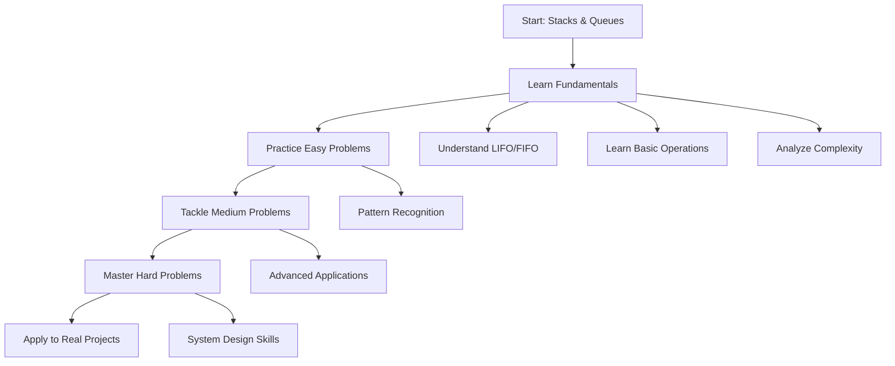

# Stacks & Queues

## 📚 Overview

**Stacks** and **Queues** are fundamental linear data structures that restrict how elements are added and removed, making them perfect for specific use cases that require ordered processing.

## 🎯 What You'll Learn

This section provides comprehensive coverage of both data structures:

### 📖 [Fundamentals & Operations](fundamentals.md)

- Stack concepts and implementations (LIFO)
- Queue concepts and implementations (FIFO)
- Different types of queues (circular, priority, deque)
- Basic operations and complexity analysis
- When to use stacks vs queues

### 🟢 [Easy Problems](easy-problems.md)

Perfect for understanding core concepts:

- Valid Parentheses
- Implement Stack using Queues
- Implement Queue using Stacks
- Min Stack
- Queue using Array

### 🟡 [Medium Problems](medium-problems.md)

Intermediate challenges with real-world applications:

- Evaluate Reverse Polish Notation
- Daily Temperatures  
- Next Greater Element
- Design Circular Queue
- Sliding Window Maximum

### 🔴 [Hard Problems](hard-problems.md)

Advanced problems combining multiple concepts:

- Largest Rectangle in Histogram
- Trapping Rain Water
- Basic Calculator
- Monotonic Stack/Queue patterns
- Advanced system design applications

## 🚀 Quick Start

New to stacks and queues? Begin with **[Fundamentals](fundamentals.md)** to understand the core concepts, then progress through problems based on your comfort level.

## 📊 At a Glance

| **Operation** | **Stack** | **Queue** |
|---------------|-----------|-----------|
| **Insert** | push() - O(1) | enqueue() - O(1) |
| **Remove** | pop() - O(1) | dequeue() - O(1) |
| **Peek/Front** | top() - O(1) | front() - O(1) |
| **Pattern** | LIFO (Last In, First Out) | FIFO (First In, First Out) |
| **Use Cases** | Function calls, undo operations | Process scheduling, BFS |

## 🎓 Learning Path

## 💡 Key Insights

!!! tip "When to Use Stacks"
    - **Function call management** (call stack)
    - **Undo operations** in applications
    - **Expression evaluation** and parsing
    - **Backtracking algorithms**
    - **Browser history** navigation

!!! tip "When to Use Queues"
    - **Process scheduling** in operating systems
    - **Breadth-First Search** in graphs
    - **Buffer for data streams** 
    - **Print job management**
    - **Handling requests** in web servers

!!! warning "Common Pitfalls"
    - Stack overflow from too many recursive calls
    - Queue overflow in fixed-size implementations
    - Forgetting to check empty conditions before pop/dequeue

## 🏆 Success Metrics

Track your progress:

- [ ] Understand LIFO and FIFO principles
- [ ] Implement stacks and queues from scratch
- [ ] Solve 5+ easy problems independently
- [ ] Apply stacks/queues to solve complex problems
- [ ] Recognize when to use each data structure
- [ ] Design systems using stacks and queues

---

Ready to dive in? Start with **[Fundamentals & Operations](fundamentals.md)** to build your foundation!
