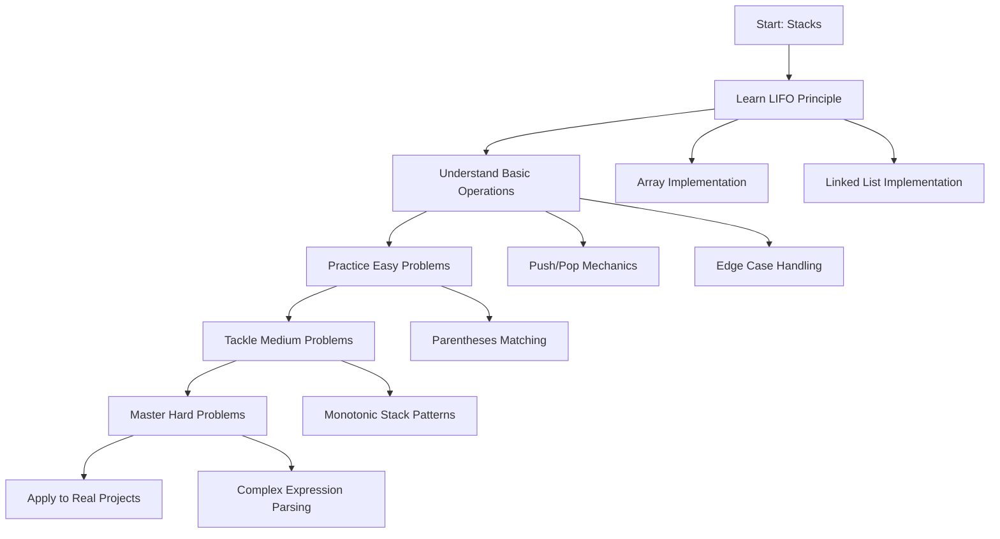

# Stacks

## 📚 Overview

A **Stack** is a linear data structure that follows the **Last In, First Out (LIFO)** principle. Think of it like a stack of plates - you can only add or remove plates from the top. This makes stacks perfect for scenarios where you need to reverse the order of operations or keep track of nested structures.

## 🎯 What You'll Learn

This section covers everything you need to master stacks:

### 📖 [Fundamentals & Operations](fundamentals.md)

- Stack concept and LIFO principle
- Implementation using arrays and linked lists  
- Basic operations (push, pop, peek, isEmpty)
- Time and space complexity analysis
- Applications and use cases

### 🟢 [Easy Problems](easy-problems.md)

Perfect for beginners to understand stack applications:

- Valid Parentheses
- Min Stack
- Remove Outermost Parentheses
- Baseball Game
- Build Array with Stack Operations

### 🟡 [Medium Problems](medium-problems.md)

Intermediate challenges using advanced stack techniques:

- Daily Temperatures
- Next Greater Element
- Evaluate Reverse Polish Notation
- Decode String
- Asteroid Collision

### 🔴 [Hard Problems](hard-problems.md)

Advanced problems for stack mastery:

- Largest Rectangle in Histogram
- Maximal Rectangle
- Basic Calculator
- Trapping Rain Water
- Longest Valid Parentheses

## 🚀 Quick Start

If you're new to stacks, start with **[Fundamentals](fundamentals.md)** to understand the core LIFO concept, then progress through problems based on your comfort level.

## 📊 At a Glance

| **Operation** | **Time Complexity** | **Space Complexity** |
|---------------|-------------------|---------------------|
| **Push** | O(1) | O(1) |
| **Pop** | O(1) | O(1) |
| **Peek/Top** | O(1) | O(1) |
| **isEmpty** | O(1) | O(1) |
| **Search** | O(n) | O(1) |

## 🎓 Learning Path

## 🏆 Success Metrics

Track your progress:

- [ ] Understand LIFO principle thoroughly
- [ ] Implement stack using both arrays and linked lists
- [ ] Solve 5+ easy problems independently
- [ ] Master monotonic stack pattern
- [ ] Solve 3+ medium problems with optimization
- [ ] Attempt 1+ hard problem successfully

## 💡 Pro Tips

!!! tip "When to Use Stacks"
    - **Function calls**: Call stack management
    - **Undo operations**: Text editors, games
    - **Expression evaluation**: Mathematical expressions, compilers
    - **Backtracking**: Maze solving, tree traversal
    - **Parsing**: Nested structures, syntax checking

!!! warning "Common Pitfalls"
    - Stack overflow with recursive calls
    - Not checking for empty stack before pop
    - Forgetting to handle edge cases (empty stack, single element)

!!! success "Best Practices"
    - Always check if stack is empty before pop/peek
    - Use stacks for problems involving "matching" or "nesting"
    - Consider stack when you need to reverse order of processing
    - Think about monotonic stacks for "next greater/smaller" problems

## 🔄 Real-World Applications

### Programming Language Features

- **Function call management**: Call stack
- **Memory management**: Stack frame allocation
- **Expression parsing**: Infix to postfix conversion

### Software Applications

- **Undo/Redo functionality**: Text editors, image editors
- **Browser history**: Back button navigation
- **Compiler design**: Syntax checking, code generation

### Algorithms

- **Depth-First Search (DFS)**: Tree and graph traversal
- **Backtracking algorithms**: N-Queens, Sudoku solving
- **Dynamic Programming**: Some DP problems use stack for optimization

---

Ready to dive in? Start with **[Fundamentals & Operations](fundamentals.md)** to build your foundation!
