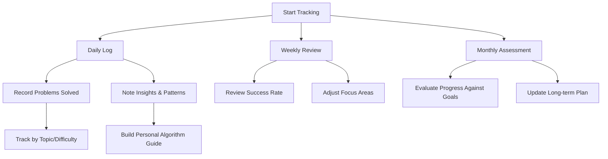
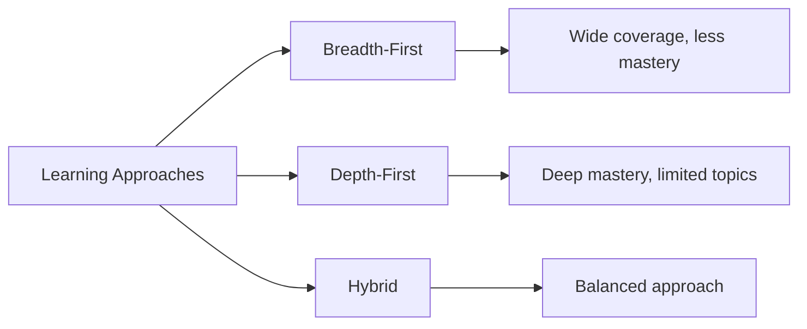
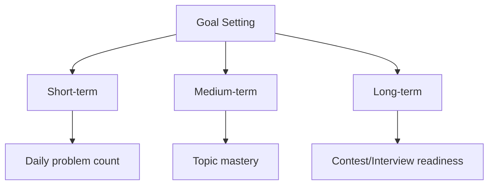

# Preparation Planning 📅

!!! success "Master Your Preparation Process"
    Effective preparation for algorithm mastery, interviews, or competitive programming requires a well-structured plan. This guide helps you create a customized study plan based on your timeline, goals, and current knowledge level.

## Quick Navigation

| Section | What You'll Learn |
|---------|------------------|
| [Creating Your Study Schedule](#creating-your-study-schedule) | Assessment and planning templates |
| [Tracking Progress](#tracking-progress) | Weekly and daily planning tools |
| [Balancing Approaches](#balancing-breadth-and-depth) | Breadth vs depth strategies |
| [Spaced Repetition](#spaced-repetition-strategy) | Memory optimization techniques |
| [Problem Selection](#problem-selection-strategy) | How to choose what to practice |
| [Sample 90-Day Plan](#sample-90-day-plan) | Comprehensive 3-month schedule |

## Creating Your Study Schedule

!!! info "Know Your Starting Point"
    Before creating a schedule, assess your current position to build an effective plan.

### Assessing Your Starting Point

Before planning, assess your current knowledge:

1. **Foundational knowledge**: Data structures, algorithm basics
2. **Problem-solving experience**: Number of problems solved
3. **Language proficiency**: Comfort with your programming language
4. **Time constraints**: Available hours per day/week
5. **Target date**: When you need to be prepared by

### Study Plan Templates

!!! tip "Choose Your Timeline"
    Select the preparation timeline that best matches your schedule and goals.
    Consistency is more important than cramming—regular practice yields better results.

```mermaid
gantt
    title Comparison of Study Plan Options
    dateFormat  W
    axisFormat %w
    
    section 12-Week Plan
    Full Coverage            :a1, 1, 12w
    
    section 4-Week Plan
    Intensive Focus          :a2, 1, 4w
    
    section Weekend Plan
    10 Weekends              :a3, 1, 10w
```



=== "12-Week Comprehensive Plan"

    !!! abstract "Steady Progress Path"
        This plan provides thorough coverage of all algorithm topics with gradual progression in difficulty.
    
    | Week | Focus | Topics | Practice Goals |
    |------|-------|--------|----------------|
    | **1** | Foundations | Arrays, Strings, Time Complexity | 15 easy problems |
    | **2** | Hash Tables | Hash functions, Collision handling | 10 easy, 5 medium problems |
    | **3** | Linked Lists | Singly/Doubly linked, Fast/Slow pointers | 10 easy, 5 medium problems |
    | **4** | Stacks/Queues | Applications, Implementation | 10 easy, 5 medium problems |
    | **5** | Trees | Binary trees, BST, Traversals | 5 easy, 10 medium problems |
    | **6** | Graphs I | Representation, BFS, DFS | 5 easy, 10 medium problems |
    | **7** | Graphs II | Shortest Path, MST, Topological Sort | 5 easy, 10 medium problems |
    | **8** | Dynamic Programming I | Memoization, 1D problems | 5 easy, 10 medium problems |
    | **9** | Dynamic Programming II | 2D problems, Path problems | 5 medium, 5 hard problems |
    | **10** | Greedy & Divide and Conquer | Interval problems, Binary Search | 5 medium, 5 hard problems |
    | **11** | Advanced Topics | Bit manipulation, Math algorithms | 5 medium, 5 hard problems |
    | **12** | Mock Interviews & Review | Mixed topics | 10 medium, 5 hard problems |

=== "4-Week Intensive Plan"

    !!! warning "Accelerated Learning"
        This condensed plan requires significant daily commitment but can prepare you quickly.
    
    | Week | Daily Focus | Morning | Afternoon | Evening |
    |------|-------------|---------|-----------|---------|
    | **1** | Arrays, Strings, Hash Tables | Theory (1h) | Problem solving (2h) | Review (1h) |
    | **2** | Linked Lists, Trees, Stacks/Queues | Problem solving (2h) | Theory (1h) | Mock interview (1h) |
    | **3** | Graphs, Dynamic Programming | Theory (1h) | Problem solving (3h) | Review (1h) |
    | **4** | Mixed Topics, Advanced Problems | Mock interview (1h) | Problem solving (3h) | Review (1h) |
    
    ```mermaid
    pie title Daily Time Allocation
        "Theory" : 25
        "Problem Solving" : 50
        "Review" : 15
        "Mock Interview" : 10
    ```

=== "Weekend Warrior Plan (10 Weekends)"

    !!! note "Part-Time Preparation"
        Perfect for working professionals who can dedicate weekends to focused study.
    
    | Weekend | Saturday | Sunday |
    |---------|----------|--------|
    | **1** | Arrays & Strings (4h) | Hash Tables (4h) |
    | **2** | Linked Lists (4h) | Stacks & Queues (4h) |
    | **3** | Binary Trees (4h) | BST & Heaps (4h) |
    | **4** | Graph Representation (4h) | Graph Traversals (4h) |
    | **5** | Shortest Path Algorithms (4h) | MST & Union Find (4h) |
    | **6** | DP Fundamentals (4h) | 1D Dynamic Programming (4h) |
    | **7** | 2D Dynamic Programming (4h) | Greedy Algorithms (4h) |
    | **8** | Divide & Conquer (4h) | Binary Search (4h) |
    | **9** | Advanced Data Structures (4h) | Math Algorithms (4h) |
    | **10** | Mock Interviews (4h) | Review & Gaps (4h) |

## Tracking Progress

!!! info "Track Your Journey"
    Consistent tracking helps you identify patterns in your learning, recognize areas that need improvement, and celebrate your progress.

### Planning Templates

=== "Weekly Planning Template"

    ```markdown
    ## Week X Planning

    ### Focus Topics
    - [Topic 1]
    - [Topic 2]
    - [Topic 3]

    ### Study Resources
    - [Book chapters/pages]
    - [Online courses/videos]
    - [Articles/tutorials]

    ### Problem Sets
    - Easy: [Problem IDs]
    - Medium: [Problem IDs]
    - Hard: [Problem IDs]

    ### Goals
    - Complete [X] problems
    - Understand [specific concept]
    - Implement [specific data structure/algorithm]

    ### Reflection (fill at end of week)
    - What went well
    - What was challenging
    - What to focus on next
    ```

=== "Daily Planning Template"

    ```markdown
    ## Day X (Date)

    ### Today's Focus
    - [Specific topic/algorithm]

    ### Study Plan
    - [ ] Theory review (30 mins)
    - [ ] Problem 1 (30 mins)
    - [ ] Problem 2 (30 mins)
    - [ ] Problem 3 (30 mins)
    - [ ] Review solutions (30 mins)

    ### Notes & Insights
    - [Key learnings]
    - [Patterns noticed]
    - [Areas for improvement]
    ```

### Progress Tracking Methods

!!! tip "Visualization Helps"
    Visual tracking methods can motivate continued progress and highlight achievements.



#### Digital Tracking Tools

- **Spreadsheets**: Track problems solved with difficulty, time taken, and success rate
- **Kanban Boards**: Visualize problems in "To Do", "Attempted", "Mastered" columns
- **GitHub**: Create a repository with your solutions and notes
- **Learning Journals**: Document your thought process and insights

## Balancing Breadth and Depth

!!! abstract "Finding Your Learning Path"
    Different approaches to learning algorithms have distinct advantages. Choose the one that aligns with your goals and learning style.



### Breadth-First Approach

- Learn fundamentals of all major topics first
- Solve easy problems across different categories
- Identify strengths and weaknesses
- Best for beginners or those with limited time

### Depth-First Approach

- Master one topic completely before moving on
- Solve easy → medium → hard problems in one area
- Build confidence in specific domains
- Best for those targeting specific areas

### Hybrid Approach (Recommended)

1. Learn fundamentals of all topics (breadth)
2. Identify 2-3 weaker areas to focus on (depth)
3. Rotate focus areas weekly
4. Revisit previously mastered topics periodically

## Spaced Repetition Strategy

!!! tip "Memory Optimization"
    Spaced repetition leverages how your brain forms long-term memories, increasing retention with minimal time investment.

### Review Schedule

| Review | Timing | Purpose |
|--------|--------|---------|
| Initial learning | Day 0 | Understand concepts and implementation |
| First review | 1 day later | Reinforce initial understanding |
| Second review | 3 days later | Begin longer-term memory formation |
| Third review | 7 days later | Strengthen neural pathways |
| Fourth review | 2 weeks later | Move knowledge to long-term memory |
| Final review | 1 month later | Ensure deep, lasting retention |

### Implementation Tips

- Use flashcards (digital or physical) for key concepts
- Implement algorithms from scratch during review sessions
- Solve similar but not identical problems at each review
- Explain concepts to someone else (or rubber duck) to test understanding

## Problem Selection Strategy

!!! info "Targeted Practice"
    Strategic problem selection accelerates your learning and ensures you're spending time on relevant challenges.

### Selection Approaches

=== "By Difficulty Progression"

!!! example "Skill Building Path"
    This approach builds confidence and skills gradually.

    1. Start with 10-15 easy problems in a category
    2. Move to 10-15 medium problems once comfortable
    3. Tackle 5-10 hard problems to master the topic
        
        ```mermaid
        graph LR
            A[Start] --> B[10-15 Easy Problems]
            B --> C[10-15 Medium Problems]
            C --> D[5-10 Hard Problems]
            D --> E[Mastery]
        ```

=== "By Company Targeting"

    !!! tip "Interview Focused"
        This approach is ideal if you're preparing for specific companies.

        1. Use platforms like LeetCode to filter by company
        2. Focus on frequently asked problems for your target companies
        3. Practice similar variations of the same problem types
        
        **Company Problem Patterns**
        
        | Company | Common Problem Types | Suggested Focus |
        |---------|----------------------|----------------|
        | **Google** | Graph algorithms, DP | Complex problem modeling |
        | **Amazon** | Trees, Arrays, System Design | Edge cases, optimization |
        | **Facebook/Meta** | Arrays, Strings | Fast implementation, efficiency |
        | **Microsoft** | Trees, Linked Lists | Correctness, data structures |
        | **Apple** | Arrays, Strings, Design | Clean implementation |

=== "By Contest Preparation"

    !!! note "Competitive Programming"
        This approach helps build speed and accuracy for coding competitions.

        1. Start with past contest problems
        2. Time yourself according to contest rules
        3. Analyze top solutions after each practice
        
        **Contest Platform Focus**
        
        | Platform | Problem Style | Preparation Focus |
        |----------|--------------|-------------------|
        | **Codeforces** | Algorithm-heavy | Mathematical patterns |
        | **LeetCode** | Implementation-focused | Clean, efficient code |
        | **HackerRank** | Diverse topics | Breadth of knowledge |
        | **CodeChef** | Optimization problems | Edge case handling |
        | **AtCoder** | Elegant solutions | Mathematical insights |

## Effective Review Techniques

!!! abstract "Continuous Improvement"
    Regular, structured review is essential for long-term retention and improvement.

### Review Methods

=== "Code Review Process"

    1. **Readability**: Is your code clear and well-commented?
    2. **Correctness**: Does it handle all test cases and edge cases?
    3. **Efficiency**: Can you optimize time/space complexity?
    4. **Elegance**: Can you make the solution more concise or cleaner?
    
    ```mermaid
    graph TD
        A[Solution Review] --> B[Readability Check]
        A --> C[Correctness Verification]
        A --> D[Efficiency Analysis]
        A --> E[Code Elegance]
        B --> F[Clean & Commented?]
        C --> G[Edge Cases Covered?]
        D --> H[Optimal Time/Space?]
        E --> I[Concise & Clear?]
    ```

=== "Knowledge Review Process"

    !!! tip "Build Your Arsenal"
        Develop personal reference materials to solidify your understanding.

        1. Create a personal "cheat sheet" for each algorithm category
        2. Implement data structures from scratch periodically
        3. Explain algorithms to others (or rubber duck)
        4. Create visualization aids for complex algorithms
        
        **Recommended Review Schedule**
        
        | Timeframe | Review Activity |
        |-----------|----------------|
        | **Daily** | Solve 1-2 problems from previous topics |
        | **Weekly** | Implement 1 data structure from scratch |
        | **Monthly** | Comprehensive review of all cheat sheets |
        | **Quarterly** | Revisit and improve all personal notes |

## Maintaining Motivation

!!! warning "Combat Fatigue & Burnout"
    Algorithm study can be mentally taxing. These strategies will help maintain your momentum and enthusiasm.

### Motivation Strategies

=== "Setting Milestones"



- **Short-term**: Daily problem count (1-3 problems)
- **Medium-term**: Mastering specific topics (weekly goals)
- **Long-term**: Contest ratings or interview readiness (monthly goals)

!!! tip "SMART Goals"
    Make your goals Specific, Measurable, Achievable, Relevant, and Time-bound for maximum effectiveness.

=== "Accountability Methods"

- Join or create a study group
- Share your progress on social media
- Use public GitHub repositories to track solutions
- Participate in regular contests
- Find an accountability partner with similar goals
- Schedule regular check-ins with yourself

!!! example "Progress Tracking Template"
    ```
    Week X Progress:
    ✅ Problems Solved: 15/20
    ✅ Topics Mastered: Arrays, Hash Tables
    ⏳ Topics In Progress: Dynamic Programming
    🏆 Achievement: Solved my first Hard problem!
    ```

=== "Preventing Burnout"

!!! warning "Recognize the Signs"
    Burnout symptoms include decreased motivation, frustration, mental fatigue, and avoiding practice.

**Prevention Strategies**:

- Take 1-2 days off per week
- Vary problem difficulty to build confidence
- Celebrate small wins and improvements
- Switch between topics when feeling stuck
- Balance theory study with problem-solving
- Connect with others for support and perspective
- Remember your "why" - revisit your motivation regularly

## Sample 90-Day Plan

!!! abstract "Complete Preparation Roadmap"
    This comprehensive 3-month plan takes you from fundamentals to advanced topics with a structured progression.

```mermaid
gantt
    title 90-Day Algorithm Mastery Plan
    dateFormat  W
    axisFormat %w
    
    section Month 1: Foundations
    Arrays & Strings          :a1, 1, 1w
    Hash Tables               :a2, after a1, 1w
    Linked Lists & Stacks     :a3, after a2, 1w
    Trees & BST               :a4, after a3, 1w
    
    section Month 2: Algorithms
    Graph Basics              :b1, after a4, 1w
    Shortest Paths            :b2, after b1, 1w
    DP Foundations            :b3, after b2, 1w
    DP Patterns               :b4, after b3, 1w
    
    section Month 3: Advanced
    Greedy & D&C              :c1, after b4, 1w
    Advanced Structures       :c2, after c1, 1w
    Mock Interviews           :c3, after c2, 1w
    Review & Gaps             :c4, after c3, 1w
```



### Month 1: Foundations

- Week 1: Arrays, Strings, Complexity Analysis
- Week 2: Hash Tables and Sets
- Week 3: Linked Lists, Stacks, and Queues
- Week 4: Binary Trees and BST

### Month 2: Core Algorithms

- Week 5: Graph Representation and Traversals
- Week 6: Shortest Path Algorithms
- Week 7: Dynamic Programming Foundations
- Week 8: Common DP Patterns

### Month 3: Advanced Topics & Practice

- Week 9: Greedy Algorithms and Divide & Conquer
- Week 10: Advanced Data Structures
- Week 11: Mixed Problems and Mock Interviews
- Week 12: Final Review and Gap Filling

## Additional Planning Resources

!!! info "External Tools & Support"
    Leveraging the right tools and communities can significantly enhance your preparation experience.

### Tools for Tracking Progress

- **[LeetCode Progress Tracker](https://leetcode.com/)**: Built-in tracking
- **[Notion Templates](https://www.notion.so/)**: Customizable tracking
- **[Trello](https://trello.com/)**: Visual board for problem categories
- **[GitHub](https://github.com/)**: Maintain a repository of solutions

### Communities for Support

- Reddit communities (r/cscareerquestions, r/leetcode)
- Discord servers for competitive programming
- Local meetup groups
- University clubs and workshops

---

!!! success "Key Takeaway"
    **Consistency beats intensity**. A regular practice schedule, even if it's just 1-2 problems per day, will yield better results than occasional cramming sessions.
