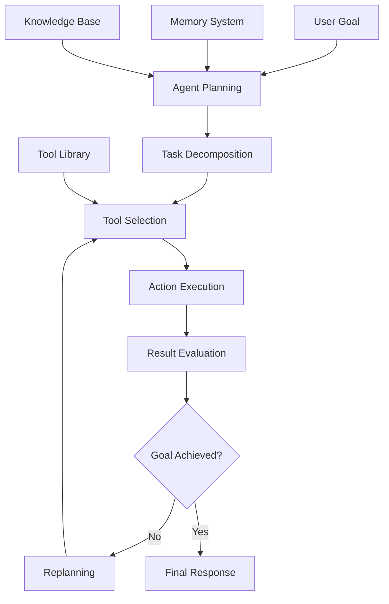

# AI Agents & Agentic Systems

!!! abstract "Building Autonomous AI Systems"
    Master the art of creating intelligent agents that can reason, plan, use tools, and collaborate to solve complex problems autonomously.

## 📚 Module Overview

<div class="grid cards" markdown>

-   :material-robot-outline: **Agent Fundamentals**
    
    ---
    
    Core concepts, architectures, and agent design principles
    
    [Learn basics →](fundamentals.md)

-   :material-cogs: **Agent Frameworks**
    
    ---
    
    LangChain, LangGraph, CrewAI, and AutoGen implementations
    
    [Explore frameworks →](frameworks.md)

-   :material-tools: **Tool Integration**
    
    ---
    
    Function calling, API integration, and tool orchestration
    
    [Master tools →](tools.md)

-   :material-account-group: **Multi-Agent Systems**
    
    ---
    
    Collaborative agents, communication, and complex workflows
    
    [Build teams →](multi-agent.md)

</div>

## 🎯 What You'll Master

- ✅ Understanding agent architectures and reasoning patterns
- ✅ Building agents with memory, planning, and tool usage
- ✅ Implementing multi-agent collaboration systems
- ✅ Creating domain-specific agent applications
- ✅ Monitoring and evaluating agent performance
- ✅ Deploying agents in production environments

## 🤖 What are AI Agents?

AI Agents are autonomous systems that can perceive their environment, reason about goals, make decisions, and take actions to achieve desired outcomes. They combine LLMs with external tools, memory, and planning capabilities.



### Agent vs. Traditional LLM

| Aspect | Traditional LLM | AI Agent |
|--------|----------------|----------|
| **Autonomy** | Reactive responses | Proactive goal pursuit |
| **Memory** | Context window only | Persistent memory systems |
| **Actions** | Text generation only | Tool usage and external actions |
| **Planning** | Single-turn reasoning | Multi-step planning and execution |
| **Learning** | Static knowledge | Dynamic learning from interactions |
| **Iteration** | One-shot responses | Iterative problem solving |

## 🏗️ Agent Architecture Patterns

### 1. ReAct (Reasoning + Acting) Agent

```python
import json
import re
from typing import List, Dict, Any, Optional, Callable
from dataclasses import dataclass
from enum import Enum

class ActionType(Enum):
    THINK = "think"
    ACTION = "action"
    OBSERVATION = "observation"
    FINAL_ANSWER = "final_answer"

@dataclass
class AgentStep:
    step_type: ActionType
    content: str
    tool_name: Optional[str] = None
    tool_input: Optional[Dict] = None
    tool_output: Optional[str] = None

class Tool:
    def __init__(self, name: str, description: str, function: Callable):
        self.name = name
        self.description = description
        self.function = function
    
    def execute(self, input_data: Dict[str, Any]) -> str:
        """Execute the tool with given input"""
        try:
            result = self.function(**input_data)
            return str(result)
        except Exception as e:
            return f"Error executing {self.name}: {str(e)}"

class ReActAgent:
    def __init__(self, llm_interface, tools: List[Tool], max_iterations: int = 10):
        self.llm = llm_interface
        self.tools = {tool.name: tool for tool in tools}
        self.max_iterations = max_iterations
        self.memory = []
        
    def _build_prompt(self, task: str, history: List[AgentStep]) -> str:
        """Build the ReAct prompt with task and history"""
        
        # Tool descriptions
        tool_descriptions = []
        for tool in self.tools.values():
            tool_descriptions.append(f"- {tool.name}: {tool.description}")
        
        tools_text = "\n".join(tool_descriptions)
        
        # Build history
        history_text = ""
        for step in history:
            if step.step_type == ActionType.THINK:
                history_text += f"Thought: {step.content}\n"
            elif step.step_type == ActionType.ACTION:
                history_text += f"Action: {step.tool_name}[{json.dumps(step.tool_input)}]\n"
            elif step.step_type == ActionType.OBSERVATION:
                history_text += f"Observation: {step.content}\n"
        
        prompt = f"""
You are a helpful assistant that can use tools to solve problems. 

Available tools:
{tools_text}

Your task: {task}

You should follow this format:
Thought: [your reasoning about what to do next]
Action: [tool_name][{{"param1": "value1", "param2": "value2"}}]
Observation: [the result of the action]
... (this Thought/Action/Observation can repeat N times)
Final Answer: [your final response to the user]

{history_text}"""

        return prompt
    
    def _parse_response(self, response: str) -> AgentStep:
        """Parse LLM response into an agent step"""
        response = response.strip()
        
        # Parse thought
        if response.startswith("Thought:"):
            content = response[8:].strip()
            return AgentStep(ActionType.THINK, content)
        
        # Parse action
        elif response.startswith("Action:"):
            action_text = response[7:].strip()
            
            # Extract tool name and parameters
            match = re.match(r'(\w+)\[(.*)\]', action_text)
            if match:
                tool_name = match.group(1)
                try:
                    tool_input = json.loads(match.group(2))
                except:
                    tool_input = {"input": match.group(2)}
                
                return AgentStep(
                    ActionType.ACTION, 
                    action_text, 
                    tool_name=tool_name,
                    tool_input=tool_input
                )
        
        # Parse final answer
        elif response.startswith("Final Answer:"):
            content = response[13:].strip()
            return AgentStep(ActionType.FINAL_ANSWER, content)
        
        # Default to thought if unclear
        return AgentStep(ActionType.THINK, response)
    
    def execute_task(self, task: str) -> Dict[str, Any]:
        """Execute a task using ReAct pattern"""
        history = []
        
        for iteration in range(self.max_iterations):
            # Build prompt
            prompt = self._build_prompt(task, history)
            
            # Get LLM response
            response = self.llm.chat(prompt)
            
            # Parse response
            step = self._parse_response(response)
            history.append(step)
            
            # Handle different step types
            if step.step_type == ActionType.FINAL_ANSWER:
                return {
                    'success': True,
                    'answer': step.content,
                    'steps': history,
                    'iterations': iteration + 1
                }
            
            elif step.step_type == ActionType.ACTION:
                # Execute tool
                if step.tool_name in self.tools:
                    tool_output = self.tools[step.tool_name].execute(step.tool_input)
                    step.tool_output = tool_output
                    
                    # Add observation
                    observation = AgentStep(ActionType.OBSERVATION, tool_output)
                    history.append(observation)
                else:
                    error_obs = AgentStep(ActionType.OBSERVATION, f"Tool '{step.tool_name}' not found")
                    history.append(error_obs)
        
        # Max iterations reached
        return {
            'success': False,
            'answer': "Task not completed within maximum iterations",
            'steps': history,
            'iterations': self.max_iterations
        }

# Example tools
def calculator_tool(expression: str) -> float:
    """Simple calculator tool"""
    try:
        # Simple evaluation (in production, use a safe evaluator)
        result = eval(expression)
        return result
    except Exception as e:
        return f"Error: {e}"

def weather_tool(location: str) -> str:
    """Mock weather tool"""
    # In production, this would call a real weather API
    mock_weather = {
        "new york": "Sunny, 22°C",
        "london": "Cloudy, 15°C", 
        "tokyo": "Rainy, 18°C"
    }
    return mock_weather.get(location.lower(), "Weather data not available")

def search_tool(query: str) -> str:
    """Mock search tool"""
    # In production, this would call a real search API
    mock_results = {
        "python": "Python is a high-level programming language known for its simplicity and readability.",
        "ai": "Artificial Intelligence (AI) refers to computer systems that can perform tasks requiring human intelligence.",
        "machine learning": "Machine learning is a subset of AI that enables computers to learn from data."
    }
    
    for key, value in mock_results.items():
        if key in query.lower():
            return value
    
    return "No relevant information found."

# Example usage
def demonstrate_react_agent():
    """Demonstrate the ReAct agent"""
    
    # Create tools
    tools = [
        Tool("calculator", "Perform mathematical calculations. Input: expression (string)", calculator_tool),
        Tool("weather", "Get weather information. Input: location (string)", weather_tool),
        Tool("search", "Search for information. Input: query (string)", search_tool)
    ]
    
    # Create agent (assuming LLM interface exists)
    # agent = ReActAgent(llm_interface, tools)
    
    # Test tasks
    test_tasks = [
        "What's the weather like in New York?",
        "Calculate the result of 15 * 24 + 8",
        "Search for information about machine learning and then calculate 2^8"
    ]
    
    print("🤖 ReAct Agent Demonstration")
    print("=" * 50)
    
    for i, task in enumerate(test_tasks, 1):
        print(f"\nTask {i}: {task}")
        print("-" * 30)
        
        # In actual implementation:
        # result = agent.execute_task(task)
        # print(f"Result: {result['answer']}")
        # print(f"Steps taken: {result['iterations']}")
        
        # Mock result for demonstration
        print("This would show the agent's step-by-step reasoning and tool usage")

# Run demonstration
demonstrate_react_agent()
```

### 2. Planning Agent with Memory

```python
from datetime import datetime
from typing import List, Dict, Any, Optional
import uuid

class Memory:
    def __init__(self):
        self.episodic = []  # Specific experiences
        self.semantic = {}  # General knowledge
        self.working = {}   # Current context
    
    def add_episode(self, event: Dict[str, Any]):
        """Add an episodic memory"""
        event['timestamp'] = datetime.now().isoformat()
        event['id'] = str(uuid.uuid4())
        self.episodic.append(event)
    
    def add_knowledge(self, key: str, value: Any):
        """Add semantic knowledge"""
        self.semantic[key] = value
    
    def update_working_memory(self, key: str, value: Any):
        """Update working memory"""
        self.working[key] = value
    
    def search_episodes(self, query: str, limit: int = 5) -> List[Dict]:
        """Search episodic memory"""
        # Simple keyword search (in production, use semantic search)
        relevant_episodes = []
        query_lower = query.lower()
        
        for episode in self.episodic[-limit:]:  # Recent episodes first
            episode_text = str(episode).lower()
            if any(word in episode_text for word in query_lower.split()):
                relevant_episodes.append(episode)
        
        return relevant_episodes

class PlanningAgent:
    def __init__(self, llm_interface, tools: List[Tool]):
        self.llm = llm_interface
        self.tools = {tool.name: tool for tool in tools}
        self.memory = Memory()
        self.current_plan = None
        
    def create_plan(self, goal: str) -> Dict[str, Any]:
        """Create a high-level plan for achieving a goal"""
        
        # Check memory for similar goals
        relevant_memories = self.memory.search_episodes(goal)
        memory_context = ""
        if relevant_memories:
            memory_context = f"Relevant past experiences:\n" + "\n".join([
                f"- {mem.get('goal', '')}: {mem.get('outcome', '')}" 
                for mem in relevant_memories
            ])
        
        # Available tools
        tools_text = "\n".join([f"- {name}: {tool.description}" for name, tool in self.tools.items()])
        
        planning_prompt = f"""
Create a step-by-step plan to achieve this goal: {goal}

Available tools:
{tools_text}

{memory_context}

Please provide a detailed plan with the following structure:
1. Goal Analysis: [Break down what needs to be accomplished]
2. Step-by-step Plan: [List specific steps with tool usage]
3. Success Criteria: [How to know if the goal is achieved]
4. Potential Risks: [What could go wrong and mitigation strategies]

Format each step as:
Step X: [Description]
Tool: [tool_name if applicable]
Expected Output: [what you expect from this step]
"""
        
        plan_response = self.llm.chat(planning_prompt)
        
        # Parse plan (simplified)
        plan = {
            'goal': goal,
            'plan_text': plan_response,
            'status': 'created',
            'created_at': datetime.now().isoformat(),
            'steps': self._parse_plan_steps(plan_response)
        }
        
        self.current_plan = plan
        self.memory.add_episode({
            'type': 'plan_creation',
            'goal': goal,
            'plan': plan
        })
        
        return plan
    
    def _parse_plan_steps(self, plan_text: str) -> List[Dict]:
        """Parse plan text into structured steps"""
        steps = []
        lines = plan_text.split('\n')
        current_step = None
        
        for line in lines:
            line = line.strip()
            if line.startswith('Step'):
                if current_step:
                    steps.append(current_step)
                
                current_step = {
                    'description': line,
                    'tool': None,
                    'expected_output': '',
                    'status': 'pending'
                }
            elif line.startswith('Tool:') and current_step:
                current_step['tool'] = line[5:].strip()
            elif line.startswith('Expected Output:') and current_step:
                current_step['expected_output'] = line[16:].strip()
        
        if current_step:
            steps.append(current_step)
        
        return steps
    
    def execute_plan(self, plan: Dict[str, Any] = None) -> Dict[str, Any]:
        """Execute the current or provided plan"""
        if plan is None:
            plan = self.current_plan
        
        if not plan:
            return {'error': 'No plan to execute'}
        
        execution_log = []
        
        for i, step in enumerate(plan['steps']):
            print(f"Executing Step {i+1}: {step['description']}")
            
            step_result = {
                'step_number': i + 1,
                'description': step['description'],
                'tool_used': step.get('tool'),
                'start_time': datetime.now().isoformat()
            }
            
            # Execute step
            if step.get('tool') and step['tool'] in self.tools:
                # Determine tool input based on context
                tool_input = self._determine_tool_input(step, execution_log)
                
                try:
                    tool_output = self.tools[step['tool']].execute(tool_input)
                    step_result['output'] = tool_output
                    step_result['success'] = True
                    step['status'] = 'completed'
                    
                    # Update working memory
                    self.memory.update_working_memory(f"step_{i+1}_output", tool_output)
                    
                except Exception as e:
                    step_result['output'] = f"Error: {str(e)}"
                    step_result['success'] = False
                    step['status'] = 'failed'
            else:
                # Manual step or thinking step
                step_result['output'] = "Manual step - requires human intervention"
                step_result['success'] = True
                step['status'] = 'completed'
            
            step_result['end_time'] = datetime.now().isoformat()
            execution_log.append(step_result)
        
        # Evaluate overall success
        successful_steps = sum(1 for step in execution_log if step.get('success', False))
        overall_success = successful_steps == len(execution_log)
        
        execution_result = {
            'plan': plan,
            'execution_log': execution_log,
            'overall_success': overall_success,
            'successful_steps': successful_steps,
            'total_steps': len(execution_log),
            'completed_at': datetime.now().isoformat()
        }
        
        # Store in memory
        self.memory.add_episode({
            'type': 'plan_execution',
            'goal': plan['goal'],
            'success': overall_success,
            'execution_result': execution_result
        })
        
        return execution_result
    
    def _determine_tool_input(self, step: Dict, execution_log: List[Dict]) -> Dict:
        """Determine appropriate input for a tool based on context"""
        # This is a simplified implementation
        # In practice, you'd use the LLM to determine inputs based on step description and context
        
        tool_name = step.get('tool', '')
        
        # Default inputs based on tool type
        if 'calculator' in tool_name.lower():
            return {'expression': '2 + 2'}  # Would be extracted from step description
        elif 'weather' in tool_name.lower():
            return {'location': 'New York'}  # Would be extracted from step description
        elif 'search' in tool_name.lower():
            return {'query': 'general query'}  # Would be extracted from step description
        
        return {}
    
    def adapt_plan(self, new_information: str) -> Dict[str, Any]:
        """Adapt current plan based on new information"""
        if not self.current_plan:
            return {'error': 'No current plan to adapt'}
        
        adaptation_prompt = f"""
Current plan goal: {self.current_plan['goal']}
Current plan steps: {[step['description'] for step in self.current_plan['steps']]}

New information: {new_information}

How should the plan be modified to account for this new information?
Provide specific changes:
1. Steps to remove (if any)
2. Steps to modify (if any) 
3. New steps to add (if any)
4. Reordered sequence (if needed)
"""
        
        adaptation_response = self.llm.chat(adaptation_prompt)
        
        # In a full implementation, you'd parse the response and modify the plan
        adapted_plan = self.current_plan.copy()
        adapted_plan['adaptations'] = adapted_plan.get('adaptations', [])
        adapted_plan['adaptations'].append({
            'new_information': new_information,
            'adaptation': adaptation_response,
            'timestamp': datetime.now().isoformat()
        })
        
        self.current_plan = adapted_plan
        
        return adapted_plan

# Example usage
def demonstrate_planning_agent():
    """Demonstrate the planning agent"""
    
    # Create tools
    tools = [
        Tool("search", "Search for information online", search_tool),
        Tool("calculator", "Perform calculations", calculator_tool),
        Tool("weather", "Get weather information", weather_tool)
    ]
    
    # Create planning agent
    # agent = PlanningAgent(llm_interface, tools)
    
    # Example goal
    goal = "Plan a weekend trip to a city with good weather and calculate the estimated budget"
    
    print("🧠 Planning Agent Demonstration")
    print("=" * 50)
    print(f"Goal: {goal}")
    
    # In actual implementation:
    # plan = agent.create_plan(goal)
    # result = agent.execute_plan(plan)
    
    print("\nThis would show:")
    print("1. Detailed step-by-step plan creation")
    print("2. Plan execution with tool usage")
    print("3. Memory storage of experiences")
    print("4. Plan adaptation based on new information")

demonstrate_planning_agent()
```

### 3. Multi-Agent Collaboration System

```python
from abc import ABC, abstractmethod
from typing import List, Dict, Any, Optional
import asyncio
import json

class Message:
    def __init__(self, sender: str, recipient: str, content: str, 
                 message_type: str = "text", metadata: Dict = None):
        self.sender = sender
        self.recipient = recipient
        self.content = content
        self.message_type = message_type
        self.metadata = metadata or {}
        self.timestamp = datetime.now().isoformat()
        self.id = str(uuid.uuid4())

class Agent(ABC):
    def __init__(self, name: str, role: str, llm_interface, tools: List[Tool] = None):
        self.name = name
        self.role = role
        self.llm = llm_interface
        self.tools = {tool.name: tool for tool in (tools or [])}
        self.memory = Memory()
        self.message_history = []
        
    @abstractmethod
    async def process_message(self, message: Message) -> Optional[Message]:
        """Process an incoming message and optionally return a response"""
        pass
    
    def send_message(self, recipient: str, content: str, 
                    message_type: str = "text", metadata: Dict = None) -> Message:
        """Create a message to send to another agent"""
        return Message(
            sender=self.name,
            recipient=recipient,
            content=content,
            message_type=message_type,
            metadata=metadata
        )

class ResearchAgent(Agent):
    def __init__(self, *args, **kwargs):
        super().__init__(*args, **kwargs)
        self.specialization = "research and information gathering"
    
    async def process_message(self, message: Message) -> Optional[Message]:
        """Process research requests"""
        self.message_history.append(message)
        
        if message.message_type == "research_request":
            # Extract research topic from message
            topic = message.content
            
            # Use search tool if available
            if "search" in self.tools:
                search_result = self.tools["search"].execute({"query": topic})
            else:
                search_result = f"Research findings about {topic}: [mock research data]"
            
            # Generate comprehensive research report
            research_prompt = f"""
As a research specialist, analyze this research request: {topic}

Search results: {search_result}

Provide a comprehensive research report including:
1. Key findings
2. Important statistics or data points
3. Relevant trends or patterns
4. Recommendations for further investigation
5. Sources and reliability assessment
"""
            
            research_report = self.llm.chat(research_prompt)
            
            # Store in memory
            self.memory.add_episode({
                'type': 'research_completed',
                'topic': topic,
                'report': research_report
            })
            
            return self.send_message(
                recipient=message.sender,
                content=research_report,
                message_type="research_report",
                metadata={'original_topic': topic}
            )
        
        return None

class AnalysisAgent(Agent):
    def __init__(self, *args, **kwargs):
        super().__init__(*args, **kwargs)
        self.specialization = "data analysis and pattern recognition"
    
    async def process_message(self, message: Message) -> Optional[Message]:
        """Process analysis requests"""
        self.message_history.append(message)
        
        if message.message_type == "analysis_request":
            data = message.content
            
            # Perform analysis using calculator if needed
            if "calculator" in self.tools:
                # Extract numerical data for analysis
                calculation_result = self.tools["calculator"].execute({"expression": "sum([1,2,3,4,5])"})
            else:
                calculation_result = "Analysis calculations performed"
            
            analysis_prompt = f"""
As a data analysis specialist, analyze the following data: {data}

Calculation results: {calculation_result}

Provide detailed analysis including:
1. Statistical summary
2. Key patterns and trends
3. Correlations and relationships
4. Anomalies or outliers
5. Actionable insights
6. Confidence levels in findings
"""
            
            analysis_report = self.llm.chat(analysis_prompt)
            
            self.memory.add_episode({
                'type': 'analysis_completed',
                'data': data,
                'analysis': analysis_report
            })
            
            return self.send_message(
                recipient=message.sender,
                content=analysis_report,
                message_type="analysis_report",
                metadata={'calculation_result': calculation_result}
            )
        
        return None

class CoordinatorAgent(Agent):
    def __init__(self, *args, **kwargs):
        super().__init__(*args, **kwargs)
        self.specialization = "task coordination and synthesis"
        self.pending_tasks = {}
        self.agent_registry = {}
    
    def register_agent(self, agent: Agent):
        """Register an agent in the system"""
        self.agent_registry[agent.name] = agent
    
    async def process_message(self, message: Message) -> Optional[Message]:
        """Coordinate complex tasks across multiple agents"""
        self.message_history.append(message)
        
        if message.message_type == "complex_task":
            task = message.content
            
            # Decompose task into subtasks
            decomposition_prompt = f"""
As a task coordinator, break down this complex task into smaller subtasks: {task}

Available specialized agents:
{json.dumps({name: agent.specialization for name, agent in self.agent_registry.items()}, indent=2)}

Provide a task decomposition with:
1. List of subtasks
2. Which agent should handle each subtask
3. Dependencies between subtasks
4. Expected timeline
5. Success criteria for each subtask

Format as JSON with structure:
{{"subtasks": [{{"id": 1, "description": "...", "agent": "...", "dependencies": [], "priority": "high/medium/low"}}]}}
"""
            
            decomposition = self.llm.chat(decomposition_prompt)
            
            # Store task tracking
            task_id = str(uuid.uuid4())
            self.pending_tasks[task_id] = {
                'original_task': task,
                'decomposition': decomposition,
                'status': 'in_progress',
                'results': {},
                'requester': message.sender
            }
            
            return self.send_message(
                recipient=message.sender,
                content=f"Task decomposed and distributed. Task ID: {task_id}\n\nDecomposition:\n{decomposition}",
                message_type="task_accepted",
                metadata={'task_id': task_id}
            )
        
        elif message.message_type in ["research_report", "analysis_report"]:
            # Collect results from other agents
            task_id = message.metadata.get('task_id')
            if task_id and task_id in self.pending_tasks:
                self.pending_tasks[task_id]['results'][message.sender] = message.content
                
                # Check if all subtasks are complete
                # (simplified - in practice, you'd track specific subtasks)
                if len(self.pending_tasks[task_id]['results']) >= 2:  # Assuming 2 agents needed
                    # Synthesize final result
                    synthesis = await self._synthesize_results(task_id)
                    
                    return self.send_message(
                        recipient=self.pending_tasks[task_id]['requester'],
                        content=synthesis,
                        message_type="task_complete",
                        metadata={'task_id': task_id}
                    )
        
        return None
    
    async def _synthesize_results(self, task_id: str) -> str:
        """Synthesize results from multiple agents"""
        task_info = self.pending_tasks[task_id]
        
        synthesis_prompt = f"""
Original task: {task_info['original_task']}

Results from specialist agents:
{json.dumps(task_info['results'], indent=2)}

Synthesize these results into a comprehensive final response that:
1. Addresses the original task completely
2. Integrates insights from all agents
3. Highlights key findings and recommendations
4. Identifies any conflicting information
5. Provides clear next steps
"""
        
        synthesis = self.llm.chat(synthesis_prompt)
        
        # Update task status
        task_info['status'] = 'completed'
        task_info['final_result'] = synthesis
        
        return synthesis

class MultiAgentSystem:
    def __init__(self):
        self.agents = {}
        self.message_queue = asyncio.Queue()
        self.running = False
        
    def add_agent(self, agent: Agent):
        """Add an agent to the system"""
        self.agents[agent.name] = agent
        
        # If coordinator, register all other agents
        if isinstance(agent, CoordinatorAgent):
            for other_agent in self.agents.values():
                if other_agent != agent:
                    agent.register_agent(other_agent)
    
    async def send_message(self, message: Message):
        """Send a message through the system"""
        await self.message_queue.put(message)
    
    async def start(self):
        """Start the multi-agent system"""
        self.running = True
        
        while self.running:
            try:
                # Get message from queue
                message = await asyncio.wait_for(self.message_queue.get(), timeout=1.0)
                
                # Route message to recipient
                if message.recipient in self.agents:
                    response = await self.agents[message.recipient].process_message(message)
                    
                    # If agent generated a response, queue it
                    if response:
                        await self.message_queue.put(response)
                
            except asyncio.TimeoutError:
                continue
            except Exception as e:
                print(f"Error processing message: {e}")
    
    async def stop(self):
        """Stop the multi-agent system"""
        self.running = False
    
    async def submit_task(self, task: str, coordinator_name: str = "coordinator") -> str:
        """Submit a task to the multi-agent system"""
        task_message = Message(
            sender="user",
            recipient=coordinator_name,
            content=task,
            message_type="complex_task"
        )
        
        await self.send_message(task_message)
        return f"Task submitted: {task}"

# Example usage and demonstration
async def demonstrate_multi_agent_system():
    """Demonstrate the multi-agent collaboration system"""
    
    print("🤖 Multi-Agent System Demonstration")
    print("=" * 50)
    
    # Create tools
    tools = [
        Tool("search", "Search for information", search_tool),
        Tool("calculator", "Perform calculations", calculator_tool)
    ]
    
    # Create agents (assuming LLM interface exists)
    # research_agent = ResearchAgent("researcher", "Research Specialist", llm_interface, tools)
    # analysis_agent = AnalysisAgent("analyst", "Data Analyst", llm_interface, tools)
    # coordinator_agent = CoordinatorAgent("coordinator", "Task Coordinator", llm_interface)
    
    # Create multi-agent system
    # mas = MultiAgentSystem()
    # mas.add_agent(research_agent)
    # mas.add_agent(analysis_agent)
    # mas.add_agent(coordinator_agent)
    
    print("Agents created:")
    print("- Research Agent: Specializes in information gathering")
    print("- Analysis Agent: Specializes in data analysis")
    print("- Coordinator Agent: Manages task distribution and synthesis")
    
    print("\nExample complex task:")
    print("'Analyze the market trends for electric vehicles and provide investment recommendations'")
    
    print("\nSystem would:")
    print("1. Coordinator decomposes task into research and analysis subtasks")
    print("2. Research agent gathers market data")
    print("3. Analysis agent analyzes trends and patterns")
    print("4. Coordinator synthesizes results into final recommendations")
    
    # In actual implementation:
    # Start the system
    # await mas.start()
    
    # Submit task
    # await mas.submit_task(
    #     "Analyze the market trends for electric vehicles and provide investment recommendations"
    # )

# Run demonstration
if __name__ == "__main__":
    asyncio.run(demonstrate_multi_agent_system())
```

## 🛠️ Agent Framework Implementations

### LangChain Agent Implementation

```python
from langchain.agents import initialize_agent, AgentType
from langchain.tools import Tool
from langchain.memory import ConversationBufferMemory
from langchain.schema import BaseMessage

class LangChainAgentWrapper:
    def __init__(self, llm, tools: List, agent_type: str = "zero-shot-react-description"):
        self.llm = llm
        self.tools = tools
        
        # Convert agent type string to LangChain enum
        agent_type_map = {
            "zero-shot-react-description": AgentType.ZERO_SHOT_REACT_DESCRIPTION,
            "react-docstore": AgentType.REACT_DOCSTORE,
            "conversational-react-description": AgentType.CONVERSATIONAL_REACT_DESCRIPTION
        }
        
        self.agent_type = agent_type_map.get(agent_type, AgentType.ZERO_SHOT_REACT_DESCRIPTION)
        
        # Initialize memory
        self.memory = ConversationBufferMemory(memory_key="chat_history", return_messages=True)
        
        # Initialize agent
        self.agent = initialize_agent(
            tools=self.tools,
            llm=self.llm,
            agent=self.agent_type,
            memory=self.memory,
            verbose=True,
            handle_parsing_errors=True
        )
    
    def run(self, query: str) -> str:
        """Run the agent with a query"""
        try:
            return self.agent.run(query)
        except Exception as e:
            return f"Error: {str(e)}"
    
    def get_memory(self) -> List[BaseMessage]:
        """Get conversation memory"""
        return self.memory.chat_memory.messages
    
    def clear_memory(self):
        """Clear conversation memory"""
        self.memory.clear()

# Custom LangChain tools
def create_langchain_tools():
    """Create LangChain-compatible tools"""
    
    def search_function(query: str) -> str:
        # Mock search implementation
        return f"Search results for '{query}': [Mock search results]"
    
    def calculator_function(expression: str) -> str:
        try:
            result = eval(expression)
            return f"Result: {result}"
        except Exception as e:
            return f"Error: {e}"
    
    def weather_function(location: str) -> str:
        # Mock weather implementation
        weather_data = {
            "new york": "Sunny, 22°C",
            "london": "Cloudy, 15°C",
            "tokyo": "Rainy, 18°C"
        }
        return weather_data.get(location.lower(), "Weather data unavailable")
    
    return [
        Tool(
            name="Search",
            description="Search for information on any topic. Input should be a search query.",
            func=search_function
        ),
        Tool(
            name="Calculator", 
            description="Perform mathematical calculations. Input should be a mathematical expression.",
            func=calculator_function
        ),
        Tool(
            name="Weather",
            description="Get weather information for a location. Input should be a city name.",
            func=weather_function
        )
    ]
```

### CrewAI Implementation

```python
from dataclasses import dataclass
from typing import List, Dict, Any, Optional
import asyncio

@dataclass
class CrewTask:
    description: str
    agent: str
    tools: List[str] = None
    context: Dict[str, Any] = None
    output_format: str = "text"

@dataclass
class CrewAgent:
    role: str
    goal: str
    backstory: str
    tools: List[Tool]
    llm_interface: Any
    max_iter: int = 5
    memory_enabled: bool = True

class CrewAISystem:
    def __init__(self):
        self.agents = {}
        self.tasks = []
        self.execution_context = {}
        
    def add_agent(self, name: str, agent: CrewAgent):
        """Add an agent to the crew"""
        self.agents[name] = agent
        
    def add_task(self, task: CrewTask):
        """Add a task to the crew workflow"""
        self.tasks.append(task)
    
    async def execute_crew(self) -> Dict[str, Any]:
        """Execute all tasks in the crew workflow"""
        results = {}
        
        for i, task in enumerate(self.tasks):
            print(f"Executing Task {i+1}: {task.description}")
            
            # Get assigned agent
            agent = self.agents.get(task.agent)
            if not agent:
                results[f"task_{i+1}"] = {"error": f"Agent '{task.agent}' not found"}
                continue
            
            # Build task context
            task_context = self._build_task_context(task, results)
            
            # Execute task
            task_result = await self._execute_task(agent, task, task_context)
            results[f"task_{i+1}"] = task_result
            
            # Update execution context
            self.execution_context[f"task_{i+1}_result"] = task_result
        
        return results
    
    def _build_task_context(self, task: CrewTask, previous_results: Dict) -> str:
        """Build context for task execution"""
        context_parts = []
        
        # Add task description
        context_parts.append(f"Task: {task.description}")
        
        # Add previous results if relevant
        if previous_results:
            context_parts.append("Previous task results:")
            for task_key, result in previous_results.items():
                if isinstance(result, dict) and 'output' in result:
                    context_parts.append(f"- {task_key}: {result['output']}")
        
        # Add specific context
        if task.context:
            context_parts.append(f"Additional context: {task.context}")
        
        return "\n\n".join(context_parts)
    
    async def _execute_task(self, agent: CrewAgent, task: CrewTask, context: str) -> Dict[str, Any]:
        """Execute a single task with an agent"""
        
        # Build agent prompt
        agent_prompt = f"""
You are a {agent.role}.

Your goal: {agent.goal}

Background: {agent.backstory}

Available tools: {[tool.name for tool in agent.tools]}

{context}

Please complete this task according to your role and expertise. 
Use available tools when necessary and provide a comprehensive response.
"""
        
        try:
            # Execute with agent's LLM
            response = agent.llm_interface.chat(agent_prompt)
            
            return {
                'output': response,
                'agent': task.agent,
                'task_description': task.description,
                'success': True
            }
            
        except Exception as e:
            return {
                'output': None,
                'agent': task.agent,
                'task_description': task.description,
                'error': str(e),
                'success': False
            }

# Example CrewAI setup
def setup_content_creation_crew():
    """Setup a content creation crew"""
    
    # Define tools
    tools = [
        Tool("research", "Research topics and gather information", search_tool),
        Tool("analyze", "Analyze data and trends", calculator_tool)
    ]
    
    # Create agents
    agents = {
        "researcher": CrewAgent(
            role="Content Researcher",
            goal="Gather comprehensive and accurate information on given topics",
            backstory="You are an experienced researcher with expertise in finding reliable sources and extracting key insights from complex information.",
            tools=tools,
            llm_interface=None  # Would be actual LLM interface
        ),
        
        "writer": CrewAgent(
            role="Content Writer", 
            goal="Create engaging and well-structured content based on research",
            backstory="You are a skilled writer who can transform research into compelling, readable content that engages the target audience.",
            tools=tools,
            llm_interface=None
        ),
        
        "editor": CrewAgent(
            role="Content Editor",
            goal="Review and improve content for clarity, accuracy, and engagement",
            backstory="You are a meticulous editor with a keen eye for detail and a talent for enhancing the quality and impact of written content.",
            tools=[],
            llm_interface=None
        )
    }
    
    # Define tasks
    tasks = [
        CrewTask(
            description="Research the latest trends in artificial intelligence and machine learning",
            agent="researcher",
            tools=["research"],
            output_format="research_report"
        ),
        
        CrewTask(
            description="Write a comprehensive blog post about AI trends based on the research findings",
            agent="writer", 
            tools=[],
            context={"target_audience": "tech professionals", "tone": "informative yet accessible"}
        ),
        
        CrewTask(
            description="Edit and refine the blog post for publication",
            agent="editor",
            tools=[],
            context={"focus": "clarity, flow, and engagement"}
        )
    ]
    
    # Create crew system
    crew = CrewAISystem()
    
    # Add agents and tasks
    for name, agent in agents.items():
        crew.add_agent(name, agent)
    
    for task in tasks:
        crew.add_task(task)
    
    return crew

# Example usage
async def demonstrate_crewai_system():
    """Demonstrate CrewAI system"""
    
    print("🚢 CrewAI System Demonstration")
    print("=" * 50)
    
    crew = setup_content_creation_crew()
    
    print("Crew Setup:")
    print(f"- {len(crew.agents)} agents configured")
    print(f"- {len(crew.tasks)} tasks in workflow")
    
    print("\nWorkflow:")
    for i, task in enumerate(crew.tasks, 1):
        print(f"{i}. {task.agent}: {task.description}")
    
    # In actual implementation:
    # results = await crew.execute_crew()
    # print(f"\nResults: {results}")
    
    print("\nThis would execute the full content creation workflow with collaboration between agents.")

# Run demonstration
if __name__ == "__main__":
    asyncio.run(demonstrate_crewai_system())
```

## 🎯 Domain-Specific Agent Applications

### Customer Service Agent

```python
class CustomerServiceAgent:
    def __init__(self, llm_interface, knowledge_base):
        self.llm = llm_interface
        self.knowledge_base = knowledge_base
        self.conversation_history = []
        self.customer_context = {}
        
    def handle_customer_query(self, query: str, customer_id: str = None) -> Dict[str, Any]:
        """Handle a customer service query"""
        
        # Retrieve customer context if available
        if customer_id:
            self.customer_context = self._get_customer_context(customer_id)
        
        # Search knowledge base for relevant information
        relevant_info = self._search_knowledge_base(query)
        
        # Determine query type and urgency
        query_analysis = self._analyze_query(query)
        
        # Generate response based on context
        response = self._generate_response(query, relevant_info, query_analysis)
        
        # Log interaction
        self._log_interaction(query, response, customer_id)
        
        return {
            'response': response,
            'query_type': query_analysis['type'],
            'urgency': query_analysis['urgency'],
            'confidence': query_analysis['confidence'],
            'follow_up_needed': query_analysis['follow_up_needed']
        }
    
    def _get_customer_context(self, customer_id: str) -> Dict:
        """Retrieve customer context and history"""
        # Mock customer data
        return {
            'customer_id': customer_id,
            'tier': 'premium',
            'recent_orders': ['ORDER123', 'ORDER456'],
            'support_history': ['Shipping inquiry', 'Product question']
        }
    
    def _search_knowledge_base(self, query: str) -> str:
        """Search internal knowledge base"""
        # In production, this would use RAG or vector search
        mock_kb = {
            'return': 'Returns are accepted within 30 days with original receipt.',
            'shipping': 'Standard shipping takes 3-5 business days.',
            'refund': 'Refunds are processed within 5-7 business days.'
        }
        
        for key, info in mock_kb.items():
            if key in query.lower():
                return info
        
        return "General customer service information available."
    
    def _analyze_query(self, query: str) -> Dict:
        """Analyze query type and urgency"""
        urgency_keywords = ['urgent', 'emergency', 'asap', 'immediately']
        complaint_keywords = ['angry', 'frustrated', 'terrible', 'awful']
        
        analysis = {
            'type': 'general_inquiry',
            'urgency': 'low',
            'confidence': 0.8,
            'follow_up_needed': False
        }
        
        if any(word in query.lower() for word in urgency_keywords):
            analysis['urgency'] = 'high'
            analysis['follow_up_needed'] = True
        
        if any(word in query.lower() for word in complaint_keywords):
            analysis['type'] = 'complaint'
            analysis['urgency'] = 'medium'
            analysis['follow_up_needed'] = True
        
        return analysis
    
    def _generate_response(self, query: str, knowledge: str, analysis: Dict) -> str:
        """Generate contextual customer service response"""
        
        context = f"Customer context: {self.customer_context}"
        urgency_note = f"Urgency level: {analysis['urgency']}"
        
        prompt = f"""
You are a helpful customer service representative. Respond to this customer query professionally and empathetically.

Customer query: {query}
Relevant information: {knowledge}
{context}
{urgency_note}

Guidelines:
- Be friendly, professional, and empathetic
- Provide clear, actionable information
- If the query is urgent, acknowledge this and provide priority handling
- If you cannot fully resolve the issue, explain next steps
- Always end with asking if there's anything else you can help with

Response:
"""
        
        return self.llm.chat(prompt)
    
    def _log_interaction(self, query: str, response: str, customer_id: str = None):
        """Log customer interaction for analytics"""
        interaction = {
            'timestamp': datetime.now().isoformat(),
            'customer_id': customer_id,
            'query': query,
            'response': response,
            'resolved': True  # Would be determined by follow-up
        }
        
        self.conversation_history.append(interaction)

# Example usage
def demonstrate_customer_service_agent():
    """Demonstrate customer service agent"""
    
    print("🎧 Customer Service Agent Demonstration")
    print("=" * 50)
    
    # agent = CustomerServiceAgent(llm_interface, knowledge_base)
    
    test_queries = [
        "I need to return a product I bought last week",
        "My order is urgent and hasn't arrived yet!",
        "I'm really frustrated with the poor quality of my recent purchase"
    ]
    
    for query in test_queries:
        print(f"\nCustomer Query: {query}")
        print("-" * 30)
        
        # In actual implementation:
        # result = agent.handle_customer_query(query, "CUST123")
        # print(f"Response: {result['response']}")
        # print(f"Type: {result['query_type']}, Urgency: {result['urgency']}")
        
        print("Would generate appropriate customer service response with proper escalation handling")

demonstrate_customer_service_agent()
```

## 📊 Agent Monitoring and Evaluation

```python
class AgentMetrics:
    def __init__(self):
        self.task_completion_rate = 0.0
        self.average_response_time = 0.0
        self.tool_usage_accuracy = 0.0
        self.user_satisfaction_score = 0.0
        self.error_rate = 0.0
        self.cost_per_interaction = 0.0

class AgentMonitor:
    def __init__(self):
        self.agents = {}
        self.performance_history = []
        self.alerts = []
        
    def register_agent(self, agent_name: str, agent_instance):
        """Register an agent for monitoring"""
        self.agents[agent_name] = {
            'instance': agent_instance,
            'metrics': AgentMetrics(),
            'interactions': [],
            'status': 'active'
        }
    
    def log_interaction(self, agent_name: str, interaction_data: Dict):
        """Log an agent interaction"""
        if agent_name in self.agents:
            interaction_data['timestamp'] = datetime.now().isoformat()
            self.agents[agent_name]['interactions'].append(interaction_data)
            
            # Update metrics
            self._update_metrics(agent_name)
    
    def _update_metrics(self, agent_name: str):
        """Update performance metrics for an agent"""
        agent_data = self.agents[agent_name]
        interactions = agent_data['interactions']
        
        if not interactions:
            return
        
        metrics = agent_data['metrics']
        
        # Calculate metrics from recent interactions
        recent_interactions = interactions[-100:]  # Last 100 interactions
        
        # Task completion rate
        completed_tasks = sum(1 for i in recent_interactions if i.get('success', False))
        metrics.task_completion_rate = completed_tasks / len(recent_interactions)
        
        # Average response time
        response_times = [i.get('response_time', 0) for i in recent_interactions if 'response_time' in i]
        metrics.average_response_time = sum(response_times) / len(response_times) if response_times else 0
        
        # Error rate
        errors = sum(1 for i in recent_interactions if i.get('error'))
        metrics.error_rate = errors / len(recent_interactions)
        
        # Check for alerts
        self._check_alerts(agent_name, metrics)
    
    def _check_alerts(self, agent_name: str, metrics: AgentMetrics):
        """Check for performance alerts"""
        alerts = []
        
        if metrics.task_completion_rate < 0.8:
            alerts.append(f"Low completion rate for {agent_name}: {metrics.task_completion_rate:.2%}")
        
        if metrics.error_rate > 0.1:
            alerts.append(f"High error rate for {agent_name}: {metrics.error_rate:.2%}")
        
        if metrics.average_response_time > 10.0:
            alerts.append(f"Slow response time for {agent_name}: {metrics.average_response_time:.2f}s")
        
        for alert in alerts:
            self.alerts.append({
                'timestamp': datetime.now().isoformat(),
                'agent': agent_name,
                'message': alert,
                'severity': 'warning'
            })
    
    def generate_performance_report(self, agent_name: str = None) -> str:
        """Generate performance report"""
        if agent_name:
            agents_to_report = [agent_name] if agent_name in self.agents else []
        else:
            agents_to_report = list(self.agents.keys())
        
        report = "Agent Performance Report\n"
        report += "=" * 50 + "\n\n"
        
        for name in agents_to_report:
            agent_data = self.agents[name]
            metrics = agent_data['metrics']
            
            report += f"Agent: {name}\n"
            report += f"Status: {agent_data['status']}\n"
            report += f"Total Interactions: {len(agent_data['interactions'])}\n"
            report += f"Completion Rate: {metrics.task_completion_rate:.2%}\n"
            report += f"Average Response Time: {metrics.average_response_time:.2f}s\n"
            report += f"Error Rate: {metrics.error_rate:.2%}\n"
            report += f"Cost per Interaction: ${metrics.cost_per_interaction:.4f}\n"
            report += "\n"
        
        # Recent alerts
        if self.alerts:
            report += "Recent Alerts:\n"
            for alert in self.alerts[-10:]:  # Last 10 alerts
                report += f"- {alert['timestamp']}: {alert['message']}\n"
        
        return report
    
    def get_dashboard_data(self) -> Dict:
        """Get data for monitoring dashboard"""
        dashboard_data = {
            'agents': {},
            'system_overview': {
                'total_agents': len(self.agents),
                'active_agents': sum(1 for a in self.agents.values() if a['status'] == 'active'),
                'total_interactions': sum(len(a['interactions']) for a in self.agents.values()),
                'average_completion_rate': 0.0,
                'system_health': 'good'
            },
            'alerts': self.alerts[-5:]  # Recent alerts
        }
        
        # Agent-specific data
        for name, agent_data in self.agents.items():
            dashboard_data['agents'][name] = {
                'status': agent_data['status'],
                'interactions_count': len(agent_data['interactions']),
                'completion_rate': agent_data['metrics'].task_completion_rate,
                'response_time': agent_data['metrics'].average_response_time,
                'error_rate': agent_data['metrics'].error_rate
            }
        
        # Calculate system averages
        if self.agents:
            completion_rates = [a['metrics'].task_completion_rate for a in self.agents.values()]
            dashboard_data['system_overview']['average_completion_rate'] = sum(completion_rates) / len(completion_rates)
        
        return dashboard_data

# Example monitoring setup
def setup_agent_monitoring():
    """Setup agent monitoring system"""
    
    monitor = AgentMonitor()
    
    # Register agents (mock)
    agents = ['research_agent', 'analysis_agent', 'customer_service_agent']
    for agent_name in agents:
        monitor.register_agent(agent_name, None)  # Would be actual agent instance
    
    # Simulate some interactions
    import random
    for agent_name in agents:
        for i in range(50):
            interaction = {
                'task_id': f"task_{i}",
                'success': random.choice([True, True, True, False]),  # 75% success rate
                'response_time': random.uniform(1.0, 5.0),
                'cost': random.uniform(0.01, 0.05),
                'user_feedback': random.choice(['positive', 'neutral', 'negative'])
            }
            
            if not interaction['success']:
                interaction['error'] = "Mock error for demonstration"
            
            monitor.log_interaction(agent_name, interaction)
    
    return monitor

# Example usage
def demonstrate_agent_monitoring():
    """Demonstrate agent monitoring"""
    
    print("📊 Agent Monitoring Demonstration")
    print("=" * 50)
    
    monitor = setup_agent_monitoring()
    
    # Generate performance report
    report = monitor.generate_performance_report()
    print(report)
    
    # Get dashboard data
    dashboard = monitor.get_dashboard_data()
    print(f"System Overview: {dashboard['system_overview']}")
    
    if dashboard['alerts']:
        print(f"\nRecent Alerts: {len(dashboard['alerts'])}")

demonstrate_agent_monitoring()
```

## 📚 Next Steps

Ready to implement advanced AI systems? Continue with:

1. **[Fine-tuning](../fine-tuning/index.md)** - Customize models for specific agent tasks
2. **[MLOps/AIOps](../mlops-aiops/index.md)** - Deploy and scale agent systems
3. **[Projects](../projects/index.md)** - Build real-world agent applications
4. **[Advanced Topics](../advanced/index.md)** - Explore cutting-edge agent research

---

!!! success "Agent Mastery Complete!"
    You now have the knowledge to build sophisticated AI agent systems that can reason, plan, use tools, and collaborate to solve complex problems autonomously. The future of AI is agentic!
