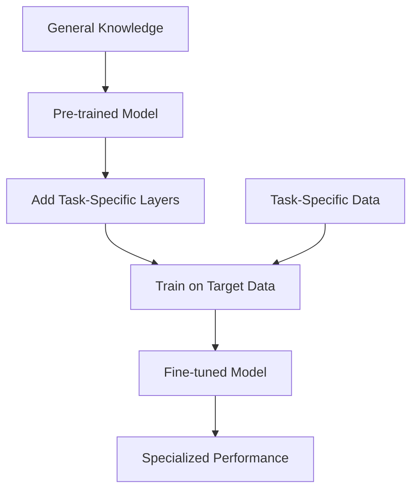

# Fine-tuning & Model Adaptation

<div class="grid cards" markdown>

-   :material-chart-line:{ .lg .middle } **Training Methods**

    ---

    From full fine-tuning to efficient parameter updates

    [:octicons-arrow-right-24: Training Approaches](training-methods.md)

-   :material-database:{ .lg .middle } **Data Preparation**

    ---

    Dataset curation, preprocessing, and quality assurance

    [:octicons-arrow-right-24: Data Engineering](data-preparation.md)

-   :material-tune:{ .lg .middle } **Parameter Efficiency**

    ---

    LoRA, QLoRA, AdaLoRA, and other PEFT techniques

    [:octicons-arrow-right-24: PEFT Methods](peft.md)

-   :material-shield-check:{ .lg .middle } **Safety & Alignment**

    ---

    RLHF, Constitutional AI, and safety fine-tuning

    [:octicons-arrow-right-24: Alignment](alignment.md)

</div>

## Learning Objectives

=== "Beginner"
    - [ ] Understand fine-tuning vs. pre-training
    - [ ] Learn transfer learning concepts
    - [ ] Explore basic fine-tuning workflows
    - [ ] Practice with simple datasets

=== "Intermediate"
    - [ ] Master parameter-efficient methods
    - [ ] Implement LoRA and QLoRA
    - [ ] Optimize training pipelines
    - [ ] Handle domain adaptation

=== "Advanced"
    - [ ] Design custom training strategies
    - [ ] Implement safety alignment
    - [ ] Scale distributed training
    - [ ] Research novel adaptation methods

## Fine-tuning Fundamentals

### What is Fine-tuning?

Fine-tuning adapts pre-trained models to specific tasks or domains:



### Types of Fine-tuning

| Type | Parameters Updated | Use Case | Cost |
|------|-------------------|----------|------|
| **Full Fine-tuning** | All parameters | High-resource scenarios | High |
| **Partial Fine-tuning** | Selected layers | Balanced approach | Medium |
| **Parameter Efficient** | Adapter modules | Low-resource scenarios | Low |
| **Prompt Tuning** | Soft prompts only | Minimal adaptation | Very Low |

## Parameter-Efficient Fine-tuning (PEFT)

### LoRA (Low-Rank Adaptation)

```python
import torch
import torch.nn as nn
from transformers import AutoModel, AutoTokenizer

class LoRALayer(nn.Module):
    def __init__(self, in_features, out_features, rank=16, alpha=32):
        super().__init__()
        self.rank = rank
        self.alpha = alpha
        
        # LoRA matrices
        self.lora_A = nn.Linear(in_features, rank, bias=False)
        self.lora_B = nn.Linear(rank, out_features, bias=False)
        
        # Initialize weights
        nn.init.normal_(self.lora_A.weight, std=1/rank)
        nn.init.zeros_(self.lora_B.weight)
        
    def forward(self, x):
        return self.lora_B(self.lora_A(x)) * (self.alpha / self.rank)

class LoRALinear(nn.Module):
    def __init__(self, original_layer, rank=16, alpha=32):
        super().__init__()
        self.original_layer = original_layer
        self.lora = LoRALayer(
            original_layer.in_features,
            original_layer.out_features,
            rank, alpha
        )
        
    def forward(self, x):
        return self.original_layer(x) + self.lora(x)

# Apply LoRA to a model
def apply_lora(model, target_modules=['q_proj', 'v_proj'], rank=16):
    for name, module in model.named_modules():
        if any(target in name for target in target_modules):
            if isinstance(module, nn.Linear):
                parent = model
                for part in name.split('.')[:-1]:
                    parent = getattr(parent, part)
                setattr(parent, name.split('.')[-1], 
                       LoRALinear(module, rank=rank))
    return model
```

### QLoRA Implementation

```python
import torch
from transformers import (
    AutoModelForCausalLM,
    AutoTokenizer,
    BitsAndBytesConfig,
    TrainingArguments
)
from peft import LoraConfig, get_peft_model

def setup_qlora_model(model_name, rank=64, alpha=16):
    """Setup QLoRA model with 4-bit quantization"""
    
    # Quantization config
    bnb_config = BitsAndBytesConfig(
        load_in_4bit=True,
        bnb_4bit_quant_type="nf4",
        bnb_4bit_compute_dtype=torch.float16,
        bnb_4bit_use_double_quant=True,
    )
    
    # Load model with quantization
    model = AutoModelForCausalLM.from_pretrained(
        model_name,
        quantization_config=bnb_config,
        device_map="auto",
        trust_remote_code=True,
    )
    
    # LoRA config
    lora_config = LoraConfig(
        r=rank,
        lora_alpha=alpha,
        target_modules=[
            "q_proj", "k_proj", "v_proj", "o_proj",
            "gate_proj", "up_proj", "down_proj"
        ],
        lora_dropout=0.1,
        bias="none",
        task_type="CAUSAL_LM",
    )
    
    # Apply LoRA
    model = get_peft_model(model, lora_config)
    return model

# Training setup
def create_training_args(output_dir, batch_size=4, epochs=3):
    return TrainingArguments(
        output_dir=output_dir,
        num_train_epochs=epochs,
        per_device_train_batch_size=batch_size,
        gradient_accumulation_steps=4,
        learning_rate=2e-4,
        warmup_steps=100,
        logging_steps=10,
        save_steps=500,
        evaluation_strategy="steps",
        eval_steps=500,
        fp16=True,
        push_to_hub=False,
    )
```

## Training Pipeline

### Complete Fine-tuning Workflow

```python
from datasets import Dataset
from transformers import Trainer, DataCollatorForLanguageModeling
import wandb

class FineTuningPipeline:
    def __init__(self, model_name, dataset_path, output_dir):
        self.model_name = model_name
        self.dataset_path = dataset_path
        self.output_dir = output_dir
        self.model = None
        self.tokenizer = None
        
    def setup_model(self, use_qlora=True):
        """Initialize model and tokenizer"""
        self.tokenizer = AutoTokenizer.from_pretrained(self.model_name)
        self.tokenizer.pad_token = self.tokenizer.eos_token
        
        if use_qlora:
            self.model = setup_qlora_model(self.model_name)
        else:
            self.model = AutoModelForCausalLM.from_pretrained(
                self.model_name, torch_dtype=torch.float16
            )
            
    def prepare_dataset(self, max_length=512):
        """Prepare and tokenize dataset"""
        # Load your dataset
        dataset = Dataset.from_json(self.dataset_path)
        
        def tokenize_function(examples):
            return self.tokenizer(
                examples['text'],
                truncation=True,
                padding=True,
                max_length=max_length,
                return_tensors="pt"
            )
        
        tokenized_dataset = dataset.map(
            tokenize_function,
            batched=True,
            remove_columns=dataset.column_names
        )
        
        return tokenized_dataset.train_test_split(test_size=0.1)
    
    def train(self, num_epochs=3, batch_size=4):
        """Execute training loop"""
        # Initialize tracking
        wandb.init(project="llm-finetuning")
        
        # Prepare data
        dataset = self.prepare_dataset()
        data_collator = DataCollatorForLanguageModeling(
            tokenizer=self.tokenizer, mlm=False
        )
        
        # Training arguments
        training_args = create_training_args(
            self.output_dir, batch_size, num_epochs
        )
        
        # Initialize trainer
        trainer = Trainer(
            model=self.model,
            args=training_args,
            train_dataset=dataset['train'],
            eval_dataset=dataset['test'],
            data_collator=data_collator,
        )
        
        # Train model
        trainer.train()
        
        # Save model
        trainer.save_model()
        
    def evaluate(self, test_dataset):
        """Evaluate model performance"""
        # Implementation for evaluation metrics
        pass

# Usage example
pipeline = FineTuningPipeline(
    model_name="microsoft/DialoGPT-medium",
    dataset_path="data/conversations.json",
    output_dir="./fine-tuned-model"
)

pipeline.setup_model(use_qlora=True)
pipeline.train(num_epochs=3, batch_size=2)
```

## Safety and Alignment

### RLHF (Reinforcement Learning from Human Feedback)

```python
import torch
from transformers import pipeline
from trl import PPOTrainer, PPOConfig, create_reference_model

class RLHFPipeline:
    def __init__(self, model, tokenizer, reward_model):
        self.model = model
        self.tokenizer = tokenizer
        self.reward_model = reward_model
        self.ref_model = create_reference_model(model)
        
    def setup_ppo(self):
        """Configure PPO training"""
        config = PPOConfig(
            model_name="gpt2",
            learning_rate=1.41e-5,
            batch_size=64,
            mini_batch_size=64,
            ppo_epochs=4,
        )
        
        self.ppo_trainer = PPOTrainer(
            config=config,
            model=self.model,
            ref_model=self.ref_model,
            tokenizer=self.tokenizer,
        )
        
    def compute_rewards(self, prompts, responses):
        """Compute reward scores for responses"""
        rewards = []
        
        for prompt, response in zip(prompts, responses):
            # Use reward model to score response
            full_text = f"{prompt}{response}"
            reward = self.reward_model(full_text)
            rewards.append(torch.tensor(reward))
            
        return rewards
    
    def train_step(self, prompts):
        """Single RLHF training step"""
        # Generate responses
        response_tensors = []
        for prompt in prompts:
            inputs = self.tokenizer.encode(prompt, return_tensors="pt")
            with torch.no_grad():
                outputs = self.model.generate(
                    inputs, max_length=200, do_sample=True
                )
            response_tensors.append(outputs[0])
        
        # Compute rewards
        responses = [self.tokenizer.decode(r) for r in response_tensors]
        rewards = self.compute_rewards(prompts, responses)
        
        # PPO step
        stats = self.ppo_trainer.step(
            queries=[self.tokenizer.encode(p) for p in prompts],
            responses=response_tensors,
            scores=rewards
        )
        
        return stats
```

### Constitutional AI

```python
class ConstitutionalAI:
    def __init__(self, model, constitution_principles):
        self.model = model
        self.principles = constitution_principles
        
    def critique_and_revise(self, response, principle):
        """Implement critique and revision process"""
        critique_prompt = f"""
        Principle: {principle}
        Response: {response}
        
        Does this response violate the principle? If so, explain why and provide a better response.
        """
        
        critique = self.model.generate(critique_prompt)
        
        if "violates" in critique.lower():
            revision_prompt = f"""
            Original response: {response}
            Critique: {critique}
            
            Please provide a revised response that follows the principle:
            """
            revised_response = self.model.generate(revision_prompt)
            return revised_response
        
        return response
    
    def apply_constitution(self, initial_response):
        """Apply all constitutional principles"""
        current_response = initial_response
        
        for principle in self.principles:
            current_response = self.critique_and_revise(
                current_response, principle
            )
        
        return current_response

# Example constitution
principles = [
    "Be helpful and harmless",
    "Do not provide instructions for illegal activities",
    "Respect privacy and confidentiality",
    "Avoid biased or discriminatory content"
]

constitutional_ai = ConstitutionalAI(model, principles)
```

## Best Practices

### Monitoring and Evaluation

```python
import matplotlib.pyplot as plt
import seaborn as sns
from sklearn.metrics import accuracy_score, f1_score

class FineTuningMonitor:
    def __init__(self):
        self.metrics = {
            'loss': [],
            'accuracy': [],
            'f1_score': [],
            'perplexity': []
        }
        
    def log_metrics(self, predictions, labels, loss):
        """Log training metrics"""
        accuracy = accuracy_score(labels, predictions)
        f1 = f1_score(labels, predictions, average='weighted')
        perplexity = torch.exp(torch.tensor(loss))
        
        self.metrics['loss'].append(loss)
        self.metrics['accuracy'].append(accuracy)
        self.metrics['f1_score'].append(f1)
        self.metrics['perplexity'].append(perplexity.item())
        
    def plot_training_curves(self):
        """Visualize training progress"""
        fig, axes = plt.subplots(2, 2, figsize=(12, 8))
        
        for i, (metric, values) in enumerate(self.metrics.items()):
            ax = axes[i//2, i%2]
            ax.plot(values)
            ax.set_title(f'Training {metric.title()}')
            ax.set_xlabel('Step')
            ax.set_ylabel(metric.title())
            
        plt.tight_layout()
        plt.show()
        
    def detect_overfitting(self, train_loss, val_loss, patience=5):
        """Detect overfitting patterns"""
        if len(val_loss) < patience:
            return False
            
        recent_val_loss = val_loss[-patience:]
        if all(recent_val_loss[i] >= recent_val_loss[i-1] 
               for i in range(1, len(recent_val_loss))):
            return True
            
        return False
```

### Memory Optimization

```python
import gc
from torch.cuda import empty_cache

class MemoryOptimizer:
    @staticmethod
    def gradient_checkpointing(model):
        """Enable gradient checkpointing"""
        model.gradient_checkpointing_enable()
        
    @staticmethod
    def mixed_precision_training():
        """Setup mixed precision training"""
        from torch.cuda.amp import GradScaler, autocast
        return GradScaler(), autocast
        
    @staticmethod
    def clear_memory():
        """Clear GPU memory"""
        gc.collect()
        empty_cache()
        
    @staticmethod
    def optimize_batch_size(model, tokenizer, sample_input, max_memory_gb=16):
        """Find optimal batch size"""
        batch_sizes = [1, 2, 4, 8, 16, 32]
        
        for batch_size in batch_sizes:
            try:
                # Create batch
                batch = [sample_input] * batch_size
                inputs = tokenizer(batch, return_tensors="pt", padding=True)
                
                # Forward pass
                with torch.no_grad():
                    outputs = model(**inputs)
                    
                # Check memory usage
                memory_used = torch.cuda.memory_allocated() / 1e9
                if memory_used > max_memory_gb:
                    return batch_size // 2
                    
            except RuntimeError as e:
                if "out of memory" in str(e):
                    return batch_size // 2
                    
        return batch_sizes[-1]
```

## Domain-Specific Examples

### Code Generation Fine-tuning

```python
def prepare_code_dataset(code_files):
    """Prepare dataset for code generation"""
    examples = []
    
    for file_path in code_files:
        with open(file_path, 'r') as f:
            code = f.read()
            
        # Create instruction-response pairs
        functions = extract_functions(code)
        for func in functions:
            docstring = extract_docstring(func)
            if docstring:
                example = {
                    'instruction': f"Write a Python function that {docstring}",
                    'output': func
                }
                examples.append(example)
                
    return examples

def extract_functions(code):
    """Extract function definitions from code"""
    import ast
    
    tree = ast.parse(code)
    functions = []
    
    for node in ast.walk(tree):
        if isinstance(node, ast.FunctionDef):
            func_code = ast.unparse(node)
            functions.append(func_code)
            
    return functions
```

### Medical Domain Adaptation

```python
class MedicalFineTuning:
    def __init__(self, base_model):
        self.model = base_model
        
    def prepare_medical_data(self, medical_texts):
        """Prepare medical domain data"""
        # Add medical-specific preprocessing
        processed_texts = []
        
        for text in medical_texts:
            # Normalize medical terminology
            text = self.normalize_medical_terms(text)
            # Add domain-specific tokens
            text = self.add_medical_tokens(text)
            processed_texts.append(text)
            
        return processed_texts
    
    def add_medical_vocabulary(self, medical_terms):
        """Extend tokenizer with medical terms"""
        self.tokenizer.add_tokens(medical_terms)
        self.model.resize_token_embeddings(len(self.tokenizer))
```

## Common Problems & Solutions

### Problem 1: Catastrophic Forgetting

```python
def elastic_weight_consolidation(model, old_tasks_data, lambda_reg=0.4):
    """Implement EWC to prevent forgetting"""
    fisher_information = compute_fisher_information(model, old_tasks_data)
    
    def ewc_loss(outputs, targets, model_params, old_params):
        # Standard task loss
        task_loss = F.cross_entropy(outputs, targets)
        
        # EWC regularization
        ewc_reg = 0
        for (name, param), (_, old_param), (_, fisher) in zip(
            model_params, old_params, fisher_information
        ):
            ewc_reg += fisher * (param - old_param).pow(2)
        
        return task_loss + lambda_reg * ewc_reg
    
    return ewc_loss
```

### Problem 2: Data Quality Issues

```python
class DataQualityChecker:
    @staticmethod
    def check_text_quality(texts, min_length=50, max_length=2048):
        """Check text quality metrics"""
        quality_issues = []
        
        for i, text in enumerate(texts):
            if len(text) < min_length:
                quality_issues.append(f"Text {i}: Too short")
            if len(text) > max_length:
                quality_issues.append(f"Text {i}: Too long")
            if text.count('\n') / len(text) > 0.1:
                quality_issues.append(f"Text {i}: Too many line breaks")
                
        return quality_issues
    
    @staticmethod
    def detect_duplicates(texts, threshold=0.9):
        """Detect near-duplicate texts"""
        from sklearn.feature_extraction.text import TfidfVectorizer
        from sklearn.metrics.pairwise import cosine_similarity
        
        vectorizer = TfidfVectorizer()
        tfidf_matrix = vectorizer.fit_transform(texts)
        similarity_matrix = cosine_similarity(tfidf_matrix)
        
        duplicates = []
        for i in range(len(texts)):
            for j in range(i+1, len(texts)):
                if similarity_matrix[i, j] > threshold:
                    duplicates.append((i, j, similarity_matrix[i, j]))
                    
        return duplicates
```

## Advanced Techniques

### Multi-Task Fine-tuning

```python
class MultiTaskFineTuning:
    def __init__(self, base_model, task_configs):
        self.model = base_model
        self.task_configs = task_configs
        self.task_heads = self.create_task_heads()
        
    def create_task_heads(self):
        """Create task-specific heads"""
        heads = {}
        for task_name, config in self.task_configs.items():
            heads[task_name] = nn.Linear(
                self.model.config.hidden_size,
                config['num_classes']
            )
        return heads
    
    def forward(self, inputs, task_name):
        """Forward pass for specific task"""
        # Get base representations
        outputs = self.model(**inputs, output_hidden_states=True)
        hidden_states = outputs.hidden_states[-1]
        
        # Apply task-specific head
        logits = self.task_heads[task_name](hidden_states)
        
        return logits
    
    def multi_task_loss(self, batch_data):
        """Compute multi-task loss"""
        total_loss = 0
        
        for task_name, data in batch_data.items():
            logits = self.forward(data['inputs'], task_name)
            task_loss = F.cross_entropy(logits, data['labels'])
            
            # Weight by task importance
            weight = self.task_configs[task_name].get('weight', 1.0)
            total_loss += weight * task_loss
            
        return total_loss
```

## Resources & References

### Key Papers
- **LoRA**: "LoRA: Low-Rank Adaptation of Large Language Models"
- **QLoRA**: "QLoRA: Efficient Finetuning of Quantized LLMs"
- **RLHF**: "Training Language Models to Follow Instructions with Human Feedback"
- **Constitutional AI**: "Constitutional AI: Harmlessness from AI Feedback"

### Tools & Libraries
- **Hugging Face PEFT**: Parameter-efficient fine-tuning
- **bitsandbytes**: Quantization for memory efficiency
- **DeepSpeed**: Distributed training optimization
- **Weights & Biases**: Experiment tracking

### Datasets
- **Alpaca**: Instruction following
- **Dolly**: Open instruction dataset
- **OpenAssistant**: Conversational AI
- **Code Alpaca**: Code generation

---

*Next: [Multimodal AI](../multimodal/index.md) | [MLOps & AIOps](../mlops-aiops/index.md)*
