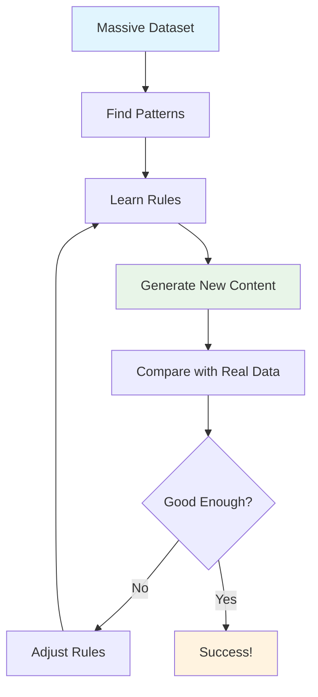

# GenAI Fundamentals: Building Strong Foundations

!!! abstract "From Basics to Deep Understanding"
    Master the core concepts that power modern Generative AI. Whether you're completely new to AI or want to deepen your understanding, this comprehensive guide takes you from fundamentals to advanced theory with clear explanations and practical insights.

## 🎯 Your Learning Journey

This module is designed for **progressive learning** - start where you feel comfortable and build up systematically:

### 🌟 Beginner Path (Start Here if New to AI)
**Time**: 1-2 weeks | **Goal**: Understand what GenAI is and how it works

### 🚀 Intermediate Path (Some ML Background)
**Time**: 2-3 weeks | **Goal**: Deep dive into architectures and training

### 🎓 Advanced Path (Strong Technical Background)
**Time**: 3-4 weeks | **Goal**: Master theory and cutting-edge concepts

## 📚 Module Overview

<div class="grid cards" markdown>

-   :material-calculator: **[Mathematics Made Simple](mathematics.md)**
    
    ---
    
    **Start Here**: Essential math concepts explained intuitively
    
    - Linear algebra basics
    - Probability for beginners
    - Calculus concepts
    - Information theory
    
    **Time**: 2-3 hours | **Level**: Beginner

-   :material-brain: **[Neural Networks from Zero](neural-networks.md)**
    
    ---
    
    **No experience needed**: Complete guide from neurons to deep learning
    
    - What are neural networks?
    - How do they learn?
    - Building your first network
    - Modern architectures
    
    **Time**: 4-6 hours | **Level**: Beginner to Advanced

-   :material-lightbulb: **[Core GenAI Concepts](core-concepts.md)**
    
    ---
    
    **Key insights**: Why GenAI works and what makes it special
    
    - Representation learning
    - Generative vs discriminative
    - Emergent behaviors
    - Scaling laws
    
    **Time**: 3-4 hours | **Level**: Intermediate

-   :material-timeline: **[Evolution of AI](evolution.md)**
    
    ---
    
    **Historical context**: How we got to modern GenAI
    
    - AI winters and springs
    - Key breakthroughs
    - Current state
    - Future directions
    
    **Time**: 2-3 hours | **Level**: All levels

</div>

## 🎯 Learning Outcomes

After completing this module, you will:

### 🧠 Understand the "Why" Behind GenAI
- **Intuitive grasp** of how neural networks process information
- **Clear understanding** of what makes AI "generative"
- **Practical knowledge** of when and why different techniques work
- **Confidence** to explore more advanced topics

### 🔧 Build Technical Foundation
- **Mathematical literacy** for GenAI (without overwhelming complexity)
- **Architectural understanding** of modern AI systems
- **Training insights** into how models learn and improve
- **Problem-solving skills** for AI applications

### 🌟 Develop AI Intuition
- **Pattern recognition** in AI problems and solutions
- **Quality assessment** of AI outputs and systems
- **Troubleshooting skills** for common AI issues
- **Future-ready mindset** for evolving AI landscape

## 🤖 What Makes AI "Generative"? (Essential Concepts)

### The Big Picture

Think of **discriminative AI** as a detective who can tell you "This is a cat" when shown a photo. **Generative AI** is like an artist who can **create** new cat photos that never existed before!

```mermaid
graph LR
    A[Discriminative AI] --> B[Classifies & Analyzes]
    B --> C[Input: Photo → Output: "Cat"]
    
    D[Generative AI] --> E[Creates & Generates]
    E --> F[Input: "Cat" → Output: New Photo]
    
    style A fill:#ffebee
    style D fill:#e8f5e8
    style B fill:#fff3e0
    style E fill:#e1f5fe
```

### Core Principle: Learning Patterns

Generative AI works by:

1. **Studying millions of examples** (photos, text, music)
2. **Finding hidden patterns** in the data
3. **Learning to create new examples** that follow the same patterns

**Simple Analogy**: Like learning to write poetry by reading thousands of poems, then writing your own in similar style!

### Why It Works: The Mathematical Foundation

**Don't worry** - we'll keep this simple but accurate:

#### Pattern Recognition Through Probability

- **Training**: "I've seen 1 million photos of cats. Here's what cats typically look like..."
- **Generation**: "Based on these patterns, here's a new cat photo that follows the same rules"

#### The Learning Process



## 🧠 How Neural Networks Enable Generation

### The Magic of Layers

Neural networks are like **teams of specialists** working together:

- **Layer 1**: Basic feature detectors (edges, lines)
- **Layer 2**: Combining features (shapes, textures)
- **Layer 3**: Complex patterns (objects, concepts)
- **Layer 4**: High-level understanding (context, meaning)

### Generation Process

1. **Start with noise** (random numbers)
2. **Apply learned patterns** layer by layer
3. **Refine and improve** through multiple layers
4. **Output coherent result** (text, image, etc.)

## 🎯 Key Concepts Made Simple

### 1. Representation Learning

**What it is**: Learning to represent information in useful ways

**Example**: 
- **Bad representation**: Storing every pixel of every cat photo
- **Good representation**: Learning "cat-ness" as a pattern that can generate any cat

### 2. Attention Mechanisms

**What it is**: Focusing on relevant parts of input

**Example**: When writing "The cat sat on the ___", pay attention to "cat" and "sat" to predict "mat"

### 3. Scaling Laws

**What it is**: Bigger models often work better

**Why**: More parameters = ability to capture more complex patterns

### 4. Emergent Behaviors

**What it is**: Unexpected capabilities that appear in large models

**Examples**:
- **Small models**: Can complete sentences
- **Large models**: Can reason, write code, solve problems

## 🔮 Modern Breakthroughs

### The Transformer Revolution

**What changed**: New architecture that processes all parts of input simultaneously

**Why it matters**: 
- **Much faster training** (parallel processing)
- **Better long-range understanding** (attention to any part)
- **Enabled massive models** (GPT, BERT, etc.)

### Foundation Models

**What they are**: Massive models trained on everything

**Why they're special**:
- **One model, many tasks** (chat, code, images)
- **Transfer learning** (apply knowledge to new domains)
- **Few-shot learning** (learn from just a few examples)

## 🛠️ Practical Implications

### For Developers

- **APIs and tools** make GenAI accessible without deep theory
- **Understanding fundamentals** helps with prompt engineering
- **Knowing limitations** prevents unrealistic expectations

### For Businesses

- **Automation opportunities** in content creation
- **Enhanced human capabilities** rather than replacement
- **Quality control** requires understanding of model behavior

### For Society

- **Creative augmentation** in art, writing, and design
- **Educational transformation** with personalized learning
- **Ethical considerations** around authenticity and bias

#### 3. Information Theory Foundations

**Entropy and Information Content**:
- **Shannon Entropy**: H(X) = -Σ P(x) log P(x)
- **Cross-Entropy**: H(P,Q) = -Σ P(x) log Q(x)
- **Mutual Information**: I(X;Y) = H(X) - H(X|Y)

**Generation Quality Metrics**:
- **Perplexity**: exp(H(P,Q)) - lower is better
- **Bits per Character/Token**: Compression efficiency measure
- **Inception Score**: exp(E[D_KL(P(y|x)||P(y))]) - higher is better

## 🧠 Cognitive and Computational Principles

### Emergence and Scaling Laws

#### Phase Transitions in Model Behavior

**Scaling Laws**: Performance scales predictably with:
- Model size (parameters N)
- Dataset size (tokens D)  
- Compute budget (FLOPs C)

**Mathematical Relationship**:
```
Loss(N,D,C) ∝ N^(-α) + D^(-β) + C^(-γ)
```

**Emergent Abilities**: Capabilities that appear suddenly at certain scales:
- Few-shot learning (≥ 1B parameters)
- Chain-of-thought reasoning (≥ 10B parameters)
- In-context learning (≥ 100B parameters)

#### Grokking Phenomenon

**Definition**: Sudden transition from memorization to generalization

**Characteristics**:
- Training accuracy reaches 100% quickly
- Validation accuracy improves slowly, then suddenly jumps
- Occurs after extended training beyond apparent convergence

### Representation Learning Theory

#### Distributed Representations

**Principle**: Concepts are represented as patterns across many neurons

**Advantages**:
- **Compositionality**: Complex concepts from simple components
- **Generalization**: Similar representations for similar concepts
- **Efficiency**: Exponential capacity with linear resources

**Mathematical Foundation**:
- Vector space semantics: meaning as geometric relationships
- Cosine similarity: semantic similarity measure
- Linear algebraic operations: analogy completion (king - man + woman ≈ queen)

#### The Universal Approximation Theorem

**Statement**: Neural networks with sufficient width can approximate any continuous function

**Implications for GenAI**:
- Theoretical justification for deep learning's power
- Explains why large models can capture complex distributions
- Depth vs. width trade-offs in approximation efficiency

## 🔄 Generation Mechanisms

### Autoregressive Generation

**Principle**: P(x₁, x₂, ..., xₙ) = ∏ P(xᵢ|x₁, ..., xᵢ₋₁)

**Mathematical Properties**:
- **Exact likelihood computation**: Tractable training objective
- **Sequential dependency**: Each token depends on all previous tokens
- **Causal masking**: Information flow constraint

**Theoretical Challenges**:
- **Exposure bias**: Training vs. inference distribution mismatch
- **Length bias**: Shorter sequences have higher probability
- **Error accumulation**: Early mistakes compound

### Diffusion Processes

**Principle**: Learn to reverse a gradual noising process

**Mathematical Framework**:
- **Forward process**: q(xₜ|xₜ₋₁) = N(√(1-βₜ)xₜ₋₁, βₜI)
- **Reverse process**: pθ(xₜ₋₁|xₜ) = N(μθ(xₜ,t), Σθ(xₜ,t))
- **Training objective**: Lₜ = E[||ε - εθ(√ᾱₜx₀ + √(1-ᾱₜ)ε, t)||²]

**Theoretical Advantages**:
- **Stable training**: No adversarial dynamics
- **High sample quality**: Gradual refinement process
- **Exact likelihood**: (with some variants)

### Latent Variable Models

**Principle**: Model complex distributions through latent variables

**Variational Autoencoders (VAEs)**:
- **Encoder**: qφ(z|x) ≈ P(z|x)
- **Decoder**: pθ(x|z) models the generation process
- **ELBO**: log P(x) ≥ E[log pθ(x|z)] - D_KL(qφ(z|x)||P(z))

**Generative Adversarial Networks (GANs)**:
- **Minimax game**: min_G max_D E[log D(x)] + E[log(1-D(G(z)))]
- **Nash equilibrium**: Optimal when P_G = P_data
- **Mode collapse**: Theoretical limitation in practice

## 🌊 Attention and Transformer Theory

### Self-Attention Mechanism

**Mathematical Formulation**:
```
Attention(Q,K,V) = softmax(QK^T/√d_k)V
```

**Theoretical Properties**:
- **Content-based addressing**: Queries find relevant keys
- **Permutation equivariance**: Order-independent processing
- **Universal approximation**: Can represent any permutation-equivariant function

### Positional Encoding Theory

**Problem**: Transformers are permutation-equivariant but language has order

**Solutions**:
- **Sinusoidal encoding**: PE(pos,2i) = sin(pos/10000^(2i/d))
- **Learned embeddings**: Trainable position vectors
- **Relative positioning**: Distance-based attention biases

**Theoretical Considerations**:
- **Length generalization**: Can models handle longer sequences than trained on?
- **Compositional structure**: How do positions interact with content?

## 📊 Evaluation Theory

### Intrinsic vs. Extrinsic Evaluation

**Intrinsic Metrics** (Model-based):
- **Perplexity**: Model confidence in predictions
- **BLEU/ROUGE**: N-gram overlap with references
- **FID/IS**: Distribution-based image quality

**Extrinsic Metrics** (Task-based):
- **Downstream task performance**: Real-world utility
- **Human evaluation**: Subjective quality assessment
- **Robustness measures**: Performance under distribution shift

### Theoretical Challenges in Evaluation

**The Alignment Problem**:
- Optimizing metrics ≠ optimizing true quality
- Goodhart's Law: "When a measure becomes a target, it ceases to be a good measure"

**Sample Efficiency vs. Quality**:
- Better models often require more samples for accurate evaluation
- Statistical significance in human evaluation studies

## 🎓 Key Theoretical Insights

### Why Large Models Work

1. **Lottery Ticket Hypothesis**: Large models contain smaller, trainable subnetworks
2. **Overparameterization Benefits**: More parameters → better optimization landscape
3. **Implicit Regularization**: SGD favors simpler solutions
4. **Feature Learning**: Deep networks learn hierarchical representations

### Fundamental Limitations

1. **Hallucination Problem**: Models generate plausible but false information
2. **Context Length Limits**: Quadratic attention scaling
3. **Training Data Dependence**: Cannot generate beyond training distribution
4. **Interpretability Challenge**: Complex learned representations

### Open Theoretical Questions

1. **Mechanistic Interpretability**: How do models perform specific tasks?
2. **Emergence Prediction**: Can we predict when capabilities will emerge?
3. **Alignment Theory**: How to ensure AI systems pursue intended goals?
4. **Generalization Bounds**: Theoretical guarantees on out-of-distribution performance

## 📚 Essential Mathematical Background

### Required Mathematics

| Area | Key Concepts | Relevance to GenAI |
|------|--------------|-------------------|
| **Linear Algebra** | Matrix operations, eigenvalues, SVD | Neural network computations, attention |
| **Calculus** | Gradients, chain rule, optimization | Backpropagation, loss minimization |
| **Probability** | Distributions, Bayes' theorem, sampling | Generative modeling, uncertainty |
| **Information Theory** | Entropy, mutual information, compression | Evaluation metrics, data efficiency |
| **Optimization** | Convexity, gradient descent, momentum | Training algorithms, convergence |
| **Statistics** | Hypothesis testing, confidence intervals | Model evaluation, significance testing |

### Mathematical Intuition

**Why do these math concepts matter?**

- **Linear Algebra**: Neural networks are composition of linear transformations
- **Probability**: Generation is fundamentally about sampling from learned distributions  
- **Calculus**: We optimize by following gradients in parameter space
- **Information Theory**: Helps quantify and compare generation quality
- **Statistics**: Essential for properly evaluating model performance

## 📖 Fundamental Terminology

| Term | Mathematical Definition | Intuitive Meaning |
|------|------------------------|------------------|
| **Likelihood** | P(data\|model) | How well model explains observed data |
| **Prior** | P(parameters) | Initial beliefs about model parameters |
| **Posterior** | P(parameters\|data) | Updated beliefs after seeing data |
| **Entropy** | -Σ p(x) log p(x) | Uncertainty/information content |
| **KL Divergence** | Σ p(x) log(p(x)/q(x)) | Distance between distributions |
| **Gradient** | ∇f(x) | Direction of steepest increase |

## 🎓 Assessment Questions

!!! question "Theoretical Understanding Check"
    1. Why is the manifold hypothesis crucial for generative modeling?
    2. How does the universal approximation theorem justify deep learning approaches?
    3. What is the theoretical relationship between model size and emergent capabilities?
    4. Why do autoregressive models suffer from exposure bias?
    5. How does information theory help us evaluate generation quality?
    6. What are the theoretical advantages of attention mechanisms over RNNs?

## 📚 Next Steps

With these theoretical foundations, you're ready to understand:

1. **[Mathematics Deep Dive](mathematics.md)** - Detailed mathematical foundations
2. **[Neural Networks Theory](neural-networks.md)** - Advanced theoretical concepts
3. **[Core Concepts](core-concepts.md)** - Representation learning and emergence
4. **[Large Language Models](../llms/index.md)** - Applying theory to modern systems

---

!!! tip "Theoretical vs. Practical"
    Understanding these theoretical foundations will help you:
    - Make informed architectural choices
    - Debug training issues more effectively  
    - Predict model behavior and limitations
    - Stay current with research developments
