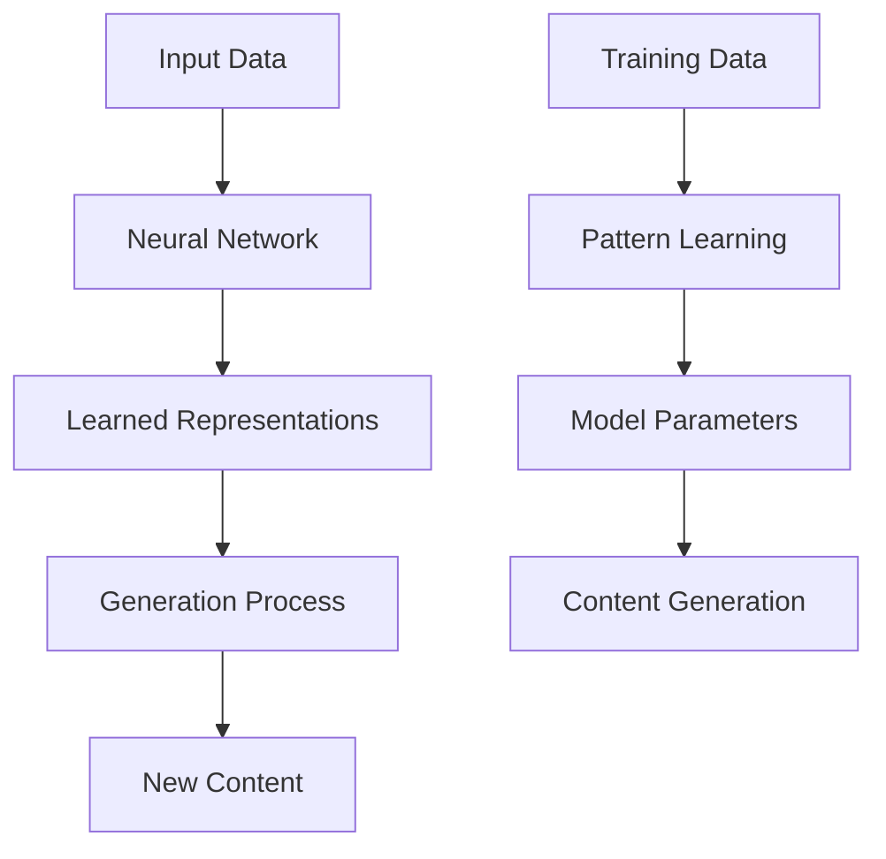
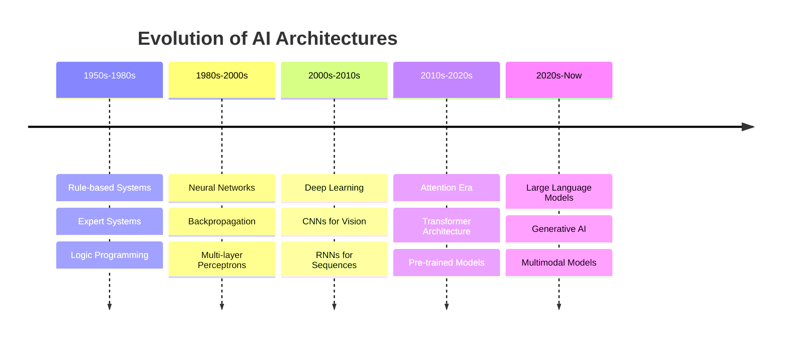

# GenAI Fundamentals

!!! abstract "Building Strong Foundations"
    Master the core concepts, mathematical foundations, and key principles that underpin all generative AI systems.

## 📚 Chapter Overview

<div class="grid cards" markdown>

-   :material-math-integral: **Mathematical Foundations**
    
    ---
    
    Linear algebra, calculus, probability, and statistics
    
    [Learn math →](mathematics.md)

-   :material-brain: **Neural Networks Basics**
    
    ---
    
    Perceptrons, backpropagation, and deep networks
    
    [Understand networks →](neural-networks.md)

-   :material-atom: **Core Concepts**
    
    ---
    
    Tokens, embeddings, and representation learning
    
    [Grasp concepts →](core-concepts.md)

-   :material-chart-timeline: **Evolution of AI**
    
    ---
    
    From rule-based systems to modern GenAI
    
    [Trace evolution →](evolution.md)

</div>

## 🎯 Learning Objectives

By the end of this module, you will:

- ✅ Understand the mathematical foundations of neural networks
- ✅ Grasp key concepts like tokens, embeddings, and attention
- ✅ Know the evolution from traditional AI to generative models
- ✅ Implement basic neural networks from scratch
- ✅ Understand probability distributions and information theory

## 🔍 What is Generative AI?

Generative AI refers to artificial intelligence systems that can create new content—text, images, code, audio, or video—that is similar to human-created content.



### Key Characteristics

| Characteristic | Description | Example |
|----------------|-------------|---------|
| **Creativity** | Generates novel content | Writing poetry, creating art |
| **Context Awareness** | Understands context and meaning | Contextual responses |
| **Adaptability** | Learns from examples | Few-shot learning |
| **Multimodality** | Works across different data types | Text-to-image generation |

## 🧠 Core Principles

### 1. Probabilistic Generation

Generative models learn probability distributions over data:

```python
# Conceptual example of probabilistic text generation
import numpy as np

class SimpleLanguageModel:
    def __init__(self):
        self.word_probs = {}
    
    def train(self, text_data):
        """Learn word probabilities from training data"""
        words = text_data.split()
        for i in range(len(words) - 1):
            current_word = words[i]
            next_word = words[i + 1]
            
            if current_word not in self.word_probs:
                self.word_probs[current_word] = {}
            
            if next_word not in self.word_probs[current_word]:
                self.word_probs[current_word][next_word] = 0
            
            self.word_probs[current_word][next_word] += 1
    
    def generate_text(self, start_word, length=10):
        """Generate text based on learned probabilities"""
        result = [start_word]
        current_word = start_word
        
        for _ in range(length - 1):
            if current_word in self.word_probs:
                next_words = list(self.word_probs[current_word].keys())
                probabilities = list(self.word_probs[current_word].values())
                
                # Normalize probabilities
                total = sum(probabilities)
                probabilities = [p/total for p in probabilities]
                
                # Sample next word
                next_word = np.random.choice(next_words, p=probabilities)
                result.append(next_word)
                current_word = next_word
            else:
                break
        
        return ' '.join(result)

# Example usage
model = SimpleLanguageModel()
training_text = "the cat sat on the mat the dog ran in the park"
model.train(training_text)
generated = model.generate_text("the", 5)
print(f"Generated: {generated}")
```

### 2. Representation Learning

Models learn to represent data in high-dimensional vector spaces:

```python
# Simple word embedding example
import numpy as np
from sklearn.decomposition import PCA
import matplotlib.pyplot as plt

class SimpleWordEmbedding:
    def __init__(self, embedding_dim=100):
        self.embedding_dim = embedding_dim
        self.word_to_idx = {}
        self.embeddings = None
    
    def build_vocabulary(self, text_data):
        """Build vocabulary from text data"""
        words = set(text_data.lower().split())
        self.word_to_idx = {word: idx for idx, word in enumerate(words)}
        self.vocab_size = len(words)
        
        # Initialize random embeddings
        self.embeddings = np.random.randn(self.vocab_size, self.embedding_dim)
    
    def get_embedding(self, word):
        """Get embedding for a word"""
        if word.lower() in self.word_to_idx:
            idx = self.word_to_idx[word.lower()]
            return self.embeddings[idx]
        return None
    
    def similarity(self, word1, word2):
        """Compute cosine similarity between two words"""
        emb1 = self.get_embedding(word1)
        emb2 = self.get_embedding(word2)
        
        if emb1 is not None and emb2 is not None:
            # Cosine similarity
            dot_product = np.dot(emb1, emb2)
            norm1 = np.linalg.norm(emb1)
            norm2 = np.linalg.norm(emb2)
            return dot_product / (norm1 * norm2)
        return 0

# Example usage
embedding_model = SimpleWordEmbedding()
text = "cat dog animal pet bird fish water swimming running playing"
embedding_model.build_vocabulary(text)

print(f"Similarity between 'cat' and 'dog': {embedding_model.similarity('cat', 'dog'):.3f}")
print(f"Similarity between 'cat' and 'water': {embedding_model.similarity('cat', 'water'):.3f}")
```

### 3. Attention Mechanisms

Attention allows models to focus on relevant parts of input:

```python
# Simplified attention mechanism
import numpy as np

def simple_attention(query, keys, values):
    """
    Simple attention mechanism
    
    Args:
        query: Query vector (1, d_model)
        keys: Key vectors (seq_len, d_model)
        values: Value vectors (seq_len, d_model)
    
    Returns:
        Attended output vector
    """
    # Compute attention scores
    scores = np.dot(keys, query.T).flatten()
    
    # Apply softmax to get attention weights
    exp_scores = np.exp(scores - np.max(scores))  # Numerical stability
    attention_weights = exp_scores / np.sum(exp_scores)
    
    # Compute weighted sum of values
    attended_output = np.sum(values * attention_weights.reshape(-1, 1), axis=0)
    
    return attended_output, attention_weights

# Example usage
d_model = 4
seq_len = 3

# Example vectors
query = np.array([[1, 0, 1, 0]])  # What we're looking for
keys = np.array([
    [1, 1, 0, 0],    # First position
    [0, 1, 1, 0],    # Second position  
    [1, 0, 1, 1]     # Third position
])
values = np.array([
    [0.1, 0.2, 0.3, 0.4],  # Value at first position
    [0.5, 0.6, 0.7, 0.8],  # Value at second position
    [0.9, 1.0, 1.1, 1.2]   # Value at third position
])

output, weights = simple_attention(query, keys, values)
print(f"Attention weights: {weights}")
print(f"Attended output: {output}")
```

## 🏗️ Architecture Evolution



## 🧪 Hands-on Exercises

### Exercise 1: Build a Character-Level Language Model

```python
import torch
import torch.nn as nn
import torch.optim as optim
import numpy as np

class CharRNN(nn.Module):
    def __init__(self, vocab_size, hidden_size=128, num_layers=2):
        super(CharRNN, self).__init__()
        self.hidden_size = hidden_size
        self.num_layers = num_layers
        
        self.embedding = nn.Embedding(vocab_size, hidden_size)
        self.rnn = nn.LSTM(hidden_size, hidden_size, num_layers, batch_first=True)
        self.linear = nn.Linear(hidden_size, vocab_size)
    
    def forward(self, x, hidden=None):
        embedded = self.embedding(x)
        output, hidden = self.rnn(embedded, hidden)
        output = self.linear(output)
        return output, hidden
    
    def generate(self, start_char_idx, max_length=100, temperature=1.0):
        """Generate text starting from a character"""
        self.eval()
        generated = [start_char_idx]
        hidden = None
        
        with torch.no_grad():
            for _ in range(max_length):
                x = torch.tensor([[generated[-1]]])
                output, hidden = self.forward(x, hidden)
                
                # Apply temperature sampling
                output = output[0, -1, :] / temperature
                probs = torch.softmax(output, dim=0)
                next_char_idx = torch.multinomial(probs, 1).item()
                generated.append(next_char_idx)
        
        return generated

# Example training setup
def train_char_rnn(text_data, epochs=100):
    # Create character vocabulary
    chars = sorted(list(set(text_data)))
    char_to_idx = {ch: i for i, ch in enumerate(chars)}
    idx_to_char = {i: ch for i, ch in enumerate(chars)}
    vocab_size = len(chars)
    
    # Prepare training data
    sequence_length = 50
    sequences = []
    targets = []
    
    for i in range(len(text_data) - sequence_length):
        seq = text_data[i:i + sequence_length]
        target = text_data[i + 1:i + sequence_length + 1]
        sequences.append([char_to_idx[ch] for ch in seq])
        targets.append([char_to_idx[ch] for ch in target])
    
    # Convert to tensors
    X = torch.tensor(sequences)
    y = torch.tensor(targets)
    
    # Initialize model
    model = CharRNN(vocab_size)
    criterion = nn.CrossEntropyLoss()
    optimizer = optim.Adam(model.parameters(), lr=0.001)
    
    # Training loop
    model.train()
    for epoch in range(epochs):
        optimizer.zero_grad()
        output, _ = model(X)
        loss = criterion(output.reshape(-1, vocab_size), y.reshape(-1))
        loss.backward()
        optimizer.step()
        
        if epoch % 20 == 0:
            print(f'Epoch {epoch}, Loss: {loss.item():.4f}')
    
    return model, char_to_idx, idx_to_char

# Example usage
sample_text = "hello world this is a simple example of text generation"
# model, char_to_idx, idx_to_char = train_char_rnn(sample_text)
```

### Exercise 2: Implement Simple Tokenization

```python
import re
from collections import Counter

class SimpleTokenizer:
    def __init__(self):
        self.vocab = {}
        self.reverse_vocab = {}
        self.unk_token = "<UNK>"
        self.pad_token = "<PAD>"
        self.start_token = "<START>"
        self.end_token = "<END>"
    
    def build_vocab(self, texts, min_freq=1):
        """Build vocabulary from a list of texts"""
        # Tokenize and count words
        word_counts = Counter()
        for text in texts:
            tokens = self.tokenize(text)
            word_counts.update(tokens)
        
        # Create vocabulary
        special_tokens = [self.pad_token, self.unk_token, self.start_token, self.end_token]
        vocab_words = special_tokens + [word for word, count in word_counts.items() if count >= min_freq]
        
        self.vocab = {word: idx for idx, word in enumerate(vocab_words)}
        self.reverse_vocab = {idx: word for word, idx in self.vocab.items()}
    
    def tokenize(self, text):
        """Simple tokenization by splitting on whitespace and punctuation"""
        # Convert to lowercase and split
        tokens = re.findall(r'\b\w+\b', text.lower())
        return tokens
    
    def encode(self, text):
        """Convert text to token IDs"""
        tokens = self.tokenize(text)
        return [self.vocab.get(token, self.vocab[self.unk_token]) for token in tokens]
    
    def decode(self, token_ids):
        """Convert token IDs back to text"""
        tokens = [self.reverse_vocab.get(idx, self.unk_token) for idx in token_ids]
        return ' '.join(tokens)
    
    def vocab_size(self):
        return len(self.vocab)

# Example usage
tokenizer = SimpleTokenizer()
sample_texts = [
    "Hello world, this is a sample text.",
    "This is another example for tokenization.",
    "We are building a simple tokenizer."
]

tokenizer.build_vocab(sample_texts)
print(f"Vocabulary size: {tokenizer.vocab_size()}")
print(f"Vocabulary: {list(tokenizer.vocab.keys())[:10]}")

# Encode and decode example
text = "Hello world"
encoded = tokenizer.encode(text)
decoded = tokenizer.decode(encoded)
print(f"Original: {text}")
print(f"Encoded: {encoded}")
print(f"Decoded: {decoded}")
```

## 📖 Key Terminology

| Term | Definition | Example |
|------|------------|---------|
| **Token** | Basic unit of text processing | Word, subword, or character |
| **Embedding** | Dense vector representation | 300-dimensional word vector |
| **Attention** | Mechanism to focus on relevant parts | Highlighting important words |
| **Transformer** | Architecture based on attention | GPT, BERT, T5 models |
| **Pre-training** | Initial training on large datasets | Training on web text |
| **Fine-tuning** | Adapting to specific tasks | Training for sentiment analysis |

## 🎓 Assessment Questions

!!! question "Self-Check Questions"
    1. What is the difference between discriminative and generative models?
    2. How do attention mechanisms help in sequence modeling?
    3. What are the advantages of token-based representations?
    4. Why is probability important in generative models?
    5. What role do embeddings play in neural language models?

## 📚 Next Steps

After mastering these fundamentals, you're ready to dive deeper into:

1. **[Large Language Models](../llms/index.md)** - Understanding modern LLM architectures
2. **[Transformers](../transformers/index.md)** - Deep dive into transformer architecture
3. **[Neural Networks](neural-networks.md)** - Advanced neural network concepts

---

!!! tip "Remember"
    Strong fundamentals are the key to mastering advanced GenAI concepts. Take time to understand these core principles before moving to more complex topics.
