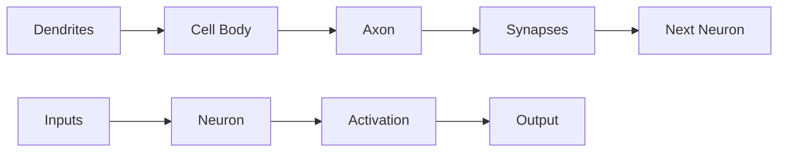

# Neural Networks Fundamentals

!!! info "Building Blocks of AI"
    Understanding the core concepts of neural networks that form the foundation of all generative AI models.

## What are Neural Networks?

Neural networks are computational models inspired by biological neural networks in animal brains. They consist of interconnected nodes (neurons) that process and transmit information to solve complex problems.

### Biological Inspiration



## The Perceptron: Building Block

### Mathematical Foundation

A perceptron is the simplest neural network unit:

```python
import numpy as np
import matplotlib.pyplot as plt

class Perceptron:
    def __init__(self, input_size, learning_rate=0.01):
        # Initialize weights randomly
        self.weights = np.random.randn(input_size) * 0.01
        self.bias = 0
        self.learning_rate = learning_rate
    
    def activation(self, x):
        """Step activation function"""
        return 1 if x >= 0 else 0
    
    def predict(self, inputs):
        """Make prediction"""
        linear_output = np.dot(inputs, self.weights) + self.bias
        return self.activation(linear_output)
    
    def train(self, training_inputs, labels, epochs=100):
        """Train the perceptron"""
        for epoch in range(epochs):
            for inputs, label in zip(training_inputs, labels):
                prediction = self.predict(inputs)
                error = label - prediction
                
                # Update weights and bias
                self.weights += self.learning_rate * error * inputs
                self.bias += self.learning_rate * error
    
    def get_weights(self):
        return self.weights, self.bias

# Example: AND gate
training_data = np.array([[0, 0], [0, 1], [1, 0], [1, 1]])
labels = np.array([0, 0, 0, 1])

perceptron = Perceptron(input_size=2)
perceptron.train(training_data, labels, epochs=100)

# Test the trained perceptron
print("AND Gate Results:")
for inputs, expected in zip(training_data, labels):
    prediction = perceptron.predict(inputs)
    print(f"Input: {inputs}, Expected: {expected}, Predicted: {prediction}")

# Visualize decision boundary
def plot_decision_boundary(perceptron, training_data, labels):
    plt.figure(figsize=(8, 6))
    
    # Plot training points
    for i, (point, label) in enumerate(zip(training_data, labels)):
        color = 'red' if label == 1 else 'blue'
        plt.scatter(point[0], point[1], c=color, s=100, alpha=0.7)
    
    # Plot decision boundary
    weights, bias = perceptron.get_weights()
    x = np.linspace(-0.5, 1.5, 100)
    y = -(weights[0] * x + bias) / weights[1]
    plt.plot(x, y, 'green', linewidth=2, label='Decision Boundary')
    
    plt.xlim(-0.5, 1.5)
    plt.ylim(-0.5, 1.5)
    plt.xlabel('Input 1')
    plt.ylabel('Input 2')
    plt.title('Perceptron Decision Boundary for AND Gate')
    plt.legend()
    plt.grid(True, alpha=0.3)
    plt.show()

plot_decision_boundary(perceptron, training_data, labels)
```

### Limitations of Single Perceptron

```python
# XOR problem - not linearly separable
xor_data = np.array([[0, 0], [0, 1], [1, 0], [1, 1]])
xor_labels = np.array([0, 1, 1, 0])

single_perceptron = Perceptron(input_size=2)
single_perceptron.train(xor_data, xor_labels, epochs=1000)

print("\nXOR Problem with Single Perceptron:")
for inputs, expected in zip(xor_data, xor_labels):
    prediction = single_perceptron.predict(inputs)
    print(f"Input: {inputs}, Expected: {expected}, Predicted: {prediction}")

print("Single perceptron cannot solve XOR - we need multiple layers!")
```

## Multi-Layer Neural Networks

### Forward Propagation

```python
class NeuralNetwork:
    def __init__(self, input_size, hidden_size, output_size, learning_rate=0.01):
        # Initialize weights with Xavier initialization
        self.W1 = np.random.randn(input_size, hidden_size) / np.sqrt(input_size)
        self.b1 = np.zeros((1, hidden_size))
        self.W2 = np.random.randn(hidden_size, output_size) / np.sqrt(hidden_size)
        self.b2 = np.zeros((1, output_size))
        self.learning_rate = learning_rate
    
    def sigmoid(self, x):
        """Sigmoid activation function"""
        return 1 / (1 + np.exp(-np.clip(x, -250, 250)))  # Clip to prevent overflow
    
    def sigmoid_derivative(self, x):
        """Derivative of sigmoid function"""
        return x * (1 - x)
    
    def forward(self, X):
        """Forward propagation"""
        self.z1 = np.dot(X, self.W1) + self.b1
        self.a1 = self.sigmoid(self.z1)
        self.z2 = np.dot(self.a1, self.W2) + self.b2
        self.a2 = self.sigmoid(self.z2)
        return self.a2
    
    def backward(self, X, y, output):
        """Backward propagation"""
        m = X.shape[0]
        
        # Calculate gradients
        dz2 = output - y
        dW2 = (1/m) * np.dot(self.a1.T, dz2)
        db2 = (1/m) * np.sum(dz2, axis=0, keepdims=True)
        
        dz1 = np.dot(dz2, self.W2.T) * self.sigmoid_derivative(self.a1)
        dW1 = (1/m) * np.dot(X.T, dz1)
        db1 = (1/m) * np.sum(dz1, axis=0, keepdims=True)
        
        # Update weights
        self.W2 -= self.learning_rate * dW2
        self.b2 -= self.learning_rate * db2
        self.W1 -= self.learning_rate * dW1
        self.b1 -= self.learning_rate * db1
    
    def train(self, X, y, epochs=1000):
        """Train the neural network"""
        losses = []
        
        for epoch in range(epochs):
            # Forward propagation
            output = self.forward(X)
            
            # Calculate loss (binary cross-entropy)
            loss = -np.mean(y * np.log(output + 1e-8) + (1 - y) * np.log(1 - output + 1e-8))
            losses.append(loss)
            
            # Backward propagation
            self.backward(X, y, output)
            
            if epoch % 100 == 0:
                print(f"Epoch {epoch}, Loss: {loss:.4f}")
        
        return losses
    
    def predict(self, X):
        """Make predictions"""
        output = self.forward(X)
        return (output > 0.5).astype(int)

# Solve XOR problem with multi-layer network
X_xor = np.array([[0, 0], [0, 1], [1, 0], [1, 1]])
y_xor = np.array([[0], [1], [1], [0]])

# Create and train network
nn = NeuralNetwork(input_size=2, hidden_size=4, output_size=1, learning_rate=1.0)
losses = nn.train(X_xor, y_xor, epochs=5000)

# Test the network
print("\nXOR Problem with Multi-Layer Network:")
predictions = nn.predict(X_xor)
for i, (inputs, expected) in enumerate(zip(X_xor, y_xor)):
    prediction = predictions[i][0]
    print(f"Input: {inputs}, Expected: {expected[0]}, Predicted: {prediction}")

# Plot training loss
plt.figure(figsize=(10, 6))
plt.plot(losses)
plt.title('Training Loss Over Time')
plt.xlabel('Epoch')
plt.ylabel('Loss')
plt.yscale('log')
plt.grid(True, alpha=0.3)
plt.show()
```

### Visualization of Hidden Representations

```python
def visualize_hidden_layer(nn, X):
    """Visualize what the hidden layer learns"""
    # Get hidden layer activations
    hidden_activations = nn.sigmoid(np.dot(X, nn.W1) + nn.b1)
    
    print("Hidden Layer Activations:")
    print("Input -> Hidden Layer Outputs")
    for i, (inputs, hidden) in enumerate(zip(X, hidden_activations)):
        print(f"{inputs} -> {hidden}")
    
    # Visualize weight matrices
    fig, axes = plt.subplots(1, 3, figsize=(15, 4))
    
    # Input to hidden weights
    im1 = axes[0].imshow(nn.W1, cmap='coolwarm', aspect='auto')
    axes[0].set_title('Input to Hidden Weights')
    axes[0].set_xlabel('Hidden Neurons')
    axes[0].set_ylabel('Input Features')
    plt.colorbar(im1, ax=axes[0])
    
    # Hidden to output weights
    im2 = axes[1].imshow(nn.W2.T, cmap='coolwarm', aspect='auto')
    axes[1].set_title('Hidden to Output Weights')
    axes[1].set_xlabel('Output Neurons')
    axes[1].set_ylabel('Hidden Neurons')
    plt.colorbar(im2, ax=axes[1])
    
    # Hidden activations for each input
    im3 = axes[2].imshow(hidden_activations.T, cmap='viridis', aspect='auto')
    axes[2].set_title('Hidden Layer Activations')
    axes[2].set_xlabel('Input Samples')
    axes[2].set_ylabel('Hidden Neurons')
    plt.colorbar(im3, ax=axes[2])
    
    plt.tight_layout()
    plt.show()

visualize_hidden_layer(nn, X_xor)
```

## Activation Functions

### Common Activation Functions

```python
class ActivationFunctions:
    @staticmethod
    def sigmoid(x):
        return 1 / (1 + np.exp(-np.clip(x, -250, 250)))
    
    @staticmethod
    def tanh(x):
        return np.tanh(x)
    
    @staticmethod
    def relu(x):
        return np.maximum(0, x)
    
    @staticmethod
    def leaky_relu(x, alpha=0.01):
        return np.where(x > 0, x, alpha * x)
    
    @staticmethod
    def elu(x, alpha=1.0):
        return np.where(x > 0, x, alpha * (np.exp(x) - 1))
    
    @staticmethod
    def swish(x):
        return x * ActivationFunctions.sigmoid(x)
    
    @staticmethod
    def gelu(x):
        return 0.5 * x * (1 + np.tanh(np.sqrt(2 / np.pi) * (x + 0.044715 * x**3)))

def plot_activation_functions():
    """Plot various activation functions"""
    x = np.linspace(-5, 5, 1000)
    activations = ActivationFunctions()
    
    functions = {
        'Sigmoid': activations.sigmoid,
        'Tanh': activations.tanh,
        'ReLU': activations.relu,
        'Leaky ReLU': activations.leaky_relu,
        'ELU': activations.elu,
        'Swish': activations.swish,
        'GELU': activations.gelu
    }
    
    fig, axes = plt.subplots(2, 4, figsize=(16, 8))
    axes = axes.flatten()
    
    for i, (name, func) in enumerate(functions.items()):
        y = func(x)
        axes[i].plot(x, y, linewidth=2)
        axes[i].set_title(name)
        axes[i].grid(True, alpha=0.3)
        axes[i].set_xlabel('x')
        axes[i].set_ylabel('f(x)')
    
    # Remove the last empty subplot
    axes[-1].remove()
    
    plt.tight_layout()
    plt.show()

plot_activation_functions()
```

### Gradient Analysis

```python
def analyze_gradients():
    """Analyze gradient flow through different activation functions"""
    x = np.linspace(-3, 3, 1000)
    
    # Calculate derivatives
    sigmoid_grad = ActivationFunctions.sigmoid(x) * (1 - ActivationFunctions.sigmoid(x))
    tanh_grad = 1 - np.tanh(x)**2
    relu_grad = (x > 0).astype(float)
    leaky_relu_grad = np.where(x > 0, 1, 0.01)
    
    plt.figure(figsize=(12, 8))
    
    plt.subplot(2, 2, 1)
    plt.plot(x, sigmoid_grad, label='Sigmoid derivative')
    plt.title('Sigmoid Gradient')
    plt.grid(True, alpha=0.3)
    plt.legend()
    
    plt.subplot(2, 2, 2)
    plt.plot(x, tanh_grad, label='Tanh derivative')
    plt.title('Tanh Gradient')
    plt.grid(True, alpha=0.3)
    plt.legend()
    
    plt.subplot(2, 2, 3)
    plt.plot(x, relu_grad, label='ReLU derivative')
    plt.title('ReLU Gradient')
    plt.grid(True, alpha=0.3)
    plt.legend()
    
    plt.subplot(2, 2, 4)
    plt.plot(x, leaky_relu_grad, label='Leaky ReLU derivative')
    plt.title('Leaky ReLU Gradient')
    plt.grid(True, alpha=0.3)
    plt.legend()
    
    plt.tight_layout()
    plt.show()
    
    print("Gradient Analysis:")
    print(f"Sigmoid max gradient: {np.max(sigmoid_grad):.3f}")
    print(f"Tanh max gradient: {np.max(tanh_grad):.3f}")
    print(f"ReLU gradient: 0 or 1")
    print(f"Leaky ReLU gradient: 0.01 or 1")

analyze_gradients()
```

## Loss Functions

### Regression Loss Functions

```python
class LossFunctions:
    @staticmethod
    def mse(y_true, y_pred):
        """Mean Squared Error"""
        return np.mean((y_true - y_pred) ** 2)
    
    @staticmethod
    def mae(y_true, y_pred):
        """Mean Absolute Error"""
        return np.mean(np.abs(y_true - y_pred))
    
    @staticmethod
    def huber(y_true, y_pred, delta=1.0):
        """Huber Loss"""
        error = np.abs(y_true - y_pred)
        return np.mean(np.where(error <= delta, 
                               0.5 * error**2, 
                               delta * error - 0.5 * delta**2))
    
    @staticmethod
    def binary_crossentropy(y_true, y_pred):
        """Binary Cross-Entropy"""
        y_pred = np.clip(y_pred, 1e-8, 1 - 1e-8)
        return -np.mean(y_true * np.log(y_pred) + (1 - y_true) * np.log(1 - y_pred))
    
    @staticmethod
    def categorical_crossentropy(y_true, y_pred):
        """Categorical Cross-Entropy"""
        y_pred = np.clip(y_pred, 1e-8, 1 - 1e-8)
        return -np.mean(np.sum(y_true * np.log(y_pred), axis=1))

def demonstrate_loss_functions():
    """Demonstrate different loss functions"""
    # Generate sample data
    np.random.seed(42)
    y_true = np.random.randn(100)
    y_pred = y_true + np.random.normal(0, 0.5, 100)  # Add noise
    
    losses = LossFunctions()
    
    print("Regression Loss Functions:")
    print(f"MSE: {losses.mse(y_true, y_pred):.4f}")
    print(f"MAE: {losses.mae(y_true, y_pred):.4f}")
    print(f"Huber: {losses.huber(y_true, y_pred):.4f}")
    
    # Binary classification example
    y_true_bin = (y_true > 0).astype(float)
    y_pred_bin = 1 / (1 + np.exp(-y_pred))  # Sigmoid
    
    print(f"\nBinary Classification Loss:")
    print(f"Binary Cross-Entropy: {losses.binary_crossentropy(y_true_bin, y_pred_bin):.4f}")
    
    # Visualize loss landscapes
    errors = np.linspace(-3, 3, 100)
    mse_losses = [losses.mse(np.array([0]), np.array([e])) for e in errors]
    mae_losses = [losses.mae(np.array([0]), np.array([e])) for e in errors]
    huber_losses = [losses.huber(np.array([0]), np.array([e])) for e in errors]
    
    plt.figure(figsize=(10, 6))
    plt.plot(errors, mse_losses, label='MSE', linewidth=2)
    plt.plot(errors, mae_losses, label='MAE', linewidth=2)
    plt.plot(errors, huber_losses, label='Huber', linewidth=2)
    plt.xlabel('Prediction Error')
    plt.ylabel('Loss')
    plt.title('Comparison of Loss Functions')
    plt.legend()
    plt.grid(True, alpha=0.3)
    plt.show()

demonstrate_loss_functions()
```

## Regularization Techniques

### Preventing Overfitting

```python
class RegularizedNeuralNetwork:
    def __init__(self, input_size, hidden_size, output_size, learning_rate=0.01, 
                 l1_lambda=0.0, l2_lambda=0.0, dropout_rate=0.0):
        self.W1 = np.random.randn(input_size, hidden_size) / np.sqrt(input_size)
        self.b1 = np.zeros((1, hidden_size))
        self.W2 = np.random.randn(hidden_size, output_size) / np.sqrt(hidden_size)
        self.b2 = np.zeros((1, output_size))
        
        self.learning_rate = learning_rate
        self.l1_lambda = l1_lambda
        self.l2_lambda = l2_lambda
        self.dropout_rate = dropout_rate
    
    def dropout(self, x, training=True):
        """Apply dropout regularization"""
        if training and self.dropout_rate > 0:
            mask = np.random.binomial(1, 1 - self.dropout_rate, x.shape) / (1 - self.dropout_rate)
            return x * mask
        return x
    
    def forward(self, X, training=True):
        """Forward propagation with dropout"""
        self.z1 = np.dot(X, self.W1) + self.b1
        self.a1 = self.sigmoid(self.z1)
        self.a1 = self.dropout(self.a1, training)
        
        self.z2 = np.dot(self.a1, self.W2) + self.b2
        self.a2 = self.sigmoid(self.z2)
        return self.a2
    
    def calculate_loss(self, X, y):
        """Calculate loss with regularization"""
        output = self.forward(X, training=False)
        
        # Base loss (binary cross-entropy)
        base_loss = -np.mean(y * np.log(output + 1e-8) + (1 - y) * np.log(1 - output + 1e-8))
        
        # L1 regularization
        l1_loss = self.l1_lambda * (np.sum(np.abs(self.W1)) + np.sum(np.abs(self.W2)))
        
        # L2 regularization
        l2_loss = self.l2_lambda * (np.sum(self.W1**2) + np.sum(self.W2**2))
        
        return base_loss + l1_loss + l2_loss
    
    def sigmoid(self, x):
        return 1 / (1 + np.exp(-np.clip(x, -250, 250)))
    
    def train(self, X, y, X_val=None, y_val=None, epochs=1000):
        """Train with regularization"""
        train_losses = []
        val_losses = []
        
        for epoch in range(epochs):
            # Forward pass
            output = self.forward(X, training=True)
            
            # Calculate loss
            train_loss = self.calculate_loss(X, y)
            train_losses.append(train_loss)
            
            # Validation loss
            if X_val is not None and y_val is not None:
                val_loss = self.calculate_loss(X_val, y_val)
                val_losses.append(val_loss)
            
            # Backward pass with regularization
            m = X.shape[0]
            
            # Output layer gradients
            dz2 = output - y
            dW2 = (1/m) * np.dot(self.a1.T, dz2) + self.l2_lambda * self.W2 + self.l1_lambda * np.sign(self.W2)
            db2 = (1/m) * np.sum(dz2, axis=0, keepdims=True)
            
            # Hidden layer gradients
            dz1 = np.dot(dz2, self.W2.T) * self.a1 * (1 - self.a1)
            dW1 = (1/m) * np.dot(X.T, dz1) + self.l2_lambda * self.W1 + self.l1_lambda * np.sign(self.W1)
            db1 = (1/m) * np.sum(dz1, axis=0, keepdims=True)
            
            # Update weights
            self.W2 -= self.learning_rate * dW2
            self.b2 -= self.learning_rate * db2
            self.W1 -= self.learning_rate * dW1
            self.b1 -= self.learning_rate * db1
            
            if epoch % 100 == 0:
                print(f"Epoch {epoch}, Train Loss: {train_loss:.4f}", end="")
                if val_losses:
                    print(f", Val Loss: {val_loss:.4f}")
                else:
                    print()
        
        return train_losses, val_losses

# Demonstrate regularization effects
def compare_regularization():
    """Compare networks with different regularization"""
    # Generate synthetic dataset
    np.random.seed(42)
    X = np.random.randn(100, 2)
    y = ((X[:, 0]**2 + X[:, 1]**2) > 0.5).astype(float).reshape(-1, 1)
    
    # Split into train/validation
    X_train, X_val = X[:80], X[80:]
    y_train, y_val = y[:80], y[80:]
    
    # Train networks with different regularization
    configs = [
        {'name': 'No Regularization', 'l1': 0.0, 'l2': 0.0, 'dropout': 0.0},
        {'name': 'L2 Regularization', 'l1': 0.0, 'l2': 0.01, 'dropout': 0.0},
        {'name': 'Dropout', 'l1': 0.0, 'l2': 0.0, 'dropout': 0.3},
        {'name': 'L2 + Dropout', 'l1': 0.0, 'l2': 0.01, 'dropout': 0.3}
    ]
    
    results = {}
    
    for config in configs:
        print(f"\nTraining: {config['name']}")
        nn = RegularizedNeuralNetwork(
            input_size=2, hidden_size=10, output_size=1,
            l1_lambda=config['l1'], l2_lambda=config['l2'], 
            dropout_rate=config['dropout']
        )
        
        train_losses, val_losses = nn.train(X_train, y_train, X_val, y_val, epochs=500)
        results[config['name']] = {'train': train_losses, 'val': val_losses}
    
    # Plot comparison
    plt.figure(figsize=(15, 10))
    
    for i, (name, losses) in enumerate(results.items()):
        plt.subplot(2, 2, i + 1)
        plt.plot(losses['train'], label='Training Loss')
        plt.plot(losses['val'], label='Validation Loss')
        plt.title(name)
        plt.xlabel('Epoch')
        plt.ylabel('Loss')
        plt.legend()
        plt.grid(True, alpha=0.3)
    
    plt.tight_layout()
    plt.show()

compare_regularization()
```

## Universal Approximation Theorem

### Theoretical Foundation

```python
def demonstrate_universal_approximation():
    """Demonstrate neural network's approximation capabilities"""
    
    # Define target functions to approximate
    def target_function_1(x):
        return np.sin(2 * np.pi * x) + 0.5 * np.cos(4 * np.pi * x)
    
    def target_function_2(x):
        return np.exp(-x**2) * np.cos(5 * x)
    
    # Generate training data
    x_train = np.linspace(0, 1, 100).reshape(-1, 1)
    y_train_1 = target_function_1(x_train).reshape(-1, 1)
    y_train_2 = target_function_2(x_train).reshape(-1, 1)
    
    # Test with different hidden layer sizes
    hidden_sizes = [5, 10, 20, 50]
    
    plt.figure(figsize=(16, 12))
    
    for func_idx, (y_train, target_func, func_name) in enumerate([
        (y_train_1, target_function_1, "sin(2πx) + 0.5cos(4πx)"),
        (y_train_2, target_function_2, "exp(-x²)cos(5x)")
    ]):
        
        for i, hidden_size in enumerate(hidden_sizes):
            # Create network for regression
            class RegressionNetwork:
                def __init__(self, hidden_size):
                    self.W1 = np.random.randn(1, hidden_size) * 0.5
                    self.b1 = np.random.randn(1, hidden_size) * 0.5
                    self.W2 = np.random.randn(hidden_size, 1) * 0.5
                    self.b2 = np.random.randn(1, 1) * 0.5
                    self.learning_rate = 0.1
                
                def forward(self, x):
                    self.z1 = np.dot(x, self.W1) + self.b1
                    self.a1 = np.tanh(self.z1)  # Tanh activation
                    self.z2 = np.dot(self.a1, self.W2) + self.b2
                    return self.z2
                
                def train(self, x, y, epochs=1000):
                    for _ in range(epochs):
                        # Forward pass
                        output = self.forward(x)
                        
                        # Loss
                        loss = np.mean((output - y) ** 2)
                        
                        # Backward pass
                        m = x.shape[0]
                        dz2 = (output - y) / m
                        dW2 = np.dot(self.a1.T, dz2)
                        db2 = np.sum(dz2, axis=0, keepdims=True)
                        
                        da1 = np.dot(dz2, self.W2.T)
                        dz1 = da1 * (1 - self.a1**2)  # Tanh derivative
                        dW1 = np.dot(x.T, dz1)
                        db1 = np.sum(dz1, axis=0, keepdims=True)
                        
                        # Update weights
                        self.W2 -= self.learning_rate * dW2
                        self.b2 -= self.learning_rate * db2
                        self.W1 -= self.learning_rate * dW1
                        self.b1 -= self.learning_rate * db1
            
            # Train network
            net = RegressionNetwork(hidden_size)
            net.train(x_train, y_train, epochs=2000)
            
            # Generate predictions
            x_test = np.linspace(0, 1, 200).reshape(-1, 1)
            y_test_true = target_func(x_test)
            y_test_pred = net.forward(x_test)
            
            # Plot results
            subplot_idx = func_idx * 4 + i + 1
            plt.subplot(2, 4, subplot_idx)
            plt.plot(x_test, y_test_true, 'b-', label='True Function', linewidth=2)
            plt.plot(x_test, y_test_pred, 'r--', label='NN Approximation', linewidth=2)
            plt.scatter(x_train[::10], y_train[::10], c='black', s=20, alpha=0.7, label='Training Data')
            plt.title(f'{func_name}\nHidden Units: {hidden_size}')
            plt.legend()
            plt.grid(True, alpha=0.3)
    
    plt.tight_layout()
    plt.show()

demonstrate_universal_approximation()
```

## Deep Networks and Representational Learning

### Feature Learning Visualization

```python
def visualize_feature_learning():
    """Visualize how deep networks learn hierarchical features"""
    
    # Create a simple pattern recognition problem
    def generate_pattern_data(n_samples=1000):
        """Generate 2D patterns for classification"""
        np.random.seed(42)
        
        # Class 0: Circles
        theta = np.random.uniform(0, 2*np.pi, n_samples//2)
        r = np.random.uniform(0.3, 0.7, n_samples//2)
        x0 = r * np.cos(theta) + np.random.normal(0, 0.1, n_samples//2)
        y0 = r * np.sin(theta) + np.random.normal(0, 0.1, n_samples//2)
        class0 = np.column_stack([x0, y0])
        labels0 = np.zeros(n_samples//2)
        
        # Class 1: Squares
        x1 = np.random.uniform(-0.8, 0.8, n_samples//2)
        y1 = np.random.uniform(-0.8, 0.8, n_samples//2)
        # Keep only points near the square boundary
        mask = (np.abs(x1) > 0.5) | (np.abs(y1) > 0.5)
        x1 = x1[mask][:n_samples//2]
        y1 = y1[mask][:n_samples//2]
        if len(x1) < n_samples//2:
            # Fill remaining with corner points
            remaining = n_samples//2 - len(x1)
            corners_x = np.random.choice([-0.8, 0.8], remaining)
            corners_y = np.random.choice([-0.8, 0.8], remaining)
            x1 = np.concatenate([x1, corners_x])
            y1 = np.concatenate([y1, corners_y])
        
        class1 = np.column_stack([x1, y1])
        labels1 = np.ones(n_samples//2)
        
        # Combine data
        X = np.vstack([class0, class1])
        y = np.concatenate([labels0, labels1])
        
        # Shuffle
        indices = np.random.permutation(len(X))
        return X[indices], y[indices]
    
    # Generate data
    X, y = generate_pattern_data()
    y = y.reshape(-1, 1)
    
    # Create deep network
    class DeepNetwork:
        def __init__(self):
            # Three hidden layers
            self.W1 = np.random.randn(2, 8) * 0.5
            self.b1 = np.zeros((1, 8))
            self.W2 = np.random.randn(8, 4) * 0.5
            self.b2 = np.zeros((1, 4))
            self.W3 = np.random.randn(4, 2) * 0.5
            self.b3 = np.zeros((1, 2))
            self.W4 = np.random.randn(2, 1) * 0.5
            self.b4 = np.zeros((1, 1))
            self.learning_rate = 0.1
        
        def relu(self, x):
            return np.maximum(0, x)
        
        def sigmoid(self, x):
            return 1 / (1 + np.exp(-np.clip(x, -250, 250)))
        
        def forward(self, x):
            self.z1 = np.dot(x, self.W1) + self.b1
            self.a1 = self.relu(self.z1)
            
            self.z2 = np.dot(self.a1, self.W2) + self.b2
            self.a2 = self.relu(self.z2)
            
            self.z3 = np.dot(self.a2, self.W3) + self.b3
            self.a3 = self.relu(self.z3)
            
            self.z4 = np.dot(self.a3, self.W4) + self.b4
            self.a4 = self.sigmoid(self.z4)
            
            return self.a4
        
        def get_layer_outputs(self, x):
            """Get outputs from all layers for visualization"""
            self.forward(x)
            return [self.a1, self.a2, self.a3, self.a4]
    
    # Train the network
    net = DeepNetwork()
    
    print("Training deep network for pattern recognition...")
    for epoch in range(1000):
        output = net.forward(X)
        loss = np.mean((output - y) ** 2)
        
        if epoch % 200 == 0:
            print(f"Epoch {epoch}, Loss: {loss:.4f}")
        
        # Simple gradient descent (simplified backprop)
        # This is a simplified version - in practice, you'd implement full backprop
        grad = 2 * (output - y) / len(X)
        # Update only the last layer for simplicity
        net.W4 -= net.learning_rate * np.dot(net.a3.T, grad)
        net.b4 -= net.learning_rate * np.sum(grad, axis=0, keepdims=True)
    
    # Visualize learned representations
    layer_outputs = net.get_layer_outputs(X)
    
    fig, axes = plt.subplots(2, 3, figsize=(18, 12))
    
    # Original data
    axes[0, 0].scatter(X[y.flatten() == 0, 0], X[y.flatten() == 0, 1], 
                      c='blue', alpha=0.6, label='Class 0 (Circles)')
    axes[0, 0].scatter(X[y.flatten() == 1, 0], X[y.flatten() == 1, 1], 
                      c='red', alpha=0.6, label='Class 1 (Squares)')
    axes[0, 0].set_title('Original Input Space')
    axes[0, 0].legend()
    axes[0, 0].grid(True, alpha=0.3)
    
    # Layer representations (showing first 2 dimensions)
    layer_names = ['Layer 1 (8 units)', 'Layer 2 (4 units)', 'Layer 3 (2 units)']
    
    for i, (layer_output, name) in enumerate(zip(layer_outputs[:3], layer_names)):
        row = i // 2
        col = (i % 2) + 1
        
        # Show first 2 dimensions of each layer
        axes[row, col].scatter(layer_output[y.flatten() == 0, 0], 
                              layer_output[y.flatten() == 0, 1], 
                              c='blue', alpha=0.6, label='Class 0')
        axes[row, col].scatter(layer_output[y.flatten() == 1, 0], 
                              layer_output[y.flatten() == 1, 1], 
                              c='red', alpha=0.6, label='Class 1')
        axes[row, col].set_title(f'{name} Representation')
        axes[row, col].legend()
        axes[row, col].grid(True, alpha=0.3)
    
    # Final predictions
    final_output = layer_outputs[-1]
    axes[1, 2].scatter(range(len(final_output)), final_output.flatten(), 
                      c=['blue' if label == 0 else 'red' for label in y.flatten()], 
                      alpha=0.6)
    axes[1, 2].set_title('Final Output (Predictions)')
    axes[1, 2].set_xlabel('Sample Index')
    axes[1, 2].set_ylabel('Prediction')
    axes[1, 2].grid(True, alpha=0.3)
    
    plt.tight_layout()
    plt.show()

visualize_feature_learning()
```

---

!!! success "Neural Network Mastery"
    You now understand the fundamental building blocks of neural networks that power all modern AI systems!

!!! tip "Key Insights"
    - **Perceptrons** are linear classifiers limited to linearly separable problems
    - **Multi-layer networks** can solve complex non-linear problems through universal approximation
    - **Activation functions** introduce non-linearity and affect gradient flow
    - **Regularization** prevents overfitting and improves generalization
    - **Deep networks** learn hierarchical feature representations automatically

!!! note "Next Steps"
    Ready to dive deeper? Continue with **[Core Concepts](core-concepts.md)** to explore advanced neural network architectures and training techniques.
