# Neural Networks: From Zero to Hero

!!! abstract "Your Journey Starts Here"
    **Never seen a neural network before?** Perfect! This guide takes you from absolute beginner to confident understanding, step by step. No prior knowledge required – just curiosity!

## 🧠 What Are Neural Networks? (Start Here!)

Imagine you're trying to recognize if a photo contains a cat or a dog. How would you do it?

1. **Look for features**: Pointy ears? Wet nose? Fur pattern?
2. **Combine clues**: Multiple features together give you confidence
3. **Make decision**: Based on all evidence, decide cat or dog

**Neural networks work exactly the same way!** They're computer programs that learn to recognize patterns by mimicking how our brain processes information.

### 🔍 Real-World Analogy

Think of a neural network like a **team of specialists**:


- **Input Layer**: Receives the photo
- **Hidden Layers**: Teams of feature detectors
- **Output Layer**: Final decision maker

### 🚀 Why Are They Revolutionary?

!!! success "Neural Networks Can..."
    - **🎯 Learn from examples** instead of being programmed with rules
    - **🔍 Find patterns** humans might miss
    - **⚡ Improve automatically** with more data
    - **🌟 Handle complex problems** like language, vision, and creativity

## 🧮 The Simplest Neural Network: One Neuron

Let's start with the absolute basics – a single artificial neuron (called a **perceptron**).

### 🎯 The Human Decision Process

When you decide whether to go outside, you might think:

- "Is it sunny?" (Good = +2 points)
- "Is it raining?" (Bad = -3 points)  
- "Do I have time?" (Important = +1 point)

**Final decision**: If total points > 0, go outside!

### 🤖 How a Perceptron Works

A perceptron does the exact same thing:

```mermaid
graph LR
    A[Sunny: 1] --> D[Σ Sum Up]
    B[Raining: 0] --> D
    C[Have Time: 1] --> D
    
    A -.-> A1[× 2 weight]
    B -.-> B1[× -3 weight]
    C -.-> C1[× 1 weight]
    
    A1 --> D
    B1 --> D
    C1 --> D
    
    D --> E[≥ 0 ?]
    E --> F[Go Outside!]
    
    style D fill:#fff3e0
    style E fill:#e8f5e8
    style F fill:#e1f5fe
```



**The Math** (don't worry, it's simple!):

- Sunny × 2 + Raining × (-3) + Time × 1 = ?
- 1 × 2 + 0 × (-3) + 1 × 1 = 3
- 3 > 0, so **Go outside!** ✅

### 🎮 Interactive Example

Let's see this in action with a simple example you can follow:

### 🎮 Step-by-Step Example

Let's see this in action with a simple example you can follow:

!!! example "Email Spam Detection"
    **Problem**: Decide if an email is spam or not spam
    
    **Features we'll check**:
    
    - Contains word "FREE" → Suspicious (+2)
    - From unknown sender → Suspicious (+1)  
    - Has your name → Trustworthy (-2)
    
    **Email 1**: "FREE iPhone! Click now!" from unknown@spam.com
    
    - FREE: 1 × 2 = 2
    - Unknown sender: 1 × 1 = 1
    - Has name: 0 × (-2) = 0
    - **Total**: 2 + 1 + 0 = 3 → **SPAM** ❌
    
    **Email 2**: "Hi John, meeting tomorrow?" from colleague@work.com
    
    - FREE: 0 × 2 = 0
    - Unknown sender: 0 × 1 = 0
    - Has name: 1 × (-2) = -2
    - **Total**: 0 + 0 + (-2) = -2 → **NOT SPAM** ✅

!!! tip "Key Insight"
    The perceptron **learned** these weights from examples! It started with random weights and adjusted them based on correct/incorrect predictions.

## 🏗️ Building Up: Multi-Layer Networks

One neuron is powerful, but limited. What if we need to solve harder problems?

### 🧩 The XOR Problem (A Classic Challenge)

Imagine a security system with two sensors:

| Sensor A | Sensor B | Alarm Should Ring? |
|----------|----------|-------------------|
| OFF      | OFF      | NO               |
| OFF      | ON       | YES              |
| ON       | OFF      | YES              |
| ON       | ON       | NO (Both = maintenance) |

**Problem**: A single perceptron **cannot** solve this! Why?


### 🎯 The Solution: Hidden Layers

Think of it like having **intermediate decision makers**:


**Layer 1** (Hidden): Creates intermediate features
**Layer 2** (Output): Combines features for final decision

### 🔄 How Learning Works

The magic happens during **training**:

1. **Forward Pass**: Input → Hidden → Output
2. **Check Error**: Compare output to correct answer
3. **Backward Pass**: Adjust weights to reduce error
4. **Repeat**: Until network gets it right!


## 🎨 Activation Functions: Adding Non-Linearity

**Why do we need them?** Without activation functions, neural networks would just be fancy calculators doing linear math!

### 🌟 Common Activation Functions (Explained Simply)

!!! info "Think of Activation Functions as Decision Styles"

**1. Sigmoid** - "The Gentle Decider" 📊

```text
Input: Any number
Output: Always between 0 and 1
Use: When you need probabilities
```

**2. ReLU** - "The Harsh Judge" ⚡

```text
Input: Any number
Output: If positive, keep it; if negative, make it 0
Use: Most common in deep networks (fast and simple)
```

**3. Tanh** - "The Balanced Critic" ⚖️

```text
Input: Any number
Output: Between -1 and 1
Use: When you need negative outputs too
```

### 🎭 Visual Comparison


## 🛠️ Training Process: How Networks Learn

### 📚 Step-by-Step Learning

**1. Initialization** 🎲

- Start with random weights (the network knows nothing!)

**2. Forward Pass** ➡️

- Input → Hidden layers → Output
- Get a prediction (probably wrong at first!)

**3. Loss Calculation** 📊

- How wrong were we? Calculate the error

**4. Backward Pass** ⬅️

- Figure out which weights caused the error
- Adjust them to reduce mistake

**5. Repeat** 🔄

- Do this thousands of times until network gets smart!

### 🎯 Simple Training Example

!!! example "Teaching a Network to Recognize Numbers"
    **Goal**: Recognize handwritten digits (0-9)
    
    **Training Process**:
    
    ```text
    Day 1: Show 1000 images of "7"
    Network: "I think this is a 3" ❌
    Trainer: "No, it's 7! Adjust your weights"
    
    Day 100: Show another "7"
    Network: "This looks like a 7" ✅
    Trainer: "Correct! Keep these weights"
    
    Day 365: Network recognizes 7s with 99% accuracy! 🎉
    ```

## 🚀 From Simple to Advanced

### 🏁 What We've Covered (Beginner Level)

- ✅ Single neurons (perceptrons)
- ✅ Multi-layer networks
- ✅ Activation functions
- ✅ Training process basics

### 🎯 Ready for Next Level?

**Deep Learning** = Neural networks with many layers (3+ hidden layers)

**Why go deeper?**

- **Layer 1**: Detects edges and basic shapes
- **Layer 2**: Combines edges into patterns
- **Layer 3**: Recognizes objects
- **Layer 4**: Understands context and relationships


## 🎓 Common Challenges & Solutions

### Problem: Overfitting

**What it is**: Network memorizes training data but fails on new data  
**Solution**: Use regularization techniques (like dropout)

### Problem: Vanishing Gradients

**What it is**: Deep networks struggle to learn early layers  
**Solution**: Better activation functions (ReLU) and architecture tricks

### Problem: Slow Training

**What it is**: Takes forever to train  
**Solution**: Better optimizers (Adam instead of basic gradient descent)

## 🛡️ Best Practices for Beginners

!!! tip "Golden Rules"
    1. **Start simple**: Begin with small networks, grow gradually
    2. **More data beats clever algorithms**: Good data > complex models
    3. **Visualize everything**: Plot training progress, look at predictions
    4. **Experiment**: Try different architectures and parameters
    5. **Learn from failures**: Every error teaches you something!

## 🔮 Modern Applications

### What Neural Networks Power Today

#### Creative AI

- Image generation (DALL-E, Midjourney)
- Music composition
- Story writing

#### Language Understanding

- ChatGPT and language models
- Real-time translation
- Voice assistants

#### Computer Vision

- Medical image analysis
- Autonomous vehicles
- Face recognition

#### Gaming & Entertainment

- Game AI opponents
- Procedural content generation
- Recommendation systems

## 📖 Quick Reference

### 🔧 Key Terms Cheat Sheet

| Term | Simple Definition |
|------|-------------------|
| **Neuron** | Basic processing unit that combines inputs |
| **Weight** | Importance score for each input |
| **Bias** | Adjustment to help neuron make better decisions |
| **Activation Function** | Decides if neuron should "fire" or not |
| **Forward Pass** | Data flowing from input to output |
| **Backward Pass** | Adjusting weights based on errors |
| **Epoch** | One complete pass through all training data |
| **Learning Rate** | How fast the network adjusts its weights |

### 🎯 Common Network Sizes

| Task | Input Size | Hidden Layers | Output Size |
|------|------------|---------------|-------------|
| **Simple Classification** | 10-100 | 1-2 layers, 10-50 neurons | 2-10 classes |
| **Image Recognition** | 784 (28×28) | 2-3 layers, 128-512 neurons | 10-1000 classes |
| **Language Processing** | 512-1024 | 3-12 layers, 512-4096 neurons | Vocabulary size |

---

## 🎯 What's Next?

Congratulations! You now understand neural networks from the ground up. You're ready to explore:

!!! success "Next Steps"
    - **[Core Concepts](core-concepts.md)**: Advanced architectures and techniques
    - **[Transformers](../transformers/index.md)**: The architecture behind ChatGPT
    - **[LLMs](../llms/index.md)**: Large Language Models explained
    - **[Hands-on Projects](../projects/index.md)**: Build your first neural network!

!!! quote "Remember"
    "Every expert was once a beginner. Every pro was once an amateur. Every icon was once an unknown." - The key is to start and keep learning!

🚀 **Ready to build your first neural network?** → [Start with a simple project](../projects/index.md)

---

## 💻 Code Examples (Optional)

!!! info "Ready for Code?"
    Once you understand the concepts above, you can explore these implementations to see how neural networks work in practice.

### Simple Perceptron Implementation

```python
import numpy as np

class SimplePerceptron:
    def __init__(self, input_size):
        self.weights = np.random.randn(input_size) * 0.1
        self.bias = 0
        self.learning_rate = 0.1
    
    def predict(self, inputs):
        total = np.dot(inputs, self.weights) + self.bias
        return 1 if total >= 0 else 0
    
    def train(self, training_inputs, labels, epochs=100):
        for epoch in range(epochs):
            for inputs, label in zip(training_inputs, labels):
                prediction = self.predict(inputs)
                error = label - prediction
                
                # Update weights
                self.weights += self.learning_rate * error * inputs
                self.bias += self.learning_rate * error

# Example: AND gate
data = np.array([[0, 0], [0, 1], [1, 0], [1, 1]])
labels = np.array([0, 0, 0, 1])

perceptron = SimplePerceptron(input_size=2)
perceptron.train(data, labels)

# Test
print("AND Gate Results:")
for inputs, expected in zip(data, labels):
    prediction = perceptron.predict(inputs)
    print(f"Input: {inputs}, Expected: {expected}, Got: {prediction}")
```

### Multi-Layer Network for XOR

```python
import numpy as np

class MultiLayerNetwork:
    def __init__(self, input_size, hidden_size, output_size):
        # Initialize weights randomly
        self.W1 = np.random.randn(input_size, hidden_size) * 0.5
        self.b1 = np.zeros((1, hidden_size))
        self.W2 = np.random.randn(hidden_size, output_size) * 0.5
        self.b2 = np.zeros((1, output_size))
        self.learning_rate = 1.0
    
    def sigmoid(self, x):
        return 1 / (1 + np.exp(-np.clip(x, -500, 500)))
    
    def forward(self, X):
        # Hidden layer
        self.z1 = np.dot(X, self.W1) + self.b1
        self.a1 = self.sigmoid(self.z1)
        
        # Output layer
        self.z2 = np.dot(self.a1, self.W2) + self.b2
        self.a2 = self.sigmoid(self.z2)
        
        return self.a2
    
    def train(self, X, y, epochs=5000):
        for epoch in range(epochs):
            # Forward pass
            output = self.forward(X)
            
            # Calculate loss
            loss = np.mean((output - y) ** 2)
            
            # Backward pass (simplified)
            m = X.shape[0]
            
            # Output layer gradients
            dz2 = output - y
            dW2 = np.dot(self.a1.T, dz2) / m
            db2 = np.sum(dz2, axis=0, keepdims=True) / m
            
            # Hidden layer gradients
            dz1 = np.dot(dz2, self.W2.T) * self.a1 * (1 - self.a1)
            dW1 = np.dot(X.T, dz1) / m
            db1 = np.sum(dz1, axis=0, keepdims=True) / m
            
            # Update weights
            self.W2 -= self.learning_rate * dW2
            self.b2 -= self.learning_rate * db2
            self.W1 -= self.learning_rate * dW1
            self.b1 -= self.learning_rate * db1
            
            if epoch % 1000 == 0:
                print(f"Epoch {epoch}, Loss: {loss:.4f}")
    
    def predict(self, X):
        output = self.forward(X)
        return (output > 0.5).astype(int)

# XOR problem
X = np.array([[0, 0], [0, 1], [1, 0], [1, 1]])
y = np.array([[0], [1], [1], [0]])

# Create and train network
network = MultiLayerNetwork(input_size=2, hidden_size=4, output_size=1)
network.train(X, y)

# Test
print("\nXOR Results:")
predictions = network.predict(X)
for i, (inputs, expected) in enumerate(zip(X, y)):
    prediction = predictions[i][0]
    print(f"Input: {inputs}, Expected: {expected[0]}, Got: {prediction}")
```

### Activation Functions Comparison

```python
import numpy as np
import matplotlib.pyplot as plt

def plot_activations():
    x = np.linspace(-5, 5, 1000)
    
    # Define activation functions
    sigmoid = lambda x: 1 / (1 + np.exp(-x))
    relu = lambda x: np.maximum(0, x)
    tanh = lambda x: np.tanh(x)
    
    # Plot them
    plt.figure(figsize=(12, 4))
    
    plt.subplot(1, 3, 1)
    plt.plot(x, sigmoid(x))
    plt.title('Sigmoid')
    plt.grid(True)
    
    plt.subplot(1, 3, 2)
    plt.plot(x, relu(x))
    plt.title('ReLU')
    plt.grid(True)
    
    plt.subplot(1, 3, 3)
    plt.plot(x, tanh(x))
    plt.title('Tanh')
    plt.grid(True)
    
    plt.tight_layout()
    plt.show()

# Uncomment to run
# plot_activations()
```

!!! tip "Next Steps for Coders"
    - Try modifying the network sizes and learning rates
    - Experiment with different activation functions  
    - Add visualization of decision boundaries
    - Implement different loss functions
    - Add regularization techniques

---
