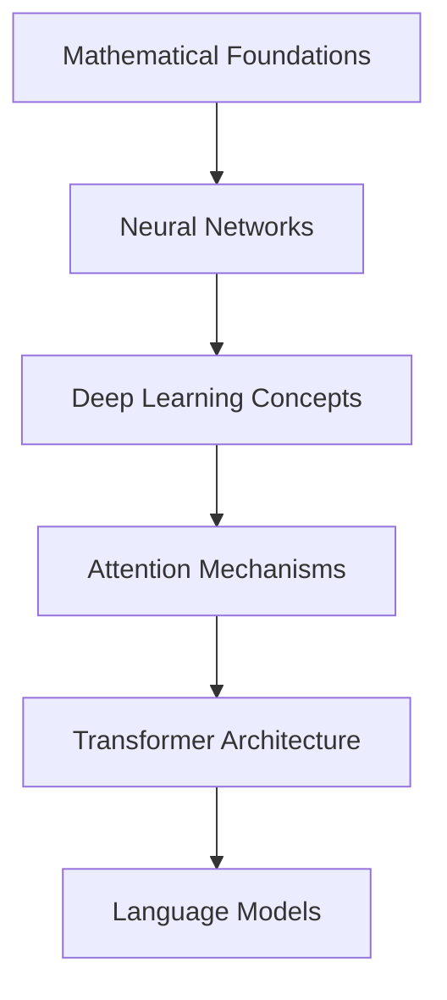

# Generative AI Learning Hub

!!! abstract "Comprehensive GenAI Mastery"
    A complete journey from fundamentals to advanced applications in Generative AI, covering theory, implementation, and best practices.

## 🤖 What is Generative AI?

Generative AI (GenAI) represents a paradigm shift in artificial intelligence, focusing on systems that can **create new content** rather than just analyze or classify existing data. These systems can generate text, images, code, audio, and even videos that are often indistinguishable from human-created content.

### Core Characteristics

**Content Creation**: Unlike traditional AI that recognizes patterns or makes predictions, GenAI creates novel outputs including text, images, code, music, and more.

**Foundation Models**: Built on large-scale neural networks trained on vast datasets, these models learn general patterns that can be applied across many tasks.

**Emergent Capabilities**: As models scale, they develop unexpected abilities like reasoning, creativity, and domain expertise that weren't explicitly programmed.

**Human-AI Collaboration**: GenAI excels at augmenting human capabilities, acting as a creative partner rather than a replacement.

### The GenAI Revolution

GenAI has transformed multiple industries by enabling:

- **Content Creation**: Automated writing, design, and multimedia production
- **Code Generation**: AI-assisted programming and software development  
- **Knowledge Work**: Research assistance, analysis, and decision support
- **Creative Industries**: Art, music, video, and interactive content generation
- **Education**: Personalized tutoring, content adaptation, and learning assistance
- **Business Automation**: Document processing, customer service, and workflow optimization

### Why GenAI Matters Now

**Accessibility**: Advanced AI capabilities are now available through simple APIs and interfaces, democratizing access to powerful tools.

**Scalability**: GenAI systems can produce content at scale while maintaining quality, revolutionizing productivity.

**Versatility**: Single models can perform multiple tasks across different domains, reducing the need for specialized systems.

**Continuous Improvement**: Models are rapidly advancing in capability, efficiency, and safety through ongoing research and development.

## 🎯 Learning Path Overview

- :material-brain: **Fundamentals**

    ---

    Core concepts, neural networks, and mathematical foundations

    [Start with basics →](fundamentals/index.md)

- :material-robot-outline: **Large Language Models**

    ---

    Architecture, training, and implementation of LLMs

    [Explore LLMs →](llms/index.md)

- :material-swap-horizontal: **Transformers & Architecture**

    ---

    Deep dive into attention mechanisms and model architecture

    [Master transformers →](transformers/index.md)

- :material-message-processing: **Prompt Engineering**

    ---

    Advanced prompting techniques and optimization strategies

    [Perfect prompting →](prompt-engineering/index.md)

- :material-database-search: **RAG Systems**

    ---

    Retrieval-Augmented Generation patterns and implementations

    [Build RAG →](rag/index.md)

- :material-robot-excited: **AI Agents**

    ---

    Agentic AI, multi-agent systems, and autonomous workflows

    [Create agents →](agents/index.md)

- :material-tune: **Fine-tuning & Training**

    ---

    Model customization, LoRA, QLoRA, and optimization

    [Train models →](fine-tuning/index.md)

- :material-image-multiple: **Multimodal AI**

    ---

    Vision, audio, and cross-modal applications

    [Go multimodal →](multimodal/index.md)

- :material-cloud-outline: **Providers & APIs**

    ---

    OpenAI, Anthropic, Hugging Face, and cloud platforms

    [Explore providers →](providers/index.md)

- :material-network: **AI Protocols & Standards**

    ---

    MCP, AGUI, A2A, and enterprise AI communication protocols

    [Master protocols →](protocols/index.md)

- :material-cog-outline: **MLOps & AIOps**

    ---

    Production deployment, monitoring, and best practices

    [Deploy at scale →](mlops-aiops/index.md)

- :material-chart-line: **Advanced Topics**

    ---

    GANs, VAEs, diffusion models, and cutting-edge research

    [Advanced concepts →](advanced/index.md)

- :material-code-braces: **Hands-on Projects**

    ---

    End-to-end implementations and real-world applications

    [Build projects →](projects/index.md)

## 🚀 Quick Start Guide

### Prerequisites

- Basic understanding of machine learning
- Python programming knowledge
- Familiarity with neural networks (recommended)

### 1. Foundation Building

### 2. Structured Learning Path

The GenAI learning journey follows a carefully designed progression that builds knowledge systematically:

#### Phase 1: Foundation (Weeks 1-2)
**Goal**: Establish theoretical understanding and core concepts

| Week | Focus Areas | Key Concepts | Outcomes |
|------|-------------|--------------|----------|
| 1 | **Mathematical Foundations** | Linear algebra, probability, statistics | Understanding the math behind AI |
| | **Neural Network Basics** | Perceptrons, backpropagation, optimization | Grasping how networks learn |
| 2 | **Deep Learning Concepts** | CNNs, RNNs, regularization | Understanding model architectures |
| | **Attention Mechanisms** | Self-attention, cross-attention | Foundation for transformers |

#### Phase 2: Core Technologies (Weeks 3-4)
**Goal**: Master the fundamental technologies powering GenAI

| Week | Focus Areas | Key Concepts | Outcomes |
|------|-------------|--------------|----------|
| 3 | **Transformer Architecture** | Encoder-decoder, positional encoding | Understanding modern AI backbone |
| | **Language Model Fundamentals** | Tokenization, embeddings, training | How LLMs work internally |
| 4 | **Prompt Engineering** | Techniques, optimization, evaluation | Effective AI communication |
| | **API Integration** | OpenAI, Anthropic, model selection | Practical AI application |

#### Phase 3: Advanced Applications (Weeks 5-6)
**Goal**: Build sophisticated AI systems and workflows

| Week | Focus Areas | Key Concepts | Outcomes |
|------|-------------|--------------|----------|
| 5 | **RAG Systems** | Vector databases, retrieval, chunking | Knowledge-enhanced AI |
| | **Agent Frameworks** | Planning, tools, memory | Autonomous AI systems |
| 6 | **Fine-tuning & Optimization** | LoRA, QLoRA, model adaptation | Custom model development |
| | **Multimodal AI** | Vision-language, cross-modal | Beyond text-only AI |

#### Phase 4: AI Protocols & Standards (Weeks 7-8)
**Goal**: Master AI communication protocols and industry standards

| Week | Focus Areas | Key Concepts | Outcomes |
|------|-------------|--------------|----------|
| 7 | **AI Communication Protocols** | MCP, AGUI, A2A protocols | Interoperable AI systems |
| | **Enterprise AI Standards** | IBM Watson APIs, Cisco AI protocols | Enterprise integration patterns |
| 8 | **Protocol Implementation** | API design, message formats, security | Building protocol-compliant systems |
| | **Cross-Platform Integration** | Multi-vendor AI ecosystems | Seamless AI interoperability |

#### Phase 5: Production & Specialization (Weeks 9-10)
**Goal**: Deploy and scale AI systems in real-world applications

| Week | Focus Areas | Key Concepts | Outcomes |
|------|-------------|--------------|----------|
| 9 | **MLOps & Deployment** | Scaling, monitoring, versioning | Production-ready systems |
| | **Security & Ethics** | AI safety, bias mitigation | Responsible AI development |
| 10 | **Specialized Applications** | Domain adaptation, enterprise integration | Industry-specific solutions |
| | **Future Trends** | Emerging technologies, research directions | Staying current with AI evolution |

## 🎓 Learning Outcomes

!!! success "What You'll Master"
    - **Theory**: Deep understanding of GenAI fundamentals
    - **Implementation**: Hands-on coding with modern frameworks
    - **Architecture**: System design for GenAI applications
    - **Best Practices**: Production-ready development patterns
    - **Optimization**: Performance tuning and scaling
    - **Integration**: Working with various providers and tools

## 📊 Progress Tracking

| Module | Difficulty | Duration | Prerequisites |
|--------|------------|----------|---------------|
| Fundamentals | Beginner | 1-2 weeks | Basic ML knowledge |
| LLMs | Intermediate | 2-3 weeks | Fundamentals complete |
| Transformers | Intermediate | 2-3 weeks | Neural networks |
| Prompt Engineering | Beginner | 1 week | LLM basics |
| RAG Systems | Intermediate | 2 weeks | Vector databases |
| Agents | Advanced | 3-4 weeks | RAG & prompting |
| Fine-tuning | Advanced | 3-4 weeks | Deep learning |
| MLOps/AIOps | Advanced | 2-3 weeks | Production experience |

## 🛠️ Essential Tools & Frameworks

The GenAI ecosystem includes a vast array of tools, frameworks, and platforms. From foundational libraries to specialized agent frameworks, understanding the right tools for each task is crucial for effective development.

### Quick Tool Categories

**Foundation Libraries**: Core deep learning and transformer libraries (PyTorch, Transformers, etc.)

**Agent Frameworks**: Systems for building autonomous AI agents (LangGraph, CrewAI, AutoGPT, etc.)

**RAG Systems**: Tools for retrieval-augmented generation (LlamaIndex, LangChain, etc.)

**Vector Databases**: Specialized storage for embeddings (Pinecone, Weaviate, Chroma, etc.)

**Model Providers**: APIs and platforms for accessing LLMs (OpenAI, Anthropic, Hugging Face, etc.)

**Development Tools**: IDEs, debugging, and deployment tools for AI applications

**For a comprehensive overview of all tools and frameworks, visit our dedicated [Tools & Technologies Guide](tools-technologies.md)**

## 🎯 Latest Industry Trends

!!! tip "Cutting-edge Developments"
    - **Multimodal Models**: GPT-4V, DALL-E 3, Midjourney
    - **Agent Frameworks**: AutoGPT, LangGraph, CrewAI
    - **Model Optimization**: Mixture of Experts, Speculative Decoding
    - **Retrieval**: GraphRAG, Hybrid Search, Semantic Chunking
    - **Fine-tuning**: LoRA, QLoRA, Adapter methods

## 📈 Career Applications

### Roles & Opportunities

- **GenAI Engineer**: Building AI-powered applications
- **ML Engineer**: Implementing and scaling models
- **AI Researcher**: Advancing the field
- **Product Manager**: Leading AI product development
- **Solution Architect**: Designing AI systems

### Industry Applications

- **Healthcare**: Medical diagnosis, drug discovery
- **Finance**: Risk assessment, fraud detection
- **Education**: Personalized learning, content generation
- **Entertainment**: Content creation, game development
- **Enterprise**: Process automation, knowledge management

---

!!! quote "GenAI Philosophy"
    "The future belongs to those who can effectively combine human creativity with artificial intelligence capabilities."

*Ready to embark on your GenAI journey? Start with the [Fundamentals](fundamentals/index.md) and build your expertise step by step!* 🚀
