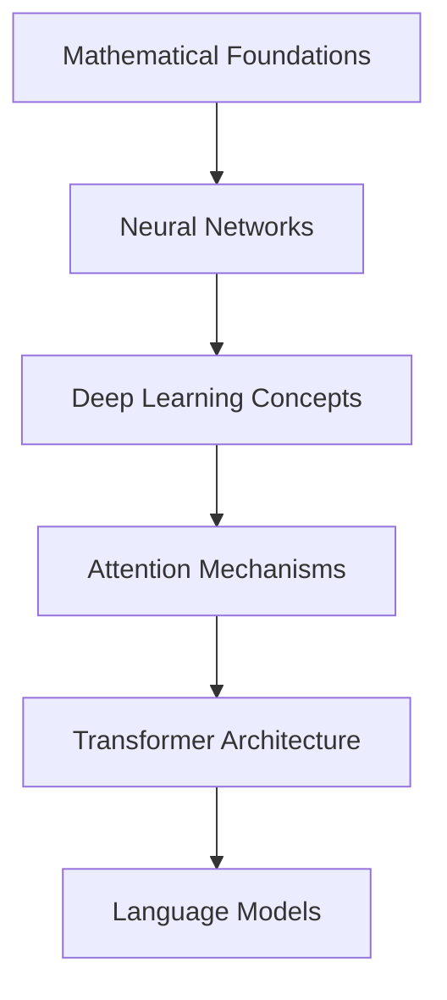

# Generative AI Learning Hub

!!! abstract "Comprehensive GenAI Mastery"
    A complete journey from fundamentals to advanced applications in Generative AI, covering theory, implementation, and best practices.

## 🎯 Learning Path Overview

<div class="grid cards" markdown>

-   :material-brain: **Fundamentals**
    
    ---
    
    Core concepts, neural networks, and mathematical foundations
    
    [Start with basics →](fundamentals/index.md)

-   :material-robot-outline: **Large Language Models**
    
    ---
    
    Architecture, training, and implementation of LLMs
    
    [Explore LLMs →](llms/index.md)

-   :material-swap-horizontal: **Transformers & Architecture**
    
    ---
    
    Deep dive into attention mechanisms and model architecture
    
    [Master transformers →](transformers/index.md)

-   :material-message-processing: **Prompt Engineering**
    
    ---
    
    Advanced prompting techniques and optimization strategies
    
    [Perfect prompting →](prompt-engineering/index.md)

</div>

<div class="grid cards" markdown>

-   :material-database-search: **RAG Systems**
    
    ---
    
    Retrieval-Augmented Generation patterns and implementations
    
    [Build RAG →](rag/index.md)

-   :material-robot-excited: **AI Agents**
    
    ---
    
    Agentic AI, multi-agent systems, and autonomous workflows
    
    [Create agents →](agents/index.md)

-   :material-tune: **Fine-tuning & Training**
    
    ---
    
    Model customization, LoRA, QLoRA, and optimization
    
    [Train models →](fine-tuning/index.md)

-   :material-image-multiple: **Multimodal AI**
    
    ---
    
    Vision, audio, and cross-modal applications
    
    [Go multimodal →](multimodal/index.md)

</div>

<div class="grid cards" markdown>

-   :material-cloud-outline: **Providers & APIs**
    
    ---
    
    OpenAI, Anthropic, Hugging Face, and cloud platforms
    
    [Explore providers →](providers/index.md)

-   :material-cog-outline: **MLOps & AIOps**
    
    ---
    
    Production deployment, monitoring, and best practices
    
    [Deploy at scale →](mlops-aiops/index.md)

-   :material-chart-line: **Advanced Topics**
    
    ---
    
    GANs, VAEs, diffusion models, and cutting-edge research
    
    [Advanced concepts →](advanced/index.md)

-   :material-code-braces: **Hands-on Projects**
    
    ---
    
    End-to-end implementations and real-world applications
    
    [Build projects →](projects/index.md)

</div>

## 🚀 Quick Start Guide

### Prerequisites
- Basic understanding of machine learning
- Python programming knowledge
- Familiarity with neural networks (recommended)

### 1. Foundation Building


### 2. Practical Learning Track
```python
# Learning progression example
learning_track = {
    "week_1": ["fundamentals", "neural_networks"],
    "week_2": ["transformers", "attention_mechanisms"],
    "week_3": ["llm_basics", "tokenization"],
    "week_4": ["prompt_engineering", "api_usage"],
    "week_5": ["rag_systems", "vector_databases"],
    "week_6": ["fine_tuning", "optimization"],
    "week_7": ["agents", "workflows"],
    "week_8": ["production", "deployment"]
}
```

## 🎓 Learning Outcomes

!!! success "What You'll Master"
    - **Theory**: Deep understanding of GenAI fundamentals
    - **Implementation**: Hands-on coding with modern frameworks
    - **Architecture**: System design for GenAI applications
    - **Best Practices**: Production-ready development patterns
    - **Optimization**: Performance tuning and scaling
    - **Integration**: Working with various providers and tools

## 📊 Progress Tracking

| Module | Difficulty | Duration | Prerequisites |
|--------|------------|----------|---------------|
| Fundamentals | Beginner | 1-2 weeks | Basic ML knowledge |
| LLMs | Intermediate | 2-3 weeks | Fundamentals complete |
| Transformers | Intermediate | 2-3 weeks | Neural networks |
| Prompt Engineering | Beginner | 1 week | LLM basics |
| RAG Systems | Intermediate | 2 weeks | Vector databases |
| Agents | Advanced | 3-4 weeks | RAG & prompting |
| Fine-tuning | Advanced | 3-4 weeks | Deep learning |
| MLOps/AIOps | Advanced | 2-3 weeks | Production experience |

## 🛠️ Tools & Technologies

### Core Frameworks
- **Transformers** (Hugging Face)
- **LangChain** (Agent frameworks)
- **LlamaIndex** (RAG systems)
- **OpenAI API** (GPT models)
- **Anthropic Claude** (Constitutional AI)

### Development Stack
- **Python** (Primary language)
- **PyTorch/TensorFlow** (Deep learning)
- **FastAPI** (API development)
- **Streamlit** (Rapid prototyping)
- **Docker** (Containerization)

### Vector Databases
- **Pinecone** (Managed vector DB)
- **Weaviate** (Open-source vector DB)
- **Chroma** (Lightweight vector DB)
- **Qdrant** (High-performance vector DB)

## 🎯 Latest Industry Trends

!!! tip "Cutting-edge Developments"
    - **Multimodal Models**: GPT-4V, DALL-E 3, Midjourney
    - **Agent Frameworks**: AutoGPT, LangGraph, CrewAI
    - **Model Optimization**: Mixture of Experts, Speculative Decoding
    - **Retrieval**: GraphRAG, Hybrid Search, Semantic Chunking
    - **Fine-tuning**: LoRA, QLoRA, Adapter methods

## 📈 Career Applications

### Roles & Opportunities
- **GenAI Engineer**: Building AI-powered applications
- **ML Engineer**: Implementing and scaling models
- **AI Researcher**: Advancing the field
- **Product Manager**: Leading AI product development
- **Solution Architect**: Designing AI systems

### Industry Applications
- **Healthcare**: Medical diagnosis, drug discovery
- **Finance**: Risk assessment, fraud detection
- **Education**: Personalized learning, content generation
- **Entertainment**: Content creation, game development
- **Enterprise**: Process automation, knowledge management

---

!!! quote "GenAI Philosophy"
    "The future belongs to those who can effectively combine human creativity with artificial intelligence capabilities."

*Ready to embark on your GenAI journey? Start with the [Fundamentals](fundamentals/index.md) and build your expertise step by step!* 🚀
