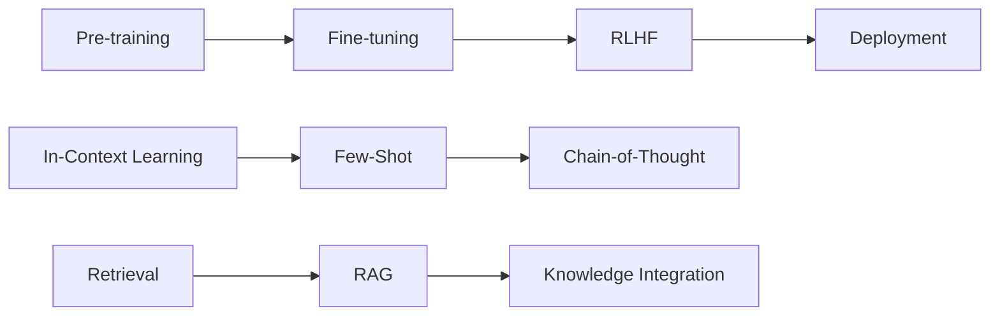

# Generative AI

Explore the fascinating world of Generative AI, from Large Language Models to advanced applications in various domains.

## Overview

Generative AI represents one of the most exciting frontiers in artificial intelligence, enabling machines to create human-like text, images, code, and more.

<div class="grid cards" markdown>

-   :material-robot-outline: **Large Language Models**
    
    ---
    
    Understanding LLMs, architecture, and capabilities
    
    [Explore LLMs →](llms.md)

-   :material-message-text: **Prompt Engineering**
    
    ---
    
    Crafting effective prompts for better AI responses
    
    [Master prompting →](prompt-engineering.md)

-   :material-database-search: **RAG Systems**
    
    ---
    
    Retrieval-Augmented Generation for enhanced AI
    
    [Build RAG →](rag.md)

-   :material-tune: **Fine-tuning**
    
    ---
    
    Customizing models for specific tasks and domains
    
    [Learn fine-tuning →](fine-tuning.md)

</div>

## Current Focus Areas

!!! tip "Latest Trends"
    
    - **Multimodal AI**: Combining text, image, and audio
    - **Agent Frameworks**: LangChain, CrewAI, AutoGen
    - **Vector Databases**: Pinecone, Weaviate, Chroma
    - **Model Optimization**: Quantization, LoRA, QLoRA

## Key Concepts

### Foundation Models

Large pre-trained models that serve as the base for various applications:

- **GPT Series**: Text generation and understanding
- **BERT/RoBERTa**: Text understanding and classification  
- **T5**: Text-to-text unified framework
- **Claude**: Constitutional AI approach
- **LLaMA**: Meta's efficient language models

### Training Paradigms



## Practical Applications

### Code Generation
```python
# Example: Using OpenAI API for code generation
import openai

def generate_code(prompt, language="python"):
    response = openai.ChatCompletion.create(
        model="gpt-4",
        messages=[
            {"role": "system", "content": f"You are a {language} programming expert."},
            {"role": "user", "content": prompt}
        ],
        temperature=0.3
    )
    return response.choices[0].message.content

# Generate a function to calculate fibonacci
code = generate_code("Write a function to calculate the nth Fibonacci number efficiently")
print(code)
```

### Text Classification
```python
# Example: Using transformers for text classification
from transformers import pipeline

# Initialize classifier
classifier = pipeline("text-classification", 
                     model="cardiffnlp/twitter-roberta-base-sentiment-latest")

# Classify text
result = classifier("I love learning about AI and machine learning!")
print(f"Sentiment: {result[0]['label']}, Confidence: {result[0]['score']:.3f}")
```

## Resources

### Essential Papers
- "Attention Is All You Need" (Transformer Architecture)
- "BERT: Pre-training of Deep Bidirectional Transformers"
- "Language Models are Few-Shot Learners" (GPT-3)
- "Training language models to follow instructions with human feedback"

### Tools & Frameworks
- **Hugging Face Transformers**: Pre-trained models and fine-tuning
- **LangChain**: Framework for LLM applications
- **OpenAI API**: Access to GPT models
- **Anthropic Claude**: Constitutional AI assistant
- **Ollama**: Run LLMs locally

### Datasets
- **Common Crawl**: Web text data
- **The Pile**: Diverse text dataset
- **OpenWebText**: GPT-2 training data recreation
- **BookCorpus**: Books dataset

## Learning Path

1. **Foundations**: Understand transformer architecture
2. **Pre-trained Models**: Experiment with existing LLMs
3. **Prompt Engineering**: Master effective prompting
4. **Fine-tuning**: Customize models for specific tasks
5. **Applications**: Build real-world GenAI applications
6. **Advanced**: Explore RAG, agents, and multimodal AI

---

*The future is generative! 🤖✨*
