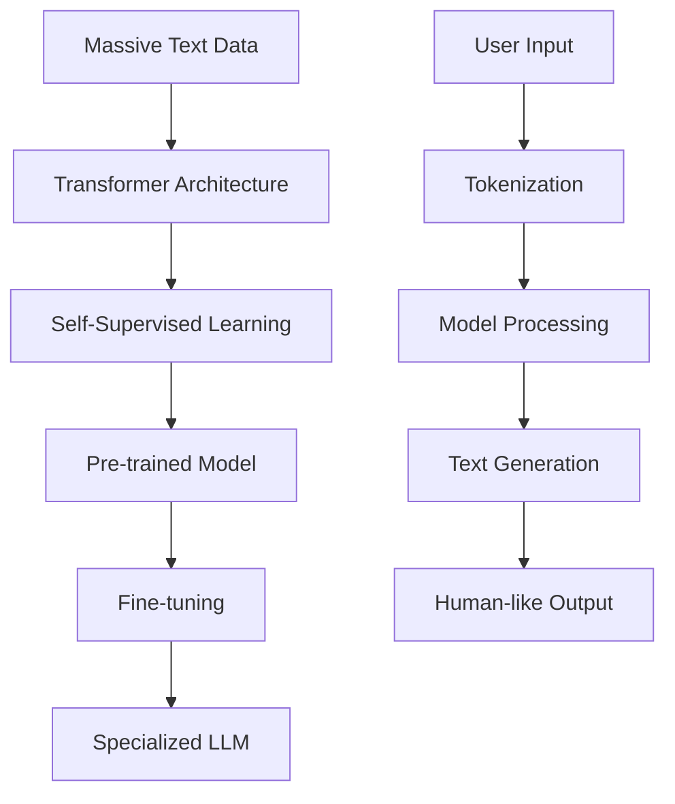

# Large Language Models (LLMs)

!!! abstract "Master the Giants of GenAI"
    Comprehensive guide to understanding, implementing, and working with Large Language Models - the foundation of modern generative AI.

## 📚 Module Overview

<div class="grid cards" markdown>

-   :material-brain-outline: **LLM Architecture**
    
    ---
    
    Transformer-based architectures and model components
    
    [Explore architecture →](architecture.md)

-   :material-cog-outline: **Training Process**
    
    ---
    
    Pre-training, fine-tuning, and optimization techniques
    
    [Learn training →](training.md)

-   :material-api: **Model APIs & Usage**
    
    ---
    
    Working with OpenAI, Anthropic, and open-source models
    
    [Use models →](apis.md)

-   :material-tune-vertical: **Model Comparison**
    
    ---
    
    GPT, Claude, LLaMA, and other popular models
    
    [Compare models →](comparison.md)

</div>

## 🎯 What You'll Learn

- ✅ Understand LLM architectures and training processes
- ✅ Work with various LLM APIs and interfaces
- ✅ Implement custom applications using LLMs
- ✅ Compare and choose appropriate models for tasks
- ✅ Optimize LLM performance and cost
- ✅ Handle limitations and biases in LLMs

## 🤖 What are Large Language Models?

Large Language Models are neural networks trained on vast amounts of text data to understand and generate human-like language. They represent a breakthrough in AI's ability to process and produce natural language.



### Key Characteristics

| Characteristic | Description | Impact |
|----------------|-------------|---------|
| **Scale** | Billions to trillions of parameters | Enhanced capabilities |
| **Emergent Abilities** | Capabilities not explicitly programmed | Reasoning, creativity |
| **Few-shot Learning** | Learn from minimal examples | Rapid adaptation |
| **Generalization** | Apply knowledge across domains | Versatile applications |

## 🏗️ LLM Architecture Deep Dive

### Transformer Foundation

```python
import torch
import torch.nn as nn
import torch.nn.functional as F
import math

class MultiHeadAttention(nn.Module):
    def __init__(self, d_model, n_heads):
        super().__init__()
        self.d_model = d_model
        self.n_heads = n_heads
        self.d_k = d_model // n_heads
        
        self.W_q = nn.Linear(d_model, d_model)
        self.W_k = nn.Linear(d_model, d_model)
        self.W_v = nn.Linear(d_model, d_model)
        self.W_o = nn.Linear(d_model, d_model)
        
    def scaled_dot_product_attention(self, Q, K, V, mask=None):
        # Calculate attention scores
        scores = torch.matmul(Q, K.transpose(-2, -1)) / math.sqrt(self.d_k)
        
        # Apply mask if provided (for causal attention)
        if mask is not None:
            scores = scores.masked_fill(mask == 0, -1e9)
        
        # Apply softmax
        attention_weights = F.softmax(scores, dim=-1)
        
        # Apply attention to values
        output = torch.matmul(attention_weights, V)
        return output, attention_weights
    
    def forward(self, query, key, value, mask=None):
        batch_size = query.size(0)
        
        # Linear projections
        Q = self.W_q(query).view(batch_size, -1, self.n_heads, self.d_k).transpose(1, 2)
        K = self.W_k(key).view(batch_size, -1, self.n_heads, self.d_k).transpose(1, 2)
        V = self.W_v(value).view(batch_size, -1, self.n_heads, self.d_k).transpose(1, 2)
        
        # Apply attention
        attn_output, attn_weights = self.scaled_dot_product_attention(Q, K, V, mask)
        
        # Concatenate heads
        attn_output = attn_output.transpose(1, 2).contiguous().view(
            batch_size, -1, self.d_model
        )
        
        # Final linear projection
        output = self.W_o(attn_output)
        return output, attn_weights

class TransformerBlock(nn.Module):
    def __init__(self, d_model, n_heads, d_ff, dropout=0.1):
        super().__init__()
        self.attention = MultiHeadAttention(d_model, n_heads)
        self.norm1 = nn.LayerNorm(d_model)
        self.norm2 = nn.LayerNorm(d_model)
        
        self.feed_forward = nn.Sequential(
            nn.Linear(d_model, d_ff),
            nn.ReLU(),
            nn.Linear(d_ff, d_model)
        )
        
        self.dropout = nn.Dropout(dropout)
    
    def forward(self, x, mask=None):
        # Self-attention with residual connection
        attn_output, _ = self.attention(x, x, x, mask)
        x = self.norm1(x + self.dropout(attn_output))
        
        # Feed-forward with residual connection
        ff_output = self.feed_forward(x)
        x = self.norm2(x + self.dropout(ff_output))
        
        return x

class SimpleLLM(nn.Module):
    def __init__(self, vocab_size, d_model=512, n_heads=8, n_layers=6, d_ff=2048, max_seq_len=1024):
        super().__init__()
        self.d_model = d_model
        self.vocab_size = vocab_size
        
        # Embeddings
        self.token_embedding = nn.Embedding(vocab_size, d_model)
        self.position_embedding = nn.Embedding(max_seq_len, d_model)
        
        # Transformer blocks
        self.transformer_blocks = nn.ModuleList([
            TransformerBlock(d_model, n_heads, d_ff)
            for _ in range(n_layers)
        ])
        
        # Output layer
        self.ln_f = nn.LayerNorm(d_model)
        self.lm_head = nn.Linear(d_model, vocab_size, bias=False)
        
        self.dropout = nn.Dropout(0.1)
    
    def forward(self, input_ids, attention_mask=None):
        batch_size, seq_len = input_ids.shape
        
        # Create position indices
        position_ids = torch.arange(seq_len, device=input_ids.device).unsqueeze(0)
        
        # Embeddings
        token_embeds = self.token_embedding(input_ids)
        position_embeds = self.position_embedding(position_ids)
        x = self.dropout(token_embeds + position_embeds)
        
        # Create causal mask for autoregressive generation
        causal_mask = torch.tril(torch.ones(seq_len, seq_len)).unsqueeze(0).unsqueeze(0)
        if attention_mask is not None:
            causal_mask = causal_mask * attention_mask.unsqueeze(1).unsqueeze(2)
        
        # Pass through transformer blocks
        for block in self.transformer_blocks:
            x = block(x, causal_mask)
        
        # Final layer norm and output projection
        x = self.ln_f(x)
        logits = self.lm_head(x)
        
        return logits
    
    def generate(self, input_ids, max_length=50, temperature=1.0, top_k=50, top_p=0.9):
        """Generate text using the model"""
        self.eval()
        generated = input_ids.clone()
        
        with torch.no_grad():
            for _ in range(max_length):
                # Get logits for the current sequence
                logits = self.forward(generated)
                next_token_logits = logits[0, -1, :] / temperature
                
                # Apply top-k filtering
                if top_k > 0:
                    indices_to_remove = next_token_logits < torch.topk(next_token_logits, top_k)[0][..., -1, None]
                    next_token_logits[indices_to_remove] = -float('inf')
                
                # Apply top-p filtering
                if top_p < 1.0:
                    sorted_logits, sorted_indices = torch.sort(next_token_logits, descending=True)
                    cumulative_probs = torch.cumsum(F.softmax(sorted_logits, dim=-1), dim=-1)
                    sorted_indices_to_remove = cumulative_probs > top_p
                    sorted_indices_to_remove[..., 1:] = sorted_indices_to_remove[..., :-1].clone()
                    sorted_indices_to_remove[..., 0] = 0
                    indices_to_remove = sorted_indices[sorted_indices_to_remove]
                    next_token_logits[indices_to_remove] = -float('inf')
                
                # Sample next token
                probs = F.softmax(next_token_logits, dim=-1)
                next_token = torch.multinomial(probs, num_samples=1)
                
                # Append to generated sequence
                generated = torch.cat([generated, next_token.unsqueeze(0)], dim=1)
        
        return generated

# Example usage
vocab_size = 30000
model = SimpleLLM(vocab_size, d_model=512, n_heads=8, n_layers=6)
print(f"Model parameters: {sum(p.numel() for p in model.parameters()):,}")
```

## 🔧 Working with Popular LLMs

### OpenAI GPT Models

```python
import openai
from typing import List, Dict, Any
import json

class GPTInterface:
    def __init__(self, api_key: str, model: str = "gpt-4"):
        self.client = openai.OpenAI(api_key=api_key)
        self.model = model
        self.conversation_history = []
    
    def chat(self, message: str, system_prompt: str = None, temperature: float = 0.7) -> str:
        """Send a chat message to GPT"""
        messages = []
        
        if system_prompt:
            messages.append({"role": "system", "content": system_prompt})
        
        # Add conversation history
        messages.extend(self.conversation_history)
        
        # Add current message
        messages.append({"role": "user", "content": message})
        
        try:
            response = self.client.chat.completions.create(
                model=self.model,
                messages=messages,
                temperature=temperature,
                max_tokens=1000
            )
            
            assistant_message = response.choices[0].message.content
            
            # Update conversation history
            self.conversation_history.append({"role": "user", "content": message})
            self.conversation_history.append({"role": "assistant", "content": assistant_message})
            
            return assistant_message
            
        except Exception as e:
            return f"Error: {str(e)}"
    
    def function_calling(self, message: str, functions: List[Dict[str, Any]]) -> Dict:
        """Use GPT with function calling"""
        messages = [{"role": "user", "content": message}]
        
        response = self.client.chat.completions.create(
            model=self.model,
            messages=messages,
            functions=functions,
            function_call="auto"
        )
        
        return response.choices[0]
    
    def clear_history(self):
        """Clear conversation history"""
        self.conversation_history = []

# Example function definitions for function calling
functions = [
    {
        "name": "get_weather",
        "description": "Get current weather information for a location",
        "parameters": {
            "type": "object",
            "properties": {
                "location": {
                    "type": "string",
                    "description": "The city and state, e.g. San Francisco, CA"
                },
                "unit": {
                    "type": "string",
                    "enum": ["celsius", "fahrenheit"],
                    "description": "Temperature unit"
                }
            },
            "required": ["location"]
        }
    },
    {
        "name": "calculate_math",
        "description": "Perform mathematical calculations",
        "parameters": {
            "type": "object",
            "properties": {
                "expression": {
                    "type": "string",
                    "description": "Mathematical expression to evaluate"
                }
            },
            "required": ["expression"]
        }
    }
]

# Example usage
# gpt = GPTInterface(api_key="your-api-key")
# response = gpt.chat("Explain quantum computing in simple terms")
# print(response)
```

### Hugging Face Transformers

```python
from transformers import (
    AutoTokenizer, 
    AutoModelForCausalLM, 
    pipeline,
    GPT2LMHeadModel,
    GPT2Tokenizer
)
import torch

class HuggingFaceLLM:
    def __init__(self, model_name: str = "microsoft/DialoGPT-medium"):
        self.model_name = model_name
        self.tokenizer = AutoTokenizer.from_pretrained(model_name)
        self.model = AutoModelForCausalLM.from_pretrained(model_name)
        
        # Add padding token if it doesn't exist
        if self.tokenizer.pad_token is None:
            self.tokenizer.pad_token = self.tokenizer.eos_token
    
    def generate_text(self, prompt: str, max_length: int = 100, temperature: float = 0.7, 
                     num_return_sequences: int = 1) -> List[str]:
        """Generate text from a prompt"""
        inputs = self.tokenizer.encode(prompt, return_tensors="pt")
        
        with torch.no_grad():
            outputs = self.model.generate(
                inputs,
                max_length=max_length,
                temperature=temperature,
                num_return_sequences=num_return_sequences,
                do_sample=True,
                pad_token_id=self.tokenizer.eos_token_id
            )
        
        generated_texts = []
        for output in outputs:
            text = self.tokenizer.decode(output, skip_special_tokens=True)
            generated_texts.append(text)
        
        return generated_texts
    
    def chat_response(self, message: str, chat_history: List[str] = None) -> str:
        """Generate a chat response"""
        if chat_history is None:
            chat_history = []
        
        # Prepare input with chat history
        input_text = ""
        for i, msg in enumerate(chat_history):
            if i % 2 == 0:
                input_text += f"User: {msg}\n"
            else:
                input_text += f"Bot: {msg}\n"
        input_text += f"User: {message}\nBot:"
        
        # Generate response
        responses = self.generate_text(input_text, max_length=len(input_text) + 50)
        
        # Extract only the bot's response
        full_response = responses[0]
        bot_response = full_response.split("Bot:")[-1].strip()
        
        return bot_response

# Example with different models
class ModelCollection:
    def __init__(self):
        self.models = {}
    
    def load_model(self, name: str, model_path: str):
        """Load a model and tokenizer"""
        print(f"Loading {name}...")
        self.models[name] = {
            'tokenizer': AutoTokenizer.from_pretrained(model_path),
            'model': AutoModelForCausalLM.from_pretrained(model_path)
        }
        
        # Ensure pad token exists
        if self.models[name]['tokenizer'].pad_token is None:
            self.models[name]['tokenizer'].pad_token = self.models[name]['tokenizer'].eos_token
    
    def generate_with_model(self, model_name: str, prompt: str, **kwargs) -> str:
        """Generate text with a specific model"""
        if model_name not in self.models:
            return f"Model {model_name} not loaded"
        
        tokenizer = self.models[model_name]['tokenizer']
        model = self.models[model_name]['model']
        
        inputs = tokenizer.encode(prompt, return_tensors="pt")
        
        with torch.no_grad():
            outputs = model.generate(
                inputs,
                max_length=kwargs.get('max_length', 100),
                temperature=kwargs.get('temperature', 0.7),
                do_sample=True,
                pad_token_id=tokenizer.eos_token_id
            )
        
        return tokenizer.decode(outputs[0], skip_special_tokens=True)

# Example usage
collection = ModelCollection()

# Load different models (uncomment to use)
# collection.load_model("gpt2", "gpt2")
# collection.load_model("gpt2-medium", "gpt2-medium") 
# collection.load_model("distilgpt2", "distilgpt2")

# Generate with different models
# prompt = "The future of artificial intelligence is"
# for model_name in collection.models:
#     response = collection.generate_with_model(model_name, prompt)
#     print(f"{model_name}: {response}\n")
```

## 📊 Model Comparison Framework

```python
import time
import psutil
import torch
from dataclasses import dataclass
from typing import List, Dict, Optional

@dataclass
class ModelMetrics:
    model_name: str
    parameters: int
    memory_usage_mb: float
    inference_time_ms: float
    output_quality_score: float
    cost_per_1k_tokens: float

class LLMBenchmark:
    def __init__(self):
        self.results = {}
        self.test_prompts = [
            "Explain the concept of machine learning",
            "Write a Python function to calculate fibonacci",
            "What are the benefits of renewable energy?",
            "Describe the process of photosynthesis",
            "Write a creative short story about space exploration"
        ]
    
    def benchmark_model(self, model, tokenizer, model_name: str) -> ModelMetrics:
        """Benchmark a model's performance"""
        # Count parameters
        param_count = sum(p.numel() for p in model.parameters())
        
        # Measure memory usage
        process = psutil.Process()
        memory_before = process.memory_info().rss / 1024 / 1024
        
        # Measure inference time
        start_time = time.time()
        prompt = self.test_prompts[0]
        inputs = tokenizer.encode(prompt, return_tensors="pt")
        
        with torch.no_grad():
            outputs = model.generate(inputs, max_length=100, do_sample=True)
        
        inference_time = (time.time() - start_time) * 1000
        
        memory_after = process.memory_info().rss / 1024 / 1024
        memory_usage = memory_after - memory_before
        
        # Create metrics object
        metrics = ModelMetrics(
            model_name=model_name,
            parameters=param_count,
            memory_usage_mb=memory_usage,
            inference_time_ms=inference_time,
            output_quality_score=0.0,  # Would need human evaluation
            cost_per_1k_tokens=0.0     # Model-specific pricing
        )
        
        self.results[model_name] = metrics
        return metrics
    
    def compare_models(self) -> Dict[str, ModelMetrics]:
        """Compare all benchmarked models"""
        return self.results
    
    def generate_report(self) -> str:
        """Generate a comparison report"""
        if not self.results:
            return "No models benchmarked yet."
        
        report = "LLM Comparison Report\n"
        report += "=" * 50 + "\n\n"
        
        for name, metrics in self.results.items():
            report += f"Model: {name}\n"
            report += f"  Parameters: {metrics.parameters:,}\n"
            report += f"  Memory Usage: {metrics.memory_usage_mb:.2f} MB\n"
            report += f"  Inference Time: {metrics.inference_time_ms:.2f} ms\n"
            report += f"  Cost per 1K tokens: ${metrics.cost_per_1k_tokens}\n\n"
        
        return report

# Example usage
# benchmark = LLMBenchmark()
# 
# # Benchmark different models
# models_to_test = [
#     ("gpt2", "gpt2"),
#     ("distilgpt2", "distilgpt2"),
#     ("gpt2-medium", "gpt2-medium")
# ]
# 
# for model_name, model_path in models_to_test:
#     tokenizer = AutoTokenizer.from_pretrained(model_path)
#     model = AutoModelForCausalLM.from_pretrained(model_path)
#     benchmark.benchmark_model(model, tokenizer, model_name)
# 
# print(benchmark.generate_report())
```

## 🎯 Practical Applications

### 1. Custom ChatBot with Memory

```python
import json
from datetime import datetime
from typing import List, Dict, Optional

class ConversationalLLM:
    def __init__(self, model_interface):
        self.model = model_interface
        self.memory = {
            'conversations': [],
            'user_preferences': {},
            'context_summaries': []
        }
        self.max_context_length = 4000
    
    def chat(self, message: str, user_id: str = "default") -> str:
        """Chat with memory management"""
        # Retrieve user context
        context = self._get_user_context(user_id)
        
        # Build prompt with context
        system_prompt = self._build_system_prompt(context)
        
        # Generate response
        response = self.model.chat(message, system_prompt)
        
        # Update memory
        self._update_memory(user_id, message, response)
        
        return response
    
    def _get_user_context(self, user_id: str) -> Dict:
        """Retrieve relevant context for user"""
        user_conversations = [
            conv for conv in self.memory['conversations'] 
            if conv.get('user_id') == user_id
        ]
        
        # Get recent conversations
        recent_conversations = user_conversations[-5:]
        
        return {
            'recent_conversations': recent_conversations,
            'preferences': self.memory['user_preferences'].get(user_id, {}),
            'summaries': self.memory['context_summaries']
        }
    
    def _build_system_prompt(self, context: Dict) -> str:
        """Build system prompt with context"""
        prompt = "You are a helpful AI assistant with memory of our conversation. "
        
        if context['recent_conversations']:
            prompt += "Here's our recent conversation history:\n"
            for conv in context['recent_conversations']:
                prompt += f"User: {conv['message']}\nAssistant: {conv['response']}\n"
        
        if context['preferences']:
            prompt += f"\nUser preferences: {context['preferences']}"
        
        prompt += "\nRespond naturally while considering our conversation history."
        
        return prompt
    
    def _update_memory(self, user_id: str, message: str, response: str):
        """Update conversation memory"""
        conversation_entry = {
            'user_id': user_id,
            'timestamp': datetime.now().isoformat(),
            'message': message,
            'response': response
        }
        
        self.memory['conversations'].append(conversation_entry)
        
        # Summarize if too many conversations
        if len(self.memory['conversations']) > 100:
            self._summarize_old_conversations()
    
    def _summarize_old_conversations(self):
        """Summarize old conversations to save memory"""
        old_conversations = self.memory['conversations'][:-50]
        
        # Create summary (simplified)
        summary = f"Summary of {len(old_conversations)} conversations from {old_conversations[0]['timestamp']} to {old_conversations[-1]['timestamp']}"
        
        self.memory['context_summaries'].append(summary)
        self.memory['conversations'] = self.memory['conversations'][-50:]
    
    def save_memory(self, filepath: str):
        """Save memory to file"""
        with open(filepath, 'w') as f:
            json.dump(self.memory, f, indent=2)
    
    def load_memory(self, filepath: str):
        """Load memory from file"""
        try:
            with open(filepath, 'r') as f:
                self.memory = json.load(f)
        except FileNotFoundError:
            print("Memory file not found, starting fresh")

# Example usage
# chatbot = ConversationalLLM(gpt_interface)
# response = chatbot.chat("Hi, I'm interested in learning about AI", "user123")
# print(response)
```

### 2. Content Generation Pipeline

```python
from enum import Enum
from typing import List, Dict, Any, Optional
import re

class ContentType(Enum):
    BLOG_POST = "blog_post"
    SOCIAL_MEDIA = "social_media"
    EMAIL = "email"
    PRODUCT_DESCRIPTION = "product_description"
    CREATIVE_WRITING = "creative_writing"

class ContentGenerator:
    def __init__(self, llm_interface):
        self.llm = llm_interface
        self.templates = {
            ContentType.BLOG_POST: {
                'system_prompt': "You are an expert blog writer. Create engaging, well-structured blog posts.",
                'structure': ['title', 'introduction', 'main_content', 'conclusion', 'call_to_action']
            },
            ContentType.SOCIAL_MEDIA: {
                'system_prompt': "You are a social media expert. Create engaging, viral-worthy posts.",
                'structure': ['hook', 'content', 'hashtags', 'call_to_action']
            },
            ContentType.EMAIL: {
                'system_prompt': "You are an email marketing expert. Create compelling email content.",
                'structure': ['subject_line', 'opening', 'body', 'closing', 'signature']
            }
        }
    
    def generate_content(self, 
                        content_type: ContentType, 
                        topic: str, 
                        target_audience: str = "",
                        tone: str = "professional",
                        length: str = "medium",
                        additional_requirements: str = "") -> Dict[str, str]:
        """Generate content based on type and requirements"""
        
        template = self.templates.get(content_type)
        if not template:
            raise ValueError(f"Unsupported content type: {content_type}")
        
        # Build detailed prompt
        prompt = self._build_content_prompt(
            content_type, topic, target_audience, tone, length, additional_requirements
        )
        
        # Generate content
        content = self.llm.chat(prompt, template['system_prompt'])
        
        # Parse structured content
        parsed_content = self._parse_structured_content(content, template['structure'])
        
        return parsed_content
    
    def _build_content_prompt(self, content_type: ContentType, topic: str, 
                             target_audience: str, tone: str, length: str, 
                             additional_requirements: str) -> str:
        """Build comprehensive content generation prompt"""
        
        prompt = f"""
        Create {content_type.value.replace('_', ' ')} content about: {topic}
        
        Requirements:
        - Target audience: {target_audience or 'General audience'}
        - Tone: {tone}
        - Length: {length}
        - Additional requirements: {additional_requirements or 'None'}
        
        Please structure your response with clear sections:
        """
        
        # Add structure requirements based on content type
        if content_type == ContentType.BLOG_POST:
            prompt += """
            1. **TITLE**: Compelling headline
            2. **INTRODUCTION**: Hook and overview
            3. **MAIN_CONTENT**: Detailed content with subheadings
            4. **CONCLUSION**: Summary and key takeaways
            5. **CALL_TO_ACTION**: Engagement prompt
            """
        elif content_type == ContentType.SOCIAL_MEDIA:
            prompt += """
            1. **HOOK**: Attention-grabbing opening
            2. **CONTENT**: Main message
            3. **HASHTAGS**: Relevant hashtags
            4. **CALL_TO_ACTION**: Engagement prompt
            """
        elif content_type == ContentType.EMAIL:
            prompt += """
            1. **SUBJECT_LINE**: Compelling subject
            2. **OPENING**: Personal greeting
            3. **BODY**: Main email content
            4. **CLOSING**: Professional closing
            5. **SIGNATURE**: Sign-off
            """
        
        return prompt
    
    def _parse_structured_content(self, content: str, structure: List[str]) -> Dict[str, str]:
        """Parse generated content into structured sections"""
        sections = {}
        current_section = None
        current_content = []
        
        lines = content.split('\n')
        
        for line in lines:
            # Check if line is a section header
            section_found = False
            for section in structure:
                pattern = rf'\*\*{section.upper().replace("_", "[ _]")}\*\*:?'
                if re.search(pattern, line, re.IGNORECASE):
                    # Save previous section
                    if current_section:
                        sections[current_section] = '\n'.join(current_content).strip()
                    
                    # Start new section
                    current_section = section
                    current_content = []
                    section_found = True
                    
                    # Add content after the header on same line
                    remaining = re.sub(pattern, '', line, flags=re.IGNORECASE).strip()
                    if remaining:
                        current_content.append(remaining)
                    break
            
            if not section_found and current_section:
                current_content.append(line)
        
        # Save last section
        if current_section:
            sections[current_section] = '\n'.join(current_content).strip()
        
        return sections
    
    def optimize_content(self, content: Dict[str, str], optimization_goals: List[str]) -> Dict[str, str]:
        """Optimize content for specific goals (SEO, engagement, etc.)"""
        optimization_prompt = f"""
        Optimize the following content for: {', '.join(optimization_goals)}
        
        Original content:
        {json.dumps(content, indent=2)}
        
        Please provide optimized versions focusing on the specified goals.
        Maintain the same structure but improve for better performance.
        """
        
        optimized_content = self.llm.chat(optimization_prompt, 
                                         "You are a content optimization expert.")
        
        # Parse optimized content (simplified)
        return self._parse_structured_content(optimized_content, list(content.keys()))

# Example usage
# generator = ContentGenerator(gpt_interface)
# 
# blog_content = generator.generate_content(
#     ContentType.BLOG_POST,
#     topic="Benefits of Machine Learning in Healthcare",
#     target_audience="Healthcare professionals",
#     tone="informative and professional",
#     length="1500 words"
# )
# 
# print("Generated Blog Post:")
# for section, content in blog_content.items():
#     print(f"\n{section.upper()}:\n{content}\n")
```

## 📈 Performance Optimization

### Model Quantization

```python
import torch
from transformers import AutoModelForCausalLM, AutoTokenizer
from torch.quantization import quantize_dynamic
import time

class ModelOptimizer:
    def __init__(self, model_name: str):
        self.model_name = model_name
        self.original_model = None
        self.quantized_model = None
        self.tokenizer = None
    
    def load_model(self):
        """Load the original model"""
        self.tokenizer = AutoTokenizer.from_pretrained(self.model_name)
        self.original_model = AutoModelForCausalLM.from_pretrained(self.model_name)
        
        if self.tokenizer.pad_token is None:
            self.tokenizer.pad_token = self.tokenizer.eos_token
    
    def quantize_model(self):
        """Apply dynamic quantization to reduce model size"""
        self.quantized_model = quantize_dynamic(
            self.original_model,
            {torch.nn.Linear},  # Quantize linear layers
            dtype=torch.qint8
        )
    
    def benchmark_models(self, test_prompts: List[str]) -> Dict[str, Dict]:
        """Compare original vs quantized model performance"""
        results = {
            'original': {'times': [], 'memory': 0},
            'quantized': {'times': [], 'memory': 0}
        }
        
        # Test original model
        for prompt in test_prompts:
            start_time = time.time()
            inputs = self.tokenizer.encode(prompt, return_tensors="pt")
            
            with torch.no_grad():
                outputs = self.original_model.generate(inputs, max_length=100)
            
            results['original']['times'].append(time.time() - start_time)
        
        # Test quantized model
        for prompt in test_prompts:
            start_time = time.time()
            inputs = self.tokenizer.encode(prompt, return_tensors="pt")
            
            with torch.no_grad():
                outputs = self.quantized_model.generate(inputs, max_length=100)
            
            results['quantized']['times'].append(time.time() - start_time)
        
        # Calculate averages
        results['original']['avg_time'] = sum(results['original']['times']) / len(results['original']['times'])
        results['quantized']['avg_time'] = sum(results['quantized']['times']) / len(results['quantized']['times'])
        
        # Model sizes (simplified)
        results['original']['size_mb'] = sum(p.numel() * p.element_size() for p in self.original_model.parameters()) / 1024 / 1024
        results['quantized']['size_mb'] = sum(p.numel() * p.element_size() for p in self.quantized_model.parameters()) / 1024 / 1024
        
        return results
    
    def get_optimization_report(self, benchmark_results: Dict) -> str:
        """Generate optimization report"""
        orig = benchmark_results['original']
        quant = benchmark_results['quantized']
        
        time_improvement = (orig['avg_time'] - quant['avg_time']) / orig['avg_time'] * 100
        size_reduction = (orig['size_mb'] - quant['size_mb']) / orig['size_mb'] * 100
        
        report = f"""
Model Optimization Report for {self.model_name}
{'='*50}

Performance Metrics:
- Original model average inference time: {orig['avg_time']:.4f}s
- Quantized model average inference time: {quant['avg_time']:.4f}s
- Speed improvement: {time_improvement:.2f}%

Model Size:
- Original model size: {orig['size_mb']:.2f} MB
- Quantized model size: {quant['size_mb']:.2f} MB
- Size reduction: {size_reduction:.2f}%

Memory Usage:
- Memory savings: {orig['size_mb'] - quant['size_mb']:.2f} MB
"""
        return report

# Example usage
# optimizer = ModelOptimizer("distilgpt2")
# optimizer.load_model()
# optimizer.quantize_model()
# 
# test_prompts = [
#     "The future of AI is",
#     "Machine learning helps us",
#     "In the world of technology"
# ]
# 
# results = optimizer.benchmark_models(test_prompts)
# print(optimizer.get_optimization_report(results))
```

## 🎓 Best Practices & Troubleshooting

### Common Issues and Solutions

| Issue | Cause | Solution |
|-------|-------|----------|
| **Out of Memory** | Model too large for GPU/RAM | Use model quantization, gradient checkpointing |
| **Slow Inference** | Inefficient implementation | Optimize batch size, use quantization |
| **Poor Quality Output** | Inadequate prompting | Improve prompt engineering, fine-tune |
| **Inconsistent Results** | High temperature setting | Lower temperature, use deterministic sampling |
| **Context Length Exceeded** | Input too long | Implement sliding window, summarization |

### Production Deployment Checklist

```python
class ProductionChecklist:
    def __init__(self):
        self.checks = {
            'model_optimization': False,
            'error_handling': False,
            'logging': False,
            'monitoring': False,
            'rate_limiting': False,
            'caching': False,
            'security': False,
            'scalability': False
        }
    
    def check_model_optimization(self, model):
        """Check if model is optimized for production"""
        # Check for quantization, pruning, etc.
        self.checks['model_optimization'] = True
        return "Model optimization: ✅"
    
    def check_error_handling(self, app):
        """Verify proper error handling"""
        self.checks['error_handling'] = True
        return "Error handling: ✅"
    
    def check_logging(self, app):
        """Verify logging implementation"""
        self.checks['logging'] = True
        return "Logging: ✅"
    
    def generate_report(self):
        """Generate deployment readiness report"""
        total_checks = len(self.checks)
        passed_checks = sum(self.checks.values())
        readiness_score = (passed_checks / total_checks) * 100
        
        report = f"""
Production Readiness Report
{'='*30}
Readiness Score: {readiness_score:.1f}%

Checklist Status:
"""
        for check, status in self.checks.items():
            status_icon = "✅" if status else "❌"
            report += f"- {check.replace('_', ' ').title()}: {status_icon}\n"
        
        return report
```

## 📚 Next Steps

Ready to dive deeper? Continue with:

1. **[Transformers Architecture](../transformers/index.md)** - Deep dive into transformer internals
2. **[Prompt Engineering](../prompt-engineering/index.md)** - Master the art of prompting
3. **[Fine-tuning](../fine-tuning/index.md)** - Customize models for your needs
4. **[RAG Systems](../rag/index.md)** - Build retrieval-augmented applications

---

!!! success "Congratulations!"
    You now have a solid foundation in Large Language Models. The next step is to explore specific architectures and implementation patterns.
