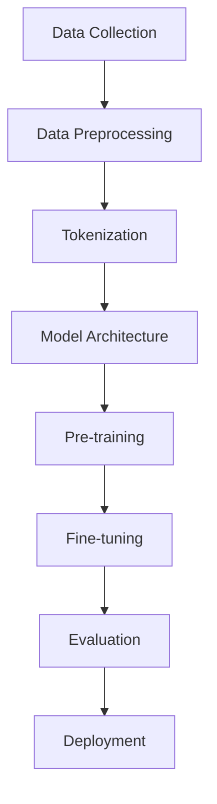

# Large Language Model Training

## Introduction

Training Large Language Models is one of the most computationally intensive and technically challenging tasks in modern AI. This guide covers the complete training pipeline, from data preparation to model deployment.

## Training Pipeline Overview

### High-Level Process



### Key Components

1. **Data Pipeline**: Collection, cleaning, and preprocessing
2. **Model Architecture**: Transformer design and configuration
3. **Training Strategy**: Pre-training, fine-tuning, and optimization
4. **Infrastructure**: Distributed computing and scaling
5. **Evaluation**: Metrics and benchmarking

## Data Preparation

### Data Collection

```python
import datasets
from datasets import load_dataset
import pandas as pd

class DataCollector:
    def __init__(self):
        self.sources = {
            'web_text': 'common_crawl',
            'books': 'bookcorpus',
            'wikipedia': 'wikipedia',
            'code': 'github_code',
            'academic': 'arxiv_papers'
        }
    
    def collect_web_data(self, num_samples=1000000):
        """Collect web text data"""
        dataset = load_dataset('c4', 'en', streaming=True)
        
        processed_data = []
        for i, example in enumerate(dataset['train']):
            if i >= num_samples:
                break
                
            # Basic quality filtering
            if self.quality_filter(example['text']):
                processed_data.append(example['text'])
                
        return processed_data
    
    def quality_filter(self, text):
        """Filter low-quality text"""
        # Length filtering
        if len(text.split()) < 50 or len(text.split()) > 10000:
            return False
            
        # Language detection
        if not self.is_english(text):
            return False
            
        # Content filtering
        if self.contains_harmful_content(text):
            return False
            
        return True
```

### Data Cleaning and Preprocessing

```python
import re
import html
from typing import List, Dict

class DataPreprocessor:
    def __init__(self):
        self.filters = [
            self.remove_html_tags,
            self.fix_encoding,
            self.normalize_whitespace,
            self.remove_urls,
            self.filter_repetitive_content
        ]
    
    def preprocess_text(self, text: str) -> str:
        """Apply all preprocessing filters"""
        for filter_func in self.filters:
            text = filter_func(text)
        return text
    
    def remove_html_tags(self, text: str) -> str:
        """Remove HTML tags and entities"""
        text = re.sub(r'<[^>]+>', '', text)
        text = html.unescape(text)
        return text
    
    def fix_encoding(self, text: str) -> str:
        """Fix common encoding issues"""
        # Fix common Unicode issues
        text = text.replace('’', "'")
        text = text.replace('“', '"')
        text = text.replace('â€\x9d', '"')
        return text
    
    def normalize_whitespace(self, text: str) -> str:
        """Normalize whitespace"""
        text = re.sub(r'\s+', ' ', text)
        text = text.strip()
        return text
    
    def remove_urls(self, text: str) -> str:
        """Remove URLs"""
        url_pattern = r'http[s]?://(?:[a-zA-Z]|[0-9]|[$-_@.&+]|[!*\\(\\),]|(?:%[0-9a-fA-F][0-9a-fA-F]))+'
        text = re.sub(url_pattern, '', text)
        return text
    
    def filter_repetitive_content(self, text: str) -> str:
        """Remove repetitive patterns"""
        lines = text.split('\n')
        unique_lines = []
        
        for line in lines:
            if line not in unique_lines[-3:]:  # Avoid immediate repetition
                unique_lines.append(line)
                
        return '\n'.join(unique_lines)
```

### Tokenization

```python
from transformers import GPT2TokenizerFast
import torch

class LLMTokenizer:
    def __init__(self, vocab_size=50257, model_max_length=2048):
        self.tokenizer = GPT2TokenizerFast.from_pretrained('gpt2')
        self.vocab_size = vocab_size
        self.model_max_length = model_max_length
        
        # Add special tokens
        special_tokens = {
            'pad_token': '<|pad|>',
            'eos_token': '<|endoftext|>',
            'bos_token': '<|startoftext|>',
            'unk_token': '<|unknown|>'
        }
        
        self.tokenizer.add_special_tokens(special_tokens)
    
    def tokenize_dataset(self, texts: List[str]) -> Dict:
        """Tokenize a dataset"""
        def tokenize_function(examples):
            return self.tokenizer(
                examples['text'],
                truncation=True,
                padding=True,
                max_length=self.model_max_length,
                return_tensors='pt'
            )
        
        return tokenize_function(texts)
    
    def create_training_examples(self, text: str) -> List[torch.Tensor]:
        """Create training examples with sliding window"""
        tokens = self.tokenizer.encode(text)
        examples = []
        
        stride = self.model_max_length // 2
        
        for i in range(0, len(tokens) - self.model_max_length, stride):
            example = tokens[i:i + self.model_max_length]
            examples.append(torch.tensor(example))
            
        return examples
```

## Pre-training

### Training Configuration

```python
from dataclasses import dataclass
from typing import Optional

@dataclass
class TrainingConfig:
    # Model configuration
    vocab_size: int = 50257
    d_model: int = 1024
    num_layers: int = 24
    num_heads: int = 16
    d_ff: int = 4096
    max_seq_length: int = 2048
    dropout: float = 0.1
    
    # Training configuration
    batch_size: int = 32
    learning_rate: float = 1e-4
    weight_decay: float = 0.01
    warmup_steps: int = 10000
    max_steps: int = 500000
    gradient_accumulation_steps: int = 8
    
    # Optimization
    adam_beta1: float = 0.9
    adam_beta2: float = 0.95
    adam_epsilon: float = 1e-8
    max_grad_norm: float = 1.0
    
    # Checkpointing
    save_steps: int = 10000
    eval_steps: int = 5000
    logging_steps: int = 100
    
    # Hardware
    mixed_precision: bool = True
    gradient_checkpointing: bool = True
    dataloader_num_workers: int = 4
```

### Training Loop

```python
import torch
import torch.nn as nn
from torch.optim import AdamW
from torch.optim.lr_scheduler import CosineAnnealingLR
from torch.cuda.amp import autocast, GradScaler
from tqdm import tqdm

class LLMTrainer:
    def __init__(self, model, config: TrainingConfig):
        self.model = model
        self.config = config
        
        # Optimizer
        self.optimizer = AdamW(
            model.parameters(),
            lr=config.learning_rate,
            betas=(config.adam_beta1, config.adam_beta2),
            eps=config.adam_epsilon,
            weight_decay=config.weight_decay
        )
        
        # Learning rate scheduler
        self.scheduler = self.create_scheduler()
        
        # Mixed precision
        self.scaler = GradScaler() if config.mixed_precision else None
        
        # Metrics
        self.global_step = 0
        self.training_logs = []
        
    def create_scheduler(self):
        """Create learning rate scheduler with warmup"""
        def lr_lambda(step):
            if step < self.config.warmup_steps:
                return step / self.config.warmup_steps
            else:
                progress = (step - self.config.warmup_steps) / (self.config.max_steps - self.config.warmup_steps)
                return 0.5 * (1 + torch.cos(torch.pi * progress))
        
        return torch.optim.lr_scheduler.LambdaLR(self.optimizer, lr_lambda)
    
    def train_step(self, batch):
        """Single training step"""
        self.model.train()
        
        input_ids = batch['input_ids']
        attention_mask = batch.get('attention_mask', None)
        
        # Forward pass
        if self.config.mixed_precision:
            with autocast():
                outputs = self.model(input_ids, attention_mask=attention_mask)
                loss = self.compute_loss(outputs, input_ids)
        else:
            outputs = self.model(input_ids, attention_mask=attention_mask)
            loss = self.compute_loss(outputs, input_ids)
        
        # Normalize loss by gradient accumulation steps
        loss = loss / self.config.gradient_accumulation_steps
        
        # Backward pass
        if self.config.mixed_precision:
            self.scaler.scale(loss).backward()
        else:
            loss.backward()
            
        return loss.item()
    
    def compute_loss(self, outputs, labels):
        """Compute language modeling loss"""
        # Shift labels for next token prediction
        shift_logits = outputs[..., :-1, :].contiguous()
        shift_labels = labels[..., 1:].contiguous()
        
        # Flatten tensors
        shift_logits = shift_logits.view(-1, shift_logits.size(-1))
        shift_labels = shift_labels.view(-1)
        
        # Compute cross-entropy loss
        loss_fn = nn.CrossEntropyLoss(ignore_index=-100)
        loss = loss_fn(shift_logits, shift_labels)
        
        return loss
    
    def train_epoch(self, dataloader):
        """Train for one epoch"""
        total_loss = 0
        num_batches = 0
        
        progress_bar = tqdm(dataloader, desc="Training")
        
        for batch_idx, batch in enumerate(progress_bar):
            loss = self.train_step(batch)
            total_loss += loss
            num_batches += 1
            
            # Gradient accumulation
            if (batch_idx + 1) % self.config.gradient_accumulation_steps == 0:
                # Gradient clipping
                if self.config.mixed_precision:
                    self.scaler.unscale_(self.optimizer)
                    torch.nn.utils.clip_grad_norm_(self.model.parameters(), self.config.max_grad_norm)
                    self.scaler.step(self.optimizer)
                    self.scaler.update()
                else:
                    torch.nn.utils.clip_grad_norm_(self.model.parameters(), self.config.max_grad_norm)
                    self.optimizer.step()
                
                self.scheduler.step()
                self.optimizer.zero_grad()
                self.global_step += 1
                
                # Logging
                if self.global_step % self.config.logging_steps == 0:
                    avg_loss = total_loss / num_batches
                    lr = self.scheduler.get_last_lr()[0]
                    
                    progress_bar.set_postfix({
                        'loss': f'{avg_loss:.4f}',
                        'lr': f'{lr:.2e}',
                        'step': self.global_step
                    })
                    
                    self.training_logs.append({
                        'step': self.global_step,
                        'loss': avg_loss,
                        'learning_rate': lr
                    })
                
                # Checkpointing
                if self.global_step % self.config.save_steps == 0:
                    self.save_checkpoint()
                
                # Evaluation
                if self.global_step % self.config.eval_steps == 0:
                    self.evaluate()
                    
                # Early stopping
                if self.global_step >= self.config.max_steps:
                    break
        
        return total_loss / num_batches
    
    def save_checkpoint(self):
        """Save model checkpoint"""
        checkpoint = {
            'model_state_dict': self.model.state_dict(),
            'optimizer_state_dict': self.optimizer.state_dict(),
            'scheduler_state_dict': self.scheduler.state_dict(),
            'global_step': self.global_step,
            'config': self.config,
            'training_logs': self.training_logs
        }
        
        if self.scaler:
            checkpoint['scaler_state_dict'] = self.scaler.state_dict()
            
        torch.save(checkpoint, f'checkpoint_step_{self.global_step}.pt')
    
    def evaluate(self):
        """Evaluate model on validation set"""
        self.model.eval()
        total_loss = 0
        num_batches = 0
        
        with torch.no_grad():
            for batch in self.eval_dataloader:
                outputs = self.model(batch['input_ids'])
                loss = self.compute_loss(outputs, batch['input_ids'])
                total_loss += loss.item()
                num_batches += 1
        
        avg_loss = total_loss / num_batches
        perplexity = torch.exp(torch.tensor(avg_loss))
        
        print(f"Validation Loss: {avg_loss:.4f}, Perplexity: {perplexity:.2f}")
        
        self.model.train()
        return avg_loss, perplexity
```

## Distributed Training

### Data Parallel Training

```python
import torch.distributed as dist
from torch.nn.parallel import DistributedDataParallel as DDP
from torch.utils.data.distributed import DistributedSampler

class DistributedTrainer:
    def __init__(self, model, config, rank, world_size):
        self.rank = rank
        self.world_size = world_size
        
        # Initialize distributed training
        dist.init_process_group(backend='nccl', rank=rank, world_size=world_size)
        
        # Move model to GPU and wrap with DDP
        torch.cuda.set_device(rank)
        model = model.to(rank)
        self.model = DDP(model, device_ids=[rank])
        
        self.config = config
        
    def create_dataloader(self, dataset):
        """Create distributed dataloader"""
        sampler = DistributedSampler(
            dataset,
            num_replicas=self.world_size,
            rank=self.rank,
            shuffle=True
        )
        
        dataloader = torch.utils.data.DataLoader(
            dataset,
            batch_size=self.config.batch_size,
            sampler=sampler,
            num_workers=self.config.dataloader_num_workers,
            pin_memory=True
        )
        
        return dataloader, sampler
    
    def train(self, train_dataset, eval_dataset=None):
        """Distributed training loop"""
        train_dataloader, train_sampler = self.create_dataloader(train_dataset)
        
        optimizer = AdamW(
            self.model.parameters(),
            lr=self.config.learning_rate,
            weight_decay=self.config.weight_decay
        )
        
        for epoch in range(self.config.num_epochs):
            train_sampler.set_epoch(epoch)
            
            # Train epoch
            avg_loss = self.train_epoch(train_dataloader, optimizer)
            
            # Log only on rank 0
            if self.rank == 0:
                print(f"Epoch {epoch}, Average Loss: {avg_loss:.4f}")
                
            # Evaluation
            if eval_dataset and self.rank == 0:
                eval_loss = self.evaluate(eval_dataset)
                print(f"Validation Loss: {eval_loss:.4f}")
        
        # Cleanup
        dist.destroy_process_group()
```

### Model Parallel Training

```python
class ModelParallelTrainer:
    def __init__(self, model_configs, device_map):
        self.device_map = device_map
        self.model_parts = self.create_model_parts(model_configs)
        
    def create_model_parts(self, configs):
        """Create model parts for different devices"""
        model_parts = {}
        
        for device, config in zip(self.device_map, configs):
            model_part = TransformerBlock(config).to(device)
            model_parts[device] = model_part
            
        return model_parts
    
    def forward_pass(self, x):
        """Forward pass across multiple devices"""
        for device in self.device_map:
            x = x.to(device)
            x = self.model_parts[device](x)
            
        return x
    
    def train_step(self, batch):
        """Training step with model parallelism"""
        # Forward pass
        outputs = self.forward_pass(batch['input_ids'])
        loss = self.compute_loss(outputs, batch['labels'])
        
        # Backward pass
        loss.backward()
        
        # Synchronize gradients across devices
        for model_part in self.model_parts.values():
            for param in model_part.parameters():
                if param.grad is not None:
                    dist.all_reduce(param.grad.data, op=dist.ReduceOp.SUM)
                    param.grad.data /= len(self.model_parts)
        
        return loss.item()
```

## Advanced Training Techniques

### Gradient Accumulation

```python
def train_with_gradient_accumulation(model, dataloader, optimizer, accumulation_steps):
    model.train()
    optimizer.zero_grad()
    
    total_loss = 0
    
    for step, batch in enumerate(dataloader):
        # Forward pass
        outputs = model(batch['input_ids'])
        loss = compute_loss(outputs, batch['labels'])
        
        # Scale loss by accumulation steps
        loss = loss / accumulation_steps
        
        # Backward pass
        loss.backward()
        
        total_loss += loss.item()
        
        # Update weights every accumulation_steps
        if (step + 1) % accumulation_steps == 0:
            optimizer.step()
            optimizer.zero_grad()
    
    return total_loss / len(dataloader)
```

### Learning Rate Scheduling

```python
class WarmupCosineScheduler:
    def __init__(self, optimizer, warmup_steps, total_steps, min_lr=0):
        self.optimizer = optimizer
        self.warmup_steps = warmup_steps
        self.total_steps = total_steps
        self.min_lr = min_lr
        self.base_lr = optimizer.param_groups[0]['lr']
        
    def step(self, current_step):
        if current_step < self.warmup_steps:
            # Linear warmup
            lr = self.base_lr * current_step / self.warmup_steps
        else:
            # Cosine annealing
            progress = (current_step - self.warmup_steps) / (self.total_steps - self.warmup_steps)
            lr = self.min_lr + (self.base_lr - self.min_lr) * 0.5 * (1 + math.cos(math.pi * progress))
        
        for param_group in self.optimizer.param_groups:
            param_group['lr'] = lr
```

### Dynamic Loss Scaling

```python
class DynamicLossScaler:
    def __init__(self, init_scale=2**16, growth_interval=2000):
        self.scale = init_scale
        self.growth_interval = growth_interval
        self.growth_tracker = 0
        
    def scale_loss(self, loss):
        return loss * self.scale
        
    def unscale_gradients(self, optimizer):
        for param_group in optimizer.param_groups:
            for param in param_group['params']:
                if param.grad is not None:
                    param.grad.data.div_(self.scale)
    
    def update_scale(self, found_inf):
        if found_inf:
            self.scale /= 2
            self.growth_tracker = 0
        else:
            self.growth_tracker += 1
            if self.growth_tracker == self.growth_interval:
                self.scale *= 2
                self.growth_tracker = 0
```

## Memory Optimization

### Gradient Checkpointing Implementation

```python
import torch.utils.checkpoint as checkpoint

class CheckpointedModel(nn.Module):
    def __init__(self, config):
        super().__init__()
        self.layers = nn.ModuleList([
            TransformerBlock(config) for _ in range(config.num_layers)
        ])
        self.use_checkpointing = True
        
    def forward(self, x):
        for layer in self.layers:
            if self.use_checkpointing and self.training:
                x = checkpoint.checkpoint(layer, x)
            else:
                x = layer(x)
        return x
```

### Memory-Efficient Optimizers

```python
class AdamWMemoryEfficient:
    """Memory-efficient AdamW implementation"""
    
    def __init__(self, params, lr=1e-3, betas=(0.9, 0.999), eps=1e-8, weight_decay=0.01):
        self.params = list(params)
        self.lr = lr
        self.beta1, self.beta2 = betas
        self.eps = eps
        self.weight_decay = weight_decay
        self.step_count = 0
        
        # Use 8-bit states to save memory
        self.states = {}
        
    def step(self):
        self.step_count += 1
        
        for param in self.params:
            if param.grad is None:
                continue
                
            grad = param.grad.data
            
            # Initialize state
            if param not in self.states:
                self.states[param] = {
                    'exp_avg': torch.zeros_like(param.data, dtype=torch.uint8),
                    'exp_avg_sq': torch.zeros_like(param.data, dtype=torch.uint8),
                }
            
            state = self.states[param]
            
            # Decode 8-bit states
            exp_avg = self.decode_state(state['exp_avg'])
            exp_avg_sq = self.decode_state(state['exp_avg_sq'])
            
            # Update biased first moment estimate
            exp_avg.mul_(self.beta1).add_(grad, alpha=1 - self.beta1)
            
            # Update biased second raw moment estimate
            exp_avg_sq.mul_(self.beta2).addcmul_(grad, grad, value=1 - self.beta2)
            
            # Compute bias-corrected moments
            bias_correction1 = 1 - self.beta1 ** self.step_count
            bias_correction2 = 1 - self.beta2 ** self.step_count
            
            # Update parameters
            denom = (exp_avg_sq.sqrt() / math.sqrt(bias_correction2)).add_(self.eps)
            step_size = self.lr / bias_correction1
            
            param.data.addcdiv_(exp_avg, denom, value=-step_size)
            
            # Apply weight decay
            if self.weight_decay > 0:
                param.data.add_(param.data, alpha=-self.weight_decay * self.lr)
            
            # Encode states back to 8-bit
            state['exp_avg'] = self.encode_state(exp_avg)
            state['exp_avg_sq'] = self.encode_state(exp_avg_sq)
    
    def encode_state(self, tensor):
        """Encode float32 tensor to uint8"""
        # Simple quantization scheme
        scale = tensor.abs().max() / 255
        return (tensor / scale + 128).clamp(0, 255).to(torch.uint8)
    
    def decode_state(self, tensor):
        """Decode uint8 tensor to float32"""
        return (tensor.float() - 128) * (tensor.float().max() / 255)
```

## Training Monitoring

### Metrics and Logging

```python
import wandb
from tensorboard import SummaryWriter

class TrainingMonitor:
    def __init__(self, project_name, experiment_name):
        # Initialize logging services
        wandb.init(project=project_name, name=experiment_name)
        self.tensorboard = SummaryWriter(f'runs/{experiment_name}')
        
        self.metrics = {
            'train_loss': [],
            'eval_loss': [],
            'learning_rate': [],
            'gradient_norm': [],
            'perplexity': []
        }
    
    def log_step(self, step, metrics_dict):
        """Log metrics for a single step"""
        # Log to wandb
        wandb.log({**metrics_dict, 'step': step})
        
        # Log to tensorboard
        for key, value in metrics_dict.items():
            self.tensorboard.add_scalar(key, value, step)
        
        # Store locally
        for key, value in metrics_dict.items():
            if key in self.metrics:
                self.metrics[key].append(value)
    
    def log_model_stats(self, model, step):
        """Log model statistics"""
        total_params = sum(p.numel() for p in model.parameters())
        trainable_params = sum(p.numel() for p in model.parameters() if p.requires_grad)
        
        # Log parameter statistics
        for name, param in model.named_parameters():
            if param.grad is not None:
                self.tensorboard.add_histogram(f'gradients/{name}', param.grad, step)
                self.tensorboard.add_histogram(f'weights/{name}', param, step)
        
        # Log memory usage
        if torch.cuda.is_available():
            memory_allocated = torch.cuda.memory_allocated() / 1024**3  # GB
            memory_reserved = torch.cuda.memory_reserved() / 1024**3   # GB
            
            self.log_step(step, {
                'memory_allocated_gb': memory_allocated,
                'memory_reserved_gb': memory_reserved,
                'total_params': total_params,
                'trainable_params': trainable_params
            })
```

### Performance Profiling

```python
import time
import psutil
import GPUtil

class PerformanceProfiler:
    def __init__(self):
        self.start_time = None
        self.step_times = []
        
    def start_step(self):
        self.start_time = time.time()
        
    def end_step(self):
        if self.start_time:
            step_time = time.time() - self.start_time
            self.step_times.append(step_time)
            return step_time
        return None
    
    def get_system_stats(self):
        """Get system performance statistics"""
        # CPU usage
        cpu_percent = psutil.cpu_percent()
        
        # Memory usage
        memory = psutil.virtual_memory()
        memory_percent = memory.percent
        
        # GPU usage
        gpus = GPUtil.getGPUs()
        gpu_stats = []
        for gpu in gpus:
            gpu_stats.append({
                'id': gpu.id,
                'name': gpu.name,
                'load': gpu.load * 100,
                'memory_used': gpu.memoryUsed,
                'memory_total': gpu.memoryTotal,
                'temperature': gpu.temperature
            })
        
        return {
            'cpu_percent': cpu_percent,
            'memory_percent': memory_percent,
            'gpu_stats': gpu_stats,
            'avg_step_time': sum(self.step_times[-100:]) / min(len(self.step_times), 100)
        }
```

## Evaluation and Validation

### Intrinsic Evaluation

```python
def calculate_perplexity(model, dataloader):
    """Calculate perplexity on validation set"""
    model.eval()
    total_loss = 0
    total_tokens = 0
    
    with torch.no_grad():
        for batch in dataloader:
            outputs = model(batch['input_ids'])
            loss = compute_loss(outputs, batch['input_ids'])
            
            # Count tokens (excluding padding)
            num_tokens = (batch['input_ids'] != tokenizer.pad_token_id).sum().item()
            
            total_loss += loss.item() * num_tokens
            total_tokens += num_tokens
    
    avg_loss = total_loss / total_tokens
    perplexity = torch.exp(torch.tensor(avg_loss))
    
    return perplexity.item()

def evaluate_next_token_accuracy(model, dataloader):
    """Evaluate next token prediction accuracy"""
    model.eval()
    correct_predictions = 0
    total_predictions = 0
    
    with torch.no_grad():
        for batch in dataloader:
            outputs = model(batch['input_ids'])
            logits = outputs.logits[..., :-1, :]
            labels = batch['input_ids'][..., 1:]
            
            predictions = torch.argmax(logits, dim=-1)
            
            # Mask out padding tokens
            mask = (labels != tokenizer.pad_token_id)
            correct = (predictions == labels) & mask
            
            correct_predictions += correct.sum().item()
            total_predictions += mask.sum().item()
    
    accuracy = correct_predictions / total_predictions
    return accuracy
```

### Generation Quality Evaluation

```python
def evaluate_generation_quality(model, prompts, max_length=100):
    """Evaluate generated text quality"""
    model.eval()
    
    results = {
        'coherence_scores': [],
        'diversity_scores': [],
        'fluency_scores': []
    }
    
    for prompt in prompts:
        # Generate text
        input_ids = tokenizer.encode(prompt, return_tensors='pt')
        
        with torch.no_grad():
            generated = model.generate(
                input_ids,
                max_length=max_length,
                temperature=0.7,
                do_sample=True,
                top_p=0.9,
                pad_token_id=tokenizer.pad_token_id
            )
        
        generated_text = tokenizer.decode(generated[0], skip_special_tokens=True)
        
        # Evaluate quality metrics
        coherence = evaluate_coherence(generated_text)
        diversity = evaluate_diversity(generated_text)
        fluency = evaluate_fluency(generated_text)
        
        results['coherence_scores'].append(coherence)
        results['diversity_scores'].append(diversity)
        results['fluency_scores'].append(fluency)
    
    # Calculate averages
    avg_results = {
        key: sum(scores) / len(scores)
        for key, scores in results.items()
    }
    
    return avg_results
```

## Best Practices

### Training Stability

1. **Gradient Clipping**: Prevent exploding gradients
2. **Learning Rate Warmup**: Stable training start
3. **Mixed Precision**: Memory efficiency without accuracy loss
4. **Regularization**: Dropout, weight decay, label smoothing

### Resource Optimization

```python
def optimize_training_resources(config):
    """Optimize training configuration for available resources"""
    # Calculate memory requirements
    model_memory = estimate_model_memory(config)
    available_memory = get_available_gpu_memory()
    
    # Adjust batch size based on memory
    if model_memory > available_memory * 0.8:
        config.batch_size = max(1, config.batch_size // 2)
        config.gradient_accumulation_steps *= 2
        print(f"Reduced batch size to {config.batch_size}")
    
    # Enable gradient checkpointing for large models
    if config.num_layers > 12:
        config.gradient_checkpointing = True
        print("Enabled gradient checkpointing")
    
    # Use mixed precision for modern GPUs
    if torch.cuda.get_device_capability()[0] >= 7:
        config.mixed_precision = True
        print("Enabled mixed precision training")
    
    return config
```

### Debugging Training Issues

```python
def debug_training_issues(model, dataloader, optimizer):
    """Debug common training issues"""
    
    # Check for NaN gradients
    def check_gradients():
        for name, param in model.named_parameters():
            if param.grad is not None:
                if torch.isnan(param.grad).any():
                    print(f"NaN gradient detected in {name}")
                if torch.isinf(param.grad).any():
                    print(f"Inf gradient detected in {name}")
    
    # Check learning rate
    def check_learning_rate():
        lr = optimizer.param_groups[0]['lr']
        if lr < 1e-8:
            print(f"Learning rate may be too small: {lr}")
        if lr > 1e-2:
            print(f"Learning rate may be too large: {lr}")
    
    # Check data distribution
    def check_data_distribution(batch):
        input_ids = batch['input_ids']
        vocab_distribution = torch.bincount(input_ids.flatten())
        
        # Check for token distribution imbalance
        if vocab_distribution.max() > vocab_distribution.mean() * 100:
            print("Severe token distribution imbalance detected")
    
    # Run checks
    check_learning_rate()
    
    for batch in dataloader:
        check_data_distribution(batch)
        
        # Forward pass
        outputs = model(batch['input_ids'])
        loss = compute_loss(outputs, batch['input_ids'])
        
        # Backward pass
        loss.backward()
        check_gradients()
        
        break  # Only check first batch
```

## Conclusion

Training Large Language Models requires careful attention to:

1. **Data Quality**: Clean, diverse, and representative training data
2. **Model Architecture**: Appropriate scaling and configuration
3. **Training Dynamics**: Stable optimization and convergence
4. **Resource Management**: Efficient use of computational resources
5. **Evaluation**: Comprehensive assessment of model capabilities

Success in LLM training comes from balancing these factors while continuously monitoring and adjusting the training process based on empirical results and theoretical understanding.

## Further Reading

- "Scaling Laws for Neural Language Models" (Kaplan et al., 2020)
- "Training Compute-Optimal Large Language Models" (Hoffmann et al., 2022)
- "Efficient Training of Language Models to Fill in the Middle" (Bavarian et al., 2022)
- "GPT-4 Technical Report" (OpenAI, 2023)
