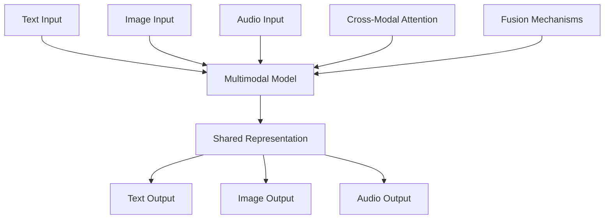

# Multimodal AI

<div class="grid cards" markdown>

-   :material-image:{ .lg .middle } **Vision Models**

    ---

    CNNs, Vision Transformers, and computer vision

    [:octicons-arrow-right-24: Vision AI](vision/index.md)

-   :material-waveform:{ .lg .middle } **Audio Processing**

    ---

    Speech recognition, synthesis, and audio generation

    [:octicons-arrow-right-24: Audio AI](audio/index.md)

-   :material-video:{ .lg .middle } **Video Understanding**

    ---

    Video analysis, generation, and temporal modeling

    [:octicons-arrow-right-24: Video AI](video/index.md)

-   :material-connection:{ .lg .middle } **Cross-Modal**

    ---

    Vision-language models, CLIP, and multimodal fusion

    [:octicons-arrow-right-24: Fusion Methods](fusion/index.md)

</div>

## Learning Objectives

=== "Beginner"
    - [ ] Understand multimodal AI concepts
    - [ ] Learn basic vision and audio processing
    - [ ] Explore pre-trained multimodal models
    - [ ] Practice with simple cross-modal tasks

=== "Intermediate"
    - [ ] Implement vision transformers
    - [ ] Build multimodal applications
    - [ ] Master attention mechanisms across modalities
    - [ ] Optimize multimodal training

=== "Advanced"
    - [ ] Design novel fusion architectures
    - [ ] Research emergent capabilities
    - [ ] Scale multimodal systems
    - [ ] Develop evaluation frameworks

## Multimodal Fundamentals

### What is Multimodal AI?

Multimodal AI processes and understands multiple types of data simultaneously:



### Key Challenges

| Challenge | Description | Solutions |
|-----------|-------------|-----------|
| **Modality Gap** | Different data types have different properties | Learned embeddings, alignment |
| **Temporal Alignment** | Synchronizing time-based modalities | Attention mechanisms, temporal modeling |
| **Scale Differences** | Modalities have different information density | Adaptive pooling, hierarchical processing |
| **Training Complexity** | Multi-objective optimization | Curriculum learning, balanced sampling |

## Vision-Language Models

### CLIP Architecture

```python
import torch
import torch.nn as nn
from transformers import CLIPModel, CLIPProcessor
import numpy as np

class CLIPImplementation(nn.Module):
    def __init__(self, embed_dim=512, image_resolution=224, vocab_size=49408):
        super().__init__()
        self.embed_dim = embed_dim
        
        # Vision encoder (simplified ViT)
        self.vision_encoder = VisionTransformer(
            input_resolution=image_resolution,
            patch_size=32,
            width=768,
            layers=12,
            heads=12,
            output_dim=embed_dim
        )
        
        # Text encoder (transformer)
        self.text_encoder = TextTransformer(
            vocab_size=vocab_size,
            width=512,
            layers=12,
            heads=8,
            output_dim=embed_dim
        )
        
        # Temperature parameter for contrastive learning
        self.logit_scale = nn.Parameter(torch.ones([]) * np.log(1 / 0.07))
        
    def encode_image(self, image):
        return self.vision_encoder(image)
        
    def encode_text(self, text):
        return self.text_encoder(text)
        
    def forward(self, image, text):
        # Get features
        image_features = self.encode_image(image)
        text_features = self.encode_text(text)
        
        # Normalize features
        image_features = image_features / image_features.norm(dim=-1, keepdim=True)
        text_features = text_features / text_features.norm(dim=-1, keepdim=True)
        
        # Compute similarity
        logit_scale = self.logit_scale.exp()
        logits_per_image = logit_scale * image_features @ text_features.t()
        logits_per_text = logits_per_image.t()
        
        return logits_per_image, logits_per_text

class VisionTransformer(nn.Module):
    def __init__(self, input_resolution, patch_size, width, layers, heads, output_dim):
        super().__init__()
        self.conv1 = nn.Conv2d(3, width, kernel_size=patch_size, stride=patch_size, bias=False)
        
        scale = width ** -0.5
        self.class_embedding = nn.Parameter(scale * torch.randn(width))
        self.positional_embedding = nn.Parameter(
            scale * torch.randn((input_resolution // patch_size) ** 2 + 1, width)
        )
        self.ln_pre = nn.LayerNorm(width)
        
        self.transformer = nn.TransformerEncoder(
            nn.TransformerEncoderLayer(
                d_model=width,
                nhead=heads,
                dim_feedforward=width * 4,
                batch_first=True
            ),
            num_layers=layers
        )
        
        self.ln_post = nn.LayerNorm(width)
        self.proj = nn.Parameter(scale * torch.randn(width, output_dim))
        
    def forward(self, x):
        # Patch embedding
        x = self.conv1(x)  # [batch, width, grid, grid]
        x = x.reshape(x.shape[0], x.shape[1], -1)  # [batch, width, grid**2]
        x = x.permute(0, 2, 1)  # [batch, grid**2, width]
        
        # Add class token
        x = torch.cat([
            self.class_embedding.to(x.dtype) + torch.zeros(x.shape[0], 1, x.shape[-1], dtype=x.dtype, device=x.device),
            x
        ], dim=1)  # [batch, grid**2 + 1, width]
        
        # Add positional embedding
        x = x + self.positional_embedding.to(x.dtype)
        x = self.ln_pre(x)
        
        # Transformer
        x = self.transformer(x)
        x = self.ln_post(x[:, 0, :])  # Use class token
        
        # Project to output dimension
        if self.proj is not None:
            x = x @ self.proj
            
        return x
```

### Vision-Language Training

```python
class MultimodalTrainer:
    def __init__(self, model, processor, device):
        self.model = model
        self.processor = processor
        self.device = device
        
    def contrastive_loss(self, logits_per_image, logits_per_text):
        """Compute symmetric cross-entropy loss"""
        batch_size = logits_per_image.shape[0]
        labels = torch.arange(batch_size, device=self.device)
        
        loss_img = nn.CrossEntropyLoss()(logits_per_image, labels)
        loss_txt = nn.CrossEntropyLoss()(logits_per_text, labels)
        
        return (loss_img + loss_txt) / 2
    
    def train_step(self, images, texts):
        """Single training step"""
        # Process inputs
        inputs = self.processor(
            text=texts, 
            images=images, 
            return_tensors="pt", 
            padding=True
        ).to(self.device)
        
        # Forward pass
        logits_per_image, logits_per_text = self.model(
            inputs['pixel_values'], 
            inputs['input_ids']
        )
        
        # Compute loss
        loss = self.contrastive_loss(logits_per_image, logits_per_text)
        
        return loss
    
    def zero_shot_classification(self, image, class_names):
        """Perform zero-shot image classification"""
        # Create text prompts
        text_prompts = [f"a photo of a {name}" for name in class_names]
        
        # Process inputs
        inputs = self.processor(
            text=text_prompts,
            images=image,
            return_tensors="pt",
            padding=True
        ).to(self.device)
        
        # Get features
        with torch.no_grad():
            image_features = self.model.encode_image(inputs['pixel_values'])
            text_features = self.model.encode_text(inputs['input_ids'])
            
            # Compute similarities
            similarities = (image_features @ text_features.T).softmax(dim=-1)
            
        return similarities[0], class_names

# Example usage
trainer = MultimodalTrainer(model, processor, device)

# Training
images = load_images(batch_size=32)
texts = load_captions(batch_size=32)
loss = trainer.train_step(images, texts)

# Zero-shot classification
image = load_single_image("cat.jpg")
class_names = ["cat", "dog", "bird", "fish"]
probabilities, labels = trainer.zero_shot_classification(image, class_names)
```

## Audio-Visual Models

### Speech-to-Text with Vision Context

```python
import librosa
import cv2
from transformers import Wav2Vec2Processor, Wav2Vec2ForCTC

class AudioVisualASR:
    def __init__(self, audio_model, vision_model):
        self.audio_processor = Wav2Vec2Processor.from_pretrained("facebook/wav2vec2-base-960h")
        self.audio_model = Wav2Vec2ForCTC.from_pretrained("facebook/wav2vec2-base-960h")
        self.vision_model = vision_model
        
        # Fusion layer
        self.fusion_layer = nn.MultiheadAttention(
            embed_dim=768,
            num_heads=8,
            batch_first=True
        )
        
    def extract_audio_features(self, audio_path):
        """Extract features from audio"""
        # Load audio
        audio, sr = librosa.load(audio_path, sr=16000)
        
        # Process with Wav2Vec2
        inputs = self.audio_processor(audio, return_tensors="pt", sampling_rate=16000)
        
        with torch.no_grad():
            outputs = self.audio_model(**inputs, output_hidden_states=True)
            audio_features = outputs.hidden_states[-1]  # Last layer
            
        return audio_features
    
    def extract_visual_features(self, video_frames):
        """Extract lip-reading features from video"""
        lip_features = []
        
        for frame in video_frames:
            # Detect face and extract lip region
            lip_region = self.extract_lip_region(frame)
            
            # Extract features using vision model
            features = self.vision_model.encode_image(lip_region)
            lip_features.append(features)
            
        return torch.stack(lip_features)
    
    def extract_lip_region(self, frame):
        """Extract lip region from video frame"""
        # Face detection
        face_cascade = cv2.CascadeClassifier(cv2.data.haarcascades + 'haarcascade_frontalface_default.xml')
        faces = face_cascade.detectMultiScale(frame, 1.1, 4)
        
        if len(faces) > 0:
            # Extract face region
            x, y, w, h = faces[0]
            face_region = frame[y:y+h, x:x+w]
            
            # Focus on lower half (lip area)
            lip_region = face_region[h//2:, :]
            
            return torch.tensor(lip_region).unsqueeze(0).float()
        
        return torch.zeros(1, 3, 224, 224)  # Default empty region
    
    def fuse_modalities(self, audio_features, visual_features):
        """Fuse audio and visual features"""
        # Align temporal dimensions
        min_length = min(audio_features.shape[1], visual_features.shape[1])
        audio_features = audio_features[:, :min_length, :]
        visual_features = visual_features[:, :min_length, :]
        
        # Cross-modal attention
        fused_features, _ = self.fusion_layer(
            query=audio_features,
            key=visual_features,
            value=visual_features
        )
        
        # Combine with residual connection
        combined = audio_features + fused_features
        
        return combined
    
    def transcribe(self, audio_path, video_frames=None):
        """Transcribe audio with optional visual context"""
        # Extract audio features
        audio_features = self.extract_audio_features(audio_path)
        
        if video_frames is not None:
            # Extract visual features
            visual_features = self.extract_visual_features(video_frames)
            
            # Fuse modalities
            features = self.fuse_modalities(audio_features, visual_features)
        else:
            features = audio_features
        
        # Generate transcription
        with torch.no_grad():
            logits = self.audio_model.lm_head(features)
            predicted_ids = torch.argmax(logits, dim=-1)
            transcription = self.audio_processor.batch_decode(predicted_ids)[0]
            
        return transcription

# Usage example
asr_model = AudioVisualASR(audio_model, vision_model)

# Audio-only transcription
transcription = asr_model.transcribe("speech.wav")

# Audio-visual transcription
video_frames = load_video_frames("speech_video.mp4")
transcription = asr_model.transcribe("speech.wav", video_frames)
```

## Text-to-Image Generation

### Diffusion Models with Text Conditioning

```python
import torch
import torch.nn as nn
from diffusers import UNet2DConditionModel, DDPMScheduler
from transformers import CLIPTextModel, CLIPTokenizer

class TextToImageDiffusion:
    def __init__(self, unet, text_encoder, tokenizer, scheduler):
        self.unet = unet
        self.text_encoder = text_encoder
        self.tokenizer = tokenizer
        self.scheduler = scheduler
        
    def encode_text(self, prompt, max_length=77):
        """Encode text prompt to embeddings"""
        # Tokenize
        text_inputs = self.tokenizer(
            prompt,
            padding="max_length",
            max_length=max_length,
            truncation=True,
            return_tensors="pt"
        )
        
        # Encode
        with torch.no_grad():
            text_embeddings = self.text_encoder(text_inputs.input_ids)[0]
            
        return text_embeddings
    
    def add_noise(self, image, timestep):
        """Add noise to image according to schedule"""
        noise = torch.randn_like(image)
        noisy_image = self.scheduler.add_noise(image, noise, timestep)
        return noisy_image, noise
    
    def denoise_step(self, noisy_image, timestep, text_embeddings):
        """Single denoising step"""
        # Predict noise
        noise_pred = self.unet(
            noisy_image,
            timestep,
            encoder_hidden_states=text_embeddings
        ).sample
        
        # Remove predicted noise
        denoised = self.scheduler.step(
            noise_pred, 
            timestep, 
            noisy_image
        ).prev_sample
        
        return denoised
    
    def generate_image(self, prompt, height=512, width=512, num_steps=50):
        """Generate image from text prompt"""
        # Encode text
        text_embeddings = self.encode_text(prompt)
        
        # Start with random noise
        latents = torch.randn(1, 4, height//8, width//8)
        
        # Set timesteps
        self.scheduler.set_timesteps(num_steps)
        
        # Denoising loop
        for timestep in self.scheduler.timesteps:
            latents = self.denoise_step(
                latents, 
                timestep, 
                text_embeddings
            )
            
        return latents
    
    def train_step(self, images, prompts):
        """Training step for text-to-image model"""
        batch_size = images.shape[0]
        
        # Encode text
        text_embeddings = self.encode_text(prompts)
        
        # Sample random timestep
        timesteps = torch.randint(
            0, self.scheduler.config.num_train_timesteps,
            (batch_size,), device=images.device
        )
        
        # Add noise
        noisy_images, noise = self.add_noise(images, timesteps)
        
        # Predict noise
        noise_pred = self.unet(
            noisy_images,
            timesteps,
            encoder_hidden_states=text_embeddings
        ).sample
        
        # Compute loss
        loss = nn.MSELoss()(noise_pred, noise)
        
        return loss

# Example training loop
def train_text_to_image(model, dataloader, optimizer, num_epochs):
    model.unet.train()
    
    for epoch in range(num_epochs):
        for batch_idx, (images, prompts) in enumerate(dataloader):
            optimizer.zero_grad()
            
            # Forward pass
            loss = model.train_step(images, prompts)
            
            # Backward pass
            loss.backward()
            optimizer.step()
            
            if batch_idx % 100 == 0:
                print(f'Epoch {epoch}, Batch {batch_idx}, Loss: {loss.item():.4f}')
```

### Advanced Image Generation Techniques

```python
class ControlNet:
    """ControlNet for controlled image generation"""
    
    def __init__(self, base_unet, control_encoder):
        self.base_unet = base_unet
        self.control_encoder = control_encoder
        
    def process_control_input(self, control_image, control_type):
        """Process control input (edge, depth, pose, etc.)"""
        if control_type == "canny":
            control_features = self.extract_canny_edges(control_image)
        elif control_type == "depth":
            control_features = self.extract_depth_map(control_image)
        elif control_type == "pose":
            control_features = self.extract_pose_keypoints(control_image)
        else:
            control_features = control_image
            
        return self.control_encoder(control_features)
    
    def controlled_generation(self, prompt, control_image, control_type="canny"):
        """Generate image with structural control"""
        # Encode text
        text_embeddings = self.encode_text(prompt)
        
        # Process control input
        control_features = self.process_control_input(control_image, control_type)
        
        # Generate with control guidance
        latents = torch.randn(1, 4, 64, 64)
        
        for timestep in self.scheduler.timesteps:
            # Add control features to UNet
            noise_pred = self.base_unet(
                latents,
                timestep,
                encoder_hidden_states=text_embeddings,
                control_features=control_features
            ).sample
            
            latents = self.scheduler.step(noise_pred, timestep, latents).prev_sample
            
        return latents
    
    def extract_canny_edges(self, image):
        """Extract Canny edges for structural control"""
        import cv2
        
        # Convert to grayscale
        gray = cv2.cvtColor(image.numpy(), cv2.COLOR_RGB2GRAY)
        
        # Apply Canny edge detection
        edges = cv2.Canny(gray, 100, 200)
        
        # Convert back to tensor
        return torch.from_numpy(edges).unsqueeze(0).float()

class InpaintingModel:
    """Image inpainting with text guidance"""
    
    def __init__(self, unet, text_encoder):
        self.unet = unet
        self.text_encoder = text_encoder
        
    def create_mask(self, image, mask_prompt):
        """Create mask from text description"""
        # Use segmentation model to create mask
        # This is a simplified version
        pass
    
    def inpaint(self, image, mask, prompt, num_steps=50):
        """Inpaint masked region with text guidance"""
        # Encode text
        text_embeddings = self.encode_text(prompt)
        
        # Prepare masked image
        masked_image = image * (1 - mask)
        
        # Start with noise in masked region
        noise = torch.randn_like(image)
        latents = image * (1 - mask) + noise * mask
        
        # Denoising loop
        for timestep in self.scheduler.timesteps:
            # Predict noise
            noise_pred = self.unet(
                latents,
                timestep,
                encoder_hidden_states=text_embeddings,
                masked_image=masked_image,
                mask=mask
            ).sample
            
            # Denoise
            latents = self.scheduler.step(noise_pred, timestep, latents).prev_sample
            
            # Keep unmasked regions unchanged
            latents = latents * mask + image * (1 - mask)
            
        return latents
```

## Video Understanding

### Video-Language Models

```python
class VideoLanguageModel:
    def __init__(self, video_encoder, text_encoder, fusion_module):
        self.video_encoder = video_encoder
        self.text_encoder = text_encoder
        self.fusion_module = fusion_module
        
    def encode_video(self, video_frames):
        """Encode video to feature representation"""
        batch_size, num_frames, channels, height, width = video_frames.shape
        
        # Encode each frame
        frame_features = []
        for i in range(num_frames):
            frame_feat = self.video_encoder(video_frames[:, i])
            frame_features.append(frame_feat)
        
        # Stack temporal features
        video_features = torch.stack(frame_features, dim=1)
        
        # Apply temporal modeling (transformer)
        video_features = self.temporal_transformer(video_features)
        
        return video_features
    
    def video_qa(self, video_frames, question):
        """Answer questions about video content"""
        # Encode video
        video_features = self.encode_video(video_frames)
        
        # Encode question
        question_features = self.text_encoder(question)
        
        # Fuse modalities
        fused_features = self.fusion_module(video_features, question_features)
        
        # Generate answer
        answer = self.answer_decoder(fused_features)
        
        return answer
    
    def video_captioning(self, video_frames):
        """Generate captions for video content"""
        # Encode video
        video_features = self.encode_video(video_frames)
        
        # Generate caption
        caption = self.caption_decoder(video_features)
        
        return caption
    
    def temporal_grounding(self, video_frames, text_query):
        """Find temporal segments matching text query"""
        # Encode video and text
        video_features = self.encode_video(video_frames)
        text_features = self.text_encoder(text_query)
        
        # Compute similarity across time
        similarities = torch.matmul(video_features, text_features.T)
        
        # Find high-similarity segments
        timestamps = self.find_segments(similarities)
        
        return timestamps

class TemporalTransformer(nn.Module):
    """Transformer for temporal video modeling"""
    
    def __init__(self, d_model, nhead, num_layers):
        super().__init__()
        self.transformer = nn.TransformerEncoder(
            nn.TransformerEncoderLayer(d_model, nhead),
            num_layers
        )
        
    def forward(self, x):
        # x: [batch, time, features]
        x = x.transpose(0, 1)  # [time, batch, features]
        x = self.transformer(x)
        x = x.transpose(0, 1)  # [batch, time, features]
        return x
```

## Multimodal Fusion Techniques

### Attention-Based Fusion

```python
class CrossModalAttention(nn.Module):
    """Cross-modal attention mechanism"""
    
    def __init__(self, d_model, nhead):
        super().__init__()
        self.multihead_attn = nn.MultiheadAttention(d_model, nhead)
        self.norm1 = nn.LayerNorm(d_model)
        self.norm2 = nn.LayerNorm(d_model)
        
    def forward(self, query_modality, key_value_modality):
        # Cross-attention
        attn_output, _ = self.multihead_attn(
            query=query_modality,
            key=key_value_modality,
            value=key_value_modality
        )
        
        # Residual connection and normalization
        output = self.norm1(query_modality + attn_output)
        
        return output

class MultimodalFusion(nn.Module):
    """Advanced multimodal fusion module"""
    
    def __init__(self, modality_dims, output_dim, fusion_type="attention"):
        super().__init__()
        self.fusion_type = fusion_type
        self.modality_dims = modality_dims
        self.output_dim = output_dim
        
        if fusion_type == "attention":
            self.setup_attention_fusion()
        elif fusion_type == "bilinear":
            self.setup_bilinear_fusion()
        elif fusion_type == "tensor":
            self.setup_tensor_fusion()
    
    def setup_attention_fusion(self):
        """Setup attention-based fusion"""
        total_dim = sum(self.modality_dims.values())
        self.attention = nn.MultiheadAttention(total_dim, num_heads=8)
        self.projection = nn.Linear(total_dim, self.output_dim)
        
    def setup_bilinear_fusion(self):
        """Setup bilinear fusion"""
        modalities = list(self.modality_dims.keys())
        self.bilinear_layers = nn.ModuleDict()
        
        for i, mod1 in enumerate(modalities):
            for mod2 in modalities[i:]:
                layer_name = f"{mod1}_{mod2}"
                self.bilinear_layers[layer_name] = nn.Bilinear(
                    self.modality_dims[mod1],
                    self.modality_dims[mod2],
                    self.output_dim
                )
    
    def forward(self, modality_features):
        """Fuse multiple modalities"""
        if self.fusion_type == "attention":
            return self.attention_fusion(modality_features)
        elif self.fusion_type == "bilinear":
            return self.bilinear_fusion(modality_features)
        elif self.fusion_type == "tensor":
            return self.tensor_fusion(modality_features)
    
    def attention_fusion(self, modality_features):
        """Attention-based fusion"""
        # Concatenate all modalities
        all_features = torch.cat(list(modality_features.values()), dim=-1)
        
        # Self-attention
        fused, _ = self.attention(all_features, all_features, all_features)
        
        # Project to output dimension
        output = self.projection(fused)
        
        return output
    
    def bilinear_fusion(self, modality_features):
        """Bilinear fusion"""
        modalities = list(modality_features.keys())
        fusion_results = []
        
        for i, mod1 in enumerate(modalities):
            for mod2 in modalities[i:]:
                layer_name = f"{mod1}_{mod2}"
                if layer_name in self.bilinear_layers:
                    result = self.bilinear_layers[layer_name](
                        modality_features[mod1],
                        modality_features[mod2]
                    )
                    fusion_results.append(result)
        
        # Sum all bilinear interactions
        return sum(fusion_results)
```

## Applications & Use Cases

### Multimodal Chatbot

```python
class MultimodalChatbot:
    def __init__(self, text_model, vision_model, audio_model, fusion_model):
        self.text_model = text_model
        self.vision_model = vision_model
        self.audio_model = audio_model
        self.fusion_model = fusion_model
        
    def process_input(self, text=None, image=None, audio=None):
        """Process multimodal input"""
        features = {}
        
        if text is not None:
            features['text'] = self.text_model.encode(text)
            
        if image is not None:
            features['image'] = self.vision_model.encode_image(image)
            
        if audio is not None:
            features['audio'] = self.audio_model.encode_audio(audio)
        
        # Fuse available modalities
        if len(features) > 1:
            fused_features = self.fusion_model(features)
        else:
            fused_features = list(features.values())[0]
            
        return fused_features
    
    def generate_response(self, input_features, response_modality="text"):
        """Generate multimodal response"""
        if response_modality == "text":
            return self.generate_text_response(input_features)
        elif response_modality == "image":
            return self.generate_image_response(input_features)
        elif response_modality == "audio":
            return self.generate_audio_response(input_features)
    
    def generate_text_response(self, features):
        """Generate text response"""
        # Use features to condition text generation
        response = self.text_model.generate(
            prompt_embeds=features,
            max_length=100,
            do_sample=True,
            temperature=0.7
        )
        return response
    
    def generate_image_response(self, features):
        """Generate image response"""
        # Convert features to image generation prompt
        image = self.vision_model.generate_image(
            conditioning=features,
            height=512,
            width=512
        )
        return image

# Example usage
chatbot = MultimodalChatbot(text_model, vision_model, audio_model, fusion_model)

# Text + Image input
text_input = "What's in this image?"
image_input = load_image("photo.jpg")
features = chatbot.process_input(text=text_input, image=image_input)
response = chatbot.generate_response(features, response_modality="text")
```

### Document Understanding

```python
class DocumentUnderstanding:
    """Multimodal document understanding system"""
    
    def __init__(self, layout_model, ocr_model, nlp_model):
        self.layout_model = layout_model
        self.ocr_model = ocr_model
        self.nlp_model = nlp_model
        
    def process_document(self, document_image):
        """Process document with layout, OCR, and NLP"""
        # Extract layout information
        layout_info = self.layout_model.analyze_layout(document_image)
        
        # Perform OCR
        text_content = self.ocr_model.extract_text(document_image)
        
        # Combine layout and text
        structured_content = self.combine_layout_text(layout_info, text_content)
        
        # Apply NLP understanding
        understanding = self.nlp_model.understand(structured_content)
        
        return understanding
    
    def combine_layout_text(self, layout, text):
        """Combine layout and text information"""
        structured = {}
        
        for region in layout['regions']:
            region_type = region['type']  # title, paragraph, table, etc.
            bbox = region['bbox']
            
            # Extract text for this region
            region_text = self.extract_text_in_bbox(text, bbox)
            
            structured[region_type] = structured.get(region_type, [])
            structured[region_type].append({
                'text': region_text,
                'bbox': bbox,
                'confidence': region['confidence']
            })
            
        return structured
    
    def extract_key_information(self, document_image, query):
        """Extract specific information from document"""
        # Process document
        understanding = self.process_document(document_image)
        
        # Use query to find relevant information
        relevant_info = self.nlp_model.answer_question(
            context=understanding,
            question=query
        )
        
        return relevant_info
```

## Best Practices & Optimization

### Training Strategies

```python
class MultimodalTrainingStrategy:
    def __init__(self, model, modalities, loss_weights=None):
        self.model = model
        self.modalities = modalities
        self.loss_weights = loss_weights or {mod: 1.0 for mod in modalities}
        
    def curriculum_learning(self, dataloader, stages):
        """Implement curriculum learning for multimodal training"""
        for stage, config in stages.items():
            print(f"Training stage: {stage}")
            
            # Adjust learning rate
            for param_group in self.optimizer.param_groups:
                param_group['lr'] = config['learning_rate']
            
            # Train with specific modalities
            active_modalities = config['modalities']
            
            for epoch in range(config['epochs']):
                self.train_epoch(dataloader, active_modalities)
    
    def balanced_sampling(self, datasets):
        """Balance samples across modalities"""
        min_size = min(len(dataset) for dataset in datasets.values())
        
        balanced_datasets = {}
        for modality, dataset in datasets.items():
            # Sample subset to balance
            indices = torch.randperm(len(dataset))[:min_size]
            balanced_datasets[modality] = torch.utils.data.Subset(dataset, indices)
            
        return balanced_datasets
    
    def adaptive_loss_weighting(self, losses, step):
        """Dynamically adjust loss weights"""
        # Compute loss ratios
        loss_ratios = {}
        total_loss = sum(losses.values())
        
        for modality, loss in losses.items():
            loss_ratios[modality] = loss / total_loss
            
        # Adjust weights inversely to current loss ratios
        for modality in self.modalities:
            if loss_ratios[modality] > 0.5:  # High loss
                self.loss_weights[modality] *= 0.9  # Decrease weight
            else:  # Low loss
                self.loss_weights[modality] *= 1.1  # Increase weight
                
        return self.loss_weights

class MultimodalEvaluation:
    """Comprehensive evaluation for multimodal models"""
    
    def __init__(self, model):
        self.model = model
        
    def evaluate_cross_modal_retrieval(self, test_data):
        """Evaluate cross-modal retrieval performance"""
        text_embeddings = []
        image_embeddings = []
        
        with torch.no_grad():
            for batch in test_data:
                text_emb = self.model.encode_text(batch['text'])
                image_emb = self.model.encode_image(batch['image'])
                
                text_embeddings.append(text_emb)
                image_embeddings.append(image_emb)
        
        text_embeddings = torch.cat(text_embeddings)
        image_embeddings = torch.cat(image_embeddings)
        
        # Compute retrieval metrics
        similarities = torch.matmul(text_embeddings, image_embeddings.T)
        
        # Text-to-image retrieval
        t2i_ranks = self.compute_retrieval_ranks(similarities)
        t2i_recall = self.compute_recall_at_k(t2i_ranks, k=[1, 5, 10])
        
        # Image-to-text retrieval
        i2t_ranks = self.compute_retrieval_ranks(similarities.T)
        i2t_recall = self.compute_recall_at_k(i2t_ranks, k=[1, 5, 10])
        
        return {
            'text_to_image_recall': t2i_recall,
            'image_to_text_recall': i2t_recall
        }
    
    def compute_recall_at_k(self, ranks, k=[1, 5, 10]):
        """Compute Recall@K metrics"""
        recall_at_k = {}
        
        for k_val in k:
            recall_at_k[f'R@{k_val}'] = (ranks <= k_val).float().mean().item()
            
        return recall_at_k
```

## Emerging Trends

### Large Multimodal Models (LMMs)

```python
class LargeMultimodalModel:
    """Implementation of large multimodal models like GPT-4V"""
    
    def __init__(self, vision_encoder, language_model, connector):
        self.vision_encoder = vision_encoder
        self.language_model = language_model
        self.connector = connector
        
    def process_multimodal_input(self, text, images):
        """Process text and images together"""
        # Encode images
        image_features = []
        for image in images:
            features = self.vision_encoder(image)
            image_features.append(features)
        
        # Connect image features to language model
        image_tokens = self.connector(image_features)
        
        # Combine text and image tokens
        combined_input = self.combine_text_image_tokens(text, image_tokens)
        
        return combined_input
    
    def generate_response(self, text, images=None):
        """Generate response to multimodal input"""
        if images is not None:
            input_tokens = self.process_multimodal_input(text, images)
        else:
            input_tokens = self.tokenize_text(text)
        
        # Generate response
        response = self.language_model.generate(
            input_tokens,
            max_length=1000,
            do_sample=True,
            temperature=0.7
        )
        
        return response
```

### Embodied AI

```python
class EmbodiedAgent:
    """Multimodal agent for embodied AI tasks"""
    
    def __init__(self, perception_model, planning_model, action_model):
        self.perception = perception_model
        self.planning = planning_model
        self.action = action_model
        
    def perceive_environment(self, visual_input, audio_input, text_instruction):
        """Perceive and understand environment"""
        # Process visual input
        visual_features = self.perception.process_vision(visual_input)
        
        # Process audio input
        audio_features = self.perception.process_audio(audio_input)
        
        # Process text instruction
        text_features = self.perception.process_text(text_instruction)
        
        # Fuse multimodal perception
        environmental_state = self.perception.fuse_modalities([
            visual_features, audio_features, text_features
        ])
        
        return environmental_state
    
    def plan_actions(self, environmental_state, goal):
        """Plan sequence of actions to achieve goal"""
        action_plan = self.planning.generate_plan(
            current_state=environmental_state,
            goal_state=goal
        )
        
        return action_plan
    
    def execute_actions(self, action_plan):
        """Execute planned actions"""
        results = []
        
        for action in action_plan:
            result = self.action.execute(action)
            results.append(result)
            
        return results
```

## Resources & Tools

### Key Libraries

```python
# Essential multimodal libraries
libraries = {
    "transformers": "Hugging Face transformers with multimodal support",
    "diffusers": "Diffusion models for image generation",
    "clip": "OpenAI CLIP for vision-language tasks",
    "timm": "PyTorch image models",
    "librosa": "Audio processing",
    "opencv": "Computer vision",
    "torchvision": "Vision utilities",
    "torchaudio": "Audio utilities"
}

# Installation commands
install_commands = [
    "pip install transformers diffusers",
    "pip install torch torchvision torchaudio",
    "pip install clip-by-openai",
    "pip install timm librosa opencv-python",
    "pip install accelerate datasets wandb"
]
```

### Datasets

| Dataset | Modalities | Task | Size |
|---------|------------|------|------|
| **COCO Captions** | Image + Text | Captioning | 330K images |
| **Flickr30K** | Image + Text | Captioning | 30K images |
| **VQA 2.0** | Image + Text | Question Answering | 1M questions |
| **MSCOCO** | Image + Text | Various | 330K images |
| **AudioCaps** | Audio + Text | Audio Captioning | 50K clips |
| **HowTo100M** | Video + Text | Video Understanding | 136M clips |

### Evaluation Metrics

```python
class MultimodalMetrics:
    @staticmethod
    def bleu_score(predictions, references):
        """BLEU score for text generation"""
        from nltk.translate.bleu_score import corpus_bleu
        return corpus_bleu(references, predictions)
    
    @staticmethod
    def clip_score(images, texts, clip_model):
        """CLIP score for image-text alignment"""
        with torch.no_grad():
            image_features = clip_model.encode_image(images)
            text_features = clip_model.encode_text(texts)
            
            # Normalize features
            image_features = image_features / image_features.norm(dim=-1, keepdim=True)
            text_features = text_features / text_features.norm(dim=-1, keepdim=True)
            
            # Compute similarity
            similarity = (image_features * text_features).sum(dim=-1)
            
        return similarity.mean().item()
    
    @staticmethod
    def fid_score(real_images, generated_images):
        """Fréchet Inception Distance for image quality"""
        # Implementation using torchmetrics
        from torchmetrics.image.fid import FrechetInceptionDistance
        
        fid = FrechetInceptionDistance(feature=2048)
        fid.update(real_images, real=True)
        fid.update(generated_images, real=False)
        
        return fid.compute().item()
```

---

*Next: [AI Providers](../providers/index.md) | [MLOps & AIOps](../mlops-aiops/index.md)*
