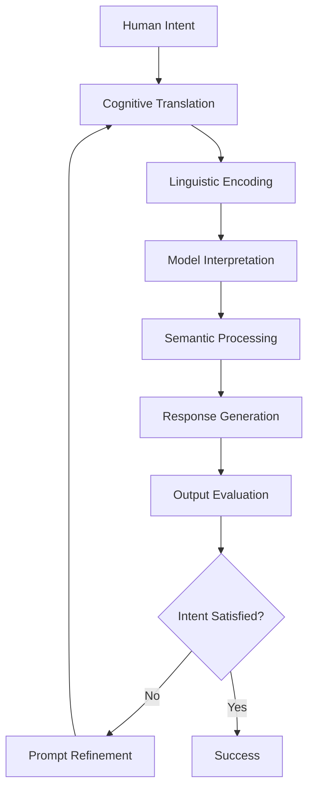

# Prompt Engineering Mastery

!!! abstract "The Art and Science of AI Communication"
    Master advanced prompting techniques, optimization strategies, and systematic approaches to get the best results from any language model.

## 📚 Module Overview

<div class="grid cards" markdown>

-   :material-message-text-outline: **Prompting Fundamentals**
    
    ---
    
    Basic principles, prompt anatomy, and core concepts
    
    [Learn basics →](fundamentals.md)

-   :material-brain-outline: **Advanced Techniques**
    
    ---
    
    Chain-of-thought, few-shot learning, and sophisticated patterns
    
    [Master techniques →](advanced-techniques.md)

-   :material-tune: **Optimization Strategies**
    
    ---
    
    Systematic prompt improvement and performance tuning
    
    [Optimize prompts →](optimization.md)

-   :material-cogs: **Prompt Patterns**
    
    ---
    
    Reusable templates and proven patterns for common tasks
    
    [Explore patterns →](patterns.md)

</div>

## 🎯 What You'll Master

- ✅ Fundamental principles of effective prompting
- ✅ Advanced techniques like chain-of-thought and tree-of-thought
- ✅ Systematic prompt optimization and testing
- ✅ Domain-specific prompting strategies
- ✅ Prompt injection prevention and safety
- ✅ Automated prompt engineering tools

## 🧠 Theoretical Foundations of Prompt Engineering

Prompt engineering is the systematic practice of designing and optimizing natural language instructions to guide AI language models toward producing desired outputs. Understanding the theoretical underpinnings is crucial for mastering this discipline.



### Cognitive Science Principles

**Mental Model Alignment**
Effective prompting requires understanding how language models process and interpret instructions. Unlike humans, AI models don't have consciousness or true understanding, but they pattern-match and generate responses based on statistical relationships learned during training.

**Information Processing Theory**
Language models process prompts through several cognitive-like stages:
- **Attention Allocation**: Models focus on different parts of the prompt based on learned attention patterns
- **Context Integration**: Information from various parts of the prompt is combined to form a coherent understanding
- **Memory Retrieval**: Relevant knowledge from training data is accessed and integrated
- **Response Formulation**: Output is generated based on the processed understanding

### Linguistic Theory in Prompting

**Pragmatics and Speech Acts**
Prompts function as speech acts—utterances that perform actions. Understanding the pragmatic aspects helps in crafting more effective instructions:

- **Directive Acts**: Commands and requests ("Summarize this text")
- **Commissive Acts**: Promising certain behavior ("I will provide three examples")
- **Declarative Acts**: Establishing context ("You are an expert economist")

**Semantic Clarity and Ambiguity**
Language models struggle with ambiguity more than humans do. Effective prompts minimize semantic ambiguity through:

- **Lexical Precision**: Using specific terminology rather than general terms
- **Syntactic Clarity**: Clear sentence structure and logical flow
- **Pragmatic Explicitness**: Making implicit assumptions explicit

### Anatomy of Effective Prompts

**Core Components Framework**

1. **Role Definition** (Persona Setting)
   - Establishes the AI's perspective and expertise level
   - Activates relevant knowledge domains from training
   - Examples: "You are a financial advisor...", "As a creative writer..."

2. **Context Establishment** (Situational Grounding)
   - Provides necessary background information
   - Sets boundaries and scope for the response
   - Reduces ambiguity about the task environment

3. **Task Specification** (Objective Clarity)
   - Clearly defines what needs to be accomplished
   - Specifies the type of cognitive process required
   - Distinguishes between analysis, synthesis, evaluation, etc.

4. **Format Constraints** (Output Structure)
   - Guides the organization and presentation of information
   - Helps ensure consistency across responses
   - Makes responses more usable for downstream applications

5. **Examples and Demonstrations** (Pattern Learning)
   - Provides concrete instances of desired behavior
   - Leverages the model's pattern recognition capabilities
   - Reduces the need for explicit rule specification

**Example Application:**
```text
Role: "You are a senior literature professor with expertise in 19th-century novels."

Context: "A graduate student is writing their thesis on social class themes in Victorian literature."

Task: "Analyze how Charles Dickens portrays class mobility in 'Great Expectations' and compare it to the historical reality of Victorian England."

Format: "Provide your analysis in three parts: 1) Literary analysis of class portrayal, 2) Historical context comparison, 3) Synthesis of differences and similarities."

Constraints: "Focus on specific textual examples and cite historical sources. Keep the analysis academic but accessible."
```

## 🚀 Advanced Theoretical Frameworks

### Cognitive Load Theory in Prompting

**Working Memory Limitations**
Language models, like human cognition, have processing limitations. Understanding these constraints is crucial for effective prompt design:

- **Intrinsic Load**: The inherent complexity of the task itself
- **Extraneous Load**: Unnecessary complexity introduced by poor prompt design
- **Germane Load**: Cognitive effort devoted to processing and understanding

**Optimizing Cognitive Load**
- Break complex tasks into smaller, manageable components
- Use clear, unambiguous language to reduce extraneous processing
- Provide scaffolding through examples and structured formats
- Sequence information logically to support mental model building

### Information Theory and Prompt Efficiency

**Signal-to-Noise Ratio**
Every element in a prompt either contributes to the desired outcome (signal) or potentially confuses the model (noise). Effective prompts maximize signal while minimizing noise.

**Information Density**
The amount of useful information per token affects prompt effectiveness:
- **High-density prompts**: Every word contributes meaningfully to the task
- **Low-density prompts**: Contain redundant or irrelevant information
- **Optimal density**: Balances completeness with conciseness

### Chain-of-Thought: Reasoning Theory

**Metacognitive Processing**
Chain-of-thought prompting mimics human metacognitive processes—thinking about thinking. This approach:

- **Externalizes reasoning steps**: Makes implicit thought processes explicit
- **Enables verification**: Allows checking of intermediate reasoning steps
- **Reduces errors**: Systematic thinking reduces logical fallacies
- **Improves transparency**: Makes AI decision-making more interpretable

**Theoretical Foundation**
Chain-of-thought works because it:
1. **Activates relevant knowledge schemas** through step-by-step reasoning
2. **Reduces cognitive shortcuts** that might lead to errors
3. **Provides intermediate checkpoints** for self-correction
4. **Mirrors human problem-solving strategies** learned during training

**Example Application:**
Instead of: "What's 25% of 240?"

Use: "Calculate 25% of 240. Let me work through this step by step:
- First, I need to understand what 25% means: 25/100 or 1/4
- So I need to find 1/4 of 240
- 240 ÷ 4 = 60
- Therefore, 25% of 240 = 60"

### Few-Shot Learning Theory

**Pattern Recognition Principles**
Few-shot learning leverages the model's pattern recognition capabilities. The theoretical basis includes:

**Analogical Reasoning**
- Models identify structural similarities between examples and new instances
- Abstract patterns are extracted from concrete examples
- Successful transfer depends on relevant feature matching

**Schema Activation**
- Examples activate relevant knowledge schemas in the model
- Multiple examples help disambiguate the intended pattern
- Diverse examples improve generalization capability

**Example Selection Strategies**
1. **Diversity**: Examples should cover different aspects of the task
2. **Relevance**: Examples should be similar to the target task
3. **Clarity**: Examples should be unambiguous and well-structured
4. **Progression**: Examples can progress from simple to complex

### Tree-of-Thought: Decision Theory

**Systematic Exploration**
Tree-of-thought approaches model complex reasoning as a search through a space of possible thoughts and solutions:

**Breadth vs. Depth Trade-offs**
- **Breadth-first**: Explore many initial approaches before diving deep
- **Depth-first**: Fully develop promising approaches before exploring alternatives
- **Best-first**: Combine evaluation with exploration for efficiency

**Evaluation and Pruning**
- Each thought or approach is evaluated for promise
- Less promising paths are pruned to focus computational resources
- Multiple evaluation criteria can be applied (feasibility, creativity, efficiency)

**Theoretical Advantages**
1. **Systematic exploration**: Ensures important alternatives aren't missed
2. **Explicit evaluation**: Makes decision criteria transparent
3. **Iterative refinement**: Allows for course correction during reasoning
4. **Parallel processing**: Multiple approaches can be explored simultaneously

## 🎯 Optimization Theory and Systematic Improvement

### Measurement Theory in Prompt Engineering

**Defining Success Metrics**
Effective prompt optimization requires clear, measurable definitions of success. This involves understanding different types of validity:

**Content Validity**
- Does the response address all aspects of the request?
- Are the key concepts covered appropriately?
- Is the depth of treatment suitable for the intended purpose?

**Construct Validity**
- Does the response demonstrate the intended cognitive process?
- Are the reasoning patterns appropriate for the task type?
- Does the output reflect genuine understanding or just pattern matching?

**Criterion Validity**
- How well does the response predict or correlate with desired outcomes?
- Does the response quality translate to real-world effectiveness?
- Are the results consistent with expert judgment?

**Reliability and Consistency**
- Does the same prompt produce similar quality responses across multiple runs?
- How stable are the results under minor prompt variations?
- What factors contribute to response variability?

### Experimental Design for Prompt Testing

**Controlled Variables**
When testing prompt variations, it's crucial to isolate variables:

- **Content variables**: What information is included or excluded
- **Structural variables**: How information is organized and presented
- **Linguistic variables**: Word choice, sentence structure, formality level
- **Context variables**: Background information, role definitions, constraints

**A/B Testing Framework**
Systematic comparison requires careful experimental design:

1. **Hypothesis Formation**: Clear predictions about which approaches will work better
2. **Sample Size Calculation**: Ensuring sufficient data for statistical significance
3. **Randomization**: Controlling for order effects and other confounds
4. **Blind Evaluation**: Preventing bias in assessment of results

**Factorial Design Approaches**
Testing multiple variables simultaneously:
- **Full factorial**: Test all combinations of variables
- **Fractional factorial**: Test subset of combinations for efficiency
- **Latin square**: Control for order effects in repeated measures

### Statistical Analysis of Prompt Performance

**Descriptive Statistics**
Understanding the distribution of performance metrics:
- **Central tendency**: Mean, median, mode of quality scores
- **Variability**: Standard deviation, range, interquartile range
- **Distribution shape**: Skewness, kurtosis, modality

**Inferential Statistics**
Drawing conclusions about prompt effectiveness:
- **T-tests**: Comparing two prompt variants
- **ANOVA**: Comparing multiple prompt variants
- **Regression analysis**: Understanding relationships between prompt features and outcomes
- **Effect size**: Practical significance beyond statistical significance

### Learning Theory and Adaptation

**Feedback Loops**
Prompt engineering benefits from systematic feedback and adaptation:

**Immediate Feedback**
- Direct assessment of individual responses
- Real-time adjustment based on output quality
- User satisfaction and task completion rates

**Aggregate Feedback**
- Pattern recognition across multiple interactions
- Identification of systematic strengths and weaknesses
- Long-term trend analysis

**Meta-Learning**
- Learning how to learn better prompting strategies
- Developing intuition about what works in different contexts
- Building mental models of model behavior

### Psychological Principles in Prompt Design

**Cognitive Biases and Mitigation**
Understanding how human cognitive biases can affect prompt design:

**Confirmation Bias**
- Tendency to design prompts that confirm existing beliefs
- Mitigation: Actively seek disconfirming evidence and alternative approaches

**Anchoring Bias**
- Over-reliance on first information encountered
- Mitigation: Test multiple initial approaches before settling on a direction

**Availability Heuristic**
- Overweighting easily recalled examples
- Mitigation: Systematic collection and analysis of diverse examples

**Dunning-Kruger Effect**
- Overconfidence in early stages of learning
- Mitigation: Seek expert feedback and objective evaluation metrics

### Communication Theory Applications

**Shannon-Weaver Model**
Understanding communication breakdown points:
- **Information source**: Human intent and knowledge
- **Transmitter**: Prompt design and encoding
- **Channel**: The language model processing
- **Receiver**: Model interpretation and understanding
- **Destination**: Generated output and human comprehension

**Noise Identification and Reduction**
- **Semantic noise**: Ambiguous or unclear language
- **Syntactic noise**: Poor grammar or structure
- **Pragmatic noise**: Unclear context or purpose
- **Technical noise**: Model limitations or constraints

### Advanced Optimization Strategies

**Multi-Objective Optimization**
Balancing competing goals:
- **Quality vs. Speed**: Higher quality often requires more complex prompts
- **Accuracy vs. Creativity**: Precision may constrain innovative responses
- **Specificity vs. Generalizability**: Detailed prompts may not transfer well
- **Safety vs. Capability**: Conservative prompts may limit functionality

**Pareto Efficiency**
Understanding trade-offs where improving one metric necessarily degrades another.

**Adaptive Algorithms**
Systematic approaches to prompt improvement:
- **Gradient-based optimization**: Small incremental changes in promising directions
- **Genetic algorithms**: Combining successful prompt elements
- **Simulated annealing**: Accepting occasionally worse solutions to escape local optima
- **Bayesian optimization**: Using probabilistic models to guide search

### Theoretical Limitations and Boundaries

**Fundamental Constraints**
Understanding the theoretical limits of prompt engineering:

**Model Architecture Constraints**
- Context window limitations
- Attention mechanism biases
- Training data boundaries
- Inherent model capabilities

**Language Limitations**
- Expressiveness of natural language
- Cultural and linguistic biases
- Precision vs. naturalness trade-offs
- Ambiguity resolution challenges

**Cognitive Modeling Limitations**
- Differences between human and artificial reasoning
- Lack of true understanding vs. pattern matching
- Inconsistency in model behavior
- Difficulty in goal alignment

## 🛡️ Ethics and Safety in Prompt Engineering

### Philosophical Foundations

**Consequentialist Ethics**
Evaluating prompt engineering practices based on their outcomes:
- **Utility maximization**: Do the prompts lead to broadly beneficial results?
- **Harm minimization**: Are potential negative consequences adequately considered?
- **Stakeholder analysis**: Who benefits and who might be harmed by specific prompt designs?

**Deontological Ethics**
Considering the inherent rightness or wrongness of prompt engineering practices:
- **Respect for persons**: Do prompts treat humans as ends in themselves, not merely as means?
- **Autonomy preservation**: Do prompts enhance or diminish human agency and decision-making?
- **Truthfulness**: Are prompts designed to elicit honest and accurate responses?

**Virtue Ethics**
Focusing on the character and intentions of prompt engineers:
- **Integrity**: Designing prompts that align with stated purposes and values
- **Responsibility**: Taking accountability for the effects of prompt design choices
- **Wisdom**: Exercising good judgment in balancing competing ethical considerations

### Security Theory Applications

**Threat Modeling for Prompts**
Systematic identification of potential risks:

**Attack Vectors**
- **Injection attacks**: Attempts to override intended behavior through crafted inputs
- **Context pollution**: Introducing misleading or harmful information into the prompt context
- **Jailbreaking**: Circumventing safety measures and usage policies
- **Social engineering**: Manipulating prompts to extract sensitive information

**Vulnerability Assessment**
- **Input validation weaknesses**: Points where malicious content could enter
- **Context switching vulnerabilities**: Ambiguous boundaries between different instruction sets
- **Privilege escalation**: Paths to gain unintended capabilities or access
- **Information leakage**: Ways that confidential information might be exposed

**Defense Strategies**
- **Layered security**: Multiple overlapping protective measures
- **Principle of least privilege**: Limiting capabilities to the minimum necessary
- **Input sanitization**: Cleaning and validating user inputs
- **Output filtering**: Screening responses for potentially harmful content

### Game Theory and Adversarial Interactions

**Strategic Behavior Analysis**
Understanding how users might attempt to manipulate AI systems:

**Zero-Sum vs. Cooperative Games**
- **Adversarial scenarios**: Where user goals conflict with system safety
- **Cooperative scenarios**: Where user and system goals align
- **Mixed-motive situations**: Where some goals align and others conflict

**Nash Equilibrium in Prompt Design**
- **Stable configurations**: Prompt designs that remain effective even when users know the strategy
- **Evolutionary stability**: Approaches that remain viable as attack methods evolve
- **Mechanism design**: Creating systems where honest participation is incentivized

### Information Security Principles

**Confidentiality**
Protecting sensitive information from unauthorized disclosure:
- **Need-to-know basis**: Only providing information necessary for the task
- **Context isolation**: Preventing information leakage between different conversations
- **Anonymization**: Removing or obscuring personally identifiable information

**Integrity**
Ensuring information accuracy and preventing unauthorized modification:
- **Source verification**: Checking the credibility of information sources
- **Consistency checking**: Identifying contradictions or anomalies in responses
- **Version control**: Tracking changes to prompt templates and their effects

**Availability**
Maintaining system functionality and preventing disruption:
- **Resilience to attacks**: Designing prompts that remain functional under stress
- **Graceful degradation**: Maintaining partial functionality when systems are compromised
- **Recovery procedures**: Methods for restoring normal operation after incidents

### Bias and Fairness Theory

**Types of Bias in AI Systems**
Understanding different forms of unfairness:

**Statistical Bias**
- **Sampling bias**: Unrepresentative training data affecting model behavior
- **Measurement bias**: Systematic errors in how outcomes are assessed
- **Aggregation bias**: Incorrect assumptions about homogeneity across groups

**Cognitive Bias**
- **Confirmation bias**: Seeking information that confirms preexisting beliefs
- **Anchoring bias**: Over-relying on first pieces of information encountered
- **Availability heuristic**: Overweighting easily recalled examples

**Social Bias**
- **Stereotype bias**: Unfair generalizations about social groups
- **Historical bias**: Perpetuating past inequities through AI systems
- **Representation bias**: Unequal treatment of different demographic groups

**Fairness Definitions**
- **Individual fairness**: Similar individuals should receive similar treatment
- **Group fairness**: Different demographic groups should have similar outcomes
- **Counterfactual fairness**: Decisions should be the same in a world without sensitive attributes
- **Equality of opportunity**: All groups should have equal chances of positive outcomes

### Risk Assessment and Management

**Risk Identification**
Systematic identification of potential harms:
- **Direct harms**: Immediate negative consequences of AI responses
- **Indirect harms**: Secondary effects that emerge over time
- **Systemic risks**: Broader societal impacts of widespread AI adoption
- **Existential risks**: Potential threats to human civilization or wellbeing

**Probability and Impact Analysis**
- **Likelihood assessment**: Estimating the probability of different risk scenarios
- **Severity evaluation**: Assessing the magnitude of potential consequences
- **Risk matrices**: Combining probability and impact to prioritize concerns
- **Uncertainty quantification**: Acknowledging and managing unknown unknowns

**Mitigation Strategies**
- **Prevention**: Designing systems to avoid risks altogether
- **Detection**: Identifying problems when they occur
- **Response**: Taking action to minimize harm when risks materialize
- **Recovery**: Restoring normal operations and learning from incidents

### Transparency and Explainability

**Levels of Transparency**
Different depths of system explanation:
- **Process transparency**: Understanding how the system works internally
- **Outcome transparency**: Understanding why specific decisions were made
- **Algorithmic transparency**: Access to the underlying algorithms and parameters
- **Data transparency**: Understanding what information influenced decisions

**Explainability Techniques**
- **Feature importance**: Identifying which inputs most influenced outputs
- **Counterfactual explanations**: Showing how different inputs would change results
- **Example-based explanations**: Providing similar cases for comparison
- **Natural language explanations**: Generating human-readable justifications

### Governance and Accountability

**Responsibility Assignment**
Determining who is accountable for AI system behavior:
- **Developer responsibility**: Obligations of those who create AI systems
- **User responsibility**: Duties of those who deploy and operate systems
- **Societal responsibility**: Collective obligations to manage AI impacts
- **Regulatory responsibility**: Government roles in oversight and enforcement

**Oversight Mechanisms**
- **Internal governance**: Organizational structures for responsible AI development
- **External auditing**: Independent assessment of AI systems and practices
- **Regulatory compliance**: Adherence to legal requirements and standards
- **Community standards**: Following professional and ethical guidelines

**Accountability Frameworks**
- **Retrospective accountability**: Taking responsibility for past actions and outcomes
- **Prospective accountability**: Planning and preparing for future responsibilities
- **Shared accountability**: Distributing responsibility across multiple stakeholders
- **Adaptive accountability**: Adjusting responsibility assignments as understanding evolves

## 📊 Performance Theory and Evaluation Frameworks

### Measurement Theory in AI Systems

**Construct Definition**
Before measuring prompt effectiveness, we must clearly define what we're measuring:

**Quality Constructs**
- **Relevance**: How well the response addresses the specific question or task
- **Accuracy**: Correctness of factual information and logical reasoning
- **Completeness**: Coverage of all necessary aspects of the topic
- **Coherence**: Logical consistency and flow of ideas
- **Appropriateness**: Suitability for the intended audience and context

**Behavioral Constructs**
- **Consistency**: Reliability of responses across similar inputs
- **Robustness**: Stability under variations in prompt formulation
- **Generalizability**: Performance across different domains and contexts
- **Efficiency**: Resource utilization relative to output quality

### Psychometric Principles

**Reliability Theory**
Understanding consistency in measurement:

**Internal Consistency**
- Do different parts of the response align with each other?
- Are there contradictions or inconsistencies within a single output?
- How well do multiple evaluators agree on quality assessments?

**Test-Retest Reliability**
- Does the same prompt produce similar results when run multiple times?
- How much variation is acceptable for a given task type?
- What factors contribute to response variability?

**Inter-Rater Reliability**
- Do different human evaluators rate the same responses similarly?
- What training or guidelines improve evaluator agreement?
- How can subjective assessments be made more objective?

**Validity Theory**
Ensuring measurements capture what they claim to measure:

**Content Validity**
- Do evaluation criteria cover all important aspects of the task?
- Are there important dimensions that are being overlooked?
- How do expert judgments align with automated metrics?

**Criterion Validity**
- How well do prompt performance metrics predict real-world outcomes?
- Do high-scoring responses actually achieve their intended purposes?
- What is the relationship between different quality measures?

**Construct Validity**
- Do the metrics actually measure the intended cognitive processes?
- Are there confounding factors that influence the measurements?
- How do different measurement approaches compare?

### Information Theory Applications

**Entropy and Information Content**
Understanding the information properties of prompts and responses:

**Prompt Entropy**
- How much uncertainty exists in possible interpretations of the prompt?
- What is the optimal level of specificity vs. openness?
- How does prompt structure affect information transmission?

**Response Entropy**
- How much novel information is contained in the response?
- What is the relationship between response length and information density?
- How can we measure semantic richness vs. redundancy?

**Mutual Information**
- How much information does the response share with the prompt?
- What aspects of the prompt most strongly influence the response?
- How can we optimize information transfer from prompt to output?

### Statistical Learning Theory

**Generalization Bounds**
Understanding how prompt performance generalizes:

**Sample Complexity**
- How many examples are needed to reliably assess prompt quality?
- What factors affect the stability of performance estimates?
- How does task complexity relate to evaluation requirements?

**Bias-Variance Tradeoff**
- How do different prompt strategies balance consistency vs. adaptability?
- What is the relationship between prompt specificity and generalization?
- How can we optimize for both reliability and flexibility?

**Overfitting in Prompt Design**
- When do prompts become too specialized for their training examples?
- How can we detect and prevent overfitting in prompt optimization?
- What techniques promote robust generalization?

### Causal Inference in Prompt Effects

**Causality vs. Correlation**
Understanding what actually causes improved performance:

**Confounding Variables**
- What factors beyond the prompt itself affect response quality?
- How do model capabilities interact with prompt design?
- What role do external factors (time, context, user) play?

**Experimental Design**
- How can we isolate the effects of specific prompt elements?
- What controls are necessary for valid causal inference?
- How do we account for interaction effects between prompt components?

**Mediation Analysis**
- What are the intermediate steps between prompt and performance?
- How do different prompt elements work together to influence outcomes?
- What mechanisms explain why certain prompts are more effective?

### Utility Theory and Decision Making

**Multi-Criteria Decision Analysis**
Balancing different performance objectives:

**Objective Weighting**
- How should different quality dimensions be prioritized?
- What is the relative importance of accuracy vs. creativity?
- How do stakeholder preferences affect evaluation criteria?

**Pareto Optimality**
- When are improvements in one dimension necessarily traded off against others?
- How can we identify and navigate fundamental trade-offs?
- What constitutes a truly optimal prompt design?

**Decision Under Uncertainty**
- How should we evaluate prompts when outcomes are uncertain?
- What role should risk tolerance play in prompt selection?
- How can we account for unknown future use cases?

### Network Theory and System Effects

**Emergent Properties**
Understanding how prompt engineering fits into larger systems:

**System-Level Performance**
- How do individual prompt improvements affect overall system behavior?
- What are the network effects of widespread prompt optimization?
- How do different prompts interact when used together?

**Scaling Laws**
- How does prompt effectiveness change with model size and capability?
- What patterns emerge as prompt complexity increases?
- How do performance relationships scale across different domains?

**Feedback Loops**
- How do user behaviors change in response to improved prompts?
- What are the long-term effects of prompt optimization strategies?
- How do systems adapt and co-evolve with their users?

### Philosophical Foundations of Evaluation

**Epistemological Considerations**
Understanding the nature of knowledge in AI evaluation:

**Objectivity vs. Subjectivity**
- Which aspects of prompt performance can be objectively measured?
- How do cultural and personal biases affect evaluation?
- What is the role of human judgment in AI assessment?

**Truth and Knowledge**
- What does it mean for an AI response to be "correct"?
- How do we handle cases where truth is contested or contextual?
- What is the relationship between accuracy and usefulness?

**Value Alignment**
- Whose values should guide evaluation criteria?
- How do we handle conflicts between different stakeholder interests?
- What is the role of democratic input in AI assessment standards?

## 🎯 Domain-Specific Prompting Theory

### Cognitive Specialization Principles

Different domains require different cognitive approaches, and effective prompting must align with the mental models and reasoning patterns specific to each field.

**Domain Knowledge Architecture**
Each domain has its own:
- **Conceptual frameworks**: Core theories and models that organize thinking
- **Methodological approaches**: Standard procedures and analytical methods
- **Evaluation criteria**: Domain-specific standards for quality and correctness
- **Communication conventions**: Specialized vocabulary and presentation formats

**Cognitive Load Distribution**
Domain experts distribute cognitive effort differently:
- **Automatic processing**: Well-practiced domain skills require minimal conscious effort
- **Controlled processing**: Novel or complex problems require deliberate reasoning
- **Expert intuition**: Pattern recognition based on extensive domain experience
- **Strategic thinking**: High-level planning and goal management

### Technical Domain Characteristics

**Code Generation Domain**
- **Logical precision**: Requirements for exact specification and unambiguous instructions
- **Hierarchical thinking**: Breaking complex problems into modular components
- **Error handling**: Anticipating and managing failure modes
- **Optimization mindset**: Balancing multiple constraints (speed, memory, readability)

**Theoretical Foundation for Code Prompts:**
```text
Effective code generation prompts should:
- Specify the computational model (algorithmic vs. declarative)
- Define input/output contracts clearly
- Indicate performance requirements and constraints
- Specify coding conventions and style preferences
- Include error handling and edge case considerations
```

**Data Analysis Domain**
- **Statistical reasoning**: Understanding uncertainty, correlation, and causation
- **Visual thinking**: Translating numerical relationships into interpretable forms
- **Hypothesis testing**: Systematic approach to investigating questions
- **Business context**: Connecting analytical insights to practical decisions

**Theoretical Foundation for Analysis Prompts:**
```text
Effective data analysis prompts should:
- Specify the analytical framework (descriptive, predictive, prescriptive)
- Define the decision context and stakeholder needs
- Indicate uncertainty tolerance and confidence requirements
- Specify visualization and communication preferences
- Include data quality and limitation considerations
```

### Creative Domain Characteristics

**Content Creation Domain**
- **Audience modeling**: Understanding reader perspectives, knowledge, and motivations
- **Narrative structure**: Organizing information for maximum comprehension and engagement
- **Persuasive strategy**: Aligning content with communication objectives
- **Brand alignment**: Maintaining consistency with organizational voice and values

**Theoretical Foundation for Creative Prompts:**
```text
Effective content creation prompts should:
- Define the rhetorical situation (audience, purpose, context)
- Specify the genre conventions and format requirements
- Indicate the desired cognitive and emotional impact
- Include brand guidelines and tone specifications
- Address accessibility and inclusion considerations
```

### Service Domain Characteristics

**Customer Service Domain**
- **Emotional intelligence**: Recognizing and responding to customer emotional states
- **Problem-solving methodology**: Systematic approach to issue diagnosis and resolution
- **Policy navigation**: Balancing customer needs with organizational constraints
- **Relationship management**: Building trust and maintaining long-term customer satisfaction

**Theoretical Foundation for Service Prompts:**
```text
Effective customer service prompts should:
- Include emotional context and empathy requirements
- Specify escalation procedures and authority limits
- Define success metrics (resolution, satisfaction, efficiency)
- Include brand voice and value alignment
- Address cultural sensitivity and accessibility needs
```

### Cross-Domain Pattern Recognition

**Universal Prompt Elements**
Despite domain differences, effective prompts across all domains typically include:

1. **Context establishment**: Setting the situational and cognitive frame
2. **Goal specification**: Clearly defining the desired outcome
3. **Constraint definition**: Identifying limitations and requirements
4. **Success criteria**: Establishing how to evaluate results
5. **Process guidance**: Providing methodological framework when needed

**Adaptation Strategies**
- **Vocabulary alignment**: Using domain-appropriate terminology and concepts
- **Cognitive matching**: Aligning prompt structure with domain thinking patterns
- **Output formatting**: Conforming to domain communication conventions
- **Quality standards**: Applying domain-specific evaluation criteria

### Meta-Prompting for Domain Adaptation

**Self-Reflective Prompting**
Teaching AI systems to adapt their approach based on domain characteristics:

```text
"Before responding to this [domain] question, consider:
1. What are the key principles and frameworks in this domain?
2. What type of reasoning is most appropriate here?
3. What format and style will be most effective for this audience?
4. What potential errors or limitations should I acknowledge?
5. How can I demonstrate domain-appropriate expertise?"
```

**Domain Transfer Learning**
Applying successful patterns from one domain to others:
- **Analogical reasoning**: Finding structural similarities between domains
- **Pattern abstraction**: Identifying general principles that transcend specific contexts
- **Adaptive application**: Modifying proven approaches for new situations
```

## 📚 Next Steps

Ready to advance further? Continue with:

1. **[RAG Systems](../rag/index.md)** - Combine prompting with retrieval
2. **[AI Agents](../agents/index.md)** - Build autonomous AI systems
3. **[Advanced Topics](../advanced/index.md)** - Explore cutting-edge techniques
4. **[Projects](../projects/index.md)** - Apply prompt engineering in real projects

---

!!! success "Prompt Engineering Mastery"
    You now have the tools and techniques to craft highly effective prompts for any AI model. The key is practice and systematic optimization!
