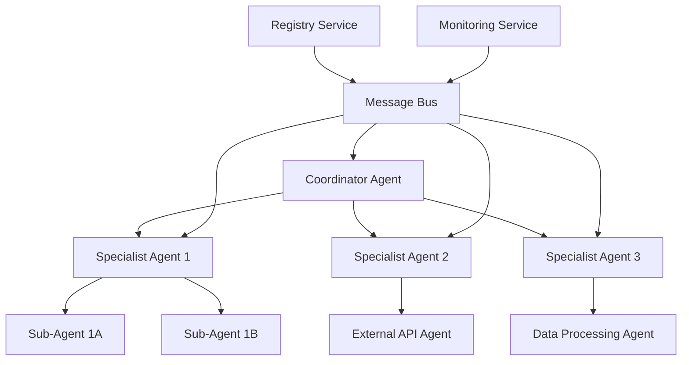

# A2A Protocol - Agent-to-Agent Communication

!!! abstract "Autonomous Agent Collaboration"
    A2A (Agent-to-Agent) protocol enables seamless communication and coordination between autonomous AI agents, facilitating collaborative problem-solving and distributed AI workflows.

## 🎯 Overview

The A2A protocol provides a standardized framework for AI agents to communicate, collaborate, and coordinate their activities. This protocol enables the creation of multi-agent systems where individual agents can work together to solve complex problems that require distributed intelligence and specialized capabilities.

### Core Principles

**Autonomy**: Each agent maintains its own decision-making capabilities while participating in collaborative workflows

**Interoperability**: Agents from different vendors and platforms can communicate effectively

**Scalability**: Protocol supports dynamic addition/removal of agents in the network

**Security**: Encrypted communication with authentication and authorization mechanisms

**Transparency**: Clear audit trails and explainable agent interactions

## 🏗️ Protocol Architecture

### Network Topology



### Communication Layers

#### 1. Transport Layer
- **Message Routing**: Efficient message delivery between agents
- **Load Balancing**: Distribute requests across available agents
- **Fault Tolerance**: Automatic failover and retry mechanisms
- **Quality of Service**: Priority-based message handling

#### 2. Protocol Layer
- **Message Format**: Standardized JSON-based message structure
- **Request/Response**: Synchronous and asynchronous communication patterns
- **Event Streaming**: Real-time event propagation
- **Session Management**: Persistent connections and state tracking

#### 3. Application Layer
- **Task Orchestration**: Complex workflow coordination
- **Capability Discovery**: Dynamic agent capability advertisements
- **Resource Sharing**: Shared memory and computational resources
- **Conflict Resolution**: Handling competing agent objectives

## 📋 Message Specifications

### Base Message Format

```json
{
  "version": "2.0",
  "message_id": "msg_12345",
  "correlation_id": "corr_67890",
  "timestamp": "2025-01-27T10:30:00Z",
  "source": {
    "agent_id": "agent_001",
    "agent_type": "coordinator",
    "instance_id": "inst_abc123"
  },
  "destination": {
    "agent_id": "agent_002",
    "agent_type": "specialist",
    "routing": "direct"
  },
  "message_type": "task_request",
  "priority": "high",
  "ttl": 3600,
  "security": {
    "encrypted": true,
    "signature": "sig_xyz789",
    "auth_token": "token_456def"
  },
  "payload": {
    "task": "analyze_data",
    "parameters": {
      "dataset": "sales_q4_2024",
      "analysis_type": "trend_analysis",
      "output_format": "json"
    },
    "context": {
      "workflow_id": "wf_analytics_001",
      "session_id": "sess_789ghi"
    }
  }
}
```

### Message Types

#### Task Request
```json
{
  "message_type": "task_request",
  "payload": {
    "task_id": "task_001",
    "task_type": "data_analysis",
    "description": "Analyze customer behavior patterns",
    "requirements": {
      "capabilities": ["data_processing", "machine_learning"],
      "resources": {
        "memory": "4GB",
        "cpu": "2 cores",
        "storage": "10GB"
      },
      "deadline": "2025-01-27T15:00:00Z"
    },
    "input_data": {
      "type": "dataset",
      "location": "s3://bucket/customer_data.csv",
      "schema": "customer_schema.json"
    },
    "expected_output": {
      "format": "json",
      "schema": "analysis_result_schema.json"
    }
  }
}
```

#### Task Response
```json
{
  "message_type": "task_response",
  "payload": {
    "task_id": "task_001",
    "status": "accepted|rejected|completed",
    "result": {
      "success": true,
      "data": {
        "insights": [
          {
            "pattern": "seasonal_buying",
            "confidence": 0.87,
            "description": "Customers show 40% increase in purchases during holidays"
          }
        ],
        "metrics": {
          "processing_time": 45.2,
          "accuracy": 0.94,
          "data_points_analyzed": 150000
        }
      },
      "metadata": {
        "model_used": "customer_behavior_v2.1",
        "features_analyzed": 23,
        "processing_node": "agent_002"
      }
    },
    "error": null
  }
}
```

#### Capability Advertisement
```json
{
  "message_type": "capability_advertisement",
  "payload": {
    "capabilities": [
      {
        "name": "natural_language_processing",
        "version": "1.2.0",
        "description": "Advanced NLP with multilingual support",
        "supported_languages": ["en", "es", "fr", "de"],
        "max_input_size": "100MB",
        "average_processing_time": "2.5s"
      },
      {
        "name": "image_analysis",
        "version": "2.0.1",
        "description": "Computer vision and image understanding",
        "supported_formats": ["jpg", "png", "webp"],
        "max_resolution": "4K",
        "analysis_types": ["object_detection", "scene_understanding"]
      }
    ],
    "resources": {
      "available_memory": "8GB",
      "cpu_cores": 4,
      "gpu_available": true,
      "current_load": 0.65
    },
    "availability": {
      "status": "available",
      "queue_length": 3,
      "estimated_wait_time": "30s"
    }
  }
}
```

#### Event Notification
```json
{
  "message_type": "event_notification",
  "payload": {
    "event_type": "workflow_status_change",
    "event_id": "evt_001",
    "source_workflow": "wf_analytics_001",
    "timestamp": "2025-01-27T10:35:00Z",
    "data": {
      "previous_status": "in_progress",
      "current_status": "completed",
      "progress": 1.0,
      "result_location": "s3://results/analytics_001_final.json"
    },
    "affected_agents": ["agent_001", "agent_003", "agent_005"]
  }
}
```

## 🔧 Implementation Examples

### Agent Communication Framework

```python
import asyncio
import json
from typing import Dict, List, Optional, Callable
from dataclasses import dataclass
from enum import Enum

class MessageType(Enum):
    TASK_REQUEST = "task_request"
    TASK_RESPONSE = "task_response"
    CAPABILITY_ADVERTISEMENT = "capability_advertisement"
    EVENT_NOTIFICATION = "event_notification"
    HEARTBEAT = "heartbeat"

@dataclass
class A2AMessage:
    version: str = "2.0"
    message_id: str = ""
    correlation_id: str = ""
    timestamp: str = ""
    source: Dict = None
    destination: Dict = None
    message_type: MessageType = None
    priority: str = "normal"
    ttl: int = 3600
    security: Dict = None
    payload: Dict = None

class A2AAgent:
    def __init__(self, agent_id: str, agent_type: str):
        self.agent_id = agent_id
        self.agent_type = agent_type
        self.capabilities = {}
        self.message_handlers = {}
        self.transport = A2ATransport()
        self.registry = AgentRegistry()
        
    async def start(self):
        """Start the agent and register with the network"""
        await self.registry.register(self.agent_id, self.agent_type, self.capabilities)
        await self.transport.connect(self.agent_id)
        await self._advertise_capabilities()
        
        # Start message processing loop
        asyncio.create_task(self._message_processing_loop())
    
    async def send_message(self, message: A2AMessage) -> Optional[A2AMessage]:
        """Send a message to another agent"""
        # Add source information
        message.source = {
            "agent_id": self.agent_id,
            "agent_type": self.agent_type,
            "instance_id": self._get_instance_id()
        }
        
        # Add security if required
        if message.security and message.security.get("encrypted"):
            message = await self._encrypt_message(message)
        
        # Send via transport layer
        response = await self.transport.send(message)
        return response
    
    async def request_task(self, target_agent: str, task_data: Dict) -> A2AMessage:
        """Request another agent to perform a task"""
        message = A2AMessage(
            message_type=MessageType.TASK_REQUEST,
            destination={"agent_id": target_agent},
            payload=task_data
        )
        
        response = await self.send_message(message)
        return response
    
    async def broadcast_capability(self, capability_data: Dict):
        """Broadcast capabilities to the network"""
        message = A2AMessage(
            message_type=MessageType.CAPABILITY_ADVERTISEMENT,
            destination={"routing": "broadcast"},
            payload=capability_data
        )
        
        await self.send_message(message)
    
    def register_handler(self, message_type: MessageType, handler: Callable):
        """Register a message handler for a specific message type"""
        self.message_handlers[message_type] = handler
    
    async def _message_processing_loop(self):
        """Main message processing loop"""
        while True:
            try:
                message = await self.transport.receive()
                await self._handle_message(message)
            except Exception as e:
                await self._handle_error(e)
    
    async def _handle_message(self, message: A2AMessage):
        """Handle incoming messages"""
        # Decrypt if necessary
        if message.security and message.security.get("encrypted"):
            message = await self._decrypt_message(message)
        
        # Find appropriate handler
        handler = self.message_handlers.get(message.message_type)
        if handler:
            await handler(message)
        else:
            await self._default_message_handler(message)
    
    async def _advertise_capabilities(self):
        """Advertise agent capabilities"""
        capability_data = {
            "capabilities": list(self.capabilities.values()),
            "resources": await self._get_resource_status(),
            "availability": await self._get_availability_status()
        }
        
        await self.broadcast_capability(capability_data)
```

### Multi-Agent Workflow Orchestration

```python
class WorkflowOrchestrator(A2AAgent):
    def __init__(self):
        super().__init__("orchestrator_001", "coordinator")
        self.active_workflows = {}
        self.agent_directory = {}
        
        # Register message handlers
        self.register_handler(MessageType.TASK_RESPONSE, self._handle_task_response)
        self.register_handler(MessageType.CAPABILITY_ADVERTISEMENT, self._handle_capability_ad)
    
    async def execute_workflow(self, workflow_definition: Dict) -> Dict:
        """Execute a complex multi-agent workflow"""
        workflow_id = workflow_definition["workflow_id"]
        self.active_workflows[workflow_id] = WorkflowState(workflow_definition)
        
        try:
            # Parse workflow steps
            steps = workflow_definition["steps"]
            results = {}
            
            for step in steps:
                if step["type"] == "parallel":
                    # Execute parallel tasks
                    parallel_results = await self._execute_parallel_tasks(step["tasks"])
                    results.update(parallel_results)
                elif step["type"] == "sequential":
                    # Execute sequential tasks
                    for task in step["tasks"]:
                        result = await self._execute_single_task(task, results)
                        results[task["task_id"]] = result
                elif step["type"] == "conditional":
                    # Execute conditional tasks
                    if self._evaluate_condition(step["condition"], results):
                        for task in step["if_tasks"]:
                            result = await self._execute_single_task(task, results)
                            results[task["task_id"]] = result
                    else:
                        for task in step["else_tasks"]:
                            result = await self._execute_single_task(task, results)
                            results[task["task_id"]] = result
            
            # Mark workflow as completed
            self.active_workflows[workflow_id].status = "completed"
            await self._notify_workflow_completion(workflow_id, results)
            
            return results
            
        except Exception as e:
            self.active_workflows[workflow_id].status = "failed"
            self.active_workflows[workflow_id].error = str(e)
            await self._notify_workflow_failure(workflow_id, e)
            raise
    
    async def _execute_parallel_tasks(self, tasks: List[Dict]) -> Dict:
        """Execute multiple tasks in parallel"""
        # Find suitable agents for each task
        task_agent_mappings = {}
        for task in tasks:
            suitable_agents = await self._find_suitable_agents(task["requirements"])
            if not suitable_agents:
                raise Exception(f"No suitable agents found for task {task['task_id']}")
            task_agent_mappings[task["task_id"]] = suitable_agents[0]  # Use best match
        
        # Send all task requests
        pending_tasks = []
        for task in tasks:
            agent_id = task_agent_mappings[task["task_id"]]
            task_request = await self.request_task(agent_id, task)
            pending_tasks.append((task["task_id"], task_request))
        
        # Wait for all responses
        results = {}
        for task_id, task_request in pending_tasks:
            response = await self._wait_for_task_completion(task_request.message_id)
            results[task_id] = response.payload["result"]
        
        return results
    
    async def _find_suitable_agents(self, requirements: Dict) -> List[str]:
        """Find agents that meet the task requirements"""
        suitable_agents = []
        
        for agent_id, agent_info in self.agent_directory.items():
            if self._agent_meets_requirements(agent_info, requirements):
                suitable_agents.append(agent_id)
        
        # Sort by suitability score
        suitable_agents.sort(
            key=lambda x: self._calculate_suitability_score(
                self.agent_directory[x], requirements
            ),
            reverse=True
        )
        
        return suitable_agents
    
    def _agent_meets_requirements(self, agent_info: Dict, requirements: Dict) -> bool:
        """Check if an agent meets the task requirements"""
        # Check capabilities
        required_capabilities = requirements.get("capabilities", [])
        agent_capabilities = [cap["name"] for cap in agent_info.get("capabilities", [])]
        
        if not all(cap in agent_capabilities for cap in required_capabilities):
            return False
        
        # Check resources
        required_resources = requirements.get("resources", {})
        available_resources = agent_info.get("resources", {})
        
        if required_resources.get("memory"):
            if self._parse_memory(available_resources.get("available_memory", "0")) < \
               self._parse_memory(required_resources["memory"]):
                return False
        
        if required_resources.get("cpu"):
            if available_resources.get("cpu_cores", 0) < required_resources["cpu"]:
                return False
        
        # Check availability
        if agent_info.get("availability", {}).get("status") != "available":
            return False
        
        return True
    
    async def _handle_capability_ad(self, message: A2AMessage):
        """Handle capability advertisements from agents"""
        source_agent = message.source["agent_id"]
        capabilities = message.payload
        
        # Update agent directory
        self.agent_directory[source_agent] = {
            "agent_type": message.source["agent_type"],
            "capabilities": capabilities["capabilities"],
            "resources": capabilities["resources"],
            "availability": capabilities["availability"],
            "last_updated": message.timestamp
        }
```

### Specialized Agent Implementation

```python
class DataAnalysisAgent(A2AAgent):
    def __init__(self):
        super().__init__("data_analyzer_001", "specialist")
        
        # Define capabilities
        self.capabilities = {
            "data_analysis": {
                "name": "data_analysis",
                "version": "1.0.0",
                "description": "Statistical and ML-based data analysis",
                "supported_formats": ["csv", "json", "parquet"],
                "analysis_types": ["statistical", "ml", "visualization"]
            },
            "predictive_modeling": {
                "name": "predictive_modeling",
                "version": "2.1.0", 
                "description": "Build and deploy predictive models",
                "algorithms": ["regression", "classification", "clustering"],
                "frameworks": ["scikit-learn", "xgboost", "tensorflow"]
            }
        }
        
        # Register task handlers
        self.register_handler(MessageType.TASK_REQUEST, self._handle_task_request)
    
    async def _handle_task_request(self, message: A2AMessage):
        """Handle incoming task requests"""
        task_data = message.payload
        task_type = task_data.get("task_type")
        
        try:
            if task_type == "data_analysis":
                result = await self._perform_data_analysis(task_data)
            elif task_type == "predictive_modeling":
                result = await self._build_predictive_model(task_data)
            else:
                raise ValueError(f"Unsupported task type: {task_type}")
            
            # Send successful response
            response = A2AMessage(
                message_type=MessageType.TASK_RESPONSE,
                correlation_id=message.correlation_id,
                destination={"agent_id": message.source["agent_id"]},
                payload={
                    "task_id": task_data["task_id"],
                    "status": "completed",
                    "result": result
                }
            )
            
        except Exception as e:
            # Send error response
            response = A2AMessage(
                message_type=MessageType.TASK_RESPONSE,
                correlation_id=message.correlation_id,
                destination={"agent_id": message.source["agent_id"]},
                payload={
                    "task_id": task_data["task_id"],
                    "status": "failed",
                    "error": str(e)
                }
            )
        
        await self.send_message(response)
    
    async def _perform_data_analysis(self, task_data: Dict) -> Dict:
        """Perform statistical data analysis"""
        import pandas as pd
        import numpy as np
        from sklearn.preprocessing import StandardScaler
        
        # Load data
        data_location = task_data["input_data"]["location"]
        df = pd.read_csv(data_location)
        
        # Perform analysis based on type
        analysis_type = task_data["parameters"]["analysis_type"]
        
        if analysis_type == "descriptive":
            result = {
                "summary_stats": df.describe().to_dict(),
                "data_types": df.dtypes.to_dict(),
                "missing_values": df.isnull().sum().to_dict(),
                "correlation_matrix": df.corr().to_dict()
            }
        
        elif analysis_type == "trend_analysis":
            # Perform trend analysis
            numeric_columns = df.select_dtypes(include=[np.number]).columns
            trends = {}
            
            for col in numeric_columns:
                # Calculate trend using linear regression
                x = np.arange(len(df))
                y = df[col].values
                slope, intercept = np.polyfit(x, y, 1)
                trends[col] = {
                    "slope": slope,
                    "trend": "increasing" if slope > 0 else "decreasing",
                    "r_squared": np.corrcoef(x, y)[0, 1] ** 2
                }
            
            result = {
                "trends": trends,
                "period_analyzed": f"{len(df)} data points",
                "analysis_timestamp": self._get_timestamp()
            }
        
        return result
    
    async def _build_predictive_model(self, task_data: Dict) -> Dict:
        """Build a predictive model"""
        import pandas as pd
        from sklearn.model_selection import train_test_split
        from sklearn.ensemble import RandomForestRegressor
        from sklearn.metrics import mean_squared_error, r2_score
        import joblib
        
        # Load and prepare data
        data_location = task_data["input_data"]["location"]
        df = pd.read_csv(data_location)
        
        target_column = task_data["parameters"]["target_column"]
        feature_columns = task_data["parameters"].get("feature_columns", 
                                                      [col for col in df.columns if col != target_column])
        
        X = df[feature_columns]
        y = df[target_column]
        
        # Split data
        X_train, X_test, y_train, y_test = train_test_split(X, y, test_size=0.2, random_state=42)
        
        # Train model
        model = RandomForestRegressor(n_estimators=100, random_state=42)
        model.fit(X_train, y_train)
        
        # Evaluate model
        y_pred = model.predict(X_test)
        mse = mean_squared_error(y_test, y_pred)
        r2 = r2_score(y_test, y_pred)
        
        # Save model
        model_path = f"/tmp/model_{task_data['task_id']}.joblib"
        joblib.dump(model, model_path)
        
        result = {
            "model_performance": {
                "mse": mse,
                "r2_score": r2,
                "feature_importance": dict(zip(feature_columns, model.feature_importances_))
            },
            "model_location": model_path,
            "training_samples": len(X_train),
            "test_samples": len(X_test),
            "features_used": feature_columns
        }
        
        return result
```

## 🛡️ Security Implementation

### Authentication & Authorization

```python
class A2ASecurity:
    def __init__(self):
        self.key_manager = KeyManager()
        self.auth_service = AuthenticationService()
        self.authz_service = AuthorizationService()
    
    async def authenticate_agent(self, agent_id: str, credentials: Dict) -> bool:
        """Authenticate an agent"""
        try:
            # Verify agent credentials
            is_valid = await self.auth_service.verify_credentials(agent_id, credentials)
            if not is_valid:
                return False
            
            # Check agent registration
            is_registered = await self.auth_service.is_agent_registered(agent_id)
            return is_registered
            
        except Exception as e:
            logging.error(f"Authentication failed for agent {agent_id}: {e}")
            return False
    
    async def authorize_action(self, source_agent: str, target_agent: str, action: str) -> bool:
        """Authorize an action between agents"""
        permissions = await self.authz_service.get_agent_permissions(source_agent)
        
        # Check if source agent can perform action on target
        return self.authz_service.check_permission(permissions, target_agent, action)
    
    async def encrypt_message(self, message: A2AMessage, recipient_agent: str) -> A2AMessage:
        """Encrypt message for specific recipient"""
        # Get recipient's public key
        public_key = await self.key_manager.get_public_key(recipient_agent)
        
        # Encrypt payload
        encrypted_payload = await self.key_manager.encrypt(
            json.dumps(message.payload), public_key
        )
        
        # Update message
        message.payload = {"encrypted_data": encrypted_payload}
        message.security = {
            "encrypted": True,
            "algorithm": "RSA-2048",
            "signature": await self.key_manager.sign_message(message)
        }
        
        return message
    
    async def decrypt_message(self, message: A2AMessage, recipient_agent: str) -> A2AMessage:
        """Decrypt message for recipient"""
        # Verify signature
        is_valid = await self.key_manager.verify_signature(message)
        if not is_valid:
            raise SecurityError("Invalid message signature")
        
        # Get recipient's private key
        private_key = await self.key_manager.get_private_key(recipient_agent)
        
        # Decrypt payload
        encrypted_data = message.payload["encrypted_data"]
        decrypted_payload = await self.key_manager.decrypt(encrypted_data, private_key)
        
        # Restore original payload
        message.payload = json.loads(decrypted_payload)
        message.security["encrypted"] = False
        
        return message
```

## 📊 Performance & Monitoring

### Message Queue Implementation

```python
class A2AMessageQueue:
    def __init__(self):
        self.queues = {}
        self.priorities = ["urgent", "high", "normal", "low"]
        self.metrics = MessageMetrics()
    
    async def enqueue(self, agent_id: str, message: A2AMessage):
        """Add message to agent's queue"""
        if agent_id not in self.queues:
            self.queues[agent_id] = {priority: [] for priority in self.priorities}
        
        priority = message.priority
        self.queues[agent_id][priority].append(message)
        
        # Update metrics
        await self.metrics.record_message_queued(agent_id, priority)
    
    async def dequeue(self, agent_id: str) -> Optional[A2AMessage]:
        """Get next message for agent (priority-based)"""
        if agent_id not in self.queues:
            return None
        
        # Check queues in priority order
        for priority in self.priorities:
            if self.queues[agent_id][priority]:
                message = self.queues[agent_id][priority].pop(0)
                await self.metrics.record_message_dequeued(agent_id, priority)
                return message
        
        return None
    
    async def get_queue_stats(self, agent_id: str) -> Dict:
        """Get queue statistics for agent"""
        if agent_id not in self.queues:
            return {"total": 0, "by_priority": {}}
        
        stats = {"by_priority": {}, "total": 0}
        
        for priority in self.priorities:
            count = len(self.queues[agent_id][priority])
            stats["by_priority"][priority] = count
            stats["total"] += count
        
        return stats
```

### Performance Monitoring

```python
class A2AMonitor:
    def __init__(self):
        self.metrics_collector = MetricsCollector()
        self.alert_manager = AlertManager()
    
    async def monitor_agent_performance(self, agent_id: str):
        """Monitor individual agent performance"""
        while True:
            try:
                # Collect metrics
                metrics = await self._collect_agent_metrics(agent_id)
                
                # Check for anomalies
                anomalies = await self._detect_anomalies(agent_id, metrics)
                
                # Send alerts if necessary
                for anomaly in anomalies:
                    await self.alert_manager.send_alert(agent_id, anomaly)
                
                # Store metrics
                await self.metrics_collector.store_metrics(agent_id, metrics)
                
                await asyncio.sleep(30)  # Monitor every 30 seconds
                
            except Exception as e:
                logging.error(f"Monitoring error for agent {agent_id}: {e}")
                await asyncio.sleep(60)  # Longer wait on error
    
    async def _collect_agent_metrics(self, agent_id: str) -> Dict:
        """Collect comprehensive agent metrics"""
        return {
            "response_time": await self._measure_response_time(agent_id),
            "throughput": await self._measure_throughput(agent_id),
            "error_rate": await self._calculate_error_rate(agent_id),
            "resource_usage": await self._get_resource_usage(agent_id),
            "queue_depth": await self._get_queue_depth(agent_id),
            "active_tasks": await self._count_active_tasks(agent_id)
        }
    
    async def _detect_anomalies(self, agent_id: str, current_metrics: Dict) -> List[Dict]:
        """Detect performance anomalies"""
        anomalies = []
        
        # Get historical metrics for comparison
        historical = await self.metrics_collector.get_historical_metrics(agent_id, hours=1)
        
        if not historical:
            return anomalies
        
        # Check response time anomaly
        avg_response_time = sum(m["response_time"] for m in historical) / len(historical)
        if current_metrics["response_time"] > avg_response_time * 2:
            anomalies.append({
                "type": "high_response_time",
                "severity": "warning",
                "current": current_metrics["response_time"],
                "expected": avg_response_time
            })
        
        # Check error rate anomaly  
        avg_error_rate = sum(m["error_rate"] for m in historical) / len(historical)
        if current_metrics["error_rate"] > avg_error_rate * 3:
            anomalies.append({
                "type": "high_error_rate",
                "severity": "critical",
                "current": current_metrics["error_rate"],
                "expected": avg_error_rate
            })
        
        return anomalies
```

The A2A protocol provides a robust foundation for building sophisticated multi-agent systems that can collaborate effectively while maintaining security, performance, and reliability standards.
