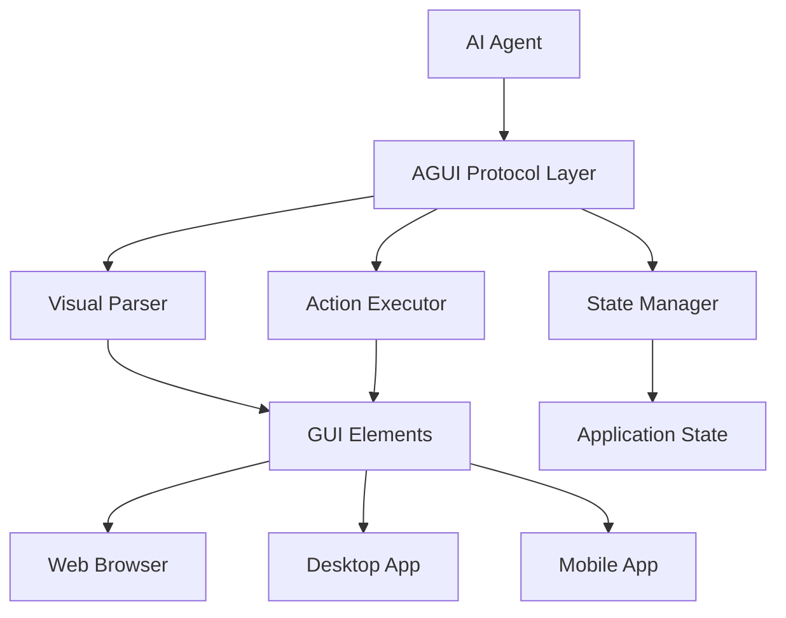

# AGUI Protocol - AI GUI Interaction Standards

!!! abstract "AI-GUI Integration Protocol"
    AGUI (AI Graphical User Interface) protocol defines standards for AI systems to interact with graphical user interfaces, enabling autonomous visual understanding and control of software applications.

## 🎯 Overview

The AGUI protocol represents a standardized approach for AI agents to interact with graphical user interfaces, bridging the gap between AI decision-making and visual interface control. This protocol enables AI systems to understand, navigate, and manipulate GUI elements across different platforms and applications.

### Key Capabilities

**Visual Understanding**: Parse and interpret visual elements, layouts, and interface hierarchies

**Element Recognition**: Identify buttons, forms, menus, and interactive components

**Action Execution**: Perform clicks, text input, scrolling, and complex interactions

**Context Awareness**: Understand application state and interface context

**Cross-Platform Support**: Work across web, desktop, and mobile interfaces

## 🏗️ Protocol Architecture

### Core Components



### Protocol Stack

#### 1. Perception Layer
- **Screen Capture**: High-resolution interface screenshots
- **Element Detection**: Computer vision for UI component identification
- **Text Recognition**: OCR for interface text extraction
- **Layout Analysis**: Spatial relationship understanding

#### 2. Interpretation Layer
- **Semantic Understanding**: Context and purpose interpretation
- **Intent Recognition**: User goal and task identification
- **State Modeling**: Application and interface state tracking
- **Accessibility Mapping**: Interface accessibility tree analysis

#### 3. Action Layer
- **Interaction Planning**: Multi-step action sequence planning
- **Precise Control**: Pixel-perfect clicking and interaction
- **Input Simulation**: Keyboard and mouse event generation
- **Gesture Support**: Touch and complex gesture execution

## 📋 Protocol Specifications

### Message Format

```json
{
  "version": "1.0",
  "session_id": "agui_session_123",
  "timestamp": "2025-01-27T10:30:00Z",
  "type": "gui_interaction",
  "payload": {
    "action": "click",
    "target": {
      "type": "button",
      "id": "submit_btn",
      "coordinates": [150, 200],
      "text": "Submit",
      "confidence": 0.95
    },
    "context": {
      "application": "web_browser",
      "url": "https://example.com/form",
      "window_title": "Contact Form"
    }
  }
}
```

### Action Types

#### Basic Interactions
```yaml
click:
  description: "Single click on element"
  parameters:
    - coordinates: [x, y]
    - element_id: string
    - button: "left|right|middle"

double_click:
  description: "Double click on element"
  parameters:
    - coordinates: [x, y]
    - element_id: string

type_text:
  description: "Type text into input field"
  parameters:
    - text: string
    - target_field: string
    - clear_first: boolean

scroll:
  description: "Scroll in direction"
  parameters:
    - direction: "up|down|left|right"
    - amount: integer
    - target_element: string

drag_drop:
  description: "Drag element to location"
  parameters:
    - source: [x, y]
    - destination: [x, y]
    - element_id: string
```

#### Advanced Interactions
```yaml
multi_select:
  description: "Select multiple items"
  parameters:
    - items: array
    - selection_method: "ctrl_click|shift_click"

form_fill:
  description: "Fill entire form"
  parameters:
    - form_data: object
    - submit: boolean
    - validation: boolean

navigation:
  description: "Navigate through interface"
  parameters:
    - path: array
    - method: "menu|breadcrumb|tab"
```

### Element Identification

```json
{
  "element": {
    "id": "unique_identifier",
    "type": "button|input|select|div|link",
    "text": "visible_text",
    "placeholder": "placeholder_text",
    "coordinates": {
      "x": 150,
      "y": 200,
      "width": 100,
      "height": 30
    },
    "attributes": {
      "class": "btn btn-primary",
      "role": "button",
      "aria-label": "Submit form"
    },
    "parent": "parent_element_id",
    "children": ["child1_id", "child2_id"],
    "visibility": {
      "visible": true,
      "clickable": true,
      "enabled": true
    }
  }
}
```

## 🔧 Implementation Examples

### Web Browser Automation

```python
import agui_client
from agui_protocol import AGUISession

# Initialize AGUI session
session = AGUISession()
client = agui_client.WebClient(session)

# Navigate to page
await client.navigate("https://example.com")

# Find and interact with elements
search_box = await client.find_element(
    type="input",
    attributes={"placeholder": "Search..."}
)

await client.type_text(search_box, "AI protocols")
await client.click(client.find_element(type="button", text="Search"))

# Wait for results and extract data
results = await client.wait_for_elements(
    selector=".search-result",
    timeout=5000
)

for result in results:
    title = await client.get_text(result.find_child(".title"))
    print(f"Found: {title}")
```

### Desktop Application Control

```python
import agui_client
from agui_protocol import AGUISession

# Initialize desktop session
session = AGUISession(platform="desktop")
client = agui_client.DesktopClient(session)

# Launch application
await client.launch_app("notepad.exe")

# Wait for window to appear
window = await client.wait_for_window(title="Notepad")

# Interact with menu system
await client.navigate_menu(["File", "New"])

# Type content
text_area = await client.find_element(type="edit")
await client.type_text(text_area, "Hello from AGUI!")

# Save file
await client.key_combination(["Ctrl", "S"])
save_dialog = await client.wait_for_dialog("Save As")
await client.type_text(save_dialog.find_input("filename"), "agui_test.txt")
await client.click(save_dialog.find_button("Save"))
```

### Mobile Application Testing

```python
import agui_client
from agui_protocol import AGUISession

# Initialize mobile session
session = AGUISession(platform="android")
client = agui_client.MobileClient(session)

# Launch app
await client.launch_app("com.example.app")

# Perform gestures
await client.swipe(
    start=[200, 400],
    end=[200, 200],
    duration=1000
)

# Handle modal dialogs
if await client.element_exists(type="dialog"):
    dialog = await client.find_element(type="dialog")
    await client.click(dialog.find_button("Allow"))

# Fill form with gesture navigation
form_fields = [
    {"type": "input", "label": "Name", "value": "John Doe"},
    {"type": "input", "label": "Email", "value": "john@example.com"},
    {"type": "select", "label": "Country", "value": "USA"}
]

for field in form_fields:
    element = await client.find_element(
        type=field["type"],
        label=field["label"]
    )
    await client.scroll_to_element(element)
    await client.interact(element, field["value"])
```

## 🔍 Visual Recognition Techniques

### Computer Vision Pipeline

```python
class AGUIVisionPipeline:
    def __init__(self):
        self.element_detector = ElementDetector()
        self.text_recognizer = TextRecognizer()
        self.layout_analyzer = LayoutAnalyzer()
    
    async def analyze_screen(self, screenshot):
        # Detect UI elements
        elements = await self.element_detector.detect(screenshot)
        
        # Extract text from elements
        for element in elements:
            element.text = await self.text_recognizer.extract(element.region)
        
        # Analyze layout relationships
        layout = await self.layout_analyzer.analyze(elements)
        
        return AGUIScene(elements=elements, layout=layout)
    
    async def find_element(self, scene, criteria):
        candidates = []
        
        for element in scene.elements:
            score = self._calculate_match_score(element, criteria)
            if score > 0.8:
                candidates.append((element, score))
        
        # Return best match
        return max(candidates, key=lambda x: x[1])[0] if candidates else None
    
    def _calculate_match_score(self, element, criteria):
        score = 0.0
        
        # Text matching
        if criteria.get("text"):
            text_similarity = self._text_similarity(
                element.text, criteria["text"]
            )
            score += text_similarity * 0.4
        
        # Type matching
        if criteria.get("type") and element.type == criteria["type"]:
            score += 0.3
        
        # Position matching
        if criteria.get("position"):
            position_score = self._position_similarity(
                element.coordinates, criteria["position"]
            )
            score += position_score * 0.2
        
        # Attribute matching
        if criteria.get("attributes"):
            attr_score = self._attribute_similarity(
                element.attributes, criteria["attributes"]
            )
            score += attr_score * 0.1
        
        return score
```

### Element Detection Models

```python
class ElementDetector:
    def __init__(self):
        self.button_model = self._load_model("button_detector.onnx")
        self.input_model = self._load_model("input_detector.onnx")
        self.text_model = self._load_model("text_detector.onnx")
    
    async def detect(self, image):
        elements = []
        
        # Detect different element types
        buttons = await self._detect_buttons(image)
        inputs = await self._detect_inputs(image)
        text_elements = await self._detect_text(image)
        
        elements.extend(buttons)
        elements.extend(inputs)
        elements.extend(text_elements)
        
        # Remove overlapping detections
        elements = self._non_max_suppression(elements)
        
        return elements
    
    async def _detect_buttons(self, image):
        # Use computer vision to detect button-like elements
        predictions = self.button_model.predict(image)
        buttons = []
        
        for pred in predictions:
            if pred.confidence > 0.7:
                button = AGUIElement(
                    type="button",
                    coordinates=pred.bbox,
                    confidence=pred.confidence
                )
                buttons.append(button)
        
        return buttons
```

## 🛡️ Security & Safety

### Access Control

```python
class AGUISecurityManager:
    def __init__(self):
        self.permissions = PermissionManager()
        self.audit_logger = AuditLogger()
    
    async def authorize_action(self, action, target, context):
        # Check permissions
        if not self.permissions.check(action, target.application):
            raise PermissionDeniedError(f"Action {action} not allowed")
        
        # Validate target
        if not self._is_safe_target(target):
            raise SecurityError("Unsafe target element")
        
        # Log action for audit
        await self.audit_logger.log_action(action, target, context)
        
        return True
    
    def _is_safe_target(self, target):
        # Check for dangerous elements
        dangerous_patterns = [
            "delete",
            "format",
            "admin",
            "sudo",
            "rm -rf"
        ]
        
        element_text = target.text.lower()
        return not any(pattern in element_text for pattern in dangerous_patterns)
```

### Sandboxing

```python
class AGUISandbox:
    def __init__(self):
        self.allowed_apps = set()
        self.blocked_actions = set()
    
    async def execute_in_sandbox(self, action, target):
        # Verify application is allowed
        if target.application not in self.allowed_apps:
            raise SandboxViolationError("Application not in whitelist")
        
        # Check blocked actions
        if action.type in self.blocked_actions:
            raise SandboxViolationError("Action type blocked")
        
        # Execute with monitoring
        try:
            result = await self._execute_monitored(action, target)
            return result
        except Exception as e:
            await self._handle_sandbox_error(e)
            raise
    
    async def _execute_monitored(self, action, target):
        # Monitor system calls, network access, file operations
        with SystemMonitor() as monitor:
            result = await action.execute(target)
            
            # Check for suspicious activity
            if monitor.detected_anomaly():
                raise SandboxViolationError("Suspicious activity detected")
            
            return result
```

## 📊 Performance Optimization

### Caching Strategies

```python
class AGUICache:
    def __init__(self):
        self.element_cache = LRUCache(maxsize=1000)
        self.screenshot_cache = LRUCache(maxsize=50)
        self.model_cache = {}
    
    async def get_cached_elements(self, screen_hash):
        if screen_hash in self.element_cache:
            return self.element_cache[screen_hash]
        return None
    
    async def cache_elements(self, screen_hash, elements):
        self.element_cache[screen_hash] = elements
    
    def preload_models(self):
        # Preload frequently used models
        models = ["button_detector", "text_recognizer", "layout_analyzer"]
        for model_name in models:
            self.model_cache[model_name] = self._load_model(f"{model_name}.onnx")
```

### Parallel Processing

```python
class AGUIParallelProcessor:
    def __init__(self, max_workers=4):
        self.executor = ThreadPoolExecutor(max_workers=max_workers)
    
    async def batch_analyze(self, screenshots):
        tasks = []
        for screenshot in screenshots:
            task = self.executor.submit(self._analyze_single, screenshot)
            tasks.append(task)
        
        results = []
        for task in tasks:
            result = await asyncio.wrap_future(task)
            results.append(result)
        
        return results
    
    def _analyze_single(self, screenshot):
        # Process single screenshot
        pipeline = AGUIVisionPipeline()
        return pipeline.analyze_screen(screenshot)
```

## 🔗 Integration Examples

### Web Testing Framework

```python
class AGUIWebTestFramework:
    def __init__(self):
        self.session = AGUISession(platform="web")
        self.client = agui_client.WebClient(self.session)
    
    async def test_login_flow(self, username, password):
        # Navigate to login page
        await self.client.navigate("/login")
        
        # Fill login form
        await self.client.type_text(
            target={"type": "input", "name": "username"},
            text=username
        )
        
        await self.client.type_text(
            target={"type": "input", "name": "password"},
            text=password
        )
        
        # Submit form
        await self.client.click(
            target={"type": "button", "text": "Login"}
        )
        
        # Verify successful login
        dashboard = await self.client.wait_for_element(
            selector=".dashboard",
            timeout=5000
        )
        
        assert dashboard.is_visible(), "Login failed"
        return True
```

### RPA Integration

```python
class AGUIRPAConnector:
    def __init__(self):
        self.agui_session = AGUISession()
        self.rpa_engine = RPAEngine()
    
    async def automate_workflow(self, workflow_definition):
        for step in workflow_definition.steps:
            if step.type == "gui_interaction":
                await self._execute_gui_step(step)
            elif step.type == "data_processing":
                await self._execute_data_step(step)
            elif step.type == "api_call":
                await self._execute_api_step(step)
    
    async def _execute_gui_step(self, step):
        # Use AGUI for GUI interactions
        action = AGUIAction.from_step(step)
        result = await self.agui_session.execute(action)
        return result
```

## 🎯 Best Practices

### Error Handling

```python
class AGUIErrorHandler:
    def __init__(self):
        self.retry_policy = RetryPolicy(max_attempts=3, backoff=2)
    
    async def robust_execute(self, action, target):
        for attempt in range(self.retry_policy.max_attempts):
            try:
                return await self._execute_with_recovery(action, target)
            except AGUIElementNotFoundError:
                if attempt == self.retry_policy.max_attempts - 1:
                    raise
                await self._wait_and_refresh()
            except AGUITimeoutError:
                if attempt == self.retry_policy.max_attempts - 1:
                    raise
                await asyncio.sleep(self.retry_policy.backoff ** attempt)
    
    async def _execute_with_recovery(self, action, target):
        try:
            return await action.execute(target)
        except AGUIStaleElementError:
            # Re-find element and retry
            refreshed_target = await self._refind_element(target)
            return await action.execute(refreshed_target)
```

### Testing Strategies

```python
class AGUITestSuite:
    def __init__(self):
        self.test_cases = []
        self.mock_environment = MockGUIEnvironment()
    
    async def run_comprehensive_tests(self):
        # Test element detection accuracy
        await self._test_element_detection()
        
        # Test action execution reliability
        await self._test_action_execution()
        
        # Test error handling
        await self._test_error_scenarios()
        
        # Test performance benchmarks
        await self._test_performance()
    
    async def _test_element_detection(self):
        test_images = self._load_test_images()
        for image, expected_elements in test_images:
            detected = await self._detect_elements(image)
            accuracy = self._calculate_accuracy(detected, expected_elements)
            assert accuracy > 0.95, f"Detection accuracy too low: {accuracy}"
```

AGUI protocol represents a significant advancement in AI-GUI interaction, enabling sophisticated automation and testing scenarios across multiple platforms and applications. Its standardized approach ensures compatibility and reliability in AI-driven interface automation.
