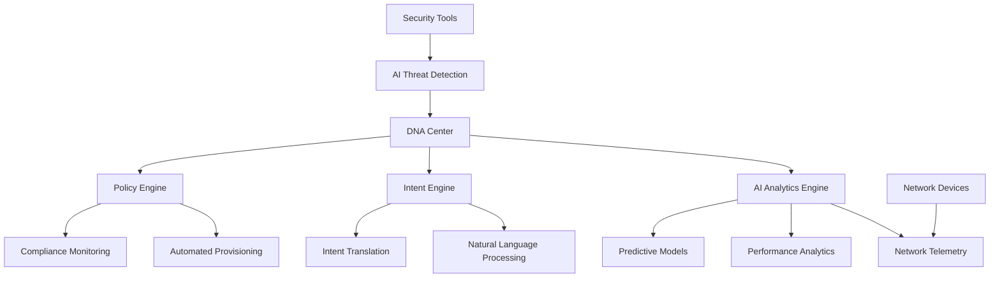

# Cisco AI Protocols - Enterprise AI Integration

!!! abstract "Cisco's AI Communication Standards"
    Comprehensive overview of Cisco's AI protocols and standards for enterprise networking, automation, and intelligent infrastructure management.

## 🎯 Overview

Cisco has developed a comprehensive suite of AI protocols and standards designed to integrate artificial intelligence capabilities into enterprise networking infrastructure. These protocols enable intelligent network management, automated troubleshooting, predictive maintenance, and enhanced security across Cisco's product ecosystem.

### Core Cisco AI Protocols

**Cisco DNA Center AI**: Centralized network intelligence and automation platform

**Webex AI Integration**: Conversational AI and collaboration intelligence protocols

**Security AI Framework**: AI-driven threat detection and response protocols

**Network Analytics Engine**: Predictive analytics and performance optimization

**Intent-Based Networking (IBN)**: AI-powered network policy automation

## 🏗️ Cisco DNA Center AI Protocol

### Architecture Overview



### DNA Center API Protocol

#### Authentication & Session Management

```json
{
  "protocol": "DNA Center AI API",
  "version": "2.3.7",
  "authentication": {
    "method": "JWT",
    "endpoint": "/dna/system/api/v1/auth/token",
    "headers": {
      "Content-Type": "application/json",
      "Authorization": "Basic <base64_credentials>"
    }
  },
  "session": {
    "token_lifetime": 3600,
    "refresh_mechanism": "automatic",
    "rate_limiting": {
      "requests_per_minute": 1000,
      "burst_limit": 100
    }
  }
}
```

#### AI Analytics API Endpoints

```yaml
ai_analytics_endpoints:
  network_health:
    endpoint: "/dna/intent/api/v1/network-health"
    method: "GET"
    parameters:
      - timestamp: "ISO-8601 format"
      - device_family: "string"
      - site_id: "string"
    response:
      type: "NetworkHealthScore"
      ai_insights: "array"
      
  predictive_insights:
    endpoint: "/dna/intent/api/v1/ai/insights"
    method: "POST"
    payload:
      analysis_type: "predictive|diagnostic|optimization"
      time_range: "object"
      scope: "site|device|interface"
    response:
      predictions: "array"
      confidence_scores: "array"
      recommendations: "array"
      
  intent_processing:
    endpoint: "/dna/intent/api/v1/intent"
    method: "POST"
    payload:
      natural_language_intent: "string"
      context: "object"
    response:
      interpreted_intent: "object"
      execution_plan: "array"
      validation_results: "object"
```

### Implementation Example

```python
import requests
import json
from typing import Dict, List, Optional
from dataclasses import dataclass
from datetime import datetime, timedelta

@dataclass
class CiscoDNAConfig:
    base_url: str
    username: str
    password: str
    verify_ssl: bool = True

class CiscoDNAClient:
    def __init__(self, config: CiscoDNAConfig):
        self.config = config
        self.session = requests.Session()
        self.session.verify = config.verify_ssl
        self.token = None
        self.token_expires = None
    
    async def authenticate(self) -> bool:
        """Authenticate with DNA Center"""
        auth_url = f"{self.config.base_url}/dna/system/api/v1/auth/token"
        
        # Prepare credentials
        import base64
        credentials = base64.b64encode(
            f"{self.config.username}:{self.config.password}".encode()
        ).decode()
        
        headers = {
            "Content-Type": "application/json",
            "Authorization": f"Basic {credentials}"
        }
        
        try:
            response = self.session.post(auth_url, headers=headers)
            response.raise_for_status()
            
            token_data = response.json()
            self.token = token_data["Token"]
            self.token_expires = datetime.now() + timedelta(seconds=3600)
            
            # Set default headers for future requests
            self.session.headers.update({
                "X-Auth-Token": self.token,
                "Content-Type": "application/json"
            })
            
            return True
            
        except requests.exceptions.RequestException as e:
            print(f"Authentication failed: {e}")
            return False
    
    async def get_network_health(self, site_id: str = None) -> Dict:
        """Get AI-powered network health analysis"""
        await self._ensure_authenticated()
        
        url = f"{self.config.base_url}/dna/intent/api/v1/network-health"
        params = {}
        
        if site_id:
            params["site_id"] = site_id
        
        response = self.session.get(url, params=params)
        response.raise_for_status()
        
        return response.json()
    
    async def get_predictive_insights(self, analysis_config: Dict) -> Dict:
        """Get AI predictive insights"""
        await self._ensure_authenticated()
        
        url = f"{self.config.base_url}/dna/intent/api/v1/ai/insights"
        
        payload = {
            "analysis_type": analysis_config.get("type", "predictive"),
            "time_range": {
                "start": analysis_config.get("start_time"),
                "end": analysis_config.get("end_time")
            },
            "scope": analysis_config.get("scope", "site"),
            "metrics": analysis_config.get("metrics", ["all"])
        }
        
        response = self.session.post(url, json=payload)
        response.raise_for_status()
        
        return response.json()
    
    async def process_natural_language_intent(self, intent: str, context: Dict = None) -> Dict:
        """Process natural language network intent"""
        await self._ensure_authenticated()
        
        url = f"{self.config.base_url}/dna/intent/api/v1/intent"
        
        payload = {
            "natural_language_intent": intent,
            "context": context or {},
            "processing_options": {
                "validate_only": False,
                "auto_execute": False
            }
        }
        
        response = self.session.post(url, json=payload)
        response.raise_for_status()
        
        return response.json()
    
    async def get_ai_recommendations(self, scope: str = "network") -> List[Dict]:
        """Get AI-generated network optimization recommendations"""
        await self._ensure_authenticated()
        
        url = f"{self.config.base_url}/dna/intent/api/v1/ai/recommendations"
        
        params = {"scope": scope}
        response = self.session.get(url, params=params)
        response.raise_for_status()
        
        recommendations = response.json()
        return recommendations.get("recommendations", [])
    
    async def _ensure_authenticated(self):
        """Ensure we have a valid authentication token"""
        if not self.token or datetime.now() >= self.token_expires:
            await self.authenticate()

# Usage Example
async def main():
    config = CiscoDNAConfig(
        base_url="https://dna-center.company.com",
        username="api_user",
        password="api_password"
    )
    
    client = CiscoDNAClient(config)
    
    # Get network health insights
    health = await client.get_network_health()
    print(f"Network Health Score: {health.get('overall_score')}")
    
    # Process natural language intent
    intent_result = await client.process_natural_language_intent(
        "Show me devices with high CPU utilization in the last 24 hours"
    )
    print(f"Intent processed: {intent_result.get('execution_plan')}")
    
    # Get predictive insights
    insights = await client.get_predictive_insights({
        "type": "predictive",
        "scope": "network",
        "start_time": "2025-01-20T00:00:00Z",
        "end_time": "2025-01-27T00:00:00Z"
    })
    print(f"Predictions: {insights.get('predictions')}")

if __name__ == "__main__":
    import asyncio
    asyncio.run(main())
```

## 🔐 Webex AI Integration Protocol

### Conversation Intelligence API

```json
{
  "protocol": "Webex AI Conversation Intelligence",
  "version": "1.0",
  "endpoints": {
    "real_time_transcription": {
      "url": "/v1/meetings/{meetingId}/transcription",
      "method": "WebSocket",
      "authentication": "Bearer token",
      "features": [
        "real_time_transcription",
        "speaker_identification",
        "sentiment_analysis",
        "key_moment_detection"
      ]
    },
    "meeting_insights": {
      "url": "/v1/meetings/{meetingId}/insights",
      "method": "GET",
      "response_format": {
        "summary": "string",
        "action_items": "array",
        "key_decisions": "array",
        "sentiment_timeline": "array",
        "engagement_metrics": "object"
      }
    },
    "ai_assistant": {
      "url": "/v1/assistant/query",
      "method": "POST",
      "payload": {
        "query": "string",
        "context": "meeting|workspace|general",
        "user_preferences": "object"
      }
    }
  }
}
```

### WebSocket Transcription Protocol

```python
import websocket
import json
import threading
from typing import Callable, Dict

class WebexAITranscription:
    def __init__(self, access_token: str, meeting_id: str):
        self.access_token = access_token
        self.meeting_id = meeting_id
        self.ws = None
        self.callbacks = {}
    
    def connect(self):
        """Connect to Webex AI transcription service"""
        ws_url = f"wss://webexapis.com/v1/meetings/{self.meeting_id}/transcription"
        
        headers = {
            "Authorization": f"Bearer {self.access_token}"
        }
        
        self.ws = websocket.WebSocketApp(
            ws_url,
            header=headers,
            on_open=self._on_open,
            on_message=self._on_message,
            on_error=self._on_error,
            on_close=self._on_close
        )
        
        # Start connection in separate thread
        ws_thread = threading.Thread(target=self.ws.run_forever)
        ws_thread.daemon = True
        ws_thread.start()
    
    def register_callback(self, event_type: str, callback: Callable):
        """Register callback for specific event types"""
        self.callbacks[event_type] = callback
    
    def _on_open(self, ws):
        """Handle WebSocket connection open"""
        # Send configuration
        config = {
            "type": "configuration",
            "transcription": {
                "language": "en-US",
                "punctuation": True,
                "profanity_filter": False,
                "speaker_labels": True
            },
            "ai_features": {
                "sentiment_analysis": True,
                "key_phrase_extraction": True,
                "action_item_detection": True
            }
        }
        
        ws.send(json.dumps(config))
        
        if "connection_opened" in self.callbacks:
            self.callbacks["connection_opened"]()
    
    def _on_message(self, ws, message):
        """Handle incoming transcription messages"""
        try:
            data = json.loads(message)
            message_type = data.get("type")
            
            if message_type == "transcription":
                self._handle_transcription(data)
            elif message_type == "sentiment":
                self._handle_sentiment(data)
            elif message_type == "key_phrase":
                self._handle_key_phrase(data)
            elif message_type == "action_item":
                self._handle_action_item(data)
                
        except json.JSONDecodeError as e:
            print(f"Error parsing message: {e}")
    
    def _handle_transcription(self, data):
        """Handle transcription events"""
        transcript_info = {
            "speaker_id": data.get("speaker_id"),
            "speaker_name": data.get("speaker_name"),
            "text": data.get("text"),
            "confidence": data.get("confidence"),
            "timestamp": data.get("timestamp"),
            "is_final": data.get("is_final", False)
        }
        
        if "transcription" in self.callbacks:
            self.callbacks["transcription"](transcript_info)
    
    def _handle_sentiment(self, data):
        """Handle sentiment analysis events"""
        sentiment_info = {
            "speaker_id": data.get("speaker_id"),
            "sentiment": data.get("sentiment"),  # positive, negative, neutral
            "confidence": data.get("confidence"),
            "timestamp": data.get("timestamp"),
            "text_segment": data.get("text_segment")
        }
        
        if "sentiment" in self.callbacks:
            self.callbacks["sentiment"](sentiment_info)
    
    def _handle_action_item(self, data):
        """Handle action item detection"""
        action_item = {
            "id": data.get("id"),
            "text": data.get("text"),
            "assigned_to": data.get("assigned_to"),
            "due_date": data.get("due_date"),
            "confidence": data.get("confidence"),
            "timestamp": data.get("timestamp")
        }
        
        if "action_item" in self.callbacks:
            self.callbacks["action_item"](action_item)

# Usage example
def on_transcription(transcript):
    print(f"[{transcript['speaker_name']}]: {transcript['text']}")

def on_sentiment(sentiment):
    print(f"Sentiment: {sentiment['sentiment']} (confidence: {sentiment['confidence']})")

def on_action_item(item):
    print(f"Action Item: {item['text']} -> {item['assigned_to']}")

# Initialize and connect
transcription = WebexAITranscription("your_access_token", "meeting_id")
transcription.register_callback("transcription", on_transcription)
transcription.register_callback("sentiment", on_sentiment)
transcription.register_callback("action_item", on_action_item)
transcription.connect()
```

## 🛡️ Cisco Security AI Framework

### Threat Detection Protocol

```json
{
  "protocol": "Cisco Security AI",
  "version": "3.1",
  "components": {
    "threat_detection": {
      "endpoint": "/api/v1/threats/analyze",
      "method": "POST",
      "payload_schema": {
        "network_traffic": "object",
        "endpoint_data": "object",
        "user_behavior": "object",
        "analysis_type": "real_time|batch|historical"
      },
      "ai_models": [
        "anomaly_detection",
        "malware_classification",
        "behavioral_analysis",
        "threat_correlation"
      ]
    },
    "response_automation": {
      "endpoint": "/api/v1/response/execute",
      "method": "POST",
      "actions": [
        "quarantine_endpoint",
        "block_traffic",
        "notify_administrators",
        "collect_forensics"
      ]
    }
  }
}
```

### Security AI Implementation

```python
import requests
import json
from datetime import datetime
from typing import Dict, List, Optional
from enum import Enum

class ThreatLevel(Enum):
    LOW = "low"
    MEDIUM = "medium"
    HIGH = "high"
    CRITICAL = "critical"

class CiscoSecurityAI:
    def __init__(self, api_endpoint: str, api_key: str):
        self.api_endpoint = api_endpoint
        self.api_key = api_key
        self.session = requests.Session()
        self.session.headers.update({
            "Authorization": f"Bearer {api_key}",
            "Content-Type": "application/json"
        })
    
    async def analyze_threat(self, threat_data: Dict) -> Dict:
        """Analyze potential security threats using AI"""
        url = f"{self.api_endpoint}/api/v1/threats/analyze"
        
        payload = {
            "timestamp": datetime.utcnow().isoformat(),
            "analysis_type": "real_time",
            "data": threat_data,
            "ai_models": [
                "anomaly_detection",
                "malware_classification", 
                "behavioral_analysis"
            ]
        }
        
        response = self.session.post(url, json=payload)
        response.raise_for_status()
        
        return response.json()
    
    async def get_threat_intelligence(self, indicators: List[str]) -> Dict:
        """Get AI-enhanced threat intelligence"""
        url = f"{self.api_endpoint}/api/v1/intelligence/query"
        
        payload = {
            "indicators": indicators,
            "intelligence_types": [
                "reputation",
                "behavioral_patterns",
                "attack_chains",
                "attribution"
            ],
            "ai_enhancement": True
        }
        
        response = self.session.post(url, json=payload)
        response.raise_for_status()
        
        return response.json()
    
    async def automated_response(self, threat_id: str, response_actions: List[str]) -> Dict:
        """Execute automated threat response"""
        url = f"{self.api_endpoint}/api/v1/response/execute"
        
        payload = {
            "threat_id": threat_id,
            "actions": response_actions,
            "execution_mode": "automated",
            "approval_required": False
        }
        
        response = self.session.post(url, json=payload)
        response.raise_for_status()
        
        return response.json()
    
    async def behavioral_analysis(self, user_data: Dict, baseline_period: int = 30) -> Dict:
        """Analyze user behavior for anomalies"""
        url = f"{self.api_endpoint}/api/v1/behavior/analyze"
        
        payload = {
            "user_data": user_data,
            "baseline_period_days": baseline_period,
            "analysis_dimensions": [
                "login_patterns",
                "resource_access",
                "network_behavior",
                "application_usage"
            ],
            "anomaly_threshold": 0.8
        }
        
        response = self.session.post(url, json=payload)
        response.raise_for_status()
        
        return response.json()

# Example usage
async def security_monitoring_example():
    security_ai = CiscoSecurityAI(
        api_endpoint="https://security-ai.cisco.com",
        api_key="your_api_key"
    )
    
    # Analyze network traffic for threats
    traffic_data = {
        "source_ip": "192.168.1.100",
        "destination_ip": "external.malicious.com",
        "protocol": "HTTP",
        "payload_size": 1024,
        "timestamp": datetime.utcnow().isoformat()
    }
    
    threat_analysis = await security_ai.analyze_threat(traffic_data)
    
    if threat_analysis["risk_score"] > 0.8:
        # Execute automated response
        response_result = await security_ai.automated_response(
            threat_analysis["threat_id"],
            ["block_traffic", "quarantine_endpoint", "notify_administrators"]
        )
        print(f"Automated response executed: {response_result}")
```

## 📊 Network Analytics Engine

### Performance Monitoring Protocol

```json
{
  "protocol": "Cisco Network Analytics",
  "version": "2.1",
  "telemetry_streaming": {
    "protocols": ["gRPC", "NETCONF", "RESTCONF"],
    "data_formats": ["JSON", "GPB", "XML"],
    "streaming_modes": ["on_change", "periodic", "event_driven"]
  },
  "ai_analytics": {
    "predictive_models": [
      "capacity_planning",
      "failure_prediction",
      "performance_optimization",
      "anomaly_detection"
    ],
    "real_time_processing": {
      "latency": "< 100ms",
      "throughput": "1M events/sec",
      "accuracy": "> 95%"
    }
  }
}
```

### Analytics Implementation

```python
from typing import Dict, List, Any
import asyncio
import grpc
from datetime import datetime, timedelta
import numpy as np
import pandas as pd

class CiscoNetworkAnalytics:
    def __init__(self, collector_endpoint: str, ai_engine_endpoint: str):
        self.collector_endpoint = collector_endpoint
        self.ai_engine_endpoint = ai_engine_endpoint
        self.telemetry_buffer = []
        self.models = {}
    
    async def start_telemetry_collection(self, device_list: List[str]):
        """Start collecting telemetry from network devices"""
        tasks = []
        for device in device_list:
            task = asyncio.create_task(self._collect_device_telemetry(device))
            tasks.append(task)
        
        await asyncio.gather(*tasks)
    
    async def _collect_device_telemetry(self, device_id: str):
        """Collect telemetry from a specific device"""
        # gRPC streaming connection
        channel = grpc.aio.insecure_channel(f"{device_id}:57400")
        
        try:
            while True:
                # Collect various metrics
                telemetry_data = await self._fetch_device_metrics(device_id)
                
                # Add timestamp and device context
                telemetry_data.update({
                    "device_id": device_id,
                    "timestamp": datetime.utcnow().isoformat(),
                    "collection_method": "grpc_streaming"
                })
                
                # Buffer for batch processing
                self.telemetry_buffer.append(telemetry_data)
                
                # Process in batches
                if len(self.telemetry_buffer) >= 100:
                    await self._process_telemetry_batch()
                
                await asyncio.sleep(5)  # 5-second interval
                
        except Exception as e:
            print(f"Telemetry collection error for {device_id}: {e}")
        finally:
            await channel.close()
    
    async def _fetch_device_metrics(self, device_id: str) -> Dict:
        """Fetch comprehensive device metrics"""
        return {
            "cpu_utilization": await self._get_cpu_metrics(device_id),
            "memory_utilization": await self._get_memory_metrics(device_id),
            "interface_stats": await self._get_interface_metrics(device_id),
            "routing_table_size": await self._get_routing_metrics(device_id),
            "bgp_session_state": await self._get_bgp_metrics(device_id),
            "temperature": await self._get_environmental_metrics(device_id)
        }
    
    async def _process_telemetry_batch(self):
        """Process batch of telemetry data with AI analytics"""
        if not self.telemetry_buffer:
            return
        
        # Convert to DataFrame for analysis
        df = pd.DataFrame(self.telemetry_buffer)
        
        # Run AI analytics
        analytics_results = await self._run_ai_analytics(df)
        
        # Generate alerts if necessary
        alerts = await self._generate_alerts(analytics_results)
        
        # Store results
        await self._store_analytics_results(analytics_results)
        
        # Clear buffer
        self.telemetry_buffer.clear()
        
        return analytics_results
    
    async def _run_ai_analytics(self, telemetry_df: pd.DataFrame) -> Dict:
        """Run AI analytics on telemetry data"""
        results = {}
        
        # Anomaly detection
        results["anomalies"] = await self._detect_anomalies(telemetry_df)
        
        # Predictive analysis
        results["predictions"] = await self._generate_predictions(telemetry_df)
        
        # Performance optimization recommendations
        results["optimizations"] = await self._generate_optimizations(telemetry_df)
        
        # Capacity planning insights
        results["capacity_insights"] = await self._analyze_capacity(telemetry_df)
        
        return results
    
    async def _detect_anomalies(self, df: pd.DataFrame) -> List[Dict]:
        """Detect anomalies in network behavior"""
        anomalies = []
        
        # CPU utilization anomalies
        cpu_data = df["cpu_utilization"].values
        cpu_mean = np.mean(cpu_data)
        cpu_std = np.std(cpu_data)
        
        for idx, cpu_val in enumerate(cpu_data):
            if abs(cpu_val - cpu_mean) > 3 * cpu_std:  # 3-sigma rule
                anomalies.append({
                    "type": "cpu_anomaly",
                    "device_id": df.iloc[idx]["device_id"],
                    "timestamp": df.iloc[idx]["timestamp"],
                    "value": cpu_val,
                    "expected_range": [cpu_mean - 2*cpu_std, cpu_mean + 2*cpu_std],
                    "severity": "high" if abs(cpu_val - cpu_mean) > 4 * cpu_std else "medium"
                })
        
        # Interface utilization anomalies
        for device_group in df.groupby("device_id"):
            device_id = device_group[0]
            device_data = device_group[1]
            
            # Analyze interface trends
            interface_stats = device_data["interface_stats"].tolist()
            interface_anomalies = await self._analyze_interface_anomalies(device_id, interface_stats)
            anomalies.extend(interface_anomalies)
        
        return anomalies
    
    async def _generate_predictions(self, df: pd.DataFrame) -> List[Dict]:
        """Generate predictive insights"""
        predictions = []
        
        # Predict capacity exhaustion
        for device_group in df.groupby("device_id"):
            device_id = device_group[0]
            device_data = device_group[1]
            
            # CPU utilization trend
            cpu_trend = np.polyfit(range(len(device_data)), device_data["cpu_utilization"], 1)
            if cpu_trend[0] > 0:  # Increasing trend
                # Predict when CPU will reach 90%
                current_cpu = device_data["cpu_utilization"].iloc[-1]
                if current_cpu < 90:
                    time_to_90_percent = (90 - current_cpu) / cpu_trend[0]
                    predictions.append({
                        "type": "capacity_prediction",
                        "device_id": device_id,
                        "metric": "cpu_utilization",
                        "predicted_event": "cpu_threshold_breach",
                        "threshold": 90,
                        "estimated_time_hours": time_to_90_percent,
                        "confidence": 0.85,
                        "recommendation": "Consider load balancing or capacity upgrade"
                    })
        
        return predictions
    
    async def _generate_optimizations(self, df: pd.DataFrame) -> List[Dict]:
        """Generate optimization recommendations"""
        optimizations = []
        
        # Analyze resource utilization patterns
        for device_group in df.groupby("device_id"):
            device_id = device_group[0]
            device_data = device_group[1]
            
            avg_cpu = device_data["cpu_utilization"].mean()
            avg_memory = device_data["memory_utilization"].mean()
            
            # Low utilization optimization
            if avg_cpu < 20 and avg_memory < 30:
                optimizations.append({
                    "type": "resource_optimization",
                    "device_id": device_id,
                    "optimization": "consolidation_candidate",
                    "description": "Device shows low resource utilization",
                    "potential_savings": "Consider workload consolidation",
                    "impact": "cost_reduction"
                })
            
            # High utilization optimization
            elif avg_cpu > 80 or avg_memory > 85:
                optimizations.append({
                    "type": "performance_optimization", 
                    "device_id": device_id,
                    "optimization": "scaling_required",
                    "description": "Device approaching resource limits",
                    "recommendation": "Scale up or distribute load",
                    "urgency": "high"
                })
        
        return optimizations

# Usage example
async def network_analytics_example():
    analytics = CiscoNetworkAnalytics(
        collector_endpoint="telemetry-collector.company.com:9090",
        ai_engine_endpoint="ai-analytics.company.com:8080"
    )
    
    # Start monitoring key network devices
    critical_devices = [
        "core-router-01.company.com",
        "core-router-02.company.com", 
        "distribution-sw-01.company.com",
        "distribution-sw-02.company.com"
    ]
    
    # Begin telemetry collection and analysis
    await analytics.start_telemetry_collection(critical_devices)
```

## 🎯 Best Practices & Integration

### Protocol Integration Patterns

```python
class CiscoAIIntegration:
    def __init__(self):
        self.dna_client = None
        self.security_ai = None
        self.analytics_engine = None
        self.webex_ai = None
    
    async def unified_ai_workflow(self, network_event: Dict):
        """Unified workflow combining multiple Cisco AI protocols"""
        
        # 1. Analyze with DNA Center AI
        dna_analysis = await self.dna_client.get_predictive_insights({
            "type": "diagnostic",
            "scope": "device",
            "device_id": network_event["device_id"]
        })
        
        # 2. Check for security implications
        security_analysis = await self.security_ai.analyze_threat({
            "network_event": network_event,
            "context": dna_analysis
        })
        
        # 3. Gather analytics insights
        analytics_insights = await self.analytics_engine._run_ai_analytics(
            pd.DataFrame([network_event])
        )
        
        # 4. Generate unified response
        response = {
            "event_id": network_event["id"],
            "timestamp": datetime.utcnow().isoformat(),
            "analysis": {
                "network_health": dna_analysis,
                "security_assessment": security_analysis,
                "performance_insights": analytics_insights
            },
            "recommendations": await self._generate_unified_recommendations(
                dna_analysis, security_analysis, analytics_insights
            ),
            "automated_actions": await self._determine_automated_actions(
                security_analysis, analytics_insights
            )
        }
        
        return response
    
    async def _generate_unified_recommendations(self, dna_data, security_data, analytics_data):
        """Generate comprehensive recommendations from all AI sources"""
        recommendations = []
        
        # Combine insights from all sources
        if security_data.get("risk_score", 0) > 0.7:
            recommendations.append({
                "type": "security",
                "priority": "high",
                "action": "immediate_investigation",
                "description": "High-risk security event detected"
            })
        
        if analytics_data.get("anomalies"):
            recommendations.append({
                "type": "performance",
                "priority": "medium",
                "action": "performance_investigation",
                "description": "Network performance anomalies detected"
            })
        
        return recommendations
```

Cisco's AI protocols provide a comprehensive framework for intelligent network management, enabling enterprises to leverage artificial intelligence for improved security, performance, and operational efficiency across their network infrastructure.
