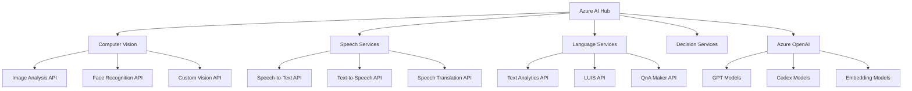

# Microsoft AI Protocols & Standards

!!! abstract "Microsoft's AI Communication Framework"
    Comprehensive overview of Microsoft's AI protocols, standards, and integration patterns across Azure AI, Office 365, and enterprise platforms.

## 🎯 Overview

Microsoft has developed an extensive ecosystem of AI protocols and standards designed to enable seamless integration of artificial intelligence capabilities across their cloud and enterprise platforms. These protocols span Azure AI services, Microsoft 365 Copilot integration, Teams AI framework, and enterprise-grade AI deployment patterns.

### Core Microsoft AI Protocols

**Azure AI Services API**: Standardized REST APIs for cognitive services and AI models

**Microsoft Graph API with AI**: Knowledge graph integration with AI-powered insights

**Teams AI Framework**: Conversational AI and bot development protocols

**Office 365 Copilot Integration**: AI assistant integration across productivity suite

**Azure OpenAI Protocol**: Enterprise-grade OpenAI service integration

**Power Platform AI Builder**: Low-code AI integration protocols

## 🏗️ Azure AI Services Protocol

### Service Architecture



### Authentication & Configuration

```json
{
  "protocol": "Azure AI Services",
  "version": "2024-02-01",
  "authentication": {
    "methods": [
      "subscription_key",
      "azure_ad_token",
      "managed_identity"
    ],
    "headers": {
      "Ocp-Apim-Subscription-Key": "your_subscription_key",
      "Authorization": "Bearer {token}",
      "Content-Type": "application/json"
    }
  },
  "regional_endpoints": {
    "global": "https://{resource-name}.cognitiveservices.azure.com",
    "specific": "https://{region}.api.cognitive.microsoft.com"
  },
  "rate_limiting": {
    "requests_per_second": "variable_by_tier",
    "quota_management": "azure_portal_configuration"
  }
}
```

### Azure OpenAI Integration

```python
import openai
import asyncio
import json
from typing import Dict, List, Optional, AsyncGenerator
from dataclasses import dataclass
from datetime import datetime

@dataclass
class AzureOpenAIConfig:
    endpoint: str
    api_key: str
    api_version: str = "2024-02-01"
    deployment_name: str = "gpt-4"

class AzureOpenAIClient:
    def __init__(self, config: AzureOpenAIConfig):
        self.config = config
        
        # Configure OpenAI client for Azure
        openai.api_type = "azure"
        openai.api_base = config.endpoint
        openai.api_version = config.api_version
        openai.api_key = config.api_key
    
    async def create_completion(self, prompt: str, **kwargs) -> Dict:
        """Create a completion using Azure OpenAI"""
        try:
            response = await openai.ChatCompletion.acreate(
                engine=self.config.deployment_name,
                messages=[{"role": "user", "content": prompt}],
                max_tokens=kwargs.get("max_tokens", 1000),
                temperature=kwargs.get("temperature", 0.7),
                top_p=kwargs.get("top_p", 1.0),
                frequency_penalty=kwargs.get("frequency_penalty", 0),
                presence_penalty=kwargs.get("presence_penalty", 0)
            )
            
            return {
                "content": response.choices[0].message.content,
                "usage": response.usage,
                "model": response.model,
                "created": response.created
            }
            
        except Exception as e:
            return {"error": str(e)}
    
    async def create_embedding(self, text: str, model: str = "text-embedding-ada-002") -> List[float]:
        """Create embeddings for text"""
        try:
            response = await openai.Embedding.acreate(
                engine=model,
                input=text
            )
            
            return response.data[0].embedding
            
        except Exception as e:
            print(f"Embedding creation failed: {e}")
            return []
    
    async def stream_completion(self, prompt: str, **kwargs) -> AsyncGenerator[str, None]:
        """Stream completion responses"""
        try:
            response = await openai.ChatCompletion.acreate(
                engine=self.config.deployment_name,
                messages=[{"role": "user", "content": prompt}],
                stream=True,
                **kwargs
            )
            
            async for chunk in response:
                if chunk.choices[0].delta.get("content"):
                    yield chunk.choices[0].delta.content
                    
        except Exception as e:
            yield f"Error: {str(e)}"
    
    async def analyze_content(self, content: str, analysis_type: str = "general") -> Dict:
        """Analyze content using AI"""
        analysis_prompts = {
            "sentiment": f"Analyze the sentiment of this text: {content}",
            "summary": f"Provide a concise summary of this text: {content}",
            "keywords": f"Extract key topics and themes from this text: {content}",
            "general": f"Analyze this content and provide insights: {content}"
        }
        
        prompt = analysis_prompts.get(analysis_type, analysis_prompts["general"])
        result = await self.create_completion(prompt)
        
        return {
            "analysis_type": analysis_type,
            "input_content": content[:100] + "...",  # Truncate for logging
            "analysis_result": result.get("content", ""),
            "timestamp": datetime.utcnow().isoformat()
        }

# Usage example
async def azure_openai_example():
    config = AzureOpenAIConfig(
        endpoint="https://your-resource.openai.azure.com/",
        api_key="your_api_key",
        deployment_name="gpt-4-deployment"
    )
    
    client = AzureOpenAIClient(config)
    
    # Create completion
    result = await client.create_completion(
        "Explain the benefits of cloud computing in enterprise environments"
    )
    print(f"Completion: {result['content']}")
    
    # Analyze content
    analysis = await client.analyze_content(
        "Our quarterly sales have increased by 15% due to improved customer engagement",
        analysis_type="sentiment"
    )
    print(f"Sentiment Analysis: {analysis['analysis_result']}")
    
    # Stream response
    print("Streaming response:")
    async for chunk in client.stream_completion("Write a brief poem about artificial intelligence"):
        print(chunk, end="", flush=True)
```

## 🤖 Microsoft Graph API with AI

### Graph AI Integration

```json
{
  "protocol": "Microsoft Graph AI",
  "version": "v1.0",
  "ai_enhanced_endpoints": {
    "people_insights": {
      "url": "/me/insights/trending",
      "ai_features": ["relevance_scoring", "content_analysis", "usage_patterns"]
    },
    "email_insights": {
      "url": "/me/messages",
      "ai_features": ["importance_prediction", "sentiment_analysis", "action_extraction"]
    },
    "calendar_intelligence": {
      "url": "/me/calendar/events",
      "ai_features": ["meeting_insights", "scheduling_optimization", "conflict_detection"]
    },
    "document_intelligence": {
      "url": "/me/drive/items",
      "ai_features": ["content_extraction", "classification", "duplicate_detection"]
    }
  }
}
```

### Graph AI Client Implementation

```python
import msal
import requests
import json
from typing import Dict, List, Optional
from datetime import datetime, timedelta

class MicrosoftGraphAI:
    def __init__(self, client_id: str, client_secret: str, tenant_id: str):
        self.client_id = client_id
        self.client_secret = client_secret
        self.tenant_id = tenant_id
        self.authority = f"https://login.microsoftonline.com/{tenant_id}"
        self.scope = ["https://graph.microsoft.com/.default"]
        self.access_token = None
        
    async def authenticate(self) -> bool:
        """Authenticate with Microsoft Graph"""
        app = msal.ConfidentialClientApplication(
            self.client_id,
            authority=self.authority,
            client_credential=self.client_secret
        )
        
        try:
            result = app.acquire_token_silent(self.scope, account=None)
            
            if not result:
                result = app.acquire_token_for_client(scopes=self.scope)
            
            if "access_token" in result:
                self.access_token = result["access_token"]
                return True
            else:
                print(f"Authentication failed: {result.get('error_description')}")
                return False
                
        except Exception as e:
            print(f"Authentication error: {e}")
            return False
    
    async def get_people_insights(self, user_id: str = "me") -> Dict:
        """Get AI-powered people insights"""
        await self._ensure_authenticated()
        
        url = f"https://graph.microsoft.com/v1.0/{user_id}/insights/trending"
        headers = {
            "Authorization": f"Bearer {self.access_token}",
            "Content-Type": "application/json"
        }
        
        response = requests.get(url, headers=headers)
        response.raise_for_status()
        
        insights = response.json()
        
        # Enhance with AI analysis
        enhanced_insights = await self._enhance_people_insights(insights)
        return enhanced_insights
    
    async def analyze_email_patterns(self, user_id: str = "me", days: int = 30) -> Dict:
        """Analyze email patterns with AI"""
        await self._ensure_authenticated()
        
        # Get recent emails
        start_date = (datetime.utcnow() - timedelta(days=days)).isoformat()
        url = f"https://graph.microsoft.com/v1.0/{user_id}/messages"
        
        params = {
            "$filter": f"receivedDateTime ge {start_date}",
            "$select": "subject,from,importance,isRead,receivedDateTime,bodyPreview",
            "$top": 1000
        }
        
        headers = {
            "Authorization": f"Bearer {self.access_token}",
            "Content-Type": "application/json"
        }
        
        response = requests.get(url, headers=headers, params=params)
        response.raise_for_status()
        
        emails = response.json().get("value", [])
        
        # AI-powered analysis
        analysis = await self._analyze_email_data(emails)
        return analysis
    
    async def get_meeting_insights(self, user_id: str = "me", days: int = 7) -> Dict:
        """Get AI insights on meeting patterns"""
        await self._ensure_authenticated()
        
        start_date = (datetime.utcnow() - timedelta(days=days)).isoformat()
        end_date = datetime.utcnow().isoformat()
        
        url = f"https://graph.microsoft.com/v1.0/{user_id}/calendar/calendarView"
        
        params = {
            "startDateTime": start_date,
            "endDateTime": end_date,
            "$select": "subject,organizer,attendees,start,end,location,isOnlineMeeting"
        }
        
        headers = {
            "Authorization": f"Bearer {self.access_token}",
            "Content-Type": "application/json"
        }
        
        response = requests.get(url, headers=headers, params=params)
        response.raise_for_status()
        
        meetings = response.json().get("value", [])
        
        # Generate AI insights
        insights = await self._generate_meeting_insights(meetings)
        return insights
    
    async def document_intelligence(self, drive_id: str = None) -> Dict:
        """Analyze documents with AI"""
        await self._ensure_authenticated()
        
        if drive_id:
            url = f"https://graph.microsoft.com/v1.0/drives/{drive_id}/root/children"
        else:
            url = "https://graph.microsoft.com/v1.0/me/drive/root/children"
        
        headers = {
            "Authorization": f"Bearer {self.access_token}",
            "Content-Type": "application/json"
        }
        
        response = requests.get(url, headers=headers)
        response.raise_for_status()
        
        documents = response.json().get("value", [])
        
        # AI analysis of documents
        intelligence = await self._analyze_documents(documents)
        return intelligence
    
    async def _enhance_people_insights(self, insights: Dict) -> Dict:
        """Enhance people insights with AI analysis"""
        enhanced = {
            "original_insights": insights,
            "ai_analysis": {
                "collaboration_patterns": [],
                "communication_frequency": {},
                "trending_topics": [],
                "relationship_strength": {}
            }
        }
        
        # Analyze trending items
        for item in insights.get("value", []):
            # Extract collaboration patterns
            if item.get("resourceVisualization", {}).get("type") == "Person":
                person_info = {
                    "display_name": item.get("resourceVisualization", {}).get("title"),
                    "trend_score": item.get("weight", 0),
                    "last_modified": item.get("lastModifiedDateTime")
                }
                enhanced["ai_analysis"]["collaboration_patterns"].append(person_info)
        
        return enhanced
    
    async def _analyze_email_data(self, emails: List[Dict]) -> Dict:
        """AI analysis of email patterns"""
        analysis = {
            "total_emails": len(emails),
            "communication_patterns": {
                "peak_hours": {},
                "frequent_senders": {},
                "subject_themes": [],
                "response_patterns": {}
            },
            "productivity_insights": {
                "unread_ratio": 0,
                "high_importance_ratio": 0,
                "average_response_time": 0
            }
        }
        
        # Analyze communication patterns
        hour_counts = {}
        sender_counts = {}
        unread_count = 0
        high_importance_count = 0
        
        for email in emails:
            # Hour analysis
            received_time = datetime.fromisoformat(email["receivedDateTime"].replace("Z", "+00:00"))
            hour = received_time.hour
            hour_counts[hour] = hour_counts.get(hour, 0) + 1
            
            # Sender analysis
            sender = email.get("from", {}).get("emailAddress", {}).get("address", "unknown")
            sender_counts[sender] = sender_counts.get(sender, 0) + 1
            
            # Read status
            if not email.get("isRead", False):
                unread_count += 1
            
            # Importance
            if email.get("importance") == "high":
                high_importance_count += 1
        
        # Compile results
        analysis["communication_patterns"]["peak_hours"] = dict(
            sorted(hour_counts.items(), key=lambda x: x[1], reverse=True)[:5]
        )
        analysis["communication_patterns"]["frequent_senders"] = dict(
            sorted(sender_counts.items(), key=lambda x: x[1], reverse=True)[:10]
        )
        
        analysis["productivity_insights"]["unread_ratio"] = unread_count / len(emails) if emails else 0
        analysis["productivity_insights"]["high_importance_ratio"] = high_importance_count / len(emails) if emails else 0
        
        return analysis
    
    async def _generate_meeting_insights(self, meetings: List[Dict]) -> Dict:
        """Generate AI insights from meeting data"""
        insights = {
            "total_meetings": len(meetings),
            "meeting_patterns": {
                "daily_average": 0,
                "online_vs_physical": {"online": 0, "physical": 0},
                "meeting_duration_distribution": {},
                "frequent_organizers": {},
                "common_attendees": {}
            },
            "productivity_analysis": {
                "meeting_load": "normal",  # light, normal, heavy
                "time_distribution": {},
                "collaboration_score": 0
            }
        }
        
        # Analyze meeting patterns
        total_duration = 0
        organizer_counts = {}
        attendee_counts = {}
        
        for meeting in meetings:
            # Duration analysis
            start_time = datetime.fromisoformat(meeting["start"]["dateTime"])
            end_time = datetime.fromisoformat(meeting["end"]["dateTime"])
            duration = (end_time - start_time).total_seconds() / 3600  # hours
            total_duration += duration
            
            # Online vs physical
            if meeting.get("isOnlineMeeting", False):
                insights["meeting_patterns"]["online_vs_physical"]["online"] += 1
            else:
                insights["meeting_patterns"]["online_vs_physical"]["physical"] += 1
            
            # Organizer analysis
            organizer = meeting.get("organizer", {}).get("emailAddress", {}).get("address", "unknown")
            organizer_counts[organizer] = organizer_counts.get(organizer, 0) + 1
            
            # Attendee analysis
            for attendee in meeting.get("attendees", []):
                email = attendee.get("emailAddress", {}).get("address", "unknown")
                attendee_counts[email] = attendee_counts.get(email, 0) + 1
        
        # Calculate insights
        insights["meeting_patterns"]["daily_average"] = len(meetings) / 7  # Assuming 7-day period
        insights["meeting_patterns"]["frequent_organizers"] = dict(
            sorted(organizer_counts.items(), key=lambda x: x[1], reverse=True)[:5]
        )
        insights["meeting_patterns"]["common_attendees"] = dict(
            sorted(attendee_counts.items(), key=lambda x: x[1], reverse=True)[:10]
        )
        
        # Productivity analysis
        avg_daily_hours = total_duration / 7
        if avg_daily_hours < 2:
            insights["productivity_analysis"]["meeting_load"] = "light"
        elif avg_daily_hours > 6:
            insights["productivity_analysis"]["meeting_load"] = "heavy"
        else:
            insights["productivity_analysis"]["meeting_load"] = "normal"
        
        return insights
    
    async def _ensure_authenticated(self):
        """Ensure we have a valid authentication token"""
        if not self.access_token:
            await self.authenticate()

# Usage example
async def graph_ai_example():
    graph_ai = MicrosoftGraphAI(
        client_id="your_client_id",
        client_secret="your_client_secret",
        tenant_id="your_tenant_id"
    )
    
    # Get people insights
    people_insights = await graph_ai.get_people_insights()
    print(f"Collaboration patterns: {people_insights['ai_analysis']['collaboration_patterns']}")
    
    # Analyze email patterns
    email_analysis = await graph_ai.analyze_email_patterns(days=30)
    print(f"Email productivity: {email_analysis['productivity_insights']}")
    
    # Get meeting insights
    meeting_insights = await graph_ai.get_meeting_insights(days=7)
    print(f"Meeting load: {meeting_insights['productivity_analysis']['meeting_load']}")
```

## 🤝 Teams AI Framework

### Bot Framework Integration

```json
{
  "protocol": "Teams AI Framework",
  "version": "4.21.0",
  "components": {
    "bot_framework": {
      "sdk_languages": ["C#", "Python", "JavaScript", "Java"],
      "channels": ["teams", "outlook", "webchat", "directline"],
      "ai_capabilities": [
        "natural_language_understanding",
        "conversational_ai",
        "proactive_messaging",
        "adaptive_cards"
      ]
    },
    "ai_orchestrator": {
      "luis_integration": "Language Understanding",
      "qna_maker": "Knowledge Base",
      "speech_services": "Voice Interaction",
      "custom_models": "Domain-specific AI"
    }
  }
}
```

### Teams Bot Implementation

```python
from botbuilder.core import ActivityHandler, TurnContext, MessageFactory
from botbuilder.core.conversation_state import ConversationState
from botbuilder.core.user_state import UserState
from botbuilder.schema import ChannelAccount, Activity, ActivityTypes
from botbuilder.ai.luis import LuisRecognizer, LuisApplication
import asyncio
import json
from typing import Dict, List

class TeamsAIBot(ActivityHandler):
    def __init__(self, conversation_state: ConversationState, user_state: UserState, luis_app: LuisApplication):
        self.conversation_state = conversation_state
        self.user_state = user_state
        self.luis_recognizer = LuisRecognizer(luis_app)
        
        # AI capabilities
        self.ai_services = {
            "text_analytics": None,  # Initialize with Azure Text Analytics
            "translator": None,      # Initialize with Azure Translator
            "speech": None,         # Initialize with Azure Speech Services
        }
    
    async def on_message_activity(self, turn_context: TurnContext):
        """Handle incoming messages with AI processing"""
        
        # Extract user message
        user_message = turn_context.activity.text
        
        # Analyze intent with LUIS
        recognizer_result = await self.luis_recognizer.recognize(turn_context)
        intent = recognizer_result.get_top_scoring_intent()
        
        # Process based on intent
        if intent.intent == "GetInfo":
            response = await self._handle_info_request(turn_context, recognizer_result)
        elif intent.intent == "ScheduleMeeting":
            response = await self._handle_meeting_request(turn_context, recognizer_result)
        elif intent.intent == "AnalyzeData":
            response = await self._handle_data_analysis(turn_context, recognizer_result)
        elif intent.intent == "Help":
            response = await self._handle_help_request(turn_context)
        else:
            response = await self._handle_general_conversation(turn_context, user_message)
        
        # Send response
        await turn_context.send_activity(MessageFactory.text(response))
    
    async def _handle_info_request(self, turn_context: TurnContext, recognizer_result) -> str:
        """Handle information requests"""
        # Extract entities
        entities = recognizer_result.entities
        
        # Use Microsoft Graph to fetch requested information
        graph_client = MicrosoftGraphAI("client_id", "client_secret", "tenant_id")
        
        if "person" in entities:
            person_name = entities["person"][0]["text"]
            # Search for person and get insights
            people_insights = await graph_client.get_people_insights()
            return f"Here's what I found about {person_name}..."
        
        elif "meeting" in entities:
            # Get meeting insights
            meeting_insights = await graph_client.get_meeting_insights()
            return f"Your upcoming meetings: {meeting_insights}"
        
        else:
            return "I can help you find information about people, meetings, and documents. What would you like to know?"
    
    async def _handle_meeting_request(self, turn_context: TurnContext, recognizer_result) -> str:
        """Handle meeting scheduling requests"""
        entities = recognizer_result.entities
        
        # Extract meeting details
        meeting_details = {
            "title": entities.get("meetingTitle", ["New Meeting"])[0],
            "attendees": entities.get("person", []),
            "duration": entities.get("duration", ["1 hour"])[0],
            "time": entities.get("datetime", [None])[0]
        }
        
        # Create adaptive card for meeting scheduling
        adaptive_card = self._create_meeting_card(meeting_details)
        
        # Send adaptive card
        card_activity = MessageFactory.attachment(adaptive_card)
        await turn_context.send_activity(card_activity)
        
        return "I've created a meeting scheduling card for you. Please review and confirm the details."
    
    async def _handle_data_analysis(self, turn_context: TurnContext, recognizer_result) -> str:
        """Handle data analysis requests"""
        entities = recognizer_result.entities
        
        # Determine analysis type
        analysis_type = entities.get("analysisType", ["general"])[0]
        data_source = entities.get("dataSource", ["unknown"])[0]
        
        # Connect to Azure AI services for analysis
        azure_ai = AzureOpenAIClient(AzureOpenAIConfig(
            endpoint="your_endpoint",
            api_key="your_key"
        ))
        
        # Generate analysis prompt
        prompt = f"Analyze the {analysis_type} trends in {data_source} data and provide insights"
        analysis_result = await azure_ai.create_completion(prompt)
        
        return f"Data Analysis Results:\n{analysis_result['content']}"
    
    async def _handle_general_conversation(self, turn_context: TurnContext, message: str) -> str:
        """Handle general conversation with AI"""
        # Use Azure OpenAI for general conversation
        azure_ai = AzureOpenAIClient(AzureOpenAIConfig(
            endpoint="your_endpoint",
            api_key="your_key"
        ))
        
        conversation_prompt = f"You are a helpful assistant in Microsoft Teams. Respond to: {message}"
        response = await azure_ai.create_completion(conversation_prompt)
        
        return response.get("content", "I'm here to help! How can I assist you today?")
    
    def _create_meeting_card(self, meeting_details: Dict) -> Dict:
        """Create adaptive card for meeting scheduling"""
        return {
            "type": "AdaptiveCard",
            "$schema": "http://adaptivecards.io/schemas/adaptive-card.json",
            "version": "1.3",
            "body": [
                {
                    "type": "TextBlock",
                    "text": "Schedule Meeting",
                    "weight": "Bolder",
                    "size": "Medium"
                },
                {
                    "type": "Input.Text",
                    "id": "title",
                    "label": "Meeting Title",
                    "value": meeting_details.get("title", "")
                },
                {
                    "type": "Input.Text",
                    "id": "attendees",
                    "label": "Attendees",
                    "value": ", ".join([person.get("text", "") for person in meeting_details.get("attendees", [])])
                },
                {
                    "type": "Input.Time",
                    "id": "time",
                    "label": "Time"
                },
                {
                    "type": "Input.Text",
                    "id": "duration",
                    "label": "Duration",
                    "value": meeting_details.get("duration", "1 hour")
                }
            ],
            "actions": [
                {
                    "type": "Action.Submit",
                    "title": "Schedule Meeting",
                    "data": {"action": "schedule_meeting"}
                }
            ]
        }
    
    async def on_members_added_activity(self, members_added: List[ChannelAccount], turn_context: TurnContext):
        """Welcome new members"""
        welcome_text = ("Welcome to the AI-powered Teams bot! I can help you with:\n"
                       "- Finding information about people and meetings\n"
                       "- Scheduling meetings\n"
                       "- Analyzing data\n"
                       "- General assistance\n\n"
                       "Just type your request in natural language!")
        
        for member in members_added:
            if member.id != turn_context.activity.recipient.id:
                await turn_context.send_activity(MessageFactory.text(welcome_text))

# Teams bot setup
async def create_teams_ai_bot():
    """Initialize Teams AI bot with all required services"""
    
    # Initialize state storage
    memory_storage = MemoryStorage()
    conversation_state = ConversationState(memory_storage)
    user_state = UserState(memory_storage)
    
    # Configure LUIS
    luis_app = LuisApplication(
        app_id="your_luis_app_id",
        endpoint_key="your_luis_endpoint_key",
        endpoint="your_luis_endpoint"
    )
    
    # Create bot instance
    bot = TeamsAIBot(conversation_state, user_state, luis_app)
    
    return bot
```

## 🔧 Power Platform AI Builder Integration

### AI Builder Protocol

```json
{
  "protocol": "Power Platform AI Builder",
  "version": "1.0",
  "model_types": {
    "prebuilt": [
      "business_card_reader",
      "id_reader",
      "invoice_processing",
      "receipt_processing",
      "text_recognition"
    ],
    "custom": [
      "prediction",
      "classification",
      "object_detection",
      "form_processing"
    ]
  },
  "integration_patterns": {
    "power_apps": "Canvas and Model-driven apps",
    "power_automate": "Workflow automation",
    "power_bi": "Analytics and reporting",
    "power_pages": "Web portal integration"
  }
}
```

### Power Platform Integration

```python
import requests
import json
from typing import Dict, List, Optional
from dataclasses import dataclass

@dataclass
class PowerPlatformConfig:
    environment_url: str
    client_id: str
    client_secret: str
    tenant_id: str

class PowerPlatformAI:
    def __init__(self, config: PowerPlatformConfig):
        self.config = config
        self.access_token = None
        self.base_url = f"{config.environment_url}/api/data/v9.2"
    
    async def authenticate(self) -> bool:
        """Authenticate with Power Platform"""
        # Similar to Microsoft Graph authentication
        # Implementation would use MSAL for OAuth flow
        pass
    
    async def predict_with_model(self, model_id: str, input_data: Dict) -> Dict:
        """Use AI Builder prediction model"""
        await self._ensure_authenticated()
        
        url = f"{self.base_url}/msdyn_AIPredictions"
        
        payload = {
            "msdyn_ModelId": model_id,
            "msdyn_InputData": json.dumps(input_data),
            "msdyn_RunMode": "sync"
        }
        
        headers = {
            "Authorization": f"Bearer {self.access_token}",
            "Content-Type": "application/json",
            "OData-MaxVersion": "4.0",
            "OData-Version": "4.0"
        }
        
        response = requests.post(url, json=payload, headers=headers)
        response.raise_for_status()
        
        return response.json()
    
    async def process_document(self, model_id: str, document_url: str) -> Dict:
        """Process document with AI Builder form processing"""
        await self._ensure_authenticated()
        
        url = f"{self.base_url}/msdyn_AIFormProcessingDocuments"
        
        payload = {
            "msdyn_ModelId": model_id,
            "msdyn_DocumentUrl": document_url,
            "msdyn_ProcessingMode": "sync"
        }
        
        headers = {
            "Authorization": f"Bearer {self.access_token}",
            "Content-Type": "application/json"
        }
        
        response = requests.post(url, json=payload, headers=headers)
        response.raise_for_status()
        
        return response.json()
    
    async def extract_text_from_image(self, image_url: str) -> Dict:
        """Extract text from image using prebuilt OCR model"""
        await self._ensure_authenticated()
        
        # Use AI Builder Text Recognition prebuilt model
        url = f"{self.base_url}/msdyn_AITextExtractions"
        
        payload = {
            "msdyn_ImageUrl": image_url,
            "msdyn_ModelType": "prebuilt_ocr"
        }
        
        headers = {
            "Authorization": f"Bearer {self.access_token}",
            "Content-Type": "application/json"
        }
        
        response = requests.post(url, json=payload, headers=headers)
        response.raise_for_status()
        
        return response.json()

# Usage example
async def power_platform_ai_example():
    config = PowerPlatformConfig(
        environment_url="https://your-org.crm.dynamics.com",
        client_id="your_client_id",
        client_secret="your_client_secret",
        tenant_id="your_tenant_id"
    )
    
    ai_builder = PowerPlatformAI(config)
    
    # Predict with custom model
    prediction = await ai_builder.predict_with_model(
        model_id="custom_prediction_model_id",
        input_data={"feature1": 100, "feature2": "category_a"}
    )
    print(f"Prediction result: {prediction}")
    
    # Process invoice
    invoice_result = await ai_builder.process_document(
        model_id="invoice_processing_model",
        document_url="https://storage.com/invoice.pdf"
    )
    print(f"Invoice data: {invoice_result}")
```

## 🎯 Best Practices & Integration Patterns

### Unified Microsoft AI Integration

```python
class MicrosoftAIOrchestrator:
    def __init__(self):
        self.azure_openai = None
        self.graph_ai = None
        self.teams_bot = None
        self.power_platform = None
    
    async def initialize_services(self, configs: Dict):
        """Initialize all Microsoft AI services"""
        self.azure_openai = AzureOpenAIClient(configs["azure_openai"])
        self.graph_ai = MicrosoftGraphAI(**configs["graph"])
        self.power_platform = PowerPlatformAI(configs["power_platform"])
    
    async def unified_ai_workflow(self, request: Dict) -> Dict:
        """Execute unified AI workflow across Microsoft services"""
        
        # 1. Analyze request with Azure OpenAI
        intent_analysis = await self.azure_openai.analyze_content(
            request["user_input"], 
            "intent"
        )
        
        # 2. Get relevant Graph data
        if "people" in intent_analysis["analysis_result"].lower():
            graph_data = await self.graph_ai.get_people_insights()
        elif "meeting" in intent_analysis["analysis_result"].lower():
            graph_data = await self.graph_ai.get_meeting_insights()
        else:
            graph_data = {}
        
        # 3. Generate response with context
        context_prompt = f"""
        User request: {request['user_input']}
        Intent analysis: {intent_analysis['analysis_result']}
        Graph data: {json.dumps(graph_data, indent=2)}
        
        Provide a comprehensive response:
        """
        
        response = await self.azure_openai.create_completion(context_prompt)
        
        # 4. If document processing needed, use Power Platform
        if request.get("document_url"):
            document_analysis = await self.power_platform.process_document(
                "general_document_model",
                request["document_url"]
            )
            response["document_analysis"] = document_analysis
        
        return {
            "response": response["content"],
            "intent": intent_analysis,
            "graph_insights": graph_data,
            "timestamp": datetime.utcnow().isoformat()
        }

# Comprehensive usage example
async def microsoft_ai_integration_example():
    orchestrator = MicrosoftAIOrchestrator()
    
    configs = {
        "azure_openai": AzureOpenAIConfig(
            endpoint="https://your-resource.openai.azure.com/",
            api_key="your_api_key"
        ),
        "graph": {
            "client_id": "your_client_id",
            "client_secret": "your_client_secret", 
            "tenant_id": "your_tenant_id"
        },
        "power_platform": PowerPlatformConfig(
            environment_url="https://your-org.crm.dynamics.com",
            client_id="your_client_id",
            client_secret="your_client_secret",
            tenant_id="your_tenant_id"
        )
    }
    
    await orchestrator.initialize_services(configs)
    
    # Execute unified workflow
    request = {
        "user_input": "Show me my collaboration patterns with the sales team and analyze the latest proposal document",
        "document_url": "https://sharepoint.com/proposal.docx"
    }
    
    result = await orchestrator.unified_ai_workflow(request)
    print(f"AI Response: {result['response']}")
```

Microsoft's AI protocols provide a comprehensive ecosystem for enterprise AI integration, enabling seamless collaboration between cloud services, productivity tools, and custom applications through standardized APIs and frameworks.
