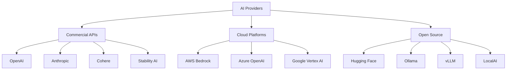

# AI Providers & APIs

<div class="grid cards" markdown>

-   :material-cloud:{ .lg .middle } **Cloud Providers**

    ---

    AWS, Azure, GCP AI services and infrastructure

    [:octicons-arrow-right-24: Cloud Services](cloud/index.md)

-   :material-api:{ .lg .middle } **API Integration**

    ---

    OpenAI, Anthropic, Cohere, and other AI APIs

    [:octicons-arrow-right-24: API Guide](apis/index.md)

-   :material-server:{ .lg .middle } **Self-Hosted**

    ---

    Open-source models and deployment strategies

    [:octicons-arrow-right-24: Self-Hosting](self-hosted/index.md)

-   :material-scale-balance:{ .lg .middle } **Cost Optimization**

    ---

    Pricing strategies and resource management

    [:octicons-arrow-right-24: Cost Management](cost-optimization.md)

</div>

## Learning Objectives

=== "Beginner"
    - [ ] Understand major AI providers
    - [ ] Learn API basics and authentication
    - [ ] Compare provider offerings
    - [ ] Practice with simple integrations

=== "Intermediate"
    - [ ] Implement multi-provider systems
    - [ ] Optimize costs and performance
    - [ ] Handle rate limits and errors
    - [ ] Deploy custom solutions

=== "Advanced"
    - [ ] Build provider abstraction layers
    - [ ] Implement failover strategies
    - [ ] Design cost-efficient architectures
    - [ ] Create hybrid cloud solutions

## Provider Landscape

### Major AI Providers



### Provider Comparison

| Provider | Models | Pricing | Strengths | Use Cases |
|----------|--------|---------|-----------|-----------|
| **OpenAI** | GPT-4, DALL-E, Whisper | Token-based | Leading performance | Production apps |
| **Anthropic** | Claude 3.5 Sonnet | Token-based | Safety, reasoning | Enterprise AI |
| **Google** | Gemini, PaLM | Token-based | Multimodal, search | Google ecosystem |
| **AWS Bedrock** | Multiple models | Token-based | Enterprise features | AWS integration |
| **Cohere** | Command, Embed | Token-based | Enterprise focus | NLP applications |
| **Hugging Face** | 500K+ models | Free/Compute | Open ecosystem | Research, fine-tuning |

## OpenAI Integration

### Complete OpenAI Wrapper

```python
import openai
import asyncio
import time
from typing import List, Dict, Optional, Union
import json
from dataclasses import dataclass
from enum import Enum

class ModelType(Enum):
    GPT_4_TURBO = "gpt-4-turbo-preview"
    GPT_4 = "gpt-4"
    GPT_3_5_TURBO = "gpt-3.5-turbo"
    DALL_E_3 = "dall-e-3"
    WHISPER = "whisper-1"
    TTS = "tts-1"

@dataclass
class ChatMessage:
    role: str
    content: str
    name: Optional[str] = None

class OpenAIProvider:
    def __init__(self, api_key: str, organization: Optional[str] = None):
        self.client = openai.OpenAI(
            api_key=api_key,
            organization=organization
        )
        self.async_client = openai.AsyncOpenAI(
            api_key=api_key,
            organization=organization
        )
        
    def chat_completion(
        self,
        messages: List[ChatMessage],
        model: ModelType = ModelType.GPT_4_TURBO,
        temperature: float = 0.7,
        max_tokens: Optional[int] = None,
        stream: bool = False,
        functions: Optional[List[Dict]] = None
    ):
        """Generate chat completion"""
        try:
            response = self.client.chat.completions.create(
                model=model.value,
                messages=[{"role": msg.role, "content": msg.content} for msg in messages],
                temperature=temperature,
                max_tokens=max_tokens,
                stream=stream,
                functions=functions
            )
            
            if stream:
                return self._handle_stream_response(response)
            else:
                return response.choices[0].message.content
                
        except openai.APIError as e:
            return self._handle_api_error(e)
    
    async def async_chat_completion(
        self,
        messages: List[ChatMessage],
        model: ModelType = ModelType.GPT_4_TURBO,
        **kwargs
    ):
        """Async chat completion"""
        try:
            response = await self.async_client.chat.completions.create(
                model=model.value,
                messages=[{"role": msg.role, "content": msg.content} for msg in messages],
                **kwargs
            )
            return response.choices[0].message.content
        except openai.APIError as e:
            return self._handle_api_error(e)
    
    def generate_image(
        self,
        prompt: str,
        model: str = "dall-e-3",
        size: str = "1024x1024",
        quality: str = "standard",
        n: int = 1
    ):
        """Generate images using DALL-E"""
        try:
            response = self.client.images.generate(
                model=model,
                prompt=prompt,
                size=size,
                quality=quality,
                n=n
            )
            
            return [img.url for img in response.data]
            
        except openai.APIError as e:
            return self._handle_api_error(e)
    
    def transcribe_audio(self, audio_file_path: str, language: Optional[str] = None):
        """Transcribe audio using Whisper"""
        try:
            with open(audio_file_path, "rb") as audio_file:
                response = self.client.audio.transcriptions.create(
                    model="whisper-1",
                    file=audio_file,
                    language=language
                )
            return response.text
            
        except openai.APIError as e:
            return self._handle_api_error(e)
    
    def text_to_speech(
        self,
        text: str,
        voice: str = "alloy",
        model: str = "tts-1",
        output_path: str = "speech.mp3"
    ):
        """Convert text to speech"""
        try:
            response = self.client.audio.speech.create(
                model=model,
                voice=voice,
                input=text
            )
            
            response.stream_to_file(output_path)
            return output_path
            
        except openai.APIError as e:
            return self._handle_api_error(e)
    
    def create_embeddings(self, texts: List[str], model: str = "text-embedding-ada-002"):
        """Create embeddings for texts"""
        try:
            response = self.client.embeddings.create(
                model=model,
                input=texts
            )
            
            return [embedding.embedding for embedding in response.data]
            
        except openai.APIError as e:
            return self._handle_api_error(e)
    
    def _handle_stream_response(self, response):
        """Handle streaming response"""
        for chunk in response:
            if chunk.choices[0].delta.content is not None:
                yield chunk.choices[0].delta.content
    
    def _handle_api_error(self, error):
        """Handle API errors"""
        error_mapping = {
            openai.AuthenticationError: "Authentication failed",
            openai.RateLimitError: "Rate limit exceeded",
            openai.BadRequestError: "Bad request",
            openai.InternalServerError: "Internal server error"
        }
        
        error_type = type(error)
        if error_type in error_mapping:
            return {"error": error_mapping[error_type], "details": str(error)}
        else:
            return {"error": "Unknown error", "details": str(error)}

# Usage examples
openai_provider = OpenAIProvider(api_key="your-api-key")

# Chat completion
messages = [
    ChatMessage(role="system", content="You are a helpful assistant."),
    ChatMessage(role="user", content="Explain quantum computing.")
]
response = openai_provider.chat_completion(messages)

# Async batch processing
async def process_multiple_prompts(prompts):
    tasks = []
    for prompt in prompts:
        messages = [ChatMessage(role="user", content=prompt)]
        task = openai_provider.async_chat_completion(messages)
        tasks.append(task)
    
    results = await asyncio.gather(*tasks)
    return results

# Function calling
functions = [{
    "name": "get_weather",
    "description": "Get current weather",
    "parameters": {
        "type": "object",
        "properties": {
            "location": {"type": "string"}
        }
    }
}]

response = openai_provider.chat_completion(
    messages=messages,
    functions=functions
)
```

### Rate Limiting and Retry Logic

```python
import time
import random
from functools import wraps
import asyncio
from typing import Callable, Any

class RateLimiter:
    def __init__(self, max_requests: int, time_window: int):
        self.max_requests = max_requests
        self.time_window = time_window
        self.requests = []
        
    def wait_if_needed(self):
        """Wait if rate limit would be exceeded"""
        now = time.time()
        
        # Remove old requests outside time window
        self.requests = [req_time for req_time in self.requests 
                        if now - req_time < self.time_window]
        
        # Check if we need to wait
        if len(self.requests) >= self.max_requests:
            sleep_time = self.time_window - (now - self.requests[0])
            if sleep_time > 0:
                time.sleep(sleep_time)
                
        # Record this request
        self.requests.append(now)

def retry_with_exponential_backoff(
    max_retries: int = 3,
    base_delay: float = 1.0,
    max_delay: float = 60.0,
    exponential_base: float = 2.0,
    jitter: bool = True
):
    """Decorator for exponential backoff retry logic"""
    def decorator(func: Callable) -> Callable:
        @wraps(func)
        def wrapper(*args, **kwargs) -> Any:
            for attempt in range(max_retries + 1):
                try:
                    return func(*args, **kwargs)
                except openai.RateLimitError as e:
                    if attempt == max_retries:
                        raise e
                    
                    # Calculate delay
                    delay = min(base_delay * (exponential_base ** attempt), max_delay)
                    
                    # Add jitter
                    if jitter:
                        delay = delay * (0.5 + random.random() * 0.5)
                    
                    print(f"Rate limit hit. Retrying in {delay:.2f} seconds...")
                    time.sleep(delay)
                    
                except (openai.APIError, openai.APIConnectionError) as e:
                    if attempt == max_retries:
                        raise e
                    
                    delay = base_delay * (exponential_base ** attempt)
                    print(f"API error. Retrying in {delay:.2f} seconds...")
                    time.sleep(delay)
                    
            return None
        return wrapper
    return decorator

class RobustOpenAIProvider(OpenAIProvider):
    def __init__(self, api_key: str, rate_limit_rpm: int = 60):
        super().__init__(api_key)
        self.rate_limiter = RateLimiter(rate_limit_rpm, 60)
        
    @retry_with_exponential_backoff(max_retries=3)
    def robust_chat_completion(self, messages: List[ChatMessage], **kwargs):
        """Chat completion with rate limiting and retry logic"""
        self.rate_limiter.wait_if_needed()
        return super().chat_completion(messages, **kwargs)
    
    async def batch_process_with_concurrency(
        self,
        prompts: List[str],
        max_concurrent: int = 5,
        delay_between_batches: float = 1.0
    ):
        """Process prompts in batches with concurrency control"""
        results = []
        
        for i in range(0, len(prompts), max_concurrent):
            batch = prompts[i:i + max_concurrent]
            
            # Create tasks for this batch
            tasks = []
            for prompt in batch:
                messages = [ChatMessage(role="user", content=prompt)]
                task = self.async_chat_completion(messages)
                tasks.append(task)
            
            # Wait for batch to complete
            batch_results = await asyncio.gather(*tasks, return_exceptions=True)
            results.extend(batch_results)
            
            # Delay between batches
            if i + max_concurrent < len(prompts):
                await asyncio.sleep(delay_between_batches)
        
        return results
```

## Anthropic Claude Integration

### Claude Provider Implementation

```python
import anthropic
from typing import List, Dict, Optional, AsyncGenerator

class ClaudeProvider:
    def __init__(self, api_key: str):
        self.client = anthropic.Anthropic(api_key=api_key)
        self.async_client = anthropic.AsyncAnthropic(api_key=api_key)
        
    def chat_completion(
        self,
        messages: List[Dict[str, str]],
        model: str = "claude-3-5-sonnet-20241022",
        max_tokens: int = 1000,
        temperature: float = 0.7,
        system: Optional[str] = None,
        stream: bool = False
    ):
        """Generate chat completion with Claude"""
        try:
            if stream:
                return self._stream_completion(messages, model, max_tokens, temperature, system)
            else:
                response = self.client.messages.create(
                    model=model,
                    max_tokens=max_tokens,
                    temperature=temperature,
                    system=system,
                    messages=messages
                )
                return response.content[0].text
                
        except anthropic.APIError as e:
            return self._handle_error(e)
    
    def _stream_completion(self, messages, model, max_tokens, temperature, system):
        """Handle streaming completion"""
        try:
            with self.client.messages.stream(
                model=model,
                max_tokens=max_tokens,
                temperature=temperature,
                system=system,
                messages=messages
            ) as stream:
                for text in stream.text_stream:
                    yield text
        except anthropic.APIError as e:
            yield self._handle_error(e)
    
    async def async_chat_completion(
        self,
        messages: List[Dict[str, str]],
        model: str = "claude-3-5-sonnet-20241022",
        **kwargs
    ):
        """Async chat completion"""
        try:
            response = await self.async_client.messages.create(
                model=model,
                messages=messages,
                **kwargs
            )
            return response.content[0].text
        except anthropic.APIError as e:
            return self._handle_error(e)
    
    def analyze_document(self, text: str, analysis_type: str = "summary"):
        """Analyze documents with Claude's reasoning capabilities"""
        prompts = {
            "summary": f"Please provide a comprehensive summary of the following document:\n\n{text}",
            "key_points": f"Extract the key points from this document:\n\n{text}",
            "sentiment": f"Analyze the sentiment and tone of this document:\n\n{text}",
            "entities": f"Extract all named entities from this document:\n\n{text}"
        }
        
        prompt = prompts.get(analysis_type, prompts["summary"])
        messages = [{"role": "user", "content": prompt}]
        
        return self.chat_completion(messages)
    
    def code_review(self, code: str, language: str):
        """Perform code review with Claude"""
        system_prompt = f"""You are an expert {language} developer. 
        Review the following code for:
        1. Code quality and style
        2. Potential bugs or issues
        3. Performance optimizations
        4. Security considerations
        5. Suggestions for improvement"""
        
        messages = [{"role": "user", "content": f"```{language}\n{code}\n```"}]
        
        return self.chat_completion(
            messages=messages,
            system=system_prompt,
            max_tokens=2000
        )
    
    def _handle_error(self, error):
        """Handle Anthropic API errors"""
        error_types = {
            anthropic.AuthenticationError: "Authentication failed",
            anthropic.RateLimitError: "Rate limit exceeded",
            anthropic.BadRequestError: "Bad request",
            anthropic.InternalServerError: "Internal server error"
        }
        
        error_type = type(error)
        if error_type in error_types:
            return {"error": error_types[error_type], "details": str(error)}
        else:
            return {"error": "Unknown error", "details": str(error)}

# Usage example
claude = ClaudeProvider(api_key="your-api-key")

# Chat completion
messages = [
    {"role": "user", "content": "Explain the concept of recursion in programming."}
]
response = claude.chat_completion(messages)

# Streaming response
for chunk in claude.chat_completion(messages, stream=True):
    print(chunk, end="", flush=True)

# Document analysis
document = "Your document text here..."
summary = claude.analyze_document(document, "summary")
key_points = claude.analyze_document(document, "key_points")

# Code review
python_code = """
def fibonacci(n):
    if n <= 1:
        return n
    return fibonacci(n-1) + fibonacci(n-2)
"""
review = claude.code_review(python_code, "python")
```

## Multi-Provider Abstraction

### Universal AI Provider Interface

```python
from abc import ABC, abstractmethod
from typing import List, Dict, Any, Optional, Union
from enum import Enum
import asyncio

class ProviderType(Enum):
    OPENAI = "openai"
    ANTHROPIC = "anthropic"
    COHERE = "cohere"
    GOOGLE = "google"
    AWS_BEDROCK = "aws_bedrock"

class AIProvider(ABC):
    """Abstract base class for AI providers"""
    
    @abstractmethod
    def chat_completion(self, messages: List[Dict], **kwargs) -> str:
        pass
    
    @abstractmethod
    async def async_chat_completion(self, messages: List[Dict], **kwargs) -> str:
        pass
    
    @abstractmethod
    def get_available_models(self) -> List[str]:
        pass
    
    @abstractmethod
    def estimate_cost(self, input_tokens: int, output_tokens: int, model: str) -> float:
        pass

class UniversalAIProvider:
    """Universal interface for multiple AI providers"""
    
    def __init__(self):
        self.providers = {}
        self.default_provider = None
        
    def add_provider(self, provider_type: ProviderType, provider: AIProvider, default: bool = False):
        """Add an AI provider"""
        self.providers[provider_type] = provider
        if default or not self.default_provider:
            self.default_provider = provider_type
    
    def chat_completion(
        self,
        messages: List[Dict],
        provider: Optional[ProviderType] = None,
        fallback_providers: Optional[List[ProviderType]] = None,
        **kwargs
    ) -> str:
        """Chat completion with fallback support"""
        provider = provider or self.default_provider
        
        try:
            return self.providers[provider].chat_completion(messages, **kwargs)
        except Exception as e:
            print(f"Primary provider {provider} failed: {e}")
            
            # Try fallback providers
            if fallback_providers:
                for fallback in fallback_providers:
                    if fallback in self.providers:
                        try:
                            print(f"Trying fallback provider: {fallback}")
                            return self.providers[fallback].chat_completion(messages, **kwargs)
                        except Exception as fallback_error:
                            print(f"Fallback provider {fallback} failed: {fallback_error}")
                            continue
            
            raise Exception(f"All providers failed. Last error: {e}")
    
    async def async_chat_completion_with_load_balancing(
        self,
        messages_list: List[List[Dict]],
        providers: List[ProviderType],
        **kwargs
    ) -> List[str]:
        """Distribute requests across multiple providers"""
        tasks = []
        
        for i, messages in enumerate(messages_list):
            provider = providers[i % len(providers)]
            task = self.providers[provider].async_chat_completion(messages, **kwargs)
            tasks.append(task)
        
        results = await asyncio.gather(*tasks, return_exceptions=True)
        return results
    
    def compare_providers(
        self,
        test_messages: List[Dict],
        providers: List[ProviderType],
        metrics: List[str] = ["response_time", "cost", "quality"]
    ) -> Dict[str, Any]:
        """Compare multiple providers on various metrics"""
        results = {}
        
        for provider in providers:
            if provider not in self.providers:
                continue
                
            start_time = time.time()
            
            try:
                response = self.providers[provider].chat_completion(test_messages)
                response_time = time.time() - start_time
                
                # Estimate cost (simplified)
                estimated_cost = self.providers[provider].estimate_cost(
                    input_tokens=100,  # Approximate
                    output_tokens=len(response.split()),
                    model="default"
                )
                
                results[provider.value] = {
                    "response": response,
                    "response_time": response_time,
                    "estimated_cost": estimated_cost,
                    "success": True
                }
                
            except Exception as e:
                results[provider.value] = {
                    "error": str(e),
                    "success": False
                }
        
        return results
    
    def get_best_provider_for_task(self, task_type: str) -> ProviderType:
        """Get the best provider for a specific task"""
        # Task-specific provider recommendations
        task_recommendations = {
            "reasoning": ProviderType.ANTHROPIC,
            "code_generation": ProviderType.OPENAI,
            "creative_writing": ProviderType.ANTHROPIC,
            "summarization": ProviderType.COHERE,
            "embedding": ProviderType.OPENAI,
            "cost_sensitive": ProviderType.COHERE
        }
        
        return task_recommendations.get(task_type, self.default_provider)

# Example implementation for OpenAI
class OpenAIProviderWrapper(AIProvider):
    def __init__(self, api_key: str):
        self.provider = OpenAIProvider(api_key)
        
    def chat_completion(self, messages: List[Dict], **kwargs) -> str:
        chat_messages = [ChatMessage(**msg) for msg in messages]
        return self.provider.chat_completion(chat_messages, **kwargs)
    
    async def async_chat_completion(self, messages: List[Dict], **kwargs) -> str:
        chat_messages = [ChatMessage(**msg) for msg in messages]
        return await self.provider.async_chat_completion(chat_messages, **kwargs)
    
    def get_available_models(self) -> List[str]:
        return [model.value for model in ModelType]
    
    def estimate_cost(self, input_tokens: int, output_tokens: int, model: str) -> float:
        # Simplified cost calculation
        pricing = {
            "gpt-4-turbo-preview": {"input": 0.01, "output": 0.03},
            "gpt-3.5-turbo": {"input": 0.001, "output": 0.002}
        }
        
        model_pricing = pricing.get(model, pricing["gpt-3.5-turbo"])
        return (input_tokens / 1000 * model_pricing["input"] + 
                output_tokens / 1000 * model_pricing["output"])

# Usage example
universal_ai = UniversalAIProvider()

# Add providers
openai_provider = OpenAIProviderWrapper("openai-key")
claude_provider = ClaudeProvider("claude-key")

universal_ai.add_provider(ProviderType.OPENAI, openai_provider, default=True)
universal_ai.add_provider(ProviderType.ANTHROPIC, claude_provider)

# Chat with fallback
messages = [{"role": "user", "content": "Explain machine learning"}]
response = universal_ai.chat_completion(
    messages,
    provider=ProviderType.OPENAI,
    fallback_providers=[ProviderType.ANTHROPIC]
)

# Compare providers
comparison = universal_ai.compare_providers(
    test_messages=messages,
    providers=[ProviderType.OPENAI, ProviderType.ANTHROPIC]
)
```

## AWS Bedrock Integration

### Bedrock Provider Implementation

```python
import boto3
import json
from typing import Dict, List, Any, Optional

class BedrockProvider:
    def __init__(self, region_name: str = "us-east-1"):
        self.client = boto3.client("bedrock-runtime", region_name=region_name)
        self.bedrock_client = boto3.client("bedrock", region_name=region_name)
        
    def get_available_models(self) -> List[Dict[str, Any]]:
        """Get list of available foundation models"""
        try:
            response = self.bedrock_client.list_foundation_models()
            return response.get("modelSummaries", [])
        except Exception as e:
            print(f"Error fetching models: {e}")
            return []
    
    def chat_with_claude(
        self,
        messages: List[Dict[str, str]],
        model_id: str = "anthropic.claude-3-sonnet-20240229-v1:0",
        max_tokens: int = 1000,
        temperature: float = 0.7
    ) -> str:
        """Chat completion using Claude on Bedrock"""
        # Format messages for Claude
        conversation = ""
        for msg in messages:
            if msg["role"] == "user":
                conversation += f"\n\nHuman: {msg['content']}"
            elif msg["role"] == "assistant":
                conversation += f"\n\nAssistant: {msg['content']}"
        
        conversation += "\n\nAssistant:"
        
        # Prepare request body
        body = {
            "prompt": conversation,
            "max_tokens_to_sample": max_tokens,
            "temperature": temperature,
            "stop_sequences": ["\n\nHuman:"]
        }
        
        try:
            response = self.client.invoke_model(
                modelId=model_id,
                body=json.dumps(body),
                contentType="application/json",
                accept="application/json"
            )
            
            response_body = json.loads(response["body"].read())
            return response_body.get("completion", "").strip()
            
        except Exception as e:
            return f"Error: {str(e)}"
    
    def chat_with_llama(
        self,
        prompt: str,
        model_id: str = "meta.llama2-70b-chat-v1",
        max_gen_len: int = 512,
        temperature: float = 0.7,
        top_p: float = 0.9
    ) -> str:
        """Chat completion using Llama on Bedrock"""
        body = {
            "prompt": prompt,
            "max_gen_len": max_gen_len,
            "temperature": temperature,
            "top_p": top_p
        }
        
        try:
            response = self.client.invoke_model(
                modelId=model_id,
                body=json.dumps(body),
                contentType="application/json",
                accept="application/json"
            )
            
            response_body = json.loads(response["body"].read())
            return response_body.get("generation", "").strip()
            
        except Exception as e:
            return f"Error: {str(e)}"
    
    def generate_image_with_stability(
        self,
        prompt: str,
        model_id: str = "stability.stable-diffusion-xl-v1",
        height: int = 512,
        width: int = 512,
        cfg_scale: float = 7.0,
        steps: int = 30
    ) -> Optional[bytes]:
        """Generate image using Stability AI on Bedrock"""
        body = {
            "text_prompts": [{"text": prompt}],
            "height": height,
            "width": width,
            "cfg_scale": cfg_scale,
            "steps": steps
        }
        
        try:
            response = self.client.invoke_model(
                modelId=model_id,
                body=json.dumps(body),
                contentType="application/json",
                accept="application/json"
            )
            
            response_body = json.loads(response["body"].read())
            
            # Decode base64 image
            import base64
            image_data = response_body["artifacts"][0]["base64"]
            return base64.b64decode(image_data)
            
        except Exception as e:
            print(f"Error generating image: {e}")
            return None
    
    def create_embeddings_with_titan(
        self,
        texts: List[str],
        model_id: str = "amazon.titan-embed-text-v1"
    ) -> List[List[float]]:
        """Create embeddings using Titan"""
        embeddings = []
        
        for text in texts:
            body = {"inputText": text}
            
            try:
                response = self.client.invoke_model(
                    modelId=model_id,
                    body=json.dumps(body),
                    contentType="application/json",
                    accept="application/json"
                )
                
                response_body = json.loads(response["body"].read())
                embedding = response_body.get("embedding", [])
                embeddings.append(embedding)
                
            except Exception as e:
                print(f"Error creating embedding for text: {e}")
                embeddings.append([])
        
        return embeddings

# Advanced Bedrock usage
class AdvancedBedrockProvider(BedrockProvider):
    def __init__(self, region_name: str = "us-east-1"):
        super().__init__(region_name)
        self.model_configs = {
            "claude": {
                "model_id": "anthropic.claude-3-sonnet-20240229-v1:0",
                "format_func": self._format_claude_request,
                "parse_func": self._parse_claude_response
            },
            "llama": {
                "model_id": "meta.llama2-70b-chat-v1",
                "format_func": self._format_llama_request,
                "parse_func": self._parse_llama_response
            }
        }
    
    def unified_chat(
        self,
        messages: List[Dict[str, str]],
        model_type: str = "claude",
        **kwargs
    ) -> str:
        """Unified interface for different models"""
        if model_type not in self.model_configs:
            raise ValueError(f"Unsupported model type: {model_type}")
        
        config = self.model_configs[model_type]
        
        # Format request based on model type
        body = config["format_func"](messages, **kwargs)
        
        try:
            response = self.client.invoke_model(
                modelId=config["model_id"],
                body=json.dumps(body),
                contentType="application/json",
                accept="application/json"
            )
            
            response_body = json.loads(response["body"].read())
            return config["parse_func"](response_body)
            
        except Exception as e:
            return f"Error: {str(e)}"
    
    def _format_claude_request(self, messages: List[Dict], **kwargs):
        """Format request for Claude"""
        conversation = ""
        for msg in messages:
            if msg["role"] == "user":
                conversation += f"\n\nHuman: {msg['content']}"
            elif msg["role"] == "assistant":
                conversation += f"\n\nAssistant: {msg['content']}"
        
        conversation += "\n\nAssistant:"
        
        return {
            "prompt": conversation,
            "max_tokens_to_sample": kwargs.get("max_tokens", 1000),
            "temperature": kwargs.get("temperature", 0.7),
            "stop_sequences": ["\n\nHuman:"]
        }
    
    def _parse_claude_response(self, response_body):
        """Parse Claude response"""
        return response_body.get("completion", "").strip()
    
    def _format_llama_request(self, messages: List[Dict], **kwargs):
        """Format request for Llama"""
        # Convert messages to single prompt
        prompt = ""
        for msg in messages:
            prompt += f"{msg['role']}: {msg['content']}\n"
        
        return {
            "prompt": prompt,
            "max_gen_len": kwargs.get("max_tokens", 512),
            "temperature": kwargs.get("temperature", 0.7),
            "top_p": kwargs.get("top_p", 0.9)
        }
    
    def _parse_llama_response(self, response_body):
        """Parse Llama response"""
        return response_body.get("generation", "").strip()

# Usage example
bedrock = AdvancedBedrockProvider()

# List available models
models = bedrock.get_available_models()
print("Available models:", [model["modelName"] for model in models])

# Chat with different models
messages = [{"role": "user", "content": "Explain AWS Bedrock"}]

# Claude response
claude_response = bedrock.unified_chat(messages, model_type="claude")

# Llama response
llama_response = bedrock.unified_chat(messages, model_type="llama")

# Generate image
image_data = bedrock.generate_image_with_stability("A futuristic AI datacenter")
if image_data:
    with open("generated_image.png", "wb") as f:
        f.write(image_data)

# Create embeddings
texts = ["AI is transforming technology", "Machine learning advances rapidly"]
embeddings = bedrock.create_embeddings_with_titan(texts)
```

## Cost Optimization Strategies

### Cost Monitoring and Optimization

```python
import time
from datetime import datetime, timedelta
from typing import Dict, List, Optional
import json

class CostTracker:
    def __init__(self):
        self.usage_log = []
        self.daily_costs = {}
        
    def log_request(
        self,
        provider: str,
        model: str,
        input_tokens: int,
        output_tokens: int,
        cost: float,
        timestamp: Optional[datetime] = None
    ):
        """Log API request for cost tracking"""
        if timestamp is None:
            timestamp = datetime.now()
        
        log_entry = {
            "timestamp": timestamp,
            "provider": provider,
            "model": model,
            "input_tokens": input_tokens,
            "output_tokens": output_tokens,
            "cost": cost
        }
        
        self.usage_log.append(log_entry)
        
        # Update daily costs
        date_key = timestamp.date().isoformat()
        if date_key not in self.daily_costs:
            self.daily_costs[date_key] = 0
        self.daily_costs[date_key] += cost
    
    def get_daily_cost(self, date: Optional[str] = None) -> float:
        """Get cost for specific date"""
        if date is None:
            date = datetime.now().date().isoformat()
        return self.daily_costs.get(date, 0.0)
    
    def get_monthly_cost(self, year: int, month: int) -> float:
        """Get total cost for a month"""
        monthly_cost = 0
        for date_str, cost in self.daily_costs.items():
            date_obj = datetime.fromisoformat(date_str).date()
            if date_obj.year == year and date_obj.month == month:
                monthly_cost += cost
        return monthly_cost
    
    def get_usage_by_provider(self, days: int = 30) -> Dict[str, float]:
        """Get cost breakdown by provider"""
        cutoff_date = datetime.now() - timedelta(days=days)
        provider_costs = {}
        
        for entry in self.usage_log:
            if entry["timestamp"] >= cutoff_date:
                provider = entry["provider"]
                provider_costs[provider] = provider_costs.get(provider, 0) + entry["cost"]
        
        return provider_costs
    
    def alert_if_over_budget(self, daily_budget: float, monthly_budget: float):
        """Check if usage exceeds budget"""
        today_cost = self.get_daily_cost()
        if today_cost > daily_budget:
            print(f"⚠️ Daily budget exceeded! Current: ${today_cost:.2f}, Budget: ${daily_budget:.2f}")
        
        current_month = datetime.now()
        monthly_cost = self.get_monthly_cost(current_month.year, current_month.month)
        if monthly_cost > monthly_budget:
            print(f"⚠️ Monthly budget exceeded! Current: ${monthly_cost:.2f}, Budget: ${monthly_budget:.2f}")

class CostOptimizer:
    def __init__(self, cost_tracker: CostTracker):
        self.cost_tracker = cost_tracker
        
    def suggest_model_optimization(self, usage_data: List[Dict]) -> Dict[str, str]:
        """Suggest model optimizations based on usage"""
        suggestions = {}
        
        # Analyze model usage patterns
        model_stats = {}
        for entry in usage_data:
            model = entry["model"]
            if model not in model_stats:
                model_stats[model] = {"count": 0, "total_cost": 0, "avg_tokens": 0}
            
            model_stats[model]["count"] += 1
            model_stats[model]["total_cost"] += entry["cost"]
            model_stats[model]["avg_tokens"] += entry["input_tokens"] + entry["output_tokens"]
        
        # Calculate averages
        for model, stats in model_stats.items():
            if stats["count"] > 0:
                stats["avg_cost"] = stats["total_cost"] / stats["count"]
                stats["avg_tokens"] = stats["avg_tokens"] / stats["count"]
        
        # Generate suggestions
        for model, stats in model_stats.items():
            if "gpt-4" in model and stats["avg_tokens"] < 500:
                suggestions[model] = "Consider using GPT-3.5-turbo for shorter requests"
            elif stats["avg_cost"] > 0.05:
                suggestions[model] = "Consider batching requests or using a cheaper model"
        
        return suggestions
    
    def recommend_provider_switch(self, task_type: str, current_cost: float) -> Optional[str]:
        """Recommend provider switch for cost savings"""
        # Cost comparison matrix (simplified)
        provider_costs = {
            "simple_tasks": {
                "openai_gpt35": 0.002,
                "anthropic_haiku": 0.00025,
                "cohere_command": 0.001
            },
            "complex_tasks": {
                "openai_gpt4": 0.03,
                "anthropic_sonnet": 0.003,
                "claude_opus": 0.015
            }
        }
        
        if task_type in provider_costs:
            cheapest_provider = min(
                provider_costs[task_type].items(),
                key=lambda x: x[1]
            )
            
            if cheapest_provider[1] < current_cost * 0.7:  # 30% savings threshold
                return f"Switch to {cheapest_provider[0]} for 70% cost reduction"
        
        return None

class IntelligentCaching:
    def __init__(self, max_cache_size: int = 1000):
        self.cache = {}
        self.cache_hits = 0
        self.cache_misses = 0
        self.max_size = max_cache_size
        
    def _hash_request(self, messages: List[Dict], model: str, **kwargs) -> str:
        """Create hash for caching"""
        import hashlib
        request_str = json.dumps({
            "messages": messages,
            "model": model,
            **kwargs
        }, sort_keys=True)
        return hashlib.md5(request_str.encode()).hexdigest()
    
    def get_cached_response(self, messages: List[Dict], model: str, **kwargs) -> Optional[str]:
        """Get cached response if available"""
        cache_key = self._hash_request(messages, model, **kwargs)
        
        if cache_key in self.cache:
            self.cache_hits += 1
            return self.cache[cache_key]["response"]
        
        self.cache_misses += 1
        return None
    
    def cache_response(self, messages: List[Dict], model: str, response: str, **kwargs):
        """Cache response"""
        cache_key = self._hash_request(messages, model, **kwargs)
        
        # Implement LRU eviction if cache is full
        if len(self.cache) >= self.max_size:
            oldest_key = min(self.cache.keys(), key=lambda k: self.cache[k]["timestamp"])
            del self.cache[oldest_key]
        
        self.cache[cache_key] = {
            "response": response,
            "timestamp": time.time()
        }
    
    def get_cache_stats(self) -> Dict[str, Any]:
        """Get cache performance statistics"""
        total_requests = self.cache_hits + self.cache_misses
        hit_rate = self.cache_hits / total_requests if total_requests > 0 else 0
        
        return {
            "hit_rate": hit_rate,
            "total_hits": self.cache_hits,
            "total_misses": self.cache_misses,
            "cache_size": len(self.cache)
        }

# Cost-optimized provider wrapper
class CostOptimizedProvider:
    def __init__(self, provider: AIProvider, cost_tracker: CostTracker):
        self.provider = provider
        self.cost_tracker = cost_tracker
        self.cache = IntelligentCaching()
        self.optimizer = CostOptimizer(cost_tracker)
        
    def chat_completion_with_optimization(
        self,
        messages: List[Dict],
        model: str,
        use_cache: bool = True,
        **kwargs
    ) -> str:
        """Chat completion with cost optimization"""
        # Check cache first
        if use_cache:
            cached_response = self.cache.get_cached_response(messages, model, **kwargs)
            if cached_response:
                return cached_response
        
        # Get response from provider
        response = self.provider.chat_completion(messages, model=model, **kwargs)
        
        # Estimate and log cost
        input_tokens = sum(len(msg["content"].split()) for msg in messages)
        output_tokens = len(response.split())
        cost = self.provider.estimate_cost(input_tokens, output_tokens, model)
        
        self.cost_tracker.log_request(
            provider=self.provider.__class__.__name__,
            model=model,
            input_tokens=input_tokens,
            output_tokens=output_tokens,
            cost=cost
        )
        
        # Cache response
        if use_cache:
            self.cache.cache_response(messages, model, response, **kwargs)
        
        return response
    
    def get_optimization_report(self) -> Dict[str, Any]:
        """Generate cost optimization report"""
        cache_stats = self.cache.get_cache_stats()
        usage_data = self.cost_tracker.usage_log[-100:]  # Last 100 requests
        suggestions = self.optimizer.suggest_model_optimization(usage_data)
        
        return {
            "cache_performance": cache_stats,
            "optimization_suggestions": suggestions,
            "recent_usage": usage_data[-10:]  # Last 10 requests
        }

# Example usage
cost_tracker = CostTracker()
optimized_provider = CostOptimizedProvider(openai_provider, cost_tracker)

# Make requests with optimization
messages = [{"role": "user", "content": "Hello, how are you?"}]
response = optimized_provider.chat_completion_with_optimization(
    messages, 
    model="gpt-3.5-turbo",
    use_cache=True
)

# Check costs and get optimization report
cost_tracker.alert_if_over_budget(daily_budget=10.0, monthly_budget=300.0)
report = optimized_provider.get_optimization_report()
print("Optimization Report:", json.dumps(report, indent=2, default=str))
```

## Best Practices

### Production Deployment Strategies

```python
import os
import logging
from typing import Dict, List, Optional, Callable
import asyncio
from dataclasses import dataclass
from functools import wraps

@dataclass
class ProviderConfig:
    api_key: str
    rate_limit: int
    timeout: int
    retry_attempts: int
    cost_per_token: float

class ProductionAIService:
    def __init__(self, config_file: str):
        self.config = self._load_config(config_file)
        self.providers = self._initialize_providers()
        self.circuit_breaker = CircuitBreaker()
        self.metrics_collector = MetricsCollector()
        
        # Setup logging
        logging.basicConfig(level=logging.INFO)
        self.logger = logging.getLogger(__name__)
        
    def _load_config(self, config_file: str) -> Dict:
        """Load configuration from file"""
        import yaml
        with open(config_file, 'r') as f:
            return yaml.safe_load(f)
    
    def _initialize_providers(self) -> Dict[str, AIProvider]:
        """Initialize all configured providers"""
        providers = {}
        
        for provider_name, provider_config in self.config.get("providers", {}).items():
            if provider_name == "openai":
                providers[provider_name] = OpenAIProvider(provider_config["api_key"])
            elif provider_name == "anthropic":
                providers[provider_name] = ClaudeProvider(provider_config["api_key"])
            # Add more providers as needed
        
        return providers
    
    async def smart_completion(
        self,
        messages: List[Dict],
        task_type: str = "general",
        max_cost: float = 0.10,
        quality_threshold: float = 0.8
    ) -> Dict[str, any]:
        """Intelligent completion with cost and quality optimization"""
        
        # Select best provider for task
        provider_name = self._select_optimal_provider(task_type, max_cost)
        
        try:
            # Execute with circuit breaker protection
            with self.circuit_breaker.protect(provider_name):
                start_time = time.time()
                
                response = await self.providers[provider_name].async_chat_completion(messages)
                
                response_time = time.time() - start_time
                
                # Collect metrics
                self.metrics_collector.record_request(
                    provider=provider_name,
                    response_time=response_time,
                    success=True
                )
                
                return {
                    "response": response,
                    "provider": provider_name,
                    "response_time": response_time,
                    "estimated_cost": self._estimate_cost(messages, response, provider_name)
                }
                
        except Exception as e:
            self.logger.error(f"Request failed for provider {provider_name}: {e}")
            
            # Try fallback provider
            fallback_provider = self._get_fallback_provider(provider_name)
            if fallback_provider:
                return await self.smart_completion(
                    messages, task_type, max_cost, quality_threshold
                )
            
            raise e
    
    def _select_optimal_provider(self, task_type: str, max_cost: float) -> str:
        """Select optimal provider based on task and constraints"""
        # Task-specific provider selection logic
        task_preferences = {
            "reasoning": ["anthropic", "openai"],
            "creative": ["anthropic", "openai"],
            "code": ["openai", "anthropic"],
            "simple": ["cohere", "openai"]
        }
        
        preferred_providers = task_preferences.get(task_type, list(self.providers.keys()))
        
        # Filter by cost constraint
        affordable_providers = []
        for provider in preferred_providers:
            if provider in self.providers:
                avg_cost = self.metrics_collector.get_average_cost(provider)
                if avg_cost <= max_cost:
                    affordable_providers.append(provider)
        
        # Select based on recent performance
        if affordable_providers:
            return self.metrics_collector.get_best_performing_provider(affordable_providers)
        else:
            return preferred_providers[0] if preferred_providers else list(self.providers.keys())[0]

class CircuitBreaker:
    """Circuit breaker for provider resilience"""
    
    def __init__(self, failure_threshold: int = 5, recovery_timeout: int = 60):
        self.failure_threshold = failure_threshold
        self.recovery_timeout = recovery_timeout
        self.provider_states = {}
    
    def protect(self, provider_name: str):
        """Context manager for circuit breaker protection"""
        return CircuitBreakerContext(self, provider_name)
    
    def record_success(self, provider_name: str):
        """Record successful request"""
        if provider_name in self.provider_states:
            self.provider_states[provider_name]["failures"] = 0
    
    def record_failure(self, provider_name: str):
        """Record failed request"""
        if provider_name not in self.provider_states:
            self.provider_states[provider_name] = {"failures": 0, "last_failure": None}
        
        self.provider_states[provider_name]["failures"] += 1
        self.provider_states[provider_name]["last_failure"] = time.time()
    
    def is_open(self, provider_name: str) -> bool:
        """Check if circuit is open (provider unavailable)"""
        if provider_name not in self.provider_states:
            return False
        
        state = self.provider_states[provider_name]
        
        # Check if we should reset after timeout
        if (state["last_failure"] and 
            time.time() - state["last_failure"] > self.recovery_timeout):
            state["failures"] = 0
            return False
        
        return state["failures"] >= self.failure_threshold

class CircuitBreakerContext:
    def __init__(self, circuit_breaker: CircuitBreaker, provider_name: str):
        self.circuit_breaker = circuit_breaker
        self.provider_name = provider_name
    
    def __enter__(self):
        if self.circuit_breaker.is_open(self.provider_name):
            raise Exception(f"Circuit breaker open for {self.provider_name}")
        return self
    
    def __exit__(self, exc_type, exc_val, exc_tb):
        if exc_type is None:
            self.circuit_breaker.record_success(self.provider_name)
        else:
            self.circuit_breaker.record_failure(self.provider_name)

class MetricsCollector:
    """Collect and analyze performance metrics"""
    
    def __init__(self):
        self.metrics = {}
    
    def record_request(
        self,
        provider: str,
        response_time: float,
        success: bool,
        cost: float = 0.0
    ):
        """Record request metrics"""
        if provider not in self.metrics:
            self.metrics[provider] = {
                "requests": 0,
                "successes": 0,
                "total_response_time": 0.0,
                "total_cost": 0.0
            }
        
        metrics = self.metrics[provider]
        metrics["requests"] += 1
        metrics["total_response_time"] += response_time
        metrics["total_cost"] += cost
        
        if success:
            metrics["successes"] += 1
    
    def get_success_rate(self, provider: str) -> float:
        """Get success rate for provider"""
        if provider not in self.metrics:
            return 0.0
        
        metrics = self.metrics[provider]
        if metrics["requests"] == 0:
            return 0.0
        
        return metrics["successes"] / metrics["requests"]
    
    def get_average_response_time(self, provider: str) -> float:
        """Get average response time for provider"""
        if provider not in self.metrics:
            return 0.0
        
        metrics = self.metrics[provider]
        if metrics["requests"] == 0:
            return 0.0
        
        return metrics["total_response_time"] / metrics["requests"]
    
    def get_average_cost(self, provider: str) -> float:
        """Get average cost per request for provider"""
        if provider not in self.metrics:
            return 0.0
        
        metrics = self.metrics[provider]
        if metrics["requests"] == 0:
            return 0.0
        
        return metrics["total_cost"] / metrics["requests"]
    
    def get_best_performing_provider(self, providers: List[str]) -> str:
        """Get best performing provider based on composite score"""
        best_provider = providers[0]
        best_score = 0.0
        
        for provider in providers:
            success_rate = self.get_success_rate(provider)
            avg_response_time = self.get_average_response_time(provider)
            
            # Composite score (higher is better)
            # Prioritize success rate, penalize slow response times
            score = success_rate * 100 - min(avg_response_time, 10) * 5
            
            if score > best_score:
                best_score = score
                best_provider = provider
        
        return best_provider

# Example configuration file (config.yaml)
config_yaml = """
providers:
  openai:
    api_key: "${OPENAI_API_KEY}"
    rate_limit: 60
    timeout: 30
    retry_attempts: 3
    cost_per_token: 0.002
  
  anthropic:
    api_key: "${ANTHROPIC_API_KEY}"
    rate_limit: 40
    timeout: 30
    retry_attempts: 3
    cost_per_token: 0.003

circuit_breaker:
  failure_threshold: 5
  recovery_timeout: 60

cost_limits:
  daily_budget: 100.0
  monthly_budget: 2000.0
  max_per_request: 1.0
"""

# Usage example
async def main():
    # Initialize production service
    ai_service = ProductionAIService("config.yaml")
    
    # Smart completion with optimization
    messages = [{"role": "user", "content": "Analyze this business proposal"}]
    
    result = await ai_service.smart_completion(
        messages=messages,
        task_type="reasoning",
        max_cost=0.50,
        quality_threshold=0.8
    )
    
    print(f"Response: {result['response']}")
    print(f"Provider: {result['provider']}")
    print(f"Cost: ${result['estimated_cost']:.4f}")
    print(f"Response time: {result['response_time']:.2f}s")

# Run the example
# asyncio.run(main())
```

---

*Next: [MLOps & AIOps](../mlops-aiops/index.md) | [Advanced Topics](../advanced/index.md)*
