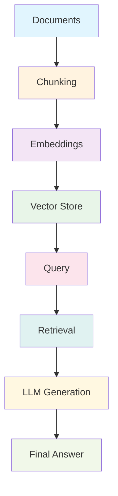

# RAG Core Concepts: The Building Blocks

!!! tip "🧩 Understanding the Pieces"
    Before building RAG systems, let's understand the fundamental components that make it all work. Think of these as the essential tools in your RAG toolkit!

## 🎯 The RAG Pipeline Deep Dive

### 🔄 The Complete Journey



Let's explore each component step by step, understanding **why** they exist and **how** they work together.

## 🔤 Embeddings: Teaching Machines to Understand Meaning

### 📖 The Language Translation Story

=== "🌟 The Magic of Embeddings"

    **The Challenge:** Computers understand numbers, humans understand words. How do we bridge this gap?
    
    **The Solution:** Transform words and sentences into numerical vectors that capture their meaning.
    
    **Real-World Analogy - The Universal Translator:**
    Think of embeddings like a universal translator that converts different languages into a common mathematical language:
    
    ```
    English: "The cat sat on the mat"
    French: "Le chat s'est assis sur le tapis"
    Spanish: "El gato se sentó en la alfombra"
    
    All become: [0.2, -0.1, 0.8, 0.3, -0.5, 0.9, ...]
    ```
    
    **Why This Works:**
    - 🎯 **Similar meanings** → Similar vectors
    - 🔍 **Semantic search** becomes possible
    - 🌍 **Language independence** (with multilingual models)
    - 📊 **Mathematical operations** on meanings

=== "🎭 Types of Embeddings"

    **📝 Text Embeddings (The Wordsmiths)**
    
    | **Type** | **Best For** | **Pros** | **Cons** | **When to Use** |
    |----------|-------------|----------|----------|-----------------|
    | **Word2Vec** | Simple tasks | Fast, lightweight | No context awareness | Basic similarity tasks |
    | **GloVe** | General purpose | Good global statistics | Static representations | Academic research |
    | **BERT** | Understanding tasks | Contextual, bidirectional | Large, slower | Q&A, classification |
    | **Sentence-BERT** | Sentence similarity | Optimized for sentences | Domain-specific training | RAG retrieval |
    | **OpenAI Ada-002** | General RAG | High quality, versatile | Cost per API call | Production RAG |
    | **E5** | Multilingual | Great performance, free | Requires hosting | Self-hosted RAG |
    
    **🖼️ Multimodal Embeddings (The Artists)**
    
    | **Type** | **Handles** | **Best For** | **Examples** |
    |----------|-------------|--------------|--------------|
    | **CLIP** | Text + Images | Visual search | OpenAI CLIP |
    | **ALIGN** | Text + Images | Multimodal retrieval | Google ALIGN |
    | **ImageBind** | Text + Images + Audio | Rich media RAG | Meta ImageBind |
    | **Custom** | Domain-specific | Specialized tasks | Medical images + text |

=== "🔬 Understanding Embedding Quality"

    **What Makes Good Embeddings:**
    
    ```python
    # Example: Good embeddings show clear relationships
    similarity_scores = {
        "cat" vs "dog": 0.85,        # High (both animals)
        "cat" vs "feline": 0.92,     # Very high (synonyms)
        "cat" vs "car": 0.15,        # Low (unrelated)
        "run" vs "sprint": 0.78,     # High (similar actions)
        "run" vs "execute": 0.45     # Medium (context-dependent)
    }
    ```
    
    **Quality Indicators:**
    - 🎯 **Semantic similarity** is preserved
    - 🔄 **Contextual understanding** (same word, different meanings)
    - 🌍 **Domain relevance** (specialized vocabulary)
    - 📊 **Dimensionality** (higher isn't always better)

=== "💻 Practical Implementation"

    ```python
    import numpy as np
    from sentence_transformers import SentenceTransformer
    import openai
    
    class EmbeddingComparison:
        """Compare different embedding approaches for RAG"""
        
        def __init__(self):
            # Load different embedding models
            self.sentence_bert = SentenceTransformer('all-MiniLM-L6-v2')
            self.openai_client = openai.OpenAI()
        
        def get_sentence_bert_embedding(self, text):
            """Free, local embedding model"""
            return self.sentence_bert.encode(text)
        
        def get_openai_embedding(self, text):
            """High-quality commercial embedding"""
            response = self.openai_client.embeddings.create(
                model="text-embedding-3-small",
                input=text
            )
            return np.array(response.data[0].embedding)
        
        def compare_embeddings(self, text1, text2):
            """Compare how different models handle similarity"""
            # Get embeddings from both models
            bert_emb1 = self.get_sentence_bert_embedding(text1)
            bert_emb2 = self.get_sentence_bert_embedding(text2)
            
            openai_emb1 = self.get_openai_embedding(text1)
            openai_emb2 = self.get_openai_embedding(text2)
            
            # Calculate similarities
            bert_sim = np.dot(bert_emb1, bert_emb2) / (
                np.linalg.norm(bert_emb1) * np.linalg.norm(bert_emb2)
            )
            openai_sim = np.dot(openai_emb1, openai_emb2) / (
                np.linalg.norm(openai_emb1) * np.linalg.norm(openai_emb2)
            )
            
            return {
                "sentence_bert": bert_sim,
                "openai": openai_sim,
                "difference": abs(bert_sim - openai_sim)
            }
    
    # Example usage
    embedder = EmbeddingComparison()
    
    # Test semantic similarity
    results = embedder.compare_embeddings(
        "The cat sat on the mat",
        "A feline rested on the rug"
    )
    
    print("Similarity Comparison:")
    print(f"Sentence-BERT: {results['sentence_bert']:.3f}")
    print(f"OpenAI: {results['openai']:.3f}")
    print(f"Difference: {results['difference']:.3f}")
    ```

## ✂️ Chunking: Breaking Down Knowledge

### 📚 The Art of Information Chunking

=== "🎯 Why Chunking Matters"

    **The Problem:** Documents are huge, embeddings work best with focused content
    
    **The Solution:** Break documents into smaller, meaningful pieces
    
    **Real-World Analogy - The Encyclopedia Editor:**
    
    ```
    Original: War and Peace (587,287 words)
    ↓
    Chunks: 2,349 pieces (~250 words each)
    ↓
    Result: Each chunk focuses on one topic/scene
    ```
    
    **Why This Works:**
    - 🎯 **Focused retrieval** - Get exactly what you need
    - 🧠 **Better embeddings** - Clearer semantic meaning
    - ⚡ **Faster processing** - Smaller pieces to handle
    - 💰 **Cost efficiency** - Send only relevant parts to LLM

=== "🔧 Chunking Strategies"

    **📏 Fixed-Size Chunking (The Simple Approach)**
    
    ```python
    def fixed_size_chunking(text, chunk_size=500, overlap=50):
        """
        Split text into fixed-size chunks with overlap
        Good for: General purpose, consistent processing
        """
        chunks = []
        start = 0
        
        while start < len(text):
            end = start + chunk_size
            chunk = text[start:end]
            chunks.append(chunk)
            start = end - overlap  # Overlap to maintain context
        
        return chunks
    
    # Example usage
    text = "Your long document here..."
    chunks = fixed_size_chunking(text, chunk_size=300, overlap=50)
    print(f"Created {len(chunks)} chunks")
    ```
    
    **✅ Pros:** Simple, predictable, fast
    **❌ Cons:** May break sentences/paragraphs mid-thought
    **🎯 Best for:** Uniform content, simple implementation
    
    ---
    
    **📖 Semantic Chunking (The Smart Approach)**
    
    ```python
    from transformers import AutoTokenizer, AutoModel
    import torch
    
    class SemanticChunker:
        """
        Chunk text based on semantic similarity
        Keeps related content together
        """
        def __init__(self, model_name='sentence-transformers/all-MiniLM-L6-v2'):
            self.tokenizer = AutoTokenizer.from_pretrained(model_name)
            self.model = AutoModel.from_pretrained(model_name)
        
        def get_sentence_embeddings(self, sentences):
            """Get embeddings for a list of sentences"""
            inputs = self.tokenizer(sentences, return_tensors='pt', 
                                  padding=True, truncation=True)
            with torch.no_grad():
                outputs = self.model(**inputs)
            return outputs.last_hidden_state.mean(dim=1)
        
        def semantic_chunking(self, text, similarity_threshold=0.7):
            """
            Group sentences based on semantic similarity
            """
            # Split into sentences
            sentences = text.split('. ')
            
            # Get embeddings
            embeddings = self.get_sentence_embeddings(sentences)
            
            # Group similar sentences
            chunks = []
            current_chunk = [sentences[0]]
            
            for i in range(1, len(sentences)):
                similarity = torch.cosine_similarity(
                    embeddings[i-1].unsqueeze(0),
                    embeddings[i].unsqueeze(0)
                ).item()
                
                if similarity > similarity_threshold:
                    current_chunk.append(sentences[i])
                else:
                    # Start new chunk
                    chunks.append('. '.join(current_chunk))
                    current_chunk = [sentences[i]]
            
            # Add final chunk
            chunks.append('. '.join(current_chunk))
            return chunks
    
    # Example usage
    chunker = SemanticChunker()
    semantic_chunks = chunker.semantic_chunking(your_text)
    ```
    
    **✅ Pros:** Keeps related content together, better context
    **❌ Cons:** More complex, variable chunk sizes
    **🎯 Best for:** Narrative text, maintaining context
    
    ---
    
    **🏗️ Structural Chunking (The Organized Approach)**
    
    ```python
    import markdown
    from bs4 import BeautifulSoup
    
    def structural_chunking(markdown_text):
        """
        Chunk based on document structure (headers, paragraphs)
        Perfect for structured documents
        """
        # Convert markdown to HTML
        html = markdown.markdown(markdown_text)
        soup = BeautifulSoup(html, 'html.parser')
        
        chunks = []
        current_section = ""
        current_header = ""
        
        for element in soup.find_all(['h1', 'h2', 'h3', 'h4', 'h5', 'h6', 'p']):
            if element.name.startswith('h'):
                # New section
                if current_section:
                    chunks.append({
                        'header': current_header,
                        'content': current_section.strip(),
                        'level': element.name
                    })
                current_header = element.get_text()
                current_section = ""
            else:
                # Add paragraph to current section
                current_section += element.get_text() + "\\n"
        
        # Add final section
        if current_section:
            chunks.append({
                'header': current_header,
                'content': current_section.strip(),
                'level': 'content'
            })
        
        return chunks
    
    # Example usage
    markdown_doc = """
    # Introduction
    This is the introduction section...
    
    ## Key Concepts
    Here are the main concepts...
    
    ### Concept 1
    Details about concept 1...
    """
    
    structured_chunks = structural_chunking(markdown_doc)
    for chunk in structured_chunks:
        print(f"Header: {chunk['header']}")
        print(f"Content: {chunk['content'][:100]}...")
        print("---")
    ```
    
    **✅ Pros:** Respects document structure, maintains hierarchy
    **❌ Cons:** Requires structured input, variable sizes
    **🎯 Best for:** Documentation, reports, structured content

=== "🎯 Chunking Strategy Selection"

    **Decision Tree for Chunking:**
    
    ```
    📊 What type of content do you have?
    
    ├── 📄 Unstructured text (books, articles)
    │   ├── 🔄 Need consistent processing
    │   │   └── ✅ Use FIXED-SIZE chunking
    │   └── 🎯 Need context preservation
    │       └── ✅ Use SEMANTIC chunking
    │
    ├── 🏗️ Structured content (docs, reports)
    │   └── ✅ Use STRUCTURAL chunking
    │
    └── 🔄 Mixed content
        └── ✅ Use HYBRID approach
    ```
    
    **Performance Comparison:**
    
    | **Strategy** | **Speed** | **Context** | **Consistency** | **Best For** |
    |--------------|-----------|-------------|-----------------|--------------|
    | **Fixed-Size** | ⚡⚡⚡ | 🎯🎯 | ⭐⭐⭐ | General purpose |
    | **Semantic** | ⚡⚡ | 🎯🎯🎯 | ⭐⭐ | Narrative content |
    | **Structural** | ⚡⚡⚡ | 🎯🎯🎯 | ⭐⭐⭐ | Documentation |
    | **Hybrid** | ⚡ | 🎯🎯🎯 | ⭐⭐ | Complex documents |

## 🗄️ Vector Stores: The Smart Filing System

### 📚 The Digital Library Revolution

=== "🎯 Why Vector Stores Matter"

    **Traditional Search (Keyword Matching):**
    ```
    Query: "How to fix a broken faucet"
    Results: Documents containing "fix", "broken", "faucet"
    Problem: Misses "repair", "leaky", "tap"
    ```
    
    **Vector Search (Semantic Understanding):**
    ```
    Query: "How to fix a broken faucet"
    Results: Documents about plumbing repairs, even if they use
             different words like "repair leaky tap"
    Magic: Understands meaning, not just words
    ```
    
    **The Power of Vectors:**
    - 🧠 **Semantic search** - Find meaning, not just keywords
    - ⚡ **Fast retrieval** - Optimized for similarity search
    - 📊 **Scalable** - Handle millions of documents
    - 🔄 **Flexible** - Add/update/delete documents easily

=== "🛠️ Vector Store Technologies"

    **🏠 Local/Embedded Solutions**
    
    | **Technology** | **Best For** | **Pros** | **Cons** | **When to Use** |
    |---------------|-------------|----------|----------|-----------------|
    | **FAISS** | Research, prototyping | Free, fast, flexible | No built-in persistence | Academic projects |
    | **Chroma** | Small to medium apps | Easy to use, persistent | Limited enterprise features | Startups, prototypes |
    | **Weaviate** | Production apps | Full-featured, scalable | Complex setup | Mid-size companies |
    | **Qdrant** | High-performance apps | Rust-based, very fast | Newer ecosystem | Performance-critical apps |
    
    **☁️ Cloud/Managed Solutions**
    
    | **Service** | **Provider** | **Best For** | **Pricing** | **Key Features** |
    |------------|-------------|-------------|-------------|------------------|
    | **Pinecone** | Pinecone | Production RAG | Pay-per-use | Managed, scalable |
    | **Weaviate Cloud** | Weaviate | Enterprise | Subscription | Full-featured |
    | **OpenSearch** | AWS | AWS ecosystem | AWS pricing | Integrated services |
    | **Vertex AI** | Google | Google Cloud | GCP pricing | AI platform integration |

=== "💻 Hands-On Implementation"

    **🔧 FAISS - The Research Favorite**
    
    ```python
    import faiss
    import numpy as np
    from sentence_transformers import SentenceTransformer
    
    class FAISSVectorStore:
        """
        Simple FAISS-based vector store for RAG
        Perfect for research and prototyping
        """
        def __init__(self, model_name='all-MiniLM-L6-v2'):
            self.model = SentenceTransformer(model_name)
            self.dimension = self.model.get_sentence_embedding_dimension()
            self.index = faiss.IndexFlatIP(self.dimension)  # Inner product index
            self.texts = []
            self.metadata = []
        
        def add_texts(self, texts, metadata=None):
            """Add texts to the vector store"""
            embeddings = self.model.encode(texts)
            
            # Normalize embeddings for cosine similarity
            faiss.normalize_L2(embeddings)
            
            # Add to index
            self.index.add(embeddings.astype('float32'))
            
            # Store original texts and metadata
            self.texts.extend(texts)
            if metadata:
                self.metadata.extend(metadata)
            else:
                self.metadata.extend([{}] * len(texts))
        
        def search(self, query, k=5):
            """Search for similar texts"""
            query_embedding = self.model.encode([query])
            faiss.normalize_L2(query_embedding)
            
            # Search
            scores, indices = self.index.search(query_embedding.astype('float32'), k)
            
            # Return results
            results = []
            for score, idx in zip(scores[0], indices[0]):
                if idx < len(self.texts):  # Valid index
                    results.append({
                        'text': self.texts[idx],
                        'score': float(score),
                        'metadata': self.metadata[idx]
                    })
            
            return results
    
    # Example usage
    vector_store = FAISSVectorStore()
    
    # Add documents
    documents = [
        "The quick brown fox jumps over the lazy dog",
        "A fox is a small carnivorous mammal",
        "Dogs are loyal companions to humans",
        "Machine learning is a subset of artificial intelligence",
        "Vector databases enable semantic search"
    ]
    
    vector_store.add_texts(documents)
    
    # Search
    results = vector_store.search("What is a fox?", k=2)
    for result in results:
        print(f"Score: {result['score']:.3f}")
        print(f"Text: {result['text']}")
        print("---")
    ```
    
    **🎨 Chroma - The User-Friendly Choice**
    
    ```python
    import chromadb
    from chromadb.utils import embedding_functions
    
    class ChromaVectorStore:
        """
        Chroma-based vector store - easy to use with persistence
        Great for production applications
        """
        def __init__(self, collection_name="rag_collection"):
            # Initialize Chroma client
            self.client = chromadb.PersistentClient(path="./chroma_db")
            
            # Create embedding function
            self.embedding_function = embedding_functions.SentenceTransformerEmbeddingFunction(
                model_name="all-MiniLM-L6-v2"
            )
            
            # Get or create collection
            self.collection = self.client.get_or_create_collection(
                name=collection_name,
                embedding_function=self.embedding_function
            )
        
        def add_documents(self, documents, metadata=None, ids=None):
            """Add documents to the collection"""
            if ids is None:
                ids = [f"doc_{i}" for i in range(len(documents))]
            
            self.collection.add(
                documents=documents,
                metadatas=metadata,
                ids=ids
            )
        
        def search(self, query, n_results=5):
            """Search for similar documents"""
            results = self.collection.query(
                query_texts=[query],
                n_results=n_results
            )
            
            return {
                'documents': results['documents'][0],
                'distances': results['distances'][0],
                'metadatas': results['metadatas'][0]
            }
        
        def get_collection_info(self):
            """Get information about the collection"""
            return {
                'count': self.collection.count(),
                'name': self.collection.name
            }
    
    # Example usage
    chroma_store = ChromaVectorStore()
    
    # Add documents with metadata
    documents = [
        "RAG systems combine retrieval and generation",
        "Vector databases store embeddings for fast search",
        "Chunking breaks documents into smaller pieces",
        "Embeddings convert text to numerical vectors"
    ]
    
    metadata = [
        {"topic": "RAG", "difficulty": "intermediate"},
        {"topic": "Vector DB", "difficulty": "beginner"},
        {"topic": "Preprocessing", "difficulty": "beginner"},
        {"topic": "Embeddings", "difficulty": "intermediate"}
    ]
    
    chroma_store.add_documents(documents, metadata)
    
    # Search
    results = chroma_store.search("How do vector databases work?", n_results=2)
    
    for i, (doc, distance, meta) in enumerate(zip(
        results['documents'], results['distances'], results['metadatas']
    )):
        print(f"Result {i+1}:")
        print(f"Document: {doc}")
        print(f"Distance: {distance:.3f}")
        print(f"Metadata: {meta}")
        print("---")
    ```

=== "🚀 Production Considerations"

    **🔧 Choosing the Right Vector Store:**
    
    ```python
    def choose_vector_store(requirements):
        """
        Decision helper for vector store selection
        """
        recommendations = []
        
        if requirements.get('budget') == 'free':
            recommendations.append('FAISS or Chroma')
        
        if requirements.get('scale') == 'large':
            recommendations.append('Pinecone or Weaviate Cloud')
        
        if requirements.get('on_premise', False):
            recommendations.append('Weaviate or Qdrant')
        
        if requirements.get('aws_integration', False):
            recommendations.append('OpenSearch')
        
        return recommendations
    
    # Example usage
    my_requirements = {
        'budget': 'moderate',
        'scale': 'medium',
        'on_premise': True,
        'performance': 'high'
    }
    
    suggestions = choose_vector_store(my_requirements)
    print(f"Recommended: {suggestions}")
    ```
    
    **📊 Performance Optimization:**
    
    | **Factor** | **Impact** | **Optimization** |
    |------------|------------|------------------|
    | **Index Type** | High | Use HNSW for speed, IVF for memory |
    | **Embedding Dim** | Medium | Lower dimensions = faster search |
    | **Batch Size** | Medium | Larger batches = better throughput |
    | **Hardware** | High | GPU acceleration for embeddings |

---

!!! success "Core Concepts Mastered!"
    You now understand the three pillars of RAG:
    
    - **🔤 Embeddings**: Converting text to meaningful vectors
    - **✂️ Chunking**: Breaking down documents intelligently  
    - **🗄️ Vector Stores**: Storing and retrieving information efficiently
    
    Next up: **[RAG Patterns](patterns.md)** - Different approaches for different needs!

!!! tip "Key Takeaways"
    - **Embeddings**: Choose based on your language, domain, and budget
    - **Chunking**: Strategy depends on content type and context needs
    - **Vector Stores**: Balance between features, performance, and cost
    - **Integration**: All three components must work together harmoniously
