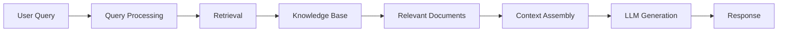

# RAG Fundamentals

!!! info "Foundation Knowledge"
    Understanding the core concepts, architecture, and components of Retrieval-Augmented Generation systems.

## What is RAG?

Retrieval-Augmented Generation (RAG) is a framework that enhances large language models by providing them with relevant external information retrieved from a knowledge base. Instead of relying solely on training data, RAG systems dynamically fetch contextual information to generate more accurate, up-to-date, and factually grounded responses.

### Core Components

1. **Knowledge Base**: Collection of documents, articles, or data sources
2. **Retrieval System**: Mechanism to find relevant information
3. **Language Model**: LLM that generates responses using retrieved context
4. **Orchestrator**: Component that coordinates retrieval and generation

## Why RAG Matters

### Advantages Over Pure LLMs

**Knowledge Freshness**

- **Traditional LLM**: Limited to training cutoff date
- **RAG System**: Accesses current information from updated knowledge base

**Factual Accuracy**

- **Traditional LLM**: May hallucinate or provide outdated facts
- **RAG System**: Grounds responses in retrieved source material

**Domain Specialization**

- **Traditional LLM**: Generic knowledge across many domains
- **RAG System**: Can be specialized with domain-specific knowledge bases

**Transparency**

- **Traditional LLM**: Black box reasoning
- **RAG System**: Shows source documents for generated content

### Common Use Cases

- **Customer Support**: Answer questions using company documentation
- **Research Assistance**: Find and synthesize information from academic papers
- **Legal Analysis**: Reference case law and regulations
- **Medical Information**: Access current medical literature and guidelines
- **Enterprise Q&A**: Query internal company knowledge bases

## RAG Architecture

### Basic RAG Pipeline



### Detailed Component Breakdown

#### 1. Query Processing

**Query Understanding**

- Parse user intent and extract key concepts
- Handle ambiguous or multi-part questions
- Convert natural language to search-friendly format

**Query Enhancement**

- Expand with synonyms and related terms
- Add context from conversation history
- Reformulate for better retrieval performance

#### 2. Retrieval System

**Indexing Phase (Offline)**

```python
# Example indexing process
def index_documents(documents):
    chunks = []
    for doc in documents:
        # Split document into manageable chunks
        doc_chunks = chunk_document(doc, chunk_size=512, overlap=50)
        
        for chunk in doc_chunks:
            # Generate embeddings for each chunk
            embedding = embed_text(chunk.content)
            chunks.append({
                'content': chunk.content,
                'embedding': embedding,
                'metadata': {
                    'source': doc.source,
                    'page': chunk.page,
                    'timestamp': doc.timestamp
                }
            })
    
    # Store in vector database
    vector_db.store(chunks)
    return vector_db
```

**Retrieval Phase (Online)**

```python
# Example retrieval process
def retrieve_context(query, top_k=5):
    # Generate query embedding
    query_embedding = embed_text(query)
    
    # Search vector database
    similar_chunks = vector_db.search(
        query_embedding, 
        top_k=top_k,
        threshold=0.7
    )
    
    # Rank and filter results
    relevant_context = rank_and_filter(similar_chunks, query)
    
    return relevant_context
```

#### 3. Context Assembly

**Context Ranking**

- Score relevance to the query
- Consider document recency and authority
- Avoid redundant or contradictory information

**Context Formatting**

```python
def assemble_context(retrieved_chunks, max_tokens=2000):
    context_parts = []
    token_count = 0
    
    for chunk in retrieved_chunks:
        chunk_tokens = count_tokens(chunk.content)
        
        if token_count + chunk_tokens <= max_tokens:
            context_parts.append({
                'content': chunk.content,
                'source': chunk.metadata['source'],
                'confidence': chunk.score
            })
            token_count += chunk_tokens
        else:
            break
    
    # Format for LLM consumption
    formatted_context = format_context_for_llm(context_parts)
    return formatted_context
```

#### 4. Response Generation

**Prompt Engineering for RAG**

```text
You are a helpful assistant that answers questions based on provided context.

Context:
{retrieved_context}

Question: {user_query}

Instructions:
1. Answer based primarily on the provided context
2. If the context doesn't contain enough information, say so
3. Cite your sources using the format [Source: document_name]
4. Be concise but comprehensive

Answer:
```

## Types of RAG Systems

### 1. Dense Retrieval RAG

Uses neural embeddings for semantic similarity search.

**Advantages:**
- Captures semantic meaning beyond keyword matching
- Works well with synonyms and paraphrases
- Can handle conceptual queries

**Implementation:**
```python
from sentence_transformers import SentenceTransformer

# Initialize embedding model
embedder = SentenceTransformer('all-MiniLM-L6-v2')

# Create embeddings
def create_embeddings(texts):
    return embedder.encode(texts)

# Search function
def semantic_search(query, document_embeddings):
    query_embedding = embedder.encode([query])
    similarities = cosine_similarity(query_embedding, document_embeddings)
    return similarities[0]
```

### 2. Sparse Retrieval RAG

Uses traditional keyword-based search methods like BM25.

**Advantages:**
- Excellent for exact keyword matches
- Computationally efficient
- Interpretable relevance scores

**Implementation:**
```python
from rank_bm25 import BM25Okapi

# Initialize BM25
def setup_bm25(documents):
    tokenized_docs = [doc.split() for doc in documents]
    bm25 = BM25Okapi(tokenized_docs)
    return bm25

# Search function
def keyword_search(query, bm25, documents):
    tokenized_query = query.split()
    scores = bm25.get_scores(tokenized_query)
    return scores
```

### 3. Hybrid RAG

Combines dense and sparse retrieval for optimal results.

**Implementation:**
```python
def hybrid_search(query, dense_scores, sparse_scores, alpha=0.7):
    # Normalize scores
    dense_norm = normalize_scores(dense_scores)
    sparse_norm = normalize_scores(sparse_scores)
    
    # Combine with weighting
    hybrid_scores = alpha * dense_norm + (1 - alpha) * sparse_norm
    return hybrid_scores
```

### 4. Multi-Modal RAG

Handles text, images, and other media types.

**Use Cases:**
- Visual question answering
- Document analysis with charts/diagrams
- Product catalogs with images

## RAG Evaluation Metrics

### Retrieval Quality

**Recall@K**
```python
def recall_at_k(relevant_docs, retrieved_docs, k):
    retrieved_k = retrieved_docs[:k]
    relevant_retrieved = len(set(relevant_docs) & set(retrieved_k))
    return relevant_retrieved / len(relevant_docs)
```

**Precision@K**
```python
def precision_at_k(relevant_docs, retrieved_docs, k):
    retrieved_k = retrieved_docs[:k]
    relevant_retrieved = len(set(relevant_docs) & set(retrieved_k))
    return relevant_retrieved / k
```

**Mean Reciprocal Rank (MRR)**
```python
def mrr(relevant_docs, retrieved_docs):
    for i, doc in enumerate(retrieved_docs):
        if doc in relevant_docs:
            return 1 / (i + 1)
    return 0
```

### Generation Quality

**Faithfulness**: How well the generated answer is supported by retrieved context

**Answer Relevance**: How well the answer addresses the user's question

**Context Relevance**: How relevant the retrieved context is to the query

```python
def evaluate_rag_system(test_cases):
    results = []
    
    for case in test_cases:
        query = case['query']
        expected_answer = case['expected_answer']
        relevant_docs = case['relevant_docs']
        
        # Retrieve and generate
        retrieved_docs = retrieve_context(query)
        generated_answer = generate_response(query, retrieved_docs)
        
        # Calculate metrics
        recall = recall_at_k(relevant_docs, retrieved_docs, 5)
        precision = precision_at_k(relevant_docs, retrieved_docs, 5)
        faithfulness = calculate_faithfulness(generated_answer, retrieved_docs)
        relevance = calculate_relevance(generated_answer, expected_answer)
        
        results.append({
            'query': query,
            'recall': recall,
            'precision': precision,
            'faithfulness': faithfulness,
            'relevance': relevance
        })
    
    return results
```

## Common RAG Challenges

### 1. Chunk Size Optimization

**Problem**: Balancing information completeness with retrieval precision

**Solutions:**
- **Small chunks (128-256 tokens)**: Better precision, may lose context
- **Large chunks (512-1024 tokens)**: Better context, may reduce precision
- **Hierarchical chunking**: Multiple granularities for different use cases

### 2. Context Window Limitations

**Problem**: Limited tokens available for context in LLM

**Solutions:**
- **Intelligent filtering**: Rank and select most relevant chunks
- **Summarization**: Compress retrieved content before feeding to LLM
- **Multi-turn processing**: Break complex queries into parts

### 3. Hallucination Management

**Problem**: LLM generates information not supported by retrieved context

**Solutions:**
- **Strict prompting**: Emphasize context-only responses
- **Citation requirements**: Force model to cite sources
- **Confidence scoring**: Rate answer reliability
- **Fallback mechanisms**: Default responses when context is insufficient

### 4. Knowledge Base Maintenance

**Problem**: Keeping knowledge base current and accurate

**Solutions:**
- **Automated updates**: Regular re-indexing of source materials
- **Version control**: Track document changes and updates
- **Quality monitoring**: Detect and flag outdated or incorrect information

## Best Practices

### Document Preparation

1. **Clean and Structure Data**
   - Remove formatting artifacts
   - Standardize structure across documents
   - Add metadata for better filtering

2. **Optimal Chunking**
   - Respect natural boundaries (paragraphs, sections)
   - Include overlapping context between chunks
   - Maintain coherent semantic units

3. **Rich Metadata**
   - Document source and creation date
   - Author and authority information
   - Content type and topic classification

### Retrieval Optimization

1. **Query Enhancement**
   - Expand with synonyms and related terms
   - Use conversation context for disambiguation
   - Handle multi-part or complex questions

2. **Relevance Tuning**
   - Adjust similarity thresholds based on use case
   - Implement re-ranking algorithms
   - Consider temporal relevance for time-sensitive queries

3. **Performance Monitoring**
   - Track retrieval quality metrics
   - Monitor response times and system load
   - Implement feedback loops for continuous improvement

---

!!! tip "Getting Started"
    Start with a simple dense retrieval RAG system using a pre-trained embedding model. Focus on good document preparation and chunking strategies before optimizing retrieval algorithms.

!!! warning "Production Considerations"
    RAG systems require careful attention to latency, scalability, and cost management. Plan for infrastructure needs including vector databases, embedding computation, and LLM inference.
