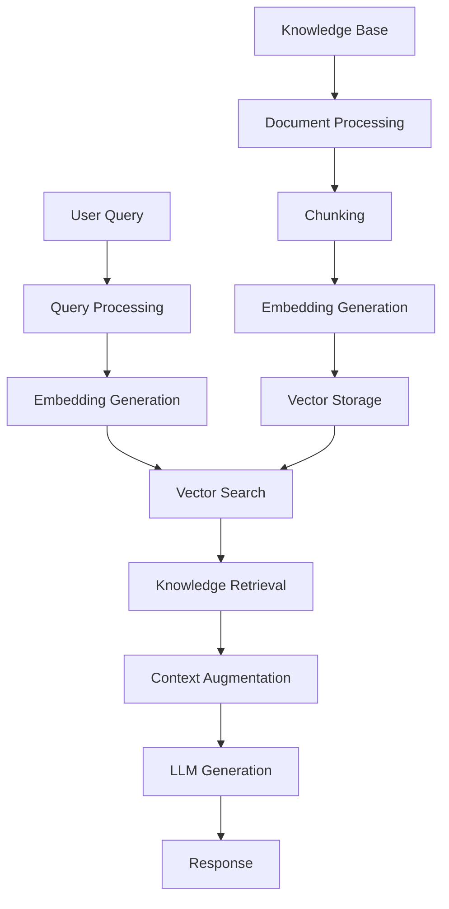

# Retrieval-Augmented Generation (RAG)

!!! abstract "Enhance AI with Knowledge Retrieval"
    Master RAG systems that combine the power of large language models with real-time information retrieval for accurate, up-to-date, and contextually relevant responses.

## 📚 Module Overview

<div class="grid cards" markdown>

-   :material-database-outline: **RAG Fundamentals**
    
    ---
    
    Core concepts, architecture, and retrieval mechanisms
    
    [Learn fundamentals →](fundamentals.md)

-   :material-vector-triangle: **Vector Databases**
    
    ---
    
    Embeddings, similarity search, and vector storage solutions
    
    [Master vectors →](vector-databases.md)

-   :material-shuffle-variant: **RAG Patterns**
    
    ---
    
    Advanced patterns, hybrid search, and optimization techniques
    
    [Explore patterns →](patterns.md)

-   :material-cog-outline: **Implementation**
    
    ---
    
    End-to-end RAG system implementation and deployment
    
    [Build systems →](implementation.md)

</div>

## 🎯 What You'll Master

- ✅ Understanding RAG architecture and components
- ✅ Implementing vector databases and semantic search
- ✅ Building production-ready RAG systems
- ✅ Advanced RAG patterns and optimization techniques
- ✅ Evaluation and monitoring of RAG performance
- ✅ Integration with various data sources and formats

## 🔍 What is RAG?

Retrieval-Augmented Generation combines the generative capabilities of LLMs with the ability to retrieve and incorporate external knowledge, enabling more accurate, factual, and up-to-date responses.



### RAG vs. Traditional LLMs

| Aspect | Traditional LLM | RAG System |
|--------|----------------|------------|
| **Knowledge Source** | Training data only | Training data + external knowledge |
| **Information Freshness** | Static (training cutoff) | Dynamic (real-time updates) |
| **Factual Accuracy** | Can hallucinate | Grounded in retrieved facts |
| **Domain Specificity** | General knowledge | Can access specialized domains |
| **Transparency** | Black box | Citable sources |
| **Cost** | Lower per query | Higher due to retrieval |

## 🏗️ RAG Architecture Deep Dive

```python
import numpy as np
from typing import List, Dict, Any, Optional, Tuple
import chromadb
from sentence_transformers import SentenceTransformer
import openai
from dataclasses import dataclass
import json

@dataclass
class Document:
    id: str
    content: str
    metadata: Dict[str, Any]
    embedding: Optional[np.ndarray] = None

@dataclass
class RetrievalResult:
    document: Document
    score: float
    rank: int

class RAGSystem:
    def __init__(self, 
                 embedding_model: str = "all-MiniLM-L6-v2",
                 llm_model: str = "gpt-3.5-turbo",
                 vector_db_path: str = "./rag_db"):
        
        # Initialize components
        self.embedding_model = SentenceTransformer(embedding_model)
        self.llm_model = llm_model
        
        # Initialize vector database
        self.chroma_client = chromadb.PersistentClient(path=vector_db_path)
        self.collection = self.chroma_client.get_or_create_collection(
            name="rag_knowledge_base",
            metadata={"hnsw:space": "cosine"}
        )
        
        self.documents = {}  # In-memory document store
    
    def add_documents(self, documents: List[Document]):
        """Add documents to the knowledge base"""
        embeddings = []
        ids = []
        metadatas = []
        contents = []
        
        for doc in documents:
            # Generate embedding if not provided
            if doc.embedding is None:
                doc.embedding = self.embedding_model.encode(doc.content)
            
            embeddings.append(doc.embedding.tolist())
            ids.append(doc.id)
            metadatas.append(doc.metadata)
            contents.append(doc.content)
            
            # Store in memory for easy access
            self.documents[doc.id] = doc
        
        # Add to vector database
        self.collection.add(
            embeddings=embeddings,
            documents=contents,
            metadatas=metadatas,
            ids=ids
        )
    
    def retrieve(self, query: str, top_k: int = 5, 
                score_threshold: float = 0.0) -> List[RetrievalResult]:
        """Retrieve relevant documents for a query"""
        
        # Generate query embedding
        query_embedding = self.embedding_model.encode(query)
        
        # Search vector database
        results = self.collection.query(
            query_embeddings=[query_embedding.tolist()],
            n_results=top_k,
            include=['documents', 'metadatas', 'distances']
        )
        
        # Process results
        retrieval_results = []
        for i, (doc_id, distance, content, metadata) in enumerate(zip(
            results['ids'][0],
            results['distances'][0], 
            results['documents'][0],
            results['metadatas'][0]
        )):
            # Convert distance to similarity score
            similarity_score = 1 - distance
            
            if similarity_score >= score_threshold:
                document = Document(
                    id=doc_id,
                    content=content,
                    metadata=metadata
                )
                
                retrieval_results.append(RetrievalResult(
                    document=document,
                    score=similarity_score,
                    rank=i + 1
                ))
        
        return retrieval_results
    
    def generate_response(self, query: str, retrieved_docs: List[RetrievalResult],
                         system_prompt: str = None) -> Dict[str, Any]:
        """Generate response using retrieved context"""
        
        # Build context from retrieved documents
        context_pieces = []
        for result in retrieved_docs:
            source_info = f"Source: {result.document.metadata.get('source', 'Unknown')}"
            context_pieces.append(f"{result.document.content}\n({source_info})")
        
        context = "\n\n".join(context_pieces)
        
        # Build prompt
        if system_prompt is None:
            system_prompt = """You are a helpful assistant that answers questions based on the provided context. 
            Use only the information from the context to answer questions. 
            If the context doesn't contain enough information, say so clearly.
            Always cite your sources when possible."""
        
        user_prompt = f"""
        Context:
        {context}
        
        Question: {query}
        
        Please provide a comprehensive answer based on the context above.
        """
        
        # Generate response using LLM
        try:
            client = openai.OpenAI()
            response = client.chat.completions.create(
                model=self.llm_model,
                messages=[
                    {"role": "system", "content": system_prompt},
                    {"role": "user", "content": user_prompt}
                ],
                temperature=0.3
            )
            
            answer = response.choices[0].message.content
            
            return {
                'answer': answer,
                'sources': [result.document.metadata for result in retrieved_docs],
                'context_used': context,
                'retrieval_scores': [result.score for result in retrieved_docs]
            }
            
        except Exception as e:
            return {
                'error': f"Error generating response: {str(e)}",
                'answer': None,
                'sources': [],
                'context_used': context
            }
    
    def query(self, question: str, top_k: int = 5, 
             score_threshold: float = 0.3) -> Dict[str, Any]:
        """End-to-end RAG query processing"""
        
        # Step 1: Retrieve relevant documents
        retrieved_docs = self.retrieve(
            query=question, 
            top_k=top_k, 
            score_threshold=score_threshold
        )
        
        if not retrieved_docs:
            return {
                'answer': "I couldn't find relevant information to answer your question.",
                'sources': [],
                'context_used': "",
                'retrieval_scores': []
            }
        
        # Step 2: Generate response
        return self.generate_response(question, retrieved_docs)

# Document processing utilities
class DocumentProcessor:
    def __init__(self, chunk_size: int = 1000, chunk_overlap: int = 200):
        self.chunk_size = chunk_size
        self.chunk_overlap = chunk_overlap
    
    def chunk_text(self, text: str, metadata: Dict[str, Any]) -> List[Document]:
        """Split text into chunks for better retrieval"""
        chunks = []
        start = 0
        chunk_id = 0
        
        while start < len(text):
            end = start + self.chunk_size
            chunk_text = text[start:end]
            
            # Try to break at sentence boundaries
            if end < len(text):
                last_period = chunk_text.rfind('.')
                last_newline = chunk_text.rfind('\n')
                break_point = max(last_period, last_newline)
                
                if break_point > start + self.chunk_size // 2:
                    chunk_text = text[start:start + break_point + 1]
                    end = start + break_point + 1
            
            # Create document chunk
            chunk_metadata = metadata.copy()
            chunk_metadata.update({
                'chunk_id': chunk_id,
                'start_char': start,
                'end_char': end,
                'chunk_length': len(chunk_text)
            })
            
            doc_id = f"{metadata.get('doc_id', 'doc')}_{chunk_id}"
            chunks.append(Document(
                id=doc_id,
                content=chunk_text.strip(),
                metadata=chunk_metadata
            ))
            
            # Move to next chunk with overlap
            start = end - self.chunk_overlap
            chunk_id += 1
        
        return chunks
    
    def process_file(self, file_path: str, doc_id: str = None) -> List[Document]:
        """Process a file and return document chunks"""
        import os
        
        if doc_id is None:
            doc_id = os.path.basename(file_path)
        
        # Read file content
        try:
            with open(file_path, 'r', encoding='utf-8') as f:
                content = f.read()
        except Exception as e:
            print(f"Error reading file {file_path}: {e}")
            return []
        
        metadata = {
            'doc_id': doc_id,
            'file_path': file_path,
            'source': file_path,
            'file_size': len(content)
        }
        
        return self.chunk_text(content, metadata)

# Example usage and demonstration
def create_sample_knowledge_base():
    """Create a sample knowledge base for demonstration"""
    
    sample_documents = [
        Document(
            id="ml_basics_1",
            content="""
            Machine Learning is a subset of artificial intelligence that enables computers to learn 
            and improve from experience without being explicitly programmed. It focuses on developing 
            algorithms that can access data and use it to learn for themselves. The process involves 
            training algorithms on historical data to make predictions or decisions about new data.
            """,
            metadata={"topic": "machine_learning", "source": "ML Textbook", "difficulty": "beginner"}
        ),
        Document(
            id="dl_basics_1", 
            content="""
            Deep Learning is a subset of machine learning that uses artificial neural networks with 
            multiple layers to progressively extract higher-level features from raw input. Deep learning 
            architectures such as deep neural networks, convolutional neural networks, and recurrent 
            neural networks have been applied to fields including computer vision, speech recognition, 
            and natural language processing.
            """,
            metadata={"topic": "deep_learning", "source": "DL Guide", "difficulty": "intermediate"}
        ),
        Document(
            id="nlp_basics_1",
            content="""
            Natural Language Processing (NLP) is a field of artificial intelligence that focuses on 
            the interaction between computers and human language. It involves developing algorithms 
            that can understand, interpret, and generate human language in a valuable way. NLP combines 
            computational linguistics with statistical, machine learning, and deep learning models.
            """,
            metadata={"topic": "nlp", "source": "NLP Handbook", "difficulty": "intermediate"}
        ),
        Document(
            id="transformers_1",
            content="""
            Transformers are a type of neural network architecture that has revolutionized natural 
            language processing. Introduced in the paper 'Attention Is All You Need', transformers 
            use self-attention mechanisms to process sequential data. They form the basis of modern 
            language models like BERT, GPT, and T5, enabling breakthroughs in machine translation, 
            text summarization, and language generation.
            """,
            metadata={"topic": "transformers", "source": "Transformer Paper", "difficulty": "advanced"}
        ),
        Document(
            id="rag_intro_1",
            content="""
            Retrieval-Augmented Generation (RAG) is a technique that combines the power of large 
            language models with information retrieval systems. RAG allows models to access external 
            knowledge bases during generation, providing more accurate and up-to-date information. 
            This approach helps reduce hallucinations and enables the model to cite sources, making 
            it particularly useful for question-answering and knowledge-intensive tasks.
            """,
            metadata={"topic": "rag", "source": "RAG Research", "difficulty": "advanced"}
        )
    ]
    
    return sample_documents

# Demonstration
def demonstrate_rag_system():
    """Demonstrate the RAG system with sample data"""
    print("🚀 Initializing RAG System...")
    
    # Initialize RAG system
    rag = RAGSystem()
    
    # Create and add sample documents
    print("📚 Adding sample documents to knowledge base...")
    sample_docs = create_sample_knowledge_base()
    rag.add_documents(sample_docs)
    
    # Test queries
    test_queries = [
        "What is machine learning?",
        "How do transformers work in NLP?", 
        "What are the benefits of RAG systems?",
        "Explain deep learning and its applications"
    ]
    
    print("\n🔍 Testing RAG System with sample queries...")
    
    for query in test_queries:
        print(f"\n{'='*60}")
        print(f"Query: {query}")
        print(f"{'='*60}")
        
        result = rag.query(query, top_k=3)
        
        if result.get('error'):
            print(f"❌ Error: {result['error']}")
        else:
            print(f"📝 Answer: {result['answer']}")
            print(f"\n📊 Sources used:")
            for i, source in enumerate(result['sources'], 1):
                print(f"  {i}. {source.get('source', 'Unknown')} (Topic: {source.get('topic', 'N/A')})")
            
            print(f"\n🎯 Retrieval scores: {[f'{score:.3f}' for score in result['retrieval_scores']]}")

# Run demonstration
if __name__ == "__main__":
    demonstrate_rag_system()
```

## 🔧 Advanced RAG Patterns

### 1. Hybrid Search (Dense + Sparse)

```python
import numpy as np
from sklearn.feature_extraction.text import TfidfVectorizer
from typing import List, Dict, Tuple

class HybridRAGSystem(RAGSystem):
    def __init__(self, *args, **kwargs):
        super().__init__(*args, **kwargs)
        self.tfidf_vectorizer = TfidfVectorizer(max_features=10000, stop_words='english')
        self.tfidf_matrix = None
        self.document_texts = []
        
    def add_documents(self, documents: List[Document]):
        """Add documents with both dense and sparse indexing"""
        super().add_documents(documents)
        
        # Build TF-IDF index for sparse retrieval
        self.document_texts = [doc.content for doc in documents]
        if self.document_texts:
            self.tfidf_matrix = self.tfidf_vectorizer.fit_transform(self.document_texts)
    
    def sparse_retrieve(self, query: str, top_k: int = 10) -> List[Tuple[int, float]]:
        """Retrieve using TF-IDF (sparse) search"""
        if self.tfidf_matrix is None:
            return []
        
        query_vector = self.tfidf_vectorizer.transform([query])
        scores = (self.tfidf_matrix * query_vector.T).toarray().flatten()
        
        # Get top-k indices and scores
        top_indices = np.argsort(scores)[::-1][:top_k]
        return [(idx, scores[idx]) for idx in top_indices if scores[idx] > 0]
    
    def hybrid_retrieve(self, query: str, top_k: int = 5, 
                       dense_weight: float = 0.7, sparse_weight: float = 0.3) -> List[RetrievalResult]:
        """Combine dense and sparse retrieval"""
        
        # Dense retrieval
        dense_results = self.retrieve(query, top_k=top_k * 2)
        dense_scores = {result.document.id: result.score for result in dense_results}
        
        # Sparse retrieval
        sparse_results = self.sparse_retrieve(query, top_k=top_k * 2)
        sparse_scores = {}
        
        for idx, score in sparse_results:
            if idx < len(self.document_texts):
                # Find document ID by content matching
                content = self.document_texts[idx]
                for doc_id, doc in self.documents.items():
                    if doc.content == content:
                        sparse_scores[doc_id] = score
                        break
        
        # Combine scores
        all_doc_ids = set(dense_scores.keys()) | set(sparse_scores.keys())
        combined_results = []
        
        for doc_id in all_doc_ids:
            dense_score = dense_scores.get(doc_id, 0)
            sparse_score = sparse_scores.get(doc_id, 0)
            
            # Normalize sparse scores to [0, 1] range
            if sparse_score > 0:
                sparse_score = min(sparse_score, 1.0)
            
            combined_score = (dense_weight * dense_score + sparse_weight * sparse_score)
            
            if combined_score > 0:
                combined_results.append(RetrievalResult(
                    document=self.documents[doc_id],
                    score=combined_score,
                    rank=0  # Will be set after sorting
                ))
        
        # Sort by combined score and assign ranks
        combined_results.sort(key=lambda x: x.score, reverse=True)
        for i, result in enumerate(combined_results[:top_k]):
            result.rank = i + 1
        
        return combined_results[:top_k]
    
    def query(self, question: str, top_k: int = 5, use_hybrid: bool = True) -> Dict[str, Any]:
        """Query with option for hybrid search"""
        if use_hybrid:
            retrieved_docs = self.hybrid_retrieve(question, top_k)
        else:
            retrieved_docs = self.retrieve(question, top_k)
        
        if not retrieved_docs:
            return {
                'answer': "I couldn't find relevant information to answer your question.",
                'sources': [],
                'context_used': "",
                'retrieval_scores': []
            }
        
        return self.generate_response(question, retrieved_docs)
```

### 2. Re-ranking with Cross-Encoder

```python
from sentence_transformers import CrossEncoder
import torch

class ReRankingRAGSystem(HybridRAGSystem):
    def __init__(self, rerank_model: str = "cross-encoder/ms-marco-MiniLM-L-6-v2", *args, **kwargs):
        super().__init__(*args, **kwargs)
        self.cross_encoder = CrossEncoder(rerank_model)
    
    def rerank_results(self, query: str, initial_results: List[RetrievalResult], 
                      top_k: int = 5) -> List[RetrievalResult]:
        """Re-rank initial results using cross-encoder"""
        
        if len(initial_results) <= top_k:
            return initial_results
        
        # Prepare query-document pairs for cross-encoder
        query_doc_pairs = [(query, result.document.content) for result in initial_results]
        
        # Get cross-encoder scores
        rerank_scores = self.cross_encoder.predict(query_doc_pairs)
        
        # Update results with new scores
        for result, new_score in zip(initial_results, rerank_scores):
            result.score = float(new_score)
        
        # Re-sort and re-rank
        initial_results.sort(key=lambda x: x.score, reverse=True)
        for i, result in enumerate(initial_results[:top_k]):
            result.rank = i + 1
        
        return initial_results[:top_k]
    
    def query(self, question: str, top_k: int = 5, 
             initial_k: int = 20, use_reranking: bool = True) -> Dict[str, Any]:
        """Query with optional re-ranking"""
        
        # Get initial results (more than needed)
        retrieved_docs = self.hybrid_retrieve(question, top_k=initial_k)
        
        # Re-rank if enabled
        if use_reranking and len(retrieved_docs) > top_k:
            retrieved_docs = self.rerank_results(question, retrieved_docs, top_k)
        
        if not retrieved_docs:
            return {
                'answer': "I couldn't find relevant information to answer your question.",
                'sources': [],
                'context_used': "",
                'retrieval_scores': []
            }
        
        return self.generate_response(question, retrieved_docs)
```

### 3. Multi-Vector RAG

```python
class MultiVectorRAGSystem(RAGSystem):
    def __init__(self, *args, **kwargs):
        super().__init__(*args, **kwargs)
        self.summary_collection = self.chroma_client.get_or_create_collection(
            name="document_summaries",
            metadata={"hnsw:space": "cosine"}
        )
        
    def generate_document_summary(self, document: Document) -> str:
        """Generate a summary for better retrieval"""
        summary_prompt = f"""
        Summarize the following document in 2-3 sentences, focusing on the main topics and key information:
        
        {document.content}
        
        Summary:
        """
        
        try:
            client = openai.OpenAI()
            response = client.chat.completions.create(
                model="gpt-3.5-turbo",
                messages=[
                    {"role": "user", "content": summary_prompt}
                ],
                temperature=0.3,
                max_tokens=150
            )
            return response.choices[0].message.content.strip()
        except Exception as e:
            # Fallback to first few sentences
            sentences = document.content.split('.')[:3]
            return '. '.join(sentences) + '.'
    
    def add_documents(self, documents: List[Document]):
        """Add documents with both full content and summary vectors"""
        super().add_documents(documents)
        
        # Generate summaries and add to summary collection
        summary_embeddings = []
        summary_ids = []
        summary_metadatas = []
        summaries = []
        
        for doc in documents:
            summary = self.generate_document_summary(doc)
            summary_embedding = self.embedding_model.encode(summary)
            
            summary_embeddings.append(summary_embedding.tolist())
            summary_ids.append(f"summary_{doc.id}")
            summary_metadatas.append({
                **doc.metadata,
                'original_doc_id': doc.id,
                'content_type': 'summary'
            })
            summaries.append(summary)
        
        self.summary_collection.add(
            embeddings=summary_embeddings,
            documents=summaries,
            metadatas=summary_metadatas,
            ids=summary_ids
        )
    
    def multi_vector_retrieve(self, query: str, top_k: int = 5) -> List[RetrievalResult]:
        """Retrieve using both full content and summary vectors"""
        
        # Search full content
        content_results = self.retrieve(query, top_k=top_k)
        
        # Search summaries
        query_embedding = self.embedding_model.encode(query)
        summary_results = self.summary_collection.query(
            query_embeddings=[query_embedding.tolist()],
            n_results=top_k,
            include=['documents', 'metadatas', 'distances']
        )
        
        # Combine and deduplicate results
        all_results = {}
        
        # Add content results
        for result in content_results:
            all_results[result.document.id] = result
        
        # Add summary results (for documents not already found)
        for i, (summary_id, distance, summary, metadata) in enumerate(zip(
            summary_results['ids'][0],
            summary_results['distances'][0],
            summary_results['documents'][0], 
            summary_results['metadatas'][0]
        )):
            original_doc_id = metadata.get('original_doc_id')
            if original_doc_id and original_doc_id not in all_results:
                similarity_score = 1 - distance
                
                if original_doc_id in self.documents:
                    all_results[original_doc_id] = RetrievalResult(
                        document=self.documents[original_doc_id],
                        score=similarity_score * 0.8,  # Slight penalty for summary-based retrieval
                        rank=len(all_results) + 1
                    )
        
        # Sort and return top-k
        final_results = list(all_results.values())
        final_results.sort(key=lambda x: x.score, reverse=True)
        
        for i, result in enumerate(final_results[:top_k]):
            result.rank = i + 1
        
        return final_results[:top_k]
```

## 📊 RAG Evaluation Framework

```python
import json
from typing import List, Dict, Any, Callable
from dataclasses import dataclass
import time

@dataclass
class EvaluationMetric:
    name: str
    function: Callable
    weight: float = 1.0
    description: str = ""

class RAGEvaluator:
    def __init__(self, rag_system):
        self.rag_system = rag_system
        self.evaluation_history = []
        
        # Define evaluation metrics
        self.metrics = {
            'retrieval_precision': EvaluationMetric(
                name="Retrieval Precision",
                function=self._calculate_retrieval_precision,
                description="Fraction of retrieved documents that are relevant"
            ),
            'retrieval_recall': EvaluationMetric(
                name="Retrieval Recall", 
                function=self._calculate_retrieval_recall,
                description="Fraction of relevant documents that are retrieved"
            ),
            'answer_relevance': EvaluationMetric(
                name="Answer Relevance",
                function=self._calculate_answer_relevance,
                description="How well the answer addresses the question"
            ),
            'answer_groundedness': EvaluationMetric(
                name="Answer Groundedness",
                function=self._calculate_answer_groundedness,
                description="How well the answer is supported by retrieved context"
            ),
            'response_time': EvaluationMetric(
                name="Response Time",
                function=self._calculate_response_time,
                description="Time taken to generate response"
            )
        }
    
    def _calculate_retrieval_precision(self, query: str, retrieved_docs: List[RetrievalResult], 
                                     relevant_doc_ids: List[str]) -> float:
        """Calculate precision of retrieved documents"""
        if not retrieved_docs:
            return 0.0
        
        relevant_retrieved = sum(1 for doc in retrieved_docs if doc.document.id in relevant_doc_ids)
        return relevant_retrieved / len(retrieved_docs)
    
    def _calculate_retrieval_recall(self, query: str, retrieved_docs: List[RetrievalResult], 
                                   relevant_doc_ids: List[str]) -> float:
        """Calculate recall of retrieved documents"""
        if not relevant_doc_ids:
            return 1.0
        
        relevant_retrieved = sum(1 for doc in retrieved_docs if doc.document.id in relevant_doc_ids)
        return relevant_retrieved / len(relevant_doc_ids)
    
    def _calculate_answer_relevance(self, query: str, answer: str, context: str = "") -> float:
        """Calculate how relevant the answer is to the query"""
        # Simplified implementation - in practice, use semantic similarity
        query_words = set(query.lower().split())
        answer_words = set(answer.lower().split())
        
        overlap = len(query_words.intersection(answer_words))
        return min(1.0, overlap / len(query_words)) if query_words else 0.0
    
    def _calculate_answer_groundedness(self, answer: str, context: str) -> float:
        """Calculate how well the answer is grounded in the context"""
        # Simplified implementation
        if not context:
            return 0.0
        
        answer_words = set(answer.lower().split())
        context_words = set(context.lower().split())
        
        overlap = len(answer_words.intersection(context_words))
        return min(1.0, overlap / len(answer_words)) if answer_words else 0.0
    
    def _calculate_response_time(self, start_time: float, end_time: float) -> float:
        """Calculate response time (lower is better, so return negative)"""
        return -(end_time - start_time)
    
    def evaluate_query(self, query: str, relevant_doc_ids: List[str] = None, 
                      expected_answer: str = None) -> Dict[str, Any]:
        """Evaluate a single query"""
        start_time = time.time()
        
        # Get RAG response
        result = self.rag_system.query(query)
        
        end_time = time.time()
        
        # Calculate metrics
        evaluation_scores = {}
        
        # Retrieval metrics (if relevant docs provided)
        if relevant_doc_ids:
            retrieved_docs = self.rag_system.retrieve(query)
            evaluation_scores['retrieval_precision'] = self._calculate_retrieval_precision(
                query, retrieved_docs, relevant_doc_ids
            )
            evaluation_scores['retrieval_recall'] = self._calculate_retrieval_recall(
                query, retrieved_docs, relevant_doc_ids
            )
        
        # Answer quality metrics
        if result.get('answer'):
            evaluation_scores['answer_relevance'] = self._calculate_answer_relevance(
                query, result['answer'], result.get('context_used', '')
            )
            evaluation_scores['answer_groundedness'] = self._calculate_answer_groundedness(
                result['answer'], result.get('context_used', '')
            )
        
        # Performance metrics
        evaluation_scores['response_time'] = self._calculate_response_time(start_time, end_time)
        
        return {
            'query': query,
            'result': result,
            'metrics': evaluation_scores,
            'timestamp': time.time()
        }
    
    def evaluate_dataset(self, test_cases: List[Dict[str, Any]]) -> Dict[str, Any]:
        """Evaluate RAG system on a dataset"""
        all_evaluations = []
        
        for test_case in test_cases:
            query = test_case['query']
            relevant_docs = test_case.get('relevant_doc_ids', [])
            expected_answer = test_case.get('expected_answer')
            
            evaluation = self.evaluate_query(query, relevant_docs, expected_answer)
            all_evaluations.append(evaluation)
        
        # Calculate aggregate metrics
        aggregate_metrics = {}
        for metric_name in self.metrics.keys():
            scores = [eval_result['metrics'].get(metric_name, 0) for eval_result in all_evaluations]
            if scores:
                aggregate_metrics[metric_name] = {
                    'mean': sum(scores) / len(scores),
                    'min': min(scores),
                    'max': max(scores),
                    'count': len([s for s in scores if s is not None])
                }
        
        evaluation_summary = {
            'total_queries': len(test_cases),
            'aggregate_metrics': aggregate_metrics,
            'individual_evaluations': all_evaluations,
            'evaluation_timestamp': time.time()
        }
        
        self.evaluation_history.append(evaluation_summary)
        
        return evaluation_summary
    
    def generate_evaluation_report(self, evaluation_summary: Dict[str, Any]) -> str:
        """Generate a human-readable evaluation report"""
        report = f"""
RAG System Evaluation Report
{'='*50}

Dataset Size: {evaluation_summary['total_queries']} queries
Evaluation Date: {time.ctime(evaluation_summary['evaluation_timestamp'])}

Aggregate Metrics:
"""
        
        for metric_name, stats in evaluation_summary['aggregate_metrics'].items():
            metric_info = self.metrics.get(metric_name, EvaluationMetric(metric_name, None))
            report += f"""
{metric_info.name}:
  Mean: {stats['mean']:.3f}
  Range: [{stats['min']:.3f}, {stats['max']:.3f}]
  Description: {metric_info.description}
"""
        
        # Top performing queries
        individual_evals = evaluation_summary['individual_evaluations']
        if individual_evals:
            # Sort by average metric score
            scored_queries = []
            for eval_result in individual_evals:
                avg_score = sum(eval_result['metrics'].values()) / len(eval_result['metrics'])
                scored_queries.append((eval_result['query'], avg_score))
            
            scored_queries.sort(key=lambda x: x[1], reverse=True)
            
            report += f"""
Top Performing Queries:
"""
            for i, (query, score) in enumerate(scored_queries[:5], 1):
                report += f"{i}. {query} (Score: {score:.3f})\n"
        
        return report

# Example evaluation dataset
def create_evaluation_dataset():
    """Create a sample evaluation dataset"""
    return [
        {
            'query': 'What is machine learning?',
            'relevant_doc_ids': ['ml_basics_1'],
            'expected_answer': 'Machine learning is a subset of AI that enables computers to learn from data.'
        },
        {
            'query': 'How do transformers work?',
            'relevant_doc_ids': ['transformers_1'],
            'expected_answer': 'Transformers use self-attention mechanisms to process sequential data.'
        },
        {
            'query': 'What are the benefits of RAG?',
            'relevant_doc_ids': ['rag_intro_1'],
            'expected_answer': 'RAG provides more accurate information by combining LLMs with retrieval systems.'
        }
    ]

# Example usage
def run_rag_evaluation():
    """Run a complete RAG evaluation"""
    
    # Initialize systems
    rag_system = RAGSystem()
    evaluator = RAGEvaluator(rag_system)
    
    # Add sample documents
    sample_docs = create_sample_knowledge_base()
    rag_system.add_documents(sample_docs)
    
    # Create evaluation dataset
    test_cases = create_evaluation_dataset()
    
    # Run evaluation
    print("🔍 Running RAG System Evaluation...")
    evaluation_summary = evaluator.evaluate_dataset(test_cases)
    
    # Generate and print report
    report = evaluator.generate_evaluation_report(evaluation_summary)
    print(report)
    
    return evaluation_summary

# Run evaluation example
# if __name__ == "__main__":
#     run_rag_evaluation()
```

## 🚀 Production RAG System

```python
import asyncio
import aiohttp
from fastapi import FastAPI, HTTPException
from pydantic import BaseModel
import uvicorn
from typing import Optional
import logging

# Request/Response models
class QueryRequest(BaseModel):
    query: str
    top_k: Optional[int] = 5
    score_threshold: Optional[float] = 0.3
    use_hybrid: Optional[bool] = True

class QueryResponse(BaseModel):
    answer: str
    sources: List[Dict[str, Any]]
    retrieval_scores: List[float]
    response_time: float
    confidence: float

class ProductionRAGSystem:
    def __init__(self):
        self.rag_system = ReRankingRAGSystem()
        self.app = FastAPI(title="Production RAG API", version="1.0.0")
        self.setup_routes()
        self.setup_logging()
    
    def setup_logging(self):
        """Setup logging for production"""
        logging.basicConfig(level=logging.INFO)
        self.logger = logging.getLogger(__name__)
    
    def setup_routes(self):
        """Setup FastAPI routes"""
        
        @self.app.post("/query", response_model=QueryResponse)
        async def query_endpoint(request: QueryRequest):
            try:
                start_time = time.time()
                
                # Process query
                result = self.rag_system.query(
                    question=request.query,
                    top_k=request.top_k,
                    use_hybrid=request.use_hybrid
                )
                
                response_time = time.time() - start_time
                
                # Calculate confidence based on retrieval scores
                confidence = 0.0
                if result.get('retrieval_scores'):
                    confidence = max(result['retrieval_scores'])
                
                return QueryResponse(
                    answer=result.get('answer', 'No answer generated'),
                    sources=result.get('sources', []),
                    retrieval_scores=result.get('retrieval_scores', []),
                    response_time=response_time,
                    confidence=confidence
                )
                
            except Exception as e:
                self.logger.error(f"Error processing query: {str(e)}")
                raise HTTPException(status_code=500, detail=str(e))
        
        @self.app.post("/add_documents")
        async def add_documents_endpoint(documents: List[Dict[str, Any]]):
            try:
                # Convert to Document objects
                doc_objects = []
                for i, doc_data in enumerate(documents):
                    doc = Document(
                        id=doc_data.get('id', f'doc_{i}'),
                        content=doc_data['content'],
                        metadata=doc_data.get('metadata', {})
                    )
                    doc_objects.append(doc)
                
                # Add to system
                self.rag_system.add_documents(doc_objects)
                
                return {"message": f"Successfully added {len(doc_objects)} documents"}
                
            except Exception as e:
                self.logger.error(f"Error adding documents: {str(e)}")
                raise HTTPException(status_code=500, detail=str(e))
        
        @self.app.get("/health")
        async def health_check():
            return {"status": "healthy", "timestamp": time.time()}
        
        @self.app.get("/metrics")
        async def get_metrics():
            # Return system metrics
            return {
                "total_documents": len(self.rag_system.documents),
                "embedding_model": "all-MiniLM-L6-v2",
                "llm_model": self.rag_system.llm_model
            }
    
    def run(self, host: str = "0.0.0.0", port: int = 8000):
        """Run the production server"""
        uvicorn.run(self.app, host=host, port=port)

# Docker deployment configuration
DOCKERFILE_CONTENT = """
FROM python:3.9-slim

WORKDIR /app

COPY requirements.txt .
RUN pip install -r requirements.txt

COPY . .

EXPOSE 8000

CMD ["python", "main.py"]
"""

REQUIREMENTS_TXT = """
fastapi==0.104.1
uvicorn==0.24.0
sentence-transformers==2.2.2
chromadb==0.4.15
openai==1.3.0
numpy==1.24.3
scikit-learn==1.3.0
aiohttp==3.8.5
pydantic==2.4.2
"""

# Example usage
if __name__ == "__main__":
    # Initialize and run production system
    production_rag = ProductionRAGSystem()
    
    # Add sample documents
    sample_docs = create_sample_knowledge_base()
    production_rag.rag_system.add_documents(sample_docs)
    
    print("🚀 Starting Production RAG Server...")
    print("📚 Sample documents loaded")
    print("🌐 Server will be available at http://localhost:8000")
    print("📖 API docs at http://localhost:8000/docs")
    
    # Run server
    production_rag.run()
```

## 📚 Next Steps

Ready to build more advanced AI systems? Continue with:

1. **[AI Agents](../agents/index.md)** - Build autonomous AI systems with RAG
2. **[Fine-tuning](../fine-tuning/index.md)** - Customize models for better RAG performance  
3. **[MLOps/AIOps](../mlops-aiops/index.md)** - Deploy and monitor RAG systems
4. **[Projects](../projects/index.md)** - Build real-world RAG applications

---

!!! success "RAG Mastery Complete!"
    You now have the knowledge to build sophisticated RAG systems that combine the best of retrieval and generation. The next step is to apply these concepts in production environments.
