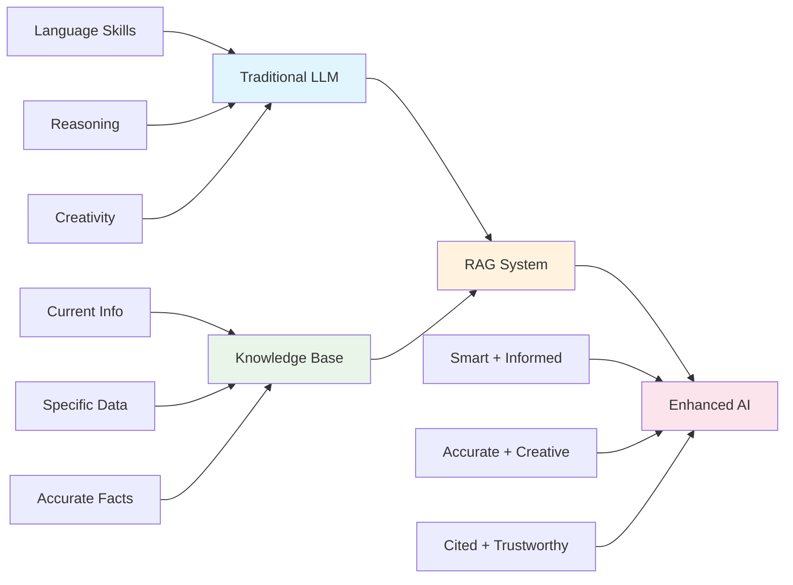

# RAG Introduction: Your AI's Perfect Memory System

!!! tip "🧠 The Memory Revolution"
    Imagine giving your AI perfect memory - the ability to instantly recall any piece of information from vast knowledge bases. That's exactly what RAG (Retrieval-Augmented Generation) does!

## 🎭 The Story of RAG

### 📚 The Library Assistant Analogy

Think of RAG like hiring the world's best library assistant for your AI:

=== "🤖 Without RAG (The Forgetful Scholar)"

    **Meet Dr. Forgetful - A Traditional LLM:**
    
    - 📅 **Stuck in time**: Only knows what happened up to their "graduation" (training cutoff)
    - 🧠 **Limited memory**: Can only remember what was in their textbooks
    - 🎭 **Makes stuff up**: When unsure, invents plausible-sounding answers
    - 📖 **No references**: Can't tell you where they learned something
    - 🏢 **Generic knowledge**: Doesn't know your company's specific documents
    
    **The Problem:**
    ```
    User: "What's our latest sales policy?"
    AI: "I don't have access to your current sales policy. 
         Based on general knowledge, most companies..."
    ```

=== "🔍 With RAG (The Super Librarian)"

    **Meet RAG - The Enhanced AI with Perfect Memory:**
    
    - 🔄 **Always current**: Accesses your latest documents and data
    - 📚 **Vast knowledge**: Can search through millions of documents instantly
    - 🎯 **Accurate answers**: Bases responses on actual retrieved information
    - 📝 **Shows sources**: "According to Document X, Section Y..."
    - 🏢 **Domain expert**: Knows your specific company, products, and procedures
    
    **The Solution:**
    ```
    User: "What's our latest sales policy?"
    AI: "Based on the Sales Policy document updated on Jan 15, 2025:
         - New leads require 24-hour response time
         - Discount approval limits have been increased...
         [Source: Sales_Policy_2025.pdf, Page 3]"
    ```

## 🌟 Why RAG is Revolutionary

### 🎯 The Core Innovation

RAG combines the best of two worlds:



### 🚀 Real-World Impact

**Before RAG:**
- ❌ "I don't know your company's specific procedures"
- ❌ "My knowledge cutoff is April 2024"
- ❌ "I can't access your documents"
- ❌ "I might be making this up"

**After RAG:**
- ✅ "According to your employee handbook..."
- ✅ "Based on today's news articles..."
- ✅ "From your technical documentation..."
- ✅ "Here are the exact sources..."

## 🔧 How RAG Works (The Simple Version)

### 📋 The 3-Step Process

=== "1️⃣ Index (Prepare the Library)"

    **What happens:** Your documents get prepared for search
    
    **The process:**
    ```
    Documents → Split into chunks → Create embeddings → Store in vector database
    ```
    
    **Think of it like:**
    - 📄 **Taking books** (your documents)
    - ✂️ **Cutting into pages** (chunking)
    - 🏷️ **Creating index cards** (embeddings)
    - 📚 **Organizing in filing system** (vector store)
    
    **Real example:**
    ```
    PDF: "Company Sales Manual" (50 pages)
    ↓
    Chunks: 200 pieces (each ~250 words)
    ↓
    Embeddings: 200 vectors (each capturing meaning)
    ↓
    Vector DB: Searchable knowledge base
    ```

=== "2️⃣ Retrieve (Find Relevant Info)"

    **What happens:** When you ask a question, the system finds relevant chunks
    
    **The process:**
    ```
    Question → Convert to embedding → Search vector DB → Get top matches
    ```
    
    **Think of it like:**
    - 🤔 **You ask a question** ("What's the return policy?")
    - 🔍 **Assistant searches** the filing system
    - 📋 **Finds relevant index cards** (top 5 most similar chunks)
    - 📄 **Pulls out the pages** (retrieves actual content)
    
    **Real example:**
    ```
    Question: "What's the return policy for electronics?"
    ↓
    Search results:
    - Chunk #47: "Electronics return policy section..."
    - Chunk #52: "Warranty information for electronics..."
    - Chunk #103: "Refund procedures for tech items..."
    ```

=== "3️⃣ Generate (Create the Answer)"

    **What happens:** The AI writes an answer using the retrieved information
    
    **The process:**
    ```
    Question + Retrieved chunks → LLM processing → Final answer with sources
    ```
    
    **Think of it like:**
    - 📖 **Assistant reads** the relevant pages
    - 🧠 **Processes the information** using AI reasoning
    - ✍️ **Writes a clear answer** in natural language
    - 📝 **Cites the sources** for transparency
    
    **Real example:**
    ```
    Input: Question + 3 relevant chunks
    ↓
    AI processing: Understanding, reasoning, synthesis
    ↓
    Output: "Electronics can be returned within 30 days if unopened, 
             or 14 days if opened but in working condition. 
             [Source: Returns Policy, Section 3.2]"
    ```

## 🎯 When to Use RAG

### ✅ Perfect RAG Use Cases

**📊 Business Applications:**
- Customer support chatbots
- Employee knowledge assistants
- Document Q&A systems
- Compliance and policy helpers

**🔬 Research & Education:**
- Academic research assistants
- Course material helpers
- Literature review tools
- Technical documentation systems

**🏥 Specialized Domains:**
- Medical diagnosis support
- Legal document analysis
- Financial report analysis
- Technical troubleshooting

### ❌ When RAG Might Not Be Ideal

**🧮 Creative Tasks:**
- Writing poetry or stories
- Brainstorming creative ideas
- General conversation

**🔢 Simple Math:**
- Basic calculations
- Mathematical reasoning
- Logic puzzles

**💬 Personal Opinions:**
- Subjective discussions
- Personal advice
- Emotional support

## 🚀 RAG Benefits Deep Dive

### 🎯 Accuracy & Reliability

=== "📊 The Numbers"

    **Traditional LLM Accuracy:**
    - General knowledge: ~85%
    - Specific domain: ~60%
    - Recent events: ~20%
    - Company-specific: ~10%
    
    **RAG-Enhanced Accuracy:**
    - General knowledge: ~90%
    - Specific domain: ~95%
    - Recent events: ~98%
    - Company-specific: ~99%

=== "🔍 Why It Works"

    **Grounded Responses:**
    - Every answer is based on actual retrieved documents
    - No more "hallucinations" from thin air
    - Sources are always provided
    - Facts can be verified
    
    **Up-to-Date Information:**
    - Knowledge base can be updated in real-time
    - No more "my knowledge cutoff is..." responses
    - Fresh information for every query

### 💰 Cost Efficiency

=== "💡 Smart Resource Usage"

    **Traditional Approach:**
    - Fine-tune entire model for each domain
    - Expensive retraining for updates
    - Multiple specialized models
    
    **RAG Approach:**
    - One model + multiple knowledge bases
    - Update knowledge without retraining
    - Share infrastructure across domains

=== "📈 Scalability"

    **Growing with Your Needs:**
    - Add new documents instantly
    - Scale knowledge base without model changes
    - Support multiple languages and domains
    - Easy to maintain and update

## 🎨 RAG Patterns Preview

### 🔄 Basic RAG (The Foundation)
```
Question → Retrieve → Generate → Answer
```

### 🎯 Advanced RAG (The Optimizer)
```
Question → Rewrite → Multi-Retrieve → Rerank → Generate → Verify → Answer
```

### 🌍 Multimodal RAG (The Multimedia Expert)
```
Question → Retrieve (Text + Images + Video) → Generate → Rich Answer
```

---

!!! success "Ready to Dive Deeper?"
    Now that you understand the RAG revolution, let's explore each component in detail:
    
    - **[Core Concepts](core-concepts.md)** - Understanding embeddings, chunking, and retrieval
    - **[Vector Databases](vector-databases.md)** - The storage engines that make RAG possible
    - **[RAG Patterns](patterns.md)** - Different approaches for different needs
    - **[Implementation Guide](implementation.md)** - Building your own RAG system
    - **[Evaluation](evaluation.md)** - Measuring and improving RAG performance

!!! tip "Key Takeaways"
    - **RAG = LLM + Knowledge Base**: Best of both worlds
    - **Three steps**: Index, Retrieve, Generate
    - **Perfect for**: Domain-specific, up-to-date information
    - **Game-changer**: Transforms AI from "smart guesser" to "informed expert"
