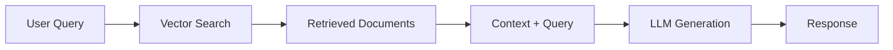
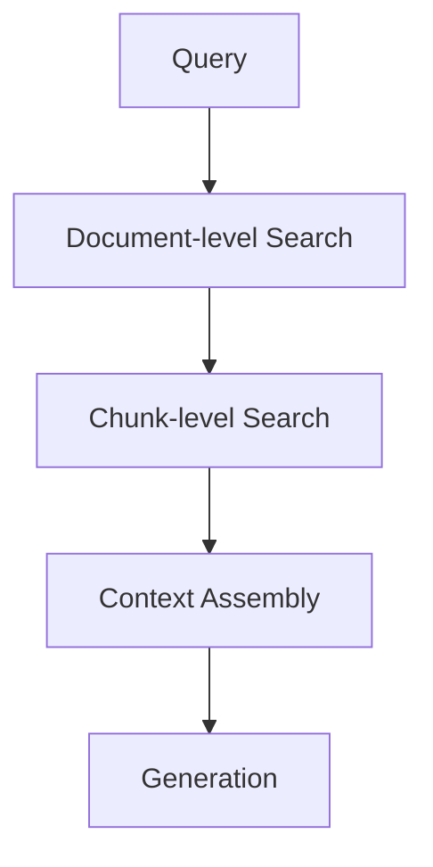
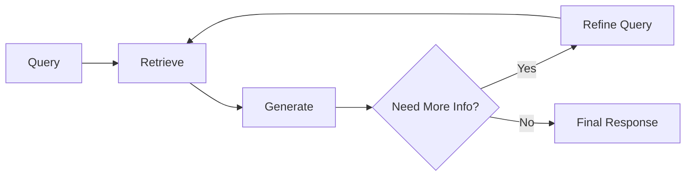

# RAG Patterns - Implementation Strategies

## Overview

Retrieval-Augmented Generation (RAG) patterns define different approaches to combining external knowledge retrieval with language model generation for more accurate and contextual responses.

## Core RAG Patterns

### 1. Simple RAG Pattern

**Architecture**: Query → Retrieve → Generate



**Use Cases**:
- FAQ systems
- Document Q&A
- Knowledge base queries

**Implementation**:
```python
def simple_rag(query, vector_db, llm):
    # Retrieve relevant documents
    docs = vector_db.similarity_search(query, k=5)
    
    # Combine with query
    context = "\n".join([doc.content for doc in docs])
    prompt = f"Context: {context}\n\nQuestion: {query}\n\nAnswer:"
    
    # Generate response
    return llm.generate(prompt)
```

### 2. Hierarchical RAG Pattern

**Architecture**: Multi-level retrieval with document hierarchy



**Benefits**:
- Better context preservation
- Improved relevance scoring
- Handles long documents effectively

### 3. Iterative RAG Pattern

**Architecture**: Multiple retrieval-generation cycles



**Use Cases**:
- Complex research queries
- Multi-step reasoning
- Fact verification

### 4. Conversational RAG Pattern

**Architecture**: Context-aware retrieval with conversation history

```python
class ConversationalRAG:
    def __init__(self, vector_db, llm):
        self.vector_db = vector_db
        self.llm = llm
        self.conversation_history = []
    
    def query(self, user_input):
        # Combine current query with conversation context
        context_query = self._build_context_query(user_input)
        
        # Retrieve relevant documents
        docs = self.vector_db.similarity_search(context_query)
        
        # Generate response with full context
        response = self._generate_with_history(user_input, docs)
        
        # Update conversation history
        self.conversation_history.append({
            'query': user_input,
            'response': response,
            'retrieved_docs': docs
        })
        
        return response
```

## Advanced RAG Patterns

### 5. Multi-Modal RAG

**Components**:
- Text embeddings
- Image embeddings
- Audio embeddings
- Cross-modal retrieval

**Architecture**:
```python
class MultiModalRAG:
    def __init__(self):
        self.text_retriever = TextVectorDB()
        self.image_retriever = ImageVectorDB()
        self.audio_retriever = AudioVectorDB()
    
    def retrieve_multimodal(self, query, modalities=['text', 'image']):
        results = {}
        
        if 'text' in modalities:
            results['text'] = self.text_retriever.search(query)
        
        if 'image' in modalities:
            results['image'] = self.image_retriever.search(query)
        
        if 'audio' in modalities:
            results['audio'] = self.audio_retriever.search(query)
        
        return self._combine_modalities(results)
```

### 6. Graph-Enhanced RAG

**Features**:
- Knowledge graph integration
- Relationship-aware retrieval
- Entity-centric generation

```python
class GraphRAG:
    def __init__(self, vector_db, knowledge_graph):
        self.vector_db = vector_db
        self.kg = knowledge_graph
    
    def retrieve_with_graph(self, query):
        # Extract entities from query
        entities = self.extract_entities(query)
        
        # Get related entities from knowledge graph
        related_entities = self.kg.get_related_entities(entities)
        
        # Enhanced retrieval with entity context
        docs = self.vector_db.search_with_entities(
            query, entities + related_entities
        )
        
        return docs
```

### 7. Adaptive RAG Pattern

**Features**:
- Query complexity assessment
- Dynamic retrieval strategy selection
- Performance optimization

```python
class AdaptiveRAG:
    def __init__(self):
        self.simple_rag = SimpleRAG()
        self.hierarchical_rag = HierarchicalRAG()
        self.iterative_rag = IterativeRAG()
    
    def route_query(self, query):
        complexity = self.assess_complexity(query)
        
        if complexity == 'simple':
            return self.simple_rag.process(query)
        elif complexity == 'medium':
            return self.hierarchical_rag.process(query)
        else:
            return self.iterative_rag.process(query)
    
    def assess_complexity(self, query):
        # Implement complexity scoring logic
        pass
```

## RAG Optimization Patterns

### 8. Pre-Retrieval Optimization

**Techniques**:
- Query expansion
- Query rewriting
- Intent classification

```python
def optimize_query(original_query):
    # Query expansion with synonyms
    expanded_query = expand_with_synonyms(original_query)
    
    # Add domain-specific terms
    domain_terms = extract_domain_terms(original_query)
    
    # Rewrite for better retrieval
    optimized_query = rewrite_for_search(expanded_query + domain_terms)
    
    return optimized_query
```

### 9. Post-Retrieval Optimization

**Techniques**:
- Document reranking
- Relevance scoring
- Context filtering

```python
def rerank_documents(query, retrieved_docs, reranker_model):
    # Score documents for relevance
    scores = reranker_model.score_pairs(
        [(query, doc.content) for doc in retrieved_docs]
    )
    
    # Sort by relevance score
    ranked_docs = sorted(
        zip(retrieved_docs, scores),
        key=lambda x: x[1],
        reverse=True
    )
    
    return [doc for doc, score in ranked_docs[:5]]
```

### 10. Hybrid Retrieval Pattern

**Combines**:
- Dense retrieval (embeddings)
- Sparse retrieval (BM25)
- Keyword matching

```python
class HybridRetriever:
    def __init__(self, dense_retriever, sparse_retriever):
        self.dense = dense_retriever
        self.sparse = sparse_retriever
    
    def retrieve(self, query, alpha=0.7):
        # Dense retrieval
        dense_results = self.dense.search(query)
        
        # Sparse retrieval
        sparse_results = self.sparse.search(query)
        
        # Combine scores
        combined_results = self.combine_scores(
            dense_results, sparse_results, alpha
        )
        
        return combined_results
```

## Pattern Selection Guidelines

### Simple RAG
- **Use when**: Straightforward Q&A, single documents
- **Complexity**: Low
- **Latency**: Fast

### Hierarchical RAG
- **Use when**: Long documents, structured content
- **Complexity**: Medium
- **Latency**: Medium

### Iterative RAG
- **Use when**: Complex queries, research tasks
- **Complexity**: High
- **Latency**: Slow

### Conversational RAG
- **Use when**: Multi-turn conversations, context dependency
- **Complexity**: Medium-High
- **Latency**: Medium

## Implementation Considerations

### Performance Optimization
- Vector database indexing strategies
- Caching frequent queries
- Parallel retrieval processing
- Response streaming

### Quality Assurance
- Retrieval evaluation metrics
- Generation quality assessment
- End-to-end testing
- Human feedback integration

### Scalability
- Distributed vector databases
- Load balancing
- Resource management
- Cost optimization

## Next Steps

- [RAG Fundamentals](fundamentals.md)
- [Vector Databases](vector-databases.md)
- [RAG Implementation](implementation.md)
