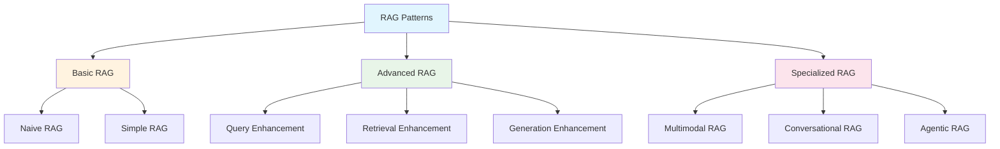
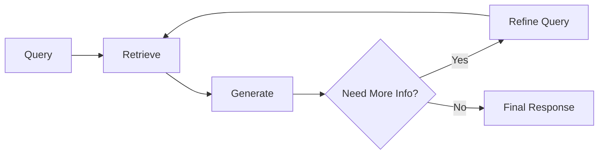

# RAG Patterns: Choosing the Right Approach

!!! tip "🎯 One Size Doesn't Fit All"
    Just like choosing the right tool for a job, different RAG patterns excel at different tasks. Let's explore the complete toolkit of RAG architectures!

## 🎭 The RAG Pattern Family

### 🌟 Understanding the Spectrum



Each pattern is designed for specific use cases, complexity levels, and performance requirements. Let's explore them step by step!

## 🚀 Basic RAG Patterns

### 1️⃣ Naive RAG (The Beginner's Choice)

=== "📖 The Simple Story"

    **The Approach:** The most straightforward implementation possible
    
    **Think of it like:** A basic library assistant who:
    - Takes your question as-is
    - Searches for similar documents
    - Hands you the first few results
    - Asks the librarian to write an answer
    
    **The Pipeline:**
    ```
    User Query → Embedding → Vector Search → Top-K Results → LLM → Answer
    ```
    
    **When to Use:**
    - 🎯 Proof of concepts
    - 📚 Simple knowledge bases
    - 🚀 Quick prototypes
    - 🎓 Learning RAG basics

=== "💻 Implementation"

    ```python
    from sentence_transformers import SentenceTransformer
    import faiss
    import openai
    
    class NaiveRAG:
        """
        The simplest RAG implementation
        Perfect for learning and quick prototypes
        """
        def __init__(self, documents, model_name='all-MiniLM-L6-v2'):
            self.documents = documents
            self.embedder = SentenceTransformer(model_name)
            self.openai_client = openai.OpenAI()
            
            # Create embeddings and index
            self.embeddings = self.embedder.encode(documents)
            self.index = faiss.IndexFlatIP(self.embeddings.shape[1])
            
            # Normalize for cosine similarity
            faiss.normalize_L2(self.embeddings)
            self.index.add(self.embeddings.astype('float32'))
        
        def search(self, query, k=3):
            """Retrieve top-k similar documents"""
            query_embedding = self.embedder.encode([query])
            faiss.normalize_L2(query_embedding)
            
            scores, indices = self.index.search(query_embedding.astype('float32'), k)
            
            return [self.documents[i] for i in indices[0]]
        
        def generate_answer(self, query, context_docs):
            """Generate answer using retrieved context"""
            context = "\\n\\n".join(context_docs)
            
            prompt = f"""
            Context: {context}
            
            Question: {query}
            
            Answer based on the context above:
            """
            
            response = self.openai_client.chat.completions.create(
                model="gpt-3.5-turbo",
                messages=[{"role": "user", "content": prompt}]
            )
            
            return response.choices[0].message.content
        
        def query(self, question):
            """Complete RAG pipeline"""
            # Step 1: Retrieve
            relevant_docs = self.search(question)
            
            # Step 2: Generate
            answer = self.generate_answer(question, relevant_docs)
            
            return {
                'answer': answer,
                'sources': relevant_docs
            }
    
    # Example usage
    documents = [
        "RAG combines retrieval and generation for better AI responses.",
        "Vector databases store embeddings for fast semantic search.",
        "Chunking breaks large documents into manageable pieces.",
        "LLMs generate human-like text based on input prompts."
    ]
    
    rag = NaiveRAG(documents)
    result = rag.query("How does RAG work?")
    
    print("Answer:", result['answer'])
    print("\\nSources:")
    for i, source in enumerate(result['sources'], 1):
        print(f"{i}. {source}")
    ```

=== "✅ Pros & Cons"

    **✅ Advantages:**
    - 🚀 **Quick to implement** - Can be built in under 100 lines
    - 💰 **Low cost** - Minimal computational overhead
    - 🎓 **Easy to understand** - Perfect for learning
    - 🔧 **Simple to debug** - Clear, linear flow
    
    **❌ Limitations:**
    - 🎯 **Poor query understanding** - Takes queries literally
    - 📊 **No result ranking** - First match might not be best
    - 🔄 **No context optimization** - Can't improve retrieval
    - 📈 **Limited scalability** - Performance degrades with size

### 2️⃣ Simple RAG (The Practical Choice)

=== "📖 The Enhanced Story"

    **The Improvement:** Add basic optimizations for better performance
    
    **Think of it like:** A more experienced library assistant who:
    - Cleans up your question first
    - Uses better search techniques
    - Ranks results by relevance
    - Provides structured answers
    
    **Enhanced Pipeline:**
    ```
    User Query → Query Cleaning → Embedding → Vector Search → 
    Reranking → Context Optimization → LLM → Structured Answer
    ```

=== "💻 Enhanced Implementation"

    ```python
    import re
    from typing import List, Dict
    from sentence_transformers import SentenceTransformer, CrossEncoder
    
    class SimpleRAG:
        """
        Enhanced RAG with basic optimizations
        Production-ready for simple use cases
        """
        def __init__(self, documents: List[str]):
            self.documents = documents
            self.embedder = SentenceTransformer('all-MiniLM-L6-v2')
            self.reranker = CrossEncoder('cross-encoder/ms-marco-MiniLM-L-6-v2')
            self.openai_client = openai.OpenAI()
            
            self._build_index()
        
        def _build_index(self):
            """Build and optimize the search index"""
            self.embeddings = self.embedder.encode(self.documents)
            self.index = faiss.IndexFlatIP(self.embeddings.shape[1])
            faiss.normalize_L2(self.embeddings)
            self.index.add(self.embeddings.astype('float32'))
        
        def clean_query(self, query: str) -> str:
            """Clean and normalize the input query"""
            # Remove extra whitespace
            query = re.sub(r'\\s+', ' ', query.strip())
            
            # Expand common abbreviations
            abbreviations = {
                "what's": "what is",
                "how's": "how is",
                "can't": "cannot",
                "won't": "will not"
            }
            
            for abbrev, expanded in abbreviations.items():
                query = query.replace(abbrev, expanded)
            
            return query
        
        def retrieve(self, query: str, k: int = 10) -> List[Dict]:
            """Retrieve and initially rank documents"""
            clean_query = self.clean_query(query)
            query_embedding = self.embedder.encode([clean_query])
            faiss.normalize_L2(query_embedding)
            
            # Get more candidates for reranking
            scores, indices = self.index.search(query_embedding.astype('float32'), k)
            
            candidates = []
            for score, idx in zip(scores[0], indices[0]):
                candidates.append({
                    'text': self.documents[idx],
                    'index': idx,
                    'initial_score': float(score)
                })
            
            return candidates
        
        def rerank(self, query: str, candidates: List[Dict], top_k: int = 3) -> List[Dict]:
            """Rerank candidates using cross-encoder"""
            if not candidates:
                return []
            
            # Prepare pairs for reranking
            pairs = [[query, candidate['text']] for candidate in candidates]
            
            # Get reranking scores
            rerank_scores = self.reranker.predict(pairs)
            
            # Update candidates with rerank scores
            for candidate, score in zip(candidates, rerank_scores):
                candidate['rerank_score'] = float(score)
            
            # Sort by rerank score and return top-k
            reranked = sorted(candidates, key=lambda x: x['rerank_score'], reverse=True)
            return reranked[:top_k]
        
        def optimize_context(self, query: str, documents: List[Dict]) -> str:
            """Optimize context for better generation"""
            context_parts = []
            
            for i, doc in enumerate(documents, 1):
                # Add document with metadata
                context_parts.append(f"Document {i} (Score: {doc['rerank_score']:.3f}):")
                context_parts.append(doc['text'])
                context_parts.append("")  # Empty line for separation
            
            return "\\n".join(context_parts)
        
        def generate_answer(self, query: str, context: str) -> Dict:
            """Generate structured answer with metadata"""
            prompt = f"""
            You are a helpful assistant. Answer the question based on the provided context.
            If the context doesn't contain relevant information, say so clearly.
            
            Context:
            {context}
            
            Question: {query}
            
            Instructions:
            1. Provide a clear, concise answer
            2. Reference specific documents when possible
            3. If uncertain, express the level of confidence
            4. Keep the answer focused and relevant
            
            Answer:
            """
            
            response = self.openai_client.chat.completions.create(
                model="gpt-3.5-turbo",
                messages=[{"role": "user", "content": prompt}],
                temperature=0.1  # Lower temperature for more consistent answers
            )
            
            return {
                'answer': response.choices[0].message.content,
                'model': 'gpt-3.5-turbo',
                'temperature': 0.1
            }
        
        def query(self, question: str, top_k: int = 3) -> Dict:
            """Complete enhanced RAG pipeline"""
            # Step 1: Retrieve candidates
            candidates = self.retrieve(question, k=min(10, len(self.documents)))
            
            # Step 2: Rerank for relevance
            top_docs = self.rerank(question, candidates, top_k)
            
            # Step 3: Optimize context
            context = self.optimize_context(question, top_docs)
            
            # Step 4: Generate answer
            result = self.generate_answer(question, context)
            
            # Step 5: Package response
            return {
                'answer': result['answer'],
                'sources': [doc['text'] for doc in top_docs],
                'scores': [doc['rerank_score'] for doc in top_docs],
                'metadata': {
                    'num_candidates': len(candidates),
                    'reranked_docs': len(top_docs),
                    'model': result['model']
                }
            }
    
    # Example with evaluation
    documents = [
        "RAG (Retrieval-Augmented Generation) combines information retrieval with text generation to create more accurate and informative AI responses.",
        "Vector databases like FAISS, Chroma, and Pinecone store high-dimensional embeddings for fast similarity search.",
        "Text chunking strategies include fixed-size, semantic, and structural approaches, each with different trade-offs.",
        "Cross-encoders can rerank retrieved documents to improve relevance and answer quality.",
        "LLMs like GPT-3.5 and GPT-4 generate human-like text but may hallucinate without proper grounding."
    ]
    
    enhanced_rag = SimpleRAG(documents)
    result = enhanced_rag.query("What is RAG and how does it work?")
    
    print("Enhanced Answer:", result['answer'])
    print(f"\\nTop {len(result['sources'])} Sources:")
    for i, (source, score) in enumerate(zip(result['sources'], result['scores']), 1):
        print(f"{i}. (Score: {score:.3f}) {source}")
    print(f"\\nMetadata: {result['metadata']}")
    ```

## 🧠 Advanced RAG Patterns

### 3️⃣ Query Enhancement RAG

=== "🎯 The Smart Query Processor"

    **The Innovation:** Optimize queries before retrieval
    
    **Techniques:**
    - **Query Expansion**: Add related terms
    - **Query Rewriting**: Rephrase for better matching
    - **Multi-Query**: Generate multiple query variations
    - **Intent Detection**: Understand what user really wants
    
    **When to Use:**
    - 🔍 Complex or ambiguous queries
    - 📚 Large, diverse knowledge bases
    - 🌍 Multi-language support needed
    - 🎯 High precision requirements

=== "💻 Query Enhancement Implementation"

    ```python
    class QueryEnhancedRAG:
        """
        RAG with sophisticated query processing
        """
        def __init__(self, documents: List[str]):
            self.documents = documents
            self.embedder = SentenceTransformer('all-MiniLM-L6-v2')
            self.openai_client = openai.OpenAI()
            self._build_index()
        
        def expand_query(self, query: str) -> List[str]:
            """Generate query variations for better retrieval"""
            prompt = f"""
            Given this question: "{query}"
            
            Generate 3 alternative ways to ask the same question.
            Focus on:
            1. Different word choices (synonyms)
            2. Different sentence structures
            3. More specific or general versions
            
            Return only the 3 alternative questions, one per line.
            """
            
            response = self.openai_client.chat.completions.create(
                model="gpt-3.5-turbo",
                messages=[{"role": "user", "content": prompt}],
                temperature=0.7
            )
            
            variations = response.choices[0].message.content.strip().split('\\n')
            return [query] + [v.strip() for v in variations if v.strip()]
        
        def detect_intent(self, query: str) -> Dict:
            """Detect the intent and type of query"""
            prompt = f"""
            Analyze this query: "{query}"
            
            Determine:
            1. Intent type: factual, how-to, comparison, definition, troubleshooting
            2. Specificity: high, medium, low
            3. Complexity: simple, moderate, complex
            4. Domain: if identifiable
            
            Return as JSON format.
            """
            
            response = self.openai_client.chat.completions.create(
                model="gpt-3.5-turbo",
                messages=[{"role": "user", "content": prompt}],
                temperature=0.1
            )
            
            try:
                import json
                return json.loads(response.choices[0].message.content)
            except:
                return {"intent_type": "factual", "specificity": "medium", "complexity": "moderate"}
        
        def multi_query_retrieval(self, query: str, k: int = 5) -> List[Dict]:
            """Retrieve using multiple query variations"""
            # Get query variations
            query_variations = self.expand_query(query)
            
            all_candidates = []
            seen_docs = set()
            
            for variation in query_variations:
                # Retrieve for each variation
                var_embedding = self.embedder.encode([variation])
                faiss.normalize_L2(var_embedding)
                scores, indices = self.index.search(var_embedding.astype('float32'), k)
                
                for score, idx in zip(scores[0], indices[0]):
                    if idx not in seen_docs:
                        all_candidates.append({
                            'text': self.documents[idx],
                            'index': idx,
                            'score': float(score),
                            'query_variation': variation
                        })
                        seen_docs.add(idx)
            
            # Sort by score and return top candidates
            return sorted(all_candidates, key=lambda x: x['score'], reverse=True)[:k*2]
        
        def query(self, question: str) -> Dict:
            """Enhanced query processing pipeline"""
            # Step 1: Analyze intent
            intent = self.detect_intent(question)
            
            # Step 2: Multi-query retrieval
            candidates = self.multi_query_retrieval(question)
            
            # Step 3: Generate answer with intent awareness
            context = "\\n\\n".join([doc['text'] for doc in candidates[:5]])
            
            prompt = f"""
            Query Intent: {intent}
            
            Context: {context}
            
            Question: {question}
            
            Based on the query intent and context, provide a comprehensive answer.
            Tailor your response style to the intent type.
            """
            
            response = self.openai_client.chat.completions.create(
                model="gpt-3.5-turbo",
                messages=[{"role": "user", "content": prompt}]
            )
            
            return {
                'answer': response.choices[0].message.content,
                'intent': intent,
                'sources': [doc['text'] for doc in candidates[:3]],
                'query_variations': [doc['query_variation'] for doc in candidates[:3]]
            }
    ```

**Benefits**:
- Better context preservation
- Improved relevance scoring
- Handles long documents effectively

### 3. Iterative RAG Pattern

**Architecture**: Multiple retrieval-generation cycles



**Use Cases**:
- Complex research queries
- Multi-step reasoning
- Fact verification

### 4. Conversational RAG Pattern

**Architecture**: Context-aware retrieval with conversation history

```python
class ConversationalRAG:
    def __init__(self, vector_db, llm):
        self.vector_db = vector_db
        self.llm = llm
        self.conversation_history = []
    
    def query(self, user_input):
        # Combine current query with conversation context
        context_query = self._build_context_query(user_input)
        
        # Retrieve relevant documents
        docs = self.vector_db.similarity_search(context_query)
        
        # Generate response with full context
        response = self._generate_with_history(user_input, docs)
        
        # Update conversation history
        self.conversation_history.append({
            'query': user_input,
            'response': response,
            'retrieved_docs': docs
        })
        
        return response
```

## Advanced RAG Patterns

### 5. Multi-Modal RAG

**Components**:
- Text embeddings
- Image embeddings
- Audio embeddings
- Cross-modal retrieval

**Architecture**:
```python
class MultiModalRAG:
    def __init__(self):
        self.text_retriever = TextVectorDB()
        self.image_retriever = ImageVectorDB()
        self.audio_retriever = AudioVectorDB()
    
    def retrieve_multimodal(self, query, modalities=['text', 'image']):
        results = {}
        
        if 'text' in modalities:
            results['text'] = self.text_retriever.search(query)
        
        if 'image' in modalities:
            results['image'] = self.image_retriever.search(query)
        
        if 'audio' in modalities:
            results['audio'] = self.audio_retriever.search(query)
        
        return self._combine_modalities(results)
```

### 6. Graph-Enhanced RAG

**Features**:
- Knowledge graph integration
- Relationship-aware retrieval
- Entity-centric generation

```python
class GraphRAG:
    def __init__(self, vector_db, knowledge_graph):
        self.vector_db = vector_db
        self.kg = knowledge_graph
    
    def retrieve_with_graph(self, query):
        # Extract entities from query
        entities = self.extract_entities(query)
        
        # Get related entities from knowledge graph
        related_entities = self.kg.get_related_entities(entities)
        
        # Enhanced retrieval with entity context
        docs = self.vector_db.search_with_entities(
            query, entities + related_entities
        )
        
        return docs
```

### 7. Adaptive RAG Pattern

**Features**:
- Query complexity assessment
- Dynamic retrieval strategy selection
- Performance optimization

```python
class AdaptiveRAG:
    def __init__(self):
        self.simple_rag = SimpleRAG()
        self.hierarchical_rag = HierarchicalRAG()
        self.iterative_rag = IterativeRAG()
    
    def route_query(self, query):
        complexity = self.assess_complexity(query)
        
        if complexity == 'simple':
            return self.simple_rag.process(query)
        elif complexity == 'medium':
            return self.hierarchical_rag.process(query)
        else:
            return self.iterative_rag.process(query)
    
    def assess_complexity(self, query):
        # Implement complexity scoring logic
        pass
```

## RAG Optimization Patterns

### 8. Pre-Retrieval Optimization

**Techniques**:
- Query expansion
- Query rewriting
- Intent classification

```python
def optimize_query(original_query):
    # Query expansion with synonyms
    expanded_query = expand_with_synonyms(original_query)
    
    # Add domain-specific terms
    domain_terms = extract_domain_terms(original_query)
    
    # Rewrite for better retrieval
    optimized_query = rewrite_for_search(expanded_query + domain_terms)
    
    return optimized_query
```

### 9. Post-Retrieval Optimization

**Techniques**:
- Document reranking
- Relevance scoring
- Context filtering

```python
def rerank_documents(query, retrieved_docs, reranker_model):
    # Score documents for relevance
    scores = reranker_model.score_pairs(
        [(query, doc.content) for doc in retrieved_docs]
    )
    
    # Sort by relevance score
    ranked_docs = sorted(
        zip(retrieved_docs, scores),
        key=lambda x: x[1],
        reverse=True
    )
    
    return [doc for doc, score in ranked_docs[:5]]
```

### 10. Hybrid Retrieval Pattern

**Combines**:
- Dense retrieval (embeddings)
- Sparse retrieval (BM25)
- Keyword matching

```python
class HybridRetriever:
    def __init__(self, dense_retriever, sparse_retriever):
        self.dense = dense_retriever
        self.sparse = sparse_retriever
    
    def retrieve(self, query, alpha=0.7):
        # Dense retrieval
        dense_results = self.dense.search(query)
        
        # Sparse retrieval
        sparse_results = self.sparse.search(query)
        
        # Combine scores
        combined_results = self.combine_scores(
            dense_results, sparse_results, alpha
        )
        
        return combined_results
```

## Pattern Selection Guidelines

### Simple RAG
- **Use when**: Straightforward Q&A, single documents
- **Complexity**: Low
- **Latency**: Fast

### Hierarchical RAG
- **Use when**: Long documents, structured content
- **Complexity**: Medium
- **Latency**: Medium

### Iterative RAG
- **Use when**: Complex queries, research tasks
- **Complexity**: High
- **Latency**: Slow

### Conversational RAG
- **Use when**: Multi-turn conversations, context dependency
- **Complexity**: Medium-High
- **Latency**: Medium

## Implementation Considerations

### Performance Optimization
- Vector database indexing strategies
- Caching frequent queries
- Parallel retrieval processing
- Response streaming

### Quality Assurance
- Retrieval evaluation metrics
- Generation quality assessment
- End-to-end testing
- Human feedback integration

### Scalability
- Distributed vector databases
- Load balancing
- Resource management
- Cost optimization

## Next Steps

- [RAG Fundamentals](fundamentals.md)
- [Vector Databases](vector-databases.md)
- [RAG Implementation](implementation.md)
