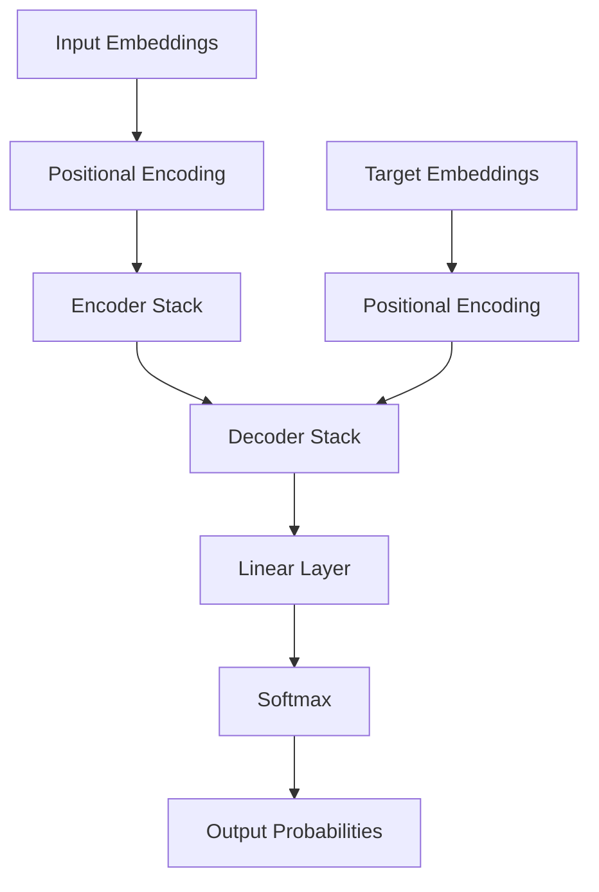

# Transformer Architecture Deep Dive

!!! info "Foundation of Modern AI"
    Understanding the revolutionary transformer architecture that powers GPT, BERT, and virtually all modern large language models.

## The Transformer Revolution

The transformer architecture, introduced in "Attention Is All You Need" (Vaswani et al., 2017), revolutionized natural language processing by:

- **Replacing recurrence with attention**: Enabling parallel processing
- **Capturing long-range dependencies**: Through self-attention mechanisms  
- **Achieving state-of-the-art performance**: Across multiple NLP tasks
- **Enabling massive scaling**: Leading to GPT and other large models

## High-Level Architecture

### Original Transformer (Encoder-Decoder)



### Modern Variants

#### Encoder-Only (BERT-style)
- **Use Case**: Classification, understanding tasks
- **Examples**: BERT, RoBERTa, DeBERTa
- **Bidirectional**: Can see entire input sequence

#### Decoder-Only (GPT-style)  
- **Use Case**: Text generation, autoregressive tasks
- **Examples**: GPT-3/4, LLaMA, PaLM
- **Causal**: Can only see previous tokens

#### Encoder-Decoder (Original)
- **Use Case**: Translation, summarization
- **Examples**: T5, BART, Pegasus
- **Flexible**: Different input/output sequence lengths

## Core Components

### 1. Input Embeddings

Convert discrete tokens to continuous vector representations.

```python
import torch
import torch.nn as nn

class TokenEmbedding(nn.Module):
    def __init__(self, vocab_size, d_model):
        super().__init__()
        self.embedding = nn.Embedding(vocab_size, d_model)
        self.d_model = d_model
    
    def forward(self, x):
        # Scale embeddings by sqrt(d_model) as in original paper
        return self.embedding(x) * math.sqrt(self.d_model)
```

### 2. Positional Encoding

Since transformers have no inherent notion of sequence order, positional encodings provide position information.

```python
class PositionalEncoding(nn.Module):
    def __init__(self, d_model, max_seq_length=5000):
        super().__init__()
        
        pe = torch.zeros(max_seq_length, d_model)
        position = torch.arange(0, max_seq_length).unsqueeze(1).float()
        
        # Create sinusoidal patterns
        div_term = torch.exp(torch.arange(0, d_model, 2).float() * 
                           -(math.log(10000.0) / d_model))
        
        pe[:, 0::2] = torch.sin(position * div_term)  # Even positions
        pe[:, 1::2] = torch.cos(position * div_term)  # Odd positions
        
        self.register_buffer('pe', pe.unsqueeze(0))
    
    def forward(self, x):
        return x + self.pe[:, :x.size(1)]
```

**Why Sinusoidal Encoding?**

- **Unique patterns**: Each position has a unique encoding
- **Relative positioning**: Model can learn relative distances
- **Extrapolation**: Can handle sequences longer than training

### 3. Multi-Head Self-Attention

The core innovation enabling transformers to process sequences in parallel.

```python
class MultiHeadAttention(nn.Module):
    def __init__(self, d_model, num_heads):
        super().__init__()
        assert d_model % num_heads == 0
        
        self.d_model = d_model
        self.num_heads = num_heads
        self.d_k = d_model // num_heads
        
        # Linear projections for Q, K, V
        self.W_q = nn.Linear(d_model, d_model)
        self.W_k = nn.Linear(d_model, d_model)
        self.W_v = nn.Linear(d_model, d_model)
        self.W_o = nn.Linear(d_model, d_model)
        
    def scaled_dot_product_attention(self, Q, K, V, mask=None):
        scores = torch.matmul(Q, K.transpose(-2, -1)) / math.sqrt(self.d_k)
        
        if mask is not None:
            scores = scores.masked_fill(mask == 0, -1e9)
        
        attention_weights = torch.softmax(scores, dim=-1)
        output = torch.matmul(attention_weights, V)
        return output, attention_weights
    
    def forward(self, x, mask=None):
        batch_size, seq_length, d_model = x.size()
        
        # Linear projections and reshape for multi-head
        Q = self.W_q(x).view(batch_size, seq_length, self.num_heads, self.d_k).transpose(1, 2)
        K = self.W_k(x).view(batch_size, seq_length, self.num_heads, self.d_k).transpose(1, 2)
        V = self.W_v(x).view(batch_size, seq_length, self.num_heads, self.d_k).transpose(1, 2)
        
        # Apply attention
        attention_output, attention_weights = self.scaled_dot_product_attention(Q, K, V, mask)
        
        # Concatenate heads and apply output projection
        attention_output = attention_output.transpose(1, 2).contiguous().view(
            batch_size, seq_length, d_model)
        output = self.W_o(attention_output)
        
        return output, attention_weights
```

### 4. Feed-Forward Networks

Process each position independently with non-linear transformations.

```python
class PositionwiseFeedForward(nn.Module):
    def __init__(self, d_model, d_ff, dropout=0.1):
        super().__init__()
        self.linear1 = nn.Linear(d_model, d_ff)
        self.linear2 = nn.Linear(d_ff, d_model)
        self.dropout = nn.Dropout(dropout)
        self.activation = nn.ReLU()
    
    def forward(self, x):
        return self.linear2(self.dropout(self.activation(self.linear1(x))))
```

### 5. Layer Normalization & Residual Connections

Essential for training deep networks and gradient flow.

```python
class TransformerBlock(nn.Module):
    def __init__(self, d_model, num_heads, d_ff, dropout=0.1):
        super().__init__()
        self.attention = MultiHeadAttention(d_model, num_heads)
        self.feed_forward = PositionwiseFeedForward(d_model, d_ff, dropout)
        self.norm1 = nn.LayerNorm(d_model)
        self.norm2 = nn.LayerNorm(d_model)
        self.dropout = nn.Dropout(dropout)
    
    def forward(self, x, mask=None):
        # Self-attention with residual connection and layer norm
        attn_output, attn_weights = self.attention(x, mask)
        x = self.norm1(x + self.dropout(attn_output))
        
        # Feed-forward with residual connection and layer norm
        ff_output = self.feed_forward(x)
        x = self.norm2(x + self.dropout(ff_output))
        
        return x, attn_weights
```

## Complete Transformer Implementation

### Encoder-Only Transformer (BERT-style)

```python
class TransformerEncoder(nn.Module):
    def __init__(self, vocab_size, d_model, num_heads, num_layers, d_ff, 
                 max_seq_length, dropout=0.1):
        super().__init__()
        
        self.token_embedding = TokenEmbedding(vocab_size, d_model)
        self.positional_encoding = PositionalEncoding(d_model, max_seq_length)
        
        self.transformer_blocks = nn.ModuleList([
            TransformerBlock(d_model, num_heads, d_ff, dropout) 
            for _ in range(num_layers)
        ])
        
        self.dropout = nn.Dropout(dropout)
    
    def forward(self, x, mask=None):
        # Embed tokens and add positional encoding
        x = self.token_embedding(x)
        x = self.positional_encoding(x)
        x = self.dropout(x)
        
        # Pass through transformer blocks
        attention_weights = []
        for transformer_block in self.transformer_blocks:
            x, attn_weights = transformer_block(x, mask)
            attention_weights.append(attn_weights)
        
        return x, attention_weights
```

### Decoder-Only Transformer (GPT-style)

```python
class TransformerDecoder(nn.Module):
    def __init__(self, vocab_size, d_model, num_heads, num_layers, d_ff, 
                 max_seq_length, dropout=0.1):
        super().__init__()
        
        self.token_embedding = TokenEmbedding(vocab_size, d_model)
        self.positional_encoding = PositionalEncoding(d_model, max_seq_length)
        
        self.transformer_blocks = nn.ModuleList([
            TransformerBlock(d_model, num_heads, d_ff, dropout) 
            for _ in range(num_layers)
        ])
        
        self.ln_f = nn.LayerNorm(d_model)  # Final layer norm
        self.lm_head = nn.Linear(d_model, vocab_size, bias=False)
        self.dropout = nn.Dropout(dropout)
    
    def create_causal_mask(self, seq_length):
        # Ensure model can only attend to previous positions
        mask = torch.tril(torch.ones(seq_length, seq_length))
        return mask.unsqueeze(0).unsqueeze(0)  # Add batch and head dimensions
    
    def forward(self, x):
        seq_length = x.size(1)
        causal_mask = self.create_causal_mask(seq_length).to(x.device)
        
        # Embed tokens and add positional encoding
        x = self.token_embedding(x)
        x = self.positional_encoding(x)
        x = self.dropout(x)
        
        # Pass through transformer blocks with causal masking
        for transformer_block in self.transformer_blocks:
            x, _ = transformer_block(x, causal_mask)
        
        # Final layer norm and projection to vocabulary
        x = self.ln_f(x)
        logits = self.lm_head(x)
        
        return logits
```

## Architecture Variations and Improvements

### 1. Pre-LayerNorm vs Post-LayerNorm

**Original (Post-LN)**: `x + Sublayer(LayerNorm(x))`

**Modern (Pre-LN)**: `LayerNorm(x + Sublayer(x))`

```python
# Pre-LayerNorm (more stable training)
def forward(self, x, mask=None):
    # Apply layer norm before attention
    normed_x = self.norm1(x)
    attn_output, attn_weights = self.attention(normed_x, mask)
    x = x + self.dropout(attn_output)
    
    # Apply layer norm before feed-forward
    normed_x = self.norm2(x)
    ff_output = self.feed_forward(normed_x)
    x = x + self.dropout(ff_output)
    
    return x, attn_weights
```

### 2. RMSNorm vs LayerNorm

RMSNorm (Root Mean Square Layer Normalization) is computationally simpler.

```python
class RMSNorm(nn.Module):
    def __init__(self, d_model, eps=1e-8):
        super().__init__()
        self.scale = nn.Parameter(torch.ones(d_model))
        self.eps = eps
    
    def forward(self, x):
        norm = x.norm(dim=-1, keepdim=True) / math.sqrt(x.size(-1))
        return self.scale * x / (norm + self.eps)
```

### 3. SwiGLU Activation

Used in modern models like PaLM and LLaMA.

```python
class SwiGLU(nn.Module):
    def __init__(self, d_model, d_ff):
        super().__init__()
        self.linear1 = nn.Linear(d_model, d_ff, bias=False)
        self.linear2 = nn.Linear(d_model, d_ff, bias=False)
        self.linear3 = nn.Linear(d_ff, d_model, bias=False)
    
    def forward(self, x):
        return self.linear3(F.silu(self.linear1(x)) * self.linear2(x))
```

### 4. Rotary Position Embedding (RoPE)

More effective positional encoding used in modern models.

```python
class RotaryPositionalEmbedding(nn.Module):
    def __init__(self, d_model, max_seq_length=2048):
        super().__init__()
        self.d_model = d_model
        
        # Create rotation matrix
        inv_freq = 1.0 / (10000 ** (torch.arange(0, d_model, 2).float() / d_model))
        self.register_buffer('inv_freq', inv_freq)
        
        # Precompute rotation matrices for efficiency
        t = torch.arange(max_seq_length).type_as(self.inv_freq)
        freqs = torch.einsum('i,j->ij', t, self.inv_freq)
        emb = torch.cat((freqs, freqs), dim=-1)
        self.register_buffer('cos_cached', emb.cos())
        self.register_buffer('sin_cached', emb.sin())
    
    def rotate_half(self, x):
        x1, x2 = x[..., :x.shape[-1]//2], x[..., x.shape[-1]//2:]
        return torch.cat((-x2, x1), dim=-1)
    
    def forward(self, q, k, seq_len):
        cos = self.cos_cached[:seq_len, :]
        sin = self.sin_cached[:seq_len, :]
        
        q_rot = (q * cos) + (self.rotate_half(q) * sin)
        k_rot = (k * cos) + (self.rotate_half(k) * sin)
        
        return q_rot, k_rot
```

## Training Considerations

### 1. Gradient Accumulation

For training large models with limited memory:

```python
def train_step(model, data_loader, optimizer, accumulation_steps=4):
    model.train()
    optimizer.zero_grad()
    
    total_loss = 0
    for i, batch in enumerate(data_loader):
        input_ids, labels = batch
        
        # Forward pass
        outputs = model(input_ids)
        loss = F.cross_entropy(outputs.view(-1, outputs.size(-1)), labels.view(-1))
        
        # Scale loss by accumulation steps
        loss = loss / accumulation_steps
        loss.backward()
        
        total_loss += loss.item()
        
        # Update weights every accumulation_steps
        if (i + 1) % accumulation_steps == 0:
            optimizer.step()
            optimizer.zero_grad()
    
    return total_loss
```

### 2. Learning Rate Scheduling

Warmup + cosine decay commonly used for transformers:

```python
def get_cosine_schedule_with_warmup(optimizer, num_warmup_steps, num_training_steps):
    def lr_lambda(current_step):
        if current_step < num_warmup_steps:
            return float(current_step) / float(max(1, num_warmup_steps))
        
        progress = float(current_step - num_warmup_steps) / float(max(1, num_training_steps - num_warmup_steps))
        return max(0.0, 0.5 * (1.0 + math.cos(math.pi * progress)))
    
    return torch.optim.lr_scheduler.LambdaLR(optimizer, lr_lambda)
```

### 3. Mixed Precision Training

Essential for training large models efficiently:

```python
from torch.cuda.amp import autocast, GradScaler

def train_with_mixed_precision(model, data_loader, optimizer):
    scaler = GradScaler()
    
    for batch in data_loader:
        optimizer.zero_grad()
        
        with autocast():
            outputs = model(batch['input_ids'])
            loss = F.cross_entropy(outputs.view(-1, outputs.size(-1)), 
                                 batch['labels'].view(-1))
        
        scaler.scale(loss).backward()
        scaler.step(optimizer)
        scaler.update()
```

## Model Analysis and Interpretability

### Attention Visualization

```python
def visualize_attention(model, input_text, tokenizer, layer=0, head=0):
    model.eval()
    tokens = tokenizer.encode(input_text)
    
    with torch.no_grad():
        outputs, attention_weights = model(torch.tensor([tokens]))
    
    # Extract specific layer and head
    attn_matrix = attention_weights[layer][0, head].cpu().numpy()
    
    # Create heatmap
    import matplotlib.pyplot as plt
    import seaborn as sns
    
    plt.figure(figsize=(10, 8))
    sns.heatmap(attn_matrix, 
                xticklabels=tokenizer.convert_ids_to_tokens(tokens),
                yticklabels=tokenizer.convert_ids_to_tokens(tokens),
                cmap='Blues')
    plt.title(f'Attention Pattern - Layer {layer}, Head {head}')
    plt.show()
```

### Parameter Counting

```python
def count_parameters(model):
    total_params = sum(p.numel() for p in model.parameters())
    trainable_params = sum(p.numel() for p in model.parameters() if p.requires_grad)
    
    print(f"Total parameters: {total_params:,}")
    print(f"Trainable parameters: {trainable_params:,}")
    
    # Break down by component
    for name, module in model.named_modules():
        if hasattr(module, 'weight'):
            params = module.weight.numel()
            if hasattr(module, 'bias') and module.bias is not None:
                params += module.bias.numel()
            print(f"{name}: {params:,} parameters")
```

## Common Architecture Patterns

### Model Scaling Laws

Understanding how to scale transformers effectively:

```python
# Typical scaling relationships
def calculate_model_size(d_model, num_heads, num_layers, vocab_size, seq_length):
    # Embedding parameters
    embedding_params = vocab_size * d_model
    
    # Attention parameters per layer
    attention_params_per_layer = 4 * d_model * d_model  # Q, K, V, O projections
    
    # Feed-forward parameters per layer (typically 4x model dimension)
    ff_params_per_layer = d_model * (4 * d_model) + (4 * d_model) * d_model
    
    # Layer norm parameters per layer
    ln_params_per_layer = 2 * d_model * 2  # Two layer norms per transformer block
    
    # Total parameters
    total_params = (embedding_params + 
                   num_layers * (attention_params_per_layer + ff_params_per_layer + ln_params_per_layer))
    
    return total_params

# Example: GPT-3 scale
gpt3_params = calculate_model_size(
    d_model=12288,      # Hidden dimension
    num_heads=96,       # Attention heads  
    num_layers=96,      # Transformer layers
    vocab_size=50257,   # Vocabulary size
    seq_length=2048     # Context length
)
print(f"GPT-3 scale model: ~{gpt3_params/1e9:.1f}B parameters")
```

---

!!! tip "Key Insights"
    - **Attention is the core innovation**: Enables parallel processing and long-range dependencies
    - **Residual connections are crucial**: Enable training of very deep networks
    - **Position encoding is essential**: Transformers have no inherent sequence understanding
    - **Layer normalization placement matters**: Pre-LN is generally more stable than post-LN

!!! warning "Implementation Notes"
    - Always use causal masking for autoregressive models (GPT-style)
    - Scale embeddings by sqrt(d_model) as in the original paper
    - Consider gradient checkpointing for memory efficiency with large models
    - Use mixed precision training for faster training and lower memory usage
