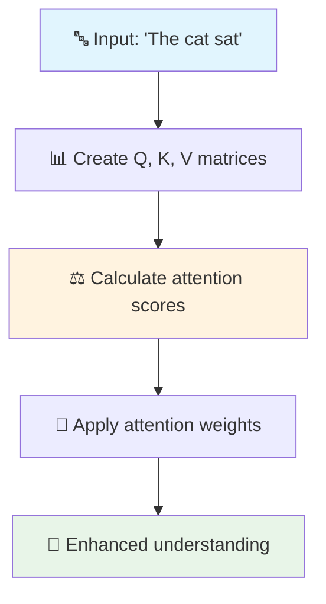

# Attention Mechanisms: The Heart of Transformers

!!! tip "👁️ The Magic of Focus"
    Attention is the breakthrough that made transformers possible. Let's understand this revolutionary concept through stories, analogies, and step-by-step examples!

## 🎯 What is Attention? (The Simple Story)

Imagine you're at a noisy party trying to have a conversation. Your brain automatically:

- 🔊 **Focuses** on your friend's voice
- 🚫 **Filters out** background noise
- 👁️ **Pays attention** to their facial expressions
- 🧠 **Combines** all relevant information to understand

**Attention in transformers works exactly the same way!**

### The Cocktail Party Problem

=== "🎉 The Problem"

    **Human Challenge:**
    ```
    🗣️ Friend: "Did you see the movie..."
    🎵 Music: "♪ Dancing through the night ♪"
    👥 Others: "...stock market crashed..."
    🍸 Bartender: "What can I get you?"
    ```
    
    **How do you focus on just your friend?**

=== "🧠 The Solution"

    **Your brain's attention mechanism:**
    1. 📡 **Receives** all audio signals simultaneously
    2. 🎯 **Identifies** your friend's voice pattern
    3. 📈 **Amplifies** their signal
    4. 📉 **Suppresses** irrelevant noise
    5. 💭 **Understands** the conversation
    
    **Transformers do this with text!**

## 🔍 Self-Attention: The Transformer's Superpower

### The Detective Story

Imagine reading this sentence: "The cat that was sleeping on the mat suddenly woke up."

**Question:** What woke up?

=== "🔍 Human Reading"

    **Your mind automatically:**
    - 👁️ Sees "woke up" at the end
    - 🔍 Scans back to find the subject
    - 🧠 Connects "woke up" with "cat"
    - ✅ Understands: The cat woke up
    
    **You use attention to connect distant words!**

=== "🤖 Transformer's Self-Attention"

    **For each word, the model asks:**
    1. **Query (Q):** "What am I looking for?"
    2. **Key (K):** "What information is available?"  
    3. **Value (V):** "What is the actual content?"
    
    **When processing "woke":**
    - 🔍 **Query:** "Who is the subject of this action?"
    - 🔑 **Keys:** All words provide their "identity"
    - 🎯 **Attention:** Highest score with "cat"
    - 💎 **Value:** Gets "cat's" meaning
    
    **Result:** "woke" strongly connected to "cat"!

## 🧮 The Math Behind the Magic (Simplified)

Don't worry - the concepts are more important than the formulas!

### The Three Steps of Attention

=== "📝 Step 1: Create Q, K, V"

    **Think of it as preparing for a library search:**
    
    ```
    For the word "woke":
    Query (Q) = "What am I looking for?" 
              = "Who performs this action?"
    
    For each word in the sentence:
    Key (K) = "What type of thing am I?"
    Value (V) = "What is my actual meaning?"
    
    Example:
    "cat" → Key: "I'm a living entity"
          → Value: [detailed cat meaning]
    "mat" → Key: "I'm an object" 
          → Value: [detailed mat meaning]
    ```

=== "⚖️ Step 2: Calculate Attention Scores"

    **Like asking "How relevant is each word?"**
    
    ```
    For "woke" looking at each word:
    
    Attention("woke", "cat") = Q_woke · K_cat = 0.9 (HIGH!)
    Attention("woke", "mat") = Q_woke · K_mat = 0.1 (low)
    Attention("woke", "the") = Q_woke · K_the = 0.0 (very low)
    
    After softmax (normalization):
    cat: 85%, mat: 10%, the: 5%
    ```

=== "🎯 Step 3: Get Weighted Values"

    **Combine information based on relevance:**
    
    ```
    Output for "woke" = 
      0.85 × Value_cat + 
      0.10 × Value_mat + 
      0.05 × Value_the
    
    Result: "woke" now contains mostly information about "cat"!
    ```

### Visual Example

Let's trace through "The cat sat":



**Attention matrix for "sat":**

|         | The | cat | sat |
|---------|-----|-----|-----|
| **sat** | 0.1 | 0.8 | 0.1 |

**Interpretation:** When processing "sat", the model pays 80% attention to "cat" (the subject doing the sitting)!

## 🚀 Multi-Head Attention: Multiple Experts

### The Team of Specialists

Imagine having **8 different experts** all analyze the same sentence:

=== "👥 The Expert Team"

    - **Expert 1 (Grammar):** Focuses on subject-verb relationships
    - **Expert 2 (Semantics):** Focuses on word meanings
    - **Expert 3 (References):** Focuses on pronouns and what they refer to
    - **Expert 4 (Context):** Focuses on broader context
    - **Expert 5 (Emotions):** Focuses on sentiment and tone
    - **Expert 6 (Entities):** Focuses on people, places, things
    - **Expert 7 (Actions):** Focuses on verbs and their objects
    - **Expert 8 (Modifiers):** Focuses on adjectives and adverbs

=== "🧠 How They Work Together"

    **Each expert (head) has their own Q, K, V matrices:**
    
    ```mermaid
    graph LR
        A["📝 Input"] --> B["👥 8 Attention Heads"]
        B --> C["🔄 Concatenate Results"]
        C --> D["📈 Final Understanding"]
        
        style A fill:#e1f5fe
        style D fill:#e8f5e8
    ```
    
    **For "The cat sat on the mat":**
    - **Head 1:** Connects "cat" → "sat" (subject-verb)
    - **Head 2:** Connects "sat" → "mat" (action-location)  
    - **Head 3:** Connects "the" → "cat" (determiner-noun)
    - **Head 4:** Understands overall scene composition
    - ... and so on!

=== "🎯 Why Multiple Heads?"

    **Different aspects need different attention patterns:**
    
    | Aspect | What It Focuses On | Example |
    |--------|-------------------|---------|
    | **Syntax** | Grammar rules | Subject agrees with verb |
    | **Semantics** | Word meanings | "Bark" = dog sound or tree covering? |
    | **Coreference** | What pronouns refer to | "John ate his lunch" - whose lunch? |
    | **Long-range** | Distant relationships | Beginning and end of long sentences |

## 🎨 Visualizing Attention

### Attention Heat Maps

When we visualize attention, we get beautiful patterns:

=== "📊 What the Colors Mean"

    **Bright colors = High attention**
    **Dark colors = Low attention**
    
    ```
    Sentence: "The cat that I saw yesterday was sleeping"
    
    When processing "sleeping":
    The     cat     that    I       saw     yesterday   was     sleeping
    🟦      🟨      🟦      🟦      🟦      🟦          🟧      🟥
    low     HIGH    low     low     low     low         med     self
    ```
    
    **Interpretation:** "sleeping" pays most attention to "cat" (the one doing the sleeping)!

=== "🔍 Real Examples"

    **Research has shown transformers learn to:**
    
    - 📝 **Track subjects and verbs** across long sentences
    - 🔗 **Resolve pronouns** to their antecedents  
    - 🌐 **Understand syntax** without explicit grammar rules
    - 📚 **Connect themes** across paragraphs
    - 🧠 **Build hierarchical representations** of meaning

## 🛠️ Types of Attention

### Self-Attention vs Cross-Attention

=== "🪞 Self-Attention"

    **Words attend to other words in the same sentence**
    
    ```
    Input:  "The cat sat on the mat"
    Output: Enhanced understanding of each word
    
    Process: Each word looks at all words (including itself)
    ```
    
    **Like:** Having an internal dialogue about what you just read

=== "🔄 Cross-Attention"

    **Words in one sequence attend to words in another sequence**
    
    ```
    French:  "Le chat dort"
    English: "The cat sleeps"
    
    Process: English words look at French words for translation
    ```
    
    **Like:** Looking back and forth between a book and its translation

### Masked vs Unmasked Attention

=== "👁️ Unmasked (Bidirectional)"

    **Can see the entire input (past and future)**
    
    ```
    Sentence: "The cat [MASK] on the mat"
    
    To predict [MASK], model can use:
    ✅ "The cat" (past)
    ✅ "on the mat" (future)
    
    Result: Better understanding, used in BERT
    ```

=== "🚫 Masked (Causal)"

    **Can only see past and present (not future)**
    
    ```
    Generating: "The cat ___"
    
    To predict next word, model can use:
    ✅ "The cat" (past and present)
    ❌ Future words (hidden)
    
    Result: Prevents cheating, used in GPT
    ```

## 🌟 Why Attention Works So Well

### The Revolution Explained

=== "📈 Before Transformers (RNNs)"

    **The Sequential Problem:**
    ```
    Step 1: Process "The" → Remember it
    Step 2: Process "cat" → Remember "The" + "cat"  
    Step 3: Process "sat" → Remember "The" + "cat" + "sat"
    ...
    Step 10: Process "mat" → Oops, forgot "The"!
    ```
    
    **Issues:**
    - 🐌 **Slow:** Must process one word at a time
    - 🧠 **Forgetful:** Information degrades over long sequences
    - 📏 **Limited:** Struggles with long documents

=== "⚡ With Transformers (Attention)"

    **The Parallel Solution:**
    ```
    All at once: Process entire sentence simultaneously
    Each word: Directly connects to every other word
    Result: Perfect memory + blazing speed
    ```
    
    **Benefits:**
    - ⚡ **Fast:** All words processed in parallel
    - 🧠 **Perfect memory:** Direct access to all information
    - 📚 **Unlimited:** Handles very long sequences
    - 🎯 **Precise:** Exact attention to relevant parts

## 🚀 Ready for Implementation?

Now that you understand how attention works, you're ready to see it in action!

**Next steps:**

- **[Implementation Guide](implementation.md)** - Build attention mechanisms from scratch
- **[Architecture Deep Dive](architecture.md)** - See how attention fits in the full transformer
- **[Optimization Techniques](optimization.md)** - Make attention faster and more efficient

---

!!! success "🎉 Attention Mastered!"
    You now understand the revolutionary mechanism that powers all modern AI! Attention enables transformers to focus on relevant information while processing everything in parallel - the key to their success.
