# Core Concepts of Transformers

!!! tip "🧠 Understanding the Building Blocks"
    Before diving into architecture details, let's understand the fundamental concepts that make transformers work. Think of this as learning the alphabet before reading words!

## 🎯 The Three Pillars of Transformers

Every transformer is built on three core concepts:

### 1. 🔢 Embeddings: Teaching Computers to Understand Words

**The Challenge:** Computers only understand numbers, but we want them to work with words.

**The Solution:** Convert every word into a vector (list of numbers) that captures meaning.

=== "📚 Simple Analogy"

    Think of word embeddings like a **universal translator**:
    
    - "Happy" → [0.8, 0.2, 0.9, -0.1, ...]
    - "Joyful" → [0.7, 0.3, 0.8, -0.2, ...]
    - "Sad" → [-0.6, 0.1, -0.4, 0.8, ...]
    
    **Notice:** Happy and joyful have similar numbers (they're close in meaning), while sad is very different!

=== "🧮 How It Works"

    ```mermaid
    graph LR
        A["🔤 Word: 'cat'"] --> B["📊 Lookup Table"]
        B --> C["🔢 Vector: [0.2, 0.8, -0.3, ...]"]
        C --> D["🧠 Neural Network"]
        
        style A fill:#e1f5fe
        style C fill:#e8f5e8
        style D fill:#fff3e0
    ```
    
    1. **Input:** Raw word
    2. **Lookup:** Find the word's unique number representation
    3. **Vector:** Get a dense list of meaningful numbers
    4. **Process:** Feed into neural network

=== "💡 Key Insights"

    - **Similarity:** Similar words have similar vectors
    - **Relationships:** Vector math captures word relationships
    - **Learning:** These vectors improve during training
    - **Context:** Same word can have different meanings in different contexts

### 2. 📍 Positional Encoding: Teaching Order Without Sequences

**The Problem:** Transformers process all words at once, but word order matters!

**Example:** "Dog bites man" vs "Man bites dog" - same words, very different meanings!

=== "🧭 The GPS for Words"

    Think of positional encoding like **GPS coordinates for words**:
    
    ```
    "The cat sat on the mat"
    
    Position 1: "The"   + [1.0, 0.0, 0.0, ...]
    Position 2: "cat"   + [0.0, 1.0, 0.0, ...]
    Position 3: "sat"   + [0.0, 0.0, 1.0, ...]
    Position 4: "on"    + [sin(4), cos(4), ...]
    Position 5: "the"   + [sin(5), cos(5), ...]
    Position 6: "mat"   + [sin(6), cos(6), ...]
    ```
    
    **Key insight:** Each position gets a unique "signature" that the model can recognize.

=== "🔬 Technical Details"

    **Why sine and cosine?**
    
    - **Uniqueness:** Every position gets a unique pattern
    - **Smoothness:** Similar positions have similar encodings
    - **Extrapolation:** Can handle longer sequences than seen in training
    - **Mathematical beauty:** Elegant and well-understood functions
    
    **The formula (don't worry about memorizing this!):**
    ```
    PE(pos, 2i) = sin(pos / 10000^(2i/d_model))
    PE(pos, 2i+1) = cos(pos / 10000^(2i/d_model))
    ```

=== "🎯 Why This Matters"

    **Without positional encoding:**
    ```
    "Dog bites man" → Same representation as "Man bites dog"
    ```
    
    **With positional encoding:**
    ```
    "Dog bites man" → [word meanings] + [position info] = Unique representation
    "Man bites dog" → [word meanings] + [position info] = Different representation
    ```

### 3. 👁️ Attention: The Magic of Focus

**The Breakthrough:** Attention allows models to focus on relevant parts of the input when processing each word.

=== "🔍 The Spotlight Metaphor"

    Imagine reading a sentence with a **smart spotlight**:
    
    **Sentence:** "The cat that I saw yesterday was sleeping."
    
    **When processing "was":**
    - 🔦 **Strong focus** on "cat" (the subject)
    - 🔦 **Medium focus** on "sleeping" (the main action)
    - 💡 **Weak focus** on "that", "I", "saw" (less relevant for this word)
    
    **Result:** The model understands "was" relates to the cat being in a sleeping state.

=== "🧮 Self-Attention in Action"

    **Three key questions for every word:**
    
    1. **Query (Q):** "What am I looking for?"
    2. **Key (K):** "What information do I have?"  
    3. **Value (V):** "What is the actual content?"
    
    **Process:**
    ```mermaid
    graph LR
        A["🔤 Input Words"] --> B["❓ Query"]
        A --> C["🔑 Key"]
        A --> D["💎 Value"]
        B --> E["⚖️ Attention Scores"]
        C --> E
        E --> F["🎯 Weighted Values"]
        D --> F
        F --> G["🧠 Understanding"]
        
        style A fill:#e1f5fe
        style G fill:#e8f5e8
    ```

=== "📊 Multi-Head Attention"

    **The Power of Multiple Perspectives:**
    
    Instead of one attention mechanism, transformers use **many "heads"** simultaneously:
    
    - **Head 1:** Focuses on grammatical relationships
    - **Head 2:** Focuses on semantic meaning
    - **Head 3:** Focuses on long-range dependencies
    - **Head 4:** Focuses on entities and references
    
    **Think of it like:** Having multiple experts analyze the same text, each with their specialty!

## 🔄 How These Concepts Work Together

Let's trace through a simple example: "The cat sat."

### Step 1: Word to Numbers

    "The" → [0.1, 0.8, 0.2, ...]  (embedding)
    "cat" → [0.9, 0.3, 0.7, ...]  (embedding)  
    "sat" → [0.4, 0.6, 0.1, ...]  (embedding)

### Step 2: Add Position Information

    "The" → [0.1, 0.8, 0.2, ...] + [1.0, 0.0, 0.0, ...] = [1.1, 0.8, 0.2, ...]
    "cat" → [0.9, 0.3, 0.7, ...] + [0.0, 1.0, 0.0, ...] = [0.9, 1.3, 0.7, ...]
    "sat" → [0.4, 0.6, 0.1, ...] + [0.0, 0.0, 1.0, ...] = [0.4, 0.6, 1.1, ...]

### Step 3: Apply Attention

    When processing "sat":
    - Look at "The": Low attention (0.1)
    - Look at "cat": High attention (0.8) ← Subject of the action!
    - Look at "sat": Medium attention (0.5) ← Self-reference

    Result: "sat" strongly connected to "cat"

### Step 4: Generate Understanding

The model now "knows" that in this sentence, "cat" is the one doing the sitting!

## 🌟 Advanced Concepts

### Layer Normalization: Keeping Things Stable

**Problem:** As information flows through many layers, numbers can get too big or too small.

**Solution:** **Layer normalization** - like having a thermostat that keeps the "temperature" of information just right.

=== "🌡️ The Thermostat Analogy"

    **Without normalization:**
    ```
    Layer 1: [1, 2, 3] → Layer 2: [10, 20, 30] → Layer 3: [100, 200, 300]
    Numbers keep growing! 📈
    ```
    
    **With normalization:**
    ```
    Layer 1: [1, 2, 3] → Normalize → [0.1, 0.2, 0.3]
    Layer 2: [0.1, 0.2, 0.3] → Process → [1.5, 2.1, 0.8] → Normalize → [0.3, 0.4, 0.2]
    Numbers stay manageable! ⚖️
    ```

### Feed-Forward Networks: The Thinking Layer

**Purpose:** After attention finds relationships, feed-forward networks do the "thinking."

**Analogy:** If attention is like **gathering all relevant information**, feed-forward is like **making decisions** based on that information.

=== "🧠 The Decision Process"

    ```mermaid
    graph LR
        A["👁️ Attention Output"] --> B["🧮 Linear Layer 1"]
        B --> C["⚡ ReLU Activation"]
        C --> D["🧮 Linear Layer 2"]
        D --> E["💡 Enhanced Understanding"]
        
        style A fill:#e1f5fe
        style E fill:#e8f5e8
    ```
    
    **What it does:**
    1. **Expand:** Take attention output and expand it to a larger dimension
    2. **Process:** Apply non-linear transformations (ReLU)
    3. **Compress:** Bring it back to original dimension
    4. **Enhance:** Output has richer, more processed information

### Residual Connections: The Memory Bridge

**Problem:** In deep networks, information can get lost or corrupted.

**Solution:** **Skip connections** that allow information to flow directly across layers.

=== "🌉 The Bridge Analogy"

    **Think of it like:** Having both a winding mountain road AND a straight bridge.
    
    - **Mountain road:** Complex processing through attention and feed-forward
    - **Bridge:** Direct path that preserves original information
    - **Destination:** Combines both processed and original information
    
    **Formula:** `Output = ProcessedInformation + OriginalInformation`

## 🎯 Putting It All Together

A transformer layer combines all these concepts:

```mermaid
graph TD
    A["📝 Input"] --> B["👁️ Multi-Head Attention"]
    A --> C["➕ Residual Connection"]
    B --> C
    C --> D["🌡️ Layer Norm"]
    D --> E["🧮 Feed-Forward"]
    D --> F["➕ Residual Connection"]
    E --> F
    F --> G["🌡️ Layer Norm"]
    G --> H["📤 Output"]
    
    style A fill:#e1f5fe
    style H fill:#e8f5e8
    style B fill:#fff3e0
    style E fill:#fff3e0
```



**The Flow:**

1. **Attention** finds relationships
2. **Residual** preserves original info
3. **Normalization** keeps numbers stable
4. **Feed-forward** processes information
5. **Residual** again preserves info
6. **Normalization** again keeps stable
7. **Output** goes to next layer

## 🚀 Ready for Architecture?

Now that you understand the building blocks, you're ready to see how they fit together in the full transformer architecture!

**Next up:** [Architecture Deep Dive](architecture.md) - See how these concepts combine to create the full transformer model.

---

!!! success "🧩 Core Concepts Mastered!"
    You now understand embeddings, positional encoding, and attention - the three pillars of transformers. These concepts form the foundation for everything else we'll explore!
