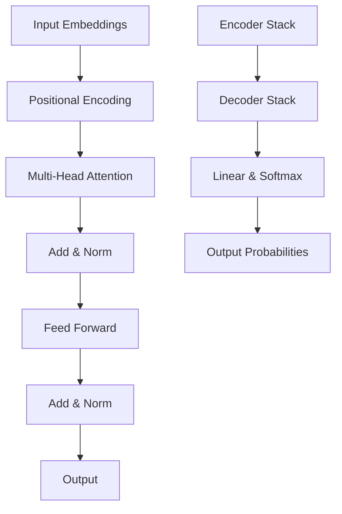

# Transformers & Architecture

!!! abstract "Deep Dive into Transformer Architecture"
    Master the revolutionary architecture that powers modern generative AI, from attention mechanisms to implementation details.

## 📚 Module Overview

<div class="grid cards" markdown>

-   :material-brain: **Architecture Deep Dive**
    
    ---
    
    Complete transformer architecture breakdown and design principles
    
    [Explore architecture →](architecture.md)

-   :material-eye: **Attention Mechanisms**
    
    ---
    
    Self-attention, multi-head attention, and variants
    
    [Master attention →](attention.md)

-   :material-code-braces: **Implementation**
    
    ---
    
    Build transformers from scratch with PyTorch/TensorFlow
    
    [Code transformers →](implementation.md)

-   :material-speedometer: **Optimization**
    
    ---
    
    Performance optimization and efficiency techniques
    
    [Optimize models →](optimization.md)

</div>

## 🎯 What You'll Master

- ✅ Understanding transformer architecture components
- ✅ Implementing attention mechanisms from scratch
- ✅ Building complete transformer models
- ✅ Optimizing transformer performance
- ✅ Understanding modern variants and improvements
- ✅ Debugging and troubleshooting transformer models

## 🔍 Transformer Revolution

The transformer architecture, introduced in "Attention Is All You Need" (2017), revolutionized machine learning by replacing recurrence and convolution with pure attention mechanisms.



### Why Transformers?

| Challenge | RNN/LSTM Solution | Transformer Solution |
|-----------|-------------------|---------------------|
| **Sequential Processing** | Process step by step | Parallel processing |
| **Long Dependencies** | Vanishing gradients | Direct attention |
| **Scalability** | Limited parallelization | Highly parallelizable |
| **Training Speed** | Slow on modern hardware | GPU/TPU optimized |
| **Memory Usage** | Hidden state bottleneck | Attention matrices |

## 🏗️ Complete Transformer Implementation

```python
import torch
import torch.nn as nn
import torch.nn.functional as F
import math
import numpy as np
from typing import Optional, Tuple

class MultiHeadAttention(nn.Module):
    def __init__(self, d_model: int, n_heads: int, dropout: float = 0.1):
        super().__init__()
        assert d_model % n_heads == 0
        
        self.d_model = d_model
        self.n_heads = n_heads
        self.d_k = d_model // n_heads
        
        # Linear projections for Q, K, V
        self.w_q = nn.Linear(d_model, d_model, bias=False)
        self.w_k = nn.Linear(d_model, d_model, bias=False)
        self.w_v = nn.Linear(d_model, d_model, bias=False)
        self.w_o = nn.Linear(d_model, d_model)
        
        self.dropout = nn.Dropout(dropout)
        self.scale = math.sqrt(self.d_k)
        
    def forward(self, query: torch.Tensor, key: torch.Tensor, value: torch.Tensor, 
                mask: Optional[torch.Tensor] = None) -> Tuple[torch.Tensor, torch.Tensor]:
        batch_size, seq_len = query.size(0), query.size(1)
        
        # Linear projections and reshape for multi-head
        Q = self.w_q(query).view(batch_size, seq_len, self.n_heads, self.d_k).transpose(1, 2)
        K = self.w_k(key).view(batch_size, -1, self.n_heads, self.d_k).transpose(1, 2)
        V = self.w_v(value).view(batch_size, -1, self.n_heads, self.d_k).transpose(1, 2)
        
        # Scaled dot-product attention
        attention_output, attention_weights = self.scaled_dot_product_attention(
            Q, K, V, mask, self.scale
        )
        
        # Concatenate heads
        attention_output = attention_output.transpose(1, 2).contiguous().view(
            batch_size, seq_len, self.d_model
        )
        
        # Final linear projection
        output = self.w_o(attention_output)
        
        return output, attention_weights
    
    def scaled_dot_product_attention(self, Q: torch.Tensor, K: torch.Tensor, 
                                   V: torch.Tensor, mask: Optional[torch.Tensor], 
                                   scale: float) -> Tuple[torch.Tensor, torch.Tensor]:
        # Compute attention scores
        scores = torch.matmul(Q, K.transpose(-2, -1)) / scale
        
        # Apply mask if provided
        if mask is not None:
            scores = scores.masked_fill(mask == 0, -1e9)
        
        # Apply softmax
        attention_weights = F.softmax(scores, dim=-1)
        attention_weights = self.dropout(attention_weights)
        
        # Apply attention to values
        output = torch.matmul(attention_weights, V)
        
        return output, attention_weights

class PositionalEncoding(nn.Module):
    def __init__(self, d_model: int, max_seq_length: int = 5000):
        super().__init__()
        
        pe = torch.zeros(max_seq_length, d_model)
        position = torch.arange(0, max_seq_length, dtype=torch.float).unsqueeze(1)
        
        div_term = torch.exp(torch.arange(0, d_model, 2).float() * 
                           (-math.log(10000.0) / d_model))
        
        pe[:, 0::2] = torch.sin(position * div_term)
        pe[:, 1::2] = torch.cos(position * div_term)
        
        self.register_buffer('pe', pe.unsqueeze(0))
        
    def forward(self, x: torch.Tensor) -> torch.Tensor:
        return x + self.pe[:, :x.size(1)]

class FeedForward(nn.Module):
    def __init__(self, d_model: int, d_ff: int, dropout: float = 0.1):
        super().__init__()
        self.linear1 = nn.Linear(d_model, d_ff)
        self.linear2 = nn.Linear(d_ff, d_model)
        self.dropout = nn.Dropout(dropout)
        self.activation = nn.ReLU()
        
    def forward(self, x: torch.Tensor) -> torch.Tensor:
        return self.linear2(self.dropout(self.activation(self.linear1(x))))

class TransformerEncoderLayer(nn.Module):
    def __init__(self, d_model: int, n_heads: int, d_ff: int, dropout: float = 0.1):
        super().__init__()
        self.self_attention = MultiHeadAttention(d_model, n_heads, dropout)
        self.feed_forward = FeedForward(d_model, d_ff, dropout)
        self.norm1 = nn.LayerNorm(d_model)
        self.norm2 = nn.LayerNorm(d_model)
        self.dropout = nn.Dropout(dropout)
        
    def forward(self, x: torch.Tensor, mask: Optional[torch.Tensor] = None) -> torch.Tensor:
        # Self-attention with residual connection
        attention_output, _ = self.self_attention(x, x, x, mask)
        x = self.norm1(x + self.dropout(attention_output))
        
        # Feed-forward with residual connection
        ff_output = self.feed_forward(x)
        x = self.norm2(x + self.dropout(ff_output))
        
        return x

class TransformerDecoderLayer(nn.Module):
    def __init__(self, d_model: int, n_heads: int, d_ff: int, dropout: float = 0.1):
        super().__init__()
        self.self_attention = MultiHeadAttention(d_model, n_heads, dropout)
        self.cross_attention = MultiHeadAttention(d_model, n_heads, dropout)
        self.feed_forward = FeedForward(d_model, d_ff, dropout)
        self.norm1 = nn.LayerNorm(d_model)
        self.norm2 = nn.LayerNorm(d_model)
        self.norm3 = nn.LayerNorm(d_model)
        self.dropout = nn.Dropout(dropout)
        
    def forward(self, x: torch.Tensor, encoder_output: torch.Tensor,
                src_mask: Optional[torch.Tensor] = None,
                tgt_mask: Optional[torch.Tensor] = None) -> torch.Tensor:
        # Self-attention on target sequence
        self_attn_output, _ = self.self_attention(x, x, x, tgt_mask)
        x = self.norm1(x + self.dropout(self_attn_output))
        
        # Cross-attention with encoder output
        cross_attn_output, _ = self.cross_attention(x, encoder_output, encoder_output, src_mask)
        x = self.norm2(x + self.dropout(cross_attn_output))
        
        # Feed-forward
        ff_output = self.feed_forward(x)
        x = self.norm3(x + self.dropout(ff_output))
        
        return x

class Transformer(nn.Module):
    def __init__(self, vocab_size: int, d_model: int = 512, n_heads: int = 8, 
                 n_encoder_layers: int = 6, n_decoder_layers: int = 6, 
                 d_ff: int = 2048, max_seq_length: int = 5000, dropout: float = 0.1):
        super().__init__()
        
        self.d_model = d_model
        self.vocab_size = vocab_size
        
        # Embeddings
        self.src_embedding = nn.Embedding(vocab_size, d_model)
        self.tgt_embedding = nn.Embedding(vocab_size, d_model)
        self.positional_encoding = PositionalEncoding(d_model, max_seq_length)
        
        # Encoder and Decoder layers
        self.encoder_layers = nn.ModuleList([
            TransformerEncoderLayer(d_model, n_heads, d_ff, dropout)
            for _ in range(n_encoder_layers)
        ])
        
        self.decoder_layers = nn.ModuleList([
            TransformerDecoderLayer(d_model, n_heads, d_ff, dropout)
            for _ in range(n_decoder_layers)
        ])
        
        # Output projection
        self.output_projection = nn.Linear(d_model, vocab_size)
        self.dropout = nn.Dropout(dropout)
        
        # Initialize weights
        self._init_weights()
        
    def _init_weights(self):
        for p in self.parameters():
            if p.dim() > 1:
                nn.init.xavier_uniform_(p)
    
    def encode(self, src: torch.Tensor, src_mask: Optional[torch.Tensor] = None) -> torch.Tensor:
        # Source embedding and positional encoding
        src_embedded = self.src_embedding(src) * math.sqrt(self.d_model)
        src_embedded = self.positional_encoding(src_embedded)
        src_embedded = self.dropout(src_embedded)
        
        # Pass through encoder layers
        encoder_output = src_embedded
        for layer in self.encoder_layers:
            encoder_output = layer(encoder_output, src_mask)
        
        return encoder_output
    
    def decode(self, tgt: torch.Tensor, encoder_output: torch.Tensor,
               src_mask: Optional[torch.Tensor] = None,
               tgt_mask: Optional[torch.Tensor] = None) -> torch.Tensor:
        # Target embedding and positional encoding
        tgt_embedded = self.tgt_embedding(tgt) * math.sqrt(self.d_model)
        tgt_embedded = self.positional_encoding(tgt_embedded)
        tgt_embedded = self.dropout(tgt_embedded)
        
        # Pass through decoder layers
        decoder_output = tgt_embedded
        for layer in self.decoder_layers:
            decoder_output = layer(decoder_output, encoder_output, src_mask, tgt_mask)
        
        return decoder_output
    
    def forward(self, src: torch.Tensor, tgt: torch.Tensor,
                src_mask: Optional[torch.Tensor] = None,
                tgt_mask: Optional[torch.Tensor] = None) -> torch.Tensor:
        # Encode source sequence
        encoder_output = self.encode(src, src_mask)
        
        # Decode target sequence
        decoder_output = self.decode(tgt, encoder_output, src_mask, tgt_mask)
        
        # Project to vocabulary
        output = self.output_projection(decoder_output)
        
        return output
    
    def generate_square_subsequent_mask(self, sz: int) -> torch.Tensor:
        """Generate causal mask for autoregressive generation"""
        mask = torch.triu(torch.ones(sz, sz), diagonal=1)
        return mask == 0

# GPT-style Decoder-only Transformer
class GPTTransformer(nn.Module):
    def __init__(self, vocab_size: int, d_model: int = 768, n_heads: int = 12,
                 n_layers: int = 12, d_ff: int = 3072, max_seq_length: int = 1024,
                 dropout: float = 0.1):
        super().__init__()
        
        self.d_model = d_model
        self.vocab_size = vocab_size
        
        # Token and position embeddings
        self.token_embedding = nn.Embedding(vocab_size, d_model)
        self.position_embedding = nn.Embedding(max_seq_length, d_model)
        
        # Transformer blocks
        self.transformer_blocks = nn.ModuleList([
            TransformerEncoderLayer(d_model, n_heads, d_ff, dropout)
            for _ in range(n_layers)
        ])
        
        # Layer norm and output projection
        self.layer_norm = nn.LayerNorm(d_model)
        self.lm_head = nn.Linear(d_model, vocab_size, bias=False)
        
        self.dropout = nn.Dropout(dropout)
        
        # Tie weights (optional optimization)
        self.lm_head.weight = self.token_embedding.weight
        
        self._init_weights()
    
    def _init_weights(self):
        for module in self.modules():
            if isinstance(module, nn.Linear):
                torch.nn.init.normal_(module.weight, mean=0.0, std=0.02)
                if module.bias is not None:
                    torch.nn.init.zeros_(module.bias)
            elif isinstance(module, nn.Embedding):
                torch.nn.init.normal_(module.weight, mean=0.0, std=0.02)
    
    def forward(self, input_ids: torch.Tensor, attention_mask: Optional[torch.Tensor] = None) -> torch.Tensor:
        batch_size, seq_length = input_ids.shape
        
        # Create position IDs
        position_ids = torch.arange(seq_length, device=input_ids.device).unsqueeze(0)
        
        # Embeddings
        token_embeds = self.token_embedding(input_ids)
        position_embeds = self.position_embedding(position_ids)
        hidden_states = self.dropout(token_embeds + position_embeds)
        
        # Create causal mask
        causal_mask = self.generate_square_subsequent_mask(seq_length).to(input_ids.device)
        if attention_mask is not None:
            # Combine with padding mask
            causal_mask = causal_mask.unsqueeze(0).unsqueeze(0) * attention_mask.unsqueeze(1).unsqueeze(2)
        
        # Pass through transformer blocks
        for block in self.transformer_blocks:
            hidden_states = block(hidden_states, causal_mask)
        
        # Apply final layer norm
        hidden_states = self.layer_norm(hidden_states)
        
        # Project to vocabulary
        logits = self.lm_head(hidden_states)
        
        return logits
    
    def generate_square_subsequent_mask(self, sz: int) -> torch.Tensor:
        """Generate causal mask"""
        return torch.triu(torch.ones(sz, sz), diagonal=1) == 0

# Example usage and training
class TransformerTrainer:
    def __init__(self, model: nn.Module, vocab_size: int):
        self.model = model
        self.vocab_size = vocab_size
        self.criterion = nn.CrossEntropyLoss(ignore_index=-100)
        
    def compute_loss(self, input_ids: torch.Tensor, labels: torch.Tensor) -> torch.Tensor:
        """Compute language modeling loss"""
        logits = self.model(input_ids)
        
        # Shift targets for next-token prediction
        shift_logits = logits[..., :-1, :].contiguous()
        shift_labels = labels[..., 1:].contiguous()
        
        # Flatten for loss computation
        loss = self.criterion(
            shift_logits.view(-1, self.vocab_size),
            shift_labels.view(-1)
        )
        
        return loss
    
    def train_step(self, batch: Dict[str, torch.Tensor], optimizer: torch.optim.Optimizer) -> float:
        """Single training step"""
        self.model.train()
        optimizer.zero_grad()
        
        input_ids = batch['input_ids']
        labels = batch.get('labels', input_ids)
        
        loss = self.compute_loss(input_ids, labels)
        loss.backward()
        
        # Gradient clipping
        torch.nn.utils.clip_grad_norm_(self.model.parameters(), max_norm=1.0)
        
        optimizer.step()
        
        return loss.item()
    
    def generate_text(self, prompt: torch.Tensor, max_length: int = 100, 
                     temperature: float = 1.0, top_k: int = 50) -> torch.Tensor:
        """Generate text autoregressively"""
        self.model.eval()
        generated = prompt.clone()
        
        with torch.no_grad():
            for _ in range(max_length):
                # Get logits for current sequence
                logits = self.model(generated)
                next_token_logits = logits[0, -1, :] / temperature
                
                # Apply top-k filtering
                if top_k > 0:
                    indices_to_remove = next_token_logits < torch.topk(next_token_logits, top_k)[0][..., -1, None]
                    next_token_logits[indices_to_remove] = -float('inf')
                
                # Sample next token
                probs = F.softmax(next_token_logits, dim=-1)
                next_token = torch.multinomial(probs, num_samples=1)
                
                # Append to sequence
                generated = torch.cat([generated, next_token.unsqueeze(0)], dim=1)
        
        return generated

# Performance optimization techniques
class OptimizedTransformer(GPTTransformer):
    def __init__(self, *args, use_flash_attention: bool = False, **kwargs):
        super().__init__(*args, **kwargs)
        self.use_flash_attention = use_flash_attention
        
    def forward(self, input_ids: torch.Tensor, attention_mask: Optional[torch.Tensor] = None) -> torch.Tensor:
        if self.use_flash_attention and hasattr(F, 'scaled_dot_product_attention'):
            # Use PyTorch's optimized attention when available
            return self._forward_with_flash_attention(input_ids, attention_mask)
        else:
            return super().forward(input_ids, attention_mask)
    
    def _forward_with_flash_attention(self, input_ids: torch.Tensor, attention_mask: Optional[torch.Tensor] = None) -> torch.Tensor:
        """Forward pass using Flash Attention for memory efficiency"""
        # Implementation would use optimized attention kernels
        # This is a placeholder for the optimization
        return super().forward(input_ids, attention_mask)

# Example demonstration
def demonstrate_transformer():
    """Demonstrate transformer implementation"""
    print("🤖 Transformer Architecture Demonstration")
    print("=" * 50)
    
    # Model parameters
    vocab_size = 10000
    d_model = 512
    n_heads = 8
    n_layers = 6
    max_seq_length = 1024
    
    # Create model
    model = GPTTransformer(
        vocab_size=vocab_size,
        d_model=d_model,
        n_heads=n_heads,
        n_layers=n_layers,
        max_seq_length=max_seq_length
    )
    
    # Model info
    total_params = sum(p.numel() for p in model.parameters())
    print(f"Model created with {total_params:,} parameters")
    
    # Sample input
    batch_size = 2
    seq_length = 64
    input_ids = torch.randint(0, vocab_size, (batch_size, seq_length))
    
    # Forward pass
    with torch.no_grad():
        output = model(input_ids)
        print(f"Input shape: {input_ids.shape}")
        print(f"Output shape: {output.shape}")
        print(f"Output vocabulary size: {output.size(-1)}")
    
    # Training setup
    trainer = TransformerTrainer(model, vocab_size)
    optimizer = torch.optim.AdamW(model.parameters(), lr=1e-4)
    
    # Sample training step
    batch = {'input_ids': input_ids}
    loss = trainer.train_step(batch, optimizer)
    print(f"Sample training loss: {loss:.4f}")
    
    # Generation example
    prompt = torch.randint(0, vocab_size, (1, 10))
    generated = trainer.generate_text(prompt, max_length=20)
    print(f"Generated sequence length: {generated.size(1)}")

if __name__ == "__main__":
    demonstrate_transformer()
```

## 🧠 Attention Mechanism Variants

### 1. Multi-Query Attention (MQA)

```python
class MultiQueryAttention(nn.Module):
    """Multi-Query Attention for faster inference"""
    
    def __init__(self, d_model: int, n_heads: int, dropout: float = 0.1):
        super().__init__()
        self.d_model = d_model
        self.n_heads = n_heads
        self.d_k = d_model // n_heads
        
        # Multiple query heads, single key and value
        self.w_q = nn.Linear(d_model, d_model, bias=False)
        self.w_k = nn.Linear(d_model, self.d_k, bias=False)  # Single head
        self.w_v = nn.Linear(d_model, self.d_k, bias=False)  # Single head
        self.w_o = nn.Linear(d_model, d_model)
        
        self.dropout = nn.Dropout(dropout)
        self.scale = math.sqrt(self.d_k)
    
    def forward(self, query: torch.Tensor, key: torch.Tensor, value: torch.Tensor,
                mask: Optional[torch.Tensor] = None) -> Tuple[torch.Tensor, torch.Tensor]:
        batch_size, seq_len = query.size(0), query.size(1)
        
        # Multiple query heads
        Q = self.w_q(query).view(batch_size, seq_len, self.n_heads, self.d_k).transpose(1, 2)
        
        # Single key and value heads (broadcast across query heads)
        K = self.w_k(key).unsqueeze(1).expand(-1, self.n_heads, -1, -1)  # [batch, n_heads, seq, d_k]
        V = self.w_v(value).unsqueeze(1).expand(-1, self.n_heads, -1, -1)  # [batch, n_heads, seq, d_k]
        
        # Attention computation
        scores = torch.matmul(Q, K.transpose(-2, -1)) / self.scale
        
        if mask is not None:
            scores = scores.masked_fill(mask == 0, -1e9)
        
        attention_weights = F.softmax(scores, dim=-1)
        attention_weights = self.dropout(attention_weights)
        
        output = torch.matmul(attention_weights, V)
        
        # Reshape and project
        output = output.transpose(1, 2).contiguous().view(batch_size, seq_len, self.d_model)
        output = self.w_o(output)
        
        return output, attention_weights
```

### 2. Grouped Query Attention (GQA)

```python
class GroupedQueryAttention(nn.Module):
    """Grouped Query Attention - balance between MHA and MQA"""
    
    def __init__(self, d_model: int, n_heads: int, n_kv_heads: int, dropout: float = 0.1):
        super().__init__()
        assert n_heads % n_kv_heads == 0
        
        self.d_model = d_model
        self.n_heads = n_heads
        self.n_kv_heads = n_kv_heads
        self.n_rep = n_heads // n_kv_heads  # How many query heads per kv head
        self.d_k = d_model // n_heads
        
        self.w_q = nn.Linear(d_model, d_model, bias=False)
        self.w_k = nn.Linear(d_model, n_kv_heads * self.d_k, bias=False)
        self.w_v = nn.Linear(d_model, n_kv_heads * self.d_k, bias=False)
        self.w_o = nn.Linear(d_model, d_model)
        
        self.dropout = nn.Dropout(dropout)
        self.scale = math.sqrt(self.d_k)
    
    def forward(self, query: torch.Tensor, key: torch.Tensor, value: torch.Tensor,
                mask: Optional[torch.Tensor] = None) -> Tuple[torch.Tensor, torch.Tensor]:
        batch_size, seq_len = query.size(0), query.size(1)
        
        # Project and reshape
        Q = self.w_q(query).view(batch_size, seq_len, self.n_heads, self.d_k).transpose(1, 2)
        K = self.w_k(key).view(batch_size, -1, self.n_kv_heads, self.d_k).transpose(1, 2)
        V = self.w_v(value).view(batch_size, -1, self.n_kv_heads, self.d_k).transpose(1, 2)
        
        # Repeat K and V for each group
        K = K.repeat_interleave(self.n_rep, dim=1)
        V = V.repeat_interleave(self.n_rep, dim=1)
        
        # Standard attention computation
        scores = torch.matmul(Q, K.transpose(-2, -1)) / self.scale
        
        if mask is not None:
            scores = scores.masked_fill(mask == 0, -1e9)
        
        attention_weights = F.softmax(scores, dim=-1)
        attention_weights = self.dropout(attention_weights)
        
        output = torch.matmul(attention_weights, V)
        
        # Reshape and project
        output = output.transpose(1, 2).contiguous().view(batch_size, seq_len, self.d_model)
        output = self.w_o(output)
        
        return output, attention_weights
```

### 3. Sliding Window Attention

```python
class SlidingWindowAttention(nn.Module):
    """Sliding Window Attention for long sequences"""
    
    def __init__(self, d_model: int, n_heads: int, window_size: int, dropout: float = 0.1):
        super().__init__()
        self.d_model = d_model
        self.n_heads = n_heads
        self.d_k = d_model // n_heads
        self.window_size = window_size
        
        self.w_q = nn.Linear(d_model, d_model, bias=False)
        self.w_k = nn.Linear(d_model, d_model, bias=False)
        self.w_v = nn.Linear(d_model, d_model, bias=False)
        self.w_o = nn.Linear(d_model, d_model)
        
        self.dropout = nn.Dropout(dropout)
        self.scale = math.sqrt(self.d_k)
    
    def create_sliding_window_mask(self, seq_len: int, device: torch.device) -> torch.Tensor:
        """Create sliding window attention mask"""
        mask = torch.zeros(seq_len, seq_len, device=device)
        
        for i in range(seq_len):
            start = max(0, i - self.window_size // 2)
            end = min(seq_len, i + self.window_size // 2 + 1)
            mask[i, start:end] = 1
        
        return mask.bool()
    
    def forward(self, query: torch.Tensor, key: torch.Tensor, value: torch.Tensor,
                mask: Optional[torch.Tensor] = None) -> Tuple[torch.Tensor, torch.Tensor]:
        batch_size, seq_len = query.size(0), query.size(1)
        
        # Standard multi-head projection
        Q = self.w_q(query).view(batch_size, seq_len, self.n_heads, self.d_k).transpose(1, 2)
        K = self.w_k(key).view(batch_size, -1, self.n_heads, self.d_k).transpose(1, 2)
        V = self.w_v(value).view(batch_size, -1, self.n_heads, self.d_k).transpose(1, 2)
        
        # Create sliding window mask
        window_mask = self.create_sliding_window_mask(seq_len, query.device)
        window_mask = window_mask.unsqueeze(0).unsqueeze(0)  # [1, 1, seq_len, seq_len]
        
        # Combine with provided mask
        if mask is not None:
            window_mask = window_mask & mask
        
        # Attention computation
        scores = torch.matmul(Q, K.transpose(-2, -1)) / self.scale
        scores = scores.masked_fill(~window_mask, -1e9)
        
        attention_weights = F.softmax(scores, dim=-1)
        attention_weights = self.dropout(attention_weights)
        
        output = torch.matmul(attention_weights, V)
        
        # Reshape and project
        output = output.transpose(1, 2).contiguous().view(batch_size, seq_len, self.d_model)
        output = self.w_o(output)
        
        return output, attention_weights
```

## ⚡ Performance Optimization Techniques

### 1. Gradient Checkpointing

```python
class GradientCheckpointTransformer(GPTTransformer):
    """Transformer with gradient checkpointing for memory efficiency"""
    
    def __init__(self, *args, use_checkpoint: bool = True, **kwargs):
        super().__init__(*args, **kwargs)
        self.use_checkpoint = use_checkpoint
    
    def forward(self, input_ids: torch.Tensor, attention_mask: Optional[torch.Tensor] = None) -> torch.Tensor:
        batch_size, seq_length = input_ids.shape
        
        # Embeddings
        position_ids = torch.arange(seq_length, device=input_ids.device).unsqueeze(0)
        token_embeds = self.token_embedding(input_ids)
        position_embeds = self.position_embedding(position_ids)
        hidden_states = self.dropout(token_embeds + position_embeds)
        
        # Create causal mask
        causal_mask = self.generate_square_subsequent_mask(seq_length).to(input_ids.device)
        if attention_mask is not None:
            causal_mask = causal_mask.unsqueeze(0).unsqueeze(0) * attention_mask.unsqueeze(1).unsqueeze(2)
        
        # Pass through transformer blocks with optional checkpointing
        for block in self.transformer_blocks:
            if self.use_checkpoint and self.training:
                hidden_states = torch.utils.checkpoint.checkpoint(block, hidden_states, causal_mask)
            else:
                hidden_states = block(hidden_states, causal_mask)
        
        hidden_states = self.layer_norm(hidden_states)
        logits = self.lm_head(hidden_states)
        
        return logits
```

### 2. Memory-Efficient Attention

```python
def memory_efficient_attention(query: torch.Tensor, key: torch.Tensor, value: torch.Tensor,
                              mask: Optional[torch.Tensor] = None, chunk_size: int = 1024) -> torch.Tensor:
    """Memory-efficient attention computation using chunking"""
    batch_size, n_heads, seq_len, d_k = query.shape
    
    # If sequence is short enough, use standard attention
    if seq_len <= chunk_size:
        scores = torch.matmul(query, key.transpose(-2, -1)) / math.sqrt(d_k)
        if mask is not None:
            scores = scores.masked_fill(mask == 0, -1e9)
        attention_weights = F.softmax(scores, dim=-1)
        return torch.matmul(attention_weights, value)
    
    # Chunked computation for long sequences
    output = torch.zeros_like(query)
    
    for i in range(0, seq_len, chunk_size):
        end_i = min(i + chunk_size, seq_len)
        q_chunk = query[:, :, i:end_i]
        
        # Compute attention for this query chunk against all keys
        scores_chunk = torch.matmul(q_chunk, key.transpose(-2, -1)) / math.sqrt(d_k)
        
        if mask is not None:
            mask_chunk = mask[:, :, i:end_i, :]
            scores_chunk = scores_chunk.masked_fill(mask_chunk == 0, -1e9)
        
        attention_weights_chunk = F.softmax(scores_chunk, dim=-1)
        output_chunk = torch.matmul(attention_weights_chunk, value)
        output[:, :, i:end_i] = output_chunk
    
    return output
```

### 3. Mixed Precision Training

```python
class MixedPrecisionTrainer(TransformerTrainer):
    """Trainer with mixed precision support"""
    
    def __init__(self, model: nn.Module, vocab_size: int, use_amp: bool = True):
        super().__init__(model, vocab_size)
        self.use_amp = use_amp
        self.scaler = torch.cuda.amp.GradScaler() if use_amp else None
    
    def train_step(self, batch: Dict[str, torch.Tensor], optimizer: torch.optim.Optimizer) -> float:
        """Training step with automatic mixed precision"""
        self.model.train()
        optimizer.zero_grad()
        
        input_ids = batch['input_ids']
        labels = batch.get('labels', input_ids)
        
        if self.use_amp:
            with torch.cuda.amp.autocast():
                loss = self.compute_loss(input_ids, labels)
            
            self.scaler.scale(loss).backward()
            self.scaler.unscale_(optimizer)
            torch.nn.utils.clip_grad_norm_(self.model.parameters(), max_norm=1.0)
            self.scaler.step(optimizer)
            self.scaler.update()
        else:
            loss = self.compute_loss(input_ids, labels)
            loss.backward()
            torch.nn.utils.clip_grad_norm_(self.model.parameters(), max_norm=1.0)
            optimizer.step()
        
        return loss.item()
```

## 🔧 Model Analysis Tools

```python
class TransformerAnalyzer:
    """Tools for analyzing transformer models"""
    
    def __init__(self, model: nn.Module):
        self.model = model
        self.hooks = []
        
    def analyze_attention_patterns(self, input_ids: torch.Tensor, layer_idx: int = 0) -> Dict[str, torch.Tensor]:
        """Analyze attention patterns in a specific layer"""
        attention_weights = {}
        
        def attention_hook(module, input, output):
            if hasattr(module, 'self_attention'):
                # Extract attention weights from the output
                attention_weights['weights'] = output[1] if isinstance(output, tuple) else None
        
        # Register hook
        if hasattr(self.model, 'transformer_blocks'):
            handle = self.model.transformer_blocks[layer_idx].register_forward_hook(attention_hook)
        else:
            handle = list(self.model.children())[layer_idx].register_forward_hook(attention_hook)
        
        # Forward pass
        with torch.no_grad():
            _ = self.model(input_ids)
        
        # Remove hook
        handle.remove()
        
        return attention_weights
    
    def get_model_statistics(self) -> Dict[str, Any]:
        """Get detailed model statistics"""
        stats = {
            'total_parameters': 0,
            'trainable_parameters': 0,
            'layers': [],
            'memory_usage': 0
        }
        
        for name, param in self.model.named_parameters():
            stats['total_parameters'] += param.numel()
            if param.requires_grad:
                stats['trainable_parameters'] += param.numel()
            
            stats['memory_usage'] += param.numel() * param.element_size()
        
        # Convert to MB
        stats['memory_usage'] = stats['memory_usage'] / (1024 * 1024)
        
        # Analyze layer structure
        for name, module in self.model.named_modules():
            if len(list(module.children())) == 0:  # Leaf modules
                param_count = sum(p.numel() for p in module.parameters())
                stats['layers'].append({
                    'name': name,
                    'type': type(module).__name__,
                    'parameters': param_count
                })
        
        return stats
    
    def visualize_attention_heads(self, input_ids: torch.Tensor, layer_idx: int = 0):
        """Visualize attention head patterns"""
        attention_data = self.analyze_attention_patterns(input_ids, layer_idx)
        
        if 'weights' in attention_data and attention_data['weights'] is not None:
            weights = attention_data['weights'][0]  # First batch item
            
            print(f"Attention weights shape: {weights.shape}")
            print(f"Number of heads: {weights.shape[0]}")
            print(f"Sequence length: {weights.shape[1]}")
            
            # Calculate attention entropy for each head
            for head_idx in range(weights.shape[0]):
                head_weights = weights[head_idx]
                entropy = -torch.sum(head_weights * torch.log(head_weights + 1e-9), dim=-1).mean()
                print(f"Head {head_idx} average entropy: {entropy:.4f}")
        
        return attention_data
    
    def profile_inference_speed(self, input_ids: torch.Tensor, num_runs: int = 100) -> Dict[str, float]:
        """Profile model inference speed"""
        import time
        
        self.model.eval()
        device = next(self.model.parameters()).device
        input_ids = input_ids.to(device)
        
        # Warmup
        with torch.no_grad():
            for _ in range(10):
                _ = self.model(input_ids)
        
        # Timing runs
        torch.cuda.synchronize() if torch.cuda.is_available() else None
        start_time = time.time()
        
        with torch.no_grad():
            for _ in range(num_runs):
                _ = self.model(input_ids)
        
        torch.cuda.synchronize() if torch.cuda.is_available() else None
        end_time = time.time()
        
        total_time = end_time - start_time
        avg_time = total_time / num_runs
        
        return {
            'total_time': total_time,
            'average_time': avg_time,
            'throughput': num_runs / total_time,
            'tokens_per_second': (input_ids.numel() * num_runs) / total_time
        }

# Example usage
def analyze_transformer_model():
    """Demonstrate transformer analysis"""
    print("🔍 Transformer Analysis Demonstration")
    print("=" * 50)
    
    # Create model
    model = GPTTransformer(vocab_size=1000, d_model=256, n_heads=8, n_layers=4)
    analyzer = TransformerAnalyzer(model)
    
    # Get model statistics
    stats = analyzer.get_model_statistics()
    print(f"Total parameters: {stats['total_parameters']:,}")
    print(f"Trainable parameters: {stats['trainable_parameters']:,}")
    print(f"Memory usage: {stats['memory_usage']:.2f} MB")
    
    # Sample input
    input_ids = torch.randint(0, 1000, (1, 32))
    
    # Analyze attention patterns
    attention_data = analyzer.visualize_attention_heads(input_ids, layer_idx=0)
    
    # Profile inference speed
    speed_stats = analyzer.profile_inference_speed(input_ids, num_runs=50)
    print(f"Average inference time: {speed_stats['average_time']:.4f}s")
    print(f"Tokens per second: {speed_stats['tokens_per_second']:.0f}")

if __name__ == "__main__":
    analyze_transformer_model()
```

## 📚 Next Steps

Ready to dive deeper into specific aspects? Continue with:

1. **[LLMs](../llms/index.md)** - Apply transformer knowledge to large language models
2. **[Fine-tuning](../fine-tuning/index.md)** - Customize transformer models for specific tasks
3. **[Optimization](optimization.md)** - Advanced performance optimization techniques
4. **[Implementation](implementation.md)** - Build transformers from scratch

---

!!! success "Transformer Architecture Mastered!"
    You now have deep understanding of transformer architecture from theory to implementation. This knowledge forms the foundation for all modern generative AI systems.
