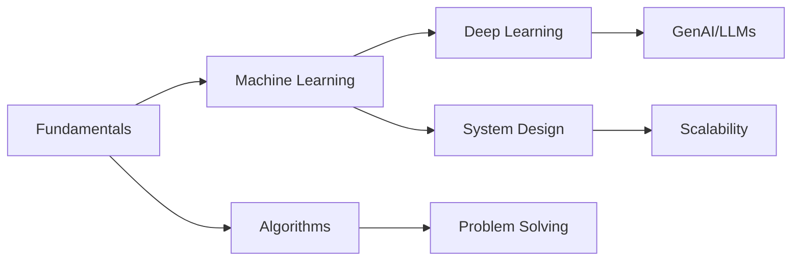

# Welcome to My Learning Journey! 🚀

-   :material-brain: __Machine Learning__

    ---

    Explore the fundamentals of ML, algorithms, deep learning, and MLOps practices.

    [:octicons-arrow-right-24: Getting started](ml/index.md)

-   :material-robot: __Generative AI__

    ---

    Dive into LLMs, prompt engineering, RAG systems, and fine-tuning techniques.

    [:octicons-arrow-right-24: Learn more](genai/index.md)

-   :material-server-network: __System Design__

    ---

    Master scalable architectures, databases, microservices, and distributed systems.

    [:octicons-arrow-right-24: Explore](system-design/index.md)

-   :material-chart-timeline-variant: __Algorithms & Data Structures__

    ---

    Study fundamental algorithms, data structures, and problem-solving patterns.

    [:octicons-arrow-right-24: Practice](algorithms/index.md)

## About This Site

Welcome to my personal learning documentation! This site is a comprehensive collection of my journey through various technical domains. Here you'll find:

!!! info "What You'll Find Here"
    
    - **Detailed Notes**: In-depth explanations of concepts I've learned
    - **Code Examples**: Practical implementations and snippets
    - **Best Practices**: Industry standards and proven approaches
    - **Resources**: Curated links to valuable learning materials
    - **Personal Insights**: My thoughts and experiences along the way

## Recent Updates

!!! tip "Latest Content"
    
    - Added new section on RAG (Retrieval-Augmented Generation)
    - Updated system design fundamentals
    - New algorithm implementations in Python
    - Fresh blog posts on AI/ML trends

## Learning Path

## Get Started

Choose your learning path:

=== "Beginner"

    Start with fundamentals and build a strong foundation:
    
    1. [Algorithm Fundamentals](algorithms/index.md)
    2. [System Design Basics](system-design/fundamentals.md)
    3. [ML Fundamentals](ml/fundamentals.md)

=== "Intermediate"

    Dive deeper into specific domains:
    
    1. [Advanced ML Algorithms](ml/algorithms.md)
    2. [System Architecture](system-design/scalability.md)
    3. [GenAI Applications](genai/llms.md)

=== "Advanced"

    Explore cutting-edge topics:
    
    1. [MLOps & Production](ml/mlops.md)
    2. [Advanced GenAI](genai/fine-tuning.md)
    3. [Distributed Systems](system-design/microservices.md)

---

!!! quote "Learning Philosophy"
    
    "The beautiful thing about learning is that no one can take it away from you." - B.B. King
    
    This documentation represents my continuous journey of learning and growth in technology.

## Connect With Me

Feel free to reach out if you have questions, suggestions, or just want to discuss any of these topics!

[Get in touch :fontawesome-solid-paper-plane:](mailto:your.email@example.com){ .md-button .md-button--primary }
