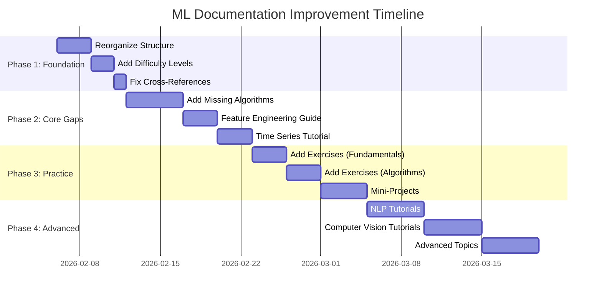

# ML Documentation Improvement Action Plan

**Created**: 2026-02-06
**Goal**: Transform ML documentation from good to exceptional
**Timeline**: 4-6 weeks for complete execution
**Status**: 🟡 Planning Phase

---

## 📊 Current State Assessment

### Strengths ✅
- Comprehensive fundamentals coverage
- Production-quality code examples
- Strong MLOps section
- Accurate mathematical explanations
- Good use of Mermaid diagrams

### Critical Issues ❌
- Files too large (1,746-3,824 lines)
- No difficulty progression
- Missing 15+ core topics
- Zero practice problems
- Broken cross-references
- Content organization unclear

---

## 🎯 Success Metrics

By completion, the ML documentation will have:
- [ ] All files under 800 lines
- [ ] Clear beginner → intermediate → advanced paths
- [ ] 100% of cross-references working
- [ ] 50+ practice problems across all topics
- [ ] 20+ new topic pages covering gaps
- [ ] 30+ interactive examples with visualizations
- [ ] Learning time estimates for each topic
- [ ] Difficulty badges on every section

---

## 📅 Implementation Phases



---

## Phase 1: Foundation (Week 1) 🏗️

**Goal**: Reorganize existing content for better navigation and usability
**Priority**: 🔴 Critical
**Effort**: ~20 hours
**Dependencies**: None

### Task 1.1: Reorganize File Structure

**Current Problem**:
- `fundamentals/index.md`: 1,746 lines (too large!)
- `algorithms/index.md`: 1,960 lines (too large!)
- `deep-learning/index.md`: 2,815 lines (too large!)
- `mlops/index.md`: 3,824 lines (way too large!)

**Action Steps**:

1. **Split `fundamentals/index.md` into**:
   ```
   fundamentals/
   ├── index.md (Overview + navigation - 300 lines)
   ├── core-concepts.md (ML types, bias-variance - 400 lines)
   ├── mathematics.md (Linear algebra, calculus, stats - 500 lines)
   ├── data-preprocessing.md (Cleaning, scaling, encoding - 400 lines)
   └── evaluation-metrics.md (Metrics, cross-validation - 400 lines)
   ```

2. **Split `algorithms/index.md` into**:
   ```
   algorithms/
   ├── index.md (Overview + selection guide - 400 lines)
   ├── linear-models.md (Linear/Logistic regression - 500 lines)
   ├── tree-based.md (Decision trees, Random Forest - 500 lines)
   ├── ensemble-methods.md (NEW - Boosting, stacking - 500 lines)
   ├── support-vector-machines.md (SVM with kernels - 400 lines)
   ├── naive-bayes.md (NEW - Gaussian, Multinomial, Bernoulli - 300 lines)
   ├── k-nearest-neighbors.md (KNN - 300 lines)
   ├── clustering.md (K-Means, DBSCAN, Hierarchical - 500 lines)
   └── dimensionality-reduction.md (PCA, t-SNE, UMAP - 400 lines)
   ```

3. **Split `deep-learning/index.md` into**:
   ```
   deep-learning/
   ├── index.md (Overview - 400 lines)
   ├── neural-networks-basics.md (Perceptron, backprop - 500 lines)
   ├── training-optimization.md (Optimizers, regularization - 500 lines)
   ├── convolutional-networks.md (CNNs, architectures - 600 lines)
   ├── recurrent-networks.md (RNNs, LSTMs, GRUs - 600 lines)
   ├── transformers.md (Attention, BERT, GPT - 600 lines)
   └── advanced-architectures.md (GANs, VAEs, etc. - 500 lines)
   ```

4. **Split `mlops/index.md` into**:
   ```
   mlops/
   ├── index.md (Overview - 400 lines)
   ├── experiment-tracking.md (MLflow, W&B - 600 lines)
   ├── model-deployment.md (Docker, FastAPI, serving - 700 lines)
   ├── monitoring-maintenance.md (Drift, performance - 600 lines)
   ├── ci-cd-ml.md (GitHub Actions, automation - 600 lines)
   └── feature-stores.md (Tecton, Feast - 500 lines)
   ```

**Commands to Use**:
```bash
# For each large file:
/shard-doc [file-path]  # Split into logical sections

# Then review and refine each new file
```

**Checklist**:
- [ ] Split fundamentals/index.md into 5 files
- [ ] Split algorithms/index.md into 9 files
- [ ] Split deep-learning/index.md into 7 files
- [ ] Split mlops/index.md into 6 files
- [ ] Update mkdocs.yml navigation
- [ ] Test all internal links

---

### Task 1.2: Add Difficulty Levels and Prerequisites

**Action Steps**:

1. **Add header template to every tutorial**:
   ```markdown
   # [Topic Name]

   **Difficulty**: 🟢 Beginner | 🟡 Intermediate | 🔴 Advanced
   **Prerequisites**:
   - [Prerequisite 1](link)
   - [Prerequisite 2](link)
   **Time to Learn**: X hours
   **Related Topics**: [Topic 1](link), [Topic 2](link)

   ---

   [Content starts here]
   ```

2. **Tag every major section**:
   ```markdown
   ## Concept Name (🟢 Beginner)
   [Simple explanation]

   ## Mathematical Foundation (🟡 Intermediate)
   [Math details]

   ## Advanced Techniques (🔴 Advanced)
   [Advanced content]
   ```

3. **Create learning path navigation**:
   ```markdown
   ## Recommended Learning Path

   ### Beginner Track (Total: 40 hours)
   1. 🟢 [Core Concepts](core-concepts.md) - 4 hours
   2. 🟢 [Linear Models](../algorithms/linear-models.md) - 6 hours
   3. 🟢 [Tree-Based Models](../algorithms/tree-based.md) - 6 hours
   ...

   ### Intermediate Track (Total: 60 hours)
   [After completing beginner track]
   1. 🟡 [Mathematics](mathematics.md) - 8 hours
   2. 🟡 [Ensemble Methods](../algorithms/ensemble-methods.md) - 8 hours
   ...

   ### Advanced Track (Total: 80 hours)
   [After completing intermediate track]
   1. 🔴 [Deep Learning](../deep-learning/neural-networks-basics.md) - 12 hours
   ...
   ```

**Commands to Use**:
```bash
/tutorial:enhance-tutorial [file-path]
# Request: "Add difficulty level, prerequisites, and time estimate to header"
```

**Checklist**:
- [ ] Add headers to all 27+ tutorial files
- [ ] Create learning path pages for each track
- [ ] Add navigation breadcrumbs
- [ ] Create difficulty filter in index

---

### Task 1.3: Fix Cross-References and Navigation

**Action Steps**:

1. **Audit all broken links**:
   ```bash
   # Find all markdown links
   grep -r "\[.*\](.*\.md)" docs/ml/ > ml-links.txt

   # Check which files don't exist
   # Create or update references
   ```

2. **Create missing stub pages**:
   - `advanced-topics/feature-engineering.md`
   - `advanced-topics/time-series.md`
   - `applications/nlp/index.md`
   - `applications/computer-vision/index.md`
   - `applications/recommender-systems/index.md`

3. **Add consistent "Next Steps" section**:
   ```markdown
   ## Next Steps

   ### Continue Learning
   - 🟢 **Next Topic**: [Logistic Regression](logistic-regression.md)
   - 🟡 **Advanced Version**: [Regularized Linear Models](regularization.md)
   - 🔴 **Applied**: [Linear Models in Production](../../mlops/deployment.md)

   ### Practice
   - [Linear Regression Exercises](../../practice/linear-models-exercises.md)
   - [Mini-Project: House Price Prediction](../../practice/projects/house-prices.md)

   ### Related Topics
   - [Data Preprocessing](../fundamentals/data-preprocessing.md)
   - [Feature Engineering](../advanced-topics/feature-engineering.md)
   ```

**Commands to Use**:
```bash
# Check for broken links
grep -r "](.*\.md)" docs/ml/ | grep -v "http"

# Update references with /tutorial:enhance-tutorial
```

**Checklist**:
- [ ] Audit all internal links
- [ ] Create stub pages for referenced but missing topics
- [ ] Add "Next Steps" to all tutorials
- [ ] Add breadcrumb navigation
- [ ] Test all links manually

---

## Phase 2: Fill Core Gaps (Week 2-3) 🔧

**Goal**: Add missing essential ML topics
**Priority**: 🔴 Critical
**Effort**: ~40 hours
**Dependencies**: Phase 1 complete

### Task 2.1: Add Missing Algorithms

#### 2.1a: Create Naive Bayes Tutorial

**Why It's Missing**: Fundamental probabilistic classifier, essential for text classification

**Content Outline**:
```markdown
algorithms/naive-bayes.md

# Naive Bayes Classifiers

## Overview (🟢 Beginner)
- Intuition: Based on Bayes' theorem
- Use cases: Text classification, spam detection
- Assumptions: Feature independence (naive!)

## How It Works (🟡 Intermediate)
- Bayes' theorem explanation
- Gaussian Naive Bayes (continuous features)
- Multinomial Naive Bayes (count features)
- Bernoulli Naive Bayes (binary features)

## Implementation (🟢 Beginner)
- Scikit-learn examples
- Text classification walkthrough
- Spam detection project

## When to Use
- Fast training and prediction
- Works well with high-dimensional data
- Good baseline for text problems

## Limitations
- Independence assumption rarely holds
- Poor probability estimates
```

**Command**:
```bash
/tutorial:new-tutorial "Create comprehensive Naive Bayes tutorial covering Gaussian, Multinomial, and Bernoulli variants with text classification examples"
```

**Checklist**:
- [ ] Create `algorithms/naive-bayes.md`
- [ ] Add mathematical derivation
- [ ] Include 3 code examples (Gaussian, Multinomial, Bernoulli)
- [ ] Add text classification walkthrough
- [ ] Create spam detection mini-project
- [ ] Add comparison with other classifiers

---

#### 2.1b: Expand Ensemble Methods

**Why It's Missing**: Only brief mentions, needs deep coverage

**Content Outline**:
```markdown
algorithms/ensemble-methods.md

# Ensemble Learning

## Core Concepts (🟡 Intermediate)
- Why ensembles work (wisdom of crowds)
- Bias-variance decomposition
- Ensemble diversity

## Bagging (🟡 Intermediate)
- Bootstrap aggregating
- Random Forest (link to existing)
- Extra Trees
- Out-of-bag evaluation

## Boosting (🟡 Intermediate)
- AdaBoost algorithm
- Gradient Boosting
- XGBoost deep dive
- LightGBM deep dive
- CatBoost for categorical features

## Stacking (🔴 Advanced)
- Meta-learning concept
- Two-level stacking
- Stacking with cross-validation
- Implementation examples

## Voting (🟢 Beginner)
- Hard voting
- Soft voting
- Weighted voting

## Comparison and Selection
[Table comparing all methods]
```

**Command**:
```bash
/tutorial:new-tutorial "Create comprehensive Ensemble Methods guide covering bagging, boosting, stacking, and voting with detailed XGBoost and LightGBM examples"
```

**Checklist**:
- [ ] Create `algorithms/ensemble-methods.md`
- [ ] Add AdaBoost from scratch
- [ ] Deep dive into XGBoost parameters
- [ ] Compare XGBoost, LightGBM, CatBoost
- [ ] Stacking implementation
- [ ] Create ensemble comparison table
- [ ] Add Kaggle competition example

---

### Task 2.2: Create Feature Engineering Guide

**Why It's Missing**: Only basic preprocessing, no advanced techniques

**Content Outline**:
```markdown
advanced-topics/feature-engineering.md

# Feature Engineering Masterclass

## Introduction (🟡 Intermediate)
- Why feature engineering matters
- Domain knowledge importance
- Feature engineering pipeline

## Feature Creation
- Polynomial features
- Interaction features
- Domain-specific features
- Time-based features
- Aggregation features

## Feature Transformation
- Log, sqrt, Box-Cox transformations
- Binning and discretization
- Target encoding
- Frequency encoding

## Feature Selection
- Filter methods (correlation, chi-square)
- Wrapper methods (RFE, forward/backward)
- Embedded methods (L1 regularization, tree importance)
- Permutation importance

## Automated Feature Engineering
- Featuretools library
- AutoFeat
- tsfresh for time series

## Domain-Specific Techniques
- Text features (TF-IDF, embeddings)
- Image features (color histograms, edge detection)
- Time series features (lags, rolling statistics)

## Case Studies
- Kaggle competition examples
- Real-world feature engineering wins
```

**Command**:
```bash
/tutorial:new-tutorial "Create comprehensive Feature Engineering guide covering creation, transformation, selection, and automated methods with domain-specific examples"
```

**Checklist**:
- [ ] Create `advanced-topics/feature-engineering.md`
- [ ] Add 10+ feature creation techniques
- [ ] Add 5+ transformation methods
- [ ] Cover all feature selection approaches
- [ ] Featuretools tutorial
- [ ] Domain-specific sections (text, images, time series)
- [ ] Real Kaggle competition breakdown

---

### Task 2.3: Create Time Series Tutorial

**Why It's Missing**: Referenced throughout but never explained

**Content Outline**:
```markdown
advanced-topics/time-series.md

# Time Series Forecasting

## Fundamentals (🟡 Intermediate)
- Time series components (trend, seasonality, noise)
- Stationarity concept
- ADF test
- Seasonal decomposition

## Classical Methods (🟡 Intermediate)
- Moving averages
- Exponential smoothing
- ARIMA model
- SARIMA for seasonality
- Auto-ARIMA

## Modern Methods (🔴 Advanced)
- Prophet (Facebook)
- LSTM for time series
- Temporal Convolutional Networks
- Transformers for time series

## Feature Engineering for Time Series
- Lag features
- Rolling statistics
- Time-based features
- Fourier features for seasonality

## Evaluation and Validation
- Time series cross-validation
- Walk-forward validation
- Metrics (MAPE, RMSE, etc.)

## Real-World Applications
- Stock price prediction
- Sales forecasting
- Anomaly detection
- Demand forecasting
```

**Command**:
```bash
/tutorial:new-tutorial "Create comprehensive Time Series Forecasting tutorial covering ARIMA, Prophet, and deep learning approaches with practical examples"
```

**Checklist**:
- [ ] Create `advanced-topics/time-series.md`
- [ ] ARIMA implementation and tuning
- [ ] Prophet tutorial with holidays
- [ ] LSTM for time series
- [ ] Time series cross-validation
- [ ] Stock prediction example
- [ ] Sales forecasting project

---

### Task 2.4: Add Imbalanced Data Handling

**Why It's Missing**: Critical for real-world ML, only briefly mentioned

**Content Outline**:
```markdown
advanced-topics/imbalanced-data.md

# Handling Imbalanced Datasets

## Problem Understanding (🟢 Beginner)
- What is imbalanced data
- Why it's a problem
- Real-world examples (fraud, disease detection)

## Evaluation Metrics (🟡 Intermediate)
- Why accuracy fails
- Precision, Recall, F1-Score
- ROC-AUC, PR-AUC
- Confusion matrix analysis

## Resampling Techniques (🟡 Intermediate)
- Random oversampling
- Random undersampling
- SMOTE variants (ADASYN, BorderlineSMOTE)
- Tomek links
- Combining methods

## Algorithmic Approaches (🟡 Intermediate)
- Class weights
- Cost-sensitive learning
- Threshold tuning
- Ensemble methods for imbalance

## Advanced Techniques (🔴 Advanced)
- Anomaly detection approach
- One-class SVM
- Isolation Forest
- Focal Loss

## Practical Guide
- When to use which technique
- Combining multiple approaches
- Evaluation strategy
```

**Command**:
```bash
/tutorial:new-tutorial "Create Imbalanced Data Handling guide with resampling, algorithmic approaches, and evaluation strategies"
```

**Checklist**:
- [ ] Create `advanced-topics/imbalanced-data.md`
- [ ] SMOTE implementation and variants
- [ ] Class weight tuning
- [ ] Threshold optimization
- [ ] Fraud detection case study
- [ ] Medical diagnosis example

---

### Task 2.5: Create Explainable AI Guide

**Why It's Missing**: Critical for production ML, building trust

**Content Outline**:
```markdown
advanced-topics/explainable-ai.md

# Explainable AI (XAI)

## Why Explainability Matters (🟢 Beginner)
- Black box problem
- Trust and accountability
- Regulatory requirements (GDPR, etc.)

## Model-Specific Explanations (🟡 Intermediate)
- Linear model coefficients
- Tree feature importance
- Attention weights

## Model-Agnostic Methods (🟡 Intermediate)
- Permutation importance
- Partial dependence plots (PDP)
- Individual conditional expectation (ICE)

## SHAP (SHapley Additive exPlanations) (🔴 Advanced)
- Shapley values from game theory
- TreeSHAP for tree models
- KernelSHAP for any model
- Force plots and summary plots

## LIME (Local Interpretable Model-agnostic Explanations) (🟡 Intermediate)
- Local surrogate models
- Tabular data explanation
- Text explanation
- Image explanation

## Counterfactual Explanations (🔴 Advanced)
- "What if" scenarios
- Generating counterfactuals
- DiCE library

## Practical Applications
- Debugging models
- Feature engineering insights
- Communicating results to stakeholders
```

**Command**:
```bash
/tutorial:new-tutorial "Create Explainable AI guide covering SHAP, LIME, and other interpretation methods with practical examples"
```

**Checklist**:
- [ ] Create `advanced-topics/explainable-ai.md`
- [ ] SHAP implementation and visualization
- [ ] LIME for tabular data
- [ ] Model debugging examples
- [ ] Stakeholder communication guide

---

## Phase 3: Add Practice Elements (Week 3-4) 💪

**Goal**: Make learning hands-on with exercises and projects
**Priority**: 🟡 High
**Effort**: ~30 hours
**Dependencies**: Phase 1 & 2 complete

### Task 3.1: Add Practice Problems to Fundamentals

**Action Steps**:

1. **Create practice directory structure**:
   ```
   practice/
   ├── fundamentals/
   │   ├── evaluation-metrics-exercises.md
   │   ├── bias-variance-exercises.md
   │   └── preprocessing-exercises.md
   ├── algorithms/
   │   ├── linear-models-exercises.md
   │   ├── tree-based-exercises.md
   │   └── clustering-exercises.md
   ├── projects/
   │   ├── beginner/
   │   ├── intermediate/
   │   └── advanced/
   └── solutions/
       └── [corresponding solution files]
   ```

2. **For each major topic, create exercises**:

**Template**:
```markdown
# [Topic] Practice Problems

## Problem Set 1: Conceptual Questions (🟢 Easy)

### Problem 1
**Question**: [Clear problem statement]
**Dataset**: [Link or description]
**Expected Output**: [What success looks like]
**Time**: ~15 minutes

**Hints**:
??? hint "Hint 1"
    [First hint]

??? hint "Hint 2"
    [More specific hint]

**Solution**:
??? success "View Solution"
    ```python
    [Code solution with comments]
    ```

    **Explanation**: [Why this works]

---

## Problem Set 2: Implementation Challenges (🟡 Medium)

[Similar structure]

---

## Problem Set 3: Real-World Scenarios (🔴 Hard)

[Similar structure]
```

**Command**:
```bash
/tutorial:practice-problems "Generate 5 practice problems for [topic] with graduated difficulty"
```

**Checklist**:
- [ ] Fundamentals: 20 problems (5 per major topic)
- [ ] Algorithms: 40 problems (4-5 per algorithm)
- [ ] Deep Learning: 25 problems (3-4 per architecture)
- [ ] MLOps: 15 problems (deployment, monitoring, CI/CD)
- [ ] All problems have solutions
- [ ] All code tested and working

---

### Task 3.2: Create Mini-Projects

**Project List**:

#### Beginner Projects (🟢)
1. **Iris Classification**
   - Goal: Multi-class classification
   - Skills: Data loading, EDA, model comparison
   - Time: 2-3 hours

2. **Boston Housing Prices**
   - Goal: Regression prediction
   - Skills: Feature engineering, model evaluation
   - Time: 3-4 hours

3. **Spam Detection**
   - Goal: Text classification with Naive Bayes
   - Skills: Text preprocessing, TF-IDF
   - Time: 3-4 hours

#### Intermediate Projects (🟡)
4. **Customer Churn Prediction**
   - Goal: Imbalanced classification
   - Skills: SMOTE, feature engineering, threshold tuning
   - Time: 6-8 hours

5. **Sales Forecasting**
   - Goal: Time series prediction
   - Skills: ARIMA, feature engineering, evaluation
   - Time: 8-10 hours

6. **Sentiment Analysis**
   - Goal: NLP classification
   - Skills: Text preprocessing, embeddings, neural networks
   - Time: 8-10 hours

#### Advanced Projects (🔴)
7. **Image Classification with Transfer Learning**
   - Goal: Fine-tune pretrained model
   - Skills: CNNs, data augmentation, transfer learning
   - Time: 12-15 hours

8. **Recommendation System**
   - Goal: Collaborative filtering
   - Skills: Matrix factorization, neural CF, evaluation
   - Time: 15-20 hours

9. **End-to-End ML Pipeline**
   - Goal: From data to deployed API
   - Skills: Everything + MLOps
   - Time: 20-30 hours

**Project Template**:
```markdown
# Project: [Name]

**Difficulty**: 🟢/🟡/🔴
**Skills**: [List]
**Time**: X hours
**Prerequisites**: [Links]

---

## Project Overview

[2-3 paragraphs describing the project]

**What You'll Build**: [Specific deliverable]
**What You'll Learn**: [Key takeaways]

---

## Dataset

[Link to dataset + description]

**Features**:
- Feature 1: Description
- Feature 2: Description

**Target**: [What you're predicting]

---

## Step-by-Step Guide

### Step 1: Setup and Data Loading (15 min)
[Detailed instructions]

```python
# Starter code
import pandas as pd
import numpy as np

# Load data
df = pd.read_csv('...')
```

**Checkpoint**: [What should you see?]

---

### Step 2: Exploratory Data Analysis (30 min)
[Instructions]

**Tasks**:
- [ ] Check for missing values
- [ ] Visualize distributions
- [ ] Analyze correlations

**Checkpoint**: [What insights should you find?]

---

[Continue with more steps]

---

## Evaluation Criteria

Your solution should:
- [ ] Achieve X% accuracy/RMSE
- [ ] Handle edge cases
- [ ] Include visualizations
- [ ] Have clean, documented code

---

## Extensions

Want to go further? Try:
1. [Extension idea 1]
2. [Extension idea 2]

---

## Solution

[Link to solution notebook]
[Link to deployed demo (if applicable)]
```

**Command**:
```bash
# For each project:
/tutorial:new-tutorial "Create mini-project: [project name] with step-by-step guide and solution"
```

**Checklist**:
- [ ] Create all 9 mini-projects
- [ ] Test all projects end-to-end
- [ ] Create solution notebooks
- [ ] Add datasets to repo or link externally
- [ ] Create project showcase page

---

### Task 3.3: Create Interactive Examples

**Action Steps**:

For key concepts that benefit from visualization, create interactive examples:

**Topics Needing Interactivity**:
1. Decision boundaries (classifiers)
2. Bias-variance tradeoff
3. Gradient descent optimization
4. Neural network layers
5. Clustering iterations
6. PCA transformation
7. Confusion matrix exploration
8. ROC curve and threshold tuning

**Example Template**:
```markdown
# Interactive Example: [Concept Name]

## Static Visualization


## Interactive Demo

Try adjusting the parameters below:

[Embedded Plotly/Altair interactive chart]

OR

[Link to Google Colab notebook]

## Code to Generate

```python
import matplotlib.pyplot as plt
import numpy as np

# Interactive visualization code
# Users can modify parameters and re-run
```

## What to Observe

- When you increase X, notice Y changes
- Edge case: What happens when Z = 0?
- Challenge: Can you make the model overfit by adjusting [parameter]?
```

**Command**:
```bash
/tutorial:interactive-examples "Create interactive visualization showing [concept] with adjustable parameters"
```

**Checklist**:
- [ ] Create 10+ interactive examples
- [ ] Export as static images for docs
- [ ] Create Colab notebooks for each
- [ ] Add "Try it yourself" sections
- [ ] Test interactivity on mobile

---

## Phase 4: Advanced Topics & Applications (Week 4-6) 🚀

**Goal**: Complete coverage with specialized domains
**Priority**: 🟢 Medium
**Effort**: ~60 hours
**Dependencies**: Phase 1-3 complete

### Task 4.1: Create NLP Tutorial Series

**Directory Structure**:
```
applications/nlp/
├── index.md (Overview of NLP in ML)
├── text-preprocessing.md
├── word-embeddings.md
├── text-classification.md
├── named-entity-recognition.md
├── sentiment-analysis.md
├── transformers-for-nlp.md
└── projects/
    ├── spam-classifier.md
    └── sentiment-analyzer.md
```

**Content Outline for Each**:

#### `text-preprocessing.md`
```markdown
# Text Preprocessing for ML

## Basics (🟢)
- Tokenization
- Lowercasing
- Stop word removal
- Stemming vs Lemmatization

## Advanced (🟡)
- N-grams
- Part-of-speech tagging
- Dependency parsing

## Libraries
- NLTK
- spaCy
- Hugging Face Tokenizers

[Implementations + examples]
```

#### `word-embeddings.md`
```markdown
# Word Embeddings

## Count-Based (🟢)
- Bag of Words
- TF-IDF

## Neural Embeddings (🟡)
- Word2Vec (CBOW, Skip-gram)
- GloVe
- FastText

## Contextual Embeddings (🔴)
- ELMo
- BERT embeddings

[Implementations + visualization]
```

[Similar structure for other NLP topics]

**Command**:
```bash
# For each NLP topic:
/tutorial:new-tutorial "Create [topic] tutorial with theory, implementation, and practical examples"
```

**Checklist**:
- [ ] Create all 7 NLP tutorials
- [ ] Add text classification project
- [ ] Add sentiment analysis project
- [ ] Include Hugging Face Transformers examples
- [ ] Add real datasets (IMDB, Twitter, etc.)

---

### Task 4.2: Create Computer Vision Tutorial Series

**Directory Structure**:
```
applications/computer-vision/
├── index.md
├── image-preprocessing.md
├── convolutional-networks-deep-dive.md
├── transfer-learning-cv.md
├── object-detection.md
├── image-segmentation.md
├── face-recognition.md
└── projects/
    ├── image-classifier.md
    └── object-detector.md
```

**Content Outline**:

#### `image-preprocessing.md`
```markdown
# Image Preprocessing for ML

## Basics (🟢)
- Loading images (PIL, OpenCV)
- Resizing and cropping
- Normalization
- Color space transformations

## Data Augmentation (🟡)
- Flipping, rotation, zoom
- Color jittering
- Random crops
- Albumentations library

## Advanced (🔴)
- CutMix, MixUp
- Auto-augmentation policies

[Implementations]
```

#### `object-detection.md`
```markdown
# Object Detection

## Concepts (🟡)
- Bounding boxes
- IoU (Intersection over Union)
- Non-max suppression
- mAP metric

## Architectures (🔴)
- R-CNN family
- YOLO (v3, v4, v5)
- SSD
- EfficientDet

## Implementation
- Using YOLOv5 for custom detection
- Training on custom dataset
- Inference and visualization

[Full example]
```

**Command**:
```bash
/tutorial:new-tutorial "Create [CV topic] tutorial with architecture explanations and implementation"
```

**Checklist**:
- [ ] Create all 7 CV tutorials
- [ ] Add image classification project
- [ ] Add object detection project
- [ ] Include pre-trained model examples
- [ ] Use real datasets (COCO, ImageNet subset)

---

### Task 4.3: Create Reinforcement Learning Introduction

**File**: `advanced-topics/reinforcement-learning.md`

**Content Outline**:
```markdown
# Reinforcement Learning Basics

## Core Concepts (🟡)
- Agent, Environment, State, Action, Reward
- Markov Decision Process
- Value functions
- Policy

## Algorithms (🔴)
- Q-Learning
- Deep Q-Network (DQN)
- Policy Gradients
- Actor-Critic
- PPO (Proximal Policy Optimization)

## Applications
- Game playing (CartPole, Atari)
- Robotics simulation
- Resource management

## Implementation
[OpenAI Gym examples]
```

**Command**:
```bash
/tutorial:new-tutorial "Create Reinforcement Learning introduction with Q-learning and DQN examples using OpenAI Gym"
```

**Checklist**:
- [ ] Create RL tutorial
- [ ] Implement Q-learning from scratch
- [ ] DQN for CartPole
- [ ] Add Atari game example

---

### Task 4.4: Create Recommender Systems Guide

**File**: `applications/recommender-systems/index.md`

**Content Outline**:
```markdown
# Recommender Systems

## Types (🟡)
- Content-based filtering
- Collaborative filtering (user-based, item-based)
- Hybrid approaches

## Collaborative Filtering (🟡)
- Matrix factorization (SVD)
- Alternating Least Squares (ALS)
- Neighborhood methods

## Deep Learning for RecSys (🔴)
- Neural Collaborative Filtering
- Wide & Deep networks
- Transformers for recommendations

## Evaluation (🟡)
- Precision@K, Recall@K
- MAP, NDCG
- Hit Rate
- A/B testing considerations

## Implementation
[MovieLens dataset example]
```

**Command**:
```bash
/tutorial:new-tutorial "Create Recommender Systems guide with collaborative filtering and neural approaches using MovieLens dataset"
```

**Checklist**:
- [ ] Create recommender systems guide
- [ ] Implement matrix factorization
- [ ] Neural collaborative filtering
- [ ] MovieLens project

---

## Phase 5: Polish & Finalization (Week 6) ✨

**Goal**: Final touches for professional documentation
**Priority**: 🟡 High
**Effort**: ~15 hours
**Dependencies**: Phase 1-4 complete

### Task 5.1: Create Visual Assets

**Action Steps**:

1. **Generate and save visualizations**:
   - Decision boundaries for classifiers
   - Bias-variance tradeoff curves
   - Learning curves
   - Confusion matrices
   - ROC curves
   - Architecture diagrams

2. **Create consistent styling**:
   ```python
   # Create viz_style.py
   import matplotlib.pyplot as plt
   import seaborn as sns

   ML_DOCS_STYLE = {
       'figure.figsize': (10, 6),
       'axes.grid': True,
       'grid.alpha': 0.3,
       'font.size': 11,
       'axes.labelsize': 12,
       'axes.titlesize': 14,
   }

   def apply_ml_docs_style():
       sns.set_palette("husl")
       plt.rcParams.update(ML_DOCS_STYLE)
   ```

3. **Save assets**:
   ```
   docs/ml/assets/
   ├── fundamentals/
   │   ├── bias-variance-tradeoff.png
   │   ├── overfitting-example.png
   │   └── cross-validation.png
   ├── algorithms/
   │   ├── decision-boundaries/
   │   ├── clustering/
   │   └── ensemble/
   └── deep-learning/
       ├── architectures/
       └── training/
   ```

**Checklist**:
- [ ] Generate 50+ visualization assets
- [ ] Create consistent style guide
- [ ] Save high-resolution versions
- [ ] Add alt text for accessibility
- [ ] Compress for web

---

### Task 5.2: Create Cheat Sheets

**Create Quick Reference Pages**:

1. **`resources/algorithm-selection-cheatsheet.md`**:
   ```markdown
   # Algorithm Selection Cheat Sheet

   ## Quick Decision Tree

   ```mermaid
   [Decision flowchart]
   ```

   ## Comparison Table

   | Algorithm | Best For | Avoid When | Complexity |
   |-----------|----------|------------|------------|
   | Linear Regression | Linear relationships, baselines | Non-linear data | O(n×d²) |
   [...]

   ## One-Pagers

   ### Linear Models
   [Quick summary + when to use]

   ### Tree Models
   [Quick summary + when to use]
   ```

2. **`resources/hyperparameter-tuning-cheatsheet.md`**
3. **`resources/evaluation-metrics-cheatsheet.md`**
4. **`resources/preprocessing-cheatsheet.md`**

**Checklist**:
- [ ] Create 5 cheat sheet pages
- [ ] Print-friendly formatting
- [ ] Download as PDF option

---

### Task 5.3: Add Code Snippets Library

**File**: `resources/code-snippets.md`

**Content**:
```markdown
# ML Code Snippets Library

## Data Loading and Exploration

### Load CSV with Pandas
```python
import pandas as pd
df = pd.read_csv('data.csv')
df.head()
df.info()
df.describe()
```

### Train-Test Split
```python
from sklearn.model_selection import train_test_split
X_train, X_test, y_train, y_test = train_test_split(
    X, y, test_size=0.2, random_state=42, stratify=y
)
```

[Continue with 50+ common snippets]

## Model Training Templates

### Classification Pipeline
```python
from sklearn.pipeline import Pipeline
from sklearn.preprocessing import StandardScaler
from sklearn.ensemble import RandomForestClassifier

pipeline = Pipeline([
    ('scaler', StandardScaler()),
    ('classifier', RandomForestClassifier(random_state=42))
])

pipeline.fit(X_train, y_train)
y_pred = pipeline.predict(X_test)
```

[More templates]
```

**Checklist**:
- [ ] Add 100+ code snippets
- [ ] Organize by category
- [ ] Add copy button to each
- [ ] Test all snippets

---

### Task 5.4: Create Learning Resources Page

**File**: `resources/learning-resources.md`

**Content**:
```markdown
# ML Learning Resources

## 📚 Books

### Beginner
- [Book name] - Why it's good for beginners

### Intermediate
- [Book name] - What you'll learn

### Advanced
- [Book name] - Deep dive topics

## 🎓 Online Courses

### Free Courses
[List with descriptions]

### Paid Courses
[List with descriptions]

## 🎥 YouTube Channels
[Curated list]

## 📰 Blogs and Newsletters
[List]

## 🎮 Interactive Learning
- Kaggle
- Google Colab
- Paperspace

## 💼 Practice Platforms
[List with focus areas]

## 📊 Datasets
- UCI ML Repository
- Kaggle Datasets
- [Domain-specific datasets]

## 🔧 Tools and Libraries
[Organized list with when to use each]
```

**Checklist**:
- [ ] Curate 50+ quality resources
- [ ] Add descriptions for each
- [ ] Organize by learning stage
- [ ] Keep updated quarterly

---

### Task 5.5: Update Main Index with Navigation

**File**: `docs/ml/index.md`

**Add Clear Navigation**:
```markdown
# Machine Learning

[Current excellent overview content]

---

## 🗺️ Learning Paths

Choose your path based on your goal:

=== "🎓 Complete Beginner"

    ### Week 1-2: Foundations
    1. [Prerequisites](getting-started/prerequisites.md)
    2. [Setup Environment](getting-started/setup.md)
    3. [First Model](getting-started/first-model.md)

    ### Week 3-6: Core ML
    1. [Core Concepts](fundamentals/core-concepts.md) 🟢
    2. [Linear Models](algorithms/linear-models.md) 🟢
    3. [Tree-Based Models](algorithms/tree-based.md) 🟢

    [Complete path]

=== "💼 Interview Prep"

    ### Week 1-2: Core Algorithms
    [Focused list]

    ### Week 3-4: System Design
    [ML system design topics]

=== "🚀 Production Focus"

    ### Skip to MLOps
    [Direct path to deployment]

---

## 📑 Browse by Topic

### Fundamentals
[Well-organized list with difficulty and time]

### Algorithms
[Organized list]

### Deep Learning
[Organized list]

### Applications
[NLP, CV, RecSys, RL]

### Advanced Topics
[Feature eng, time series, XAI, etc.]

### MLOps
[Deployment, monitoring, etc.]

---

## 🎯 Quick Links

- [Algorithm Selection Guide](resources/algorithm-selection-cheatsheet.md)
- [Code Snippets Library](resources/code-snippets.md)
- [Practice Problems](practice/index.md)
- [Mini-Projects](practice/projects/index.md)
- [Learning Resources](resources/learning-resources.md)

---

## 📈 Progress Tracking

Track your learning:

- [ ] Completed Beginner Track (40 hours)
- [ ] Completed Intermediate Track (60 hours)
- [ ] Completed Advanced Track (80 hours)
- [ ] Built 3+ projects
- [ ] Contributed to open source
```

**Checklist**:
- [ ] Add learning path navigation
- [ ] Add topic browser
- [ ] Add quick links section
- [ ] Add progress tracker
- [ ] Test all links

---

## 📊 Progress Tracking

Use this checklist to track overall progress:

### Phase 1: Foundation ✅ / ❌
- [ ] Task 1.1: Reorganize file structure (27 files)
- [ ] Task 1.2: Add difficulty levels and prerequisites
- [ ] Task 1.3: Fix cross-references and navigation

### Phase 2: Core Gaps ✅ / ❌
- [ ] Task 2.1a: Naive Bayes tutorial
- [ ] Task 2.1b: Ensemble Methods expansion
- [ ] Task 2.2: Feature Engineering guide
- [ ] Task 2.3: Time Series tutorial
- [ ] Task 2.4: Imbalanced Data handling
- [ ] Task 2.5: Explainable AI guide

### Phase 3: Practice Elements ✅ / ❌
- [ ] Task 3.1: Practice problems (100+ problems)
- [ ] Task 3.2: Mini-projects (9 projects)
- [ ] Task 3.3: Interactive examples (10+ examples)

### Phase 4: Advanced Topics ✅ / ❌
- [ ] Task 4.1: NLP tutorial series (7 tutorials)
- [ ] Task 4.2: Computer Vision series (7 tutorials)
- [ ] Task 4.3: Reinforcement Learning intro
- [ ] Task 4.4: Recommender Systems guide

### Phase 5: Polish ✅ / ❌
- [ ] Task 5.1: Visual assets (50+ images)
- [ ] Task 5.2: Cheat sheets (5 sheets)
- [ ] Task 5.3: Code snippets (100+ snippets)
- [ ] Task 5.4: Learning resources page
- [ ] Task 5.5: Update main index

---

## 🚀 Quick Start Guide

### To Start RIGHT NOW:

1. **Begin with Phase 1, Task 1.1** (Reorganization):
   ```bash
   # Split fundamentals/index.md
   /shard-doc docs/ml/fundamentals/index.md
   ```

2. **Or jump to missing topics** (Phase 2):
   ```bash
   # Create Naive Bayes tutorial
   /tutorial:new-tutorial "Create comprehensive Naive Bayes tutorial"
   ```

3. **Or add practice first** (Phase 3):
   ```bash
   # Generate practice problems
   /tutorial:practice-problems "Linear Regression practice problems"
   ```

### Recommended Order:
1. **Week 1**: Phase 1 (Foundation) - Makes everything else easier
2. **Week 2-3**: Phase 2 (Core Gaps) - Fills critical missing content
3. **Week 3-4**: Phase 3 (Practice) - Makes learning hands-on
4. **Week 4-6**: Phase 4 (Advanced) - Completes coverage
5. **Week 6**: Phase 5 (Polish) - Professional finishing touches

---

## 📞 Need Help?

- **Stuck on a task?** Ask me: "How do I [specific task]?"
- **Want to change priority?** Ask me: "Should I do X before Y?"
- **Need a template?** Ask me: "Show me template for [topic]"
- **Ready to start?** Say: "Let's start with [phase/task]"

---

**Ready to begin? Which phase/task should we start with?** 🎯
