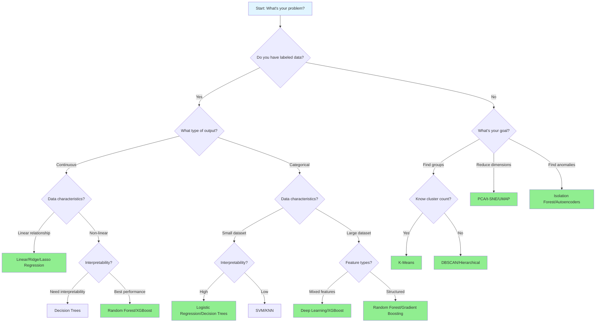
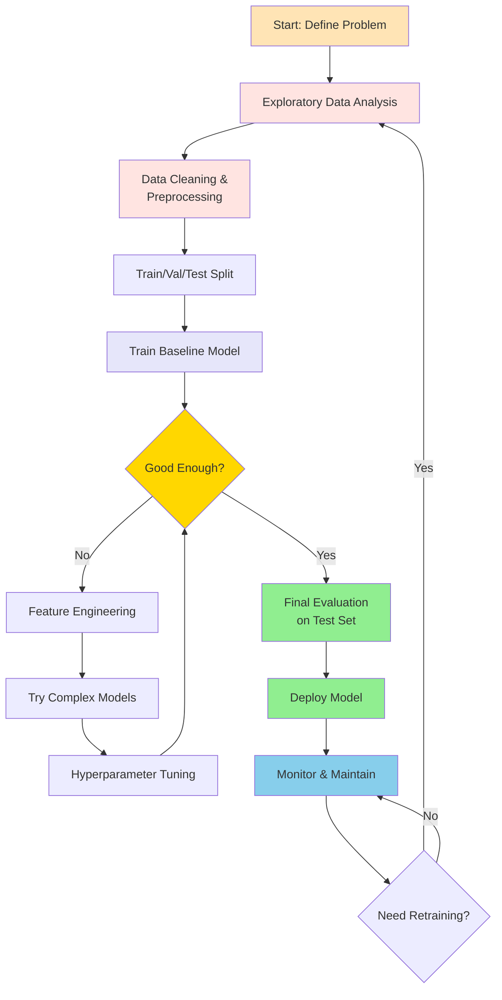

# Machine Learning Algorithms

## Overview

Machine learning algorithms are computational methods that enable systems to learn patterns from data and make predictions or decisions without being explicitly programmed. This comprehensive guide covers fundamental and advanced algorithms across supervised, unsupervised, ensemble, and time series categories.

## Algorithm Selection Guide

### Decision Flowchart



## Algorithm Categories

=== "Supervised Learning"

    ### Overview

    Supervised learning algorithms learn from labeled data, where each training example has an input-output pair. The algorithm learns to map inputs to outputs and can then predict outputs for new, unseen inputs.

    ### Linear Regression

    #### Mathematical Intuition

    Linear regression finds the best-fitting straight line through data points by minimizing the sum of squared residuals:

    **Hypothesis Function:**
    ```
    h(x) = β₀ + β₁x₁ + β₂x₂ + ... + βₙxₙ
    ```

    **Cost Function (MSE):**
    ```
    J(β) = (1/2m) Σ(h(xⁱ) - yⁱ)²
    ```

    **Normal Equation:**
    ```
    β = (XᵀX)⁻¹Xᵀy
    ```

    #### Implementation

    ```python
    import numpy as np
    import pandas as pd
    import matplotlib.pyplot as plt
    from sklearn.model_selection import train_test_split, cross_val_score
    from sklearn.linear_model import LinearRegression, Ridge, Lasso
    from sklearn.preprocessing import StandardScaler
    from sklearn.metrics import mean_squared_error, r2_score, mean_absolute_error
    import seaborn as sns

    # Generate sample data
    np.random.seed(42)
    X = np.random.randn(1000, 5)
    y = 2*X[:, 0] + 3*X[:, 1] - 1.5*X[:, 2] + np.random.randn(1000) * 0.5

    # Split data
    X_train, X_test, y_train, y_test = train_test_split(
        X, y, test_size=0.2, random_state=42
    )

    # Standardize features
    scaler = StandardScaler()
    X_train_scaled = scaler.fit_transform(X_train)
    X_test_scaled = scaler.transform(X_test)

    # Train model
    model = LinearRegression()
    model.fit(X_train_scaled, y_train)

    # Make predictions
    y_pred = model.predict(X_test_scaled)

    # Evaluate
    mse = mean_squared_error(y_test, y_pred)
    rmse = np.sqrt(mse)
    mae = mean_absolute_error(y_test, y_pred)
    r2 = r2_score(y_test, y_pred)

    print(f"RMSE: {rmse:.4f}")
    print(f"MAE: {mae:.4f}")
    print(f"R² Score: {r2:.4f}")
    print(f"Coefficients: {model.coef_}")
    print(f"Intercept: {model.intercept_:.4f}")

    # Cross-validation
    cv_scores = cross_val_score(model, X_train_scaled, y_train,
                                 cv=5, scoring='neg_mean_squared_error')
    print(f"CV RMSE: {np.sqrt(-cv_scores.mean()):.4f} (+/- {np.sqrt(cv_scores.std()):.4f})")

    # Visualization
    fig, axes = plt.subplots(1, 2, figsize=(12, 4))

    # Actual vs Predicted
    axes[0].scatter(y_test, y_pred, alpha=0.5)
    axes[0].plot([y_test.min(), y_test.max()],
                 [y_test.min(), y_test.max()], 'r--', lw=2)
    axes[0].set_xlabel('Actual Values')
    axes[0].set_ylabel('Predicted Values')
    axes[0].set_title('Actual vs Predicted')

    # Residuals
    residuals = y_test - y_pred
    axes[1].scatter(y_pred, residuals, alpha=0.5)
    axes[1].axhline(y=0, color='r', linestyle='--', lw=2)
    axes[1].set_xlabel('Predicted Values')
    axes[1].set_ylabel('Residuals')
    axes[1].set_title('Residual Plot')

    plt.tight_layout()
    plt.show()

    # Ridge Regression (L2 regularization)
    ridge = Ridge(alpha=1.0)
    ridge.fit(X_train_scaled, y_train)
    ridge_pred = ridge.predict(X_test_scaled)
    print(f"\nRidge R² Score: {r2_score(y_test, ridge_pred):.4f}")

    # Lasso Regression (L1 regularization)
    lasso = Lasso(alpha=0.1)
    lasso.fit(X_train_scaled, y_train)
    lasso_pred = lasso.predict(X_test_scaled)
    print(f"Lasso R² Score: {r2_score(y_test, lasso_pred):.4f}")
    print(f"Lasso selected features: {np.sum(lasso.coef_ != 0)}/{len(lasso.coef_)}")
    ```

    #### Troubleshooting

    | Issue | Symptoms | Solutions |
    |-------|----------|-----------|
    | **Multicollinearity** | High VIF, unstable coefficients | Use Ridge/Lasso, remove correlated features, PCA |
    | **Non-linearity** | Poor R², curved residuals | Transform features, polynomial features, try non-linear models |
    | **Heteroscedasticity** | Funnel-shaped residuals | Log transform target, use weighted regression |
    | **Outliers** | Few points with large residuals | Remove outliers, use robust regression (Huber) |
    | **Overfitting** | Train R² >> Test R² | Regularization (Ridge/Lasso), reduce features |

    ### Logistic Regression

    #### Mathematical Intuition

    Logistic regression uses the sigmoid function to map linear predictions to probabilities:

    **Sigmoid Function:**
    ```
    σ(z) = 1 / (1 + e⁻ᶻ)
    ```

    **Hypothesis:**
    ```
    h(x) = σ(βᵀx)
    ```

    **Cost Function (Log Loss):**
    ```
    J(β) = -(1/m) Σ[y log(h(x)) + (1-y) log(1-h(x))]
    ```

    #### Implementation

    ```python
    from sklearn.linear_model import LogisticRegression
    from sklearn.datasets import make_classification
    from sklearn.metrics import (classification_report, confusion_matrix,
                                 roc_curve, roc_auc_score, precision_recall_curve)

    # Generate classification data
    X, y = make_classification(n_samples=1000, n_features=20, n_informative=15,
                               n_redundant=5, random_state=42)

    X_train, X_test, y_train, y_test = train_test_split(
        X, y, test_size=0.2, random_state=42, stratify=y
    )

    # Standardize
    scaler = StandardScaler()
    X_train_scaled = scaler.fit_transform(X_train)
    X_test_scaled = scaler.transform(X_test)

    # Train model
    log_reg = LogisticRegression(random_state=42, max_iter=1000)
    log_reg.fit(X_train_scaled, y_train)

    # Predictions
    y_pred = log_reg.predict(X_test_scaled)
    y_pred_proba = log_reg.predict_proba(X_test_scaled)[:, 1]

    # Evaluation
    print("Classification Report:")
    print(classification_report(y_test, y_pred))

    print("\nConfusion Matrix:")
    print(confusion_matrix(y_test, y_pred))

    print(f"\nROC-AUC Score: {roc_auc_score(y_test, y_pred_proba):.4f}")

    # Visualization
    fig, axes = plt.subplots(1, 3, figsize=(15, 4))

    # Confusion Matrix Heatmap
    cm = confusion_matrix(y_test, y_pred)
    sns.heatmap(cm, annot=True, fmt='d', cmap='Blues', ax=axes[0])
    axes[0].set_title('Confusion Matrix')
    axes[0].set_ylabel('Actual')
    axes[0].set_xlabel('Predicted')

    # ROC Curve
    fpr, tpr, thresholds = roc_curve(y_test, y_pred_proba)
    axes[1].plot(fpr, tpr, label=f'ROC (AUC = {roc_auc_score(y_test, y_pred_proba):.3f})')
    axes[1].plot([0, 1], [0, 1], 'k--', label='Random')
    axes[1].set_xlabel('False Positive Rate')
    axes[1].set_ylabel('True Positive Rate')
    axes[1].set_title('ROC Curve')
    axes[1].legend()

    # Precision-Recall Curve
    precision, recall, _ = precision_recall_curve(y_test, y_pred_proba)
    axes[2].plot(recall, precision)
    axes[2].set_xlabel('Recall')
    axes[2].set_ylabel('Precision')
    axes[2].set_title('Precision-Recall Curve')

    plt.tight_layout()
    plt.show()

    # Feature importance
    feature_importance = pd.DataFrame({
        'feature': [f'Feature_{i}' for i in range(X.shape[1])],
        'coefficient': log_reg.coef_[0],
        'abs_coefficient': np.abs(log_reg.coef_[0])
    }).sort_values('abs_coefficient', ascending=False)

    print("\nTop 10 Most Important Features:")
    print(feature_importance.head(10))
    ```

    ### Decision Trees

    #### Visualization: How Decision Trees Split

    ```mermaid
    graph TD
        Root[Root Node<br/>Feature: Age<br/>Threshold: 30<br/>Gini: 0.5<br/>Samples: 1000] --> Left[Left Child<br/>Age ≤ 30<br/>Gini: 0.4<br/>Samples: 600]
        Root --> Right[Right Child<br/>Age > 30<br/>Gini: 0.3<br/>Samples: 400]

        Left --> L1[Feature: Income<br/>Income ≤ 50k<br/>Gini: 0.35<br/>Samples: 400]
        Left --> L2[Feature: Income<br/>Income > 50k<br/>Gini: 0.2<br/>Samples: 200]

        Right --> R1[Feature: Education<br/>College: Yes<br/>Gini: 0.1<br/>Samples: 250]
        Right --> R2[Feature: Education<br/>College: No<br/>Gini: 0.25<br/>Samples: 150]

        L1 --> L1A[Class: 0<br/>Samples: 350<br/>Prediction: 0]
        L1 --> L1B[Class: 1<br/>Samples: 50<br/>Prediction: 0]

        L2 --> L2A[Class: 0<br/>Samples: 50<br/>Prediction: 1]
        L2 --> L2B[Class: 1<br/>Samples: 150<br/>Prediction: 1]

        R1 --> R1A[Class: 1<br/>Samples: 225<br/>Prediction: 1]
        R1 --> R1B[Class: 0<br/>Samples: 25<br/>Prediction: 1]

        R2 --> R2A[Class: 0<br/>Samples: 100<br/>Prediction: 0]
        R2 --> R2B[Class: 1<br/>Samples: 50<br/>Prediction: 0]

        style Root fill:#FFE4B5
        style Left fill:#FFE4E1
        style Right fill:#FFE4E1
        style L1A fill:#90EE90
        style L2B fill:#90EE90
        style R1A fill:#90EE90
        style R2A fill:#90EE90
    ```

    #### Mathematical Intuition

    **Gini Impurity:**
    ```
    Gini = 1 - Σ(pᵢ)²
    ```

    **Entropy:**
    ```
    Entropy = -Σ(pᵢ × log₂(pᵢ))
    ```

    **Information Gain:**
    ```
    IG = Entropy(parent) - Σ(wᵢ × Entropy(childᵢ))
    ```

    #### Implementation

    ```python
    from sklearn.tree import DecisionTreeClassifier, DecisionTreeRegressor, plot_tree
    from sklearn.datasets import load_iris

    # Load data
    iris = load_iris()
    X, y = iris.data, iris.target

    X_train, X_test, y_train, y_test = train_test_split(
        X, y, test_size=0.2, random_state=42, stratify=y
    )

    # Train decision tree
    dt = DecisionTreeClassifier(
        max_depth=3,
        min_samples_split=10,
        min_samples_leaf=5,
        random_state=42
    )
    dt.fit(X_train, y_train)

    # Predictions
    y_pred = dt.predict(X_test)

    # Evaluation
    print("Decision Tree Accuracy:", accuracy_score(y_test, y_pred))
    print("\nClassification Report:")
    print(classification_report(y_test, y_pred, target_names=iris.target_names))

    # Feature importance
    feature_importance = pd.DataFrame({
        'feature': iris.feature_names,
        'importance': dt.feature_importances_
    }).sort_values('importance', ascending=False)
    print("\nFeature Importance:")
    print(feature_importance)

    # Visualize tree
    plt.figure(figsize=(20, 10))
    plot_tree(dt, feature_names=iris.feature_names,
              class_names=iris.target_names, filled=True, rounded=True)
    plt.title('Decision Tree Visualization')
    plt.show()

    # Visualize feature importance
    plt.figure(figsize=(10, 6))
    plt.barh(feature_importance['feature'], feature_importance['importance'])
    plt.xlabel('Importance')
    plt.title('Feature Importance')
    plt.tight_layout()
    plt.show()
    ```

    #### Troubleshooting

    | Issue | Symptoms | Solutions |
    |-------|----------|-----------|
    | **Overfitting** | Perfect train accuracy, poor test | Reduce max_depth, increase min_samples_split/leaf |
    | **Underfitting** | Poor train and test accuracy | Increase max_depth, decrease min_samples constraints |
    | **Imbalanced data** | Biased toward majority class | Use class_weight='balanced', SMOTE |
    | **High variance** | Very different trees on similar data | Use ensemble methods (Random Forest) |
    | **Sensitive to outliers** | Unusual splits | Clip outliers, use ensemble methods |

    ### Support Vector Machines (SVM)

    #### Mathematical Intuition

    SVM finds the hyperplane that maximizes the margin between classes:

    **Decision Boundary:**
    ```
    wᵀx + b = 0
    ```

    **Margin:**
    ```
    margin = 2/||w||
    ```

    **Optimization (Soft Margin):**
    ```
    minimize: (1/2)||w||² + C Σξᵢ
    subject to: yᵢ(wᵀxᵢ + b) ≥ 1 - ξᵢ
    ```

    **Kernel Trick:**
    ```
    K(x, x') = φ(x)ᵀφ(x')
    ```

    Common kernels:
    - Linear: K(x, x') = xᵀx'
    - Polynomial: K(x, x') = (γxᵀx' + r)^d
    - RBF: K(x, x') = exp(-γ||x - x'||²)

    #### Implementation

    ```python
    from sklearn.svm import SVC, SVR
    from sklearn.preprocessing import StandardScaler

    # Generate non-linearly separable data
    X, y = make_classification(n_samples=500, n_features=2, n_redundant=0,
                               n_informative=2, n_clusters_per_class=1,
                               random_state=42)

    X_train, X_test, y_train, y_test = train_test_split(
        X, y, test_size=0.2, random_state=42
    )

    # Standardize (critical for SVM)
    scaler = StandardScaler()
    X_train_scaled = scaler.fit_transform(X_train)
    X_test_scaled = scaler.transform(X_test)

    # Train SVM with different kernels
    kernels = ['linear', 'poly', 'rbf']
    results = {}

    for kernel in kernels:
        svm = SVC(kernel=kernel, C=1.0, random_state=42)
        svm.fit(X_train_scaled, y_train)
        y_pred = svm.predict(X_test_scaled)
        accuracy = accuracy_score(y_test, y_pred)
        results[kernel] = accuracy
        print(f"{kernel.upper()} Kernel Accuracy: {accuracy:.4f}")

    # Best model with RBF kernel
    svm_best = SVC(kernel='rbf', C=1.0, gamma='scale', probability=True, random_state=42)
    svm_best.fit(X_train_scaled, y_train)

    # Visualization of decision boundary
    def plot_decision_boundary(model, X, y, title):
        h = 0.02
        x_min, x_max = X[:, 0].min() - 1, X[:, 0].max() + 1
        y_min, y_max = X[:, 1].min() - 1, X[:, 1].max() + 1
        xx, yy = np.meshgrid(np.arange(x_min, x_max, h),
                             np.arange(y_min, y_max, h))
        Z = model.predict(np.c_[xx.ravel(), yy.ravel()])
        Z = Z.reshape(xx.shape)

        plt.contourf(xx, yy, Z, alpha=0.3, cmap='RdYlBu')
        plt.scatter(X[:, 0], X[:, 1], c=y, cmap='RdYlBu', edgecolors='black')
        plt.title(title)
        plt.xlabel('Feature 1')
        plt.ylabel('Feature 2')

    plt.figure(figsize=(15, 5))
    for idx, kernel in enumerate(kernels):
        svm = SVC(kernel=kernel, C=1.0, random_state=42)
        svm.fit(X_train_scaled, y_train)
        plt.subplot(1, 3, idx + 1)
        plot_decision_boundary(svm, X_train_scaled, y_train, f'{kernel.upper()} Kernel')
    plt.tight_layout()
    plt.show()

    # Hyperparameter tuning
    from sklearn.model_selection import GridSearchCV

    param_grid = {
        'C': [0.1, 1, 10, 100],
        'gamma': ['scale', 'auto', 0.001, 0.01, 0.1],
        'kernel': ['rbf', 'poly']
    }

    grid_search = GridSearchCV(SVC(), param_grid, cv=5, scoring='accuracy', n_jobs=-1)
    grid_search.fit(X_train_scaled, y_train)

    print(f"\nBest Parameters: {grid_search.best_params_}")
    print(f"Best CV Score: {grid_search.best_score_:.4f}")
    print(f"Test Score: {grid_search.score(X_test_scaled, y_test):.4f}")
    ```

    ### K-Nearest Neighbors (KNN)

    #### Mathematical Intuition

    KNN classifies based on the majority vote of k nearest neighbors:

    **Distance Metrics:**

    Euclidean:
    ```
    d(x, y) = √(Σ(xᵢ - yᵢ)²)
    ```

    Manhattan:
    ```
    d(x, y) = Σ|xᵢ - yᵢ|
    ```

    Minkowski:
    ```
    d(x, y) = (Σ|xᵢ - yᵢ|^p)^(1/p)
    ```

    #### Implementation

    ```python
    from sklearn.neighbors import KNeighborsClassifier, KNeighborsRegressor

    # Generate data
    X, y = make_classification(n_samples=1000, n_features=10, n_informative=8,
                               n_redundant=2, random_state=42)

    X_train, X_test, y_train, y_test = train_test_split(
        X, y, test_size=0.2, random_state=42
    )

    # Standardize (important for distance-based algorithms)
    scaler = StandardScaler()
    X_train_scaled = scaler.fit_transform(X_train)
    X_test_scaled = scaler.transform(X_test)

    # Find optimal k
    k_range = range(1, 31)
    train_scores = []
    test_scores = []

    for k in k_range:
        knn = KNeighborsClassifier(n_neighbors=k)
        knn.fit(X_train_scaled, y_train)
        train_scores.append(knn.score(X_train_scaled, y_train))
        test_scores.append(knn.score(X_test_scaled, y_test))

    # Plot k vs accuracy
    plt.figure(figsize=(10, 6))
    plt.plot(k_range, train_scores, label='Training Accuracy', marker='o')
    plt.plot(k_range, test_scores, label='Test Accuracy', marker='s')
    plt.xlabel('k (Number of Neighbors)')
    plt.ylabel('Accuracy')
    plt.title('KNN: k vs Accuracy')
    plt.legend()
    plt.grid(True)
    plt.show()

    # Optimal k
    optimal_k = k_range[np.argmax(test_scores)]
    print(f"Optimal k: {optimal_k}")

    # Train final model
    knn_best = KNeighborsClassifier(n_neighbors=optimal_k, weights='distance')
    knn_best.fit(X_train_scaled, y_train)

    y_pred = knn_best.predict(X_test_scaled)
    print(f"\nTest Accuracy: {accuracy_score(y_test, y_pred):.4f}")
    print("\nClassification Report:")
    print(classification_report(y_test, y_pred))

    # Compare distance metrics
    metrics = ['euclidean', 'manhattan', 'minkowski']
    for metric in metrics:
        knn = KNeighborsClassifier(n_neighbors=optimal_k, metric=metric)
        knn.fit(X_train_scaled, y_train)
        score = knn.score(X_test_scaled, y_test)
        print(f"{metric.capitalize()} Distance Accuracy: {score:.4f}")
    ```

    #### Troubleshooting

    | Issue | Symptoms | Solutions |
    |-------|----------|-----------|
    | **Slow predictions** | High latency | Use KD-Tree/Ball-Tree, reduce dataset size, use approximate methods |
    | **Poor performance** | Low accuracy | Tune k, try weighted voting, scale features |
    | **Curse of dimensionality** | Worse with more features | Dimensionality reduction (PCA), feature selection |
    | **Imbalanced classes** | Biased predictions | Use weights='distance', oversample minority |
    | **Large memory usage** | Memory errors | Use approximate algorithms, subsample training data |

=== "Unsupervised Learning"

    ### Overview

    Unsupervised learning algorithms find patterns in unlabeled data. Common tasks include clustering (grouping similar data points) and dimensionality reduction (simplifying data while preserving structure).

    ### K-Means Clustering

    #### Visualization: K-Means Algorithm

    ```mermaid
    flowchart LR
        Start[Start: Random<br/>Initialize K<br/>Centroids] --> Assign[Assignment Step:<br/>Assign each point to<br/>nearest centroid]

        Assign --> Update[Update Step:<br/>Recalculate centroids<br/>as mean of assigned points]

        Update --> Check{Converged?<br/>Centroids<br/>unchanged?}

        Check -->|No| Assign
        Check -->|Yes| End[End: Final<br/>Clusters]

        style Start fill:#FFE4B5
        style Assign fill:#FFE4E1
        style Update fill:#E6E6FA
        style Check fill:#FFE4B5
        style End fill:#90EE90
    ```

    #### Visual Example: K-Means Clustering

    ```mermaid
    graph TD
        subgraph "Initial State"
            I1[Points scattered]
            I2[K=3 random centroids]
        end

        subgraph "Iteration 1"
            It1A[Assign points to<br/>nearest centroid]
            It1B[Update centroids<br/>to cluster means]
        end

        subgraph "Iteration 2"
            It2A[Reassign points]
            It2B[Update centroids]
        end

        subgraph "Convergence"
            C1[Centroids stabilized]
            C2[Final clusters formed]
        end

        I1 --> I2
        I2 --> It1A
        It1A --> It1B
        It1B --> It2A
        It2A --> It2B
        It2B --> C1
        C1 --> C2

        style I1 fill:#FFE4B5
        style It1A fill:#FFE4E1
        style It2A fill:#E6E6FA
        style C2 fill:#90EE90
    ```

    #### Mathematical Intuition

    **Objective Function:**
    ```
    J = Σᵢ Σₓ∈Cᵢ ||x - μᵢ||²
    ```
    where μᵢ is the centroid of cluster Cᵢ

    **Algorithm:**
    1. Initialize k centroids randomly
    2. Assignment: Assign each point to nearest centroid
    3. Update: Recalculate centroids as mean of assigned points
    4. Repeat 2-3 until convergence

    #### Implementation

    ```python
    from sklearn.cluster import KMeans, DBSCAN, AgglomerativeClustering
    from sklearn.metrics import silhouette_score, davies_bouldin_score, calinski_harabasz_score
    from sklearn.datasets import make_blobs

    # Generate clustering data
    X, y_true = make_blobs(n_samples=1000, centers=4, n_features=2,
                           cluster_std=0.8, random_state=42)

    # Elbow method to find optimal k
    inertias = []
    silhouette_scores = []
    K_range = range(2, 11)

    for k in K_range:
        kmeans = KMeans(n_clusters=k, random_state=42, n_init=10)
        kmeans.fit(X)
        inertias.append(kmeans.inertia_)
        silhouette_scores.append(silhouette_score(X, kmeans.labels_))

    # Plot elbow curve
    fig, axes = plt.subplots(1, 2, figsize=(14, 5))

    axes[0].plot(K_range, inertias, 'bo-')
    axes[0].set_xlabel('Number of Clusters (k)')
    axes[0].set_ylabel('Inertia (Within-Cluster Sum of Squares)')
    axes[0].set_title('Elbow Method')
    axes[0].grid(True)

    axes[1].plot(K_range, silhouette_scores, 'ro-')
    axes[1].set_xlabel('Number of Clusters (k)')
    axes[1].set_ylabel('Silhouette Score')
    axes[1].set_title('Silhouette Score vs k')
    axes[1].grid(True)

    plt.tight_layout()
    plt.show()

    # Train K-Means with optimal k
    optimal_k = 4
    kmeans = KMeans(n_clusters=optimal_k, random_state=42, n_init=10)
    labels = kmeans.fit_predict(X)

    # Evaluation metrics
    silhouette = silhouette_score(X, labels)
    davies_bouldin = davies_bouldin_score(X, labels)
    calinski_harabasz = calinski_harabasz_score(X, labels)

    print(f"Silhouette Score: {silhouette:.4f}")
    print(f"Davies-Bouldin Index: {davies_bouldin:.4f}")
    print(f"Calinski-Harabasz Index: {calinski_harabasz:.4f}")

    # Visualize clusters
    plt.figure(figsize=(12, 5))

    plt.subplot(1, 2, 1)
    plt.scatter(X[:, 0], X[:, 1], c=labels, cmap='viridis', alpha=0.6)
    plt.scatter(kmeans.cluster_centers_[:, 0], kmeans.cluster_centers_[:, 1],
                marker='X', s=300, c='red', edgecolors='black', linewidths=2,
                label='Centroids')
    plt.title('K-Means Clustering')
    plt.xlabel('Feature 1')
    plt.ylabel('Feature 2')
    plt.legend()

    plt.subplot(1, 2, 2)
    plt.scatter(X[:, 0], X[:, 1], c=y_true, cmap='viridis', alpha=0.6)
    plt.title('True Labels')
    plt.xlabel('Feature 1')
    plt.ylabel('Feature 2')

    plt.tight_layout()
    plt.show()

    # Mini-batch K-Means for large datasets
    from sklearn.cluster import MiniBatchKMeans

    mb_kmeans = MiniBatchKMeans(n_clusters=optimal_k, random_state=42, batch_size=100)
    mb_labels = mb_kmeans.fit_predict(X)
    print(f"\nMini-Batch K-Means Silhouette Score: {silhouette_score(X, mb_labels):.4f}")
    ```

    #### Troubleshooting

    | Issue | Symptoms | Solutions |
    |-------|----------|-----------|
    | **Sensitive to initialization** | Different results each run | Use k-means++, increase n_init |
    | **Assumes spherical clusters** | Poor results on elongated clusters | Try DBSCAN, GMM, hierarchical |
    | **Need to specify k** | Don't know cluster count | Use elbow method, silhouette analysis, DBSCAN |
    | **Sensitive to outliers** | Outliers form own clusters | Remove outliers, use DBSCAN |
    | **Slow on large data** | Long training time | Use Mini-Batch K-Means, sample data |

    ### DBSCAN (Density-Based Clustering)

    #### Mathematical Intuition

    DBSCAN groups points that are closely packed together, marking outliers as noise.

    **Core Point:** Point with at least min_samples within epsilon distance
    **Border Point:** Within epsilon of core point but not core itself
    **Noise Point:** Neither core nor border

    #### Implementation

    ```python
    from sklearn.cluster import DBSCAN
    from sklearn.datasets import make_moons

    # Generate non-convex clusters
    X, y_true = make_moons(n_samples=1000, noise=0.1, random_state=42)

    # Standardize
    scaler = StandardScaler()
    X_scaled = scaler.fit_transform(X)

    # Find optimal epsilon using k-distance graph
    from sklearn.neighbors import NearestNeighbors

    neighbors = NearestNeighbors(n_neighbors=5)
    neighbors.fit(X_scaled)
    distances, indices = neighbors.kneighbors(X_scaled)
    distances = np.sort(distances[:, -1])

    plt.figure(figsize=(10, 5))
    plt.plot(distances)
    plt.xlabel('Points sorted by distance')
    plt.ylabel('5th Nearest Neighbor Distance')
    plt.title('K-Distance Graph for Epsilon Selection')
    plt.grid(True)
    plt.show()

    # Train DBSCAN
    dbscan = DBSCAN(eps=0.3, min_samples=5)
    labels = dbscan.fit_predict(X_scaled)

    # Count clusters and noise
    n_clusters = len(set(labels)) - (1 if -1 in labels else 0)
    n_noise = list(labels).count(-1)

    print(f"Number of clusters: {n_clusters}")
    print(f"Number of noise points: {n_noise}")
    print(f"Silhouette Score: {silhouette_score(X_scaled, labels):.4f}")

    # Visualize
    fig, axes = plt.subplots(1, 2, figsize=(14, 5))

    axes[0].scatter(X[:, 0], X[:, 1], c=labels, cmap='viridis', alpha=0.6)
    axes[0].set_title('DBSCAN Clustering')
    axes[0].set_xlabel('Feature 1')
    axes[0].set_ylabel('Feature 2')

    # Highlight noise points
    noise_mask = labels == -1
    axes[1].scatter(X[~noise_mask, 0], X[~noise_mask, 1],
                    c=labels[~noise_mask], cmap='viridis', alpha=0.6, label='Clusters')
    axes[1].scatter(X[noise_mask, 0], X[noise_mask, 1],
                    c='red', marker='x', s=50, label='Noise')
    axes[1].set_title('DBSCAN with Noise Highlighted')
    axes[1].set_xlabel('Feature 1')
    axes[1].set_ylabel('Feature 2')
    axes[1].legend()

    plt.tight_layout()
    plt.show()
    ```

    ### Principal Component Analysis (PCA)

    #### Visualization: PCA Transformation

    ```mermaid
    graph LR
        subgraph "Original Space"
            O1[High-Dimensional<br/>Data<br/>n features]
        end

        subgraph "PCA Process"
            P1[Center Data<br/>Subtract Mean]
            P2[Compute Covariance<br/>Matrix]
            P3[Calculate<br/>Eigenvectors &<br/>Eigenvalues]
            P4[Select Top k<br/>Components<br/>by Variance]
            P5[Project Data]
        end

        subgraph "Transformed Space"
            T1[Lower-Dimensional<br/>Data<br/>k components<br/>k < n]
        end

        O1 --> P1
        P1 --> P2
        P2 --> P3
        P3 --> P4
        P4 --> P5
        P5 --> T1

        style O1 fill:#FFE4B5
        style P1 fill:#FFE4E1
        style P2 fill:#FFE4E1
        style P3 fill:#E6E6FA
        style P4 fill:#E6E6FA
        style P5 fill:#E6E6FA
        style T1 fill:#90EE90
    ```

    #### Mathematical Intuition

    PCA finds orthogonal directions of maximum variance:

    **Steps:**
    1. Center data: X̃ = X - mean(X)
    2. Compute covariance: Σ = (1/n)X̃ᵀX̃
    3. Eigendecomposition: Σv = λv
    4. Project: Z = X̃W (W = top k eigenvectors)

    **Variance Explained:**
    ```
    Variance Ratio = λᵢ / Σλⱼ
    ```

    #### Implementation

    ```python
    from sklearn.decomposition import PCA
    from sklearn.datasets import load_digits

    # Load high-dimensional data
    digits = load_digits()
    X, y = digits.data, digits.target
    print(f"Original shape: {X.shape}")

    # Standardize
    scaler = StandardScaler()
    X_scaled = scaler.fit_transform(X)

    # Apply PCA
    pca = PCA()
    X_pca = pca.fit_transform(X_scaled)

    # Cumulative explained variance
    cumsum_variance = np.cumsum(pca.explained_variance_ratio_)

    # Plot explained variance
    fig, axes = plt.subplots(1, 2, figsize=(14, 5))

    axes[0].bar(range(1, len(pca.explained_variance_ratio_) + 1),
                pca.explained_variance_ratio_)
    axes[0].set_xlabel('Principal Component')
    axes[0].set_ylabel('Explained Variance Ratio')
    axes[0].set_title('Variance Explained by Each Component')
    axes[0].set_xlim(0, 30)

    axes[1].plot(range(1, len(cumsum_variance) + 1), cumsum_variance, 'bo-')
    axes[1].axhline(y=0.95, color='r', linestyle='--', label='95% Variance')
    axes[1].set_xlabel('Number of Components')
    axes[1].set_ylabel('Cumulative Explained Variance')
    axes[1].set_title('Cumulative Explained Variance')
    axes[1].legend()
    axes[1].grid(True)

    plt.tight_layout()
    plt.show()

    # Find number of components for 95% variance
    n_components_95 = np.argmax(cumsum_variance >= 0.95) + 1
    print(f"Components needed for 95% variance: {n_components_95}")

    # Reduce to 2D for visualization
    pca_2d = PCA(n_components=2)
    X_2d = pca_2d.fit_transform(X_scaled)

    print(f"2D explained variance: {sum(pca_2d.explained_variance_ratio_):.4f}")

    # Visualize 2D projection
    plt.figure(figsize=(10, 8))
    scatter = plt.scatter(X_2d[:, 0], X_2d[:, 1], c=y, cmap='tab10', alpha=0.6)
    plt.xlabel(f'PC1 ({pca_2d.explained_variance_ratio_[0]:.2%} variance)')
    plt.ylabel(f'PC2 ({pca_2d.explained_variance_ratio_[1]:.2%} variance)')
    plt.title('PCA: Digits Dataset (2D Projection)')
    plt.colorbar(scatter, label='Digit')
    plt.tight_layout()
    plt.show()

    # Reconstruction
    pca_reduced = PCA(n_components=n_components_95)
    X_reduced = pca_reduced.fit_transform(X_scaled)
    X_reconstructed = pca_reduced.inverse_transform(X_reduced)

    # Visualize original vs reconstructed
    fig, axes = plt.subplots(2, 5, figsize=(12, 5))
    for i in range(5):
        axes[0, i].imshow(X[i].reshape(8, 8), cmap='gray')
        axes[0, i].set_title('Original')
        axes[0, i].axis('off')

        axes[1, i].imshow(scaler.inverse_transform([X_reconstructed[i]])[0].reshape(8, 8),
                         cmap='gray')
        axes[1, i].set_title('Reconstructed')
        axes[1, i].axis('off')
    plt.suptitle(f'PCA Reconstruction ({n_components_95} components)')
    plt.tight_layout()
    plt.show()
    ```

    #### Troubleshooting

    | Issue | Symptoms | Solutions |
    |-------|----------|-----------|
    | **Features not scaled** | First PC dominated by large values | Always standardize features first |
    | **Poor variance captured** | Low cumulative variance | Use more components, try kernel PCA |
    | **Non-linear relationships** | Linear PCA inadequate | Use kernel PCA, t-SNE, UMAP |
    | **Interpretability loss** | Components hard to interpret | Use sparse PCA, feature selection instead |
    | **Computation time** | Slow on large data | Use incremental PCA, randomized PCA |

=== "Ensemble Methods"

    ### Overview

    Ensemble methods combine multiple models to create a more robust and accurate predictor. They leverage the wisdom of crowds principle: multiple weak learners can form a strong learner.

    ### Random Forest

    #### Visualization: Random Forest Ensemble

    ```mermaid
    graph TD
        Data[Training Data<br/>1000 samples] --> BS1[Bootstrap Sample 1<br/>800 samples<br/>+ Feature Subset]
        Data --> BS2[Bootstrap Sample 2<br/>800 samples<br/>+ Feature Subset]
        Data --> BS3[Bootstrap Sample 3<br/>800 samples<br/>+ Feature Subset]
        Data --> BSN[Bootstrap Sample N<br/>800 samples<br/>+ Feature Subset]

        BS1 --> DT1[Decision Tree 1<br/>max_depth=10]
        BS2 --> DT2[Decision Tree 2<br/>max_depth=10]
        BS3 --> DT3[Decision Tree 3<br/>max_depth=10]
        BSN --> DTN[Decision Tree N<br/>max_depth=10]

        DT1 --> P1[Prediction 1:<br/>Class A]
        DT2 --> P2[Prediction 2:<br/>Class B]
        DT3 --> P3[Prediction 3:<br/>Class A]
        DTN --> PN[Prediction N:<br/>Class A]

        P1 --> Vote[Majority Vote]
        P2 --> Vote
        P3 --> Vote
        PN --> Vote

        Vote --> Final[Final Prediction:<br/>Class A<br/>Confidence: 70%]

        style Data fill:#FFE4B5
        style BS1 fill:#FFE4E1
        style BS2 fill:#FFE4E1
        style BS3 fill:#FFE4E1
        style BSN fill:#FFE4E1
        style DT1 fill:#E6E6FA
        style DT2 fill:#E6E6FA
        style DT3 fill:#E6E6FA
        style DTN fill:#E6E6FA
        style Vote fill:#FFA07A
        style Final fill:#90EE90
    ```

    #### Mathematical Intuition

    **Bootstrap Aggregating (Bagging):**
    - Sample n instances with replacement
    - Train tree on each sample
    - Select random subset of features at each split

    **Prediction:**
    - Classification: Majority vote
    - Regression: Average prediction

    **Out-of-Bag (OOB) Error:**
    ```
    OOB Error = Average error on samples not in bootstrap
    ```

    #### Implementation

    ```python
    from sklearn.ensemble import RandomForestClassifier, RandomForestRegressor
    from sklearn.model_selection import cross_val_score, GridSearchCV
    from sklearn.datasets import make_classification

    # Generate data
    X, y = make_classification(n_samples=2000, n_features=20, n_informative=15,
                               n_redundant=5, random_state=42)

    X_train, X_test, y_train, y_test = train_test_split(
        X, y, test_size=0.2, random_state=42, stratify=y
    )

    # Train Random Forest
    rf = RandomForestClassifier(
        n_estimators=100,
        max_depth=10,
        min_samples_split=10,
        min_samples_leaf=4,
        max_features='sqrt',
        bootstrap=True,
        oob_score=True,
        random_state=42,
        n_jobs=-1
    )

    rf.fit(X_train, y_train)

    # Predictions
    y_pred = rf.predict(X_test)
    y_pred_proba = rf.predict_proba(X_test)

    # Evaluation
    print(f"Training Accuracy: {rf.score(X_train, y_train):.4f}")
    print(f"Test Accuracy: {rf.score(X_test, y_test):.4f}")
    print(f"OOB Score: {rf.oob_score_:.4f}")
    print(f"\nROC-AUC: {roc_auc_score(y_test, y_pred_proba[:, 1]):.4f}")
    print("\nClassification Report:")
    print(classification_report(y_test, y_pred))

    # Feature importance
    feature_importance = pd.DataFrame({
        'feature': [f'Feature_{i}' for i in range(X.shape[1])],
        'importance': rf.feature_importances_
    }).sort_values('importance', ascending=False)

    plt.figure(figsize=(10, 6))
    plt.barh(feature_importance['feature'][:15], feature_importance['importance'][:15])
    plt.xlabel('Importance')
    plt.title('Top 15 Feature Importances (Random Forest)')
    plt.tight_layout()
    plt.show()

    # Number of estimators vs performance
    estimator_range = [10, 50, 100, 200, 300, 500]
    train_scores = []
    test_scores = []
    oob_scores = []

    for n_est in estimator_range:
        rf_temp = RandomForestClassifier(n_estimators=n_est, oob_score=True,
                                         random_state=42, n_jobs=-1)
        rf_temp.fit(X_train, y_train)
        train_scores.append(rf_temp.score(X_train, y_train))
        test_scores.append(rf_temp.score(X_test, y_test))
        oob_scores.append(rf_temp.oob_score_)

    plt.figure(figsize=(10, 6))
    plt.plot(estimator_range, train_scores, 'o-', label='Training Score')
    plt.plot(estimator_range, test_scores, 's-', label='Test Score')
    plt.plot(estimator_range, oob_scores, '^-', label='OOB Score')
    plt.xlabel('Number of Estimators')
    plt.ylabel('Accuracy')
    plt.title('Random Forest: Number of Trees vs Performance')
    plt.legend()
    plt.grid(True)
    plt.tight_layout()
    plt.show()

    # Hyperparameter tuning
    param_grid = {
        'n_estimators': [100, 200, 300],
        'max_depth': [10, 20, 30, None],
        'min_samples_split': [2, 5, 10],
        'min_samples_leaf': [1, 2, 4],
        'max_features': ['sqrt', 'log2']
    }

    grid_search = GridSearchCV(
        RandomForestClassifier(random_state=42),
        param_grid,
        cv=5,
        scoring='roc_auc',
        n_jobs=-1,
        verbose=1
    )

    grid_search.fit(X_train, y_train)

    print(f"\nBest Parameters: {grid_search.best_params_}")
    print(f"Best CV Score: {grid_search.best_score_:.4f}")
    print(f"Test Score: {grid_search.score(X_test, y_test):.4f}")
    ```

    ### Gradient Boosting & XGBoost

    #### Mathematical Intuition

    Gradient boosting builds trees sequentially, where each tree corrects errors of previous trees:

    **Algorithm:**
    1. Initialize with constant prediction: F₀(x) = arg min_γ Σ L(yᵢ, γ)
    2. For m = 1 to M:
       - Compute pseudo-residuals: rᵢₘ = -∂L(yᵢ, F(xᵢ))/∂F(xᵢ)
       - Fit tree hₘ to pseudo-residuals
       - Update: Fₘ(x) = Fₘ₋₁(x) + ν·hₘ(x)

    **Learning Rate (ν):** Controls contribution of each tree

    #### Implementation

    ```python
    from sklearn.ensemble import GradientBoostingClassifier, GradientBoostingRegressor
    import xgboost as xgb
    from xgboost import XGBClassifier, XGBRegressor
    import lightgbm as lgb

    # Generate data
    X, y = make_classification(n_samples=5000, n_features=20, n_informative=15,
                               n_redundant=5, random_state=42)

    X_train, X_test, y_train, y_test = train_test_split(
        X, y, test_size=0.2, random_state=42, stratify=y
    )

    # Gradient Boosting (Scikit-learn)
    gb = GradientBoostingClassifier(
        n_estimators=100,
        learning_rate=0.1,
        max_depth=5,
        min_samples_split=10,
        min_samples_leaf=4,
        subsample=0.8,
        random_state=42
    )

    gb.fit(X_train, y_train)
    gb_pred = gb.predict(X_test)
    gb_proba = gb.predict_proba(X_test)[:, 1]

    print("Gradient Boosting (Scikit-learn):")
    print(f"Accuracy: {accuracy_score(y_test, gb_pred):.4f}")
    print(f"ROC-AUC: {roc_auc_score(y_test, gb_proba):.4f}")

    # XGBoost
    xgb_model = XGBClassifier(
        n_estimators=100,
        learning_rate=0.1,
        max_depth=5,
        min_child_weight=1,
        subsample=0.8,
        colsample_bytree=0.8,
        gamma=0,
        reg_alpha=0,
        reg_lambda=1,
        random_state=42,
        eval_metric='logloss'
    )

    xgb_model.fit(
        X_train, y_train,
        eval_set=[(X_train, y_train), (X_test, y_test)],
        verbose=False
    )

    xgb_pred = xgb_model.predict(X_test)
    xgb_proba = xgb_model.predict_proba(X_test)[:, 1]

    print("\nXGBoost:")
    print(f"Accuracy: {accuracy_score(y_test, xgb_pred):.4f}")
    print(f"ROC-AUC: {roc_auc_score(y_test, xgb_proba):.4f}")

    # LightGBM
    lgb_model = lgb.LGBMClassifier(
        n_estimators=100,
        learning_rate=0.1,
        max_depth=5,
        num_leaves=31,
        subsample=0.8,
        colsample_bytree=0.8,
        random_state=42
    )

    lgb_model.fit(
        X_train, y_train,
        eval_set=[(X_train, y_train), (X_test, y_test)],
        eval_metric='auc',
        callbacks=[lgb.early_stopping(10), lgb.log_evaluation(0)]
    )

    lgb_pred = lgb_model.predict(X_test)
    lgb_proba = lgb_model.predict_proba(X_test)[:, 1]

    print("\nLightGBM:")
    print(f"Accuracy: {accuracy_score(y_test, lgb_pred):.4f}")
    print(f"ROC-AUC: {roc_auc_score(y_test, lgb_proba):.4f}")

    # Feature importance comparison
    fig, axes = plt.subplots(1, 3, figsize=(18, 5))

    feature_names = [f'F{i}' for i in range(X.shape[1])]

    # Gradient Boosting
    gb_importance = pd.DataFrame({
        'feature': feature_names,
        'importance': gb.feature_importances_
    }).sort_values('importance', ascending=True).tail(10)

    axes[0].barh(gb_importance['feature'], gb_importance['importance'])
    axes[0].set_title('Gradient Boosting Feature Importance')

    # XGBoost
    xgb_importance = pd.DataFrame({
        'feature': feature_names,
        'importance': xgb_model.feature_importances_
    }).sort_values('importance', ascending=True).tail(10)

    axes[1].barh(xgb_importance['feature'], xgb_importance['importance'])
    axes[1].set_title('XGBoost Feature Importance')

    # LightGBM
    lgb_importance = pd.DataFrame({
        'feature': feature_names,
        'importance': lgb_model.feature_importances_
    }).sort_values('importance', ascending=True).tail(10)

    axes[2].barh(lgb_importance['feature'], lgb_importance['importance'])
    axes[2].set_title('LightGBM Feature Importance')

    plt.tight_layout()
    plt.show()

    # Learning curves
    results = xgb_model.evals_result()

    plt.figure(figsize=(10, 6))
    plt.plot(results['validation_0']['logloss'], label='Train')
    plt.plot(results['validation_1']['logloss'], label='Test')
    plt.xlabel('Boosting Round')
    plt.ylabel('Log Loss')
    plt.title('XGBoost Learning Curves')
    plt.legend()
    plt.grid(True)
    plt.tight_layout()
    plt.show()
    ```

    #### Troubleshooting

    | Issue | Symptoms | Solutions |
    |-------|----------|-----------|
    | **Overfitting** | Train >> Test performance | Lower learning_rate, increase min_samples_leaf, add regularization |
    | **Slow training** | Long training time | Reduce n_estimators, increase learning_rate, use LightGBM |
    | **High memory** | Memory errors | Reduce max_depth, use histogram-based methods (LightGBM) |
    | **Class imbalance** | Poor minority class performance | Use scale_pos_weight, class_weight, SMOTE |
    | **Poor convergence** | Loss plateaus early | Tune learning_rate, max_depth, subsample |

    ### AdaBoost

    #### Mathematical Intuition

    AdaBoost adjusts sample weights based on classification errors:

    **Algorithm:**
    1. Initialize weights: wᵢ = 1/n
    2. For m = 1 to M:
       - Train classifier hₘ with weights
       - Compute error: εₘ = Σwᵢ·I(hₘ(xᵢ) ≠ yᵢ)
       - Compute classifier weight: αₘ = 0.5·ln((1-εₘ)/εₘ)
       - Update weights: wᵢ ∝ wᵢ·exp(-αₘ·yᵢ·hₘ(xᵢ))

    #### Implementation

    ```python
    from sklearn.ensemble import AdaBoostClassifier
    from sklearn.tree import DecisionTreeClassifier

    # Train AdaBoost
    ada = AdaBoostClassifier(
        estimator=DecisionTreeClassifier(max_depth=1),  # Weak learner
        n_estimators=100,
        learning_rate=1.0,
        random_state=42
    )

    ada.fit(X_train, y_train)
    ada_pred = ada.predict(X_test)

    print("AdaBoost:")
    print(f"Accuracy: {accuracy_score(y_test, ada_pred):.4f}")
    print(f"ROC-AUC: {roc_auc_score(y_test, ada.predict_proba(X_test)[:, 1]):.4f}")

    # Staged predictions to see performance evolution
    staged_scores = []
    for pred_proba in ada.staged_predict_proba(X_test):
        staged_scores.append(roc_auc_score(y_test, pred_proba[:, 1]))

    plt.figure(figsize=(10, 6))
    plt.plot(range(1, len(staged_scores) + 1), staged_scores)
    plt.xlabel('Number of Estimators')
    plt.ylabel('ROC-AUC Score')
    plt.title('AdaBoost: Performance vs Number of Estimators')
    plt.grid(True)
    plt.tight_layout()
    plt.show()
    ```

=== "Time Series"

    ### Overview

    Time series algorithms handle sequential data where order matters, accounting for temporal dependencies, trends, and seasonality.

    ### ARIMA (AutoRegressive Integrated Moving Average)

    #### Mathematical Intuition

    ARIMA(p,d,q) combines three components:

    **AR(p) - AutoRegressive:**
    ```
    yₜ = c + φ₁yₜ₋₁ + φ₂yₜ₋₂ + ... + φₚyₜ₋ₚ + εₜ
    ```

    **I(d) - Integrated (Differencing):**
    ```
    yₜ' = yₜ - yₜ₋₁ (first difference)
    ```

    **MA(q) - Moving Average:**
    ```
    yₜ = μ + εₜ + θ₁εₜ₋₁ + θ₂εₜ₋₂ + ... + θᵧεₜ₋ᵧ
    ```

    #### Implementation

    ```python
    import pandas as pd
    import numpy as np
    from statsmodels.tsa.arima.model import ARIMA
    from statsmodels.tsa.stattools import adfuller, acf, pacf
    from statsmodels.graphics.tsaplots import plot_acf, plot_pacf
    from statsmodels.tsa.seasonal import seasonal_decompose
    import matplotlib.pyplot as plt

    # Generate time series data
    np.random.seed(42)
    n = 500
    trend = np.linspace(0, 10, n)
    seasonal = 10 * np.sin(np.linspace(0, 3*np.pi, n))
    noise = np.random.randn(n) * 2
    ts = trend + seasonal + noise + 50

    dates = pd.date_range('2020-01-01', periods=n, freq='D')
    df = pd.DataFrame({'value': ts}, index=dates)

    # Split data
    train_size = int(len(df) * 0.8)
    train, test = df[:train_size], df[train_size:]

    # Check stationarity with ADF test
    def adf_test(series):
        result = adfuller(series)
        print('ADF Statistic:', result[0])
        print('p-value:', result[1])
        print('Critical Values:')
        for key, value in result[4].items():
            print(f'\t{key}: {value}')
        if result[1] <= 0.05:
            print("Data is stationary")
        else:
            print("Data is non-stationary")

    print("Original Series:")
    adf_test(train['value'])

    # Visualize decomposition
    decomposition = seasonal_decompose(train['value'], model='additive', period=30)

    fig, axes = plt.subplots(4, 1, figsize=(12, 10))
    decomposition.observed.plot(ax=axes[0])
    axes[0].set_ylabel('Observed')
    decomposition.trend.plot(ax=axes[1])
    axes[1].set_ylabel('Trend')
    decomposition.seasonal.plot(ax=axes[2])
    axes[2].set_ylabel('Seasonal')
    decomposition.resid.plot(ax=axes[3])
    axes[3].set_ylabel('Residual')
    plt.tight_layout()
    plt.show()

    # ACF and PACF plots
    fig, axes = plt.subplots(1, 2, figsize=(14, 5))
    plot_acf(train['value'], lags=40, ax=axes[0])
    axes[0].set_title('Autocorrelation Function (ACF)')
    plot_pacf(train['value'], lags=40, ax=axes[1])
    axes[1].set_title('Partial Autocorrelation Function (PACF)')
    plt.tight_layout()
    plt.show()

    # Fit ARIMA model
    # Order (p,d,q) determined from ACF/PACF
    model = ARIMA(train['value'], order=(2, 1, 2))
    fitted_model = model.fit()

    print("\nARIMA Model Summary:")
    print(fitted_model.summary())

    # Forecast
    forecast_steps = len(test)
    forecast = fitted_model.forecast(steps=forecast_steps)

    # Calculate metrics
    from sklearn.metrics import mean_squared_error, mean_absolute_error

    mse = mean_squared_error(test['value'], forecast)
    rmse = np.sqrt(mse)
    mae = mean_absolute_error(test['value'], forecast)
    mape = np.mean(np.abs((test['value'] - forecast) / test['value'])) * 100

    print(f"\nForecast Metrics:")
    print(f"RMSE: {rmse:.4f}")
    print(f"MAE: {mae:.4f}")
    print(f"MAPE: {mape:.2f}%")

    # Visualize forecast
    plt.figure(figsize=(14, 6))
    plt.plot(train.index, train['value'], label='Train', linewidth=2)
    plt.plot(test.index, test['value'], label='Test', linewidth=2)
    plt.plot(test.index, forecast, label='Forecast', linewidth=2, linestyle='--')
    plt.fill_between(test.index,
                     forecast - 1.96*np.std(fitted_model.resid),
                     forecast + 1.96*np.std(fitted_model.resid),
                     alpha=0.2, label='95% Confidence Interval')
    plt.xlabel('Date')
    plt.ylabel('Value')
    plt.title('ARIMA Forecast')
    plt.legend()
    plt.grid(True)
    plt.tight_layout()
    plt.show()

    # Residual diagnostics
    residuals = fitted_model.resid

    fig, axes = plt.subplots(2, 2, figsize=(14, 10))

    # Residuals over time
    axes[0, 0].plot(residuals)
    axes[0, 0].set_title('Residuals Over Time')
    axes[0, 0].set_xlabel('Time')
    axes[0, 0].set_ylabel('Residual')

    # Histogram of residuals
    axes[0, 1].hist(residuals, bins=30, edgecolor='black')
    axes[0, 1].set_title('Histogram of Residuals')
    axes[0, 1].set_xlabel('Residual')
    axes[0, 1].set_ylabel('Frequency')

    # Q-Q plot
    from scipy import stats
    stats.probplot(residuals, dist="norm", plot=axes[1, 0])
    axes[1, 0].set_title('Q-Q Plot')

    # ACF of residuals
    plot_acf(residuals, lags=40, ax=axes[1, 1])
    axes[1, 1].set_title('ACF of Residuals')

    plt.tight_layout()
    plt.show()
    ```

    ### LSTM for Time Series

    #### Neural Network Architecture

    ```mermaid
    graph TD
        Input[Input Layer<br/>Time Steps × Features] --> LSTM1[LSTM Layer 1<br/>Units: 50<br/>return_sequences=True]

        LSTM1 --> Drop1[Dropout<br/>rate: 0.2]

        Drop1 --> LSTM2[LSTM Layer 2<br/>Units: 50<br/>return_sequences=False]

        LSTM2 --> Drop2[Dropout<br/>rate: 0.2]

        Drop2 --> Dense1[Dense Layer<br/>Units: 25<br/>Activation: ReLU]

        Dense1 --> Output[Output Layer<br/>Units: 1<br/>Activation: Linear]

        style Input fill:#FFE4B5
        style LSTM1 fill:#E6E6FA
        style LSTM2 fill:#E6E6FA
        style Drop1 fill:#FFE4E1
        style Drop2 fill:#FFE4E1
        style Dense1 fill:#FFA07A
        style Output fill:#90EE90
    ```

    #### Implementation

    ```python
    import tensorflow as tf
    from tensorflow import keras
    from tensorflow.keras.models import Sequential
    from tensorflow.keras.layers import LSTM, Dense, Dropout
    from sklearn.preprocessing import MinMaxScaler

    # Prepare data for LSTM
    def create_sequences(data, seq_length):
        X, y = [], []
        for i in range(len(data) - seq_length):
            X.append(data[i:i+seq_length])
            y.append(data[i+seq_length])
        return np.array(X), np.array(y)

    # Scale data
    scaler = MinMaxScaler()
    scaled_data = scaler.fit_transform(df[['value']])

    # Create sequences
    seq_length = 30
    X, y = create_sequences(scaled_data, seq_length)

    # Split data
    train_size = int(len(X) * 0.8)
    X_train, X_test = X[:train_size], X[train_size:]
    y_train, y_test = y[:train_size], y[train_size:]

    # Build LSTM model
    model = Sequential([
        LSTM(50, return_sequences=True, input_shape=(seq_length, 1)),
        Dropout(0.2),
        LSTM(50, return_sequences=False),
        Dropout(0.2),
        Dense(25, activation='relu'),
        Dense(1)
    ])

    model.compile(optimizer='adam', loss='mse', metrics=['mae'])

    print(model.summary())

    # Train model
    early_stop = keras.callbacks.EarlyStopping(monitor='val_loss', patience=10,
                                               restore_best_weights=True)

    history = model.fit(
        X_train, y_train,
        epochs=50,
        batch_size=32,
        validation_split=0.2,
        callbacks=[early_stop],
        verbose=1
    )

    # Plot training history
    fig, axes = plt.subplots(1, 2, figsize=(14, 5))

    axes[0].plot(history.history['loss'], label='Train Loss')
    axes[0].plot(history.history['val_loss'], label='Val Loss')
    axes[0].set_xlabel('Epoch')
    axes[0].set_ylabel('Loss')
    axes[0].set_title('Training and Validation Loss')
    axes[0].legend()
    axes[0].grid(True)

    axes[1].plot(history.history['mae'], label='Train MAE')
    axes[1].plot(history.history['val_mae'], label='Val MAE')
    axes[1].set_xlabel('Epoch')
    axes[1].set_ylabel('MAE')
    axes[1].set_title('Training and Validation MAE')
    axes[1].legend()
    axes[1].grid(True)

    plt.tight_layout()
    plt.show()

    # Make predictions
    predictions = model.predict(X_test)
    predictions = scaler.inverse_transform(predictions)
    y_test_inv = scaler.inverse_transform(y_test)

    # Evaluate
    mse = mean_squared_error(y_test_inv, predictions)
    rmse = np.sqrt(mse)
    mae = mean_absolute_error(y_test_inv, predictions)

    print(f"\nLSTM Forecast Metrics:")
    print(f"RMSE: {rmse:.4f}")
    print(f"MAE: {mae:.4f}")

    # Visualize predictions
    plt.figure(figsize=(14, 6))
    plt.plot(range(len(y_test_inv)), y_test_inv, label='Actual', linewidth=2)
    plt.plot(range(len(predictions)), predictions, label='Predicted',
             linewidth=2, linestyle='--')
    plt.xlabel('Time')
    plt.ylabel('Value')
    plt.title('LSTM Time Series Forecast')
    plt.legend()
    plt.grid(True)
    plt.tight_layout()
    plt.show()
    ```

    #### Troubleshooting

    | Issue | Symptoms | Solutions |
    |-------|----------|-----------|
    | **Vanishing gradients** | Poor long-term dependencies | Use LSTM/GRU instead of RNN, gradient clipping |
    | **Overfitting** | Train << Val loss | Add dropout, reduce model complexity, more data |
    | **Slow convergence** | Loss decreases slowly | Increase learning rate, batch normalization |
    | **Exploding gradients** | Loss becomes NaN | Gradient clipping, lower learning rate |
    | **Poor predictions** | High error | More training data, tune sequence length, feature engineering |

## Algorithm Comparison Tables

### Supervised Learning Comparison

| Algorithm | Type | Strengths | Weaknesses | Time Complexity | Space Complexity | Best Use Cases |
|-----------|------|-----------|------------|-----------------|------------------|----------------|
| **Linear Regression** | Regression | Fast, interpretable, low variance | Assumes linearity, sensitive to outliers | O(n×d²) | O(d) | Linear relationships, baseline model |
| **Logistic Regression** | Classification | Probabilistic output, interpretable, fast | Linear decision boundary, assumes independence | O(n×d) per iteration | O(d) | Binary classification, probability calibration |
| **Decision Trees** | Both | Non-linear, interpretable, handles mixed data | High variance, overfitting | O(n×d×log n) | O(n) | Interpretable models, mixed feature types |
| **Random Forest** | Both | Reduces variance, handles non-linearity, robust | Less interpretable, slower prediction | O(k×n×d×log n) | O(k×n) | General purpose, feature importance |
| **SVM** | Both | Effective in high dimensions, kernel trick | Slow on large data, sensitive to scaling | O(n²×d) to O(n³×d) | O(n×d) | High-dimensional data, clear margin |
| **KNN** | Both | Simple, non-parametric, adapts locally | Slow prediction, sensitive to scale | O(1) train, O(n×d) predict | O(n×d) | Small datasets, non-parametric needs |
| **Gradient Boosting** | Both | High accuracy, handles non-linearity | Prone to overfitting, requires tuning | O(k×n×d×log n) | O(k×n) | Competitions, structured data |
| **XGBoost** | Both | Regularization, speed, handles missing data | Complex tuning, can overfit | O(k×n×d×log n) | O(k×n) | Structured data, competitions |

### Unsupervised Learning Comparison

| Algorithm | Type | Strengths | Weaknesses | Time Complexity | Space Complexity | Best Use Cases |
|-----------|------|-----------|------------|-----------------|------------------|----------------|
| **K-Means** | Clustering | Fast, scalable, simple | Requires k, assumes spherical clusters | O(k×n×d×i) | O(n×d) | Well-separated spherical clusters |
| **DBSCAN** | Clustering | No need for k, finds arbitrary shapes, detects outliers | Sensitive to parameters, varying density | O(n×log n) with index | O(n) | Arbitrary shapes, outlier detection |
| **Hierarchical** | Clustering | No need for k, produces dendrogram, deterministic | Slow on large data, no backtracking | O(n²×log n) | O(n²) | Small datasets, hierarchical structure |
| **PCA** | Dimensionality | Fast, interpretable, removes correlation | Linear, sensitive to scale | O(min(n×d², d³)) | O(d²) | Visualization, noise reduction |
| **t-SNE** | Dimensionality | Preserves local structure, good visualization | Slow, non-deterministic, only for viz | O(n²) | O(n) | Visualization, exploration |
| **UMAP** | Dimensionality | Faster than t-SNE, preserves global structure | Requires tuning | O(n^1.14) | O(n) | Large-scale visualization |

### Key Hyperparameters to Tune

=== "Linear Models"

    **Linear/Ridge/Lasso Regression:**
    - `alpha`: Regularization strength (Ridge/Lasso)
    - `fit_intercept`: Whether to calculate intercept
    - `normalize`: Normalize features before regression

    **Logistic Regression:**
    - `C`: Inverse of regularization strength
    - `penalty`: 'l1', 'l2', 'elasticnet'
    - `solver`: 'lbfgs', 'liblinear', 'saga'
    - `class_weight`: Handle imbalanced classes

=== "Tree-Based"

    **Decision Trees:**
    - `max_depth`: Maximum tree depth
    - `min_samples_split`: Minimum samples to split node
    - `min_samples_leaf`: Minimum samples in leaf
    - `max_features`: Number of features to consider
    - `criterion`: 'gini' or 'entropy'

    **Random Forest:**
    - `n_estimators`: Number of trees
    - `max_depth`: Maximum tree depth
    - `min_samples_split/leaf`: Control tree size
    - `max_features`: Features per split
    - `bootstrap`: Sample with replacement

=== "Boosting"

    **XGBoost:**
    - `n_estimators`: Number of boosting rounds
    - `learning_rate`: Step size shrinkage
    - `max_depth`: Maximum tree depth
    - `min_child_weight`: Minimum sum of instance weight
    - `subsample`: Fraction of samples per tree
    - `colsample_bytree`: Fraction of features per tree
    - `gamma`: Minimum loss reduction to split
    - `reg_alpha`: L1 regularization
    - `reg_lambda`: L2 regularization

=== "Clustering"

    **K-Means:**
    - `n_clusters`: Number of clusters
    - `init`: Initialization method ('k-means++')
    - `n_init`: Number of initializations
    - `max_iter`: Maximum iterations

    **DBSCAN:**
    - `eps`: Maximum distance between samples
    - `min_samples`: Minimum samples in neighborhood
    - `metric`: Distance metric

=== "Dimensionality"

    **PCA:**
    - `n_components`: Number of components
    - `whiten`: Normalize components
    - `svd_solver`: 'auto', 'full', 'randomized'

    **t-SNE:**
    - `n_components`: Usually 2 or 3
    - `perplexity`: Balance local vs global structure (5-50)
    - `learning_rate`: Step size (10-1000)
    - `n_iter`: Number of iterations

## Performance Benchmarks

### Complexity Analysis

```python
import time
import numpy as np
import matplotlib.pyplot as plt
from sklearn.linear_model import LinearRegression, LogisticRegression
from sklearn.tree import DecisionTreeClassifier
from sklearn.ensemble import RandomForestClassifier, GradientBoostingClassifier
from sklearn.svm import SVC
from sklearn.neighbors import KNeighborsClassifier

# Benchmark function
def benchmark_algorithm(model, X, y, name):
    start_time = time.time()
    model.fit(X, y)
    train_time = time.time() - start_time

    start_time = time.time()
    predictions = model.predict(X[:100])
    predict_time = (time.time() - start_time) / 100

    return train_time, predict_time

# Test different dataset sizes
sizes = [100, 500, 1000, 5000, 10000]
results = {
    'Linear Regression': {'train': [], 'predict': []},
    'Logistic Regression': {'train': [], 'predict': []},
    'Decision Tree': {'train': [], 'predict': []},
    'Random Forest': {'train': [], 'predict': []},
    'Gradient Boosting': {'train': [], 'predict': []},
    'SVM': {'train': [], 'predict': []},
    'KNN': {'train': [], 'predict': []}
}

for size in sizes:
    X, y = make_classification(n_samples=size, n_features=20, random_state=42)

    models = {
        'Linear Regression': LinearRegression(),
        'Logistic Regression': LogisticRegression(max_iter=1000),
        'Decision Tree': DecisionTreeClassifier(),
        'Random Forest': RandomForestClassifier(n_estimators=10),
        'Gradient Boosting': GradientBoostingClassifier(n_estimators=10),
        'SVM': SVC(),
        'KNN': KNeighborsClassifier()
    }

    for name, model in models.items():
        if name == 'Linear Regression':
            # Convert to regression problem
            X_reg, y_reg = X, y.astype(float)
            train_time, predict_time = benchmark_algorithm(model, X_reg, y_reg, name)
        else:
            train_time, predict_time = benchmark_algorithm(model, X, y, name)

        results[name]['train'].append(train_time)
        results[name]['predict'].append(predict_time)

    print(f"Completed size: {size}")

# Plot results
fig, axes = plt.subplots(1, 2, figsize=(15, 5))

for name, times in results.items():
    axes[0].plot(sizes, times['train'], marker='o', label=name)
    axes[1].plot(sizes, times['predict'], marker='o', label=name)

axes[0].set_xlabel('Dataset Size')
axes[0].set_ylabel('Training Time (seconds)')
axes[0].set_title('Training Time vs Dataset Size')
axes[0].set_xscale('log')
axes[0].set_yscale('log')
axes[0].legend()
axes[0].grid(True)

axes[1].set_xlabel('Dataset Size')
axes[1].set_ylabel('Prediction Time (seconds)')
axes[1].set_title('Prediction Time vs Dataset Size')
axes[1].set_xscale('log')
axes[1].set_yscale('log')
axes[1].legend()
axes[1].grid(True)

plt.tight_layout()
plt.show()
```

## Common Issues and Solutions

### General Troubleshooting

| Issue | Symptoms | Diagnostic Steps | Solutions |
|-------|----------|------------------|-----------|
| **Overfitting** | High train accuracy, low test accuracy | Check learning curves, cross-validation | More data, regularization, simpler model, dropout, early stopping |
| **Underfitting** | Low train and test accuracy | Check learning curves, model complexity | More features, more complex model, reduce regularization, feature engineering |
| **High variance** | Results vary significantly | Multiple training runs, cross-validation | Increase training data, ensemble methods, regularization |
| **High bias** | Consistently wrong predictions | Error analysis, residual plots | More complex model, more features, reduce regularization |
| **Class imbalance** | Poor minority class performance | Check class distribution, confusion matrix | Resampling (SMOTE), class weights, different metrics, ensemble methods |
| **Feature scaling** | Poor convergence, unstable training | Check feature ranges | StandardScaler, MinMaxScaler, RobustScaler |
| **Data leakage** | Unrealistically high accuracy | Check preprocessing, feature creation | Fix train/test split, remove leaky features |
| **Missing values** | Errors or poor performance | Check data.isnull().sum() | Imputation (mean, median, KNN), remove features/rows |
| **Multicollinearity** | Unstable coefficients | VIF, correlation matrix | Remove correlated features, PCA, Ridge/Lasso |
| **Outliers** | Skewed results, poor generalization | Box plots, z-scores | Remove outliers, robust methods, transform features |

## Best Practices

### Model Development Workflow



### Guidelines

1. **Always start simple**: Begin with baseline models (linear/logistic regression) before moving to complex algorithms
2. **Use cross-validation**: Never trust a single train/test split
3. **Scale your features**: Essential for distance-based and gradient-based algorithms
4. **Handle imbalanced data**: Use appropriate metrics (F1, ROC-AUC) and techniques (SMOTE, class weights)
5. **Avoid data leakage**: Fit preprocessing on train data only, transform test separately
6. **Monitor multiple metrics**: Accuracy alone is often insufficient
7. **Understand your model**: Use interpretability tools (SHAP, LIME) for complex models
8. **Save your models**: Use joblib or pickle for reproducibility
9. **Document experiments**: Track hyperparameters, results, and insights
10. **Test on unseen data**: Final evaluation on held-out test set only once

## Next Steps

### Related Topics
- [Deep Learning Algorithms](../deep-learning/index.md)
- [Feature Engineering](../feature-engineering/index.md)
- [Model Evaluation](../evaluation/index.md)
- [Hyperparameter Tuning](../tuning/index.md)

### Further Learning
- [Scikit-learn Documentation](https://scikit-learn.org/)
- [XGBoost Documentation](https://xgboost.readthedocs.io/)
- [statsmodels Documentation](https://www.statsmodels.org/)
- [Hands-On Machine Learning (Book)](https://www.oreilly.com/library/view/hands-on-machine-learning/9781492032632/)

### Practice Projects
1. Build a complete classification pipeline with multiple algorithms
2. Create an ensemble model combining different algorithm types
3. Implement time series forecasting for stock prices or weather data
4. Develop a recommendation system using clustering
5. Compare algorithm performance on real-world datasets
