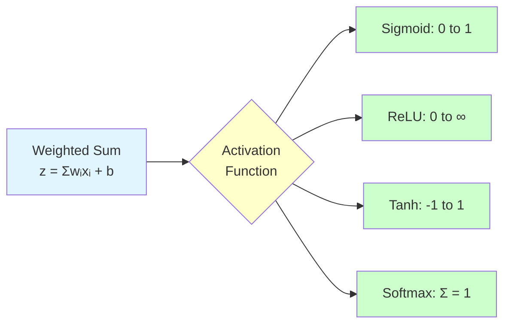
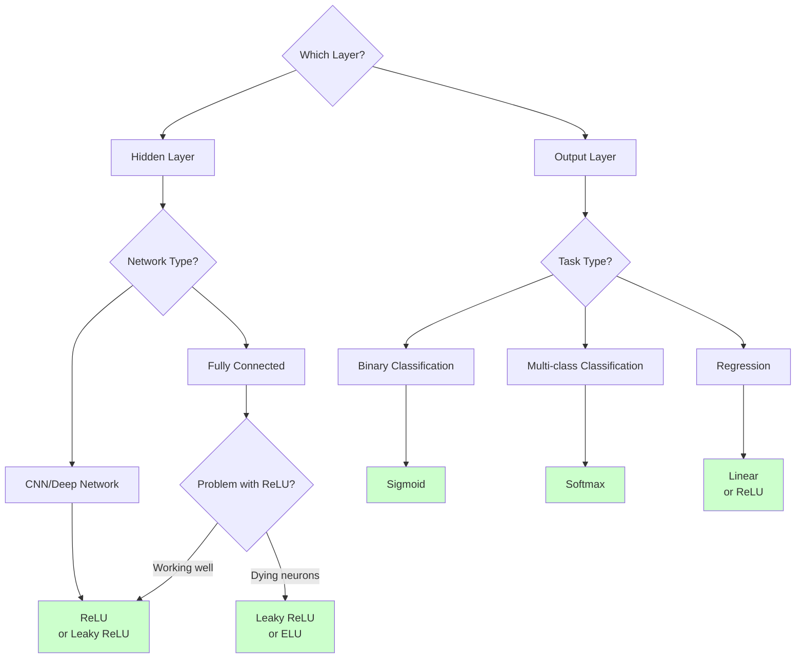

# Activation Functions

**Add non-linearity to neural networks and enable learning of complex patterns.** Without activation functions, neural networks would just be linear models!

**Difficulty:** 🟢 Beginner | **Time:** 1-2 hours | **Prerequisites:** Basic Calculus, [Neural Networks Basics](neural-networks-basics.md)

---

## Overview

Activation functions are mathematical functions applied to neuron outputs that introduce non-linearity into neural networks. They determine whether a neuron should "fire" (activate) based on its weighted input sum, enabling networks to learn complex, non-linear patterns.

**Use cases:** Every neural network layer (except sometimes input), enabling non-linear decision boundaries

---

## Intuition 💡

### Why We Need Activation Functions

Without activation functions, stacking multiple layers would still be equivalent to a single linear transformation:

```
No activation:
  Layer 1: z₁ = W₁x
  Layer 2: z₂ = W₂z₁ = W₂W₁x = Wx  (still linear!)

With activation:
  Layer 1: a₁ = σ(W₁x)
  Layer 2: a₂ = σ(W₂a₁)  (non-linear!)
```

### Real-World Analogy

Think of activation functions like decision gates:
- **Sigmoid:** "How confident am I?" (0-100%)
- **ReLU:** "Is this feature present?" (yes/no with intensity)
- **Tanh:** "Is this positive or negative?" (-100% to +100%)
- **Softmax:** "Which option is best?" (probability distribution)



---

## Common Activation Functions

### 1. Sigmoid (Logistic)

$$\sigma(z) = \frac{1}{1 + e^{-z}}$$

**Output Range:** (0, 1)

**Derivative:**

$$\sigma'(z) = \sigma(z)(1 - \sigma(z))$$

```python
def sigmoid(z):
    return 1 / (1 + np.exp(-z))

def sigmoid_derivative(z):
    s = sigmoid(z)
    return s * (1 - s)
```

**When to Use:**
- ✅ Binary classification (output layer)
- ✅ Need probabilities (0-1)
- ❌ Hidden layers (vanishing gradients)

**Pros & Cons:**
- ✅ Smooth gradient
- ✅ Output bounded (0-1)
- ❌ Vanishing gradients for large |z|
- ❌ Not zero-centered
- ❌ Computationally expensive (exp)

---

### 2. Tanh (Hyperbolic Tangent)

$$\tanh(z) = \frac{e^z - e^{-z}}{e^z + e^{-z}} = \frac{2}{1 + e^{-2z}} - 1$$

**Output Range:** (-1, 1)

**Derivative:**

$$\tanh'(z) = 1 - \tanh^2(z)$$

```python
def tanh(z):
    return np.tanh(z)

def tanh_derivative(z):
    t = tanh(z)
    return 1 - t**2
```

**When to Use:**
- ✅ Hidden layers (better than sigmoid)
- ✅ When need centered outputs (-1 to 1)
- ❌ Output layer for classification

**Pros & Cons:**
- ✅ Zero-centered (helps optimization)
- ✅ Stronger gradients than sigmoid
- ❌ Still suffers from vanishing gradients
- ❌ Computationally expensive

---

### 3. ReLU (Rectified Linear Unit)

$$\text{ReLU}(z) = \max(0, z) = \begin{cases} z & \text{if } z > 0 \\ 0 & \text{if } z \leq 0 \end{cases}$$

**Output Range:** [0, ∞)

**Derivative:**

$$\text{ReLU}'(z) = \begin{cases} 1 & \text{if } z > 0 \\ 0 & \text{if } z \leq 0 \end{cases}$$

```python
def relu(z):
    return np.maximum(0, z)

def relu_derivative(z):
    return (z > 0).astype(float)
```

**When to Use:**
- ✅ Default choice for hidden layers
- ✅ Deep networks (doesn't vanish)
- ✅ Convolutional neural networks
- ❌ Output layer

**Pros & Cons:**
- ✅ Simple and fast to compute
- ✅ No vanishing gradient for z > 0
- ✅ Sparse activation (many zeros)
- ✅ Biologically plausible
- ❌ Dying ReLU problem (neurons stuck at 0)
- ❌ Not zero-centered
- ❌ Unbounded output

---

### 4. Leaky ReLU

$$\text{LeakyReLU}(z) = \begin{cases} z & \text{if } z > 0 \\ \alpha z & \text{if } z \leq 0 \end{cases}$$

Where $\alpha$ is a small constant (typically 0.01).

**Output Range:** (-∞, ∞)

**Derivative:**

$$\text{LeakyReLU}'(z) = \begin{cases} 1 & \text{if } z > 0 \\ \alpha & \text{if } z \leq 0 \end{cases}$$

```python
def leaky_relu(z, alpha=0.01):
    return np.where(z > 0, z, alpha * z)

def leaky_relu_derivative(z, alpha=0.01):
    return np.where(z > 0, 1, alpha)
```

**When to Use:**
- ✅ When ReLU causes dying neurons
- ✅ Hidden layers as alternative to ReLU

**Pros & Cons:**
- ✅ Fixes dying ReLU problem
- ✅ Simple and fast
- ❌ Inconsistent performance
- ❌ Need to tune α

---

### 5. ELU (Exponential Linear Unit)

$$\text{ELU}(z) = \begin{cases} z & \text{if } z > 0 \\ \alpha(e^z - 1) & \text{if } z \leq 0 \end{cases}$$

**Output Range:** (-α, ∞)

**Derivative:**

$$\text{ELU}'(z) = \begin{cases} 1 & \text{if } z > 0 \\ \text{ELU}(z) + \alpha & \text{if } z \leq 0 \end{cases}$$

```python
def elu(z, alpha=1.0):
    return np.where(z > 0, z, alpha * (np.exp(z) - 1))

def elu_derivative(z, alpha=1.0):
    return np.where(z > 0, 1, elu(z, alpha) + alpha)
```

**When to Use:**
- ✅ When want smoother activation than ReLU
- ✅ Deep networks

**Pros & Cons:**
- ✅ No dying neuron problem
- ✅ Smooth everywhere
- ✅ Negative saturation helps with noise robustness
- ❌ Computationally expensive (exp)
- ❌ Need to tune α

---

### 6. SELU (Scaled ELU)

$$\text{SELU}(z) = \lambda \begin{cases} z & \text{if } z > 0 \\ \alpha(e^z - 1) & \text{if } z \leq 0 \end{cases}$$

Where $\lambda \approx 1.0507$ and $\alpha \approx 1.6733$ (derived values).

```python
def selu(z):
    alpha = 1.6732632423543772848170429916717
    scale = 1.0507009873554804934193349852946
    return scale * np.where(z > 0, z, alpha * (np.exp(z) - 1))
```

**When to Use:**
- ✅ Fully connected networks
- ✅ Want self-normalizing properties
- ❌ CNNs (use ReLU)

**Pros & Cons:**
- ✅ Self-normalizing (maintains mean 0, variance 1)
- ✅ No need for batch normalization
- ✅ Excellent for deep networks
- ❌ Requires specific weight initialization
- ❌ Less flexible than other activations

---

### 7. Softmax

$$\text{softmax}(z_i) = \frac{e^{z_i}}{\sum_{j=1}^{k} e^{z_j}}$$

**Output Range:** (0, 1) where $\sum_i \text{softmax}(z_i) = 1$

```python
def softmax(z):
    # Subtract max for numerical stability
    exp_z = np.exp(z - np.max(z, axis=-1, keepdims=True))
    return exp_z / np.sum(exp_z, axis=-1, keepdims=True)
```

**When to Use:**
- ✅ Multi-class classification (output layer ONLY)
- ✅ Need probability distribution
- ❌ Hidden layers
- ❌ Binary classification (use sigmoid)

**Pros & Cons:**
- ✅ Outputs sum to 1 (probabilities)
- ✅ Differentiable
- ✅ Emphasizes largest values
- ❌ Only for output layer
- ❌ Can be sensitive to outliers

---

## Comparison Table

| Function | Range | Zero-Centered | Vanishing Gradient | Dying Neuron | Speed | Use Case |
|----------|-------|---------------|-------------------|--------------|-------|----------|
| **Sigmoid** | (0, 1) | ❌ | ✅ Yes | ❌ | Slow | Binary output |
| **Tanh** | (-1, 1) | ✅ | ✅ Yes | ❌ | Slow | Hidden layers |
| **ReLU** | [0, ∞) | ❌ | ❌ No | ✅ Yes | Fast | Default hidden |
| **Leaky ReLU** | (-∞, ∞) | ❌ | ❌ No | ❌ | Fast | Fix dying ReLU |
| **ELU** | (-α, ∞) | ≈ Yes | ❌ No | ❌ | Medium | Smooth alternative |
| **SELU** | (-λα, ∞) | ✅ | ❌ No | ❌ | Medium | Deep networks |
| **Softmax** | (0, 1), Σ=1 | ❌ | ❌ No | ❌ | Medium | Multi-class output |

---

## When to Use Each

### Decision Tree



### Quick Guide

**Hidden Layers:**
1. **Start with ReLU** - Works 90% of the time
2. **Try Leaky ReLU** - If neurons are dying
3. **Try ELU/SELU** - For very deep networks
4. **Avoid sigmoid/tanh** - In deep networks (vanishing gradients)

**Output Layer:**
1. **Binary Classification** → Sigmoid
2. **Multi-class Classification** → Softmax
3. **Regression** → Linear (no activation) or ReLU (if outputs ≥ 0)

---

## Mathematical Foundation

### Properties

**1. Non-linearity:** Must be non-linear to enable learning complex patterns

**2. Differentiability:** Must have derivatives for backpropagation

**3. Monotonicity:** Usually monotonic (preserves input order)

**4. Range:** Output range affects gradient flow
- Bounded (sigmoid, tanh): risk of vanishing gradients
- Unbounded (ReLU): risk of exploding activations

### Gradient Flow

The derivative determines how gradients flow backward:

$$\frac{\partial L}{\partial z} = \frac{\partial L}{\partial a} \cdot \frac{\partial a}{\partial z}$$

Where $a = g(z)$ is the activation.

**Problem:** If $\frac{\partial a}{\partial z} \approx 0$, gradients vanish!

**Example - Sigmoid:**
- When $|z|$ is large, $\sigma'(z) \approx 0$
- Gradient flow stops → early layers don't learn

**Solution - ReLU:**
- For $z > 0$: $\text{ReLU}'(z) = 1$ (perfect gradient flow!)
- For $z \leq 0$: $\text{ReLU}'(z) = 0$ (dead neuron)

---

## Implementation

### Complete Example with All Activations

```python
import numpy as np
import matplotlib.pyplot as plt

# Define activation functions
activations = {
    'Sigmoid': lambda z: 1 / (1 + np.exp(-np.clip(z, -500, 500))),
    'Tanh': lambda z: np.tanh(z),
    'ReLU': lambda z: np.maximum(0, z),
    'Leaky ReLU': lambda z: np.where(z > 0, z, 0.01 * z),
    'ELU': lambda z: np.where(z > 0, z, 1.0 * (np.exp(z) - 1)),
    'SELU': lambda z: 1.0507 * np.where(z > 0, z, 1.6733 * (np.exp(z) - 1))
}

# Define derivatives
derivatives = {
    'Sigmoid': lambda z: activations['Sigmoid'](z) * (1 - activations['Sigmoid'](z)),
    'Tanh': lambda z: 1 - np.tanh(z)**2,
    'ReLU': lambda z: (z > 0).astype(float),
    'Leaky ReLU': lambda z: np.where(z > 0, 1, 0.01),
    'ELU': lambda z: np.where(z > 0, 1, activations['ELU'](z) + 1.0),
    'SELU': lambda z: 1.0507 * np.where(z > 0, 1, 1.6733 * np.exp(z))
}

# Generate input values
z = np.linspace(-5, 5, 1000)

# Plot activations
fig, axes = plt.subplots(2, 3, figsize=(15, 10))
axes = axes.ravel()

for idx, (name, func) in enumerate(activations.items()):
    axes[idx].plot(z, func(z), linewidth=2, label=name)
    axes[idx].axhline(0, color='black', linewidth=0.5, linestyle='--')
    axes[idx].axvline(0, color='black', linewidth=0.5, linestyle='--')
    axes[idx].grid(True, alpha=0.3)
    axes[idx].set_title(f'{name} Activation', fontsize=12, fontweight='bold')
    axes[idx].set_xlabel('z (input)')
    axes[idx].set_ylabel('a (output)')
    axes[idx].legend()

plt.tight_layout()
plt.savefig('activation_functions.png', dpi=150)
plt.show()

# Plot derivatives
fig, axes = plt.subplots(2, 3, figsize=(15, 10))
axes = axes.ravel()

for idx, (name, func) in enumerate(derivatives.items()):
    axes[idx].plot(z, func(z), linewidth=2, label=f"{name}'", color='orange')
    axes[idx].axhline(0, color='black', linewidth=0.5, linestyle='--')
    axes[idx].axvline(0, color='black', linewidth=0.5, linestyle='--')
    axes[idx].grid(True, alpha=0.3)
    axes[idx].set_title(f'{name} Derivative', fontsize=12, fontweight='bold')
    axes[idx].set_xlabel('z (input)')
    axes[idx].set_ylabel("f'(z)")
    axes[idx].legend()

plt.tight_layout()
plt.savefig('activation_derivatives.png', dpi=150)
plt.show()
```

### Using in Keras

```python
from tensorflow import keras

# Different activation functions in layers
model = keras.Sequential([
    # Hidden layers - use ReLU
    keras.layers.Dense(128, activation='relu'),
    keras.layers.Dense(64, activation='leaky_relu'),  # or 'elu', 'selu'

    # Output layer - depends on task
    keras.layers.Dense(1, activation='sigmoid')  # Binary classification
    # keras.layers.Dense(10, activation='softmax')  # Multi-class
    # keras.layers.Dense(1, activation='linear')  # Regression
])

# Custom activation with specific parameters
from tensorflow.keras.layers import LeakyReLU

model = keras.Sequential([
    keras.layers.Dense(128),
    LeakyReLU(alpha=0.2),  # Custom alpha
    keras.layers.Dense(1, activation='sigmoid')
])
```

### Using in PyTorch

```python
import torch.nn as nn

class NeuralNet(nn.Module):
    def __init__(self):
        super(NeuralNet, self).__init__()
        self.fc1 = nn.Linear(784, 128)
        self.fc2 = nn.Linear(128, 64)
        self.fc3 = nn.Linear(64, 10)

        # Activation functions
        self.relu = nn.ReLU()
        self.leaky_relu = nn.LeakyReLU(negative_slope=0.01)
        self.elu = nn.ELU(alpha=1.0)
        self.selu = nn.SELU()
        self.softmax = nn.Softmax(dim=1)

    def forward(self, x):
        x = self.relu(self.fc1(x))      # ReLU for first hidden
        x = self.elu(self.fc2(x))       # ELU for second hidden
        x = self.softmax(self.fc3(x))   # Softmax for output
        return x
```

---

## Visualization

### Interactive Comparison

```python
import numpy as np
import matplotlib.pyplot as plt
from matplotlib.widgets import Slider

# Create figure
fig, (ax1, ax2) = plt.subplots(1, 2, figsize=(14, 5))

z = np.linspace(-10, 10, 1000)

# Initial plot
line_relu, = ax1.plot(z, np.maximum(0, z), 'b-', linewidth=2, label='ReLU')
line_sigmoid, = ax1.plot(z, 1/(1+np.exp(-z)), 'r-', linewidth=2, label='Sigmoid')
line_tanh, = ax1.plot(z, np.tanh(z), 'g-', linewidth=2, label='Tanh')

ax1.set_xlabel('Input (z)')
ax1.set_ylabel('Output (a)')
ax1.set_title('Activation Functions')
ax1.legend()
ax1.grid(True, alpha=0.3)

# Derivative plot
relu_der = (z > 0).astype(float)
sigmoid_val = 1/(1+np.exp(-z))
sigmoid_der = sigmoid_val * (1 - sigmoid_val)
tanh_der = 1 - np.tanh(z)**2

line_relu_der, = ax2.plot(z, relu_der, 'b-', linewidth=2, label="ReLU'")
line_sigmoid_der, = ax2.plot(z, sigmoid_der, 'r-', linewidth=2, label="Sigmoid'")
line_tanh_der, = ax2.plot(z, tanh_der, 'g-', linewidth=2, label="Tanh'")

ax2.set_xlabel('Input (z)')
ax2.set_ylabel('Derivative')
ax2.set_title('Activation Function Derivatives')
ax2.legend()
ax2.grid(True, alpha=0.3)

plt.tight_layout()
plt.show()
```

---

## Common Pitfalls

### 1. Using Sigmoid in Deep Networks

!!! warning "Vanishing Gradients"
    **Problem:** Sigmoid derivatives are small (max 0.25), causing gradients to vanish in deep networks.

    **Solution:** Use ReLU for hidden layers

    ```python
    # ❌ Bad for deep networks
    model = keras.Sequential([
        keras.layers.Dense(128, activation='sigmoid'),
        keras.layers.Dense(64, activation='sigmoid'),
        keras.layers.Dense(32, activation='sigmoid'),  # Gradients dying here
    ])

    # ✅ Good for deep networks
    model = keras.Sequential([
        keras.layers.Dense(128, activation='relu'),
        keras.layers.Dense(64, activation='relu'),
        keras.layers.Dense(32, activation='relu'),
    ])
    ```

### 2. Dying ReLU Problem

!!! warning "Neurons Stuck at Zero"
    **Problem:** If weights push inputs negative, ReLU outputs 0 forever.

    **Symptoms:** Many neurons always output 0, network capacity decreases

    **Solutions:**
    - Lower learning rate
    - Better weight initialization
    - Use Leaky ReLU or ELU

    ```python
    # Check for dead neurons
    activations = model.predict(X_train)
    dead_neurons = np.mean(activations == 0, axis=0)
    print(f"Dead neurons per layer: {dead_neurons}")

    # Switch to Leaky ReLU
    model = keras.Sequential([
        keras.layers.Dense(128, activation='leaky_relu'),
        keras.layers.Dense(64, activation='leaky_relu'),
    ])
    ```

### 3. Wrong Output Activation

!!! warning "Mismatched Task and Activation"
    **Problem:** Using wrong activation for output layer.

    ```python
    # ❌ Bad: Sigmoid for multi-class (outputs don't sum to 1)
    model.add(keras.layers.Dense(10, activation='sigmoid'))

    # ✅ Good: Softmax for multi-class
    model.add(keras.layers.Dense(10, activation='softmax'))

    # ❌ Bad: ReLU for regression with negative values
    model.add(keras.layers.Dense(1, activation='relu'))

    # ✅ Good: Linear for regression
    model.add(keras.layers.Dense(1, activation='linear'))
    ```

### 4. Not Matching Loss Function

!!! warning "Activation and Loss Mismatch"
    **Problem:** Loss function expects specific activation output.

    ```python
    # ✅ Correct combinations
    # Binary classification
    model.add(keras.layers.Dense(1, activation='sigmoid'))
    model.compile(loss='binary_crossentropy')

    # Multi-class classification
    model.add(keras.layers.Dense(10, activation='softmax'))
    model.compile(loss='categorical_crossentropy')

    # Regression
    model.add(keras.layers.Dense(1, activation='linear'))
    model.compile(loss='mse')
    ```

---

## Practice Problems

### 🟢 Beginner

!!! example "Problem 1: Implement and Visualize"
    Implement sigmoid, tanh, ReLU, and Leaky ReLU from scratch. Plot them and their derivatives for z ∈ [-10, 10].

    **Bonus:** Add interactive sliders to change parameters (e.g., α for Leaky ReLU).

!!! example "Problem 2: Activation Comparison"
    Train the same neural network with different activations (sigmoid, tanh, ReLU) on MNIST. Compare:
    - Training speed
    - Final accuracy
    - Gradient magnitudes

### 🟡 Intermediate

!!! example "Problem 3: Dying ReLU Detection"
    Train a deep network (5+ layers) with ReLU. After training:
    - Identify dead neurons (always output 0)
    - Visualize percentage of dead neurons per layer
    - Retrain with Leaky ReLU and compare

!!! example "Problem 4: Custom Activation Function"
    Create a custom activation function: Swish: $f(x) = x \cdot \sigma(x)$

    Implement it in Keras/PyTorch and compare with ReLU on a dataset.

### 🔴 Advanced

!!! example "Problem 5: Adaptive Activation"
    Implement Parametric ReLU (PReLU) where α is learned:
    - α starts at 0.25
    - Network learns optimal α during training
    - Compare with fixed Leaky ReLU

!!! example "Problem 6: Activation Search"
    Implement automated activation function search:
    - Try different activations per layer
    - Use validation performance to select best
    - Test on multiple datasets

---

## Real-World Applications

1. **Image Classification (CNNs):** ReLU in hidden layers, softmax for output
2. **Language Models:** GELU (Gaussian Error Linear Unit) in transformers
3. **GANs:** Leaky ReLU in discriminator (prevents dead neurons)
4. **Autoencoders:** Sigmoid/Tanh for normalized outputs
5. **Reinforcement Learning:** ReLU or ELU for policy networks
6. **Time Series:** Tanh or SELU for recurrent networks

---

## Related Topics

- [Neural Networks Basics](neural-networks-basics.md) - Foundation
- [Backpropagation](backpropagation.md) - How gradients flow
- [CNN](cnn.md) - Uses ReLU extensively
- [RNN](rnn.md) - Uses tanh historically
- [Transformers](transformers.md) - Uses GELU
- [Optimization](../optimization/index.md) - Training dynamics

---

## References

1. **Paper:** [ReLU - Nair & Hinton (2010)](https://www.cs.toronto.edu/~fritz/absps/reluICML.pdf)
2. **Paper:** [ELU - Clevert et al. (2015)](https://arxiv.org/abs/1511.07289)
3. **Paper:** [SELU - Klambauer et al. (2017)](https://arxiv.org/abs/1706.02515)
4. **Paper:** [Swish/SiLU - Ramachandran et al. (2017)](https://arxiv.org/abs/1710.05941)
5. **Blog:** [Activation Functions Explained](https://mlfromscratch.com/activation-functions-explained/)
6. **Interactive:** [Activation Function Explorer](https://dashee87.github.io/deep%20learning/visualising-activation-functions-in-neural-networks/)

---

**Next Steps:**
- Understand [Backpropagation](backpropagation.md) to see how activations affect learning
- Build deep networks and experiment with different activations
- Learn about [Batch Normalization](../optimization/batch-normalization.md) (alternative to careful activation choice)

**Ready to experiment with activations?** Try the visualization code above! 🎨
