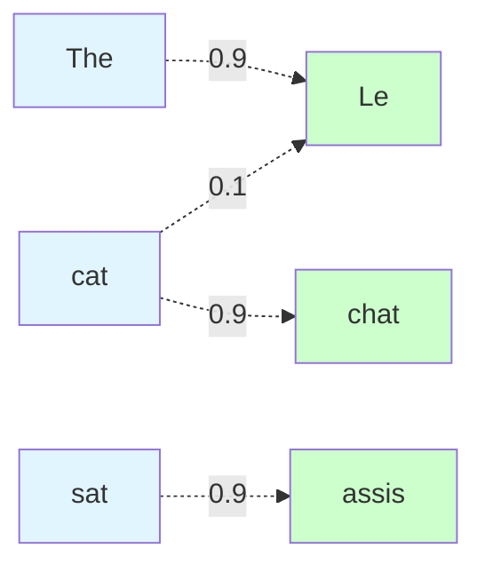

# Attention Mechanisms

**Focus on the most relevant parts of input data dynamically.** Attention mechanisms allow models to selectively concentrate on important information, revolutionizing sequence processing.

**Difficulty:** 🔴 Advanced | **Time:** 4-5 hours | **Prerequisites:** [Neural Networks Basics](neural-networks-basics.md), [RNN](rnn.md)

---

## Overview

Attention mechanisms enable neural networks to dynamically focus on different parts of the input when producing each output. Instead of encoding entire sequences into fixed vectors, attention allows models to selectively access relevant information, dramatically improving performance on tasks requiring alignment between inputs and outputs.

**Use cases:** Machine translation, image captioning, question answering, summarization, speech recognition, any sequence-to-sequence task

---

## Intuition 💡

### The Big Idea

When translating "The cat sat on the mat" to French, which English words should you focus on for each French word?

**Without Attention:**
- Encoder compresses entire sentence into single vector
- Information bottleneck!

**With Attention:**
- Decoder "attends" to relevant English words for each French word
- "Le" focuses on "The"
- "chat" focuses on "cat"
- Dynamic, learned alignment!



### Real-World Analogy

Reading a textbook to answer questions:
- **Question:** "What year was the Magna Carta signed?"
- **Without attention:** Memorize entire chapter
- **With attention:** Scan for "Magna Carta" and "year" → focus on relevant sentence

Attention is like a spotlight that highlights relevant information!

---

## Types of Attention

### 1. Additive (Bahdanau) Attention

**Score Function:**

$$e_{ij} = v^T \tanh(W_1 h_i + W_2 s_j)$$

Where:
- $h_i$ = encoder hidden state at position $i$
- $s_j$ = decoder hidden state at position $j$
- $W_1, W_2, v$ = learned parameters

**Alignment Weights:**

$$\alpha_{ij} = \frac{\exp(e_{ij})}{\sum_k \exp(e_{kj})}$$

**Context Vector:**

$$c_j = \sum_i \alpha_{ij} h_i$$

### 2. Multiplicative (Luong) Attention

**Score Function (Dot Product):**

$$e_{ij} = h_i^T s_j$$

**Or with Weight Matrix:**

$$e_{ij} = h_i^T W s_j$$

**Then softmax and weighted sum as above.**

**Advantage:** Computationally simpler than additive.

### 3. Self-Attention

Each position attends to all positions in same sequence.

**Query, Key, Value:**

$$Q = XW^Q, \quad K = XW^K, \quad V = XW^V$$

**Attention:**

$$\text{Attention}(Q, K, V) = \text{softmax}\left(\frac{QK^T}{\sqrt{d_k}}\right)V$$

**Use case:** Transformers, BERT, GPT

### 4. Multi-Head Attention

Run multiple attention operations in parallel:

$$\text{MultiHead}(Q, K, V) = \text{Concat}(\text{head}_1, ..., \text{head}_h)W^O$$

Different heads learn different relationships!

### 5. Cross-Attention

Attend from one sequence to another.

**Example:** Decoder attending to encoder outputs

---

## When to Use ✅ / When to Avoid ❌

### ✅ Good For

| Scenario | Why It Works |
|----------|--------------|
| **Sequence-to-sequence** | Aligns input-output positions dynamically |
| **Variable-length inputs** | No need for fixed-size encoding |
| **Long sequences** | Access information without bottleneck |
| **Interpretability** | Attention weights show what model focuses on |
| **Multiple modalities** | Attend between text and image |

**Examples:**
- Machine translation (align source-target words)
- Image captioning (focus on image regions)
- Question answering (focus on relevant passages)
- Summarization (identify key sentences)

### ❌ Not Good For

| Scenario | Why It Fails |
|----------|--------------|
| **Very long sequences** | Quadratic complexity in sequence length |
| **Independent inputs** | No relationships to model |
| **Simple tasks** | Overkill, adds unnecessary complexity |

---

## Mathematical Foundation

### Attention as Soft Dictionary Lookup

Think of attention as querying a dictionary:
- **Query (Q):** What am I looking for?
- **Keys (K):** What do you contain?
- **Values (V):** What information can you provide?

**Process:**
1. Compare query with all keys → similarity scores
2. Softmax to get weights (sum to 1)
3. Weighted average of values

$$\text{output} = \sum_i \text{weight}_i \cdot \text{value}_i$$

### Scaled Dot-Product Attention

$$\text{Attention}(Q, K, V) = \text{softmax}\left(\frac{QK^T}{\sqrt{d_k}}\right)V$$

**Why scaling by $\sqrt{d_k}$?**
- Dot products grow with dimensionality
- Large values → softmax saturates → small gradients
- Scaling keeps values in good range

### Attention Visualization

```
Input:    The    cat    sat    on    mat
         ─────  ─────  ─────  ─────  ─────
Output   │0.1│  │0.8│  │0.05│ │0.03│ │0.02│  → focuses on "cat"
cat:     └───┘  └───┘  └────┘ └────┘ └────┘
           ↑      ↑      ↑      ↑      ↑
        Attention weights (sum = 1.0)
```

---

## Implementation

### Additive Attention from Scratch

```python
import numpy as np
import torch
import torch.nn as nn
import torch.nn.functional as F

class BahdanauAttention(nn.Module):
    """Additive (Bahdanau) attention"""

    def __init__(self, hidden_size):
        super().__init__()
        self.W1 = nn.Linear(hidden_size, hidden_size)
        self.W2 = nn.Linear(hidden_size, hidden_size)
        self.v = nn.Linear(hidden_size, 1)

    def forward(self, query, keys):
        """
        Args:
            query: Decoder hidden state (batch, hidden_size)
            keys: Encoder hidden states (batch, seq_len, hidden_size)

        Returns:
            context: Weighted sum of keys (batch, hidden_size)
            attention_weights: Attention distribution (batch, seq_len)
        """
        # Expand query to match keys shape
        query = query.unsqueeze(1)  # (batch, 1, hidden_size)

        # Compute attention scores
        scores = self.v(torch.tanh(
            self.W1(query) + self.W2(keys)
        ))  # (batch, seq_len, 1)
        scores = scores.squeeze(-1)  # (batch, seq_len)

        # Compute attention weights
        attention_weights = F.softmax(scores, dim=1)

        # Compute context vector
        context = torch.bmm(
            attention_weights.unsqueeze(1),  # (batch, 1, seq_len)
            keys  # (batch, seq_len, hidden_size)
        ).squeeze(1)  # (batch, hidden_size)

        return context, attention_weights

# Example usage
print("=" * 60)
print("Bahdanau Attention Example")
print("=" * 60)

batch_size = 32
seq_len = 10
hidden_size = 128

attention = BahdanauAttention(hidden_size)

# Dummy data
query = torch.randn(batch_size, hidden_size)
keys = torch.randn(batch_size, seq_len, hidden_size)

context, weights = attention(query, keys)

print(f"Query shape: {query.shape}")
print(f"Keys shape: {keys.shape}")
print(f"Context shape: {context.shape}")
print(f"Attention weights shape: {weights.shape}")
print(f"Attention weights sum: {weights[0].sum():.4f} (should be 1.0)")
```

### Scaled Dot-Product Attention

```python
class ScaledDotProductAttention(nn.Module):
    """Scaled dot-product attention"""

    def __init__(self, temperature):
        super().__init__()
        self.temperature = temperature

    def forward(self, Q, K, V, mask=None):
        """
        Args:
            Q: Queries (batch, n_heads, len_q, d_k)
            K: Keys (batch, n_heads, len_k, d_k)
            V: Values (batch, n_heads, len_v, d_v)
            mask: Mask for invalid positions

        Returns:
            output: Attention output
            attention: Attention weights
        """
        # Compute attention scores
        scores = torch.matmul(Q, K.transpose(-2, -1)) / self.temperature

        # Apply mask (optional)
        if mask is not None:
            scores = scores.masked_fill(mask == 0, -1e9)

        # Softmax to get attention weights
        attention = F.softmax(scores, dim=-1)

        # Apply attention to values
        output = torch.matmul(attention, V)

        return output, attention

# Example
print("\n" + "=" * 60)
print("Scaled Dot-Product Attention Example")
print("=" * 60)

d_k = 64
attention = ScaledDotProductAttention(temperature=np.sqrt(d_k))

batch_size = 32
n_heads = 8
seq_len = 10

Q = torch.randn(batch_size, n_heads, seq_len, d_k)
K = torch.randn(batch_size, n_heads, seq_len, d_k)
V = torch.randn(batch_size, n_heads, seq_len, d_k)

output, attn_weights = attention(Q, K, V)

print(f"Output shape: {output.shape}")
print(f"Attention weights shape: {attn_weights.shape}")
```

### Seq2Seq with Attention

```python
class AttentionSeq2Seq(nn.Module):
    """Sequence-to-sequence model with attention"""

    def __init__(self, vocab_size, embed_size, hidden_size):
        super().__init__()

        # Encoder
        self.encoder_embedding = nn.Embedding(vocab_size, embed_size)
        self.encoder = nn.GRU(embed_size, hidden_size, batch_first=True)

        # Attention
        self.attention = BahdanauAttention(hidden_size)

        # Decoder
        self.decoder_embedding = nn.Embedding(vocab_size, embed_size)
        self.decoder = nn.GRU(embed_size + hidden_size, hidden_size, batch_first=True)

        # Output
        self.fc = nn.Linear(hidden_size, vocab_size)

    def forward(self, source, target):
        """
        Args:
            source: Source sequence (batch, src_len)
            target: Target sequence (batch, tgt_len)
        """
        # Encode
        src_embed = self.encoder_embedding(source)
        encoder_outputs, hidden = self.encoder(src_embed)

        # Decode with attention
        tgt_embed = self.decoder_embedding(target)
        batch_size, tgt_len, _ = tgt_embed.shape

        outputs = []
        decoder_hidden = hidden

        for t in range(tgt_len):
            # Get current target embedding
            tgt_t = tgt_embed[:, t, :].unsqueeze(1)

            # Compute attention context
            context, _ = self.attention(
                decoder_hidden[-1],  # Last layer hidden
                encoder_outputs
            )

            # Concatenate context with input
            rnn_input = torch.cat([tgt_t, context.unsqueeze(1)], dim=2)

            # Decoder step
            output, decoder_hidden = self.decoder(rnn_input, decoder_hidden)

            # Project to vocabulary
            output = self.fc(output.squeeze(1))
            outputs.append(output)

        outputs = torch.stack(outputs, dim=1)
        return outputs

# Example
print("\n" + "=" * 60)
print("Seq2Seq with Attention")
print("=" * 60)

vocab_size = 10000
model = AttentionSeq2Seq(vocab_size, embed_size=256, hidden_size=512)

source = torch.randint(0, vocab_size, (32, 20))
target = torch.randint(0, vocab_size, (32, 15))

outputs = model(source, target)
print(f"Output shape: {outputs.shape}")
print(f"Parameters: {sum(p.numel() for p in model.parameters()):,}")
```

---

## Visualization

### Attention Heatmap

```python
import matplotlib.pyplot as plt
import seaborn as sns

def plot_attention(attention_weights, source_words, target_words):
    """
    Visualize attention weights as heatmap

    Args:
        attention_weights: (target_len, source_len)
        source_words: List of source words
        target_words: List of target words
    """
    plt.figure(figsize=(10, 8))
    sns.heatmap(
        attention_weights.detach().cpu().numpy(),
        xticklabels=source_words,
        yticklabels=target_words,
        cmap='YlOrRd',
        annot=True,
        fmt='.2f',
        cbar_kws={'label': 'Attention Weight'}
    )
    plt.xlabel('Source Words')
    plt.ylabel('Target Words')
    plt.title('Attention Weights Heatmap')
    plt.tight_layout()
    plt.show()

# Example visualization
source_words = ['The', 'cat', 'sat', 'on', 'mat']
target_words = ['Le', 'chat', 'assis']

# Dummy attention weights
attention = torch.tensor([
    [0.8, 0.1, 0.05, 0.03, 0.02],  # Le focuses on "The"
    [0.1, 0.8, 0.05, 0.03, 0.02],  # chat focuses on "cat"
    [0.05, 0.1, 0.7, 0.1, 0.05],   # assis focuses on "sat"
])

plot_attention(attention, source_words, target_words)
```

---

## Complexity Analysis

### Time Complexity

**Attention Computation:**
- Score calculation: $O(n \cdot m \cdot d)$
- Softmax: $O(n \cdot m)$
- Weighted sum: $O(n \cdot m \cdot d)$

Where:
- $n$ = target sequence length
- $m$ = source sequence length
- $d$ = hidden dimension

**Self-Attention:** $O(n^2 \cdot d)$ (quadratic in sequence length!)

### Space Complexity

**Attention Matrix:** $O(n \cdot m)$
- Stores attention weights for all position pairs

**Problem for Long Sequences:**
- 1000 tokens: 1M attention scores!
- 10K tokens: 100M attention scores!

---

## Common Pitfalls

### 1. Attention is Not Interpretability

!!! warning "High Attention ≠ Important"
    **Problem:** Attention weights don't always reflect true importance.

    **Reality:** Attention shows where model looks, not why decisions are made.

    **Use carefully:** Don't over-interpret attention visualizations.

### 2. Quadratic Complexity

!!! warning "Expensive for Long Sequences"
    **Problem:** Memory and compute grow with sequence length squared.

    **Solutions:**
    - Truncate sequences
    - Sparse attention patterns
    - Linear attention approximations

### 3. Attention Collapse

!!! warning "All Weights Go to One Position"
    **Problem:** Model attends only to one position, ignoring others.

    **Solutions:**
    - Attention dropout
    - Multiple attention heads
    - Regularization on attention entropy

---

## Practice Problems

### 🟢 Beginner

!!! example "Problem 1: Implement Dot-Product Attention"
    Build scaled dot-product attention from scratch.
    Verify output matches PyTorch implementation.

!!! example "Problem 2: Visualize Attention"
    Train a simple seq2seq model with attention.
    Visualize attention weights for translations.

### 🟡 Intermediate

!!! example "Problem 3: Multi-Head Attention"
    Implement multi-head attention mechanism.
    Compare with single-head on translation task.

!!! example "Problem 4: Attention Analysis"
    Train model and analyze learned attention patterns.
    Do different heads specialize in different relationships?

### 🔴 Advanced

!!! example "Problem 5: Efficient Attention"
    Implement sparse attention pattern (e.g., local attention).
    Compare speed/memory with full attention.

!!! example "Problem 6: Cross-Modal Attention"
    Build image captioning model with attention.
    CNN features → attention → LSTM decoder.

---

## Real-World Applications

1. **Machine Translation:** Google Translate, DeepL
2. **Image Captioning:** Describe images in natural language
3. **Question Answering:** BERT, reading comprehension
4. **Text Summarization:** Focus on key sentences
5. **Speech Recognition:** Align audio with text
6. **Visual Question Answering:** Attend to image regions
7. **Document Classification:** Focus on important passages
8. **Recommendation Systems:** Attention over user history

---

## Related Topics

- [Transformers](transformers.md) - Built entirely on attention
- [RNN](rnn.md) - Original seq2seq models
- [LSTM & GRU](lstm-gru.md) - Often combined with attention
- [Neural Networks Basics](neural-networks-basics.md) - Foundation
- BERT - Self-attention for language understanding
- GPT - Masked self-attention for generation

---

## References

1. **Paper:** [Neural Machine Translation by Jointly Learning to Align and Translate](https://arxiv.org/abs/1409.0473) (Bahdanau et al., 2014)
2. **Paper:** [Effective Approaches to Attention-based NMT](https://arxiv.org/abs/1508.04025) (Luong et al., 2015)
3. **Paper:** [Attention Is All You Need](https://arxiv.org/abs/1706.03762) (Vaswani et al., 2017)
4. **Tutorial:** [Attention and Memory in Deep Learning](https://www.youtube.com/watch?v=AIiwuClvH6k) by Andrew Ng
5. **Blog:** [Visualizing Attention](https://jalammar.github.io/visualizing-neural-machine-translation-mechanics-of-seq2seq-models-with-attention/) by Jay Alammar
6. **Paper:** [Attention is not Explanation](https://arxiv.org/abs/1902.10186) (interpretability warning)

---

**Next Steps:**
- Master [Transformers](transformers.md) built on attention
- Learn about different attention variants
- Build seq2seq models with attention
- Explore multi-modal attention (vision + language)

**Ready to focus on what matters?** Implement attention! 🎯
