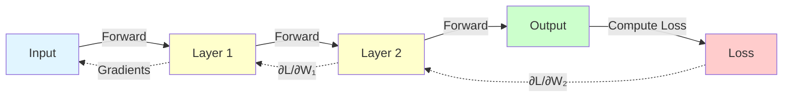

# Backpropagation

**The algorithm that teaches neural networks to learn from mistakes.** Backpropagation efficiently computes gradients by flowing error backwards through the network.

**Difficulty:** 🔴 Advanced | **Time:** 4-5 hours | **Prerequisites:** Calculus (Chain Rule), Linear Algebra, [Neural Networks Basics](neural-networks-basics.md)

---

## Overview

Backpropagation (backward propagation of errors) is an algorithm for efficiently computing gradients of the loss function with respect to all weights in a neural network. It applies the chain rule recursively, propagating error signals backward from output to input layers.

**Use cases:** Training all feedforward neural networks, the workhorse of deep learning optimization

---

## Intuition 💡

### The Big Idea

Imagine you're learning to throw darts. After each throw:
1. **Forward:** Throw dart (make prediction)
2. **Measure Error:** See how far you missed (compute loss)
3. **Backward:** Analyze what went wrong - was it your arm angle? Release timing? Force?
4. **Adjust:** Update your technique based on analysis (update weights)

Backpropagation does step 3: it figures out **how much each parameter contributed to the error**.



### Real-World Analogy

Think of a relay race where the team loses:
- **Forward:** Each runner passes the baton (activations flow forward)
- **Loss:** Team finishes last by 5 seconds
- **Backward:** Coach analyzes each runner's contribution:
  - Runner 4 was 0.5s slow (∂L/∂runner₄ = 0.5)
  - Runner 3 was 1.2s slow (∂L/∂runner₃ = 1.2)
  - Runner 2 was 2.0s slow (∂L/∂runner₂ = 2.0)
  - Runner 1 was 1.3s slow (∂L/∂runner₁ = 1.3)
- **Update:** Each runner practices specifically on their weakness

### Why It's Clever

**Naive approach:** Compute $\frac{\partial L}{\partial w_i}$ independently for each weight
- Time: $O(n \cdot m)$ where $n$ = weights, $m$ = samples
- Impractical for millions of weights!

**Backpropagation:** Reuse intermediate computations using chain rule
- Time: $O(n)$ - same order as forward pass!
- Makes deep learning feasible

---

## When to Use ✅ / When to Avoid ❌

### ✅ Good For

| Scenario | Why It Works |
|----------|--------------|
| **Feedforward networks** | Designed for layered architectures |
| **Differentiable models** | Requires smooth loss and activation functions |
| **Supervised learning** | Need clear error signal from labels |
| **Gradient-based optimization** | Provides exact gradients efficiently |
| **Deep networks** | Scales to thousands of layers (with care) |

**Examples:**
- Training CNNs for image classification
- Training RNNs for language modeling
- Training transformers for NLP
- Any neural network training!

### ❌ Not Good For

| Scenario | Why It Fails |
|----------|--------------|
| **Non-differentiable operations** | Can't compute gradients through discrete steps |
| **Very deep networks** | Vanishing/exploding gradients (needs techniques like residual connections) |
| **Graphs with cycles** | Feedforward assumption breaks (use BPTT for RNNs) |
| **Black-box functions** | Need analytical derivatives |

**When to use instead:**
- Non-differentiable: Reinforcement learning (REINFORCE), evolutionary algorithms
- Very deep: Residual networks, gradient clipping, careful initialization

---

## Mathematical Foundation

### The Chain Rule

The foundation of backpropagation:

$$\frac{\partial L}{\partial w} = \frac{\partial L}{\partial a} \cdot \frac{\partial a}{\partial z} \cdot \frac{\partial z}{\partial w}$$

Where:
- $L$ = loss
- $a$ = activation output
- $z$ = pre-activation (weighted sum)
- $w$ = weight

### Forward Pass

For layer $l$:

$$\mathbf{z}^{[l]} = \mathbf{W}^{[l]} \mathbf{a}^{[l-1]} + \mathbf{b}^{[l]}$$
$$\mathbf{a}^{[l]} = g^{[l]}(\mathbf{z}^{[l]})$$

Where $g$ is the activation function.

### Backward Pass

**Output Layer Gradient:**

$$\frac{\partial L}{\partial \mathbf{z}^{[L]}} = \frac{\partial L}{\partial \mathbf{a}^{[L]}} \odot g'^{[L]}(\mathbf{z}^{[L]})$$

For cross-entropy + softmax: $\frac{\partial L}{\partial \mathbf{z}^{[L]}} = \mathbf{a}^{[L]} - \mathbf{y}$ (simplified!)

**Hidden Layer Gradient:**

$$\frac{\partial L}{\partial \mathbf{z}^{[l]}} = \left(\mathbf{W}^{[l+1]T} \frac{\partial L}{\partial \mathbf{z}^{[l+1]}}\right) \odot g'^{[l]}(\mathbf{z}^{[l]})$$

**Weight Gradient:**

$$\frac{\partial L}{\partial \mathbf{W}^{[l]}} = \frac{1}{m} \frac{\partial L}{\partial \mathbf{z}^{[l]}} \mathbf{a}^{[l-1]T}$$

**Bias Gradient:**

$$\frac{\partial L}{\partial \mathbf{b}^{[l]}} = \frac{1}{m} \sum_{i=1}^{m} \frac{\partial L}{\partial \mathbf{z}^{[l]}}$$

### Computational Graph

```mermaid
graph TD
    X[Input x] --> W[Weights W]
    W --> Z[z = Wx + b]
    B[Bias b] --> Z
    Z --> A[a = σ(z)]
    A --> L[Loss L]
    Y[True Label y] --> L

    L -.->|∂L/∂a| A
    A -.->|∂a/∂z = σ'(z)| Z
    Z -.->|∂z/∂W = x| W
    Z -.->|∂z/∂b = 1| B

    style X fill:#e1f5ff
    style Y fill:#e1f5ff
    style L fill:#ffcccc
    style W fill:#ffffcc
    style B fill:#ffffcc
```

---

## Algorithm

### Step-by-Step Process

```
Input: Training data (X, y), network parameters (W, b)
Output: Gradients (dW, db)

1. FORWARD PASS:
   For each layer l from 1 to L:
       z[l] = W[l] @ a[l-1] + b[l]
       a[l] = activation(z[l])

2. COMPUTE LOSS:
   L = loss_function(a[L], y)

3. BACKWARD PASS:
   # Output layer
   dz[L] = a[L] - y  (for softmax + cross-entropy)

   # Hidden layers (from L-1 to 1)
   For each layer l from L-1 to 1:
       dz[l] = (W[l+1].T @ dz[l+1]) * activation'(z[l])

4. COMPUTE GRADIENTS:
   For each layer l from 1 to L:
       dW[l] = (1/m) * dz[l] @ a[l-1].T
       db[l] = (1/m) * sum(dz[l])

5. UPDATE PARAMETERS:
   For each layer l:
       W[l] = W[l] - learning_rate * dW[l]
       b[l] = b[l] - learning_rate * db[l]
```

### Example Trace

For a simple 2-layer network with 2-2-1 architecture:

```
Given:
  Input: x = [1, 2]
  Weights: W₁ = [[0.1, 0.2], [0.3, 0.4]], W₂ = [[0.5, 0.6]]
  Biases: b₁ = [0, 0], b₂ = [0]
  True label: y = 1
  Activation: Sigmoid

FORWARD PASS:
─────────────
Layer 1:
  z₁ = W₁x + b₁ = [[0.1, 0.2], [0.3, 0.4]] @ [1, 2] = [0.5, 1.1]
  a₁ = σ(z₁) = [0.622, 0.750]

Layer 2 (Output):
  z₂ = W₂a₁ + b₂ = [[0.5, 0.6]] @ [0.622, 0.750] = [0.761]
  a₂ = σ(z₂) = [0.682]

LOSS:
─────
  L = (a₂ - y)² = (0.682 - 1)² = 0.101

BACKWARD PASS:
─────────────
Output Layer:
  dz₂ = (a₂ - y) * σ'(z₂)
      = (0.682 - 1) * 0.682 * (1 - 0.682)
      = -0.318 * 0.217 = -0.069

Hidden Layer:
  da₁ = W₂ᵀ @ dz₂ = [[0.5], [0.6]] @ [-0.069] = [-0.035, -0.041]
  dz₁ = da₁ * σ'(z₁)
      = [-0.035, -0.041] * [0.235, 0.188]
      = [-0.008, -0.008]

GRADIENTS:
──────────
  dW₂ = dz₂ @ a₁ᵀ = [-0.069] @ [0.622, 0.750] = [-0.043, -0.052]
  db₂ = dz₂ = [-0.069]

  dW₁ = dz₁ @ xᵀ = [[-0.008], [-0.008]] @ [1, 2]
      = [[-0.008, -0.016], [-0.008, -0.016]]
  db₁ = dz₁ = [-0.008, -0.008]

UPDATE (learning_rate = 0.1):
──────────────────────────────
  W₂ = W₂ - 0.1 * dW₂ = [0.5, 0.6] - 0.1*[-0.043, -0.052]
     = [0.504, 0.605]

  W₁ = W₁ - 0.1 * dW₁ = [[0.101, 0.202], [0.301, 0.402]]
```

---

## Implementation

### From Scratch with NumPy

```python
import numpy as np
import matplotlib.pyplot as plt

class NeuralNetworkBackprop:
    """Neural network with detailed backpropagation"""

    def __init__(self, layer_sizes, learning_rate=0.01):
        """
        Args:
            layer_sizes: List of layer sizes [input, hidden1, hidden2, ..., output]
            learning_rate: Learning rate for gradient descent
        """
        self.layer_sizes = layer_sizes
        self.lr = learning_rate
        self.num_layers = len(layer_sizes)

        # Initialize parameters
        self.parameters = {}
        for l in range(1, self.num_layers):
            self.parameters[f'W{l}'] = np.random.randn(
                layer_sizes[l], layer_sizes[l-1]
            ) * np.sqrt(2.0 / layer_sizes[l-1])  # He initialization
            self.parameters[f'b{l}'] = np.zeros((layer_sizes[l], 1))

        # Cache for storing intermediate values
        self.cache = {}
        self.gradients = {}

    def sigmoid(self, Z):
        """Sigmoid activation"""
        return 1 / (1 + np.exp(-np.clip(Z, -500, 500)))

    def sigmoid_derivative(self, A):
        """Derivative of sigmoid"""
        return A * (1 - A)

    def relu(self, Z):
        """ReLU activation"""
        return np.maximum(0, Z)

    def relu_derivative(self, Z):
        """Derivative of ReLU"""
        return (Z > 0).astype(float)

    def forward_propagation(self, X):
        """
        Forward pass through network

        Args:
            X: Input data (features x samples)

        Returns:
            AL: Output activations
        """
        A = X
        self.cache['A0'] = X

        # Forward through hidden layers
        for l in range(1, self.num_layers - 1):
            Z = np.dot(self.parameters[f'W{l}'], A) + self.parameters[f'b{l}']
            A = self.relu(Z)

            self.cache[f'Z{l}'] = Z
            self.cache[f'A{l}'] = A

        # Output layer (sigmoid for binary classification)
        L = self.num_layers - 1
        Z = np.dot(self.parameters[f'W{L}'], A) + self.parameters[f'b{L}']
        AL = self.sigmoid(Z)

        self.cache[f'Z{L}'] = Z
        self.cache[f'A{L}'] = AL

        return AL

    def compute_cost(self, AL, Y):
        """Binary cross-entropy loss"""
        m = Y.shape[1]
        cost = -np.mean(Y * np.log(AL + 1e-8) + (1 - Y) * np.log(1 - AL + 1e-8))
        return cost

    def backward_propagation(self, Y):
        """
        Backward pass - compute all gradients

        Args:
            Y: True labels (1 x samples)
        """
        m = Y.shape[1]
        L = self.num_layers - 1

        # Output layer gradient (simplified for sigmoid + cross-entropy)
        dZ = self.cache[f'A{L}'] - Y
        self.gradients[f'dW{L}'] = (1/m) * np.dot(dZ, self.cache[f'A{L-1}'].T)
        self.gradients[f'db{L}'] = (1/m) * np.sum(dZ, axis=1, keepdims=True)

        # Backward through hidden layers
        for l in reversed(range(1, L)):
            # Propagate gradient to previous layer
            dA = np.dot(self.parameters[f'W{l+1}'].T, dZ)

            # Apply activation derivative
            dZ = dA * self.relu_derivative(self.cache[f'Z{l}'])

            # Compute weight and bias gradients
            self.gradients[f'dW{l}'] = (1/m) * np.dot(dZ, self.cache[f'A{l-1}'].T)
            self.gradients[f'db{l}'] = (1/m) * np.sum(dZ, axis=1, keepdims=True)

    def update_parameters(self):
        """Update all parameters using computed gradients"""
        for l in range(1, self.num_layers):
            self.parameters[f'W{l}'] -= self.lr * self.gradients[f'dW{l}']
            self.parameters[f'b{l}'] -= self.lr * self.gradients[f'db{l}']

    def train(self, X, Y, epochs=1000, print_cost=True):
        """
        Train the network

        Args:
            X: Training data (features x samples)
            Y: Training labels (1 x samples)
            epochs: Number of training iterations
            print_cost: Print loss every 100 epochs
        """
        costs = []

        for epoch in range(epochs):
            # Forward propagation
            AL = self.forward_propagation(X)

            # Compute cost
            cost = self.compute_cost(AL, Y)
            costs.append(cost)

            # Backward propagation
            self.backward_propagation(Y)

            # Update parameters
            self.update_parameters()

            # Print progress
            if print_cost and epoch % 100 == 0:
                print(f"Epoch {epoch}: Cost = {cost:.4f}")

        return costs

    def predict(self, X):
        """Make predictions"""
        AL = self.forward_propagation(X)
        return (AL > 0.5).astype(int)

# Example: Train on XOR problem
print("=" * 60)
print("Backpropagation from Scratch - XOR Problem")
print("=" * 60)

# XOR dataset
X = np.array([[0, 0, 1, 1],
              [0, 1, 0, 1]])
Y = np.array([[0, 1, 1, 0]])

# Create network: 2 inputs, 4 hidden, 1 output
nn = NeuralNetworkBackprop([2, 4, 1], learning_rate=0.5)

# Train
costs = nn.train(X, Y, epochs=1000, print_cost=True)

# Test
predictions = nn.predict(X)
print("\nResults:")
print("Input  | Target | Predicted")
print("-" * 35)
for i in range(X.shape[1]):
    print(f"{X[:, i]} |   {Y[0, i]}    |     {predictions[0, i]}")

# Plot cost curve
plt.figure(figsize=(10, 6))
plt.plot(costs)
plt.xlabel('Epoch')
plt.ylabel('Cost')
plt.title('Training Cost Over Time')
plt.grid(True)
plt.show()
```

### Gradient Checking

Verify backpropagation implementation is correct:

```python
def gradient_check(nn, X, Y, epsilon=1e-7):
    """
    Verify backpropagation gradients using numerical approximation

    Args:
        nn: Neural network instance
        X: Input data
        Y: True labels
        epsilon: Small value for numerical gradient
    """
    # Forward and backward pass
    nn.forward_propagation(X)
    nn.compute_cost(nn.cache[f'A{nn.num_layers-1}'], Y)
    nn.backward_propagation(Y)

    # Check each parameter
    for l in range(1, nn.num_layers):
        # Check weights
        W = nn.parameters[f'W{l}']
        dW_backprop = nn.gradients[f'dW{l}']
        dW_numerical = np.zeros_like(W)

        # Compute numerical gradient
        for i in range(W.shape[0]):
            for j in range(W.shape[1]):
                # Perturb weight
                W[i, j] += epsilon
                AL_plus = nn.forward_propagation(X)
                cost_plus = nn.compute_cost(AL_plus, Y)

                W[i, j] -= 2 * epsilon
                AL_minus = nn.forward_propagation(X)
                cost_minus = nn.compute_cost(AL_minus, Y)

                # Restore weight
                W[i, j] += epsilon

                # Numerical gradient
                dW_numerical[i, j] = (cost_plus - cost_minus) / (2 * epsilon)

        # Compare
        difference = np.linalg.norm(dW_backprop - dW_numerical) / (
            np.linalg.norm(dW_backprop) + np.linalg.norm(dW_numerical)
        )

        print(f"Layer {l} - W gradient difference: {difference:.2e}")
        if difference < 1e-7:
            print("✓ Gradient check passed!")
        else:
            print("✗ Gradient check failed!")

# Run gradient check
print("\n" + "=" * 60)
print("Gradient Checking")
print("=" * 60)
gradient_check(nn, X, Y)
```

---

## Visualization

### Computational Graph Visualization

```python
import matplotlib.pyplot as plt
import matplotlib.patches as mpatches
from matplotlib.patches import FancyBboxPatch, FancyArrowPatch

def visualize_backprop():
    """Visualize forward and backward pass"""
    fig, (ax1, ax2) = plt.subplots(1, 2, figsize=(16, 6))

    # Forward pass
    ax1.set_xlim(0, 10)
    ax1.set_ylim(0, 10)
    ax1.axis('off')
    ax1.set_title('Forward Propagation', fontsize=16, fontweight='bold')

    # Nodes
    nodes = [
        (1, 5, 'x', 'lightblue'),
        (3, 5, 'Wx+b', 'lightyellow'),
        (5, 5, 'σ(z)', 'lightyellow'),
        (7, 5, 'L(a,y)', 'lightcoral'),
        (1, 3, 'W', 'lightgray'),
        (3, 3, 'b', 'lightgray')
    ]

    for x, y, label, color in nodes:
        box = FancyBboxPatch((x-0.4, y-0.3), 0.8, 0.6,
                             boxstyle="round,pad=0.1",
                             facecolor=color, edgecolor='black', linewidth=2)
        ax1.add_patch(box)
        ax1.text(x, y, label, ha='center', va='center',
                fontsize=12, fontweight='bold')

    # Arrows
    arrows = [
        (1.4, 5, 2.6, 5),
        (3.4, 5, 4.6, 5),
        (5.4, 5, 6.6, 5),
        (1.4, 3.2, 2.6, 4.8),
        (3.4, 3.2, 2.6, 4.8),
        (1, 7, 1, 5.6, 'Input'),
        (7, 7, 7, 5.6, 'Loss')
    ]

    for *coords, label in [(a[0], a[1], a[2], a[3], '') for a in arrows[:6]]:
        ax1.arrow(coords[0], coords[1],
                 coords[2] - coords[0], coords[3] - coords[1],
                 head_width=0.2, head_length=0.15,
                 fc='black', ec='black', linewidth=1.5)

    # Backward pass
    ax2.set_xlim(0, 10)
    ax2.set_ylim(0, 10)
    ax2.axis('off')
    ax2.set_title('Backward Propagation (Gradients)', fontsize=16, fontweight='bold')

    # Same nodes
    for x, y, label, color in nodes:
        box = FancyBboxPatch((x-0.4, y-0.3), 0.8, 0.6,
                             boxstyle="round,pad=0.1",
                             facecolor=color, edgecolor='black', linewidth=2)
        ax2.add_patch(box)
        ax2.text(x, y, label, ha='center', va='center',
                fontsize=12, fontweight='bold')

    # Gradient arrows (backward)
    back_arrows = [
        (6.6, 5, 5.4, 5, '∂L/∂a'),
        (4.6, 5, 3.4, 5, '∂L/∂z'),
        (2.6, 5, 1.4, 5, '∂L/∂x'),
        (2.6, 4.8, 1.4, 3.2, '∂L/∂W'),
        (2.8, 4.8, 3.4, 3.2, '∂L/∂b'),
    ]

    for x1, y1, x2, y2, label in back_arrows:
        ax2.arrow(x1, y1, x2 - x1, y2 - y1,
                 head_width=0.2, head_length=0.15,
                 fc='red', ec='red', linewidth=2,
                 linestyle='--')
        # Add label
        mid_x, mid_y = (x1 + x2) / 2, (y1 + y2) / 2
        ax2.text(mid_x, mid_y + 0.3, label,
                fontsize=10, color='red', fontweight='bold')

    plt.tight_layout()
    plt.show()

visualize_backprop()
```

---

## Complexity Analysis

### Time Complexity

**Forward Pass:** $O(W)$ where $W = \sum_{l=1}^{L-1} n_l \cdot n_{l+1}$
- Each weight used once

**Backward Pass:** $O(W)$ - same as forward!
- Each weight's gradient computed once using chain rule

**Total per Iteration:** $O(W)$ - highly efficient!

**Naive Approach:** $O(W^2)$ - compute each gradient independently

**Why Backprop is Efficient:**
```
Network: 784 → 128 → 10
Weights: 784*128 + 128*10 = 101,632

Naive: 101,632² = 10.3 billion operations
Backprop: 2 * 101,632 = 203,264 operations

Speedup: 50,000x faster! 🚀
```

### Space Complexity

**Storage:** $O(L \cdot B)$
- $L$ = number of layers
- $B$ = batch size
- Need to store activations for each layer (for backward pass)

**Trade-off:** Can checkpoint activations and recompute during backward (reduces memory, increases compute)

---

## Common Pitfalls

### 1. Vanishing Gradients

!!! warning "Gradients Shrink Exponentially"
    **Problem:** In deep networks, gradients become tiny in early layers.

    **Math:** Gradient flows as: $\frac{\partial L}{\partial W^{[1]}} \propto \prod_{l=1}^{L} \frac{\partial a^{[l]}}{\partial z^{[l]}}$

    If each derivative < 1 (e.g., sigmoid), product vanishes!

    **Solutions:**
    - Use ReLU (derivative = 1 for z > 0)
    - Batch normalization
    - Residual connections (skip connections)
    - Careful initialization (Xavier/He)

    ```python
    # Check gradient magnitudes
    for l, grad in enumerate(nn.gradients.values()):
        print(f"Layer {l} gradient norm: {np.linalg.norm(grad):.6f}")
    ```

### 2. Exploding Gradients

!!! warning "Gradients Grow Exponentially"
    **Problem:** Gradients become huge, causing NaN/Inf values.

    **Symptoms:** Loss becomes NaN, weights explode

    **Solutions:**
    - Gradient clipping
    - Lower learning rate
    - Better weight initialization
    - Batch normalization

    ```python
    # Gradient clipping
    max_norm = 5.0
    for key in nn.gradients:
        norm = np.linalg.norm(nn.gradients[key])
        if norm > max_norm:
            nn.gradients[key] = nn.gradients[key] * (max_norm / norm)
    ```

### 3. Forgetting to Cache Activations

!!! warning "Missing Intermediate Values"
    **Problem:** Need forward pass values for backward pass.

    **Solution:** Always cache Z and A during forward propagation

    ```python
    # ❌ Wrong - no caching
    def forward(self, X):
        Z = np.dot(W, X) + b
        return sigmoid(Z)  # Lost Z!

    # ✅ Correct - cache values
    def forward(self, X):
        Z = np.dot(W, X) + b
        A = sigmoid(Z)
        self.cache['Z'] = Z  # Save for backward pass
        self.cache['A'] = A
        return A
    ```

### 4. Wrong Matrix Dimensions

!!! warning "Dimension Mismatch"
    **Problem:** Matrix multiplication requires compatible shapes.

    **Tip:** Always verify dimensions!

    ```python
    # Dimension check template
    # Forward: Z = W @ A_prev + b
    #   W: (n[l], n[l-1])
    #   A_prev: (n[l-1], m)
    #   Z: (n[l], m)

    # Backward: dW = dZ @ A_prev.T
    #   dZ: (n[l], m)
    #   A_prev: (n[l-1], m)
    #   dW: (n[l], n[l-1])  ✓
    ```

---

## Practice Problems

### 🟢 Beginner

!!! example "Problem 1: Single Neuron Backprop"
    Implement backpropagation for a single neuron with sigmoid activation.
    - Input: x = [1, 2], y = 1
    - Compute forward pass, loss, backward pass manually

!!! example "Problem 2: Gradient Verification"
    Implement numerical gradient checking for a 2-layer network.
    - Compare analytical gradients (backprop) with numerical gradients
    - Ensure difference < 1e-7

### 🟡 Intermediate

!!! example "Problem 3: Multi-layer Backprop"
    Implement backpropagation for a 3-layer network [10, 20, 10, 1].
    - Use ReLU for hidden layers
    - Visualize gradient magnitudes per layer
    - Detect vanishing/exploding gradients

!!! example "Problem 4: Custom Activation Derivative"
    Implement backprop with custom activation: $f(x) = x \cdot \text{tanh}(x)$
    - Derive the gradient analytically
    - Implement forward and backward pass
    - Verify with gradient checking

### 🔴 Advanced

!!! example "Problem 5: Memory-Efficient Backprop"
    Implement gradient checkpointing:
    - Don't store all intermediate activations
    - Recompute activations during backward pass
    - Measure memory savings vs. time cost

!!! example "Problem 6: Backprop with Batch Normalization"
    Extend backpropagation to handle batch normalization layers.
    - Forward: normalize, scale, shift
    - Backward: compute gradients w.r.t. γ, β, and inputs
    - Handle train vs. eval mode

---

## Related Topics

- [Neural Networks Basics](neural-networks-basics.md) - Foundation
- [Activation Functions](activation-functions.md) - Non-linearities and their derivatives
- [Gradient Descent](../optimization/gradient-descent.md) - Using gradients to update weights
- [Batch Normalization](../optimization/batch-normalization.md) - Stabilizing gradient flow
- [RNN](rnn.md) - Backpropagation Through Time (BPTT)
- [CNN](cnn.md) - Backprop with convolutions

---

## References

1. **Original Paper:** [Rumelhart, Hinton & Williams (1986)](https://www.nature.com/articles/323533a0)
2. **Tutorial:** [Yes You Should Understand Backprop](https://karpathy.medium.com/yes-you-should-understand-backprop-e2f06eab496b) by Andrej Karpathy
3. **Book:** Deep Learning (Goodfellow et al.) - Chapter 6.5
4. **Video:** [3Blue1Brown - Backpropagation Calculus](https://www.youtube.com/watch?v=tIeHLnjs5U8)
5. **Interactive:** [TensorFlow Playground](https://playground.tensorflow.org/)
6. **Course:** [Stanford CS231n - Backpropagation](http://cs231n.stanford.edu/slides/2017/cs231n_2017_lecture4.pdf)

---

**Next Steps:**
- Understand [Optimization](../optimization/index.md) algorithms that use these gradients
- Learn about [Batch Normalization](../optimization/batch-normalization.md) to improve gradient flow
- Explore [CNN](cnn.md) and [RNN](rnn.md) architectures and their backprop variants

**Ready to master backpropagation?** Implement it from scratch! 🎓
