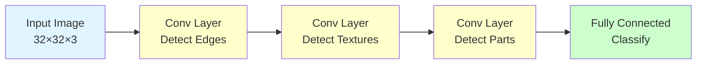
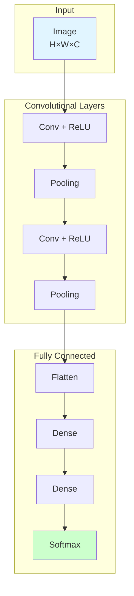

# Convolutional Neural Networks (CNN)

**Master the architecture that revolutionized computer vision.** CNNs automatically learn spatial hierarchies of features from images through convolutional layers.

**Difficulty:** 🔴 Advanced | **Time:** 5-6 hours | **Prerequisites:** [Neural Networks Basics](neural-networks-basics.md), [Backpropagation](backpropagation.md)

---

## Overview

Convolutional Neural Networks (CNNs) are specialized neural networks designed for processing grid-like data such as images. They use convolution operations to automatically learn spatial hierarchies of features, from simple edges to complex objects, while maintaining spatial relationships and reducing the number of parameters.

**Use cases:** Image classification, object detection, facial recognition, medical image analysis, video processing, self-driving cars

---

## Intuition 💡

### The Big Idea

Regular neural networks treat images as flat vectors, losing spatial structure. CNNs preserve spatial relationships by applying **filters** (small windows) that slide across the image, detecting patterns like edges, textures, and eventually complex shapes.



### Real-World Analogy

Imagine looking at a "Where's Waldo" picture:
- **Layer 1:** Eyes scan for red-and-white patterns (edges/colors)
- **Layer 2:** Combine patterns into stripes (textures)
- **Layer 3:** Recognize striped shirt (parts)
- **Layer 4:** Find whole person with hat and glasses (object)

Each layer builds on the previous, from simple → complex features!

### Why CNNs Work

**Problems with Fully Connected Networks for Images:**
```
32×32 RGB image = 3,072 inputs
First hidden layer (100 neurons) = 307,200 weights!
- Too many parameters → overfitting
- Ignores spatial structure
- Not translation invariant
```

**CNN Solutions:**
- **Local Connectivity:** Each neuron connects to small region
- **Parameter Sharing:** Same filter used across entire image
- **Spatial Hierarchy:** Learn features at multiple scales

---

## Architecture

### Key Components



### 1. Convolutional Layer

**Operation:** Slide filter over input, compute dot product

```
Filter (3×3):        Input patch:        Output:
[1  0 -1]            [100 50  0]
[1  0 -1]      ×     [150 75 25]    =   -125
[1  0 -1]            [200 100 50]
```

**Math:**

$$Z[i,j,k] = \sum_{f=0}^{F-1} \sum_{a=0}^{F-1} \sum_{c=0}^{C-1} X[i+f, j+a, c] \cdot W[f, a, c, k] + b[k]$$

Where:
- $X$ = input (height × width × channels)
- $W$ = filter weights
- $F$ = filter size
- $k$ = filter index
- $b$ = bias

**Purpose:** Extract local features (edges, textures, patterns)

### 2. Activation (ReLU)

Apply non-linearity element-wise:

$$A[i,j,k] = \max(0, Z[i,j,k])$$

**Purpose:** Enable learning of non-linear patterns

### 3. Pooling Layer

**Max Pooling:** Take maximum value in each region

```
Input (4×4):         Output (2×2):
[1  3  2  4]         [3  4]
[5  6  7  8]    →    [9  10]
[9  2  1  3]
[4  5  6  10]
```

**Average Pooling:** Take average value

**Purpose:**
- Reduce spatial dimensions (↓ computation)
- Achieve translation invariance
- Control overfitting

### 4. Fully Connected Layer

Flatten feature maps and connect to dense layers:

```
Feature maps → Flatten → [Dense] → [Dense] → Output
(7×7×64)        (3136)      (128)     (64)     (10)
```

**Purpose:** Combine features for final classification

---

## When to Use ✅ / When to Avoid ❌

### ✅ Good For

| Scenario | Why It Works |
|----------|--------------|
| **Image data** | Preserves spatial structure, translation invariant |
| **Pattern recognition** | Automatically learns hierarchical features |
| **Large images** | Parameter sharing reduces memory vs fully connected |
| **Translation invariance** | Same object recognized anywhere in image |
| **Spatial hierarchies** | Edges → textures → parts → objects |

**Examples:**
- Image classification (cats vs dogs)
- Object detection (YOLO, Faster R-CNN)
- Face recognition
- Medical image analysis (X-rays, MRIs)
- Self-driving cars (road scene understanding)

### ❌ Not Good For

| Scenario | Why It Fails |
|----------|--------------|
| **Tabular data** | No spatial structure to exploit |
| **Small datasets** | Many parameters → overfitting |
| **Variable input sizes** | Need fixed size (or workarounds) |
| **Non-spatial data** | Doesn't make sense for time series (use RNN) |
| **Interpretability** | Black box - hard to explain decisions |

**When to use instead:**
- Tabular: Decision Trees, XGBoost, Linear Models
- Sequential: RNN, LSTM, Transformers
- Small data: Transfer learning with pretrained CNNs

---

## Mathematical Foundation

### Convolution Operation

**1D Convolution:**

$$(f * g)[n] = \sum_{m=-\infty}^{\infty} f[m] \cdot g[n-m]$$

**2D Convolution (images):**

$$(I * K)[i,j] = \sum_{m} \sum_{n} I[i-m, j-n] \cdot K[m, n]$$

In practice, we use **cross-correlation** (no flipping):

$$(I * K)[i,j] = \sum_{m} \sum_{n} I[i+m, j+n] \cdot K[m, n]$$

### Output Dimensions

$$\text{Output Size} = \frac{\text{Input Size} - \text{Filter Size} + 2 \times \text{Padding}}{\text{Stride}} + 1$$

**Example:**
- Input: 32×32
- Filter: 5×5
- Padding: 2
- Stride: 1
- Output: $\frac{32 - 5 + 2 \times 2}{1} + 1 = 32$ ✓

### Parameter Count

**Convolutional Layer:**
- Filters: $F \times F \times C_{\text{in}} \times C_{\text{out}}$
- Biases: $C_{\text{out}}$
- Total: $F^2 \cdot C_{\text{in}} \cdot C_{\text{out}} + C_{\text{out}}$

**Example:** 64 filters of 3×3 on RGB input
- Params: $3 \times 3 \times 3 \times 64 + 64 = 1,792$

**Fully Connected Layer:**
- Params: $n_{\text{in}} \times n_{\text{out}} + n_{\text{out}}$

**Example:** 1000 → 10
- Params: $1000 \times 10 + 10 = 10,010$

**Why CNNs are efficient:** Parameter sharing dramatically reduces parameters!

---

## Implementation

### Simple CNN with Keras

```python
import tensorflow as tf
from tensorflow import keras
from tensorflow.keras import layers
import numpy as np
import matplotlib.pyplot as plt

# Load MNIST dataset
(X_train, y_train), (X_test, y_test) = keras.datasets.mnist.load_data()

# Preprocess
X_train = X_train.reshape(-1, 28, 28, 1).astype('float32') / 255.0
X_test = X_test.reshape(-1, 28, 28, 1).astype('float32') / 255.0
y_train = keras.utils.to_categorical(y_train, 10)
y_test = keras.utils.to_categorical(y_test, 10)

print(f"Training data shape: {X_train.shape}")
print(f"Test data shape: {X_test.shape}")

# Build CNN model
model = keras.Sequential([
    # First Convolutional Block
    layers.Conv2D(32, (3, 3), activation='relu', input_shape=(28, 28, 1), name='conv1'),
    layers.MaxPooling2D((2, 2), name='pool1'),

    # Second Convolutional Block
    layers.Conv2D(64, (3, 3), activation='relu', name='conv2'),
    layers.MaxPooling2D((2, 2), name='pool2'),

    # Third Convolutional Block
    layers.Conv2D(64, (3, 3), activation='relu', name='conv3'),

    # Fully Connected Layers
    layers.Flatten(name='flatten'),
    layers.Dense(64, activation='relu', name='fc1'),
    layers.Dropout(0.5, name='dropout'),
    layers.Dense(10, activation='softmax', name='output')
])

# Display architecture
print("\n" + "="*60)
print("CNN Architecture")
print("="*60)
model.summary()

# Compile
model.compile(
    optimizer='adam',
    loss='categorical_crossentropy',
    metrics=['accuracy']
)

# Train
print("\nTraining CNN...")
history = model.fit(
    X_train, y_train,
    batch_size=128,
    epochs=10,
    validation_split=0.1,
    verbose=1
)

# Evaluate
test_loss, test_acc = model.evaluate(X_test, y_test, verbose=0)
print(f"\nTest Accuracy: {test_acc:.4f}")

# Plot training history
fig, (ax1, ax2) = plt.subplots(1, 2, figsize=(14, 5))

ax1.plot(history.history['loss'], label='Training Loss')
ax1.plot(history.history['val_loss'], label='Validation Loss')
ax1.set_xlabel('Epoch')
ax1.set_ylabel('Loss')
ax1.set_title('Loss Over Time')
ax1.legend()
ax1.grid(True)

ax2.plot(history.history['accuracy'], label='Training Accuracy')
ax2.plot(history.history['val_accuracy'], label='Validation Accuracy')
ax2.set_xlabel('Epoch')
ax2.set_ylabel('Accuracy')
ax2.set_title('Accuracy Over Time')
ax2.legend()
ax2.grid(True)

plt.tight_layout()
plt.show()
```

### CNN with PyTorch

```python
import torch
import torch.nn as nn
import torch.optim as optim
from torchvision import datasets, transforms
from torch.utils.data import DataLoader

# Device configuration
device = torch.device('cuda' if torch.cuda.is_available() else 'cpu')
print(f"Using device: {device}")

# Data loading
transform = transforms.Compose([
    transforms.ToTensor(),
    transforms.Normalize((0.1307,), (0.3081,))
])

train_dataset = datasets.MNIST('./data', train=True, download=True, transform=transform)
test_dataset = datasets.MNIST('./data', train=False, transform=transform)

train_loader = DataLoader(train_dataset, batch_size=128, shuffle=True)
test_loader = DataLoader(test_dataset, batch_size=1000, shuffle=False)

# Define CNN model
class CNN(nn.Module):
    def __init__(self):
        super(CNN, self).__init__()

        # Convolutional layers
        self.conv1 = nn.Conv2d(1, 32, kernel_size=3, padding=1)
        self.conv2 = nn.Conv2d(32, 64, kernel_size=3, padding=1)
        self.conv3 = nn.Conv2d(64, 64, kernel_size=3, padding=1)

        # Pooling
        self.pool = nn.MaxPool2d(2, 2)

        # Fully connected layers
        self.fc1 = nn.Linear(64 * 3 * 3, 64)
        self.fc2 = nn.Linear(64, 10)

        # Activation and regularization
        self.relu = nn.ReLU()
        self.dropout = nn.Dropout(0.5)

    def forward(self, x):
        # Conv block 1
        x = self.relu(self.conv1(x))
        x = self.pool(x)  # 28×28 → 14×14

        # Conv block 2
        x = self.relu(self.conv2(x))
        x = self.pool(x)  # 14×14 → 7×7

        # Conv block 3
        x = self.relu(self.conv3(x))
        x = self.pool(x)  # 7×7 → 3×3

        # Flatten
        x = x.view(-1, 64 * 3 * 3)

        # Fully connected
        x = self.relu(self.fc1(x))
        x = self.dropout(x)
        x = self.fc2(x)

        return x

# Create model
model = CNN().to(device)
print(model)

# Loss and optimizer
criterion = nn.CrossEntropyLoss()
optimizer = optim.Adam(model.parameters(), lr=0.001)

# Training function
def train_epoch(model, loader, criterion, optimizer, device):
    model.train()
    running_loss = 0.0
    correct = 0
    total = 0

    for images, labels in loader:
        images, labels = images.to(device), labels.to(device)

        # Forward pass
        outputs = model(images)
        loss = criterion(outputs, labels)

        # Backward pass
        optimizer.zero_grad()
        loss.backward()
        optimizer.step()

        # Statistics
        running_loss += loss.item()
        _, predicted = outputs.max(1)
        total += labels.size(0)
        correct += predicted.eq(labels).sum().item()

    return running_loss / len(loader), 100.0 * correct / total

# Evaluation function
def evaluate(model, loader, criterion, device):
    model.eval()
    running_loss = 0.0
    correct = 0
    total = 0

    with torch.no_grad():
        for images, labels in loader:
            images, labels = images.to(device), labels.to(device)
            outputs = model(images)
            loss = criterion(outputs, labels)

            running_loss += loss.item()
            _, predicted = outputs.max(1)
            total += labels.size(0)
            correct += predicted.eq(labels).sum().item()

    return running_loss / len(loader), 100.0 * correct / total

# Train
print("\nTraining CNN...")
epochs = 10
for epoch in range(epochs):
    train_loss, train_acc = train_epoch(model, train_loader, criterion, optimizer, device)
    test_loss, test_acc = evaluate(model, test_loader, criterion, device)

    print(f"Epoch {epoch+1}/{epochs}")
    print(f"  Train Loss: {train_loss:.4f}, Train Acc: {train_acc:.2f}%")
    print(f"  Test Loss: {test_loss:.4f}, Test Acc: {test_acc:.2f}%")
```

### CNN from Scratch (Simplified)

```python
import numpy as np

class ConvLayer:
    """Simple convolutional layer"""

    def __init__(self, num_filters, filter_size, num_channels):
        self.num_filters = num_filters
        self.filter_size = filter_size
        self.num_channels = num_channels

        # Initialize filters (He initialization)
        self.filters = np.random.randn(
            num_filters, filter_size, filter_size, num_channels
        ) * np.sqrt(2.0 / (filter_size * filter_size * num_channels))

        self.biases = np.zeros(num_filters)

    def forward(self, input_data):
        """
        Forward pass

        Args:
            input_data: (height, width, channels)

        Returns:
            output: (out_height, out_width, num_filters)
        """
        self.last_input = input_data
        h, w, c = input_data.shape
        f = self.filter_size

        # Output dimensions
        out_h = h - f + 1
        out_w = w - f + 1

        # Initialize output
        output = np.zeros((out_h, out_w, self.num_filters))

        # Convolve
        for filter_idx in range(self.num_filters):
            for i in range(out_h):
                for j in range(out_w):
                    # Extract region
                    region = input_data[i:i+f, j:j+f, :]

                    # Compute convolution
                    output[i, j, filter_idx] = np.sum(
                        region * self.filters[filter_idx]
                    ) + self.biases[filter_idx]

        return output

class MaxPoolLayer:
    """Max pooling layer"""

    def __init__(self, pool_size=2):
        self.pool_size = pool_size

    def forward(self, input_data):
        """
        Forward pass

        Args:
            input_data: (height, width, channels)

        Returns:
            output: (out_height, out_width, channels)
        """
        self.last_input = input_data
        h, w, c = input_data.shape
        p = self.pool_size

        # Output dimensions
        out_h = h // p
        out_w = w // p

        # Initialize output
        output = np.zeros((out_h, out_w, c))

        # Pool
        for i in range(out_h):
            for j in range(out_w):
                # Extract region
                region = input_data[i*p:(i+1)*p, j*p:(j+1)*p, :]

                # Take maximum
                output[i, j, :] = np.max(region, axis=(0, 1))

        return output

# Example usage
print("\n" + "="*60)
print("CNN from Scratch - Simple Forward Pass")
print("="*60)

# Create a simple image
image = np.random.randn(28, 28, 1)
print(f"Input shape: {image.shape}")

# Convolutional layer
conv = ConvLayer(num_filters=8, filter_size=3, num_channels=1)
conv_output = conv.forward(image)
print(f"After Conv: {conv_output.shape}")

# Max pooling
pool = MaxPoolLayer(pool_size=2)
pool_output = pool.forward(conv_output)
print(f"After Pooling: {pool_output.shape}")
```

---

## Visualization

### Filter Visualization

```python
# Visualize learned filters
def visualize_filters(model, layer_name='conv1'):
    """Visualize convolutional filters"""
    # Get layer
    layer = model.get_layer(layer_name)
    filters, biases = layer.get_weights()

    # Normalize filters
    f_min, f_max = filters.min(), filters.max()
    filters = (filters - f_min) / (f_max - f_min)

    # Plot
    n_filters = min(filters.shape[3], 32)  # Show first 32 filters
    fig, axes = plt.subplots(4, 8, figsize=(16, 8))

    for i, ax in enumerate(axes.flat):
        if i < n_filters:
            # Get the filter
            filter_img = filters[:, :, 0, i]
            ax.imshow(filter_img, cmap='viridis')
            ax.set_title(f'Filter {i+1}')
        ax.axis('off')

    plt.suptitle(f'Learned Filters from {layer_name}', fontsize=16)
    plt.tight_layout()
    plt.show()

visualize_filters(model, 'conv1')
```

### Feature Map Visualization

```python
# Visualize feature maps (activations)
def visualize_feature_maps(model, image, layer_names):
    """Visualize intermediate feature maps"""
    # Create model that outputs intermediate layers
    outputs = [model.get_layer(name).output for name in layer_names]
    vis_model = keras.Model(inputs=model.input, outputs=outputs)

    # Get activations
    activations = vis_model.predict(image[np.newaxis, :, :, :])

    # Plot
    for layer_name, activation in zip(layer_names, activations):
        n_features = min(activation.shape[-1], 16)
        fig, axes = plt.subplots(2, 8, figsize=(16, 4))

        for i, ax in enumerate(axes.flat):
            if i < n_features:
                ax.imshow(activation[0, :, :, i], cmap='viridis')
                ax.set_title(f'Channel {i+1}')
            ax.axis('off')

        plt.suptitle(f'Feature Maps from {layer_name}', fontsize=14)
        plt.tight_layout()
        plt.show()

# Visualize for a test image
test_image = X_test[0]
visualize_feature_maps(model, test_image, ['conv1', 'conv2', 'conv3'])
```

### Architecture Visualization

```python
from tensorflow.keras.utils import plot_model

# Visualize model architecture
plot_model(
    model,
    to_file='cnn_architecture.png',
    show_shapes=True,
    show_layer_names=True,
    rankdir='TB',  # Top to bottom
    dpi=150
)
```

---

## Famous CNN Architectures

### 1. LeNet-5 (1998)

**First successful CNN for digit recognition**

```python
model = keras.Sequential([
    layers.Conv2D(6, (5, 5), activation='tanh', input_shape=(32, 32, 1)),
    layers.AveragePooling2D((2, 2)),
    layers.Conv2D(16, (5, 5), activation='tanh'),
    layers.AveragePooling2D((2, 2)),
    layers.Flatten(),
    layers.Dense(120, activation='tanh'),
    layers.Dense(84, activation='tanh'),
    layers.Dense(10, activation='softmax')
])
```

### 2. AlexNet (2012)

**Won ImageNet 2012, started deep learning revolution**
- 8 layers (5 conv + 3 FC)
- ReLU activation (first major use)
- Dropout for regularization
- GPU acceleration

### 3. VGGNet (2014)

**Very deep with small filters**
- 16-19 layers
- Only 3×3 filters
- Stacked convolutions

```python
# VGG-like block
def vgg_block(x, filters, n_convs):
    for _ in range(n_convs):
        x = layers.Conv2D(filters, (3, 3), activation='relu', padding='same')(x)
    x = layers.MaxPooling2D((2, 2))(x)
    return x
```

### 4. ResNet (2015)

**Residual connections enable very deep networks (152+ layers)**

```python
# Residual block
def residual_block(x, filters):
    shortcut = x
    x = layers.Conv2D(filters, (3, 3), activation='relu', padding='same')(x)
    x = layers.Conv2D(filters, (3, 3), padding='same')(x)
    x = layers.Add()([x, shortcut])
    x = layers.Activation('relu')(x)
    return x
```

**Key Innovation:** Skip connections solve vanishing gradient problem

$$\mathbf{y} = F(\mathbf{x}) + \mathbf{x}$$

---

## Hyperparameters

| Parameter | What It Does | Typical Values | Tips |
|-----------|--------------|----------------|------|
| **Filter Size** | Receptive field | 3×3, 5×5, 7×7 | Smaller filters → deeper networks |
| **Number of Filters** | Feature maps | 32, 64, 128, 256 | Increase with depth |
| **Stride** | Step size | 1 or 2 | Larger stride → smaller output |
| **Padding** | Boundary handling | 'same' or 'valid' | 'same' preserves size |
| **Pool Size** | Downsampling factor | 2×2 or 3×3 | 2×2 most common |
| **Learning Rate** | Optimization step | 0.001 - 0.01 | Use scheduler or Adam |
| **Batch Size** | Samples per update | 32, 64, 128 | Larger = more stable, needs more memory |

---

## Complexity Analysis

### Time Complexity

**Convolutional Layer:**
- Per output: $O(F^2 \cdot C_{\text{in}})$
- Total: $O(F^2 \cdot C_{\text{in}} \cdot C_{\text{out}} \cdot H_{\text{out}} \cdot W_{\text{out}})$

**Fully Connected Layer:**
- $O(n_{\text{in}} \cdot n_{\text{out}})$

**Example:** Conv(3×3, 64→128, 28×28 output)
- Operations: $3^2 \times 64 \times 128 \times 28 \times 28 = 460M$ operations

### Space Complexity

**Parameters:**
- Conv layers: Few parameters (parameter sharing)
- FC layers: Most parameters (no sharing)

**Activations:** Need to store for backpropagation
- Memory: $O(B \cdot H \cdot W \cdot C \cdot L)$
- $B$ = batch size, $L$ = number of layers

**Typical CNN:** 90% parameters in FC layers, 90% computation in Conv layers!

---

## Common Pitfalls

### 1. Not Using Padding

!!! warning "Feature Map Shrinking"
    **Problem:** Without padding, feature maps shrink rapidly.

    ```python
    # ❌ No padding - shrinks fast
    # 28×28 → 26×26 → 24×24 → 22×22...
    model.add(layers.Conv2D(32, (3, 3)))  # Default padding='valid'

    # ✅ With padding - maintains size
    # 28×28 → 28×28 → 28×28...
    model.add(layers.Conv2D(32, (3, 3), padding='same'))
    ```

### 2. Too Many FC Parameters

!!! warning "Overfitting from FC Layers"
    **Problem:** Fully connected layers have millions of parameters.

    **Solutions:**
    - Use global average pooling instead
    - Add dropout
    - Reduce FC layer size

    ```python
    # ❌ Too many parameters
    layers.Flatten(),  # 7×7×512 = 25,088
    layers.Dense(4096),  # 25,088 × 4,096 = 102M parameters!

    # ✅ Better - global average pooling
    layers.GlobalAveragePooling2D(),  # 512 values
    layers.Dense(256),  # 512 × 256 = 131K parameters
    ```

### 3. Wrong Input Normalization

!!! warning "Unnormalized Inputs"
    **Problem:** Images with pixel values [0, 255] cause slow training.

    **Solution:** Always normalize!

    ```python
    # ✅ Normalize to [0, 1]
    X_train = X_train.astype('float32') / 255.0

    # Or standardize to mean=0, std=1
    from sklearn.preprocessing import StandardScaler
    scaler = StandardScaler()
    X_train_normalized = scaler.fit_transform(X_train.reshape(-1, 784)).reshape(-1, 28, 28, 1)
    ```

### 4. Overfitting on Small Datasets

!!! warning "Not Enough Data"
    **Problem:** CNNs need lots of data (thousands-millions of images).

    **Solutions:**
    - Data augmentation
    - Transfer learning
    - Regularization (dropout, L2)

    ```python
    # Data augmentation
    from tensorflow.keras.preprocessing.image import ImageDataGenerator

    datagen = ImageDataGenerator(
        rotation_range=20,
        width_shift_range=0.2,
        height_shift_range=0.2,
        horizontal_flip=True,
        zoom_range=0.2
    )

    model.fit(datagen.flow(X_train, y_train, batch_size=32), epochs=50)
    ```

---

## Practice Problems

### 🟢 Beginner

!!! example "Problem 1: Build Basic CNN"
    Create a CNN for MNIST digit classification:
    - 2 Conv layers (32, 64 filters)
    - Max pooling after each conv
    - 1 Dense layer + output
    - Achieve >98% accuracy

!!! example "Problem 2: Visualize Filters"
    Train a CNN and visualize:
    - Learned filters from first conv layer
    - Feature maps for a sample image
    - What patterns do filters detect?

### 🟡 Intermediate

!!! example "Problem 3: CIFAR-10 Classification"
    Build CNN for CIFAR-10 (10 classes, 32×32 color images):
    - Use data augmentation
    - Add batch normalization
    - Use dropout
    - Achieve >75% accuracy

!!! example "Problem 4: Implement ResNet Block"
    Create a residual block and compare:
    - Regular CNN (no skip connections)
    - CNN with residual blocks
    - How does it affect training deeper networks?

### 🔴 Advanced

!!! example "Problem 5: Transfer Learning"
    Use pretrained VGG16 or ResNet50 for custom dataset:
    - Freeze early layers
    - Fine-tune last few layers
    - Compare with training from scratch

!!! example "Problem 6: Object Detection"
    Implement a simple object detector:
    - Sliding window approach
    - Use CNN to classify each window
    - Non-max suppression for final detections

---

## Real-World Applications

1. **Medical Imaging:** Detect tumors, diagnose diseases from X-rays/MRIs
2. **Self-Driving Cars:** Recognize roads, pedestrians, traffic signs
3. **Face Recognition:** Unlock phones, security systems
4. **Image Search:** Google Images, Pinterest visual search
5. **Quality Control:** Detect defects in manufacturing
6. **Agriculture:** Identify plant diseases, crop monitoring
7. **Satellite Imagery:** Land use classification, disaster response
8. **Art & Style:** Neural style transfer, image generation

---

## Related Topics

- [Neural Networks Basics](neural-networks-basics.md) - Foundation
- [Backpropagation](backpropagation.md) - Training CNNs
- [Transfer Learning](transfer-learning.md) - Use pretrained CNNs
- Data Augmentation - Increase dataset size
- Object Detection - Detect and locate objects
- Image Segmentation - Pixel-level classification

---

## References

1. **Paper:** [LeNet - LeCun et al. (1998)](http://yann.lecun.com/exdb/publis/pdf/lecun-01a.pdf)
2. **Paper:** [AlexNet - Krizhevsky et al. (2012)](https://papers.nips.cc/paper/4824-imagenet-classification-with-deep-convolutional-neural-networks.pdf)
3. **Paper:** [VGGNet - Simonyan & Zisserman (2014)](https://arxiv.org/abs/1409.1556)
4. **Paper:** [ResNet - He et al. (2015)](https://arxiv.org/abs/1512.03385)
5. **Course:** [Stanford CS231n](http://cs231n.stanford.edu/)
6. **Book:** Deep Learning (Goodfellow et al.) - Chapter 9
7. **Interactive:** [CNN Explainer](https://poloclub.github.io/cnn-explainer/)

---

**Next Steps:**
- Master [Transfer Learning](transfer-learning.md) to use pretrained models
- Explore Data Augmentation techniques
- Build projects with real-world image datasets
- Learn advanced architectures (Inception, EfficientNet)

**Ready to revolutionize computer vision?** Start building CNNs! 📸
