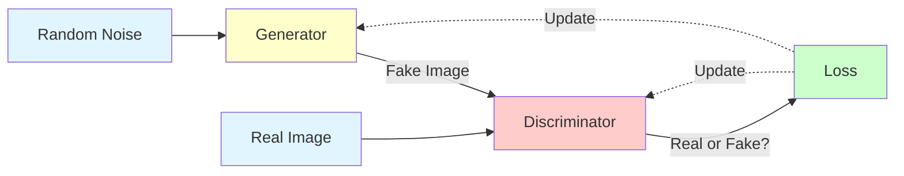

# Generative Adversarial Networks (GAN)

**Two networks compete to generate realistic data.** GANs pit a generator against a discriminator in a zero-sum game, producing remarkably realistic images, videos, and more.

**Difficulty:** 🔴 Advanced | **Time:** 5-6 hours | **Prerequisites:** [CNN](cnn.md), [Neural Networks Basics](neural-networks-basics.md)

---

## Overview

Generative Adversarial Networks consist of two neural networks - a generator that creates fake data and a discriminator that tries to distinguish real from fake. Through adversarial training, the generator learns to produce increasingly realistic samples.

**Use cases:** Image generation, style transfer, data augmentation, super-resolution, video synthesis, drug discovery

---

## Intuition 💡

### The Big Idea

**Analogy:** Counterfeiter (Generator) vs Police (Discriminator)

- **Generator (Counterfeiter):** Creates fake money
- **Discriminator (Police):** Identifies fake money
- **Training:** They improve together!
  - Generator gets better at faking
  - Discriminator gets better at detecting
  - Eventually: Generator produces perfect fakes!



---

## Architecture

### Basic GAN Components

**1. Generator**
- Input: Random noise vector $z$
- Output: Fake image $G(z)$
- Goal: Fool discriminator

**2. Discriminator**
- Input: Real or fake image
- Output: Probability (real vs fake)
- Goal: Correctly classify

### Mathematical Framework

**Minimax Game:**

$$\min_G \max_D V(D, G) = \mathbb{E}_{x \sim p_{data}}[\log D(x)] + \mathbb{E}_{z \sim p_z}[\log(1 - D(G(z)))]$$

Where:
- $D$ tries to maximize (distinguish real from fake)
- $G$ tries to minimize (fool discriminator)
- $x$ = real data
- $z$ = random noise
- $G(z)$ = generated fake data

---

## When to Use ✅ / When to Avoid ❌

### ✅ Good For

| Scenario | Why It Works |
|----------|--------------|
| **Image generation** | Produces photo-realistic images |
| **Data augmentation** | Generate training data |
| **Style transfer** | Transform image styles |
| **Super-resolution** | Enhance image quality |
| **Anomaly detection** | Discriminator detects unusual patterns |

### ❌ Not Good For

| Scenario | Why It Fails |
|----------|--------------|
| **Stable training** | Notoriously hard to train |
| **Discrete data** | Works best with continuous data |
| **Need guarantees** | Unpredictable output quality |
| **Structured output** | Hard to control generation |

---

## Implementation

### Simple GAN with PyTorch

```python
import torch
import torch.nn as nn
import torch.optim as optim
from torchvision import datasets, transforms
from torch.utils.data import DataLoader

# Generator network
class Generator(nn.Module):
    def __init__(self, latent_dim=100, img_shape=(1, 28, 28)):
        super().__init__()
        self.img_shape = img_shape

        self.model = nn.Sequential(
            nn.Linear(latent_dim, 128),
            nn.LeakyReLU(0.2),
            nn.Linear(128, 256),
            nn.BatchNorm1d(256),
            nn.LeakyReLU(0.2),
            nn.Linear(256, 512),
            nn.BatchNorm1d(512),
            nn.LeakyReLU(0.2),
            nn.Linear(512, int(torch.prod(torch.tensor(img_shape)))),
            nn.Tanh()
        )

    def forward(self, z):
        img = self.model(z)
        img = img.view(img.size(0), *self.img_shape)
        return img

# Discriminator network
class Discriminator(nn.Module):
    def __init__(self, img_shape=(1, 28, 28)):
        super().__init__()

        self.model = nn.Sequential(
            nn.Linear(int(torch.prod(torch.tensor(img_shape))), 512),
            nn.LeakyReLU(0.2),
            nn.Linear(512, 256),
            nn.LeakyReLU(0.2),
            nn.Linear(256, 1),
            nn.Sigmoid()
        )

    def forward(self, img):
        img_flat = img.view(img.size(0), -1)
        validity = self.model(img_flat)
        return validity

# Training
device = torch.device('cuda' if torch.cuda.is_available() else 'cpu')
latent_dim = 100

generator = Generator(latent_dim).to(device)
discriminator = Discriminator().to(device)

# Loss and optimizers
adversarial_loss = nn.BCELoss()
optimizer_G = optim.Adam(generator.parameters(), lr=0.0002, betas=(0.5, 0.999))
optimizer_D = optim.Adam(discriminator.parameters(), lr=0.0002, betas=(0.5, 0.999))

# Load MNIST
dataloader = DataLoader(
    datasets.MNIST('./data', train=True, download=True,
                   transform=transforms.Compose([
                       transforms.ToTensor(),
                       transforms.Normalize([0.5], [0.5])
                   ])),
    batch_size=64,
    shuffle=True
)

# Training loop
epochs = 50
for epoch in range(epochs):
    for i, (imgs, _) in enumerate(dataloader):
        batch_size = imgs.size(0)
        real_imgs = imgs.to(device)

        # Labels
        valid = torch.ones(batch_size, 1).to(device)
        fake = torch.zeros(batch_size, 1).to(device)

        # Train Generator
        optimizer_G.zero_grad()
        z = torch.randn(batch_size, latent_dim).to(device)
        gen_imgs = generator(z)
        g_loss = adversarial_loss(discriminator(gen_imgs), valid)
        g_loss.backward()
        optimizer_G.step()

        # Train Discriminator
        optimizer_D.zero_grad()
        real_loss = adversarial_loss(discriminator(real_imgs), valid)
        fake_loss = adversarial_loss(discriminator(gen_imgs.detach()), fake)
        d_loss = (real_loss + fake_loss) / 2
        d_loss.backward()
        optimizer_D.step()

    if epoch % 10 == 0:
        print(f"Epoch {epoch}/{epochs} | D Loss: {d_loss.item():.4f} | G Loss: {g_loss.item():.4f}")
```

---

## GAN Variants

### 1. DCGAN (Deep Convolutional GAN)
Uses convolutional layers instead of fully connected.

### 2. Conditional GAN (cGAN)
Conditions generation on labels (e.g., generate digit "3").

### 3. Wasserstein GAN (WGAN)
Improved training stability using Wasserstein distance.

### 4. StyleGAN
Generates high-quality, controllable images.

### 5. CycleGAN
Unpaired image-to-image translation (horse → zebra).

### 6. Pix2Pix
Paired image-to-image translation (sketch → photo).

---

## Training Challenges

### 1. Mode Collapse

!!! warning "Generator Produces Same Output"
    **Problem:** Generator finds one fake that fools discriminator, produces only that.

    **Solutions:**
    - Minibatch discrimination
    - Feature matching
    - Use WGAN loss

### 2. Vanishing Gradients

!!! warning "Discriminator Too Good"
    **Problem:** Perfect discriminator gives no gradient to generator.

    **Solution:** Balance discriminator and generator training.

### 3. Instability

!!! warning "Training Oscillates"
    **Problem:** Losses don't converge, outputs fluctuate.

    **Solutions:**
    - Lower learning rates
    - Use label smoothing
    - Add noise to inputs

---

## Best Practices

1. **Architecture:** Use BatchNorm in generator, avoid in discriminator
2. **Activation:** Tanh in generator output, LeakyReLU in discriminator
3. **Learning Rate:** Start small (0.0002), use Adam optimizer
4. **Monitoring:** Watch both losses, not just one
5. **Checkpointing:** Save models frequently (GANs can diverge suddenly!)

---

## Evaluation Metrics

**Inception Score (IS):** Higher = better quality and diversity

**Fréchet Inception Distance (FID):** Lower = more realistic

**Visual Inspection:** Still most common!

---

## Practice Problems

### 🟢 Beginner

!!! example "Problem 1: Basic GAN"
    Train GAN on MNIST to generate digits.
    Visualize generated samples over epochs.

### 🟡 Intermediate

!!! example "Problem 2: DCGAN"
    Implement DCGAN for CIFAR-10.
    Use convolutional layers.

### 🔴 Advanced

!!! example "Problem 3: Conditional GAN"
    Build conditional GAN that generates specific digits on demand.

!!! example "Problem 4: Style Transfer"
    Implement CycleGAN for unpaired image translation.

---

## Real-World Applications

1. **Art Generation:** Creating novel artwork
2. **Face Synthesis:** Generate realistic faces (thispersondoesnotexist.com)
3. **Data Augmentation:** Generate training data
4. **Image Editing:** Photo enhancement, inpainting
5. **Drug Discovery:** Generate molecular structures
6. **Fashion Design:** Generate clothing designs
7. **Game Development:** Generate textures, environments

---

## Related Topics

- [CNN](cnn.md) - Used in DCGAN
- [Neural Networks Basics](neural-networks-basics.md) - Foundation
- [Autoencoders](../unsupervised-learning/autoencoders.md) - Alternative generative model
- [VAE](advanced/vae.md) - Variational autoencoders

---

## References

1. **Paper:** [Generative Adversarial Networks](https://arxiv.org/abs/1406.2661) (Goodfellow et al., 2014)
2. **Paper:** [DCGAN](https://arxiv.org/abs/1511.06434) (Radford et al., 2015)
3. **Paper:** [Progressive Growing of GANs](https://arxiv.org/abs/1710.10196) (Karras et al., 2017)
4. **Paper:** [StyleGAN](https://arxiv.org/abs/1812.04948) (Karras et al., 2018)
5. **Tutorial:** [GAN Lab](https://poloclub.github.io/ganlab/) - Interactive visualization
6. **Code:** [PyTorch GAN Collection](https://github.com/eriklindernoren/PyTorch-GAN)

---

**Next Steps:**
- Implement basic GAN from scratch
- Explore DCGAN for images
- Experiment with different loss functions
- Try conditional generation

**Ready to generate realistic data?** Start with GANs! 🎨
