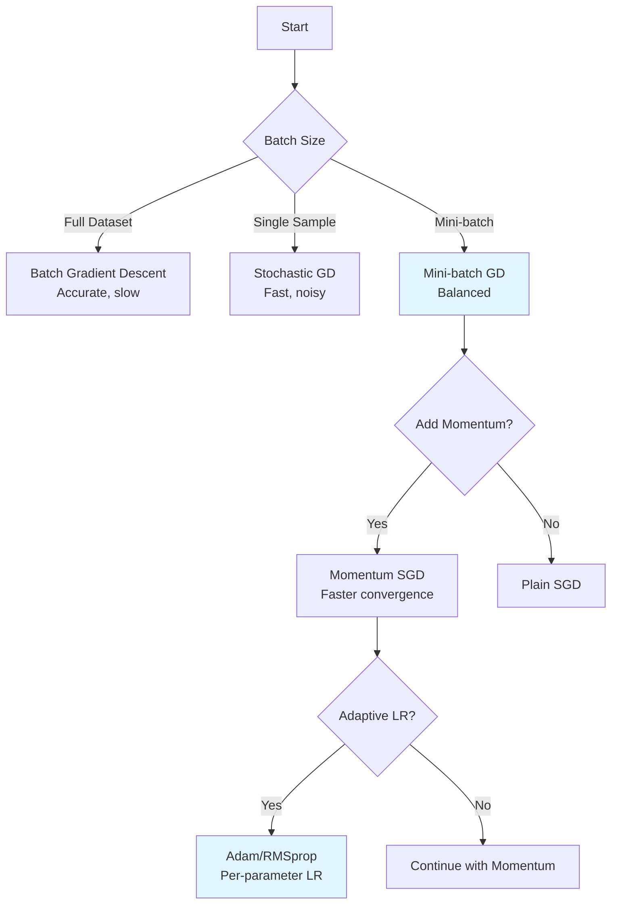
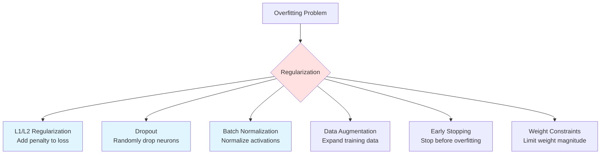
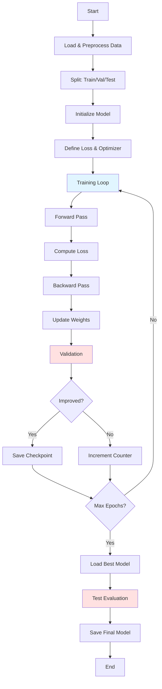

# Deep Learning: From Theory to Implementation

## Overview

Deep Learning is a subset of machine learning that uses artificial neural networks with multiple layers (hence "deep") to automatically learn hierarchical representations of data. Unlike traditional machine learning that requires manual feature engineering, deep learning models can automatically discover the representations needed for feature detection or classification from raw data.

**Why Deep Learning?**

- **Automatic Feature Learning**: No manual feature engineering required
- **Hierarchical Representations**: Lower layers learn simple features, higher layers learn complex patterns
- **Scalability**: Performance improves with more data and compute
- **Universal Approximation**: Neural networks can approximate any continuous function
- **State-of-the-Art Performance**: Achieves best results in vision, NLP, speech, and many other domains

## Architecture Categories

=== "Fundamentals"

    ### Neural Network Basics

    A neural network consists of interconnected nodes (neurons) organized in layers. Each connection has a weight, and each neuron applies an activation function to its weighted inputs.

    #### Network Architecture

    ```mermaid
    graph LR
        subgraph Input Layer
            I1((x₁))
            I2((x₂))
            I3((x₃))
        end

        subgraph Hidden Layer 1
            H1((h₁₁))
            H2((h₁₂))
            H3((h₁₃))
            H4((h₁₄))
        end

        subgraph Hidden Layer 2
            H5((h₂₁))
            H6((h₂₂))
            H7((h₂₃))
        end

        subgraph Output Layer
            O1((y₁))
            O2((y₂))
        end

        I1 --> H1 & H2 & H3 & H4
        I2 --> H1 & H2 & H3 & H4
        I3 --> H1 & H2 & H3 & H4

        H1 --> H5 & H6 & H7
        H2 --> H5 & H6 & H7
        H3 --> H5 & H6 & H7
        H4 --> H5 & H6 & H7

        H5 --> O1 & O2
        H6 --> O1 & O2
        H7 --> O1 & O2
    ```

    #### Forward Propagation

    The process of computing predictions by passing input through the network:

    ```mermaid
    flowchart TD
        A[Input Data: X] --> B[Linear Transformation: Z = WX + b]
        B --> C[Activation Function: A = σ(Z)]
        C --> D{More Layers?}
        D -->|Yes| B
        D -->|No| E[Output: ŷ]
        E --> F[Loss Calculation: L(ŷ, y)]
    ```

    **Mathematical Formulation:**

    For layer $l$:
    $$
    \begin{align}
    z^{[l]} &= W^{[l]}a^{[l-1]} + b^{[l]} \\
    a^{[l]} &= g^{[l]}(z^{[l]})
    \end{align}
    $$

    Where:
    - $W^{[l]}$ = weight matrix for layer $l$
    - $b^{[l]}$ = bias vector for layer $l$
    - $g^{[l]}$ = activation function
    - $a^{[l]}$ = activations (output) of layer $l$

    #### Backward Propagation

    The algorithm for computing gradients using the chain rule:

    ```mermaid
    flowchart TD
        A[Compute Loss: L(ŷ, y)] --> B[Compute Output Gradient: ∂L/∂ŷ]
        B --> C[Backpropagate through Activation: ∂L/∂z]
        C --> D[Compute Weight Gradient: ∂L/∂W]
        C --> E[Compute Bias Gradient: ∂L/∂b]
        C --> F[Compute Input Gradient: ∂L/∂a⁽ˡ⁻¹⁾]
        D --> G[Update Weights: W = W - α∂L/∂W]
        E --> H[Update Biases: b = b - α∂L/∂b]
        F --> I{More Layers?}
        I -->|Yes| C
        I -->|No| J[End]
        G --> J
        H --> J
    ```

    **Gradient Equations:**

    For output layer:
    $$
    \frac{\partial L}{\partial z^{[L]}} = a^{[L]} - y
    $$

    For hidden layers:
    $$
    \begin{align}
    \frac{\partial L}{\partial z^{[l]}} &= \frac{\partial L}{\partial z^{[l+1]}} \cdot W^{[l+1]T} \circ g'^{[l]}(z^{[l]}) \\
    \frac{\partial L}{\partial W^{[l]}} &= \frac{\partial L}{\partial z^{[l]}} \cdot a^{[l-1]T} \\
    \frac{\partial L}{\partial b^{[l]}} &= \frac{\partial L}{\partial z^{[l]}}
    \end{align}
    $$

    #### PyTorch Implementation: Simple Neural Network

    ```python
    import torch
    import torch.nn as nn
    import torch.optim as optim
    from torch.utils.data import DataLoader, TensorDataset

    # Define a simple feedforward neural network
    class SimpleNN(nn.Module):
        def __init__(self, input_size, hidden_sizes, output_size):
            super(SimpleNN, self).__init__()

            # Build layers dynamically
            layers = []
            prev_size = input_size

            for hidden_size in hidden_sizes:
                layers.append(nn.Linear(prev_size, hidden_size))
                layers.append(nn.ReLU())
                layers.append(nn.BatchNorm1d(hidden_size))
                layers.append(nn.Dropout(0.3))
                prev_size = hidden_size

            # Output layer (no activation for regression, add softmax for classification)
            layers.append(nn.Linear(prev_size, output_size))

            self.network = nn.Sequential(*layers)

        def forward(self, x):
            return self.network(x)

    # Training function
    def train_model(model, train_loader, val_loader, epochs=100, lr=0.001):
        criterion = nn.MSELoss()  # Use nn.CrossEntropyLoss() for classification
        optimizer = optim.Adam(model.parameters(), lr=lr)
        scheduler = optim.lr_scheduler.ReduceLROnPlateau(optimizer, 'min', patience=5)

        for epoch in range(epochs):
            # Training phase
            model.train()
            train_loss = 0.0
            for batch_x, batch_y in train_loader:
                # Forward pass
                outputs = model(batch_x)
                loss = criterion(outputs, batch_y)

                # Backward pass and optimization
                optimizer.zero_grad()
                loss.backward()

                # Gradient clipping to prevent exploding gradients
                torch.nn.utils.clip_grad_norm_(model.parameters(), max_norm=1.0)

                optimizer.step()
                train_loss += loss.item()

            # Validation phase
            model.eval()
            val_loss = 0.0
            with torch.no_grad():
                for batch_x, batch_y in val_loader:
                    outputs = model(batch_x)
                    loss = criterion(outputs, batch_y)
                    val_loss += loss.item()

            # Learning rate scheduling
            scheduler.step(val_loss)

            if epoch % 10 == 0:
                print(f'Epoch [{epoch}/{epochs}], '
                      f'Train Loss: {train_loss/len(train_loader):.4f}, '
                      f'Val Loss: {val_loss/len(val_loader):.4f}')

    # Usage example
    if __name__ == "__main__":
        # Generate synthetic data
        X_train = torch.randn(1000, 20)  # 1000 samples, 20 features
        y_train = torch.randn(1000, 1)   # 1000 targets
        X_val = torch.randn(200, 20)
        y_val = torch.randn(200, 1)

        # Create data loaders
        train_dataset = TensorDataset(X_train, y_train)
        val_dataset = TensorDataset(X_val, y_val)
        train_loader = DataLoader(train_dataset, batch_size=32, shuffle=True)
        val_loader = DataLoader(val_dataset, batch_size=32)

        # Initialize model
        model = SimpleNN(input_size=20, hidden_sizes=[64, 32, 16], output_size=1)

        # Train model
        train_model(model, train_loader, val_loader, epochs=100, lr=0.001)

        # Make predictions
        model.eval()
        with torch.no_grad():
            predictions = model(X_val)
            print(f"Sample predictions: {predictions[:5].squeeze()}")
    ```

    #### TensorFlow/Keras Implementation

    ```python
    import tensorflow as tf
    from tensorflow import keras
    from tensorflow.keras import layers
    import numpy as np

    # Define model using Keras Sequential API
    def create_model(input_dim, hidden_sizes, output_dim):
        model = keras.Sequential()

        # Input layer
        model.add(layers.Input(shape=(input_dim,)))

        # Hidden layers
        for hidden_size in hidden_sizes:
            model.add(layers.Dense(hidden_size, activation='relu'))
            model.add(layers.BatchNormalization())
            model.add(layers.Dropout(0.3))

        # Output layer
        model.add(layers.Dense(output_dim))

        return model

    # Alternative: Functional API for more complex architectures
    def create_model_functional(input_dim, hidden_sizes, output_dim):
        inputs = layers.Input(shape=(input_dim,))
        x = inputs

        for hidden_size in hidden_sizes:
            x = layers.Dense(hidden_size, activation='relu')(x)
            x = layers.BatchNormalization()(x)
            x = layers.Dropout(0.3)(x)

        outputs = layers.Dense(output_dim)(x)

        model = keras.Model(inputs=inputs, outputs=outputs)
        return model

    # Training setup
    def train_keras_model(X_train, y_train, X_val, y_val):
        model = create_model(input_dim=20, hidden_sizes=[64, 32, 16], output_dim=1)

        # Compile model
        model.compile(
            optimizer=keras.optimizers.Adam(learning_rate=0.001),
            loss='mse',  # Use 'categorical_crossentropy' for classification
            metrics=['mae']
        )

        # Callbacks
        callbacks = [
            keras.callbacks.EarlyStopping(patience=10, restore_best_weights=True),
            keras.callbacks.ReduceLROnPlateau(factor=0.5, patience=5),
            keras.callbacks.ModelCheckpoint('best_model.h5', save_best_only=True)
        ]

        # Train model
        history = model.fit(
            X_train, y_train,
            validation_data=(X_val, y_val),
            epochs=100,
            batch_size=32,
            callbacks=callbacks,
            verbose=1
        )

        return model, history

    # Usage
    X_train = np.random.randn(1000, 20)
    y_train = np.random.randn(1000, 1)
    X_val = np.random.randn(200, 20)
    y_val = np.random.randn(200, 1)

    model, history = train_keras_model(X_train, y_train, X_val, y_val)
    ```

=== "CNNs"

    ### Convolutional Neural Networks

    CNNs are specialized neural networks designed for processing grid-like data (images, videos). They use convolution operations to automatically learn spatial hierarchies of features.

    #### CNN Architecture

    ```mermaid
    graph LR
        subgraph Input
            A[Image<br/>224×224×3]
        end

        subgraph Conv Block 1
            B[Conv Layer<br/>64 filters<br/>3×3]
            C[ReLU]
            D[MaxPool<br/>2×2]
        end

        subgraph Conv Block 2
            E[Conv Layer<br/>128 filters<br/>3×3]
            F[ReLU]
            G[MaxPool<br/>2×2]
        end

        subgraph Conv Block 3
            H[Conv Layer<br/>256 filters<br/>3×3]
            I[ReLU]
            J[MaxPool<br/>2×2]
        end

        subgraph Classifier
            K[Flatten]
            L[FC Layer<br/>512 units]
            M[Dropout]
            N[FC Layer<br/>num_classes]
        end

        A --> B --> C --> D
        D --> E --> F --> G
        G --> H --> I --> J
        J --> K --> L --> M --> N
    ```

    #### Convolutional Layer Operation

    ```mermaid
    flowchart TD
        A[Input Feature Map<br/>H×W×C] --> B[Convolution Kernel<br/>k×k×C×F]
        B --> C[Slide Kernel Across Input<br/>with stride s]
        C --> D[Element-wise Multiply<br/>and Sum]
        D --> E[Add Bias]
        E --> F[Apply Activation]
        F --> G[Output Feature Map<br/>H'×W'×F]

        style B fill:#e1f5ff
        style G fill:#ffe1e1
    ```

    **Key Components:**

    1. **Convolution Layer**: Applies filters to detect features
       - Formula: Output size = $\frac{W - K + 2P}{S} + 1$
       - $W$ = input width, $K$ = kernel size, $P$ = padding, $S$ = stride

    2. **Pooling Layer**: Reduces spatial dimensions
       - Max pooling: Takes maximum value in window
       - Average pooling: Takes average value in window

    3. **Fully Connected Layer**: Traditional dense layer for classification

    #### PyTorch CNN Implementation

    ```python
    import torch
    import torch.nn as nn
    import torch.nn.functional as F
    import torchvision
    import torchvision.transforms as transforms
    from torch.utils.data import DataLoader

    class ConvBlock(nn.Module):
        """Reusable convolutional block"""
        def __init__(self, in_channels, out_channels, kernel_size=3,
                     stride=1, padding=1, use_batch_norm=True):
            super(ConvBlock, self).__init__()

            layers = [
                nn.Conv2d(in_channels, out_channels, kernel_size,
                         stride=stride, padding=padding),
            ]

            if use_batch_norm:
                layers.append(nn.BatchNorm2d(out_channels))

            layers.append(nn.ReLU(inplace=True))

            self.block = nn.Sequential(*layers)

        def forward(self, x):
            return self.block(x)

    class SimpleCNN(nn.Module):
        """Simple CNN for image classification"""
        def __init__(self, num_classes=10, input_channels=3):
            super(SimpleCNN, self).__init__()

            # Convolutional layers
            self.conv1 = ConvBlock(input_channels, 64)
            self.conv2 = ConvBlock(64, 64)
            self.pool1 = nn.MaxPool2d(2, 2)

            self.conv3 = ConvBlock(64, 128)
            self.conv4 = ConvBlock(128, 128)
            self.pool2 = nn.MaxPool2d(2, 2)

            self.conv5 = ConvBlock(128, 256)
            self.conv6 = ConvBlock(256, 256)
            self.pool3 = nn.MaxPool2d(2, 2)

            # Global average pooling
            self.gap = nn.AdaptiveAvgPool2d((1, 1))

            # Fully connected layers
            self.fc1 = nn.Linear(256, 512)
            self.dropout = nn.Dropout(0.5)
            self.fc2 = nn.Linear(512, num_classes)

        def forward(self, x):
            # Conv block 1
            x = self.conv1(x)
            x = self.conv2(x)
            x = self.pool1(x)

            # Conv block 2
            x = self.conv3(x)
            x = self.conv4(x)
            x = self.pool2(x)

            # Conv block 3
            x = self.conv5(x)
            x = self.conv6(x)
            x = self.pool3(x)

            # Global average pooling
            x = self.gap(x)
            x = x.view(x.size(0), -1)

            # Classifier
            x = F.relu(self.fc1(x))
            x = self.dropout(x)
            x = self.fc2(x)

            return x

    class ResidualBlock(nn.Module):
        """Residual block with skip connection"""
        def __init__(self, in_channels, out_channels, stride=1):
            super(ResidualBlock, self).__init__()

            self.conv1 = nn.Conv2d(in_channels, out_channels, 3,
                                   stride=stride, padding=1, bias=False)
            self.bn1 = nn.BatchNorm2d(out_channels)
            self.conv2 = nn.Conv2d(out_channels, out_channels, 3,
                                   stride=1, padding=1, bias=False)
            self.bn2 = nn.BatchNorm2d(out_channels)

            # Skip connection
            self.shortcut = nn.Sequential()
            if stride != 1 or in_channels != out_channels:
                self.shortcut = nn.Sequential(
                    nn.Conv2d(in_channels, out_channels, 1,
                             stride=stride, bias=False),
                    nn.BatchNorm2d(out_channels)
                )

        def forward(self, x):
            identity = self.shortcut(x)

            out = F.relu(self.bn1(self.conv1(x)))
            out = self.bn2(self.conv2(out))
            out += identity
            out = F.relu(out)

            return out

    # Training function for CNN
    def train_cnn(model, train_loader, val_loader, epochs=50, device='cuda'):
        model = model.to(device)
        criterion = nn.CrossEntropyLoss()
        optimizer = torch.optim.Adam(model.parameters(), lr=0.001)
        scheduler = torch.optim.lr_scheduler.CosineAnnealingLR(optimizer, T_max=epochs)

        best_acc = 0.0

        for epoch in range(epochs):
            # Training
            model.train()
            train_loss = 0.0
            train_correct = 0
            train_total = 0

            for images, labels in train_loader:
                images, labels = images.to(device), labels.to(device)

                optimizer.zero_grad()
                outputs = model(images)
                loss = criterion(outputs, labels)
                loss.backward()
                optimizer.step()

                train_loss += loss.item()
                _, predicted = outputs.max(1)
                train_total += labels.size(0)
                train_correct += predicted.eq(labels).sum().item()

            # Validation
            model.eval()
            val_loss = 0.0
            val_correct = 0
            val_total = 0

            with torch.no_grad():
                for images, labels in val_loader:
                    images, labels = images.to(device), labels.to(device)
                    outputs = model(images)
                    loss = criterion(outputs, labels)

                    val_loss += loss.item()
                    _, predicted = outputs.max(1)
                    val_total += labels.size(0)
                    val_correct += predicted.eq(labels).sum().item()

            scheduler.step()

            train_acc = 100. * train_correct / train_total
            val_acc = 100. * val_correct / val_total

            if val_acc > best_acc:
                best_acc = val_acc
                torch.save(model.state_dict(), 'best_cnn_model.pth')

            print(f'Epoch {epoch+1}/{epochs}:')
            print(f'  Train Loss: {train_loss/len(train_loader):.4f}, '
                  f'Train Acc: {train_acc:.2f}%')
            print(f'  Val Loss: {val_loss/len(val_loader):.4f}, '
                  f'Val Acc: {val_acc:.2f}%')

    # Usage with CIFAR-10
    if __name__ == "__main__":
        # Data augmentation and normalization
        transform_train = transforms.Compose([
            transforms.RandomCrop(32, padding=4),
            transforms.RandomHorizontalFlip(),
            transforms.ToTensor(),
            transforms.Normalize((0.4914, 0.4822, 0.4465),
                               (0.2023, 0.1994, 0.2010)),
        ])

        transform_test = transforms.Compose([
            transforms.ToTensor(),
            transforms.Normalize((0.4914, 0.4822, 0.4465),
                               (0.2023, 0.1994, 0.2010)),
        ])

        # Load CIFAR-10 dataset
        train_dataset = torchvision.datasets.CIFAR10(
            root='./data', train=True, download=True, transform=transform_train)
        test_dataset = torchvision.datasets.CIFAR10(
            root='./data', train=False, download=True, transform=transform_test)

        train_loader = DataLoader(train_dataset, batch_size=128,
                                 shuffle=True, num_workers=2)
        test_loader = DataLoader(test_dataset, batch_size=128,
                                shuffle=False, num_workers=2)

        # Initialize and train model
        model = SimpleCNN(num_classes=10, input_channels=3)
        device = 'cuda' if torch.cuda.is_available() else 'cpu'

        train_cnn(model, train_loader, test_loader, epochs=50, device=device)
    ```

    #### Popular CNN Architectures

    ```mermaid
    graph TD
        subgraph ResNet Architecture
            R1[Input Image] --> R2[Conv 7×7, 64]
            R2 --> R3[Max Pool 3×3]
            R3 --> R4[Residual Block × 3<br/>64 channels]
            R4 --> R5[Residual Block × 4<br/>128 channels]
            R5 --> R6[Residual Block × 6<br/>256 channels]
            R6 --> R7[Residual Block × 3<br/>512 channels]
            R7 --> R8[Global Avg Pool]
            R8 --> R9[FC + Softmax]
        end

        style R4 fill:#e1f5ff
        style R5 fill:#e1f5ff
        style R6 fill:#e1f5ff
        style R7 fill:#e1f5ff
    ```

    **Architecture Comparison:**

    | Architecture | Year | Key Innovation | Parameters | ImageNet Top-5 Error |
    |-------------|------|----------------|------------|---------------------|
    | LeNet-5 | 1998 | First successful CNN | 60K | N/A |
    | AlexNet | 2012 | ReLU, Dropout, GPU training | 60M | 15.3% |
    | VGG-16 | 2014 | Deep uniform architecture | 138M | 7.3% |
    | GoogLeNet | 2014 | Inception modules | 6.8M | 6.7% |
    | ResNet-50 | 2015 | Residual connections | 25.6M | 3.6% |
    | EfficientNet | 2019 | Compound scaling | 5.3M | 2.9% |

=== "RNNs"

    ### Recurrent Neural Networks

    RNNs are designed for sequential data where the order matters. They maintain hidden states that act as memory, allowing them to capture temporal dependencies.

    #### RNN Cell Structure

    ```mermaid
    graph LR
        subgraph RNN Cell at time t
            A[Input x_t] --> B[Concat]
            C[Previous Hidden State h_t-1] --> B
            B --> D[Linear Transform<br/>W_h, W_x]
            D --> E[Activation<br/>tanh]
            E --> F[Hidden State h_t]
            F --> G[Output y_t]
            F -.-> |Next timestep| H[h_t+1]
        end

        style F fill:#e1f5ff
    ```

    **Vanilla RNN Equations:**

    $$
    \begin{align}
    h_t &= \tanh(W_{hh}h_{t-1} + W_{xh}x_t + b_h) \\
    y_t &= W_{hy}h_t + b_y
    \end{align}
    $$

    #### LSTM Architecture

    LSTMs solve the vanishing gradient problem with gating mechanisms:

    ```mermaid
    graph TD
        subgraph LSTM Cell
            A[Input x_t] --> B[Concat with h_t-1]
            H[h_t-1] --> B

            B --> C[Forget Gate<br/>σ]
            B --> D[Input Gate<br/>σ]
            B --> E[Cell Gate<br/>tanh]
            B --> F[Output Gate<br/>σ]

            G[Cell State C_t-1] --> I[×]
            C --> I
            I --> J[+]

            D --> K[×]
            E --> K
            K --> J

            J --> L[Cell State C_t]
            L --> M[tanh]
            M --> N[×]
            F --> N
            N --> O[Hidden State h_t]
        end

        style L fill:#ffe1e1
        style O fill:#e1f5ff
    ```

    **LSTM Equations:**

    $$
    \begin{align}
    f_t &= \sigma(W_f \cdot [h_{t-1}, x_t] + b_f) \quad \text{(Forget gate)} \\
    i_t &= \sigma(W_i \cdot [h_{t-1}, x_t] + b_i) \quad \text{(Input gate)} \\
    \tilde{C}_t &= \tanh(W_C \cdot [h_{t-1}, x_t] + b_C) \quad \text{(Cell candidate)} \\
    C_t &= f_t \odot C_{t-1} + i_t \odot \tilde{C}_t \quad \text{(Cell state)} \\
    o_t &= \sigma(W_o \cdot [h_{t-1}, x_t] + b_o) \quad \text{(Output gate)} \\
    h_t &= o_t \odot \tanh(C_t) \quad \text{(Hidden state)}
    \end{align}
    $$

    #### GRU Architecture

    GRU is a simplified version of LSTM with fewer parameters:

    ```mermaid
    graph TD
        subgraph GRU Cell
            A[Input x_t] --> B[Concat with h_t-1]
            H[h_t-1] --> B

            B --> C[Update Gate<br/>z_t = σ]
            B --> D[Reset Gate<br/>r_t = σ]

            D --> E[×]
            H2[h_t-1] --> E
            E --> F[Concat with x_t]
            A2[x_t] --> F
            F --> G[Candidate<br/>h̃_t = tanh]

            C --> I[1 - z_t]
            I --> J[×]
            H3[h_t-1] --> J

            C --> K[×]
            G --> K

            J --> L[+]
            K --> L
            L --> M[Hidden State h_t]
        end

        style M fill:#e1f5ff
    ```

    **GRU Equations:**

    $$
    \begin{align}
    z_t &= \sigma(W_z \cdot [h_{t-1}, x_t]) \quad \text{(Update gate)} \\
    r_t &= \sigma(W_r \cdot [h_{t-1}, x_t]) \quad \text{(Reset gate)} \\
    \tilde{h}_t &= \tanh(W \cdot [r_t \odot h_{t-1}, x_t]) \quad \text{(Candidate)} \\
    h_t &= (1 - z_t) \odot h_{t-1} + z_t \odot \tilde{h}_t \quad \text{(Hidden state)}
    \end{align}
    $$

    #### PyTorch RNN/LSTM Implementation

    ```python
    import torch
    import torch.nn as nn
    import numpy as np
    from torch.utils.data import Dataset, DataLoader

    class SequenceDataset(Dataset):
        """Custom dataset for sequence data"""
        def __init__(self, sequences, targets):
            self.sequences = sequences
            self.targets = targets

        def __len__(self):
            return len(self.sequences)

        def __getitem__(self, idx):
            return self.sequences[idx], self.targets[idx]

    class LSTMModel(nn.Module):
        """LSTM for sequence prediction"""
        def __init__(self, input_size, hidden_size, num_layers,
                     output_size, dropout=0.3, bidirectional=False):
            super(LSTMModel, self).__init__()

            self.hidden_size = hidden_size
            self.num_layers = num_layers
            self.num_directions = 2 if bidirectional else 1

            # LSTM layer
            self.lstm = nn.LSTM(
                input_size=input_size,
                hidden_size=hidden_size,
                num_layers=num_layers,
                batch_first=True,
                dropout=dropout if num_layers > 1 else 0,
                bidirectional=bidirectional
            )

            # Dropout layer
            self.dropout = nn.Dropout(dropout)

            # Output layer
            self.fc = nn.Linear(hidden_size * self.num_directions, output_size)

        def forward(self, x, hidden=None):
            # x shape: (batch, seq_len, input_size)

            if hidden is None:
                hidden = self.init_hidden(x.size(0), x.device)

            # LSTM forward pass
            lstm_out, hidden = self.lstm(x, hidden)

            # Take output from last time step
            # lstm_out shape: (batch, seq_len, hidden_size * num_directions)
            last_output = lstm_out[:, -1, :]

            # Apply dropout
            last_output = self.dropout(last_output)

            # Fully connected layer
            output = self.fc(last_output)

            return output, hidden

        def init_hidden(self, batch_size, device):
            """Initialize hidden state"""
            h0 = torch.zeros(self.num_layers * self.num_directions,
                           batch_size, self.hidden_size).to(device)
            c0 = torch.zeros(self.num_layers * self.num_directions,
                           batch_size, self.hidden_size).to(device)
            return (h0, c0)

    class GRUModel(nn.Module):
        """GRU for sequence prediction"""
        def __init__(self, input_size, hidden_size, num_layers,
                     output_size, dropout=0.3):
            super(GRUModel, self).__init__()

            self.hidden_size = hidden_size
            self.num_layers = num_layers

            # GRU layer
            self.gru = nn.GRU(
                input_size=input_size,
                hidden_size=hidden_size,
                num_layers=num_layers,
                batch_first=True,
                dropout=dropout if num_layers > 1 else 0
            )

            self.dropout = nn.Dropout(dropout)
            self.fc = nn.Linear(hidden_size, output_size)

        def forward(self, x, hidden=None):
            if hidden is None:
                hidden = self.init_hidden(x.size(0), x.device)

            gru_out, hidden = self.gru(x, hidden)
            last_output = gru_out[:, -1, :]
            last_output = self.dropout(last_output)
            output = self.fc(last_output)

            return output, hidden

        def init_hidden(self, batch_size, device):
            return torch.zeros(self.num_layers, batch_size,
                             self.hidden_size).to(device)

    class Seq2SeqLSTM(nn.Module):
        """Sequence-to-Sequence LSTM with attention"""
        def __init__(self, input_size, hidden_size, output_size,
                     num_layers=1, dropout=0.3):
            super(Seq2SeqLSTM, self).__init__()

            # Encoder
            self.encoder = nn.LSTM(
                input_size=input_size,
                hidden_size=hidden_size,
                num_layers=num_layers,
                batch_first=True,
                dropout=dropout if num_layers > 1 else 0
            )

            # Decoder
            self.decoder = nn.LSTM(
                input_size=output_size,
                hidden_size=hidden_size,
                num_layers=num_layers,
                batch_first=True,
                dropout=dropout if num_layers > 1 else 0
            )

            # Attention mechanism
            self.attention = nn.Linear(hidden_size * 2, 1)

            # Output layer
            self.fc = nn.Linear(hidden_size, output_size)

        def forward(self, src, trg, teacher_forcing_ratio=0.5):
            # Encoding
            encoder_outputs, hidden = self.encoder(src)

            # Decoding
            batch_size = trg.size(0)
            trg_len = trg.size(1)
            trg_vocab_size = self.fc.out_features

            outputs = torch.zeros(batch_size, trg_len,
                                trg_vocab_size).to(src.device)

            # First input to decoder is start token
            decoder_input = trg[:, 0:1, :]

            for t in range(1, trg_len):
                # Decode one step
                decoder_output, hidden = self.decoder(decoder_input, hidden)

                # Apply attention (optional)
                # attention_weights = self.compute_attention(decoder_output, encoder_outputs)

                # Generate output
                output = self.fc(decoder_output)
                outputs[:, t:t+1, :] = output

                # Teacher forcing
                teacher_force = torch.rand(1).item() < teacher_forcing_ratio
                decoder_input = trg[:, t:t+1, :] if teacher_force else output

            return outputs

    # Training function
    def train_rnn(model, train_loader, val_loader, epochs=50, lr=0.001):
        device = torch.device('cuda' if torch.cuda.is_available() else 'cpu')
        model = model.to(device)

        criterion = nn.MSELoss()  # Use CrossEntropyLoss for classification
        optimizer = torch.optim.Adam(model.parameters(), lr=lr)
        scheduler = torch.optim.lr_scheduler.ReduceLROnPlateau(
            optimizer, 'min', patience=5, factor=0.5)

        for epoch in range(epochs):
            # Training
            model.train()
            train_loss = 0.0

            for sequences, targets in train_loader:
                sequences = sequences.to(device)
                targets = targets.to(device)

                optimizer.zero_grad()
                outputs, _ = model(sequences)
                loss = criterion(outputs, targets)
                loss.backward()

                # Gradient clipping for RNNs
                torch.nn.utils.clip_grad_norm_(model.parameters(), max_norm=5.0)

                optimizer.step()
                train_loss += loss.item()

            # Validation
            model.eval()
            val_loss = 0.0

            with torch.no_grad():
                for sequences, targets in val_loader:
                    sequences = sequences.to(device)
                    targets = targets.to(device)
                    outputs, _ = model(sequences)
                    loss = criterion(outputs, targets)
                    val_loss += loss.item()

            scheduler.step(val_loss)

            print(f'Epoch {epoch+1}/{epochs}:')
            print(f'  Train Loss: {train_loss/len(train_loader):.4f}')
            print(f'  Val Loss: {val_loss/len(val_loader):.4f}')

    # Example usage: Time series prediction
    if __name__ == "__main__":
        # Generate synthetic sequence data
        def generate_sequences(n_samples=1000, seq_len=50, input_size=10):
            sequences = []
            targets = []

            for _ in range(n_samples):
                # Random sequence
                seq = np.random.randn(seq_len, input_size)
                # Target is the sum of last 10 values
                target = seq[-10:].sum(axis=0).mean()

                sequences.append(seq)
                targets.append(target)

            return torch.FloatTensor(sequences), torch.FloatTensor(targets)

        # Create datasets
        X_train, y_train = generate_sequences(1000)
        X_val, y_val = generate_sequences(200)

        train_dataset = SequenceDataset(X_train, y_train)
        val_dataset = SequenceDataset(X_val, y_val)

        train_loader = DataLoader(train_dataset, batch_size=32, shuffle=True)
        val_loader = DataLoader(val_dataset, batch_size=32)

        # Initialize model
        model = LSTMModel(
            input_size=10,
            hidden_size=64,
            num_layers=2,
            output_size=1,
            dropout=0.3,
            bidirectional=True
        )

        # Train
        train_rnn(model, train_loader, val_loader, epochs=50, lr=0.001)
    ```

=== "Transformers"

    ### Transformer Architecture

    Transformers revolutionized deep learning by replacing recurrence with self-attention mechanisms, enabling parallel processing and better long-range dependencies.

    #### Complete Transformer Architecture

    ```mermaid
    graph TD
        subgraph Encoder
            E1[Input Embedding] --> E2[+ Positional Encoding]
            E2 --> E3[Multi-Head Attention]
            E3 --> E4[Add & Norm]
            E4 --> E5[Feed Forward]
            E5 --> E6[Add & Norm]
            E6 -.-> E7[× N layers]
        end

        subgraph Decoder
            D1[Output Embedding] --> D2[+ Positional Encoding]
            D2 --> D3[Masked Multi-Head Attention]
            D3 --> D4[Add & Norm]
            D4 --> D5[Cross Attention]
            E6 --> D5
            D5 --> D6[Add & Norm]
            D6 --> D7[Feed Forward]
            D7 --> D8[Add & Norm]
            D8 -.-> D9[× N layers]
            D9 --> D10[Linear]
            D10 --> D11[Softmax]
        end

        style E3 fill:#e1f5ff
        style D3 fill:#ffe1e1
        style D5 fill:#ffe1e1
    ```

    #### Self-Attention Mechanism

    ```mermaid
    graph LR
        subgraph Self-Attention
            A[Input X] --> B[Linear Q]
            A --> C[Linear K]
            A --> D[Linear V]

            B --> E[Query Q]
            C --> F[Key K]
            D --> G[Value V]

            E --> H[MatMul Q·K^T]
            F --> H
            H --> I[Scale by √d_k]
            I --> J[Softmax]
            J --> K[MatMul with V]
            G --> K
            K --> L[Output]
        end

        style H fill:#e1f5ff
        style J fill:#ffe1e1
    ```

    **Self-Attention Formula:**

    $$
    \text{Attention}(Q, K, V) = \text{softmax}\left(\frac{QK^T}{\sqrt{d_k}}\right)V
    $$

    Where:
    - $Q$ (Query) = $XW_Q$
    - $K$ (Key) = $XW_K$
    - $V$ (Value) = $XW_V$
    - $d_k$ = dimension of key vectors

    #### Multi-Head Attention

    ```mermaid
    graph TD
        A[Input] --> B1[Head 1<br/>Linear Q,K,V]
        A --> B2[Head 2<br/>Linear Q,K,V]
        A --> B3[Head 3<br/>Linear Q,K,V]
        A --> B4[Head h<br/>Linear Q,K,V]

        B1 --> C1[Attention]
        B2 --> C2[Attention]
        B3 --> C3[Attention]
        B4 --> C4[Attention]

        C1 --> D[Concat]
        C2 --> D
        C3 --> D
        C4 --> D

        D --> E[Linear W_O]
        E --> F[Output]

        style D fill:#e1f5ff
    ```

    **Multi-Head Attention Formula:**

    $$
    \begin{align}
    \text{MultiHead}(Q, K, V) &= \text{Concat}(\text{head}_1, ..., \text{head}_h)W_O \\
    \text{head}_i &= \text{Attention}(QW_i^Q, KW_i^K, VW_i^V)
    \end{align}
    $$

    #### PyTorch Transformer Implementation

    ```python
    import torch
    import torch.nn as nn
    import torch.nn.functional as F
    import math

    class MultiHeadAttention(nn.Module):
        """Multi-head self-attention mechanism"""
        def __init__(self, d_model, num_heads, dropout=0.1):
            super(MultiHeadAttention, self).__init__()

            assert d_model % num_heads == 0, "d_model must be divisible by num_heads"

            self.d_model = d_model
            self.num_heads = num_heads
            self.d_k = d_model // num_heads

            # Linear projections
            self.W_q = nn.Linear(d_model, d_model)
            self.W_k = nn.Linear(d_model, d_model)
            self.W_v = nn.Linear(d_model, d_model)
            self.W_o = nn.Linear(d_model, d_model)

            self.dropout = nn.Dropout(dropout)

        def scaled_dot_product_attention(self, Q, K, V, mask=None):
            """
            Q, K, V shape: (batch, num_heads, seq_len, d_k)
            """
            # Compute attention scores
            scores = torch.matmul(Q, K.transpose(-2, -1)) / math.sqrt(self.d_k)

            # Apply mask (if provided)
            if mask is not None:
                scores = scores.masked_fill(mask == 0, -1e9)

            # Apply softmax
            attention_weights = F.softmax(scores, dim=-1)
            attention_weights = self.dropout(attention_weights)

            # Apply attention to values
            output = torch.matmul(attention_weights, V)

            return output, attention_weights

        def forward(self, query, key, value, mask=None):
            batch_size = query.size(0)

            # Linear projections and reshape for multi-head
            Q = self.W_q(query).view(batch_size, -1, self.num_heads, self.d_k).transpose(1, 2)
            K = self.W_k(key).view(batch_size, -1, self.num_heads, self.d_k).transpose(1, 2)
            V = self.W_v(value).view(batch_size, -1, self.num_heads, self.d_k).transpose(1, 2)

            # Apply attention
            attn_output, attn_weights = self.scaled_dot_product_attention(Q, K, V, mask)

            # Concatenate heads
            attn_output = attn_output.transpose(1, 2).contiguous().view(
                batch_size, -1, self.d_model)

            # Final linear projection
            output = self.W_o(attn_output)

            return output, attn_weights

    class PositionwiseFeedForward(nn.Module):
        """Position-wise feed-forward network"""
        def __init__(self, d_model, d_ff, dropout=0.1):
            super(PositionwiseFeedForward, self).__init__()

            self.fc1 = nn.Linear(d_model, d_ff)
            self.fc2 = nn.Linear(d_ff, d_model)
            self.dropout = nn.Dropout(dropout)

        def forward(self, x):
            return self.fc2(self.dropout(F.relu(self.fc1(x))))

    class PositionalEncoding(nn.Module):
        """Positional encoding for transformer"""
        def __init__(self, d_model, max_len=5000):
            super(PositionalEncoding, self).__init__()

            # Create positional encoding matrix
            pe = torch.zeros(max_len, d_model)
            position = torch.arange(0, max_len, dtype=torch.float).unsqueeze(1)
            div_term = torch.exp(torch.arange(0, d_model, 2).float() *
                               (-math.log(10000.0) / d_model))

            pe[:, 0::2] = torch.sin(position * div_term)
            pe[:, 1::2] = torch.cos(position * div_term)

            pe = pe.unsqueeze(0)
            self.register_buffer('pe', pe)

        def forward(self, x):
            return x + self.pe[:, :x.size(1)]

    class TransformerEncoderLayer(nn.Module):
        """Single transformer encoder layer"""
        def __init__(self, d_model, num_heads, d_ff, dropout=0.1):
            super(TransformerEncoderLayer, self).__init__()

            self.self_attn = MultiHeadAttention(d_model, num_heads, dropout)
            self.feed_forward = PositionwiseFeedForward(d_model, d_ff, dropout)

            self.norm1 = nn.LayerNorm(d_model)
            self.norm2 = nn.LayerNorm(d_model)

            self.dropout1 = nn.Dropout(dropout)
            self.dropout2 = nn.Dropout(dropout)

        def forward(self, x, mask=None):
            # Multi-head attention
            attn_output, _ = self.self_attn(x, x, x, mask)
            x = x + self.dropout1(attn_output)
            x = self.norm1(x)

            # Feed-forward
            ff_output = self.feed_forward(x)
            x = x + self.dropout2(ff_output)
            x = self.norm2(x)

            return x

    class TransformerDecoderLayer(nn.Module):
        """Single transformer decoder layer"""
        def __init__(self, d_model, num_heads, d_ff, dropout=0.1):
            super(TransformerDecoderLayer, self).__init__()

            self.self_attn = MultiHeadAttention(d_model, num_heads, dropout)
            self.cross_attn = MultiHeadAttention(d_model, num_heads, dropout)
            self.feed_forward = PositionwiseFeedForward(d_model, d_ff, dropout)

            self.norm1 = nn.LayerNorm(d_model)
            self.norm2 = nn.LayerNorm(d_model)
            self.norm3 = nn.LayerNorm(d_model)

            self.dropout1 = nn.Dropout(dropout)
            self.dropout2 = nn.Dropout(dropout)
            self.dropout3 = nn.Dropout(dropout)

        def forward(self, x, encoder_output, src_mask=None, tgt_mask=None):
            # Masked multi-head attention
            attn_output, _ = self.self_attn(x, x, x, tgt_mask)
            x = x + self.dropout1(attn_output)
            x = self.norm1(x)

            # Cross attention
            cross_output, _ = self.cross_attn(x, encoder_output, encoder_output, src_mask)
            x = x + self.dropout2(cross_output)
            x = self.norm2(x)

            # Feed-forward
            ff_output = self.feed_forward(x)
            x = x + self.dropout3(ff_output)
            x = self.norm3(x)

            return x

    class Transformer(nn.Module):
        """Complete transformer model"""
        def __init__(self, src_vocab_size, tgt_vocab_size, d_model=512,
                     num_heads=8, num_encoder_layers=6, num_decoder_layers=6,
                     d_ff=2048, max_seq_len=5000, dropout=0.1):
            super(Transformer, self).__init__()

            # Embeddings
            self.src_embedding = nn.Embedding(src_vocab_size, d_model)
            self.tgt_embedding = nn.Embedding(tgt_vocab_size, d_model)

            # Positional encoding
            self.pos_encoding = PositionalEncoding(d_model, max_seq_len)

            # Encoder layers
            self.encoder_layers = nn.ModuleList([
                TransformerEncoderLayer(d_model, num_heads, d_ff, dropout)
                for _ in range(num_encoder_layers)
            ])

            # Decoder layers
            self.decoder_layers = nn.ModuleList([
                TransformerDecoderLayer(d_model, num_heads, d_ff, dropout)
                for _ in range(num_decoder_layers)
            ])

            # Output layer
            self.fc_out = nn.Linear(d_model, tgt_vocab_size)

            self.dropout = nn.Dropout(dropout)
            self.d_model = d_model

        def generate_square_subsequent_mask(self, sz):
            """Generate mask for decoder to prevent looking at future tokens"""
            mask = torch.triu(torch.ones(sz, sz), diagonal=1)
            mask = mask.masked_fill(mask == 1, float('-inf'))
            return mask

        def forward(self, src, tgt, src_mask=None, tgt_mask=None):
            # Embedding and positional encoding
            src_embedded = self.dropout(
                self.pos_encoding(self.src_embedding(src) * math.sqrt(self.d_model)))
            tgt_embedded = self.dropout(
                self.pos_encoding(self.tgt_embedding(tgt) * math.sqrt(self.d_model)))

            # Encoder
            encoder_output = src_embedded
            for layer in self.encoder_layers:
                encoder_output = layer(encoder_output, src_mask)

            # Decoder
            decoder_output = tgt_embedded
            for layer in self.decoder_layers:
                decoder_output = layer(decoder_output, encoder_output,
                                     src_mask, tgt_mask)

            # Output projection
            output = self.fc_out(decoder_output)

            return output

    # Vision Transformer (ViT) for Image Classification
    class VisionTransformer(nn.Module):
        """Vision Transformer for image classification"""
        def __init__(self, img_size=224, patch_size=16, in_channels=3,
                     num_classes=1000, d_model=768, num_heads=12,
                     num_layers=12, d_ff=3072, dropout=0.1):
            super(VisionTransformer, self).__init__()

            self.patch_size = patch_size
            self.num_patches = (img_size // patch_size) ** 2
            self.patch_dim = in_channels * patch_size * patch_size

            # Patch embedding
            self.patch_embedding = nn.Linear(self.patch_dim, d_model)

            # Class token
            self.cls_token = nn.Parameter(torch.randn(1, 1, d_model))

            # Positional embedding
            self.pos_embedding = nn.Parameter(
                torch.randn(1, self.num_patches + 1, d_model))

            # Transformer encoder
            self.transformer = nn.ModuleList([
                TransformerEncoderLayer(d_model, num_heads, d_ff, dropout)
                for _ in range(num_layers)
            ])

            # Classification head
            self.norm = nn.LayerNorm(d_model)
            self.fc = nn.Linear(d_model, num_classes)

            self.dropout = nn.Dropout(dropout)

        def forward(self, x):
            batch_size = x.size(0)

            # Divide image into patches
            x = x.unfold(2, self.patch_size, self.patch_size).unfold(
                3, self.patch_size, self.patch_size)
            x = x.contiguous().view(batch_size, -1, self.patch_dim)

            # Patch embedding
            x = self.patch_embedding(x)

            # Add class token
            cls_tokens = self.cls_token.expand(batch_size, -1, -1)
            x = torch.cat([cls_tokens, x], dim=1)

            # Add positional embedding
            x = x + self.pos_embedding
            x = self.dropout(x)

            # Transformer encoder
            for layer in self.transformer:
                x = layer(x)

            # Classification using class token
            x = self.norm(x[:, 0])
            x = self.fc(x)

            return x

    # Example usage
    if __name__ == "__main__":
        # Transformer for sequence-to-sequence
        model = Transformer(
            src_vocab_size=10000,
            tgt_vocab_size=10000,
            d_model=512,
            num_heads=8,
            num_encoder_layers=6,
            num_decoder_layers=6
        )

        # Dummy input
        src = torch.randint(0, 10000, (32, 20))  # batch_size=32, seq_len=20
        tgt = torch.randint(0, 10000, (32, 15))  # batch_size=32, seq_len=15

        # Forward pass
        output = model(src, tgt)
        print(f"Output shape: {output.shape}")  # (32, 15, 10000)

        # Vision Transformer
        vit = VisionTransformer(
            img_size=224,
            patch_size=16,
            num_classes=1000,
            d_model=768,
            num_heads=12,
            num_layers=12
        )

        # Dummy image
        img = torch.randn(4, 3, 224, 224)  # batch_size=4
        output = vit(img)
        print(f"ViT output shape: {output.shape}")  # (4, 1000)
    ```

    #### Popular Transformer Models

    | Model | Type | Parameters | Key Feature | Applications |
    |-------|------|-----------|-------------|--------------|
    | BERT | Encoder-only | 110M-340M | Bidirectional context | Classification, NER, QA |
    | GPT-3 | Decoder-only | 175B | Autoregressive generation | Text generation, few-shot learning |
    | T5 | Encoder-Decoder | 60M-11B | Text-to-text framework | Translation, summarization |
    | ViT | Encoder-only | 86M-632M | Image patches as tokens | Image classification |
    | CLIP | Dual encoder | 400M | Vision-language alignment | Zero-shot classification |

=== "Generative Models"

    ### Generative Models

    Generative models learn the underlying data distribution and can generate new samples similar to the training data.

    #### GAN Architecture

    ```mermaid
    graph TD
        subgraph Generator
            A[Random Noise z] --> B[Dense Layer]
            B --> C[Batch Norm]
            C --> D[ReLU]
            D --> E[Dense Layer]
            E --> F[Batch Norm]
            F --> G[ReLU]
            G --> H[Output Layer]
            H --> I[Tanh]
            I --> J[Fake Image]
        end

        subgraph Discriminator
            K[Real/Fake Image] --> L[Conv Layer]
            L --> M[Leaky ReLU]
            M --> N[Conv Layer]
            N --> O[Batch Norm]
            O --> P[Leaky ReLU]
            P --> Q[Flatten]
            Q --> R[Dense Layer]
            R --> S[Sigmoid]
            S --> T[Real/Fake Probability]
        end

        J --> K
        U[Real Image] --> K

        style J fill:#e1f5ff
        style T fill:#ffe1e1
    ```

    #### GAN Training Process

    ```mermaid
    flowchart TD
        A[Start Training] --> B[Sample Real Images]
        B --> C[Generate Random Noise]
        C --> D[Generator: Create Fake Images]

        D --> E[Train Discriminator]
        B --> E
        E --> F[Discriminator tries to classify<br/>Real vs Fake]

        F --> G[Compute Discriminator Loss:<br/>L_D = -log(D(real)) - log(1-D(fake))]
        G --> H[Update Discriminator Weights]

        H --> I[Freeze Discriminator]
        I --> J[Generate New Fake Images]
        J --> K[Train Generator]
        K --> L[Compute Generator Loss:<br/>L_G = -log(D(fake))]
        L --> M[Update Generator Weights]

        M --> N{Converged?}
        N -->|No| B
        N -->|Yes| O[End Training]

        style E fill:#ffe1e1
        style K fill:#e1f5ff
    ```

    #### PyTorch GAN Implementation

    ```python
    import torch
    import torch.nn as nn
    import torch.optim as optim
    import torchvision
    import torchvision.transforms as transforms
    from torch.utils.data import DataLoader
    import matplotlib.pyplot as plt

    class Generator(nn.Module):
        """Generator network for GAN"""
        def __init__(self, latent_dim, img_shape):
            super(Generator, self).__init__()

            self.img_shape = img_shape

            def block(in_feat, out_feat, normalize=True):
                layers = [nn.Linear(in_feat, out_feat)]
                if normalize:
                    layers.append(nn.BatchNorm1d(out_feat))
                layers.append(nn.LeakyReLU(0.2, inplace=True))
                return layers

            self.model = nn.Sequential(
                *block(latent_dim, 128, normalize=False),
                *block(128, 256),
                *block(256, 512),
                *block(512, 1024),
                nn.Linear(1024, int(torch.prod(torch.tensor(img_shape)))),
                nn.Tanh()
            )

        def forward(self, z):
            img = self.model(z)
            img = img.view(img.size(0), *self.img_shape)
            return img

    class Discriminator(nn.Module):
        """Discriminator network for GAN"""
        def __init__(self, img_shape):
            super(Discriminator, self).__init__()

            self.model = nn.Sequential(
                nn.Linear(int(torch.prod(torch.tensor(img_shape))), 512),
                nn.LeakyReLU(0.2, inplace=True),
                nn.Dropout(0.3),
                nn.Linear(512, 256),
                nn.LeakyReLU(0.2, inplace=True),
                nn.Dropout(0.3),
                nn.Linear(256, 128),
                nn.LeakyReLU(0.2, inplace=True),
                nn.Dropout(0.3),
                nn.Linear(128, 1),
                nn.Sigmoid()
            )

        def forward(self, img):
            img_flat = img.view(img.size(0), -1)
            validity = self.model(img_flat)
            return validity

    class DCGAN_Generator(nn.Module):
        """Deep Convolutional GAN Generator"""
        def __init__(self, latent_dim, img_channels):
            super(DCGAN_Generator, self).__init__()

            self.init_size = 7
            self.l1 = nn.Sequential(
                nn.Linear(latent_dim, 128 * self.init_size ** 2)
            )

            self.conv_blocks = nn.Sequential(
                nn.BatchNorm2d(128),
                nn.Upsample(scale_factor=2),
                nn.Conv2d(128, 128, 3, stride=1, padding=1),
                nn.BatchNorm2d(128),
                nn.LeakyReLU(0.2, inplace=True),
                nn.Upsample(scale_factor=2),
                nn.Conv2d(128, 64, 3, stride=1, padding=1),
                nn.BatchNorm2d(64),
                nn.LeakyReLU(0.2, inplace=True),
                nn.Conv2d(64, img_channels, 3, stride=1, padding=1),
                nn.Tanh()
            )

        def forward(self, z):
            out = self.l1(z)
            out = out.view(out.shape[0], 128, self.init_size, self.init_size)
            img = self.conv_blocks(out)
            return img

    class DCGAN_Discriminator(nn.Module):
        """Deep Convolutional GAN Discriminator"""
        def __init__(self, img_channels):
            super(DCGAN_Discriminator, self).__init__()

            def discriminator_block(in_filters, out_filters, bn=True):
                block = [
                    nn.Conv2d(in_filters, out_filters, 3, 2, 1),
                    nn.LeakyReLU(0.2, inplace=True),
                    nn.Dropout2d(0.25)
                ]
                if bn:
                    block.append(nn.BatchNorm2d(out_filters))
                return block

            self.model = nn.Sequential(
                *discriminator_block(img_channels, 16, bn=False),
                *discriminator_block(16, 32),
                *discriminator_block(32, 64),
                *discriminator_block(64, 128),
            )

            # The height and width of downsampled image
            ds_size = 28 // 2 ** 4
            self.adv_layer = nn.Sequential(
                nn.Linear(128 * ds_size ** 2, 1),
                nn.Sigmoid()
            )

        def forward(self, img):
            out = self.model(img)
            out = out.view(out.shape[0], -1)
            validity = self.adv_layer(out)
            return validity

    def train_gan(generator, discriminator, dataloader, latent_dim,
                  epochs=200, lr=0.0002):
        device = torch.device('cuda' if torch.cuda.is_available() else 'cpu')

        generator = generator.to(device)
        discriminator = discriminator.to(device)

        # Loss function
        adversarial_loss = nn.BCELoss()

        # Optimizers
        optimizer_G = optim.Adam(generator.parameters(), lr=lr, betas=(0.5, 0.999))
        optimizer_D = optim.Adam(discriminator.parameters(), lr=lr, betas=(0.5, 0.999))

        for epoch in range(epochs):
            for i, (imgs, _) in enumerate(dataloader):
                batch_size = imgs.size(0)

                # Adversarial ground truths
                valid = torch.ones(batch_size, 1).to(device)
                fake = torch.zeros(batch_size, 1).to(device)

                # Real images
                real_imgs = imgs.to(device)

                # -----------------
                #  Train Generator
                # -----------------
                optimizer_G.zero_grad()

                # Sample noise as generator input
                z = torch.randn(batch_size, latent_dim).to(device)

                # Generate a batch of images
                gen_imgs = generator(z)

                # Generator loss
                g_loss = adversarial_loss(discriminator(gen_imgs), valid)

                g_loss.backward()
                optimizer_G.step()

                # ---------------------
                #  Train Discriminator
                # ---------------------
                optimizer_D.zero_grad()

                # Real images loss
                real_loss = adversarial_loss(discriminator(real_imgs), valid)

                # Fake images loss
                fake_loss = adversarial_loss(discriminator(gen_imgs.detach()), fake)

                # Total discriminator loss
                d_loss = (real_loss + fake_loss) / 2

                d_loss.backward()
                optimizer_D.step()

                if i % 100 == 0:
                    print(f"[Epoch {epoch}/{epochs}] [Batch {i}/{len(dataloader)}] "
                          f"[D loss: {d_loss.item():.4f}] [G loss: {g_loss.item():.4f}]")

            # Save generated images every 10 epochs
            if epoch % 10 == 0:
                with torch.no_grad():
                    z = torch.randn(25, latent_dim).to(device)
                    gen_imgs = generator(z)
                    # Save or visualize images here

    # Variational Autoencoder (VAE)
    class VAE(nn.Module):
        """Variational Autoencoder"""
        def __init__(self, input_dim, latent_dim):
            super(VAE, self).__init__()

            # Encoder
            self.fc1 = nn.Linear(input_dim, 400)
            self.fc21 = nn.Linear(400, latent_dim)  # mu
            self.fc22 = nn.Linear(400, latent_dim)  # log_var

            # Decoder
            self.fc3 = nn.Linear(latent_dim, 400)
            self.fc4 = nn.Linear(400, input_dim)

        def encode(self, x):
            h1 = F.relu(self.fc1(x))
            return self.fc21(h1), self.fc22(h1)

        def reparameterize(self, mu, log_var):
            std = torch.exp(0.5 * log_var)
            eps = torch.randn_like(std)
            return mu + eps * std

        def decode(self, z):
            h3 = F.relu(self.fc3(z))
            return torch.sigmoid(self.fc4(h3))

        def forward(self, x):
            mu, log_var = self.encode(x.view(-1, 784))
            z = self.reparameterize(mu, log_var)
            return self.decode(z), mu, log_var

    def vae_loss(recon_x, x, mu, log_var):
        """VAE loss function"""
        BCE = F.binary_cross_entropy(recon_x, x.view(-1, 784), reduction='sum')
        KLD = -0.5 * torch.sum(1 + log_var - mu.pow(2) - log_var.exp())
        return BCE + KLD

    # Example usage
    if __name__ == "__main__":
        # GAN training
        latent_dim = 100
        img_shape = (1, 28, 28)

        generator = Generator(latent_dim, img_shape)
        discriminator = Discriminator(img_shape)

        # Load MNIST dataset
        transform = transforms.Compose([
            transforms.ToTensor(),
            transforms.Normalize([0.5], [0.5])
        ])

        dataset = torchvision.datasets.MNIST(
            root='./data', train=True, download=True, transform=transform)
        dataloader = DataLoader(dataset, batch_size=64, shuffle=True)

        # Train GAN
        train_gan(generator, discriminator, dataloader, latent_dim, epochs=200)
    ```

    #### Diffusion Models

    Diffusion models learn to denoise data by gradually adding and removing noise:

    ```mermaid
    graph LR
        subgraph Forward Process
            A[Real Image x_0] -->|Add noise| B[x_1]
            B -->|Add noise| C[x_2]
            C -->|Add noise| D[...]
            D -->|Add noise| E[Pure Noise x_T]
        end

        subgraph Reverse Process
            E2[Pure Noise x_T] -->|Denoise| F[x_T-1]
            F -->|Denoise| G[x_T-2]
            G -->|Denoise| H[...]
            H -->|Denoise| I[Generated Image x_0]
        end

        style A fill:#e1f5ff
        style E fill:#ffe1e1
        style I fill:#e1f5ff
    ```

    **Key Models:**

    | Model Type | Training | Generation Quality | Speed | Use Case |
    |-----------|----------|-------------------|-------|----------|
    | VAE | Stable | Good | Fast | Compression, generation |
    | GAN | Unstable | Excellent | Fast | High-quality images |
    | Diffusion | Stable | Excellent | Slow | State-of-the-art generation |
    | Flow-based | Stable | Good | Medium | Exact likelihood |

## Core Concepts

### Activation Functions

Activation functions introduce non-linearity into neural networks, enabling them to learn complex patterns.

```mermaid
graph TD
    A[Linear Combination<br/>z = Wx + b] --> B{Activation<br/>Function}
    B --> C[ReLU<br/>max(0, z)]
    B --> D[Sigmoid<br/>1/(1+e^-z)]
    B --> E[Tanh<br/>(e^z - e^-z)/(e^z + e^-z)]
    B --> F[Leaky ReLU<br/>max(αz, z)]
    B --> G[ELU<br/>z if z>0 else α(e^z-1)]
    B --> H[Swish<br/>z·σ(z)]

    style C fill:#e1f5ff
    style D fill:#ffe1e1
    style E fill:#ffe1e1
```

#### Activation Function Comparison

| Function | Formula | Range | Pros | Cons | Best For |
|----------|---------|-------|------|------|----------|
| **ReLU** | $\max(0, x)$ | $[0, \infty)$ | Fast, no vanishing gradient | Dead neurons, not zero-centered | Hidden layers (most common) |
| **Leaky ReLU** | $\max(\alpha x, x)$ | $(-\infty, \infty)$ | Fixes dead ReLU | Inconsistent predictions | Hidden layers |
| **ELU** | $x$ if $x > 0$ else $\alpha(e^x - 1)$ | $(-\alpha, \infty)$ | Zero-centered, smooth | Computationally expensive | Hidden layers |
| **Sigmoid** | $\frac{1}{1 + e^{-x}}$ | $(0, 1)$ | Smooth, probabilistic | Vanishing gradient, not zero-centered | Output layer (binary) |
| **Tanh** | $\frac{e^x - e^{-x}}{e^x + e^{-x}}$ | $(-1, 1)$ | Zero-centered, smooth | Vanishing gradient | Hidden layers (RNNs) |
| **Softmax** | $\frac{e^{x_i}}{\sum e^{x_j}}$ | $(0, 1)$ sum to 1 | Multi-class probabilities | Sensitive to outliers | Output layer (multi-class) |
| **Swish** | $x \cdot \sigma(x)$ | $(-\infty, \infty)$ | Smooth, non-monotonic | Computationally expensive | Hidden layers (deep networks) |
| **GELU** | $x \cdot \Phi(x)$ | $(-\infty, \infty)$ | Smooth, probabilistic | Computationally expensive | Transformers |

#### Visualization Code

```python
import numpy as np
import matplotlib.pyplot as plt

def plot_activations():
    x = np.linspace(-5, 5, 1000)

    # Define activation functions
    relu = np.maximum(0, x)
    leaky_relu = np.where(x > 0, x, 0.1 * x)
    sigmoid = 1 / (1 + np.exp(-x))
    tanh = np.tanh(x)
    elu = np.where(x > 0, x, 1.0 * (np.exp(x) - 1))
    swish = x * sigmoid

    # Plot
    fig, axes = plt.subplots(2, 3, figsize=(15, 10))

    axes[0, 0].plot(x, relu, 'b-', linewidth=2)
    axes[0, 0].set_title('ReLU', fontsize=14)
    axes[0, 0].grid(True)

    axes[0, 1].plot(x, leaky_relu, 'g-', linewidth=2)
    axes[0, 1].set_title('Leaky ReLU', fontsize=14)
    axes[0, 1].grid(True)

    axes[0, 2].plot(x, sigmoid, 'r-', linewidth=2)
    axes[0, 2].set_title('Sigmoid', fontsize=14)
    axes[0, 2].grid(True)

    axes[1, 0].plot(x, tanh, 'm-', linewidth=2)
    axes[1, 0].set_title('Tanh', fontsize=14)
    axes[1, 0].grid(True)

    axes[1, 1].plot(x, elu, 'c-', linewidth=2)
    axes[1, 1].set_title('ELU', fontsize=14)
    axes[1, 1].grid(True)

    axes[1, 2].plot(x, swish, 'y-', linewidth=2)
    axes[1, 2].set_title('Swish', fontsize=14)
    axes[1, 2].grid(True)

    plt.tight_layout()
    plt.show()
```

### Optimization Algorithms

Optimization algorithms update network weights to minimize the loss function.

#### Optimizer Comparison

| Optimizer | Update Rule | Learning Rate | Pros | Cons | Best For |
|-----------|-------------|---------------|------|------|----------|
| **SGD** | $w = w - \eta \nabla L$ | Fixed | Simple, well-understood | Slow convergence, sensitive to LR | Small datasets |
| **Momentum** | $v = \beta v + \nabla L$<br/>$w = w - \eta v$ | Fixed | Faster convergence, dampens oscillations | Extra hyperparameter | Most tasks |
| **RMSprop** | $s = \beta s + (1-\beta)\nabla L^2$<br/>$w = w - \frac{\eta}{\sqrt{s + \epsilon}}\nabla L$ | Adaptive | Adapts per-parameter LR | Can be unstable | RNNs |
| **Adam** | Combines Momentum + RMSprop | Adaptive | Fast, works well out-of-box, adaptive | May not converge to optimal solution | Most deep learning tasks |
| **AdamW** | Adam + weight decay | Adaptive | Better generalization than Adam | Slightly more complex | Transformers, large models |
| **AdaGrad** | Accumulates squared gradients | Adaptive | Good for sparse data | LR decays too aggressively | NLP with sparse features |
| **Nadam** | Adam + Nesterov momentum | Adaptive | Better than Adam on some tasks | Computationally expensive | Complex optimization landscapes |

#### Gradient Descent Variants



#### PyTorch Optimizer Examples

```python
import torch
import torch.nn as nn
import torch.optim as optim

# Create a simple model
model = nn.Sequential(
    nn.Linear(10, 64),
    nn.ReLU(),
    nn.Linear(64, 1)
)

# Different optimizer configurations

# 1. SGD
optimizer = optim.SGD(model.parameters(), lr=0.01, momentum=0.9, weight_decay=1e-4)

# 2. Adam
optimizer = optim.Adam(model.parameters(), lr=0.001, betas=(0.9, 0.999),
                       eps=1e-8, weight_decay=1e-4)

# 3. AdamW (Adam with decoupled weight decay)
optimizer = optim.AdamW(model.parameters(), lr=0.001, betas=(0.9, 0.999),
                        weight_decay=0.01)

# 4. RMSprop
optimizer = optim.RMSprop(model.parameters(), lr=0.001, alpha=0.99,
                          eps=1e-8, weight_decay=1e-4)

# 5. Learning rate scheduling
scheduler = optim.lr_scheduler.ReduceLROnPlateau(
    optimizer, mode='min', factor=0.5, patience=5, verbose=True)

# Or use cosine annealing
scheduler = optim.lr_scheduler.CosineAnnealingLR(
    optimizer, T_max=100, eta_min=1e-6)

# Or use step decay
scheduler = optim.lr_scheduler.StepLR(optimizer, step_size=30, gamma=0.1)

# Or use exponential decay
scheduler = optim.lr_scheduler.ExponentialLR(optimizer, gamma=0.95)

# Training loop with scheduler
for epoch in range(epochs):
    train_loss = train_one_epoch(model, train_loader, optimizer)
    val_loss = validate(model, val_loader)

    # Update learning rate
    scheduler.step(val_loss)  # For ReduceLROnPlateau
    # scheduler.step()  # For other schedulers
```

### Regularization Techniques

Regularization prevents overfitting by adding constraints or noise during training.

#### Regularization Methods



#### Regularization Comparison

| Technique | How It Works | When to Use | Hyperparameters |
|-----------|--------------|-------------|-----------------|
| **L1 (Lasso)** | Adds $\lambda \sum \|w\|$ to loss | Feature selection, sparse models | $\lambda$ (0.0001-0.01) |
| **L2 (Ridge)** | Adds $\lambda \sum w^2$ to loss | General overfitting | $\lambda$ (0.0001-0.01) |
| **Dropout** | Randomly sets neurons to 0 | Deep networks, fully connected layers | $p$ (0.2-0.5) |
| **Batch Norm** | Normalizes layer inputs | Most networks, after conv/dense | momentum (0.9-0.99) |
| **Layer Norm** | Normalizes across features | RNNs, Transformers | - |
| **Data Augmentation** | Creates variations of training data | Computer vision, NLP | Varies by domain |
| **Early Stopping** | Stops training when val loss increases | All networks | patience (5-20 epochs) |
| **Label Smoothing** | Softens one-hot labels | Classification | $\epsilon$ (0.1) |

#### Implementation Examples

```python
import torch
import torch.nn as nn
import torch.nn.functional as F

# 1. L1 and L2 Regularization
def l1_regularization(model, lambda_l1=0.01):
    l1_loss = 0
    for param in model.parameters():
        l1_loss += torch.abs(param).sum()
    return lambda_l1 * l1_loss

def l2_regularization(model, lambda_l2=0.01):
    l2_loss = 0
    for param in model.parameters():
        l2_loss += torch.pow(param, 2).sum()
    return lambda_l2 * l2_loss

# Usage in training loop
loss = criterion(outputs, targets)
loss += l1_regularization(model, lambda_l1=0.001)
loss += l2_regularization(model, lambda_l2=0.001)

# Or use weight_decay in optimizer (equivalent to L2)
optimizer = optim.Adam(model.parameters(), lr=0.001, weight_decay=0.01)

# 2. Dropout
class ModelWithDropout(nn.Module):
    def __init__(self):
        super().__init__()
        self.fc1 = nn.Linear(784, 256)
        self.dropout1 = nn.Dropout(0.3)  # Drop 30% of neurons
        self.fc2 = nn.Linear(256, 128)
        self.dropout2 = nn.Dropout(0.3)
        self.fc3 = nn.Linear(128, 10)

    def forward(self, x):
        x = F.relu(self.fc1(x))
        x = self.dropout1(x)  # Only active during training
        x = F.relu(self.fc2(x))
        x = self.dropout2(x)
        x = self.fc3(x)
        return x

# 3. Batch Normalization
class ModelWithBatchNorm(nn.Module):
    def __init__(self):
        super().__init__()
        self.fc1 = nn.Linear(784, 256)
        self.bn1 = nn.BatchNorm1d(256)
        self.fc2 = nn.Linear(256, 128)
        self.bn2 = nn.BatchNorm1d(128)
        self.fc3 = nn.Linear(128, 10)

    def forward(self, x):
        x = self.bn1(F.relu(self.fc1(x)))
        x = self.bn2(F.relu(self.fc2(x)))
        x = self.fc3(x)
        return x

# 4. Data Augmentation (for images)
import torchvision.transforms as transforms

train_transform = transforms.Compose([
    transforms.RandomHorizontalFlip(p=0.5),
    transforms.RandomRotation(15),
    transforms.RandomCrop(32, padding=4),
    transforms.ColorJitter(brightness=0.2, contrast=0.2, saturation=0.2),
    transforms.ToTensor(),
    transforms.Normalize((0.5, 0.5, 0.5), (0.5, 0.5, 0.5))
])

# 5. Early Stopping
class EarlyStopping:
    def __init__(self, patience=7, min_delta=0, verbose=True):
        self.patience = patience
        self.min_delta = min_delta
        self.verbose = verbose
        self.counter = 0
        self.best_loss = None
        self.early_stop = False

    def __call__(self, val_loss):
        if self.best_loss is None:
            self.best_loss = val_loss
        elif val_loss > self.best_loss - self.min_delta:
            self.counter += 1
            if self.verbose:
                print(f'EarlyStopping counter: {self.counter}/{self.patience}')
            if self.counter >= self.patience:
                self.early_stop = True
        else:
            self.best_loss = val_loss
            self.counter = 0

# Usage
early_stopping = EarlyStopping(patience=10)
for epoch in range(epochs):
    train_loss = train(...)
    val_loss = validate(...)
    early_stopping(val_loss)
    if early_stopping.early_stop:
        print("Early stopping triggered")
        break

# 6. Label Smoothing
class LabelSmoothingLoss(nn.Module):
    def __init__(self, classes, smoothing=0.1):
        super().__init__()
        self.confidence = 1.0 - smoothing
        self.smoothing = smoothing
        self.classes = classes

    def forward(self, pred, target):
        pred = pred.log_softmax(dim=-1)
        with torch.no_grad():
            true_dist = torch.zeros_like(pred)
            true_dist.fill_(self.smoothing / (self.classes - 1))
            true_dist.scatter_(1, target.data.unsqueeze(1), self.confidence)
        return torch.mean(torch.sum(-true_dist * pred, dim=-1))
```

### Loss Functions

Loss functions measure the difference between predictions and actual values.

| Loss Function | Use Case | Formula | PyTorch |
|--------------|----------|---------|---------|
| **Mean Squared Error** | Regression | $\frac{1}{n}\sum(y - \hat{y})^2$ | `nn.MSELoss()` |
| **Mean Absolute Error** | Regression (robust to outliers) | $\frac{1}{n}\sum\|y - \hat{y}\|$ | `nn.L1Loss()` |
| **Binary Cross-Entropy** | Binary classification | $-\frac{1}{n}\sum[y\log\hat{y} + (1-y)\log(1-\hat{y})]$ | `nn.BCELoss()` |
| **Cross-Entropy** | Multi-class classification | $-\sum y\log\hat{y}$ | `nn.CrossEntropyLoss()` |
| **Negative Log Likelihood** | Classification with log softmax | $-\log(\hat{y}_{\text{true class}})$ | `nn.NLLLoss()` |
| **Hinge Loss** | SVM-style classification | $\max(0, 1 - y\hat{y})$ | `nn.HingeEmbeddingLoss()` |
| **KL Divergence** | Distribution matching | $\sum y\log\frac{y}{\hat{y}}$ | `nn.KLDivLoss()` |
| **Huber Loss** | Robust regression | Smooth combination of L1 and L2 | `nn.SmoothL1Loss()` |

## Training Deep Neural Networks

### Complete Training Pipeline



### Hyperparameter Tuning

#### Key Hyperparameters

| Category | Hyperparameter | Typical Range | Impact | Tuning Strategy |
|----------|----------------|---------------|--------|-----------------|
| **Model** | Number of layers | 2-100+ | Capacity | Start small, increase |
| | Hidden units | 32-2048 | Capacity | Powers of 2 |
| | Dropout rate | 0.1-0.5 | Regularization | 0.3-0.5 for FC, 0.1-0.3 for Conv |
| **Optimization** | Learning rate | 1e-5 to 1e-1 | Convergence | Most important! Use LR finder |
| | Batch size | 16-512 | Speed/memory | Larger = faster but less generalization |
| | Optimizer | SGD/Adam/AdamW | Convergence | Adam for most cases |
| **Regularization** | Weight decay | 1e-5 to 1e-2 | Generalization | 1e-4 is common |
| | L1/L2 lambda | 1e-5 to 1e-2 | Sparsity/smoothness | Start with 1e-4 |

#### Hyperparameter Tuning Code

```python
import torch
import torch.nn as nn
import torch.optim as optim
from torch.utils.data import DataLoader
import optuna  # For hyperparameter optimization

def objective(trial):
    """Optuna objective function for hyperparameter tuning"""

    # Suggest hyperparameters
    lr = trial.suggest_loguniform('lr', 1e-5, 1e-1)
    batch_size = trial.suggest_categorical('batch_size', [16, 32, 64, 128])
    hidden_size = trial.suggest_categorical('hidden_size', [64, 128, 256, 512])
    num_layers = trial.suggest_int('num_layers', 1, 4)
    dropout = trial.suggest_uniform('dropout', 0.1, 0.5)
    weight_decay = trial.suggest_loguniform('weight_decay', 1e-6, 1e-2)
    optimizer_name = trial.suggest_categorical('optimizer', ['Adam', 'AdamW', 'SGD'])

    # Create model
    model = create_model(hidden_size, num_layers, dropout)

    # Create optimizer
    if optimizer_name == 'Adam':
        optimizer = optim.Adam(model.parameters(), lr=lr, weight_decay=weight_decay)
    elif optimizer_name == 'AdamW':
        optimizer = optim.AdamW(model.parameters(), lr=lr, weight_decay=weight_decay)
    else:
        optimizer = optim.SGD(model.parameters(), lr=lr, momentum=0.9,
                             weight_decay=weight_decay)

    # Create data loader
    train_loader = DataLoader(train_dataset, batch_size=batch_size, shuffle=True)
    val_loader = DataLoader(val_dataset, batch_size=batch_size)

    # Train and validate
    best_val_loss = float('inf')
    for epoch in range(10):  # Reduced epochs for tuning
        train_loss = train_epoch(model, train_loader, optimizer)
        val_loss = validate_epoch(model, val_loader)

        if val_loss < best_val_loss:
            best_val_loss = val_loss

        # Report intermediate value for pruning
        trial.report(val_loss, epoch)

        # Prune unpromising trials
        if trial.should_prune():
            raise optuna.TrialPruned()

    return best_val_loss

# Run optimization
study = optuna.create_study(direction='minimize')
study.optimize(objective, n_trials=100)

print("Best hyperparameters:")
print(study.best_params)

# Learning Rate Finder
class LRFinder:
    """Find optimal learning rate"""
    def __init__(self, model, optimizer, criterion, device):
        self.model = model
        self.optimizer = optimizer
        self.criterion = criterion
        self.device = device

    def find(self, train_loader, start_lr=1e-7, end_lr=10, num_iter=100):
        lrs = []
        losses = []

        lr_lambda = lambda x: math.exp(x * math.log(end_lr / start_lr) / num_iter)
        scheduler = optim.lr_scheduler.LambdaLR(self.optimizer, lr_lambda)

        self.model.train()
        for i, (inputs, targets) in enumerate(train_loader):
            if i >= num_iter:
                break

            inputs, targets = inputs.to(self.device), targets.to(self.device)

            # Forward pass
            outputs = self.model(inputs)
            loss = self.criterion(outputs, targets)

            # Backward pass
            self.optimizer.zero_grad()
            loss.backward()
            self.optimizer.step()

            # Record
            lrs.append(scheduler.get_last_lr()[0])
            losses.append(loss.item())

            # Update LR
            scheduler.step()

        return lrs, losses

    def plot(self, lrs, losses):
        import matplotlib.pyplot as plt
        plt.figure(figsize=(10, 6))
        plt.plot(lrs, losses)
        plt.xscale('log')
        plt.xlabel('Learning Rate')
        plt.ylabel('Loss')
        plt.title('Learning Rate Finder')
        plt.grid(True)
        plt.show()

# Usage
lr_finder = LRFinder(model, optimizer, criterion, device)
lrs, losses = lr_finder.find(train_loader)
lr_finder.plot(lrs, losses)
```

### Troubleshooting Guide

#### Common Training Issues

| Problem | Symptoms | Possible Causes | Solutions |
|---------|----------|-----------------|-----------|
| **Loss is NaN** | Loss becomes NaN after few iterations | - Exploding gradients<br/>- Learning rate too high<br/>- Numerical instability | - Gradient clipping<br/>- Reduce learning rate<br/>- Use batch normalization<br/>- Check for log(0) or division by zero |
| **Loss not decreasing** | Loss stays constant | - Learning rate too low<br/>- Poor initialization<br/>- Vanishing gradients<br/>- Bug in code | - Increase learning rate<br/>- Check loss calculation<br/>- Verify backprop<br/>- Check data preprocessing |
| **Training loss decreases but validation loss increases** | Overfitting | - Model too complex<br/>- Too many epochs<br/>- Insufficient regularization | - Add dropout/regularization<br/>- Reduce model size<br/>- Early stopping<br/>- More training data |
| **Both losses high** | Underfitting | - Model too simple<br/>- Training too short<br/>- Learning rate too low | - Increase model capacity<br/>- Train longer<br/>- Increase learning rate<br/>- Check data quality |
| **Slow convergence** | Takes many epochs | - Learning rate too low<br/>- Poor optimizer<br/>- No batch normalization | - Use LR finder<br/>- Try Adam optimizer<br/>- Add batch norm<br/>- Use learning rate scheduling |
| **GPU out of memory** | CUDA OOM error | - Batch size too large<br/>- Model too large | - Reduce batch size<br/>- Use gradient accumulation<br/>- Use mixed precision training<br/>- Reduce model size |
| **Unstable training** | Loss oscillates wildly | - Learning rate too high<br/>- Bad data<br/>- Batch size too small | - Reduce learning rate<br/>- Check for outliers<br/>- Increase batch size<br/>- Use gradient clipping |

#### Debugging Code

```python
import torch
import numpy as np

class DebugTools:
    """Tools for debugging neural networks"""

    @staticmethod
    def check_gradients(model, threshold=1e-3):
        """Check if gradients are computed correctly"""
        for name, param in model.named_parameters():
            if param.grad is not None:
                grad_mean = param.grad.abs().mean().item()
                grad_max = param.grad.abs().max().item()

                print(f"{name}:")
                print(f"  Mean gradient: {grad_mean:.6f}")
                print(f"  Max gradient: {grad_max:.6f}")

                if grad_mean < threshold:
                    print(f"  WARNING: Very small gradients (vanishing)")
                if grad_max > 100:
                    print(f"  WARNING: Very large gradients (exploding)")

    @staticmethod
    def check_weights(model):
        """Check weight statistics"""
        for name, param in model.named_parameters():
            if 'weight' in name:
                weight_mean = param.data.mean().item()
                weight_std = param.data.std().item()
                print(f"{name}: mean={weight_mean:.4f}, std={weight_std:.4f}")

    @staticmethod
    def check_activations(model, input_data):
        """Check activation statistics"""
        activations = {}

        def hook_fn(name):
            def hook(module, input, output):
                activations[name] = output
            return hook

        # Register hooks
        hooks = []
        for name, module in model.named_modules():
            hooks.append(module.register_forward_hook(hook_fn(name)))

        # Forward pass
        model(input_data)

        # Print statistics
        for name, activation in activations.items():
            if isinstance(activation, torch.Tensor):
                mean = activation.mean().item()
                std = activation.std().item()
                print(f"{name}: mean={mean:.4f}, std={std:.4f}")

        # Remove hooks
        for hook in hooks:
            hook.remove()

    @staticmethod
    def check_data(dataloader, num_batches=5):
        """Check data statistics"""
        all_data = []
        all_labels = []

        for i, (data, labels) in enumerate(dataloader):
            if i >= num_batches:
                break
            all_data.append(data)
            all_labels.append(labels)

        all_data = torch.cat(all_data)
        all_labels = torch.cat(all_labels)

        print(f"Data shape: {all_data.shape}")
        print(f"Data mean: {all_data.mean().item():.4f}")
        print(f"Data std: {all_data.std().item():.4f}")
        print(f"Data min: {all_data.min().item():.4f}")
        print(f"Data max: {all_data.max().item():.4f}")
        print(f"Label distribution: {torch.bincount(all_labels.flatten())}")

    @staticmethod
    def gradient_checking(model, input_data, target, epsilon=1e-7):
        """Numerical gradient checking"""
        model.eval()
        criterion = nn.MSELoss()

        # Compute analytical gradients
        output = model(input_data)
        loss = criterion(output, target)
        loss.backward()

        analytical_grads = []
        for param in model.parameters():
            if param.grad is not None:
                analytical_grads.append(param.grad.clone())

        # Compute numerical gradients
        numerical_grads = []
        for param in model.parameters():
            if param.grad is not None:
                numerical_grad = torch.zeros_like(param)
                param_flat = param.view(-1)

                for i in range(min(100, param_flat.numel())):  # Check first 100 params
                    # Positive perturbation
                    param_flat[i] += epsilon
                    output_pos = model(input_data)
                    loss_pos = criterion(output_pos, target)

                    # Negative perturbation
                    param_flat[i] -= 2 * epsilon
                    output_neg = model(input_data)
                    loss_neg = criterion(output_neg, target)

                    # Restore
                    param_flat[i] += epsilon

                    # Compute gradient
                    numerical_grad.view(-1)[i] = (loss_pos - loss_neg) / (2 * epsilon)

                numerical_grads.append(numerical_grad)

        # Compare gradients
        for i, (analytical, numerical) in enumerate(zip(analytical_grads, numerical_grads)):
            diff = (analytical - numerical).abs().max().item()
            print(f"Layer {i} max gradient difference: {diff:.10f}")

# Usage
debug_tools = DebugTools()

# Check gradients after backward pass
loss.backward()
debug_tools.check_gradients(model)

# Check weights
debug_tools.check_weights(model)

# Check activations
debug_tools.check_activations(model, sample_input)

# Check data
debug_tools.check_data(train_loader)
```

## GPU Optimization and Performance

### Memory Optimization Techniques

```python
import torch
import torch.nn as nn

# 1. Mixed Precision Training (faster + less memory)
from torch.cuda.amp import autocast, GradScaler

scaler = GradScaler()

for epoch in range(epochs):
    for inputs, targets in train_loader:
        inputs, targets = inputs.cuda(), targets.cuda()

        optimizer.zero_grad()

        # Automatic mixed precision
        with autocast():
            outputs = model(inputs)
            loss = criterion(outputs, targets)

        # Scale loss and backward
        scaler.scale(loss).backward()
        scaler.step(optimizer)
        scaler.update()

# 2. Gradient Accumulation (simulate larger batch size)
accumulation_steps = 4
optimizer.zero_grad()

for i, (inputs, targets) in enumerate(train_loader):
    inputs, targets = inputs.cuda(), targets.cuda()

    outputs = model(inputs)
    loss = criterion(outputs, targets) / accumulation_steps
    loss.backward()

    if (i + 1) % accumulation_steps == 0:
        optimizer.step()
        optimizer.zero_grad()

# 3. Gradient Checkpointing (trade compute for memory)
from torch.utils.checkpoint import checkpoint

class CheckpointedModel(nn.Module):
    def __init__(self):
        super().__init__()
        self.layer1 = nn.Linear(1000, 1000)
        self.layer2 = nn.Linear(1000, 1000)
        self.layer3 = nn.Linear(1000, 1000)

    def forward(self, x):
        x = checkpoint(self.layer1, x)
        x = checkpoint(self.layer2, x)
        x = self.layer3(x)
        return x

# 4. In-place Operations
# Bad (creates new tensor)
x = x + 1
# Good (in-place)
x += 1
# or
x.add_(1)

# 5. Pin Memory for DataLoader
train_loader = DataLoader(dataset, batch_size=32, pin_memory=True, num_workers=4)

# 6. Clear Cache
torch.cuda.empty_cache()
```

### Distributed Training

```python
import torch
import torch.distributed as dist
import torch.multiprocessing as mp
from torch.nn.parallel import DistributedDataParallel as DDP

def setup(rank, world_size):
    """Initialize distributed training"""
    dist.init_process_group("nccl", rank=rank, world_size=world_size)

def cleanup():
    """Cleanup distributed training"""
    dist.destroy_process_group()

def train_ddp(rank, world_size, model, train_dataset):
    """Distributed Data Parallel training"""
    setup(rank, world_size)

    # Move model to GPU
    model = model.to(rank)
    model = DDP(model, device_ids=[rank])

    # Create distributed sampler
    sampler = torch.utils.data.distributed.DistributedSampler(
        train_dataset, num_replicas=world_size, rank=rank)

    train_loader = DataLoader(
        train_dataset, batch_size=32, sampler=sampler, num_workers=2)

    optimizer = torch.optim.Adam(model.parameters())
    criterion = nn.CrossEntropyLoss()

    for epoch in range(epochs):
        sampler.set_epoch(epoch)
        for inputs, targets in train_loader:
            inputs, targets = inputs.to(rank), targets.to(rank)

            optimizer.zero_grad()
            outputs = model(inputs)
            loss = criterion(outputs, targets)
            loss.backward()
            optimizer.step()

    cleanup()

# Launch distributed training
if __name__ == "__main__":
    world_size = 4  # Number of GPUs
    mp.spawn(train_ddp, args=(world_size, model, train_dataset),
             nprocs=world_size, join=True)
```

## Real-World Applications

### Computer Vision Applications

| Application | Architecture | Key Techniques | Industry Use |
|-------------|--------------|----------------|--------------|
| **Image Classification** | ResNet, EfficientNet | Transfer learning, data augmentation | Medical diagnosis, quality control |
| **Object Detection** | YOLO, Faster R-CNN | Anchor boxes, NMS | Autonomous vehicles, surveillance |
| **Semantic Segmentation** | U-Net, DeepLab | Encoder-decoder, atrous convolution | Medical imaging, satellite imagery |
| **Face Recognition** | FaceNet, ArcFace | Triplet loss, metric learning | Security, authentication |
| **Style Transfer** | Neural Style Transfer | Gram matrices, perceptual loss | Art generation, photo editing |
| **Super Resolution** | SRGAN, ESRGAN | GAN training, perceptual loss | Image enhancement, upscaling |

### Natural Language Processing Applications

| Application | Architecture | Key Techniques | Industry Use |
|-------------|--------------|----------------|--------------|
| **Text Classification** | BERT, RoBERTa | Fine-tuning, attention | Sentiment analysis, spam detection |
| **Machine Translation** | Transformer, mBART | Encoder-decoder, beam search | Localization, communication |
| **Question Answering** | BERT, T5 | Span prediction, seq2seq | Customer support, search |
| **Text Generation** | GPT-3, GPT-4 | Autoregressive, few-shot learning | Content creation, chatbots |
| **Named Entity Recognition** | BERT, SpaCy | Token classification, CRF | Information extraction, KG |
| **Summarization** | BART, T5 | Abstractive/extractive | News, document processing |

### Time Series and Other Applications

| Application | Architecture | Key Techniques | Industry Use |
|-------------|--------------|----------------|--------------|
| **Stock Prediction** | LSTM, Transformer | Attention, multi-variate | Finance, trading |
| **Anomaly Detection** | Autoencoder, LSTM | Reconstruction error | Fraud detection, monitoring |
| **Speech Recognition** | DeepSpeech, Wav2Vec | CTC loss, self-supervision | Voice assistants, transcription |
| **Recommendation** | Neural CF, Deep FM | Embedding, attention | E-commerce, content platforms |
| **Drug Discovery** | GNN, Transformer | Graph networks, molecular modeling | Pharmaceutical, healthcare |
| **Autonomous Driving** | CNN + RNN | Multi-task learning, sensor fusion | Transportation, robotics |

### Example: Transfer Learning for Image Classification

```python
import torch
import torch.nn as nn
import torchvision.models as models
import torchvision.transforms as transforms
from torch.utils.data import DataLoader

# 1. Load pre-trained model
model = models.resnet50(pretrained=True)

# 2. Freeze early layers
for param in model.parameters():
    param.requires_grad = False

# 3. Replace final layer for new task
num_classes = 10
model.fc = nn.Linear(model.fc.in_features, num_classes)

# 4. Unfreeze last few layers for fine-tuning
for param in model.layer4.parameters():
    param.requires_grad = True

# 5. Different learning rates for different layers
optimizer = torch.optim.Adam([
    {'params': model.layer4.parameters(), 'lr': 1e-4},
    {'params': model.fc.parameters(), 'lr': 1e-3}
])

# 6. Data augmentation
train_transform = transforms.Compose([
    transforms.Resize(256),
    transforms.RandomCrop(224),
    transforms.RandomHorizontalFlip(),
    transforms.ToTensor(),
    transforms.Normalize([0.485, 0.456, 0.406], [0.229, 0.224, 0.225])
])

# 7. Train with fine-tuning
device = torch.device('cuda' if torch.cuda.is_available() else 'cpu')
model = model.to(device)

criterion = nn.CrossEntropyLoss()

for epoch in range(epochs):
    model.train()
    for images, labels in train_loader:
        images, labels = images.to(device), labels.to(device)

        optimizer.zero_grad()
        outputs = model(images)
        loss = criterion(outputs, labels)
        loss.backward()
        optimizer.step()
```

## Best Practices and Tips

### Training Tips

1. **Start Simple**
   - Begin with a simple baseline model
   - Gradually add complexity
   - Verify each component works before adding more

2. **Data First**
   - Understand your data thoroughly
   - Check for imbalance, outliers, quality issues
   - Visualize data distributions
   - Use appropriate normalization/standardization

3. **Hyperparameter Strategy**
   - Learning rate is most important - use LR finder
   - Start with proven architectures (ResNet, Transformer)
   - Use batch size as large as GPU memory allows
   - Adam optimizer is a good default

4. **Monitoring**
   - Track both training and validation metrics
   - Use TensorBoard or Weights & Biases for visualization
   - Monitor gradient norms, weight distributions
   - Save checkpoints regularly

5. **Regularization**
   - Always use weight decay (L2 regularization)
   - Add dropout for fully connected layers
   - Use batch normalization for most layers
   - Early stopping is essential

### Common Pitfalls to Avoid

1. **Don't**:
   - Use sigmoid/tanh in hidden layers (use ReLU variants)
   - Forget to normalize input data
   - Use too high learning rate
   - Train without validation set
   - Ignore gradient clipping for RNNs
   - Forget to call `model.eval()` during inference
   - Mix up `model.train()` and `model.eval()` modes

2. **Do**:
   - Use proper weight initialization
   - Shuffle training data
   - Use learning rate scheduling
   - Implement early stopping
   - Use gradient clipping for RNNs/Transformers
   - Perform gradient checking for custom layers

## Resources and Further Learning

### Essential Papers

- **Fundamentals**: "Deep Learning" by LeCun, Bengio, and Hinton (Nature, 2015)
- **CNNs**: "Deep Residual Learning for Image Recognition" (ResNet)
- **RNNs**: "Long Short-Term Memory" (LSTM), "Attention Is All You Need" (Transformer)
- **GANs**: "Generative Adversarial Networks" by Goodfellow et al.
- **Optimization**: "Adam: A Method for Stochastic Optimization"

### Online Courses

- **Stanford CS230**: Deep Learning
- **Fast.ai**: Practical Deep Learning for Coders
- **Coursera**: Deep Learning Specialization by Andrew Ng
- **MIT 6.S191**: Introduction to Deep Learning

### Books

- "Deep Learning" by Goodfellow, Bengio, and Courville
- "Hands-On Machine Learning" by Aurélien Géron
- "Deep Learning with PyTorch" by Eli Stevens et al.

### Tools and Frameworks

- **PyTorch**: Research-friendly, dynamic graphs
- **TensorFlow/Keras**: Production-ready, extensive ecosystem
- **Hugging Face**: Pre-trained models, transformers
- **Weights & Biases**: Experiment tracking
- **TensorBoard**: Visualization
- **PyTorch Lightning**: High-level PyTorch wrapper

## Next Steps

- [ML Fundamentals](../fundamentals/index.md) - Review core ML concepts
- [ML Algorithms](../algorithms/index.md) - Traditional ML algorithms
- [MLOps](../mlops/index.md) - Deploying and maintaining ML models
- [Computer Vision](../computer-vision/index.md) - Deep dive into vision tasks
- [NLP](../nlp/index.md) - Deep dive into language tasks
