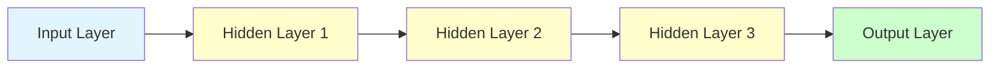

# Deep Learning

**Master neural networks and modern architectures.** From basics to state-of-the-art models including CNNs, RNNs, Transformers, and GANs.

**Difficulty:** 🔴 Advanced | **Time:** 6-8 weeks | **Prerequisites:** [ML Fundamentals](../fundamentals/index.md), Python, Basic Calculus

---

## 🎯 What is Deep Learning?

**Deep learning** uses artificial neural networks with multiple layers to learn hierarchical representations of data. It's revolutionized AI in vision, language, speech, and more.

```mermaid
graph LR
    Input[Input Layer] --> H1[Hidden Layer 1]
    H1 --> H2[Hidden Layer 2]
    H2 --> H3[Hidden Layer 3]
    H3 --> Output[Output Layer]

    style Input fill:#e1f5ff
    style Output fill:#ccffcc
    style H1 fill:#ffffcc
    style H2 fill:#ffffcc
    style H3 fill:#ffffcc
```

**Why Deep Learning?**
- Automatic feature learning (no manual engineering!)
- Handles unstructured data (images, text, audio)
- State-of-the-art performance on many tasks
- Scales with data and compute

---

## 📚 Topics Overview

### Fundamentals
- [Neural Networks Basics](neural-networks-basics.md) 🟡
- [Activation Functions](activation-functions.md) 🟢
- [Backpropagation](backpropagation.md) 🔴

### Computer Vision
- [Convolutional Neural Networks (CNN)](cnn.md) 🔴
- [Transfer Learning](transfer-learning.md) 🟡

### Sequential Data
- [Recurrent Neural Networks (RNN)](rnn.md) 🔴
- [LSTM & GRU](lstm-gru.md) 🔴
- [Transformers](transformers.md) 🔴
- [Attention Mechanisms](attention-mechanisms.md) 🔴

### Generative Models
- [Generative Adversarial Networks (GAN)](gan.md) 🔴

---

## 🎓 Learning Path

### Week 1-2: Foundations
Start with neural network basics, activation functions, and backpropagation.

### Week 3-4: Computer Vision
Learn CNNs and transfer learning for image tasks.

### Week 5-6: Sequential Data
Master RNNs, LSTMs, and attention mechanisms.

### Week 7-8: Advanced Architectures
Dive into Transformers and GANs.

---

## 🚀 Next Steps

**Ready to dive deep?** Start with [Neural Networks Basics](neural-networks-basics.md)! 🧠
