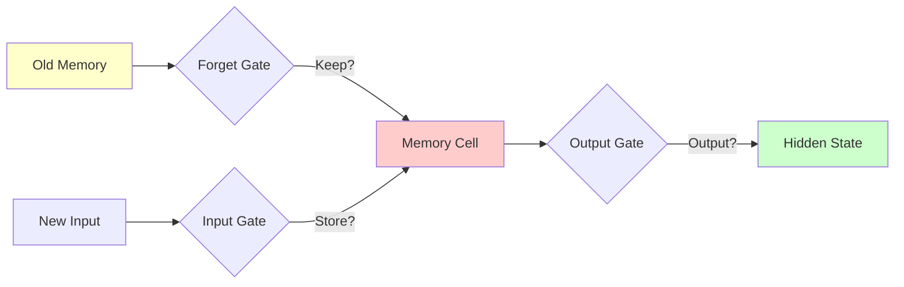
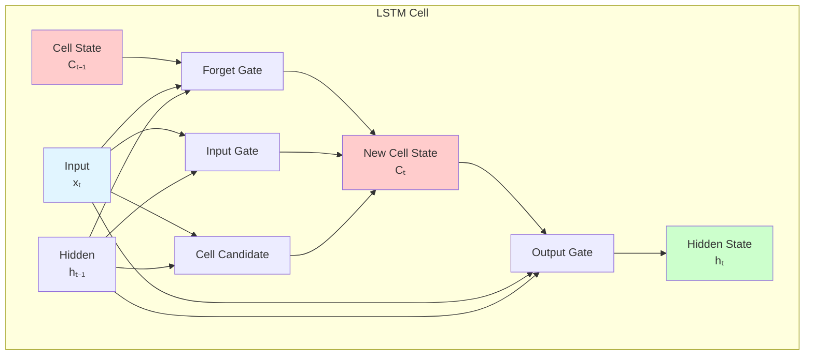
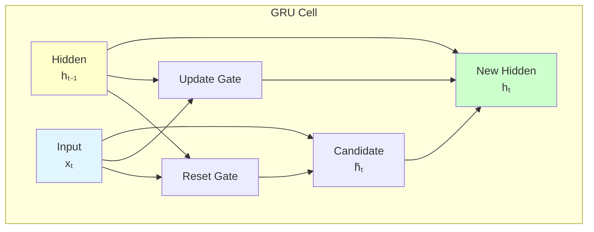

# LSTM & GRU

**Advanced RNN architectures that remember long-term dependencies.** LSTMs and GRUs use gating mechanisms to control information flow, solving the vanishing gradient problem.

**Difficulty:** 🔴 Advanced | **Time:** 5-6 hours | **Prerequisites:** [RNN](rnn.md), [Backpropagation](backpropagation.md)

---

## Overview

Long Short-Term Memory (LSTM) and Gated Recurrent Unit (GRU) are advanced recurrent neural network architectures designed to capture long-term dependencies in sequential data. They use gates to control what information to keep, update, or forget, enabling them to learn patterns across much longer sequences than vanilla RNNs.

**Use cases:** Machine translation, speech recognition, long document processing, time series with long-term patterns, video captioning

---

## Intuition 💡

### The Problem with Vanilla RNNs

Regular RNNs suffer from **vanishing gradients** - they can't remember information from many time steps ago:

```
Time:    t=0      t=1      t=2      ...      t=100
Signal:  STRONG → medium → weak    ...      vanished ❌
```

### The LSTM/GRU Solution

Think of memory like a conveyor belt with gates:
- **Forget Gate:** "Should I erase old information?"
- **Input Gate:** "Should I write new information?"
- **Output Gate:** "What should I output?"



### Real-World Analogy

Imagine taking notes while reading a long book:
- **Forget Gate:** "This detail isn't important anymore, erase it"
- **Input Gate:** "This is crucial, write it down!"
- **Output Gate:** "When answering, use these notes"

LSTMs maintain a "notebook" (cell state) that can store information indefinitely!

---

## LSTM Architecture

### LSTM Cell Components



### Mathematical Foundation

**1. Forget Gate:** Decides what to remove from cell state

$$f_t = \sigma(W_f \cdot [h_{t-1}, x_t] + b_f)$$

Output: 0 (forget completely) to 1 (keep everything)

**2. Input Gate:** Decides what new information to store

$$i_t = \sigma(W_i \cdot [h_{t-1}, x_t] + b_i)$$
$$\tilde{C}_t = \tanh(W_C \cdot [h_{t-1}, x_t] + b_C)$$

**3. Update Cell State:** Combine forget and input

$$C_t = f_t \odot C_{t-1} + i_t \odot \tilde{C}_t$$

Where $\odot$ is element-wise multiplication.

**4. Output Gate:** Decides what to output

$$o_t = \sigma(W_o \cdot [h_{t-1}, x_t] + b_o)$$
$$h_t = o_t \odot \tanh(C_t)$$

### Key Insight: The Highway

Cell state $C_t$ flows through time with **minimal** transformations:

```
C₀ → [×f₁ +i₁] → C₁ → [×f₂ +i₂] → C₂ → ... → C₁₀₀
```

Gradients can flow backward easily through this "highway"!

---

## GRU Architecture

### Simplified Design

GRU (Gated Recurrent Unit) is a simpler alternative to LSTM with fewer parameters:



### Mathematical Foundation

**1. Reset Gate:** Decides how much past info to forget

$$r_t = \sigma(W_r \cdot [h_{t-1}, x_t] + b_r)$$

**2. Update Gate:** Decides mix of old vs new

$$z_t = \sigma(W_z \cdot [h_{t-1}, x_t] + b_z)$$

**3. Candidate Hidden State:**

$$\tilde{h}_t = \tanh(W_h \cdot [r_t \odot h_{t-1}, x_t] + b_h)$$

**4. Final Hidden State:** Interpolate between old and new

$$h_t = (1 - z_t) \odot h_{t-1} + z_t \odot \tilde{h}_t$$

### LSTM vs GRU

| Feature | LSTM | GRU |
|---------|------|-----|
| **Gates** | 3 (forget, input, output) | 2 (reset, update) |
| **State** | Cell state + hidden state | Hidden state only |
| **Parameters** | More (4 weight matrices) | Fewer (3 weight matrices) |
| **Speed** | Slower | Faster |
| **Performance** | Better on complex tasks | Comparable on many tasks |
| **When to use** | Long sequences, complex patterns | Faster training, simpler tasks |

---

## When to Use ✅ / When to Avoid ❌

### ✅ Good For

| Scenario | Why It Works |
|----------|--------------|
| **Long sequences** | Designed to remember long-term dependencies |
| **Complex temporal patterns** | Gates enable sophisticated pattern learning |
| **Variable-length inputs** | Handles sequences of any length |
| **Speech/audio** | Captures long-range audio patterns |
| **Long documents** | Processes entire paragraphs/documents |
| **Time series** | Learns seasonal patterns, trends |

**Examples:**
- Machine translation (entire sentences)
- Speech recognition (long utterances)
- Video captioning (multi-second clips)
- Stock prediction (monthly patterns)
- Music generation (melodies with structure)

### ❌ Not Good For

| Scenario | Why It Fails |
|----------|--------------|
| **Very long sequences (>1000 steps)** | Still struggles, use Transformers |
| **Parallel processing** | Sequential nature prevents parallelization |
| **Non-sequential data** | No temporal structure (use feedforward) |
| **Real-time low latency** | Slower than simpler models |

**When to use instead:**
- Very long sequences: Transformers
- Parallel processing: Transformers, CNNs
- Non-sequential: Feedforward networks
- Speed critical: Simpler models, GRU over LSTM

---

## Implementation

### LSTM with Keras

```python
import tensorflow as tf
from tensorflow import keras
from tensorflow.keras import layers
import numpy as np
import matplotlib.pyplot as plt

print("=" * 60)
print("LSTM with Keras - IMDB Sentiment Analysis")
print("=" * 60)

# Load data
max_features = 10000
maxlen = 200

(X_train, y_train), (X_test, y_test) = keras.datasets.imdb.load_data(
    num_words=max_features
)

# Pad sequences
X_train = keras.preprocessing.sequence.pad_sequences(X_train, maxlen=maxlen)
X_test = keras.preprocessing.sequence.pad_sequences(X_test, maxlen=maxlen)

print(f"Training samples: {len(X_train)}")
print(f"Test samples: {len(X_test)}")

# Build LSTM model
model = keras.Sequential([
    # Embedding layer
    layers.Embedding(max_features, 128, input_length=maxlen),

    # LSTM layers
    layers.LSTM(128, return_sequences=True, dropout=0.2),
    layers.LSTM(64, dropout=0.2),

    # Output
    layers.Dense(1, activation='sigmoid')
])

model.summary()

# Compile
model.compile(
    optimizer='adam',
    loss='binary_crossentropy',
    metrics=['accuracy']
)

# Train
history = model.fit(
    X_train, y_train,
    batch_size=128,
    epochs=5,
    validation_split=0.2,
    verbose=1
)

# Evaluate
test_loss, test_acc = model.evaluate(X_test, y_test, verbose=0)
print(f"\nTest Accuracy: {test_acc:.4f}")

# Plot
fig, (ax1, ax2) = plt.subplots(1, 2, figsize=(14, 5))

ax1.plot(history.history['loss'], label='Train')
ax1.plot(history.history['val_loss'], label='Validation')
ax1.set_title('Loss')
ax1.legend()
ax1.grid(True)

ax2.plot(history.history['accuracy'], label='Train')
ax2.plot(history.history['val_accuracy'], label='Validation')
ax2.set_title('Accuracy')
ax2.legend()
ax2.grid(True)

plt.tight_layout()
plt.show()
```

### GRU with Keras

```python
# GRU model - simpler and faster than LSTM
model_gru = keras.Sequential([
    layers.Embedding(max_features, 128, input_length=maxlen),

    # GRU layers (fewer parameters than LSTM)
    layers.GRU(128, return_sequences=True, dropout=0.2),
    layers.GRU(64, dropout=0.2),

    layers.Dense(1, activation='sigmoid')
])

model_gru.summary()

# Compile and train
model_gru.compile(
    optimizer='adam',
    loss='binary_crossentropy',
    metrics=['accuracy']
)

history_gru = model_gru.fit(
    X_train, y_train,
    batch_size=128,
    epochs=5,
    validation_split=0.2,
    verbose=1
)

test_loss_gru, test_acc_gru = model_gru.evaluate(X_test, y_test, verbose=0)
print(f"\nGRU Test Accuracy: {test_acc_gru:.4f}")
print(f"LSTM Test Accuracy: {test_acc:.4f}")
```

### LSTM with PyTorch

```python
import torch
import torch.nn as nn
import torch.optim as optim
from torch.utils.data import DataLoader, TensorDataset

class LSTMModel(nn.Module):
    """LSTM model in PyTorch"""

    def __init__(self, vocab_size, embedding_dim, hidden_dim, output_dim, n_layers=2, dropout=0.2):
        super(LSTMModel, self).__init__()

        self.embedding = nn.Embedding(vocab_size, embedding_dim)
        self.lstm = nn.LSTM(
            embedding_dim,
            hidden_dim,
            num_layers=n_layers,
            batch_first=True,
            dropout=dropout if n_layers > 1 else 0
        )
        self.fc = nn.Linear(hidden_dim, output_dim)
        self.dropout = nn.Dropout(dropout)
        self.sigmoid = nn.Sigmoid()

    def forward(self, x):
        # Embedding
        embedded = self.dropout(self.embedding(x))

        # LSTM
        lstm_out, (hidden, cell) = self.lstm(embedded)

        # Take output from last time step
        output = self.fc(hidden[-1])
        output = self.sigmoid(output)

        return output

# Create model
device = torch.device('cuda' if torch.cuda.is_available() else 'cpu')
model = LSTMModel(
    vocab_size=max_features,
    embedding_dim=128,
    hidden_dim=128,
    output_dim=1,
    n_layers=2,
    dropout=0.2
).to(device)

print(model)

# Loss and optimizer
criterion = nn.BCELoss()
optimizer = optim.Adam(model.parameters())

# Convert to PyTorch tensors
X_train_t = torch.LongTensor(X_train)
y_train_t = torch.FloatTensor(y_train).unsqueeze(1)
X_test_t = torch.LongTensor(X_test)
y_test_t = torch.FloatTensor(y_test).unsqueeze(1)

# Create data loaders
train_dataset = TensorDataset(X_train_t, y_train_t)
train_loader = DataLoader(train_dataset, batch_size=128, shuffle=True)

# Training
epochs = 5
for epoch in range(epochs):
    model.train()
    total_loss = 0

    for batch_X, batch_y in train_loader:
        batch_X, batch_y = batch_X.to(device), batch_y.to(device)

        # Forward pass
        outputs = model(batch_X)
        loss = criterion(outputs, batch_y)

        # Backward pass
        optimizer.zero_grad()
        loss.backward()
        optimizer.step()

        total_loss += loss.item()

    print(f"Epoch {epoch+1}/{epochs}, Loss: {total_loss/len(train_loader):.4f}")

# Evaluate
model.eval()
with torch.no_grad():
    outputs = model(X_test_t.to(device))
    predictions = (outputs > 0.5).float()
    accuracy = (predictions.cpu() == y_test_t).float().mean()
    print(f"\nTest Accuracy: {accuracy:.4f}")
```

### Bidirectional LSTM

Process sequence in both directions:

```python
# Bidirectional LSTM - sees future context too!
model_bidirectional = keras.Sequential([
    layers.Embedding(max_features, 128, input_length=maxlen),

    # Bidirectional wrapper
    layers.Bidirectional(layers.LSTM(64, return_sequences=True)),
    layers.Bidirectional(layers.LSTM(32)),

    layers.Dense(1, activation='sigmoid')
])

model_bidirectional.summary()
```

**When to use:** When you have access to full sequence (not streaming)

---

## Visualization

### Gate Activations

```python
def visualize_gate_activations(model, sequence):
    """Visualize LSTM gate activations over time"""
    # Create model that outputs gate activations
    # This requires custom LSTM implementation or hooks

    # Simplified: visualize hidden states
    from tensorflow.keras import Model

    # Get LSTM layer outputs
    lstm_layer = model.layers[1]  # Assuming LSTM is second layer
    intermediate_model = Model(
        inputs=model.input,
        outputs=lstm_layer.output
    )

    # Get activations
    activations = intermediate_model.predict(sequence)

    # Plot
    plt.figure(figsize=(14, 6))
    plt.imshow(activations[0].T, cmap='viridis', aspect='auto')
    plt.colorbar(label='Activation')
    plt.xlabel('Time Step')
    plt.ylabel('Hidden Unit')
    plt.title('LSTM Hidden State Evolution')
    plt.show()

# Visualize for a test sequence
test_sequence = X_test[0:1]
visualize_gate_activations(model, test_sequence)
```

### Attention Heatmap

```python
def plot_attention(attention_weights, input_sequence, output_sequence):
    """Visualize attention weights"""
    fig, ax = plt.subplots(figsize=(12, 8))

    im = ax.imshow(attention_weights, cmap='viridis')

    ax.set_xticks(range(len(input_sequence)))
    ax.set_yticks(range(len(output_sequence)))
    ax.set_xticklabels(input_sequence, rotation=45)
    ax.set_yticklabels(output_sequence)

    plt.colorbar(im, label='Attention Weight')
    plt.xlabel('Input Sequence')
    plt.ylabel('Output Sequence')
    plt.title('Attention Weights Heatmap')
    plt.tight_layout()
    plt.show()
```

---

## Complexity Analysis

### Time Complexity

**LSTM Forward Pass:**
- Per time step: $O(d_h^2 + d_x \cdot d_h)$
- Total: $O(T \cdot (4d_h^2 + 4d_x \cdot d_h))$ (4 gates)

**GRU Forward Pass:**
- Per time step: $O(d_h^2 + d_x \cdot d_h)$
- Total: $O(T \cdot (3d_h^2 + 3d_x \cdot d_h))$ (3 gates)

GRU is about **25% faster** than LSTM!

### Space Complexity

**LSTM:**
- Parameters: $4 \times (d_h \cdot d_x + d_h^2 + d_h)$
- Memory: $O(T \cdot d_h)$ (store states for backprop)

**GRU:**
- Parameters: $3 \times (d_h \cdot d_x + d_h^2 + d_h)$
- **25% fewer parameters** than LSTM

---

## Common Pitfalls

### 1. Overfitting on Small Datasets

!!! warning "LSTMs Have Many Parameters"
    **Problem:** Easy to overfit with limited data.

    **Solutions:**
    - Dropout (between layers and within LSTM)
    - Reduce hidden size
    - Early stopping
    - Data augmentation

    ```python
    # Add dropout
    layers.LSTM(128, dropout=0.2, recurrent_dropout=0.2)
    ```

### 2. Exploding Gradients

!!! warning "Still Possible Despite Design"
    **Solution:** Gradient clipping

    ```python
    # Keras
    optimizer = keras.optimizers.Adam(clipnorm=1.0)

    # PyTorch
    torch.nn.utils.clip_grad_norm_(model.parameters(), max_norm=1.0)
    ```

### 3. Slow Training

!!! warning "More Complex Than Vanilla RNN"
    **Problem:** 3-4x slower than simple RNN.

    **Solutions:**
    - Use GRU instead (faster)
    - Reduce hidden size
    - Use CuDNN-optimized implementations
    - Batch more aggressively

### 4. Forgetting to Reset State

!!! warning "Stateful RNNs Need Manual Reset"
    **Problem:** In stateful RNNs, states carry over between batches.

    **Solution:** Reset states when starting new sequence

    ```python
    # Keras stateful LSTM
    model = keras.Sequential([
        layers.LSTM(128, stateful=True, batch_input_shape=(batch_size, timesteps, features))
    ])

    # Reset states between sequences
    model.reset_states()
    ```

---

## Practice Problems

### 🟢 Beginner

!!! example "Problem 1: Name Classification"
    Build LSTM to classify names into language of origin.
    - Input: Character sequence
    - Output: Language (English, Spanish, etc.)
    - Compare LSTM vs GRU performance

!!! example "Problem 2: Text Generation"
    Train character-level LSTM on Shakespeare.
    - Generate new text by sampling
    - Experiment with temperature
    - How coherent is the output?

### 🟡 Intermediate

!!! example "Problem 3: Sequence-to-Sequence"
    Build encoder-decoder LSTM for date format conversion.
    - Input: "May 3, 2023"
    - Output: "2023-05-03"
    - Handle various input formats

!!! example "Problem 4: Stock Price Prediction"
    Predict stock prices using LSTM.
    - Multiple features (open, high, low, volume)
    - Predict multiple steps ahead
    - Compare with simple RNN and GRU

### 🔴 Advanced

!!! example "Problem 5: Machine Translation"
    Implement neural machine translation.
    - Encoder-decoder with attention
    - Bidirectional encoder
    - Beam search for decoding

!!! example "Problem 6: Video Captioning"
    Generate captions for videos.
    - CNN (spatial) + LSTM (temporal)
    - Extract frame features with pretrained CNN
    - Generate natural language descriptions

---

## Real-World Applications

1. **Machine Translation:** Google Translate uses LSTM-based models
2. **Speech Recognition:** Transcribe audio to text (Siri, Alexa)
3. **Handwriting Recognition:** Convert handwritten text to digital
4. **Music Generation:** Compose melodies with structure
5. **Video Captioning:** Describe video content automatically
6. **Question Answering:** Understand and answer questions
7. **Stock Trading:** Predict market trends
8. **Healthcare:** Patient monitoring, disease progression

---

## Related Topics

- [RNN](rnn.md) - Foundation and motivation
- [Transformers](transformers.md) - Modern alternative
- [Attention Mechanisms](attention-mechanisms.md) - Enhance LSTMs
- [Backpropagation](backpropagation.md) - Training algorithm
- Sequence-to-Sequence - Encoder-decoder models
- Word Embeddings - Text representation

---

## References

1. **Paper:** [LSTM - Hochreiter & Schmidhuber (1997)](https://www.bioinf.jku.at/publications/older/2604.pdf)
2. **Paper:** [GRU - Cho et al. (2014)](https://arxiv.org/abs/1406.1078)
3. **Blog:** [Understanding LSTM Networks](https://colah.github.io/posts/2015-08-Understanding-LSTMs/) by Christopher Olah
4. **Paper:** [Empirical Evaluation - Chung et al. (2014)](https://arxiv.org/abs/1412.3555)
5. **Course:** [Stanford CS224n - LSTMs](http://web.stanford.edu/class/cs224n/)
6. **Tutorial:** [LSTM by Example](https://machinelearningmastery.com/understanding-stateful-lstm-recurrent-neural-networks-python-keras/)

---

**Next Steps:**
- Learn [Attention Mechanisms](attention-mechanisms.md) to focus on relevant parts
- Explore [Transformers](transformers.md) as modern alternative
- Build seq2seq models for translation tasks
- Master [Transfer Learning](transfer-learning.md) with pretrained language models

**Ready to conquer long sequences?** Start building LSTMs! 🚀
