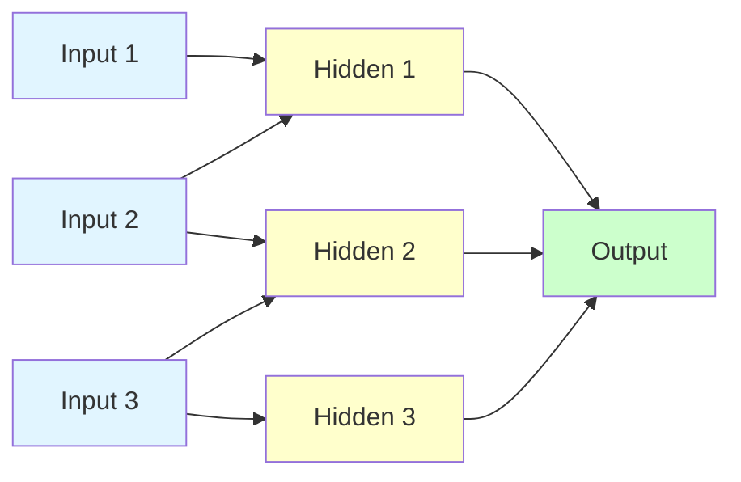
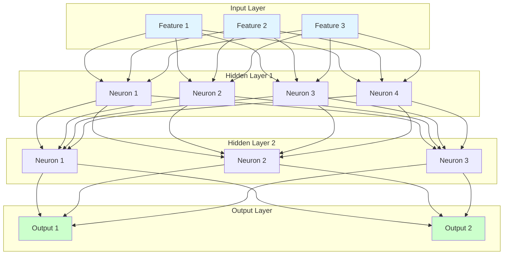

# Neural Networks Basics

**Learn how artificial neurons work together to solve complex problems.** Neural networks are the foundation of deep learning - inspired by the brain, powered by mathematics.

**Difficulty:** 🟡 Intermediate | **Time:** 3-4 hours | **Prerequisites:** Python, Linear Algebra, Calculus Basics

---

## Overview

Neural networks are computational models composed of interconnected nodes (neurons) organized in layers. They learn to map inputs to outputs by adjusting connection weights through training, enabling them to capture complex, non-linear patterns in data.

**Use cases:** Image recognition, natural language processing, speech recognition, game playing, prediction tasks

---

## Intuition 💡

### The Big Idea

Think of a neural network as a team of simple decision-makers working together. Each neuron receives inputs, processes them, and passes results to the next layer. Through training, they learn which features matter for making accurate predictions.



### Real-World Analogy

Think of recognizing a cat in a photo:
- **Layer 1 (Eyes):** Detects edges and basic shapes
- **Layer 2 (Pattern Recognition):** Combines edges into ears, whiskers, paws
- **Layer 3 (High-level Understanding):** Combines patterns to identify "this is a cat"
- **Output:** Confidence score: "95% sure it's a cat"

Each layer learns increasingly complex features automatically!

### Biological Inspiration

```
Biological Neuron          →    Artificial Neuron
─────────────────                ─────────────────
Dendrites (inputs)         →    Input features (x₁, x₂, ...)
Cell body (processing)     →    Weighted sum + bias
Axon (output)              →    Activation function
Synapses (connections)     →    Weights (w₁, w₂, ...)
```

---

## When to Use ✅ / When to Avoid ❌

### ✅ Good For

| Scenario | Why It Works |
|----------|--------------|
| **Complex patterns** | Can learn non-linear relationships that simpler models miss |
| **Large datasets** | Performance improves with more data |
| **Unstructured data** | Images, text, audio - features learned automatically |
| **High-dimensional data** | Handles thousands of input features |
| **Feature learning** | No manual feature engineering needed |
| **Approximation** | Universal function approximators |

**Examples:**
- Image classification (recognizing objects)
- Speech recognition (converting audio to text)
- Language translation (English to Spanish)
- Game playing (chess, Go)
- Recommendation systems

### ❌ Not Good For

| Scenario | Why It Fails |
|----------|--------------|
| **Small datasets** | Needs lots of data, otherwise overfits |
| **Interpretability required** | Black box - hard to explain predictions |
| **Simple linear problems** | Overkill - use linear regression instead |
| **Real-time constraints** | Can be slow for inference |
| **Limited compute** | Training requires GPUs for large models |
| **Guaranteed convergence** | May get stuck in local minima |

**When to use instead:**
- Small data: Decision Trees, SVMs, Linear Models
- Interpretability: Linear Models, Decision Trees
- Simple problems: Linear/Logistic Regression
- Tabular data: Random Forests, XGBoost

---

## Architecture

### Basic Components



### Single Neuron (Perceptron)

A neuron performs two operations:
1. **Weighted Sum:** Combines inputs with weights
2. **Activation:** Applies non-linear function

```
       x₁ ──w₁──┐
       x₂ ──w₂──┤
       x₃ ──w₃──┼──> Σ(wᵢxᵢ + b) ──> Activation ──> Output
       x₄ ──w₄──┤
        b ──────┘
```

### Layer Types

1. **Input Layer:** Receives raw data (no computation)
2. **Hidden Layers:** Transform data through weighted connections
3. **Output Layer:** Produces final predictions

---

## Mathematical Foundation

### Forward Propagation

For a single neuron:

$$z = \sum_{i=1}^{n} w_i x_i + b = \mathbf{w}^T \mathbf{x} + b$$

$$a = g(z)$$

Where:
- $\mathbf{x}$ = input vector
- $\mathbf{w}$ = weight vector
- $b$ = bias (shifts activation)
- $z$ = pre-activation (weighted sum)
- $g$ = activation function
- $a$ = activation (output)

### Matrix Form (Full Layer)

For layer $l$ with $n^{[l]}$ neurons:

$$\mathbf{Z}^{[l]} = \mathbf{W}^{[l]} \mathbf{A}^{[l-1]} + \mathbf{b}^{[l]}$$

$$\mathbf{A}^{[l]} = g^{[l]}(\mathbf{Z}^{[l]})$$

Where:
- $\mathbf{W}^{[l]}$ = weight matrix (shape: $n^{[l]} \times n^{[l-1]}$)
- $\mathbf{b}^{[l]}$ = bias vector (shape: $n^{[l]} \times 1$)
- $\mathbf{A}^{[l-1]}$ = activations from previous layer

### Loss Functions

**Mean Squared Error (Regression):**

$$L = \frac{1}{m} \sum_{i=1}^{m} (\hat{y}^{(i)} - y^{(i)})^2$$

**Binary Cross-Entropy (Binary Classification):**

$$L = -\frac{1}{m} \sum_{i=1}^{m} [y^{(i)} \log(\hat{y}^{(i)}) + (1-y^{(i)}) \log(1-\hat{y}^{(i)})]$$

**Categorical Cross-Entropy (Multi-class):**

$$L = -\frac{1}{m} \sum_{i=1}^{m} \sum_{j=1}^{k} y_j^{(i)} \log(\hat{y}_j^{(i)})$$

### Common Activation Functions

1. **Sigmoid:** $\sigma(z) = \frac{1}{1 + e^{-z}}$ (output: 0 to 1)
2. **Tanh:** $\tanh(z) = \frac{e^z - e^{-z}}{e^z + e^{-z}}$ (output: -1 to 1)
3. **ReLU:** $\text{ReLU}(z) = \max(0, z)$ (most popular for hidden layers)
4. **Softmax:** $\text{softmax}(z_i) = \frac{e^{z_i}}{\sum_j e^{z_j}}$ (multi-class output)

---

## Implementation

### Simple Neural Network with NumPy

```python
import numpy as np
import matplotlib.pyplot as plt

class NeuralNetwork:
    """Simple 2-layer neural network from scratch"""

    def __init__(self, input_size, hidden_size, output_size, learning_rate=0.01):
        """
        Args:
            input_size: Number of input features
            hidden_size: Number of neurons in hidden layer
            output_size: Number of output neurons
            learning_rate: Step size for gradient descent
        """
        self.lr = learning_rate

        # Initialize weights (Xavier initialization)
        self.W1 = np.random.randn(hidden_size, input_size) * np.sqrt(2.0 / input_size)
        self.b1 = np.zeros((hidden_size, 1))

        self.W2 = np.random.randn(output_size, hidden_size) * np.sqrt(2.0 / hidden_size)
        self.b2 = np.zeros((output_size, 1))

        self.losses = []

    def sigmoid(self, z):
        """Sigmoid activation function"""
        return 1 / (1 + np.exp(-np.clip(z, -500, 500)))  # Clip to prevent overflow

    def sigmoid_derivative(self, a):
        """Derivative of sigmoid"""
        return a * (1 - a)

    def relu(self, z):
        """ReLU activation function"""
        return np.maximum(0, z)

    def relu_derivative(self, z):
        """Derivative of ReLU"""
        return (z > 0).astype(float)

    def forward(self, X):
        """
        Forward propagation

        Args:
            X: Input data (features x samples)

        Returns:
            A2: Output predictions
        """
        # Layer 1
        self.Z1 = np.dot(self.W1, X) + self.b1
        self.A1 = self.relu(self.Z1)

        # Layer 2 (Output)
        self.Z2 = np.dot(self.W2, self.A1) + self.b2
        self.A2 = self.sigmoid(self.Z2)

        return self.A2

    def compute_loss(self, Y, A2):
        """Binary cross-entropy loss"""
        m = Y.shape[1]
        loss = -np.mean(Y * np.log(A2 + 1e-8) + (1 - Y) * np.log(1 - A2 + 1e-8))
        return loss

    def backward(self, X, Y):
        """
        Backpropagation

        Args:
            X: Input data
            Y: True labels
        """
        m = X.shape[1]

        # Output layer gradients
        dZ2 = self.A2 - Y  # Derivative of cross-entropy + sigmoid
        dW2 = (1/m) * np.dot(dZ2, self.A1.T)
        db2 = (1/m) * np.sum(dZ2, axis=1, keepdims=True)

        # Hidden layer gradients
        dA1 = np.dot(self.W2.T, dZ2)
        dZ1 = dA1 * self.relu_derivative(self.Z1)
        dW1 = (1/m) * np.dot(dZ1, X.T)
        db1 = (1/m) * np.sum(dZ1, axis=1, keepdims=True)

        # Update weights
        self.W2 -= self.lr * dW2
        self.b2 -= self.lr * db2
        self.W1 -= self.lr * dW1
        self.b1 -= self.lr * db1

    def train(self, X, Y, epochs=1000, verbose=True):
        """
        Train the neural network

        Args:
            X: Training data (features x samples)
            Y: Training labels (1 x samples)
            epochs: Number of training iterations
            verbose: Print progress
        """
        for epoch in range(epochs):
            # Forward pass
            A2 = self.forward(X)

            # Compute loss
            loss = self.compute_loss(Y, A2)
            self.losses.append(loss)

            # Backward pass
            self.backward(X, Y)

            if verbose and epoch % 100 == 0:
                print(f"Epoch {epoch}/{epochs}, Loss: {loss:.4f}")

        if verbose:
            print(f"Final Loss: {self.losses[-1]:.4f}")

    def predict(self, X):
        """Make predictions"""
        A2 = self.forward(X)
        return (A2 > 0.5).astype(int)

# Example: XOR Problem (classic non-linear problem)
print("=" * 50)
print("XOR Problem - Neural Network from Scratch")
print("=" * 50)

# XOR dataset
X = np.array([[0, 0, 1, 1],
              [0, 1, 0, 1]])
Y = np.array([[0, 1, 1, 0]])  # XOR output

# Create and train network
nn = NeuralNetwork(input_size=2, hidden_size=4, output_size=1, learning_rate=0.5)
nn.train(X, Y, epochs=1000, verbose=True)

# Test predictions
predictions = nn.predict(X)
print("\nPredictions:")
print("Input  | Target | Predicted")
print("-" * 30)
for i in range(X.shape[1]):
    print(f"{X[:, i]} |   {Y[0, i]}    |     {predictions[0, i]}")

# Plot loss curve
plt.figure(figsize=(10, 6))
plt.plot(nn.losses)
plt.xlabel('Epoch')
plt.ylabel('Loss')
plt.title('Training Loss Over Time')
plt.grid(True)
plt.show()
```

### Using Keras (TensorFlow)

```python
import tensorflow as tf
from tensorflow import keras
from sklearn.datasets import make_moons
from sklearn.model_selection import train_test_split
import numpy as np
import matplotlib.pyplot as plt

# Generate non-linear dataset
X, y = make_moons(n_samples=1000, noise=0.2, random_state=42)
X_train, X_test, y_train, y_test = train_test_split(X, y, test_size=0.2, random_state=42)

print("=" * 50)
print("Neural Network with Keras")
print("=" * 50)

# Build model
model = keras.Sequential([
    keras.layers.Input(shape=(2,)),
    keras.layers.Dense(16, activation='relu', name='hidden1'),
    keras.layers.Dense(8, activation='relu', name='hidden2'),
    keras.layers.Dense(1, activation='sigmoid', name='output')
])

# Compile model
model.compile(
    optimizer=keras.optimizers.Adam(learning_rate=0.01),
    loss='binary_crossentropy',
    metrics=['accuracy']
)

# Display architecture
print("\nModel Architecture:")
model.summary()

# Train model
history = model.fit(
    X_train, y_train,
    epochs=50,
    batch_size=32,
    validation_split=0.2,
    verbose=0
)

# Evaluate
test_loss, test_acc = model.evaluate(X_test, y_test, verbose=0)
print(f"\nTest Accuracy: {test_acc:.4f}")
print(f"Test Loss: {test_loss:.4f}")

# Plot training history
fig, (ax1, ax2) = plt.subplots(1, 2, figsize=(14, 5))

# Loss
ax1.plot(history.history['loss'], label='Training Loss')
ax1.plot(history.history['val_loss'], label='Validation Loss')
ax1.set_xlabel('Epoch')
ax1.set_ylabel('Loss')
ax1.set_title('Loss Over Time')
ax1.legend()
ax1.grid(True)

# Accuracy
ax2.plot(history.history['accuracy'], label='Training Accuracy')
ax2.plot(history.history['val_accuracy'], label='Validation Accuracy')
ax2.set_xlabel('Epoch')
ax2.set_ylabel('Accuracy')
ax2.set_title('Accuracy Over Time')
ax2.legend()
ax2.grid(True)

plt.tight_layout()
plt.show()
```

### Using PyTorch

```python
import torch
import torch.nn as nn
import torch.optim as optim
from sklearn.datasets import make_moons
from sklearn.model_selection import train_test_split
import numpy as np
import matplotlib.pyplot as plt

# Generate dataset
X, y = make_moons(n_samples=1000, noise=0.2, random_state=42)
X_train, X_test, y_train, y_test = train_test_split(X, y, test_size=0.2, random_state=42)

# Convert to PyTorch tensors
X_train_t = torch.FloatTensor(X_train)
y_train_t = torch.FloatTensor(y_train).unsqueeze(1)
X_test_t = torch.FloatTensor(X_test)
y_test_t = torch.FloatTensor(y_test).unsqueeze(1)

print("=" * 50)
print("Neural Network with PyTorch")
print("=" * 50)

# Define model
class NeuralNet(nn.Module):
    def __init__(self, input_size, hidden_sizes, output_size):
        super(NeuralNet, self).__init__()
        self.fc1 = nn.Linear(input_size, hidden_sizes[0])
        self.fc2 = nn.Linear(hidden_sizes[0], hidden_sizes[1])
        self.fc3 = nn.Linear(hidden_sizes[1], output_size)
        self.relu = nn.ReLU()
        self.sigmoid = nn.Sigmoid()

    def forward(self, x):
        x = self.relu(self.fc1(x))
        x = self.relu(self.fc2(x))
        x = self.sigmoid(self.fc3(x))
        return x

# Create model
model = NeuralNet(input_size=2, hidden_sizes=[16, 8], output_size=1)
print("\nModel Architecture:")
print(model)

# Loss and optimizer
criterion = nn.BCELoss()
optimizer = optim.Adam(model.parameters(), lr=0.01)

# Training
epochs = 100
losses = []

for epoch in range(epochs):
    # Forward pass
    outputs = model(X_train_t)
    loss = criterion(outputs, y_train_t)

    # Backward pass
    optimizer.zero_grad()
    loss.backward()
    optimizer.step()

    losses.append(loss.item())

    if (epoch + 1) % 10 == 0:
        print(f'Epoch [{epoch+1}/{epochs}], Loss: {loss.item():.4f}')

# Evaluate
with torch.no_grad():
    outputs = model(X_test_t)
    predicted = (outputs > 0.5).float()
    accuracy = (predicted == y_test_t).float().mean()
    print(f'\nTest Accuracy: {accuracy:.4f}')

# Plot loss
plt.figure(figsize=(10, 6))
plt.plot(losses)
plt.xlabel('Epoch')
plt.ylabel('Loss')
plt.title('Training Loss Over Time')
plt.grid(True)
plt.show()
```

---

## Visualization

### Decision Boundary Visualization

```python
def plot_decision_boundary(model, X, y, title="Decision Boundary"):
    """Plot decision boundary for 2D data"""
    # Create mesh
    h = 0.02
    x_min, x_max = X[:, 0].min() - 0.5, X[:, 0].max() + 0.5
    y_min, y_max = X[:, 1].min() - 0.5, X[:, 1].max() + 0.5
    xx, yy = np.meshgrid(np.arange(x_min, x_max, h),
                         np.arange(y_min, y_max, h))

    # Predict on mesh
    mesh_data = np.c_[xx.ravel(), yy.ravel()]

    # For Keras model
    if hasattr(model, 'predict'):
        Z = model.predict(mesh_data, verbose=0)
        Z = (Z > 0.5).astype(int).reshape(xx.shape)
    # For PyTorch model
    else:
        with torch.no_grad():
            mesh_tensor = torch.FloatTensor(mesh_data)
            Z = model(mesh_tensor).numpy()
            Z = (Z > 0.5).astype(int).reshape(xx.shape)

    # Plot
    plt.figure(figsize=(10, 8))
    plt.contourf(xx, yy, Z, alpha=0.4, cmap='RdYlBu')
    plt.scatter(X[:, 0], X[:, 1], c=y, cmap='RdYlBu', edgecolors='black')
    plt.xlabel('Feature 1')
    plt.ylabel('Feature 2')
    plt.title(title)
    plt.colorbar(label='Class')
    plt.show()

# Visualize (for Keras model)
plot_decision_boundary(model, X_test, y_test, "Neural Network Decision Boundary")
```

### Network Architecture Visualization

```python
from tensorflow.keras.utils import plot_model

# Visualize model architecture
plot_model(model, to_file='nn_architecture.png',
           show_shapes=True,
           show_layer_names=True,
           rankdir='LR')  # LR = left to right
```

### Activation Visualization

```python
# Get intermediate layer outputs
layer_outputs = [layer.output for layer in model.layers]
activation_model = keras.Model(inputs=model.input, outputs=layer_outputs)

# Get activations for a sample
sample = X_test[0:1]
activations = activation_model.predict(sample, verbose=0)

# Plot activations
fig, axes = plt.subplots(1, len(activations), figsize=(15, 3))
for i, activation in enumerate(activations):
    axes[i].bar(range(activation.shape[1]), activation[0])
    axes[i].set_title(f'Layer {i+1}')
    axes[i].set_xlabel('Neuron')
    axes[i].set_ylabel('Activation')
plt.tight_layout()
plt.show()
```

---

## Complexity Analysis

### Time Complexity

**Training (per epoch):**

$$O(m \cdot n \cdot h \cdot l)$$

Where:
- $m$ = number of training samples
- $n$ = input features
- $h$ = average neurons per layer
- $l$ = number of layers

**Forward Pass:** $O(n \cdot h \cdot l)$ per sample

**Backward Pass:** Same as forward pass (due to chain rule)

### Space Complexity

**Model Parameters:**

$$O(\sum_{i=1}^{L-1} n_i \cdot n_{i+1})$$

Where $n_i$ is the number of neurons in layer $i$.

**Example:** Network [784, 128, 64, 10]
- Parameters: 784×128 + 128×64 + 64×10 = 109,312 weights

---

## Hyperparameters

| Parameter | What It Does | Typical Range | Tips |
|-----------|--------------|---------------|------|
| **Learning Rate** | Step size for gradient descent | 0.001 - 0.1 | Too high: diverges<br/>Too low: slow convergence |
| **Hidden Layers** | Depth of network | 1 - 5 for most tasks | More layers = more capacity |
| **Neurons per Layer** | Width of network | 16 - 512 | More neurons = more capacity |
| **Batch Size** | Samples per gradient update | 16 - 256 | Smaller: noisy but faster<br/>Larger: stable but slower |
| **Epochs** | Training iterations | 10 - 1000 | Stop when validation loss plateaus |
| **Activation Function** | Non-linearity | ReLU (hidden), Sigmoid/Softmax (output) | ReLU most popular |
| **Initialization** | Initial weights | Xavier, He | Critical for training |

---

## Common Pitfalls

### 1. Poor Weight Initialization

!!! warning "Random vs Smart Initialization"
    **Problem:** Zero or large random weights cause vanishing/exploding gradients.

    **Solution:** Use proper initialization

    ```python
    # Xavier/Glorot (for sigmoid/tanh)
    keras.layers.Dense(128, kernel_initializer='glorot_uniform')

    # He initialization (for ReLU)
    keras.layers.Dense(128, kernel_initializer='he_normal')
    ```

### 2. Vanishing Gradients

!!! warning "Gradients Become Too Small"
    **Problem:** In deep networks, gradients shrink exponentially in early layers.

    **Symptoms:** Early layers don't learn, training stalls

    **Solutions:**
    - Use ReLU instead of sigmoid/tanh
    - Batch normalization
    - Residual connections (ResNet)
    - Gradient clipping

    ```python
    # Use ReLU
    model.add(keras.layers.Dense(128, activation='relu'))

    # Add batch normalization
    model.add(keras.layers.BatchNormalization())
    ```

### 3. Overfitting

!!! warning "Memorizing Training Data"
    **Problem:** Model performs well on training but poor on test data.

    **Solutions:**
    - More training data
    - Dropout layers
    - L2 regularization
    - Early stopping
    - Data augmentation

    ```python
    model = keras.Sequential([
        keras.layers.Dense(128, activation='relu',
                          kernel_regularizer=keras.regularizers.l2(0.01)),
        keras.layers.Dropout(0.5),  # Drop 50% of neurons during training
        keras.layers.Dense(10, activation='softmax')
    ])
    ```

### 4. Wrong Learning Rate

!!! warning "Learning Rate Too High or Too Low"
    **Too High:** Loss explodes, NaN values

    **Too Low:** Training too slow, stuck in local minima

    **Solution:** Use learning rate schedules or adaptive optimizers

    ```python
    # Learning rate decay
    initial_lr = 0.1
    lr_schedule = keras.optimizers.schedules.ExponentialDecay(
        initial_lr, decay_steps=1000, decay_rate=0.9
    )
    optimizer = keras.optimizers.Adam(learning_rate=lr_schedule)

    # Or use learning rate finder
    from tensorflow.keras.callbacks import ReduceLROnPlateau
    reduce_lr = ReduceLROnPlateau(monitor='val_loss', factor=0.5, patience=5)
    model.fit(X_train, y_train, callbacks=[reduce_lr])
    ```

### 5. Not Normalizing Inputs

!!! warning "Features on Different Scales"
    **Problem:** Features with large ranges dominate learning.

    **Solution:** Always normalize inputs

    ```python
    from sklearn.preprocessing import StandardScaler

    scaler = StandardScaler()
    X_train = scaler.fit_transform(X_train)
    X_test = scaler.transform(X_test)
    ```

---

## Practice Problems

### 🟢 Beginner

!!! example "Problem 1: Binary Classification"
    Implement a 2-layer neural network from scratch to classify circles vs squares. Use the make_classification dataset.

    **Requirements:**
    - 1 hidden layer with 10 neurons
    - ReLU activation (hidden), Sigmoid (output)
    - Binary cross-entropy loss
    - Achieve >90% accuracy

!!! example "Problem 2: Multi-class Classification"
    Use Keras to build a neural network for the Iris dataset (3 classes).

    **Requirements:**
    - 2 hidden layers
    - Use softmax output
    - Plot training history

### 🟡 Intermediate

!!! example "Problem 3: Hyperparameter Tuning"
    Build a neural network for MNIST digit classification. Experiment with:
    - Number of layers (1-4)
    - Neurons per layer (32, 64, 128, 256)
    - Learning rates (0.001, 0.01, 0.1)

    **Goal:** Find best configuration to maximize accuracy.

!!! example "Problem 4: Regularization Comparison"
    Train three models on the same dataset:
    - No regularization
    - With dropout (0.3)
    - With L2 regularization (0.01)

    Compare overfitting behavior on validation set.

### 🔴 Advanced

!!! example "Problem 5: Custom Training Loop"
    Implement a complete training pipeline in PyTorch with:
    - Custom data loader
    - Learning rate scheduling
    - Early stopping
    - Model checkpointing
    - Gradient clipping
    - TensorBoard logging

!!! example "Problem 6: Network Architecture Search"
    Implement a simple neural architecture search:
    - Define search space (layers, neurons, activations)
    - Try random configurations
    - Track validation performance
    - Find optimal architecture automatically

---

## Real-World Applications

1. **Computer Vision:** Image classification, object detection, facial recognition
2. **Natural Language Processing:** Sentiment analysis, text classification, chatbots
3. **Healthcare:** Disease diagnosis, drug discovery, medical image analysis
4. **Finance:** Credit scoring, fraud detection, algorithmic trading
5. **Autonomous Systems:** Self-driving cars, robotics, game AI
6. **Recommendation Systems:** Netflix, YouTube, e-commerce
7. **Speech Recognition:** Virtual assistants (Siri, Alexa)
8. **Manufacturing:** Quality control, predictive maintenance

---

## Related Topics

- [Activation Functions](activation-functions.md) - Deep dive into non-linearities
- [Backpropagation](backpropagation.md) - How networks learn
- [Convolutional Neural Networks](cnn.md) - For images
- [Recurrent Neural Networks](rnn.md) - For sequences
- [Optimization](../optimization/index.md) - Training techniques
- [Regularization](../fundamentals/regularization.md) - Prevent overfitting

---

## References

1. **Deep Learning Book:** [Goodfellow, Bengio, Courville](https://www.deeplearningbook.org/)
2. **Neural Networks and Deep Learning:** [Michael Nielsen](http://neuralnetworksanddeeplearning.com/)
3. **Stanford CS231n:** [Convolutional Neural Networks](http://cs231n.stanford.edu/)
4. **Fast.ai Course:** [Practical Deep Learning](https://www.fast.ai/)
5. **3Blue1Brown:** [Neural Network Visualization](https://www.youtube.com/watch?v=aircAruvnKk)
6. **Papers:**
   - [Universal Function Approximation](https://cognitivemedium.com/magic_paper/assets/Hornik.pdf)
   - [Deep Learning - LeCun et al. (Nature, 2015)](https://www.nature.com/articles/nature14539)

---

**Next Steps:**
- Master [Activation Functions](activation-functions.md) and their properties
- Learn [Backpropagation](backpropagation.md) algorithm in detail
- Explore [CNNs](cnn.md) for computer vision tasks
- Practice on real datasets from [Kaggle](https://www.kaggle.com/)

**Ready to build your first neural network?** Start with the XOR problem above! 🧠
