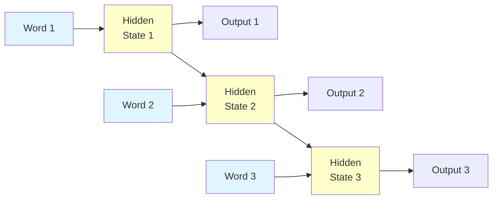
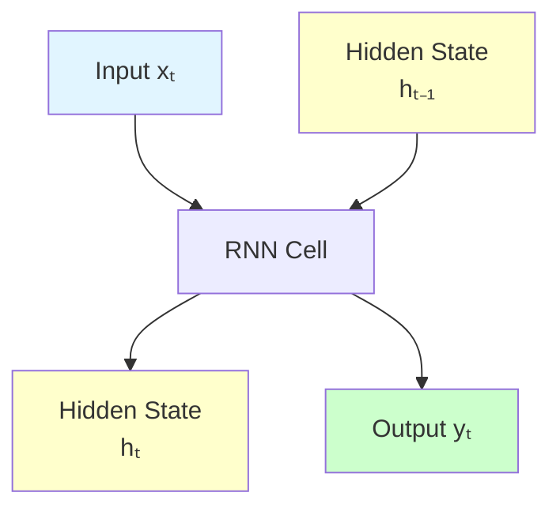

# Recurrent Neural Networks (RNN)

**Process sequential data by maintaining memory of previous inputs.** RNNs are neural networks with loops, enabling them to persist information across time steps.

**Difficulty:** 🔴 Advanced | **Time:** 4-5 hours | **Prerequisites:** [Neural Networks Basics](neural-networks-basics.md), [Backpropagation](backpropagation.md)

---

## Overview

Recurrent Neural Networks (RNNs) are specialized neural networks designed for sequential data. Unlike feedforward networks, RNNs have connections that loop back on themselves, creating an internal memory that captures information about previous inputs in the sequence.

**Use cases:** Natural language processing, time series prediction, speech recognition, music generation, video analysis, machine translation

---

## Intuition 💡

### The Big Idea

Imagine reading a sentence word by word. To understand "bank," you need context from previous words:
- "I went to the **bank** to deposit money" → Financial institution
- "I sat by the river **bank** to relax" → Riverside

RNNs maintain a "memory" (hidden state) that captures context from previous time steps!



### Real-World Analogy

Think of RNN as reading a book:
- **Regular Neural Network:** Looks at each page independently (no memory)
- **RNN:** Remembers what happened in previous pages
  - Page 1: "John entered the house"
  - Page 2: "He turned on the lights" ← knows "he" refers to John
  - Page 3: "He sat down" ← still remembers John from page 1

### The Loop Unrolled

RNNs have a deceptively simple structure:

```
       ┌─────────┐
    ───┤   RNN   ├───
       └─────────┘
           ↑
           │ (loop)
```

When "unrolled" through time:

```
x₀ → [RNN] → h₀ → [RNN] → h₁ → [RNN] → h₂
              ↓             ↓             ↓
              y₀            y₁            y₂
```

Each time step shares the same weights!

---

## When to Use ✅ / When to Avoid ❌

### ✅ Good For

| Scenario | Why It Works |
|----------|--------------|
| **Sequential data** | Natural handling of ordered sequences |
| **Variable-length inputs** | Can process sequences of any length |
| **Temporal dependencies** | Captures patterns over time |
| **Context matters** | Maintains memory of previous inputs |
| **Ordered data** | Time series, text, audio, video |

**Examples:**
- Language modeling (predict next word)
- Machine translation (English → Spanish)
- Speech recognition (audio → text)
- Time series forecasting (stock prices)
- Video analysis (action recognition)
- Music generation

### ❌ Not Good For

| Scenario | Why It Fails |
|----------|--------------|
| **Long sequences** | Vanishing gradient problem (use LSTM/GRU) |
| **Independent samples** | No sequential relationship (use feedforward) |
| **Very long-term dependencies** | Can't remember far back (use Transformers) |
| **Parallel processing** | Sequential nature prevents parallelization |
| **Tabular data** | No sequential structure |

**When to use instead:**
- Long sequences: LSTM, GRU, Transformers
- Independent data: Regular neural networks, CNNs
- Very long context: Transformers (attention mechanism)

---

## Architecture

### Basic RNN Cell

A single RNN cell at time step $t$:



### Unrolled RNN

```mermaid
graph LR
    subgraph t=0
        X0[x₀]
        H0[h₀]
        Y0[y₀]
    end

    subgraph t=1
        X1[x₁]
        H1[h₁]
        Y1[y₁]
    end

    subgraph t=2
        X2[x₂]
        H2[h₂]
        Y2[y₂]
    end

    X0 --> H0
    H0 --> Y0
    H0 --> H1
    X1 --> H1
    H1 --> Y1
    H1 --> H2
    X2 --> H2
    H2 --> Y2

    style X0 fill:#e1f5ff
    style X1 fill:#e1f5ff
    style X2 fill:#e1f5ff
    style Y0 fill:#ccffcc
    style Y1 fill:#ccffcc
    style Y2 fill:#ccffcc
```

### Types of RNN Architectures

1. **One-to-Many:** Image captioning (image → sequence of words)
2. **Many-to-One:** Sentiment analysis (sequence of words → positive/negative)
3. **Many-to-Many (synced):** Video classification (frame-by-frame labels)
4. **Many-to-Many (async):** Machine translation (English → Spanish)

```
One-to-Many:     Many-to-One:     Many-to-Many:
[Input]          [x₀][x₁][x₂]     [x₀][x₁][x₂]
   ↓             ↓   ↓   ↓         ↓   ↓   ↓
[h₀][h₁][h₂]    [h₀][h₁][h₂]     [h₀][h₁][h₂]
 ↓   ↓   ↓              ↓         ↓   ↓   ↓
[y₀][y₁][y₂]          [y₂]       [y₀][y₁][y₂]
```

---

## Mathematical Foundation

### Forward Propagation

At each time step $t$:

**Hidden State Update:**

$$\mathbf{h}_t = \tanh(\mathbf{W}_{hh} \mathbf{h}_{t-1} + \mathbf{W}_{xh} \mathbf{x}_t + \mathbf{b}_h)$$

**Output:**

$$\mathbf{y}_t = \mathbf{W}_{hy} \mathbf{h}_t + \mathbf{b}_y$$

Where:
- $\mathbf{x}_t$ = input at time $t$
- $\mathbf{h}_t$ = hidden state at time $t$
- $\mathbf{h}_{t-1}$ = previous hidden state
- $\mathbf{W}_{xh}$ = input-to-hidden weights
- $\mathbf{W}_{hh}$ = hidden-to-hidden (recurrent) weights
- $\mathbf{W}_{hy}$ = hidden-to-output weights
- $\mathbf{b}_h, \mathbf{b}_y$ = biases

**Key Insight:** Same weights $\mathbf{W}$ used at every time step!

### Backpropagation Through Time (BPTT)

To train RNNs, we "unroll" the network and apply backpropagation across time steps:

1. **Forward pass:** Compute hidden states and outputs for all time steps
2. **Compute loss:** Sum losses across all time steps
3. **Backward pass:** Propagate gradients backwards through time
4. **Update weights:** Use accumulated gradients

**Gradient Flow:**

$$\frac{\partial L}{\partial \mathbf{W}_{hh}} = \sum_{t=1}^{T} \frac{\partial L_t}{\partial \mathbf{W}_{hh}}$$

**Chain Rule:**

$$\frac{\partial \mathbf{h}_t}{\partial \mathbf{h}_{t-1}} = \mathbf{W}_{hh}^T \cdot \text{diag}(1 - \mathbf{h}_t^2)$$

### Vanishing Gradient Problem

When backpropagating through many time steps:

$$\frac{\partial \mathbf{h}_t}{\partial \mathbf{h}_0} = \prod_{i=1}^{t} \frac{\partial \mathbf{h}_i}{\partial \mathbf{h}_{i-1}}$$

If each term < 1 (e.g., tanh derivatives), the product → 0 exponentially!

**Example:** After 10 steps with derivative 0.5 each:
$$0.5^{10} = 0.00098 \approx 0$$

Gradient vanishes! Early time steps don't learn.

---

## Implementation

### Simple RNN with NumPy

```python
import numpy as np

class SimpleRNN:
    """Vanilla RNN from scratch"""

    def __init__(self, input_size, hidden_size, output_size, learning_rate=0.01):
        self.hidden_size = hidden_size

        # Initialize weights (Xavier initialization)
        self.Wxh = np.random.randn(hidden_size, input_size) * 0.01
        self.Whh = np.random.randn(hidden_size, hidden_size) * 0.01
        self.Why = np.random.randn(output_size, hidden_size) * 0.01

        # Biases
        self.bh = np.zeros((hidden_size, 1))
        self.by = np.zeros((output_size, 1))

        self.learning_rate = learning_rate

    def forward(self, inputs, h_prev):
        """
        Forward pass through time

        Args:
            inputs: List of input vectors for each time step
            h_prev: Initial hidden state

        Returns:
            outputs: List of output vectors
            h_states: List of hidden states
        """
        h_states = [h_prev]
        outputs = []

        for x in inputs:
            # Reshape input
            x = x.reshape(-1, 1)

            # Update hidden state
            h = np.tanh(np.dot(self.Wxh, x) + np.dot(self.Whh, h_prev) + self.bh)

            # Compute output
            y = np.dot(self.Why, h) + self.by

            # Store
            h_states.append(h)
            outputs.append(y)

            # Update for next time step
            h_prev = h

        return outputs, h_states

    def backward(self, inputs, targets, h_states):
        """
        Backpropagation through time

        Args:
            inputs: List of input vectors
            targets: List of target vectors
            h_states: List of hidden states from forward pass
        """
        # Initialize gradients
        dWxh = np.zeros_like(self.Wxh)
        dWhh = np.zeros_like(self.Whh)
        dWhy = np.zeros_like(self.Why)
        dbh = np.zeros_like(self.bh)
        dby = np.zeros_like(self.by)

        dh_next = np.zeros_like(h_states[0])
        loss = 0

        # Backward pass
        for t in reversed(range(len(inputs))):
            # Reshape
            x = inputs[t].reshape(-1, 1)
            y_target = targets[t].reshape(-1, 1)
            h = h_states[t + 1]
            h_prev = h_states[t]

            # Output gradient
            y_pred = np.dot(self.Why, h) + self.by
            dy = y_pred - y_target
            loss += np.sum(dy ** 2)

            # Gradients for output layer
            dWhy += np.dot(dy, h.T)
            dby += dy

            # Backprop into h
            dh = np.dot(self.Why.T, dy) + dh_next

            # Backprop through tanh
            dh_raw = (1 - h ** 2) * dh

            # Gradients for hidden layer
            dbh += dh_raw
            dWxh += np.dot(dh_raw, x.T)
            dWhh += np.dot(dh_raw, h_prev.T)

            # Gradient for next iteration
            dh_next = np.dot(self.Whh.T, dh_raw)

        # Clip gradients to prevent exploding gradients
        for dparam in [dWxh, dWhh, dWhy, dbh, dby]:
            np.clip(dparam, -5, 5, out=dparam)

        # Update parameters
        self.Wxh -= self.learning_rate * dWxh
        self.Whh -= self.learning_rate * dWhh
        self.Why -= self.learning_rate * dWhy
        self.bh -= self.learning_rate * dbh
        self.by -= self.learning_rate * dby

        return loss

# Example: Learn to echo input with delay
print("=" * 60)
print("Simple RNN - Echo Task")
print("=" * 60)

# Create simple sequence
seq_length = 10
input_size = 5
hidden_size = 10
output_size = 5

rnn = SimpleRNN(input_size, hidden_size, output_size, learning_rate=0.01)

# Training
for epoch in range(100):
    # Generate random sequence
    inputs = [np.random.randn(input_size) for _ in range(seq_length)]
    # Target: echo input with 1 step delay
    targets = [np.zeros(output_size)] + inputs[:-1]

    # Forward pass
    h_prev = np.zeros((hidden_size, 1))
    outputs, h_states = rnn.forward(inputs, h_prev)

    # Backward pass
    loss = rnn.backward(inputs, targets, h_states)

    if epoch % 10 == 0:
        print(f"Epoch {epoch}, Loss: {loss:.4f}")
```

### RNN with Keras

```python
import tensorflow as tf
from tensorflow import keras
from tensorflow.keras import layers
import numpy as np
import matplotlib.pyplot as plt

print("=" * 60)
print("RNN with Keras - Sentiment Analysis")
print("=" * 60)

# Load IMDB dataset
max_features = 10000  # Vocabulary size
maxlen = 200  # Max sequence length

(X_train, y_train), (X_test, y_test) = keras.datasets.imdb.load_data(
    num_words=max_features
)

# Pad sequences
X_train = keras.preprocessing.sequence.pad_sequences(X_train, maxlen=maxlen)
X_test = keras.preprocessing.sequence.pad_sequences(X_test, maxlen=maxlen)

print(f"Training samples: {len(X_train)}")
print(f"Test samples: {len(X_test)}")
print(f"Sequence length: {X_train.shape[1]}")

# Build RNN model
model = keras.Sequential([
    # Embedding layer
    layers.Embedding(max_features, 128, input_length=maxlen),

    # RNN layer
    layers.SimpleRNN(64, return_sequences=False),

    # Output layer
    layers.Dense(1, activation='sigmoid')
])

print("\n" + "=" * 60)
print("Model Architecture")
print("=" * 60)
model.summary()

# Compile
model.compile(
    optimizer='adam',
    loss='binary_crossentropy',
    metrics=['accuracy']
)

# Train
print("\nTraining RNN...")
history = model.fit(
    X_train, y_train,
    batch_size=128,
    epochs=5,
    validation_split=0.2,
    verbose=1
)

# Evaluate
test_loss, test_acc = model.evaluate(X_test, y_test, verbose=0)
print(f"\nTest Accuracy: {test_acc:.4f}")

# Plot training history
fig, (ax1, ax2) = plt.subplots(1, 2, figsize=(14, 5))

ax1.plot(history.history['loss'], label='Training Loss')
ax1.plot(history.history['val_loss'], label='Validation Loss')
ax1.set_xlabel('Epoch')
ax1.set_ylabel('Loss')
ax1.set_title('Loss Over Time')
ax1.legend()
ax1.grid(True)

ax2.plot(history.history['accuracy'], label='Training Accuracy')
ax2.plot(history.history['val_accuracy'], label='Validation Accuracy')
ax2.set_xlabel('Epoch')
ax2.set_ylabel('Accuracy')
ax2.set_title('Accuracy Over Time')
ax2.legend()
ax2.grid(True)

plt.tight_layout()
plt.show()
```

### RNN with PyTorch

```python
import torch
import torch.nn as nn
import torch.optim as optim
import numpy as np

class RNNModel(nn.Module):
    """RNN model in PyTorch"""

    def __init__(self, input_size, hidden_size, output_size, num_layers=1):
        super(RNNModel, self).__init__()

        self.hidden_size = hidden_size
        self.num_layers = num_layers

        # RNN layer
        self.rnn = nn.RNN(
            input_size,
            hidden_size,
            num_layers,
            batch_first=True,
            nonlinearity='tanh'
        )

        # Output layer
        self.fc = nn.Linear(hidden_size, output_size)

    def forward(self, x, h0=None):
        """
        Forward pass

        Args:
            x: Input tensor (batch, seq_len, input_size)
            h0: Initial hidden state

        Returns:
            out: Output tensor
            h: Final hidden state
        """
        # Initialize hidden state if not provided
        if h0 is None:
            h0 = torch.zeros(self.num_layers, x.size(0), self.hidden_size).to(x.device)

        # RNN forward pass
        out, h = self.rnn(x, h0)

        # Take output from last time step
        out = self.fc(out[:, -1, :])

        return out, h

# Example: Time series prediction
print("\n" + "=" * 60)
print("RNN with PyTorch - Time Series Prediction")
print("=" * 60)

# Generate synthetic time series
def generate_time_series(n_samples=1000, seq_length=50):
    """Generate sine wave time series"""
    X = []
    y = []

    for _ in range(n_samples):
        start = np.random.rand() * 2 * np.pi
        x = np.sin(np.linspace(start, start + 4*np.pi, seq_length))
        X.append(x[:-1])
        y.append(x[-1])

    return np.array(X), np.array(y)

# Generate data
X_train, y_train = generate_time_series(1000, 50)
X_test, y_test = generate_time_series(200, 50)

# Convert to PyTorch tensors
X_train = torch.FloatTensor(X_train).unsqueeze(-1)  # Add feature dimension
y_train = torch.FloatTensor(y_train).unsqueeze(-1)
X_test = torch.FloatTensor(X_test).unsqueeze(-1)
y_test = torch.FloatTensor(y_test).unsqueeze(-1)

print(f"Training data shape: {X_train.shape}")
print(f"Test data shape: {X_test.shape}")

# Create model
model = RNNModel(input_size=1, hidden_size=32, output_size=1, num_layers=2)
print(f"\nModel: {model}")

# Loss and optimizer
criterion = nn.MSELoss()
optimizer = optim.Adam(model.parameters(), lr=0.001)

# Training
epochs = 50
batch_size = 32

for epoch in range(epochs):
    model.train()
    total_loss = 0

    # Mini-batch training
    for i in range(0, len(X_train), batch_size):
        batch_X = X_train[i:i+batch_size]
        batch_y = y_train[i:i+batch_size]

        # Forward pass
        outputs, _ = model(batch_X)
        loss = criterion(outputs, batch_y)

        # Backward pass
        optimizer.zero_grad()
        loss.backward()
        optimizer.step()

        total_loss += loss.item()

    if (epoch + 1) % 10 == 0:
        print(f"Epoch [{epoch+1}/{epochs}], Loss: {total_loss/len(X_train):.6f}")

# Evaluate
model.eval()
with torch.no_grad():
    predictions, _ = model(X_test)
    test_loss = criterion(predictions, y_test)
    print(f"\nTest Loss: {test_loss.item():.6f}")
```

---

## Visualization

### Hidden State Visualization

```python
def visualize_hidden_states(model, sequence):
    """Visualize how hidden state evolves over time"""
    # Get intermediate hidden states
    hidden_states = []

    h = torch.zeros(model.num_layers, 1, model.hidden_size)

    for t in range(sequence.shape[1]):
        x_t = sequence[:, t:t+1, :]
        _, h = model.rnn(x_t, h)
        hidden_states.append(h[-1, 0, :].detach().numpy())

    hidden_states = np.array(hidden_states)

    # Plot
    plt.figure(figsize=(14, 6))
    plt.imshow(hidden_states.T, cmap='viridis', aspect='auto')
    plt.colorbar(label='Activation')
    plt.xlabel('Time Step')
    plt.ylabel('Hidden Unit')
    plt.title('RNN Hidden State Evolution Over Time')
    plt.show()

# Visualize for test sequence
visualize_hidden_states(model, X_test[0:1])
```

---

## Complexity Analysis

### Time Complexity

**Forward Pass:**
- Per time step: $O(d_h^2 + d_x \cdot d_h)$
- Total sequence: $O(T \cdot (d_h^2 + d_x \cdot d_h))$

Where:
- $T$ = sequence length
- $d_h$ = hidden size
- $d_x$ = input size

**Backward Pass (BPTT):**
- Same as forward: $O(T \cdot d_h^2)$

**Problem:** Sequential nature prevents parallelization across time steps!

### Space Complexity

**Memory:** $O(T \cdot d_h)$
- Need to store hidden states for all time steps (for BPTT)

**Parameters:** $O(d_x \cdot d_h + d_h^2 + d_h \cdot d_y)$

---

## Common Pitfalls

### 1. Vanishing Gradients

!!! warning "Can't Learn Long-Term Dependencies"
    **Problem:** Gradients vanish exponentially for long sequences.

    **Symptoms:**
    - Can't remember things from many steps ago
    - Training stalls
    - Only recent inputs affect output

    **Solutions:**
    - Use LSTM or GRU (designed to solve this!)
    - Gradient clipping
    - Shorter sequences
    - Skip connections

    ```python
    # Check gradient magnitudes
    for name, param in model.named_parameters():
        if param.grad is not None:
            print(f"{name}: {param.grad.norm():.6f}")
    ```

### 2. Exploding Gradients

!!! warning "Gradients Become Huge"
    **Problem:** Gradients grow exponentially, causing NaN/Inf.

    **Solution:** Gradient clipping

    ```python
    # In PyTorch
    torch.nn.utils.clip_grad_norm_(model.parameters(), max_norm=5.0)

    # In Keras
    optimizer = keras.optimizers.Adam(clipnorm=5.0)
    ```

### 3. Slow Training

!!! warning "Sequential Processing is Slow"
    **Problem:** Can't parallelize across time steps.

    **Solutions:**
    - Use GPUs (parallel across batch)
    - Truncated BPTT (shorter sequences)
    - Use Transformers (fully parallelizable)

### 4. Variable-Length Sequences

!!! warning "Handling Different Lengths"
    **Problem:** Batches need same sequence length.

    **Solutions:**
    - Padding (add zeros to shorter sequences)
    - Packing (pack_padded_sequence in PyTorch)
    - Dynamic computation graph

    ```python
    # Keras - use masking
    model.add(layers.Masking(mask_value=0.0))
    model.add(layers.SimpleRNN(64))

    # PyTorch - pack sequences
    from torch.nn.utils.rnn import pack_padded_sequence, pad_packed_sequence

    packed = pack_padded_sequence(x, lengths, batch_first=True)
    output, hidden = rnn(packed)
    output, _ = pad_packed_sequence(output, batch_first=True)
    ```

---

## Practice Problems

### 🟢 Beginner

!!! example "Problem 1: Character-Level Language Model"
    Build an RNN to predict the next character in a sequence.
    - Train on a small text corpus
    - Generate new text by sampling predictions
    - What patterns does it learn?

!!! example "Problem 2: Binary Addition"
    Teach an RNN to add two binary numbers.
    - Input: "101 + 011"
    - Output: "1000"
    - Can it learn the carry operation?

### 🟡 Intermediate

!!! example "Problem 3: Sentiment Analysis"
    Build an RNN for movie review sentiment classification.
    - Use word embeddings
    - Handle variable-length sequences
    - Compare with LSTM

!!! example "Problem 4: Time Series Forecasting"
    Predict stock prices or weather data.
    - Use multiple features (multivariate)
    - Predict multiple steps ahead
    - Visualize predictions vs actual

### 🔴 Advanced

!!! example "Problem 5: Sequence-to-Sequence Model"
    Implement basic machine translation.
    - Encoder-decoder architecture
    - Handle variable input/output lengths
    - Add attention mechanism (optional)

!!! example "Problem 6: Music Generation"
    Generate music using RNN.
    - Train on MIDI files
    - Learn note sequences and timing
    - Generate new melodies

---

## Real-World Applications

1. **Natural Language Processing:** Text generation, machine translation, chatbots
2. **Speech Recognition:** Convert audio to text (Google Assistant, Siri)
3. **Time Series Forecasting:** Stock prices, weather, energy demand
4. **Video Analysis:** Action recognition, video captioning
5. **Music Generation:** Compose melodies, harmonies
6. **Anomaly Detection:** Network intrusion, fraud detection
7. **Handwriting Recognition:** Convert handwritten text to digital
8. **Robotics:** Sequential decision making, control

---

## Related Topics

- [LSTM & GRU](lstm-gru.md) - Advanced RNNs that solve vanishing gradient problem
- [Transformers](transformers.md) - Modern alternative with attention
- [Attention Mechanisms](attention-mechanisms.md) - Focus on relevant parts
- [Neural Networks Basics](neural-networks-basics.md) - Foundation
- [Backpropagation](backpropagation.md) - BPTT algorithm
- [Word Embeddings](../nlp/word-embeddings.md) - Representing text for RNNs

---

## References

1. **Original Paper:** [Elman (1990) - Finding Structure in Time](https://crl.ucsd.edu/~elman/Papers/fsit.pdf)
2. **Tutorial:** [The Unreasonable Effectiveness of RNNs](http://karpathy.github.io/2015/05/21/rnn-effectiveness/) by Andrej Karpathy
3. **Paper:** [BPTT - Werbos (1990)](https://ieeexplore.ieee.org/document/58337)
4. **Course:** [Stanford CS224n - RNNs](http://web.stanford.edu/class/cs224n/)
5. **Book:** Deep Learning (Goodfellow et al.) - Chapter 10
6. **Blog:** [Understanding LSTM Networks](https://colah.github.io/posts/2015-08-Understanding-LSTMs/) by Christopher Olah

---

**Next Steps:**
- Master [LSTM & GRU](lstm-gru.md) to handle long-term dependencies
- Learn [Attention Mechanisms](attention-mechanisms.md) to focus on relevant information
- Explore [Transformers](transformers.md) as modern alternative to RNNs
- Build NLP projects with real datasets

**Ready to process sequences?** Start with character-level language modeling! 📝
