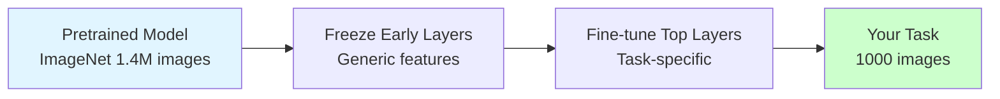

# Transfer Learning

**Leverage pretrained models to solve new tasks with less data and compute.** Transfer learning reuses knowledge from large-scale models, dramatically reducing training time and data requirements.

**Difficulty:** 🟡 Intermediate | **Time:** 3-4 hours | **Prerequisites:** [CNN](cnn.md) or [Transformers](transformers.md)

---

## Overview

Transfer learning uses a model trained on one task as the starting point for a different but related task. Instead of training from scratch, you leverage features learned from massive datasets, then fine-tune for your specific problem.

**Use cases:** Image classification with small datasets, NLP tasks, medical imaging, custom object detection, domain-specific language models

---

## Intuition 💡

### The Big Idea

**Problem:** You want to classify cat breeds but only have 1000 images.

**Solution:**
1. Start with model pretrained on ImageNet (1.4M images, 1000 classes)
2. Early layers already learned edges, textures, patterns
3. Fine-tune last layers for cat breeds specifically

It's like hiring an experienced photographer instead of teaching someone from scratch!



---

## When to Use ✅ / When to Avoid ❌

### ✅ Good For

| Scenario | Why It Works |
|----------|--------------|
| **Small datasets** | Leverage large-scale pretraining |
| **Similar tasks** | Source and target tasks related |
| **Limited compute** | Skip expensive pretraining |
| **Fast prototyping** | Quick baseline in hours vs weeks |
| **Domain adaptation** | Adapt general model to specific domain |

### ❌ Not Good For

| Scenario | Why It Fails |
|----------|--------------|
| **Very different tasks** | Features don't transfer |
| **Abundant data** | Training from scratch may be better |
| **Unique architectures** | Pretrained weights incompatible |

---

## Approaches

### 1. Feature Extraction
Freeze entire pretrained model, use as fixed feature extractor.

```python
from tensorflow import keras

# Load pretrained model
base_model = keras.applications.ResNet50(
    weights='imagenet',
    include_top=False
)

# Freeze all layers
base_model.trainable = False

# Add custom classification head
model = keras.Sequential([
    base_model,
    keras.layers.GlobalAveragePooling2D(),
    keras.layers.Dense(256, activation='relu'),
    keras.layers.Dense(num_classes, activation='softmax')
])
```

### 2. Fine-Tuning
Unfreeze and train some layers with small learning rate.

```python
# Unfreeze last few layers
for layer in base_model.layers[-20:]:
    layer.trainable = True

# Compile with small learning rate
model.compile(
    optimizer=keras.optimizers.Adam(1e-5),  # Small LR!
    loss='categorical_crossentropy',
    metrics=['accuracy']
)
```

### 3. Full Fine-Tuning
Train all layers (with small LR).

---

## Implementation

### Image Classification with Transfer Learning

```python
import tensorflow as tf
from tensorflow import keras
import numpy as np

# Load pretrained ResNet50
base_model = keras.applications.ResNet50(
    weights='imagenet',
    include_top=False,
    input_shape=(224, 224, 3)
)

# Freeze base model
base_model.trainable = False

# Build model
model = keras.Sequential([
    keras.layers.Input(shape=(224, 224, 3)),
    base_model,
    keras.layers.GlobalAveragePooling2D(),
    keras.layers.Dropout(0.5),
    keras.layers.Dense(256, activation='relu'),
    keras.layers.Dropout(0.5),
    keras.layers.Dense(10, activation='softmax')
])

model.compile(
    optimizer='adam',
    loss='categorical_crossentropy',
    metrics=['accuracy']
)

# Train
model.fit(X_train, y_train, epochs=10, validation_data=(X_val, y_val))

# Fine-tune
base_model.trainable = True
model.compile(
    optimizer=keras.optimizers.Adam(1e-5),
    loss='categorical_crossentropy',
    metrics=['accuracy']
)

model.fit(X_train, y_train, epochs=10, validation_data=(X_val, y_val))
```

### NLP with Pretrained Transformers

```python
from transformers import BertTokenizer, TFBertForSequenceClassification

# Load pretrained BERT
tokenizer = BertTokenizer.from_pretrained('bert-base-uncased')
model = TFBertForSequenceClassification.from_pretrained(
    'bert-base-uncased',
    num_labels=2
)

# Tokenize
inputs = tokenizer(texts, padding=True, truncation=True, return_tensors='tf')

# Fine-tune on your task
model.compile(
    optimizer=tf.keras.optimizers.Adam(2e-5),
    loss=tf.keras.losses.SparseCategoricalCrossentropy(from_logits=True),
    metrics=['accuracy']
)

model.fit(inputs, labels, epochs=3)
```

---

## Best Practices

### 1. Learning Rate Strategy
- **Feature extraction:** Normal LR (1e-3)
- **Fine-tuning:** Small LR (1e-5 to 1e-4)
- **Different LR per layer:** Discriminative learning rates

### 2. Data Augmentation
Essential when data is limited!

### 3. Gradual Unfreezing
Unfreeze layers progressively from top to bottom.

### 4. Monitor Overfitting
Small datasets overfit easily - use regularization!

---

## Common Pitfalls

!!! warning "Learning Rate Too High"
    **Problem:** Destroys pretrained weights.
    **Solution:** Use 10-100x smaller LR than training from scratch.

!!! warning "Forgetting to Freeze"
    **Problem:** Updates pretrained weights with random gradients.
    **Solution:** Always set `trainable=False` initially.

!!! warning "Input Size Mismatch"
    **Problem:** Pretrained model expects specific input size.
    **Solution:** Resize images or modify first layer.

---

## Practice Problems

### 🟢 Beginner

!!! example "Problem 1: Image Classification"
    Use ResNet50 pretrained on ImageNet to classify flowers (5 classes).
    Start with frozen base, then fine-tune.

### 🟡 Intermediate

!!! example "Problem 2: Text Classification"
    Fine-tune BERT for sentiment analysis on custom dataset.
    Compare with training from scratch.

### 🔴 Advanced

!!! example "Problem 3: Domain Adaptation"
    Adapt pretrained model from natural images to medical images.
    Experiment with different fine-tuning strategies.

---

## Famous Pretrained Models

**Computer Vision:**
- **ResNet:** 50, 101, 152 layers
- **VGG:** 16, 19 layers
- **EfficientNet:** B0-B7
- **Vision Transformer (ViT)**

**NLP:**
- **BERT:** Bidirectional encoder
- **GPT:** Autoregressive decoder
- **T5:** Text-to-text
- **RoBERTa, ALBERT, DistilBERT**

---

## Real-World Applications

1. **Medical Imaging:** Pretrain on natural images, fine-tune on X-rays/MRIs
2. **Custom Object Detection:** Use YOLO/Faster R-CNN pretrained, adapt to specific objects
3. **Sentiment Analysis:** Fine-tune BERT on domain-specific reviews
4. **Face Recognition:** Use FaceNet embeddings
5. **Document Classification:** Pretrained language models for legal/medical docs

---

## Related Topics

- [CNN](cnn.md) - Image models for transfer
- [Transformers](transformers.md) - Language models for transfer
- [Neural Networks Basics](neural-networks-basics.md) - Foundation
- Data Augmentation - Essential for small data

---

## References

1. **Paper:** [How transferable are features in deep neural networks?](https://arxiv.org/abs/1411.1792)
2. **Paper:** [Transfer Learning](https://www.cse.ust.hk/~qyang/Docs/2009/tkde_transfer_learning.pdf) by Pan & Yang
3. **Library:** [Hugging Face Transformers](https://huggingface.co/transformers/)
4. **Library:** [TensorFlow Hub](https://tfhub.dev/)
5. **Tutorial:** [Fast.ai Transfer Learning](https://www.fast.ai/)

---

**Next Steps:**
- Explore pretrained models on Hugging Face Hub
- Practice fine-tuning on your own datasets
- Learn about model distillation and compression

**Ready to leverage pretrained models?** Start fine-tuning! 🎯
