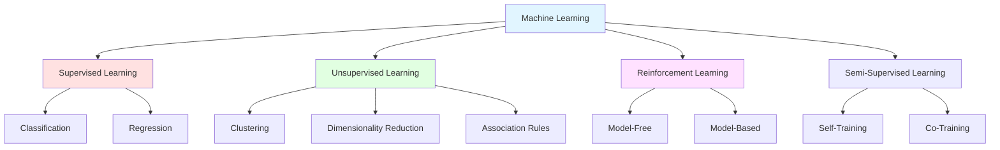
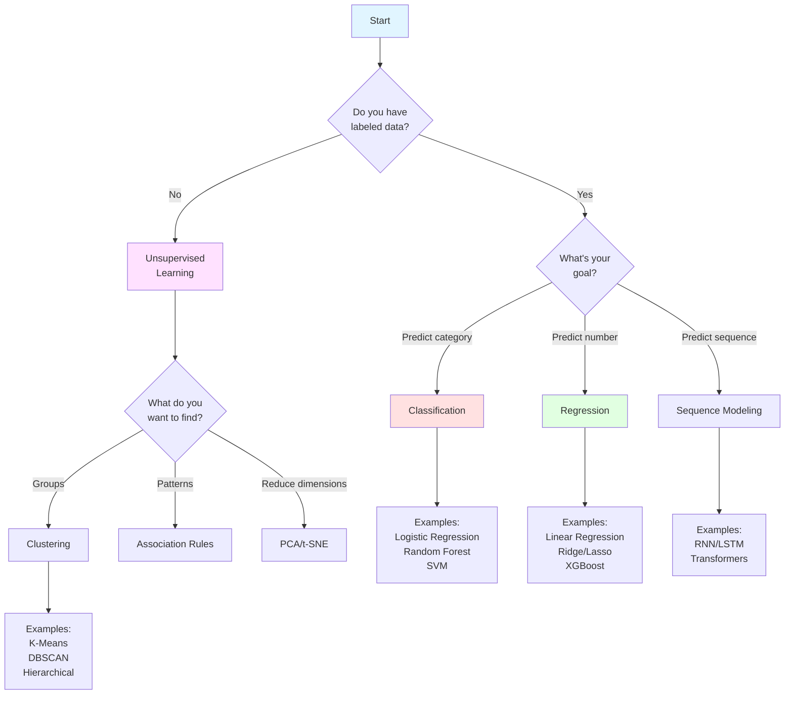
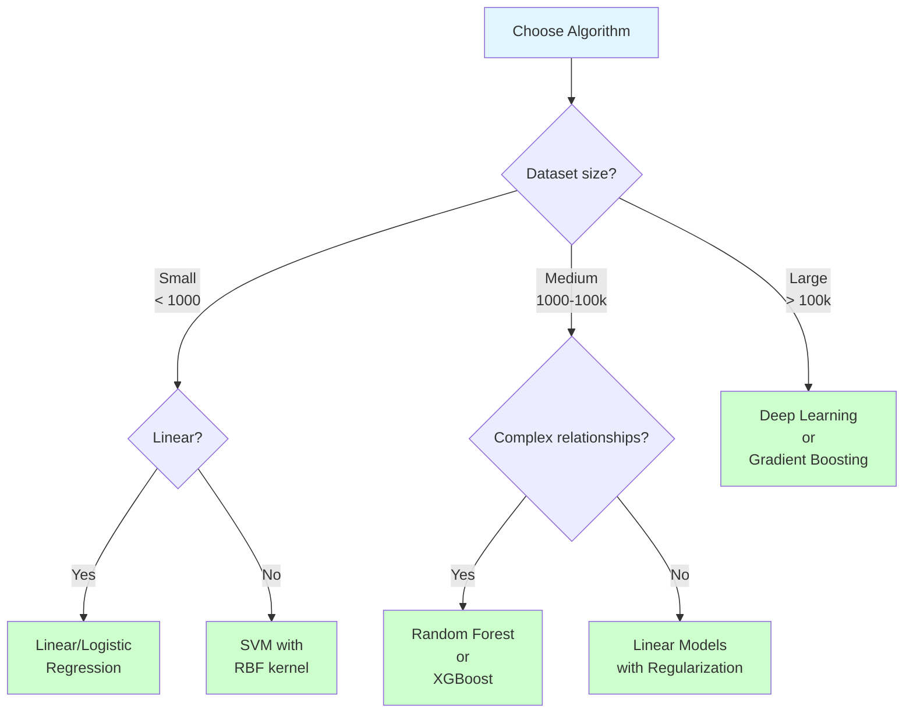

# Machine Learning Fundamentals: The Definitive Guide

## Introduction

Machine Learning (ML) is a subset of artificial intelligence that enables computers to learn patterns from data and make predictions or decisions without being explicitly programmed for every scenario. This guide provides comprehensive coverage of ML fundamentals, combining theory with practical implementation.

## What You'll Learn

- Core concepts and types of machine learning
- Mathematical foundations and key algorithms
- Data preprocessing and feature engineering
- Model evaluation and optimization techniques
- Best practices and when to use different approaches

---

## Types of Machine Learning



### Comparison Table

| Aspect | Supervised Learning | Unsupervised Learning | Reinforcement Learning |
|--------|-------------------|---------------------|----------------------|
| **Data Type** | Labeled data (X, y) | Unlabeled data (X only) | Environment + Rewards |
| **Goal** | Predict output for new input | Discover patterns/structure | Maximize cumulative reward |
| **Examples** | Classification, Regression | Clustering, PCA | Game playing, Robotics |
| **Training** | Learn from labeled examples | Find hidden structure | Learn from trial and error |
| **Feedback** | Correct answers provided | No explicit feedback | Delayed rewards |
| **Use Cases** | Spam detection, Price prediction | Customer segmentation, Anomaly detection | AlphaGo, Self-driving cars |
| **Complexity** | Medium | Low to Medium | High |
| **Data Requirements** | Large labeled dataset | Large unlabeled dataset | Simulator or real environment |

---

=== "Core Concepts"

    ## Fundamental Principles

    ### 1. Learning from Data

    Machine learning models learn by finding patterns in data. The learning process involves:

    **Training Phase:**
    ```python
    # Pseudocode for ML training
    model = initialize_model()
    for epoch in range(num_epochs):
        for batch in training_data:
            predictions = model.predict(batch.X)
            loss = compute_loss(predictions, batch.y)
            gradients = compute_gradients(loss)
            model.update_parameters(gradients)
    ```

    **Mathematical Formulation:**

    Given training data $D = \{(x_1, y_1), (x_2, y_2), ..., (x_n, y_n)\}$, we want to find a function $f$ such that:

    $$f(x_i) \approx y_i \text{ for all } i$$

    We optimize this by minimizing a loss function:

    $$\theta^* = \arg\min_\theta \frac{1}{n}\sum_{i=1}^{n} L(f_\theta(x_i), y_i)$$

    ### 2. Bias-Variance Tradeoff

    ```mermaid
    graph LR
        A[Total Error] --> B[Bias²]
        A --> C[Variance]
        A --> D[Irreducible Error]

        B --> E[Underfitting<br/>Too Simple Model]
        C --> F[Overfitting<br/>Too Complex Model]

        G[Optimal Model] --> H[Balanced<br/>Bias & Variance]

        style E fill:#ffcccc
        style F fill:#ffcccc
        style G fill:#ccffcc
    ```

    **Mathematical Definition:**

    $$\text{Expected Test Error} = \text{Bias}^2 + \text{Variance} + \text{Irreducible Error}$$

    Where:
    - **Bias**: Error from wrong assumptions in the learning algorithm
    - **Variance**: Error from sensitivity to small fluctuations in training data
    - **Irreducible Error**: Noise in the data itself

    **Python Example:**

    ```python
    import numpy as np
    import matplotlib.pyplot as plt
    from sklearn.model_selection import learning_curve
    from sklearn.tree import DecisionTreeRegressor

    def demonstrate_bias_variance_tradeoff():
        # Generate synthetic data
        np.random.seed(42)
        X = np.sort(5 * np.random.rand(100, 1), axis=0)
        y = np.sin(X).ravel() + np.random.normal(0, 0.1, X.shape[0])

        # Three models with different complexity
        models = {
            'High Bias (Underfitting)': DecisionTreeRegressor(max_depth=1),
            'Balanced': DecisionTreeRegressor(max_depth=5),
            'High Variance (Overfitting)': DecisionTreeRegressor(max_depth=20)
        }

        for name, model in models.items():
            model.fit(X, y)
            predictions = model.predict(X)
            mse = np.mean((y - predictions) ** 2)
            print(f"{name}: MSE = {mse:.4f}")

    # Run demonstration
    demonstrate_bias_variance_tradeoff()
    ```

    ### 3. The Machine Learning Pipeline

    ```mermaid
    flowchart TD
        A[Raw Data] --> B[Data Collection]
        B --> C[Data Preprocessing]
        C --> D[Feature Engineering]
        D --> E[Train/Test Split]
        E --> F[Model Selection]
        F --> G[Training]
        G --> H[Validation]
        H --> I{Performance<br/>Acceptable?}
        I -->|No| J[Hyperparameter Tuning]
        J --> G
        I -->|Yes| K[Final Evaluation]
        K --> L[Deployment]
        L --> M[Monitoring]
        M --> N{Drift<br/>Detected?}
        N -->|Yes| A
        N -->|No| M

        style A fill:#e1f5ff
        style L fill:#ccffcc
        style I fill:#ffffcc
        style N fill:#ffffcc
    ```

    ### 4. Overfitting vs Underfitting

    **Visual Representation:**

    | Underfitting | Good Fit | Overfitting |
    |--------------|----------|-------------|
    | High bias | Balanced | High variance |
    | Too simple | Appropriate complexity | Too complex |
    | Poor on train & test | Good on both | Great on train, poor on test |

    **Code Example:**

    ```python
    import numpy as np
    from sklearn.preprocessing import PolynomialFeatures
    from sklearn.linear_model import LinearRegression
    from sklearn.metrics import mean_squared_error
    from sklearn.model_selection import train_test_split

    # Generate data
    np.random.seed(0)
    X = np.sort(np.random.rand(100, 1) * 10, axis=0)
    y = np.sin(X).ravel() + np.random.normal(0, 0.5, X.shape[0])

    X_train, X_test, y_train, y_test = train_test_split(
        X, y, test_size=0.3, random_state=42
    )

    # Test different polynomial degrees
    degrees = [1, 4, 15]  # Underfitting, Good, Overfitting

    for degree in degrees:
        # Transform features
        poly = PolynomialFeatures(degree=degree)
        X_train_poly = poly.fit_transform(X_train)
        X_test_poly = poly.transform(X_test)

        # Train model
        model = LinearRegression()
        model.fit(X_train_poly, y_train)

        # Evaluate
        train_pred = model.predict(X_train_poly)
        test_pred = model.predict(X_test_poly)

        train_mse = mean_squared_error(y_train, train_pred)
        test_mse = mean_squared_error(y_test, test_pred)

        print(f"Degree {degree}:")
        print(f"  Train MSE: {train_mse:.4f}")
        print(f"  Test MSE:  {test_mse:.4f}")
        print(f"  Gap:       {abs(test_mse - train_mse):.4f}\n")
    ```

    ### 5. Generalization

    **Concept:** A model's ability to perform well on unseen data.

    **Key Principle:**

    $$\text{Generalization Error} = \text{Training Error} + \text{Gap}$$

    Where the gap represents how well the model transfers to new data.

    **Techniques to Improve Generalization:**

    1. **Regularization** - Add penalty for model complexity
    2. **Cross-Validation** - Use multiple train/test splits
    3. **Early Stopping** - Stop training before overfitting
    4. **Data Augmentation** - Increase training data diversity
    5. **Dropout** - Randomly disable neurons (neural networks)
    6. **Ensemble Methods** - Combine multiple models

=== "Mathematics"

    ## Mathematical Foundations

    ### Linear Algebra Essentials

    #### Vectors and Matrices

    **Vectors** represent data points or features:

    $$\mathbf{x} = \begin{bmatrix} x_1 \\ x_2 \\ \vdots \\ x_n \end{bmatrix}$$

    **Matrices** represent datasets or transformations:

    $$\mathbf{X} = \begin{bmatrix}
    x_{11} & x_{12} & \cdots & x_{1n} \\
    x_{21} & x_{22} & \cdots & x_{2n} \\
    \vdots & \vdots & \ddots & \vdots \\
    x_{m1} & x_{m2} & \cdots & x_{mn}
    \end{bmatrix}$$

    ```python
    import numpy as np

    # Vectors
    x = np.array([1, 2, 3])
    y = np.array([4, 5, 6])

    # Dot product
    dot_product = np.dot(x, y)  # 1*4 + 2*5 + 3*6 = 32

    # Matrices
    X = np.array([[1, 2, 3],
                  [4, 5, 6],
                  [7, 8, 9]])

    # Matrix operations
    X_transpose = X.T
    X_inverse = np.linalg.inv(X + np.eye(3) * 0.01)  # Add small value for stability

    print(f"Dot product: {dot_product}")
    print(f"Matrix shape: {X.shape}")
    print(f"Transpose shape: {X_transpose.shape}")
    ```

    #### Key Operations

    1. **Matrix Multiplication:**

    $$(\mathbf{AB})_{ij} = \sum_{k=1}^{n} a_{ik}b_{kj}$$

    2. **Matrix Transpose:**

    $$(\mathbf{A}^T)_{ij} = a_{ji}$$

    3. **Matrix Inverse:**

    $$\mathbf{A}\mathbf{A}^{-1} = \mathbf{I}$$

    ### Calculus for Optimization

    #### Gradients and Derivatives

    **Single Variable:**

    $$\frac{df}{dx} = \lim_{h \to 0} \frac{f(x+h) - f(x)}{h}$$

    **Multivariable (Gradient):**

    $$\nabla f(\mathbf{x}) = \begin{bmatrix}
    \frac{\partial f}{\partial x_1} \\
    \frac{\partial f}{\partial x_2} \\
    \vdots \\
    \frac{\partial f}{\partial x_n}
    \end{bmatrix}$$

    ```python
    import numpy as np

    def gradient_descent_demo():
        # Function: f(x) = (x - 3)^2
        def f(x):
            return (x - 3) ** 2

        def df_dx(x):
            return 2 * (x - 3)

        # Gradient descent
        x = 0.0  # Starting point
        learning_rate = 0.1
        iterations = 50

        history = [x]
        for i in range(iterations):
            gradient = df_dx(x)
            x = x - learning_rate * gradient
            history.append(x)

        print(f"Started at: {history[0]:.4f}")
        print(f"Ended at: {history[-1]:.4f}")
        print(f"Minimum is at x=3, found: {history[-1]:.4f}")

        return history

    history = gradient_descent_demo()
    ```

    #### Gradient Descent

    **Update Rule:**

    $$\theta_{t+1} = \theta_t - \eta \nabla L(\theta_t)$$

    Where:
    - $\theta$ = model parameters
    - $\eta$ = learning rate
    - $\nabla L$ = gradient of loss function

    **Variants:**

    | Method | Update Rule | Pros | Cons |
    |--------|------------|------|------|
    | **Batch GD** | Use all data | Stable convergence | Slow for large datasets |
    | **Stochastic GD** | Use one sample | Fast, can escape local minima | Noisy updates |
    | **Mini-batch GD** | Use small batches | Balanced speed/stability | Requires batch size tuning |

    ```python
    import numpy as np

    class GradientDescentOptimizer:
        def __init__(self, learning_rate=0.01):
            self.lr = learning_rate

        def batch_gradient_descent(self, X, y, weights, gradient_fn):
            """Update using all data"""
            gradient = gradient_fn(X, y, weights)
            return weights - self.lr * gradient

        def stochastic_gradient_descent(self, X, y, weights, gradient_fn):
            """Update using one random sample"""
            idx = np.random.randint(len(X))
            gradient = gradient_fn(X[idx:idx+1], y[idx:idx+1], weights)
            return weights - self.lr * gradient

        def mini_batch_gradient_descent(self, X, y, weights, gradient_fn, batch_size=32):
            """Update using random mini-batch"""
            indices = np.random.choice(len(X), batch_size, replace=False)
            gradient = gradient_fn(X[indices], y[indices], weights)
            return weights - self.lr * gradient

    # Example usage
    def compute_gradient(X, y, weights):
        """Gradient for linear regression: X^T(Xw - y)"""
        predictions = X @ weights
        errors = predictions - y
        return (X.T @ errors) / len(X)

    # Demo
    np.random.seed(42)
    X = np.random.randn(100, 5)
    y = np.random.randn(100)
    weights = np.random.randn(5)

    optimizer = GradientDescentOptimizer(learning_rate=0.01)
    weights_new = optimizer.batch_gradient_descent(X, y, weights, compute_gradient)
    print(f"Weights updated from {weights[0]:.4f} to {weights_new[0]:.4f}")
    ```

    ### Probability and Statistics

    #### Probability Distributions

    **Normal Distribution:**

    $$p(x) = \frac{1}{\sqrt{2\pi\sigma^2}} e^{-\frac{(x-\mu)^2}{2\sigma^2}}$$

    ```python
    import numpy as np
    from scipy import stats
    import matplotlib.pyplot as plt

    # Generate normal distribution
    mu, sigma = 0, 1
    x = np.linspace(-4, 4, 100)
    y = stats.norm.pdf(x, mu, sigma)

    # Sample from distribution
    samples = np.random.normal(mu, sigma, 1000)

    print(f"Theoretical mean: {mu}, Sample mean: {np.mean(samples):.4f}")
    print(f"Theoretical std: {sigma}, Sample std: {np.std(samples):.4f}")
    ```

    #### Statistical Measures

    **Mean (Expected Value):**

    $$\mu = E[X] = \frac{1}{n}\sum_{i=1}^{n} x_i$$

    **Variance:**

    $$\sigma^2 = \text{Var}(X) = E[(X - \mu)^2] = \frac{1}{n}\sum_{i=1}^{n}(x_i - \mu)^2$$

    **Standard Deviation:**

    $$\sigma = \sqrt{\text{Var}(X)}$$

    **Covariance:**

    $$\text{Cov}(X, Y) = E[(X - \mu_X)(Y - \mu_Y)]$$

    **Correlation:**

    $$\rho(X, Y) = \frac{\text{Cov}(X, Y)}{\sigma_X \sigma_Y}$$

    ```python
    import numpy as np
    import pandas as pd

    # Create sample data
    data = {
        'feature1': np.random.randn(100),
        'feature2': np.random.randn(100),
        'target': np.random.randn(100)
    }
    df = pd.DataFrame(data)

    # Statistical measures
    print("Means:")
    print(df.mean())
    print("\nVariances:")
    print(df.var())
    print("\nStandard Deviations:")
    print(df.std())
    print("\nCorrelation Matrix:")
    print(df.corr())
    ```

    #### Bayes' Theorem

    $$P(A|B) = \frac{P(B|A)P(A)}{P(B)}$$

    Used extensively in:
    - Naive Bayes classifiers
    - Bayesian optimization
    - Probabilistic graphical models

    ```python
    def bayes_theorem(p_b_given_a, p_a, p_b):
        """
        Calculate P(A|B) using Bayes' theorem

        Args:
            p_b_given_a: P(B|A) - likelihood
            p_a: P(A) - prior
            p_b: P(B) - evidence
        """
        return (p_b_given_a * p_a) / p_b

    # Example: Disease diagnosis
    # P(Disease|Positive Test) = ?
    p_positive_given_disease = 0.99  # Sensitivity
    p_disease = 0.01  # Prevalence
    p_positive = 0.05  # P(Positive test)

    p_disease_given_positive = bayes_theorem(
        p_positive_given_disease,
        p_disease,
        p_positive
    )

    print(f"P(Disease|Positive) = {p_disease_given_positive:.4f}")
    ```

=== "Data Preprocessing"

    ## Data Preparation Pipeline

    ### 1. Data Cleaning

    ```python
    import pandas as pd
    import numpy as np

    class DataCleaner:
        @staticmethod
        def handle_missing_values(df, strategy='mean'):
            """
            Handle missing values in dataset

            Strategies:
            - 'mean': Replace with column mean
            - 'median': Replace with column median
            - 'mode': Replace with most frequent value
            - 'drop': Remove rows with missing values
            - 'forward': Forward fill
            - 'backward': Backward fill
            """
            df_clean = df.copy()

            if strategy == 'drop':
                return df_clean.dropna()

            for col in df_clean.columns:
                if df_clean[col].isnull().any():
                    if strategy == 'mean':
                        df_clean[col].fillna(df_clean[col].mean(), inplace=True)
                    elif strategy == 'median':
                        df_clean[col].fillna(df_clean[col].median(), inplace=True)
                    elif strategy == 'mode':
                        df_clean[col].fillna(df_clean[col].mode()[0], inplace=True)
                    elif strategy == 'forward':
                        df_clean[col].fillna(method='ffill', inplace=True)
                    elif strategy == 'backward':
                        df_clean[col].fillna(method='bfill', inplace=True)

            return df_clean

        @staticmethod
        def remove_outliers(df, columns, method='iqr', threshold=1.5):
            """
            Remove outliers using IQR or Z-score method

            IQR Method: Remove points outside [Q1 - k*IQR, Q3 + k*IQR]
            Z-score Method: Remove points with |z| > threshold
            """
            df_clean = df.copy()

            for col in columns:
                if method == 'iqr':
                    Q1 = df_clean[col].quantile(0.25)
                    Q3 = df_clean[col].quantile(0.75)
                    IQR = Q3 - Q1
                    lower = Q1 - threshold * IQR
                    upper = Q3 + threshold * IQR
                    df_clean = df_clean[
                        (df_clean[col] >= lower) & (df_clean[col] <= upper)
                    ]
                elif method == 'zscore':
                    z_scores = np.abs(stats.zscore(df_clean[col]))
                    df_clean = df_clean[z_scores < threshold]

            return df_clean

    # Example usage
    # Create sample data with missing values and outliers
    data = {
        'age': [25, 30, np.nan, 35, 40, 150],  # 150 is outlier
        'salary': [50000, 60000, 55000, np.nan, 70000, 65000],
        'score': [85, 90, 88, 92, np.nan, 87]
    }
    df = pd.DataFrame(data)

    print("Original data:")
    print(df)

    # Clean data
    cleaner = DataCleaner()
    df_cleaned = cleaner.handle_missing_values(df, strategy='mean')
    df_cleaned = cleaner.remove_outliers(df_cleaned, ['age'], method='iqr')

    print("\nCleaned data:")
    print(df_cleaned)
    ```

    ### 2. Feature Scaling

    **Why Scale?**
    - Many algorithms are sensitive to feature scales
    - Gradient descent converges faster
    - Distance-based algorithms require normalized features

    #### Standardization (Z-score Normalization)

    $$x_{scaled} = \frac{x - \mu}{\sigma}$$

    ```python
    from sklearn.preprocessing import StandardScaler
    import numpy as np

    # Sample data
    X = np.array([[1, 2000],
                  [2, 3000],
                  [3, 4000],
                  [4, 5000]])

    scaler = StandardScaler()
    X_scaled = scaler.fit_transform(X)

    print("Original data:")
    print(X)
    print("\nStandardized data (mean=0, std=1):")
    print(X_scaled)
    print(f"\nMeans: {X_scaled.mean(axis=0)}")
    print(f"Stds: {X_scaled.std(axis=0)}")
    ```

    #### Min-Max Normalization

    $$x_{scaled} = \frac{x - x_{min}}{x_{max} - x_{min}}$$

    ```python
    from sklearn.preprocessing import MinMaxScaler

    scaler = MinMaxScaler(feature_range=(0, 1))
    X_normalized = scaler.fit_transform(X)

    print("Min-Max normalized (range 0-1):")
    print(X_normalized)
    print(f"\nMins: {X_normalized.min(axis=0)}")
    print(f"Maxs: {X_normalized.max(axis=0)}")
    ```

    #### Robust Scaling

    $$x_{scaled} = \frac{x - \text{median}}{\text{IQR}}$$

    ```python
    from sklearn.preprocessing import RobustScaler

    # Better for data with outliers
    scaler = RobustScaler()
    X_robust = scaler.fit_transform(X)

    print("Robust scaled:")
    print(X_robust)
    ```

    **When to Use Which?**

    | Scaler | Use When | Don't Use When |
    |--------|----------|----------------|
    | **StandardScaler** | Features are normally distributed | Features have many outliers |
    | **MinMaxScaler** | Need bounded values (e.g., neural nets) | Data has extreme outliers |
    | **RobustScaler** | Data has outliers | Need exactly [0,1] range |

    ### 3. Feature Engineering

    #### Creating New Features

    ```python
    import pandas as pd
    import numpy as np

    class FeatureEngineer:
        @staticmethod
        def create_polynomial_features(df, columns, degree=2):
            """Create polynomial features"""
            from sklearn.preprocessing import PolynomialFeatures

            poly = PolynomialFeatures(degree=degree, include_bias=False)
            poly_features = poly.fit_transform(df[columns])

            feature_names = poly.get_feature_names_out(columns)
            return pd.DataFrame(poly_features, columns=feature_names)

        @staticmethod
        def create_interaction_features(df, col1, col2):
            """Create interaction between two features"""
            return df[col1] * df[col2]

        @staticmethod
        def create_time_features(df, date_column):
            """Extract features from datetime"""
            df = df.copy()
            df[date_column] = pd.to_datetime(df[date_column])

            df['year'] = df[date_column].dt.year
            df['month'] = df[date_column].dt.month
            df['day'] = df[date_column].dt.day
            df['dayofweek'] = df[date_column].dt.dayofweek
            df['quarter'] = df[date_column].dt.quarter
            df['is_weekend'] = df['dayofweek'].isin([5, 6]).astype(int)

            return df

        @staticmethod
        def create_binned_features(df, column, bins, labels=None):
            """Create categorical bins from continuous features"""
            return pd.cut(df[column], bins=bins, labels=labels)

    # Example
    data = {
        'age': [25, 35, 45, 55],
        'income': [50000, 75000, 100000, 125000],
        'date': ['2024-01-15', '2024-06-20', '2024-12-10', '2025-03-01']
    }
    df = pd.DataFrame(data)

    engineer = FeatureEngineer()

    # Polynomial features
    poly_features = engineer.create_polynomial_features(df, ['age', 'income'], degree=2)
    print("Polynomial features:")
    print(poly_features.head())

    # Interaction
    df['age_income_interaction'] = engineer.create_interaction_features(df, 'age', 'income')

    # Time features
    df_with_time = engineer.create_time_features(df, 'date')
    print("\nTime features:")
    print(df_with_time[['date', 'year', 'month', 'is_weekend']])

    # Binning
    df['age_group'] = engineer.create_binned_features(
        df, 'age',
        bins=[0, 30, 50, 100],
        labels=['Young', 'Middle', 'Senior']
    )
    print("\nAge groups:")
    print(df[['age', 'age_group']])
    ```

    ### 4. Encoding Categorical Variables

    #### One-Hot Encoding

    ```python
    import pandas as pd
    from sklearn.preprocessing import OneHotEncoder

    # Sample categorical data
    data = {
        'color': ['red', 'blue', 'green', 'red', 'blue'],
        'size': ['S', 'M', 'L', 'M', 'S']
    }
    df = pd.DataFrame(data)

    # Method 1: pandas get_dummies
    df_encoded = pd.get_dummies(df, columns=['color', 'size'], prefix=['color', 'size'])
    print("One-hot encoded:")
    print(df_encoded)

    # Method 2: sklearn OneHotEncoder
    encoder = OneHotEncoder(sparse_output=False)
    encoded = encoder.fit_transform(df[['color', 'size']])
    encoded_df = pd.DataFrame(
        encoded,
        columns=encoder.get_feature_names_out(['color', 'size'])
    )
    print("\nUsing sklearn:")
    print(encoded_df)
    ```

    #### Label Encoding

    ```python
    from sklearn.preprocessing import LabelEncoder

    # For ordinal categories
    sizes = ['S', 'M', 'L', 'XL', 'S', 'M']

    encoder = LabelEncoder()
    sizes_encoded = encoder.fit_transform(sizes)

    print(f"Original: {sizes}")
    print(f"Encoded: {sizes_encoded}")
    print(f"Mapping: {dict(zip(encoder.classes_, encoder.transform(encoder.classes_)))}")
    ```

    #### Target Encoding

    ```python
    def target_encode(df, categorical_col, target_col):
        """
        Replace category with mean of target variable
        Useful for high-cardinality categorical features
        """
        target_means = df.groupby(categorical_col)[target_col].mean()
        return df[categorical_col].map(target_means)

    # Example
    data = {
        'city': ['NYC', 'LA', 'NYC', 'Chicago', 'LA', 'NYC'],
        'price': [300, 250, 320, 200, 240, 310]
    }
    df = pd.DataFrame(data)

    df['city_encoded'] = target_encode(df, 'city', 'price')
    print(df)
    ```

    ### 5. Handling Imbalanced Data

    ```python
    from sklearn.utils import resample
    from imblearn.over_sampling import SMOTE
    from imblearn.under_sampling import RandomUnderSampler

    class ImbalanceHandler:
        @staticmethod
        def random_oversample(X, y, random_state=42):
            """Randomly duplicate minority class samples"""
            from collections import Counter

            # Combine X and y
            df = pd.DataFrame(X)
            df['target'] = y

            # Separate classes
            majority = df[df.target == 0]
            minority = df[df.target == 1]

            # Oversample minority
            minority_upsampled = resample(
                minority,
                replace=True,
                n_samples=len(majority),
                random_state=random_state
            )

            # Combine
            balanced = pd.concat([majority, minority_upsampled])

            return balanced.drop('target', axis=1).values, balanced['target'].values

        @staticmethod
        def smote_oversample(X, y, random_state=42):
            """Synthetic Minority Over-sampling Technique"""
            smote = SMOTE(random_state=random_state)
            return smote.fit_resample(X, y)

        @staticmethod
        def random_undersample(X, y, random_state=42):
            """Randomly remove majority class samples"""
            rus = RandomUnderSampler(random_state=random_state)
            return rus.fit_resample(X, y)

    # Example
    from sklearn.datasets import make_classification

    # Create imbalanced dataset
    X, y = make_classification(
        n_samples=1000,
        n_classes=2,
        weights=[0.9, 0.1],  # 90% class 0, 10% class 1
        random_state=42
    )

    print(f"Original class distribution: {np.bincount(y)}")

    handler = ImbalanceHandler()

    # Try different methods
    X_over, y_over = handler.random_oversample(X, y)
    print(f"After oversampling: {np.bincount(y_over)}")

    X_smote, y_smote = handler.smote_oversample(X, y)
    print(f"After SMOTE: {np.bincount(y_smote)}")

    X_under, y_under = handler.random_undersample(X, y)
    print(f"After undersampling: {np.bincount(y_under)}")
    ```

=== "Evaluation Metrics"

    ## Model Evaluation

    ### Train/Validation/Test Split

    ```mermaid
    graph TD
        A[Complete Dataset] --> B[Training Set<br/>60-80%]
        A --> C[Validation Set<br/>10-20%]
        A --> D[Test Set<br/>10-20%]

        B --> E[Train Model]
        E --> F[Tune Hyperparameters]
        C --> F
        F --> G[Final Evaluation]
        D --> G

        style B fill:#e1f5ff
        style C fill:#ffe1e1
        style D fill:#e1ffe1
    ```

    **Purpose of Each Split:**

    | Split | Purpose | Use For | Don't Use For |
    |-------|---------|---------|---------------|
    | **Training** | Learn patterns | Fitting model parameters | Hyperparameter tuning |
    | **Validation** | Tune model | Hyperparameter selection, model selection | Final evaluation |
    | **Test** | Final assessment | Reporting final metrics | Any training decisions |

    ```python
    from sklearn.model_selection import train_test_split

    # Split data into train/validation/test
    def split_data(X, y, train_size=0.7, val_size=0.15, test_size=0.15, random_state=42):
        """
        Split data into train, validation, and test sets
        """
        assert abs(train_size + val_size + test_size - 1.0) < 1e-6, "Sizes must sum to 1"

        # First split: separate test set
        X_temp, X_test, y_temp, y_test = train_test_split(
            X, y, test_size=test_size, random_state=random_state
        )

        # Second split: separate train and validation
        val_size_adjusted = val_size / (train_size + val_size)
        X_train, X_val, y_train, y_val = train_test_split(
            X_temp, y_temp, test_size=val_size_adjusted, random_state=random_state
        )

        return X_train, X_val, X_test, y_train, y_val, y_test

    # Example
    from sklearn.datasets import make_classification

    X, y = make_classification(n_samples=1000, n_features=20, random_state=42)
    X_train, X_val, X_test, y_train, y_val, y_test = split_data(X, y)

    print(f"Training set: {len(X_train)} samples")
    print(f"Validation set: {len(X_val)} samples")
    print(f"Test set: {len(X_test)} samples")
    ```

    ### Cross-Validation

    ```mermaid
    graph TD
        A[Dataset] --> B[Fold 1: Test]
        A --> C[Fold 2: Test]
        A --> D[Fold 3: Test]
        A --> E[Fold 4: Test]
        A --> F[Fold 5: Test]

        B --> G[Train on Folds 2,3,4,5]
        C --> H[Train on Folds 1,3,4,5]
        D --> I[Train on Folds 1,2,4,5]
        E --> J[Train on Folds 1,2,3,5]
        F --> K[Train on Folds 1,2,3,4]

        G --> L[Average<br/>Performance]
        H --> L
        I --> L
        J --> L
        K --> L

        style A fill:#e1f5ff
        style L fill:#ccffcc
    ```

    ```python
    from sklearn.model_selection import cross_val_score, KFold, StratifiedKFold
    from sklearn.linear_model import LogisticRegression
    import numpy as np

    # Sample data
    X, y = make_classification(n_samples=1000, n_features=20, random_state=42)

    # Model
    model = LogisticRegression(max_iter=1000)

    # K-Fold Cross-Validation
    kfold = KFold(n_splits=5, shuffle=True, random_state=42)
    scores = cross_val_score(model, X, y, cv=kfold, scoring='accuracy')

    print("K-Fold Cross-Validation:")
    print(f"Scores: {scores}")
    print(f"Mean: {scores.mean():.4f}")
    print(f"Std: {scores.std():.4f}")

    # Stratified K-Fold (maintains class distribution)
    skfold = StratifiedKFold(n_splits=5, shuffle=True, random_state=42)
    scores_stratified = cross_val_score(model, X, y, cv=skfold, scoring='accuracy')

    print("\nStratified K-Fold Cross-Validation:")
    print(f"Scores: {scores_stratified}")
    print(f"Mean: {scores_stratified.mean():.4f}")
    print(f"Std: {scores_stratified.std():.4f}")
    ```

    ### Classification Metrics

    #### Confusion Matrix

    ```
                    Predicted
                    Neg    Pos
    Actual  Neg     TN     FP
            Pos     FN     TP
    ```

    ```python
    from sklearn.metrics import confusion_matrix, classification_report
    import seaborn as sns
    import matplotlib.pyplot as plt

    # Example predictions
    y_true = [0, 1, 0, 1, 1, 0, 1, 0, 0, 1]
    y_pred = [0, 1, 0, 1, 0, 0, 1, 1, 0, 1]

    # Confusion matrix
    cm = confusion_matrix(y_true, y_pred)
    print("Confusion Matrix:")
    print(cm)

    # Visualize
    # sns.heatmap(cm, annot=True, fmt='d', cmap='Blues')
    # plt.ylabel('Actual')
    # plt.xlabel('Predicted')
    # plt.show()

    # Classification report
    print("\nClassification Report:")
    print(classification_report(y_true, y_pred))
    ```

    #### Key Metrics

    **Accuracy:**
    $$\text{Accuracy} = \frac{TP + TN}{TP + TN + FP + FN}$$

    **Precision:**
    $$\text{Precision} = \frac{TP}{TP + FP}$$
    - "Of all positive predictions, how many were correct?"

    **Recall (Sensitivity):**
    $$\text{Recall} = \frac{TP}{TP + FN}$$
    - "Of all actual positives, how many did we catch?"

    **F1-Score:**
    $$F_1 = 2 \cdot \frac{\text{Precision} \cdot \text{Recall}}{\text{Precision} + \text{Recall}}$$

    ```python
    from sklearn.metrics import accuracy_score, precision_score, recall_score, f1_score

    def calculate_metrics(y_true, y_pred):
        """Calculate all classification metrics"""
        return {
            'accuracy': accuracy_score(y_true, y_pred),
            'precision': precision_score(y_true, y_pred),
            'recall': recall_score(y_true, y_pred),
            'f1': f1_score(y_true, y_pred)
        }

    metrics = calculate_metrics(y_true, y_pred)
    for name, value in metrics.items():
        print(f"{name.capitalize()}: {value:.4f}")
    ```

    #### ROC Curve and AUC

    ```python
    from sklearn.metrics import roc_curve, roc_auc_score, auc
    from sklearn.linear_model import LogisticRegression

    # Train model
    X, y = make_classification(n_samples=1000, random_state=42)
    X_train, X_test, y_train, y_test = train_test_split(X, y, test_size=0.3)

    model = LogisticRegression()
    model.fit(X_train, y_train)

    # Get prediction probabilities
    y_pred_proba = model.predict_proba(X_test)[:, 1]

    # Calculate ROC curve
    fpr, tpr, thresholds = roc_curve(y_test, y_pred_proba)
    roc_auc = auc(fpr, tpr)

    print(f"ROC AUC Score: {roc_auc:.4f}")

    # Plot would show:
    # - X-axis: False Positive Rate
    # - Y-axis: True Positive Rate
    # - Diagonal line: Random classifier (AUC = 0.5)
    # - Perfect classifier: AUC = 1.0
    ```

    ### Regression Metrics

    #### Mean Squared Error (MSE)
    $$\text{MSE} = \frac{1}{n}\sum_{i=1}^{n}(y_i - \hat{y}_i)^2$$

    #### Root Mean Squared Error (RMSE)
    $$\text{RMSE} = \sqrt{\frac{1}{n}\sum_{i=1}^{n}(y_i - \hat{y}_i)^2}$$

    #### Mean Absolute Error (MAE)
    $$\text{MAE} = \frac{1}{n}\sum_{i=1}^{n}|y_i - \hat{y}_i|$$

    #### R² Score (Coefficient of Determination)
    $$R^2 = 1 - \frac{\sum_{i=1}^{n}(y_i - \hat{y}_i)^2}{\sum_{i=1}^{n}(y_i - \bar{y})^2}$$

    ```python
    from sklearn.metrics import mean_squared_error, mean_absolute_error, r2_score
    from sklearn.linear_model import LinearRegression
    import numpy as np

    # Generate regression data
    X = np.random.randn(100, 5)
    y = X @ np.array([1, 2, 3, 4, 5]) + np.random.randn(100) * 0.5

    X_train, X_test, y_train, y_test = train_test_split(X, y, test_size=0.3)

    # Train model
    model = LinearRegression()
    model.fit(X_train, y_train)
    y_pred = model.predict(X_test)

    # Calculate metrics
    mse = mean_squared_error(y_test, y_pred)
    rmse = np.sqrt(mse)
    mae = mean_absolute_error(y_test, y_pred)
    r2 = r2_score(y_test, y_pred)

    print(f"MSE: {mse:.4f}")
    print(f"RMSE: {rmse:.4f}")
    print(f"MAE: {mae:.4f}")
    print(f"R² Score: {r2:.4f}")
    ```

    **When to Use Which Metric:**

    | Metric | Use When | Interpretation |
    |--------|----------|----------------|
    | **MSE** | Large errors are especially bad | Penalizes large errors heavily |
    | **RMSE** | Need same units as target | Interpretable in original units |
    | **MAE** | All errors equally important | Robust to outliers |
    | **R²** | Want relative performance | 1.0 = perfect, 0.0 = baseline |

---

## Decision Trees and Guidelines

### When to Use Which Type of Learning?



### Algorithm Selection Guide



---

## Best Practices and Tips

### Data Preparation

??? tip "Essential Data Practices"

    1. **Always Split Before Preprocessing**
       ```python
       # WRONG: Preprocessing before split leads to data leakage
       X_scaled = scaler.fit_transform(X)
       X_train, X_test = train_test_split(X_scaled)

       # RIGHT: Split first, then fit on train only
       X_train, X_test = train_test_split(X)
       X_train_scaled = scaler.fit_transform(X_train)
       X_test_scaled = scaler.transform(X_test)  # Note: transform only!
       ```

    2. **Handle Missing Data Thoughtfully**
       - Understand WHY data is missing
       - Missing patterns may be informative
       - Consider creating "is_missing" indicator features

    3. **Detect Data Leakage**
       ```python
       # Check for leakage
       def check_leakage(X_train, X_test):
           """Check if test data leaked into training"""
           # Check for duplicate rows
           train_set = set(map(tuple, X_train))
           test_set = set(map(tuple, X_test))
           overlap = train_set & test_set

           if overlap:
               print(f"WARNING: {len(overlap)} rows appear in both sets!")
               return True
           return False
       ```

### Model Training

??? tip "Training Best Practices"

    1. **Start Simple**
       - Begin with baseline models (e.g., logistic regression)
       - Gradually increase complexity
       - Measure improvement at each step

    2. **Use Random Seeds**
       ```python
       # For reproducibility
       np.random.seed(42)
       random.seed(42)
       tf.random.set_seed(42)
       ```

    3. **Monitor Training**
       ```python
       def train_with_monitoring(model, X_train, y_train, X_val, y_val, epochs=100):
           """Track training and validation metrics"""
           train_losses = []
           val_losses = []

           for epoch in range(epochs):
               # Training
               model.fit(X_train, y_train)
               train_pred = model.predict(X_train)
               train_loss = mean_squared_error(y_train, train_pred)

               # Validation
               val_pred = model.predict(X_val)
               val_loss = mean_squared_error(y_val, val_pred)

               train_losses.append(train_loss)
               val_losses.append(val_loss)

               # Early stopping check
               if val_loss > min(val_losses[:-1]) + 0.001:
                   print(f"Early stopping at epoch {epoch}")
                   break

           return train_losses, val_losses
       ```

### Hyperparameter Tuning

??? tip "Optimization Strategies"

    1. **Grid Search vs Random Search**
       ```python
       from sklearn.model_selection import GridSearchCV, RandomizedSearchCV
       from sklearn.ensemble import RandomForestClassifier

       # Grid Search: Exhaustive but slow
       param_grid = {
           'n_estimators': [100, 200, 300],
           'max_depth': [10, 20, 30],
           'min_samples_split': [2, 5, 10]
       }

       grid_search = GridSearchCV(
           RandomForestClassifier(),
           param_grid,
           cv=5,
           scoring='accuracy',
           n_jobs=-1
       )

       # Random Search: Faster, often good enough
       from scipy.stats import randint

       param_dist = {
           'n_estimators': randint(100, 500),
           'max_depth': randint(10, 50),
           'min_samples_split': randint(2, 20)
       }

       random_search = RandomizedSearchCV(
           RandomForestClassifier(),
           param_dist,
           n_iter=20,  # Number of random combinations
           cv=5,
           scoring='accuracy',
           n_jobs=-1
       )
       ```

    2. **Bayesian Optimization**
       ```python
       from skopt import BayesSearchCV

       # More efficient than random search
       bayes_search = BayesSearchCV(
           RandomForestClassifier(),
           {
               'n_estimators': (100, 500),
               'max_depth': (10, 50),
               'min_samples_split': (2, 20)
           },
           n_iter=32,
           cv=5
       )
       ```

### Common Pitfalls

??? warning "Mistakes to Avoid"

    1. **Data Leakage**
       - Fitting preprocessors on entire dataset
       - Using future information in time series
       - Including target variable in features

    2. **Overfitting**
       - Too complex model for data size
       - Training too long without validation
       - Not using regularization

    3. **Underfitting**
       - Model too simple for data complexity
       - Insufficient features
       - Over-regularization

    4. **Wrong Metrics**
       - Using accuracy on imbalanced data
       - Not considering business context
       - Optimizing for wrong objective

    5. **Not Understanding Your Data**
       - Skipping exploratory data analysis
       - Ignoring domain knowledge
       - Not visualizing distributions

---

## Interactive Examples

### Complete ML Pipeline

```python
import numpy as np
import pandas as pd
from sklearn.datasets import make_classification
from sklearn.model_selection import train_test_split, cross_val_score
from sklearn.preprocessing import StandardScaler
from sklearn.ensemble import RandomForestClassifier
from sklearn.metrics import classification_report, confusion_matrix

class MLPipeline:
    """Complete end-to-end ML pipeline"""

    def __init__(self, model=None):
        self.model = model or RandomForestClassifier(random_state=42)
        self.scaler = StandardScaler()
        self.feature_names = None

    def prepare_data(self, X, y, test_size=0.2):
        """Split and preprocess data"""
        # Split data
        X_train, X_test, y_train, y_test = train_test_split(
            X, y, test_size=test_size, random_state=42, stratify=y
        )

        # Scale features
        X_train_scaled = self.scaler.fit_transform(X_train)
        X_test_scaled = self.scaler.transform(X_test)

        return X_train_scaled, X_test_scaled, y_train, y_test

    def train(self, X_train, y_train, cv_folds=5):
        """Train model with cross-validation"""
        # Cross-validation
        cv_scores = cross_val_score(
            self.model, X_train, y_train, cv=cv_folds, scoring='accuracy'
        )

        print(f"Cross-validation scores: {cv_scores}")
        print(f"Mean CV accuracy: {cv_scores.mean():.4f} (+/- {cv_scores.std():.4f})")

        # Train on full training set
        self.model.fit(X_train, y_train)

        return cv_scores

    def evaluate(self, X_test, y_test):
        """Evaluate model on test set"""
        y_pred = self.model.predict(X_test)

        print("\nConfusion Matrix:")
        print(confusion_matrix(y_test, y_pred))

        print("\nClassification Report:")
        print(classification_report(y_test, y_pred))

        return y_pred

    def run_pipeline(self, X, y):
        """Run complete pipeline"""
        print("=" * 50)
        print("MACHINE LEARNING PIPELINE")
        print("=" * 50)

        # Prepare data
        print("\n1. Preparing data...")
        X_train, X_test, y_train, y_test = self.prepare_data(X, y)
        print(f"Training set: {len(X_train)} samples")
        print(f"Test set: {len(X_test)} samples")

        # Train model
        print("\n2. Training model...")
        self.train(X_train, y_train)

        # Evaluate
        print("\n3. Evaluating on test set...")
        self.evaluate(X_test, y_test)

        print("\n" + "=" * 50)
        print("PIPELINE COMPLETE")
        print("=" * 50)

# Example usage
if __name__ == "__main__":
    # Generate sample data
    X, y = make_classification(
        n_samples=1000,
        n_features=20,
        n_informative=15,
        n_redundant=5,
        random_state=42
    )

    # Run pipeline
    pipeline = MLPipeline()
    pipeline.run_pipeline(X, y)
```

### Try It Yourself

```python
# Exercise 1: Compare different scalers
from sklearn.preprocessing import StandardScaler, MinMaxScaler, RobustScaler

def compare_scalers(X_train, X_test, y_train, y_test):
    """Compare performance with different scalers"""
    scalers = {
        'Standard': StandardScaler(),
        'MinMax': MinMaxScaler(),
        'Robust': RobustScaler()
    }

    results = {}
    for name, scaler in scalers.items():
        # Scale data
        X_train_scaled = scaler.fit_transform(X_train)
        X_test_scaled = scaler.transform(X_test)

        # Train model
        model = LogisticRegression(max_iter=1000)
        model.fit(X_train_scaled, y_train)

        # Evaluate
        score = model.score(X_test_scaled, y_test)
        results[name] = score
        print(f"{name} Scaler: {score:.4f}")

    return results

# Try it!
X, y = make_classification(n_samples=500, n_features=10, random_state=42)
X_train, X_test, y_train, y_test = train_test_split(X, y, test_size=0.3)
compare_scalers(X_train, X_test, y_train, y_test)
```

---

## Advanced Topics

??? abstract "Regularization Techniques"

    ### L1 Regularization (Lasso)

    $$L(\theta) = \text{MSE} + \lambda\sum_{i=1}^{n}|\theta_i|$$

    - Promotes sparsity (zeros out features)
    - Useful for feature selection

    ### L2 Regularization (Ridge)

    $$L(\theta) = \text{MSE} + \lambda\sum_{i=1}^{n}\theta_i^2$$

    - Shrinks coefficients toward zero
    - Better when all features are relevant

    ### Elastic Net

    $$L(\theta) = \text{MSE} + \lambda_1\sum_{i=1}^{n}|\theta_i| + \lambda_2\sum_{i=1}^{n}\theta_i^2$$

    - Combines L1 and L2
    - Handles correlated features better

    ```python
    from sklearn.linear_model import Lasso, Ridge, ElasticNet

    # Compare regularization methods
    models = {
        'Lasso': Lasso(alpha=0.1),
        'Ridge': Ridge(alpha=0.1),
        'ElasticNet': ElasticNet(alpha=0.1, l1_ratio=0.5)
    }

    for name, model in models.items():
        model.fit(X_train, y_train)
        score = model.score(X_test, y_test)
        n_features = np.sum(model.coef_ != 0)
        print(f"{name}: R² = {score:.4f}, Features used = {n_features}")
    ```

??? abstract "Dimensionality Reduction"

    ### Principal Component Analysis (PCA)

    ```python
    from sklearn.decomposition import PCA
    import matplotlib.pyplot as plt

    # Fit PCA
    pca = PCA()
    pca.fit(X)

    # Explained variance
    explained_variance = pca.explained_variance_ratio_
    cumulative_variance = np.cumsum(explained_variance)

    # How many components for 95% variance?
    n_components_95 = np.argmax(cumulative_variance >= 0.95) + 1
    print(f"Components for 95% variance: {n_components_95}")

    # Transform data
    pca = PCA(n_components=n_components_95)
    X_reduced = pca.fit_transform(X)

    print(f"Original shape: {X.shape}")
    print(f"Reduced shape: {X_reduced.shape}")
    ```

??? abstract "Ensemble Methods"

    ### Bagging (Bootstrap Aggregating)

    ```python
    from sklearn.ensemble import BaggingClassifier
    from sklearn.tree import DecisionTreeClassifier

    bagging = BaggingClassifier(
        estimator=DecisionTreeClassifier(),
        n_estimators=100,
        random_state=42
    )
    bagging.fit(X_train, y_train)
    ```

    ### Boosting

    ```python
    from sklearn.ensemble import GradientBoostingClassifier

    boosting = GradientBoostingClassifier(
        n_estimators=100,
        learning_rate=0.1,
        random_state=42
    )
    boosting.fit(X_train, y_train)
    ```

    ### Stacking

    ```python
    from sklearn.ensemble import StackingClassifier
    from sklearn.linear_model import LogisticRegression
    from sklearn.tree import DecisionTreeClassifier
    from sklearn.svm import SVC

    estimators = [
        ('dt', DecisionTreeClassifier()),
        ('svm', SVC(probability=True))
    ]

    stacking = StackingClassifier(
        estimators=estimators,
        final_estimator=LogisticRegression()
    )
    stacking.fit(X_train, y_train)
    ```

---

## Practical Cheat Sheet

### Quick Reference Table

| Task | First Try | If Not Working | Advanced |
|------|-----------|----------------|----------|
| **Classification** | Logistic Regression | Random Forest | XGBoost, Neural Net |
| **Regression** | Linear Regression | Ridge/Lasso | Gradient Boosting |
| **Clustering** | K-Means | DBSCAN | Hierarchical |
| **Dimensionality Reduction** | PCA | t-SNE | UMAP |
| **Feature Selection** | Correlation | L1 Regularization | Recursive Feature Elimination |
| **Imbalanced Data** | Class Weights | SMOTE | Ensemble Methods |

### Code Snippets Library

```python
# Quick model comparison
from sklearn.ensemble import RandomForestClassifier
from sklearn.linear_model import LogisticRegression
from sklearn.svm import SVC
from sklearn.naive_bayes import GaussianNB

def quick_comparison(X_train, X_test, y_train, y_test):
    """Compare multiple models quickly"""
    models = {
        'Logistic Regression': LogisticRegression(max_iter=1000),
        'Random Forest': RandomForestClassifier(n_estimators=100),
        'SVM': SVC(),
        'Naive Bayes': GaussianNB()
    }

    results = {}
    for name, model in models.items():
        model.fit(X_train, y_train)
        score = model.score(X_test, y_test)
        results[name] = score
        print(f"{name:20s}: {score:.4f}")

    best_model = max(results, key=results.get)
    print(f"\nBest model: {best_model}")
    return results
```

---

## Next Steps

Now that you understand the fundamentals, explore these topics:

1. **[ML Algorithms](../algorithms/index.md)** - Deep dive into specific algorithms
2. **[Deep Learning](../deep-learning/index.md)** - Neural networks and advanced architectures
3. **[Feature Engineering](../feature-engineering/index.md)** - Advanced feature creation techniques
4. **[Model Deployment](../mlops/index.md)** - Taking models to production
5. **[Time Series](../time-series/index.md)** - Temporal data analysis
6. **[NLP](../nlp/index.md)** - Natural language processing
7. **[Computer Vision](../computer-vision/index.md)** - Image and video analysis

---

## Additional Resources

### Books
- "Pattern Recognition and Machine Learning" by Christopher Bishop
- "The Elements of Statistical Learning" by Hastie, Tibshirani, and Friedman
- "Hands-On Machine Learning" by Aurélien Géron

### Online Courses
- Coursera: Andrew Ng's Machine Learning
- Fast.ai: Practical Deep Learning
- MIT OpenCourseWare: Introduction to Machine Learning

### Practice Platforms
- Kaggle - Competitions and datasets
- UCI Machine Learning Repository
- Google Dataset Search

---

**Remember:** Machine learning is as much art as science. Understanding theory is crucial, but practice and experimentation are what will make you proficient. Start with simple models, understand your data, and iterate!
